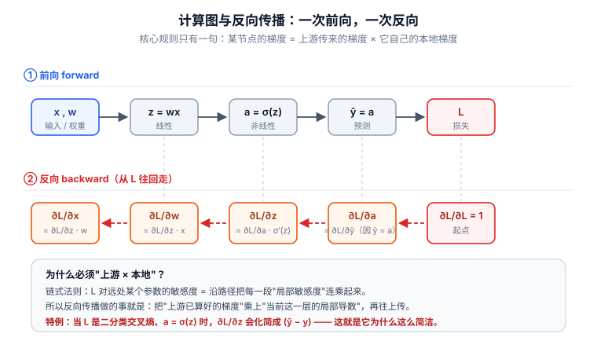

# 📘 第 2 周 · 反向传播与神经网络训练

> **本周目标**：从"能跑通"到"知道为什么能跑通"。学完你应该能：手推两层网络的梯度；说清梯度消失/过拟合/类别不平衡各自的原因；用混淆矩阵而非准确率评价模型。
>
> **本周知识清单**：B 域 22 条 + C 域 5 条
>
> **阶段位置**：本周是阶段一（Day 1-14）的收尾，学完即进入模型结构阶段。

[[深度学习学习总目录|← 返回总目录]]

---

## Day 8 —— 计算图与反向传播：上游梯度 × 本地梯度

> **一句话**：反向传播只有一条规则 —— **上游梯度乘本地梯度**。把这五个字想透，整个深度学习就没有黑箱了。

### 一、计算图：把运算串成有向无环图

```
x ──→ W₁ ──→ σ ──→ W₂ ──→ ŷ ──→ L
```

- **前向传播**：从左往右，算出输出和损失
- **反向传播**：从右往左，算出每个参数对损失的梯度

### 二、核心规则：上游梯度 × 本地梯度



> **看图说话**：上图是同一个网络的两条通路。**第一行（前向）**从左往右走：`x, w → z=wx → a=σ(z) → ŷ=a → L`，每一步都记住中间结果 —— 这是反向传播必须缓存中间量的原因。**第二行（反向）**从右往左走，每一步都是“**上游梯度 × 本地梯度**”。注意最左边 `∂L/∂x` 和 `∂L/∂w` 的区别：`w` 是要更新的参数，`x` 是要继续往前传的信号。图底那行是**特例**：当损失是二分类交叉熵、输出过 Sigmoid 时，`∂L/∂z` 会化简成 `(ŷ − y)` —— 这个漂亮的化简是“交叉熵 + Sigmoid”配对使用的关键收益，也是为什么分类任务几乎不用 MSE。


假设节点 `z` 有输出 `y`，要算 `∂L/∂z`：

```
∂L/∂z = (∂L/∂y) × (∂y/∂z)
         ↑            ↑
      上游梯度      本地梯度
```

**"上游梯度"** 是损失对这个节点输出的敏感度（从后面传回来的）。
**"本地梯度"** 是这个节点自身运算的导数（本地算出来的）。

每个节点只需做两件事：**把上游梯度乘以自己的本地梯度，再往下传。**

### 三、手推两层网络的梯度

网络结构：`x → W₁ → σ → W₂ → ŷ → L`，损失 `L = ½(ŷ - y)²`

**第 1 步**：`∂L/∂ŷ = ŷ - y`（本地梯度：平方损失的导数）

**第 2 步**：`∂L/∂W₂ = (∂L/∂ŷ) · h`，其中 `h = σ(W₁x)` 是隐藏层输出
> 因为 `ŷ = W₂·h`，所以 `∂ŷ/∂W₂ = h`

**第 3 步**：`∂L/∂h = (∂L/∂ŷ) · W₂`（继续往前传）

**第 4 步**：`∂L/∂(W₁x) = (∂L/∂h) · σ'(W₁x)`（穿过激活函数的导数）

**第 5 步**：`∂L/∂W₁ = (∂L/∂(W₁x)) · x`

> **注意第 4 步**：梯度要**乘以 σ 的导数**。而 Sigmoid 导数最大只有 0.25 —— 这就是梯度消失的数学根源。

### 四、梯度为什么会消失

每往前穿过一层，梯度就要乘上一个因子：

```
∂L/∂W₁ ∝ σ'(·) × σ'(·) × σ'(·) × ...
         └──── 每层一个，都小于 1 ────┘
```

Sigmoid 导数 ≤ 0.25，10 层就是 `0.25¹⁰ ≈ 1e-6` —— 浅层几乎收不到任何梯度信号。

**三条缓解路径**（后面几天会分别展开）：

| 路径 | 做法 | 对应天数 |
|---|---|---|
| 换激活函数 | ReLU 正区间导数恒为 1 | Day 9 |
| 换结构 | 残差连接让梯度"走捷径" | Day 18 |
| 换机制 | LSTM 门控 / 注意力 | Day 24 / 30 |

### 五、和电网安全的关系

梯度不只是训练工具。**如果攻击者能拿到你的模型梯度，他就能构造对抗样本** —— 因为对抗攻击本质上就是"沿着梯度方向扰动输入，让损失变大"。

这带来一个安全问题：**梯度泄漏 = 攻击能力**。联邦学习里为什么梯度也要加密保护，就是这个原因。

### 🔍 延伸思考

1. 如果把 Sigmoid 换成 ReLU，梯度还会消失吗？在什么区域仍会消失？
2. 反向传播要求"梯度能一路传回去"。如果某一层不可导（比如取整操作），会怎样？

### 📚 参考

- 李沐《动手学深度学习》第 5.3 节
- Rumelhart, Hinton & Williams (1986), *Learning representations by back-propagating errors*, Nature

### 🎬 视频讲解

> 以下为**关键词检索式**推荐（平台搜索结果，非固定视频链接，避免失效）。

| 平台 | 推荐搜索关键词 | 说明 |
|---|---|---|
| **B站** | [反向传播 手推 两层网络](https://search.bilibili.com/all?keyword=反向传播+手推+两层网络) | 跟着手推一遍梯度 |
| **B站** | [反向传播算法 可视化展示](https://search.bilibili.com/all?keyword=反向传播算法+可视化展示) | 可视化看梯度怎么回传 |
| **B站** | [计算图 梯度 流动 讲解](https://search.bilibili.com/all?keyword=计算图+梯度+流动+讲解) | 讲清"上游梯度×本地梯度" |
| **抖音** | [反向传播 五分钟 讲懂](https://www.douyin.com/search/反向传播+五分钟+讲懂) | 快速过一遍直觉 |

### ✅ 知识自查

- [ ] 🟢 **概念** 计算图：把运算串成有向无环图
- [ ] 🟢 **概念** 前向传播：按图计算输出
- [ ] 🟢 **概念** 反向传播：沿图反向，逐节点算梯度
- [ ] 🟢 **概念** **上游梯度 × 本地梯度** —— 这条乘法链是 BP 的全部
- [ ] 🟢 **推导** 手推两层网络 `z = W₂·σ(W₁·x)` 的完整梯度
- [ ] 🟡 **概念** 梯度消失：深层网络里梯度连乘导致指数衰减

---

## Day 9 —— 激活函数：为什么必须有非线性

> **一句话**：没有激活函数，再深的网络也等价于一层线性变换 —— **这是深度学习最容易被忽略的前提**。

### 一、为什么必须有非线性

```python
# 如果全是线性层
y = W₂ @ (W₁ @ x) = (W₂ @ W₁) @ x = W' @ x
```

两层线性叠加还是一个线性变换。**堆 100 层也没用**，表达能力等同于 1 层。

激活函数的作用：**在层与层之间引入非线性，把空间"掰弯"**。

### 二、四个主流激活函数

| 函数 | 公式 | 值域 | 导数最大值 | 主要问题 |
|---|---|---|---|---|
| **Sigmoid** | `1/(1+e⁻ˣ)` | (0, 1) | **0.25** | 梯度消失严重 |
| **Tanh** | `(eˣ-e⁻ˣ)/(eˣ+e⁻ˣ)` | (-1, 1) | 1.0 | 仍有梯度消失 |
| **ReLU** | `max(0, x)` | [0, ∞) | 1.0 | 死亡神经元 |
| **GELU** | `x·Φ(x)` | 约 (-0.17, ∞) | ~1.1 | 计算稍贵 |

**关键对比**：Sigmoid 导数最大 0.25，ReLU 在正区间导数**恒为 1**。这就是 ReLU 能缓解梯度消失的原因。

### 三、ReLU 的"死亡神经元"问题

如果某个神经元的输入**长期为负**，ReLU 输出恒为 0，梯度也恒为 0 —— 这个神经元**再也无法被更新**，等于死了。

**诱因**：学习率太大，一次更新把权重推到了"输入恒负"的区域。

**解法**：
- 用 LeakyReLU（负区间给一个小斜率，如 0.01）
- 调小学习率
- 用 GELU（负区间不是硬零）

### 四、输出层激活怎么选

| 任务 | 输出层激活 | 配合损失 |
|---|---|---|
| 二分类 | Sigmoid | BCEWithLogitsLoss |
| 多分类 | Softmax | CrossEntropyLoss |
| 回归 | **无**（直接输出） | MSELoss |

> **重要**：`nn.CrossEntropyLoss` **内部已经包含 Softmax**。如果模型输出层再加一个 Softmax，等于做了两次，训练会出问题。这是新手最常见的错误之一。

### 五、和电网安全的关系

电网量测数据里如果有**大量 0 或负值**（比如无功功率可能为负、开关状态用 0 表示），ReLU 的死亡神经元风险会更高。

**实践建议**：先做标准化（Day 13），让数据分布居中；或者直接用 GELU / LeakyReLU，避开这个坑。

### 🔍 延伸思考

1. 自己写代码验证"两层线性叠加等价于一层线性"。这个实验说明了什么？
2. 为什么 Transformer 用 GELU 而不用 ReLU？（提示：从平滑性和梯度特性想）

### 📚 参考

- 李沐《动手学深度学习》第 5.1 节「多层感知机」
- Hendrycks & Gimpel (2016), *Gaussian Error Linear Units (GELUs)*

### 🎬 视频讲解

> 以下为**关键词检索式**推荐（平台搜索结果，非固定视频链接，避免失效）。

| 平台 | 推荐搜索关键词 | 说明 |
|---|---|---|
| **B站** | [激活函数 sigmoid relu 对比 讲解](https://search.bilibili.com/all?keyword=激活函数+sigmoid+relu+对比+讲解) | 四个函数曲线与导数对比 |
| **B站** | [relu 死亡神经元 问题](https://search.bilibili.com/all?keyword=relu+死亡神经元+问题) | 解释为什么会"死" |
| **B站** | [为什么需要激活函数 非线性](https://search.bilibili.com/all?keyword=为什么需要激活函数+非线性) | 讲清"线性堆叠仍是线性" |
| **抖音** | [gelu relu 区别](https://www.douyin.com/search/gelu+relu+区别) | 快速对比 |

### ✅ 知识自查

- [ ] 🟢 **概念** 为什么必须有非线性（线性堆线性仍是线性，**自己验证**）
- [ ] 🟢 **概念** Sigmoid：`σ(x)=1/(1+e⁻ˣ)`，导数最大 0.25 → 易梯度消失
- [ ] 🟢 **概念** Tanh：零中心，但仍有梯度消失
- [ ] 🟢 **概念** ReLU：`max(0,x)`，正区间导数恒为 1 → 缓解梯度消失
- [ ] 🟢 **概念** ReLU 的"死亡神经元"问题
- [ ] 🟢 **概念** LeakyReLU / GELU 的改进点
- [ ] 🟢 **概念** 输出层激活的选择：二分类 Sigmoid / 多分类 Softmax / 回归 None

---

## Day 10 —— 多层感知机 MLP 完整实现

> **一句话**：今天你要走通人生第一个完整训练流程。这一步的价值不在于模型多强，而在于**五个动作的顺序和职责你都亲手验证过**。

### 一、`nn.Module` 的写法约定

```python
import torch.nn as nn

class MLP(nn.Module):
    def __init__(self, in_dim, hidden, out_dim):
        super().__init__()                     # 必须调用
        self.fc1 = nn.Linear(in_dim, hidden)   # 只定义层，不写逻辑
        self.fc2 = nn.Linear(hidden, out_dim)
        self.act = nn.ReLU()

    def forward(self, x):                      # 数据流写在这里
        return self.fc2(self.act(self.fc1(x)))
```

**约定**：`__init__` 里只定义层，`forward` 里写数据流。框架会自动调用 `forward`，**不要手动调 `model.forward(x)`**，直接 `model(x)`。

### 二、Dataset 与 DataLoader

```python
from torch.utils.data import Dataset, DataLoader

class MyDataset(Dataset):
    def __init__(self, X, y):
        self.X, self.y = X, y
    def __len__(self):                  # 必须实现
        return len(self.y)
    def __getitem__(self, i):           # 必须实现
        return self.X[i], self.y[i]

loader = DataLoader(ds, batch_size=32, shuffle=True)
```

| 参数 | 作用 |
|---|---|
| `batch_size` | 每批样本数，影响梯度噪声与显存 |
| `shuffle=True` | 训练时打乱，**验证/测试时必须 False** |

### 三、训练循环五步（再强调一次）

```python
for x, y in loader:
    optimizer.zero_grad()      # ① 清空梯度
    pred = model(x)            # ② 前向
    loss = criterion(pred, y)  # ③ 算损失
    loss.backward()            # ④ 反向
    optimizer.step()           # ⑤ 更新
```

> **顺序不能错**：清空 → 前向 → 损失 → 反向 → 更新。

### 四、评估时必须切换模式

```python
model.eval()                    # 关闭 Dropout / BatchNorm 训练行为
with torch.no_grad():           # 不建计算图，省显存
    for x, y in test_loader:
        pred = model(x)
        # 统计指标...
model.train()                   # 切回训练模式
```

**忘记 `model.eval()` 的后果**：Dropout 仍在随机丢神经元，验证结果会偏低且不稳定。

### 五、参数量统计

```python
total = sum(p.numel() for p in model.parameters())
trainable = sum(p.numel() for p in model.parameters() if p.requires_grad)
```

**为什么重要**：论文里必须报告参数量。参数量大而效果没提升，审稿人会质疑。

### 六、和电网安全的关系

把 MNIST 换成电力量测数据，输入层维度怎么定？

```
输入维度 = 特征数 × 时间步数
```

- 如果每条样本是 1 秒的 12 个节点电压量测，采样 10 次 → `12 × 10 = 120`
- 如果是 1 条报文的 20 个字段 → `20`

**形状想错，后面全错。** 这也是为什么 Day 2 要花一整天练形状。

### 🔍 延伸思考

1. 在 MNIST 上跑到 95% 后，如果把 `model.eval()` 去掉，测试准确率会怎么变？动手验证一下。
2. `batch_size` 从 32 改成 4，训练会有什么变化？（提示：梯度噪声、训练速度、显存）

### 📚 参考

- 李沐《动手学深度学习》第 5.5 节「多层的从零实现」与 5.6 节「简洁实现」

### 🎬 视频讲解

> 以下为**关键词检索式**推荐（平台搜索结果，非固定视频链接，避免失效）。

| 平台 | 推荐搜索关键词 | 说明 |
|---|---|---|
| **B站** | [PyTorch MLP MNIST 手写数字识别](https://search.bilibili.com/all?keyword=PyTorch+MLP+MNIST+手写数字识别) | 完整走一遍流程 |
| **B站** | [李沐 多层感知机 从零实现](https://search.bilibili.com/all?keyword=李沐+多层感知机+从零实现) | 官方课程，与本节对应 |
| **B站** | [PyTorch Dataset DataLoader 详解](https://search.bilibili.com/all?keyword=PyTorch+Dataset+DataLoader+详解) | 数据加载机制讲清楚 |
| **抖音** | [model.eval 有什么用](https://www.douyin.com/search/model.eval+有什么用) | 三分钟讲清训练/评估模式 |

### ✅ 知识自查

- [ ] 🟢 **API** `nn.Module` 的 `__init__` 与 `forward` 结构约定
- [ ] 🟢 **API** `nn.Linear(in, out)` 的参数含义与形状变换
- [ ] 🟢 **API** `nn.Sequential` 顺序容器
- [ ] 🟢 **API** `nn.ReLU` / `nn.Dropout` / `nn.Flatten`
- [ ] 🟢 **API** `Dataset` 类的三个必需方法：`__init__` / `__len__` / `__getitem__`
- [ ] 🟢 **API** `DataLoader(ds, batch_size, shuffle)` 的迭代行为
- [ ] 🟢 **API** 训练循环五步：`zero_grad` → `forward` → `loss` → `backward` → `step`
- [ ] 🟡 **API** 参数统计 `sum(p.numel() for p in model.parameters())`
- [ ] 🟡 **概念** 参数初始化：`kaiming` 配 ReLU、`xavier` 配 Tanh

**通关标准**：在 MNIST 上跑到**测试准确率 ≥ 95%**，且能画出损失曲线。

---

## Day 11 —— 损失函数与优化器：SGD / Momentum / Adam

> **一句话**：损失函数决定"往哪优化"，优化器决定"怎么走过去"。Adam 之所以几乎成了默认选项，是因为它对学习率不敏感。

### 一、损失函数的配对规则

| 任务 | 损失函数 | 输出层 |
|---|---|---|
| 多分类 | `nn.CrossEntropyLoss` | 无（内部含 Softmax） |
| 二分类 | `nn.BCEWithLogitsLoss` | 无（内部含 Sigmoid） |
| 回归 | `nn.MSELoss` / `nn.L1Loss` | 无 |

**为什么这么配对**：回顾 Day 6 的推导 —— 分类对应类别分布 → 交叉熵；回归对应高斯分布 → MSE。这是**概率论决定的**，不是随意选择。

### 二、三个优化器的演进

**SGD（随机梯度下降）**

```
w ← w - lr · g
```

最朴素：直接沿梯度反方向走。问题是容易在"峡谷地形"里反复震荡。

**Momentum（动量）**

```
v ← β·v + g          # 累积历史梯度
w ← w - lr · v
```

**直觉**：像小球滚下山，带上惯性。能加速穿过平坦区，抑制在陡壁间震荡。

**Adam（自适应矩估计）**

```
m ← β₁·m + (1-β₁)·g       # 一阶矩（梯度的均值）
v ← β₂·v + (1-β₂)·g²      # 二阶矩（梯度的方差）
w ← w - lr · m / (√v + ε)
```

**核心创新**：除以 `√v` 做**自适应学习率** —— 梯度大的参数步子变小，梯度小的参数步子变大。

### 三、学习率的量级直觉

| 学习率 | 现象 |
|---|---|
| `1e-1` | 通常太大，损失震荡或变 NaN |
| `1e-2` | 有时可用，SGD 常用 |
| `1e-3` | **Adam 默认值**，最常用 |
| `1e-4` | 微调时的常用值 |
| `1e-5` | 通常太小，收敛极慢 |

### 四、必做对照实验

同一模型，学习率取 `0.1 / 0.01 / 0.001` 各跑一遍，**把三条损失曲线画在同一张图上**。

你会直观看到：0.1 震荡不收敛，0.01 可能收敛，0.001 平稳但慢。**这一张图胜过十页理论。**

### 五、和电网安全的关系

安全场景对**收敛稳定性**要求很高 —— 模型每次训练结果差异太大，工程上不敢用。

**建议**：工业场景优先用 Adam（稳定、省调参），并在论文里报告**多种子的均值±标准差**（Day 52 会详细讲）。

### 🔍 延伸思考

1. Adam 对学习率不敏感，那是不是意味着学习率随便设就行？在什么情况下它仍会失败？
2. 如果损失曲线在前 10 个 epoch 快速下降然后完全不动，可能是哪里出了问题？

### 📚 参考

- Kingma & Ba (2015), *Adam: A Method for Stochastic Optimization*, ICLR
- 李沐《动手学深度学习》第 11.10 节「Adam」

### 🎬 视频讲解

> 以下为**关键词检索式**推荐（平台搜索结果，非固定视频链接，避免失效）。

| 平台 | 推荐搜索关键词 | 说明 |
|---|---|---|
| **B站** | [Adam SGD 优化器 区别 讲解](https://search.bilibili.com/all?keyword=Adam+SGD+优化器+区别+讲解) | 三个优化器对比 |
| **B站** | [动量 momentum 梯度下降 通俗](https://search.bilibili.com/all?keyword=动量+momentum+梯度下降+通俗) | 用小球滚下山类比 |
| **B站** | [学习率 怎么调 大小影响](https://search.bilibili.com/all?keyword=学习率+怎么调+大小影响) | 学会看损失曲线调 lr |
| **抖音** | [为什么都用 Adam](https://www.douyin.com/search/为什么都用+Adam) | 三分钟讲清原因 |

### ✅ 知识自查

- [ ] 🟢 **API** `nn.CrossEntropyLoss` —— 内部含 Softmax，**别再加一层**
- [ ] 🟢 **API** `nn.MSELoss` / `nn.L1Loss` / `nn.BCEWithLogitsLoss`
- [ ] 🟢 **概念** 分类用交叉熵、回归用 MSE 的**概率论原因**（回顾 Day 6）
- [ ] 🟢 **API** `optim.SGD(params, lr, momentum)`
- [ ] 🟢 **API** `optim.Adam(params, lr)` 及其默认学习率 1e-3
- [ ] 🟢 **概念** Momentum：用历史梯度做平滑，加速并抑制震荡
- [ ] 🟢 **概念** Adam：动量 + 自适应学习率
- [ ] 🟢 **API** 学习率调度器 `StepLR` / `CosineAnnealingLR`
- [ ] 🟢 **概念** 学习率量级直觉：1e-1 发散、1e-3 常用、1e-5 太慢

---

## Day 12 —— 过拟合与正则化：Dropout / 权重衰减 / 早停

> **一句话**：过拟合是模型"背答案"而不是"学规律"。三种正则化手段，本质都是**限制模型的记忆能力**。

### 一、三种拟合状态

| 状态 | 训练损失 | 验证损失 | 诊断 |
|---|---|---|---|
| **欠拟合** | 高 | 高 | 模型太简单 / 训练不够 |
| **恰好** | 低 | 低 | ✅ 目标 |
| **过拟合** | 很低 | 高 | 模型太复杂 / 数据太少 |

**过拟合的典型信号**：训练损失持续降，验证损失先降后升，两条曲线**分叉**。

### 二、亲手制造一次过拟合

```python
# 极小数据集 + 很大的模型
tiny_ds = Subset(train_ds, range(100))    # 只用 100 个样本
big_model = MLP(in_dim=784, hidden=2048, out_dim=10)  # 参数量巨大

# 训练 200 epoch，观察训练/验证损失分叉点
```

**看到分叉的那一刻，你才真正理解过拟合。** 光看定义是不够的。

### 三、三种正则化手段

**① Dropout**

```python
self.drop = nn.Dropout(p=0.5)   # 训练时随机丢弃 50% 神经元
```

- **只在训练时生效**，评估时自动关闭（所以要 `model.eval()`）
- 原理：随机失活 = 训练了多个子网络的**隐式集成**

**② 权重衰减（L2 正则）**

```python
optim.Adam(model.parameters(), lr=1e-3, weight_decay=1e-4)
```

给损失加上 `λ·Σw²` 惩罚项，抑制大权重。对应 Day 3 讲的 L2 范数。

**③ 早停（Early Stopping）**

```python
if val_loss < best_val_loss:
    best_val_loss = val_loss
    torch.save(model.state_dict(), "best.pt")
    patience_counter = 0
else:
    patience_counter += 1
    if patience_counter >= patience:    # 连续 N 轮不降就停
        break
```

**最省事的正则化** —— 不用改模型，不用改损失，只要监控验证损失。

### 四、三种手段的对比

| 手段 | 改哪里 | 优点 | 缺点 |
|---|---|---|---|
| Dropout | 模型结构 | 效果强 | 增加训练时间 |
| 权重衰减 | 优化器 | 实现简单 | 需要调 λ |
| 早停 | 训练循环 | 零侵入 | 需要验证集 |

### 五、和电网安全的关系

安全场景下**漏报和误报的代价不对称**：

- 漏报（攻击被判正常）→ 可能导致停电事故
- 误报（正常被判攻击）→ 运维疲于奔命

**对策**：给损失函数加权。`CrossEntropyLoss(weight=torch.tensor([1.0, 10.0]))` —— 让漏报的惩罚是误报的 10 倍。

这比单纯加正则化更贴近工业需求。**论文里如果能体现"代价敏感的损失设计"，是加分项。**

### 🔍 延伸思考

1. 为什么 Dropout 能防过拟合？"隐式集成"这个解释站得住吗？
2. 如果验证集本身太小（比如只有 20 个样本），早停还可靠吗？你会怎么做？

### 📚 参考

- Srivastava et al. (2014), *Dropout: A Simple Way to Prevent Neural Networks from Overfitting*, JMLR
- 李沐《动手学深度学习》第 4.6 节「暂退法」、第 3.7 节「权重衰减」

### 🎬 视频讲解

> 以下为**关键词检索式**推荐（平台搜索结果，非固定视频链接，避免失效）。

| 平台 | 推荐搜索关键词 | 说明 |
|---|---|---|
| **B站** | [过拟合 正则化 dropout 讲解](https://search.bilibili.com/all?keyword=过拟合+正则化+dropout+讲解) | 三种手段一起讲 |
| **B站** | [欠拟合 过拟合 判断 曲线](https://search.bilibili.com/all?keyword=欠拟合+过拟合+判断+曲线) | 学会看损失曲线诊断 |
| **B站** | [权重衰减 L2 正则 原理](https://search.bilibili.com/all?keyword=权重衰减+L2+正则+原理) | 讲清与 L2 范数的关系 |
| **抖音** | [早停 early stopping](https://www.douyin.com/search/早停+early+stopping) | 快速了解 |

### ✅ 知识自查

- [ ] 🟢 **概念** 欠拟合 / 过拟合 / 恰好的三种表现
- [ ] 🟢 **概念** 过拟合的典型信号：训练损失降、验证损失升
- [ ] 🟢 **API** Dropout：`nn.Dropout(p)`，只在训练时生效
- [ ] 🟢 **概念** Dropout 为什么能防过拟合（随机失活 = 隐式集成）
- [ ] 🟢 **API** 权重衰减：`optim.Adam(..., weight_decay=1e-4)`
- [ ] 🟢 **概念** 权重衰减与 L2 范数的对应关系
- [ ] 🟢 **API** 早停（Early Stopping）的实现逻辑：验证损失连续 N 轮不降就停
- [ ] 🟢 **API** 切换到评估模式 `model.eval()` —— **忘了它 Dropout 就不关**

---

## Day 13 —— 数据预处理与划分：标准化与类别不平衡

> **一句话**：模型效果不好，八成是数据的问题。这一天讲的标准化和类别不平衡，是**安全场景最容易踩的两个坑**。

### 一、标准化 vs 归一化

| 方法 | 公式 | 结果 |
|---|---|---|
| **标准化**（Standardization） | `(x - μ) / σ` | 均值 0，标准差 1 |
| **归一化**（Normalization） | `(x - min) / (max - min)` | 缩放到 [0, 1] |

**为什么必须做**：不同特征的量纲差异会让梯度下降走"之字形"，收敛极慢。比如电压是 220（百量级），功率因数是 0.9（个位数），不处理的话前者主导梯度。

### 二、一个必须遵守的规则

```python
# ✅ 正确：只用训练集统计量
mu, sigma = X_train.mean(), X_train.std()
X_train = (X_train - mu) / sigma
X_val   = (X_val - mu) / sigma      # 用训练集的 mu/sigma
X_test  = (X_test - mu) / sigma     # 同样用训练集的

# ❌ 错误：用全量数据算统计量
mu, sigma = X_all.mean(), X_all.std()   # 数据泄漏！
```

**为什么错**：测试集的统计信息"泄漏"进了训练过程，会让评估结果虚高。这是**数据泄漏（data leakage）**的典型形式。

### 三、训练 / 验证 / 测试 三划分

| 集合 | 比例 | 职责 | 禁忌 |
|---|---|---|---|
| **训练集** | 60-80% | 更新参数 | — |
| **验证集** | 10-20% | 调超参、早停、选模型 | 不能用来报最终结果 |
| **测试集** | 10-20% | **只报一次**最终结果 | **绝对不能参与调参** |

> **红线**：如果在测试集上调过参，那你报告的结果就是**乐观偏差**的，学术上不成立。

### 四、时序数据的划分禁忌

时序数据**不能随机打散**，必须按时间切：

```
[───── 训练 ─────][─ 验证 ─][─ 测试 ─]
      早期                    近期
```

**为什么**：随机打散会让模型"用未来预测过去"，属于严重的数据泄漏。电力负荷、报文序列全是时序数据，这条规则**必须遵守**。

### 五、类别不平衡：安全数据的常态

安全场景下，正常样本常占 **99%+**。这带来两个后果：

**后果一：准确率失去意义**

如果异常只占 0.1%，那么"全部预测为正常"的准确率是 **99.9%** —— 但模型完全没用。

**后果二：模型倾向于忽略少数类**

标准损失函数对多数类更敏感，模型会"躺平"全预测多数类。

**三种对策**：

| 对策 | 实现 | 适用 |
|---|---|---|
| **重采样** | `WeightedRandomSampler` 过采样少数类 | 数据量够 |
| **损失加权** | `CrossEntropyLoss(weight=...)` | 通用 |
| **换指标** | 用 PR-AUC 而非准确率 | **必须做** |

### 六、混淆矩阵：取代准确率

|  | 预测正常 | 预测异常 |
|---|---|---|
| **实际正常** | TN | FP（误报） |
| **实际异常** | FN（漏报） | TP |

```
准确率 Accuracy  = (TP+TN) / 全部
精确率 Precision = TP / (TP+FP)      报的里面有多少是真的
召回率 Recall    = TP / (TP+FN)      真的里面抓到了多少
F1              = 2PR / (P+R)        两者的调和平均
```

**安全场景通常优先保 Recall**（宁可误报，不可漏报），但也要看具体业务。

### 七、和电网安全的关系

这三条是**安全论文的必答题**：

1. 数据怎么标准化的？（不能用全量统计量）
2. 时序怎么划分的？（不能随机打散）
3. 不平衡怎么处理的？用什么指标？（不能只报准确率）

**任何一条答不上来，审稿人都会质疑实验有效性。**

### 🔍 延伸思考

1. 正常样本占 99.9% 时，全预测"正常"的准确率是多少？这个指标还有意义吗？
2. 如果测试集是时序数据但被打乱了，报出来的指标会偏高还是偏低？为什么？

### 📚 参考

- 李沐《动手学深度学习》第 4.4 节「模型选择、欠拟合和过拟合」

### 🎬 视频讲解

> 以下为**关键词检索式**推荐（平台搜索结果，非固定视频链接，避免失效）。

| 平台 | 推荐搜索关键词 | 说明 |
|---|---|---|
| **B站** | [数据标准化 归一化 区别 为什么](https://search.bilibili.com/all?keyword=数据标准化+归一化+区别+为什么) | 讲清两者差异与必要性 |
| **B站** | [类别不平衡 处理方法 异常检测](https://search.bilibili.com/all?keyword=类别不平衡+处理方法+异常检测) | 三种对策实操 |
| **B站** | [混淆矩阵 精确率 召回率 F1](https://search.bilibili.com/all?keyword=混淆矩阵+精确率+召回率+F1) | 指标计算讲透 |
| **抖音** | [数据泄漏 是什么](https://www.douyin.com/search/数据泄漏+是什么) | 三分钟理解为什么不能用全量统计量 |

### ✅ 知识自查

- [ ] 🟢 **概念** 标准化（减均值除标准差）vs 归一化（缩放到 [0,1]）
- [ ] 🟢 **概念** 为什么必须做：特征量纲差异会让梯度下降走之字形
- [ ] 🟢 **概念** **训练集的均值方差**，只能用到验证/测试集，不能反过来算
- [ ] 🟢 **概念** 训练 / 验证 / 测试 三划分的比例与职责
- [ ] 🟢 **概念** 测试集**绝对不能**参与调参
- [ ] 🟢 **概念** 类别不平衡：安全数据里正常样本常占 99%+
- [ ] 🟢 **API** 处理不平衡：`WeightedRandomSampler` / 损失加权 / 重采样
- [ ] 🟡 **概念** 时序数据的划分**不能随机打散**，要按时间切

---

## Day 14 —— 复盘 + 完整分类 pipeline

> **一句话**：今天把前 13 天串成一条完整流水线。跑通它，你就正式完成了阶段一 —— **从"会调库"变成"懂训练"**。

### 一、端到端流水线六步

```python
# ① 数据准备
X, y = load_data()
X_train, X_val, X_test, y_train, y_val, y_test = split(X, y)   # 时序要按时间切

# ② 标准化（只用训练集统计量）
mu, sigma = X_train.mean(0), X_train.std(0)
X_train, X_val, X_test = [(x - mu) / sigma for x in (X_train, X_val, X_test)]

# ③ 构建 Dataset / DataLoader
train_loader = DataLoader(MyDataset(X_train, y_train), 32, shuffle=True)
val_loader   = DataLoader(MyDataset(X_val,   y_val),   32, shuffle=False)

# ④ 模型 + 损失 + 优化器
model = MLP(in_dim, 128, out_dim)
criterion = nn.CrossEntropyLoss(weight=class_weights)   # 处理不平衡
optimizer = optim.Adam(model.parameters(), lr=1e-3, weight_decay=1e-4)

# ⑤ 训练循环（含早停）
best = float('inf'); patience = 0
for epoch in range(100):
    train_one_epoch(model, train_loader, criterion, optimizer)
    val_loss = evaluate(model, val_loader, criterion)
    if val_loss < best:
        best = val_loss; torch.save(model.state_dict(), "best.pt"); patience = 0
    else:
        patience += 1
        if patience >= 10: break

# ⑥ 加载最优模型，在测试集上评估（只做一次）
model.load_state_dict(torch.load("best.pt"))
report_metrics(model, test_loader)   # 混淆矩阵 + P/R/F1 + PR-AUC
```

### 二、模型保存的两种方式

```python
torch.save(model.state_dict(), "model.pt")      # ✅ 推荐：只存参数
torch.save(model, "model_full.pt")              # ❌ 存整个对象，依赖类定义

model.load_state_dict(torch.load("model.pt"))   # 加载（需先实例化模型）
```

**为什么推荐 `state_dict`**：只存参数字典，加载时不受代码结构变化影响，更轻量。

### 三、阶段一知识总自查（Day 1-14 全量）

| 域 | 关键条目 | 自评 |
|---|---|---|
| A | 张量形状 / 广播 / 链式法则 | ⬜ |
| A | MLE → 交叉熵推导 | ⬜ |
| B | autograd 三件套 + 梯度累加 | ⬜ |
| B | 训练循环五步 | ⬜ |
| B | 优化器 / 学习率 / 正则化 | ⬜ |
| B | 数据划分与不平衡处理 | ⬜ |
| C | 激活函数四选一 | ⬜ |
| C | 反向传播手推 | ⬜ |
| E | 混淆矩阵 / Precision / Recall / F1 | ⬜ |

### 四、阶段一通关标准

- [ ] 能不查资料写出带反向传播的两层网络
- [ ] 能解释梯度消失、过拟合、类别不平衡各自的原因
- [ ] 能画出混淆矩阵并算出 P / R / F1
- [ ] 能说清「为什么分类用交叉熵、回归用 MSE」的概率论依据
- [ ] 知道 `model.eval()` 和 `zero_grad()` 分别在防什么坑
- [ ] 完成了至少一次完整 pipeline

### 五、阶段一最容易假会的五条

| 条目 | 假会表现 | 真会标准 |
|---|---|---|
| 反向传播 | 会调 `.backward()` | 能手推两层网络的梯度 |
| 交叉熵 | 知道用它 | 能从 MLE 推出来 |
| Dropout | 加了就行 | 说明白为什么必须 `eval()` |
| 数据标准化 | 会调 `StandardScaler` | 知道为什么不能用全量数据算均值 |
| 不平衡处理 | 知道有问题 | 能写出至少两种解法 |

### 六、和电网安全的关系

**你搭的这条六步流水线，一字不改就能用在电网数据上 —— 但第 3 步（划分）和第 6 步（评估）会变成你的主要战场。**

| 流水线步骤 | 用在电网攻击检测上会怎样 |
|---|---|
| ① 读数据 | 从 pandapower 仿真生成，或 SCADA 导出（**真实数据基本拿不到**） |
| ② 标准化 | ⚠️ **必须只用训练集的均值方差** —— 量测数据的量纲差异极大（电压 p.u. vs 功率 MW） |
| ③ 划分 | ⚠️ **时序数据不能随机划分！** 必须按时间切，否则未来信息泄漏到训练集 |
| ④ 建模型 | 常规 MLP 就够起步 |
| ⑤ 训练 | 注意 Day 12 的早停 —— 攻击样本少，极易过拟合 |
| ⑥ 评估 | ⚠️⚠️ **这一步决定论文能不能发** |

**第 ③ 步是最容易犯、后果最严重的错误**：

```
❌ 随机划分：把 10000 个时刻打乱，随机取 80% 训练
   → 训练集里有 t=5000，测试集里有 t=5001
   → 相邻时刻的量测高度相关，模型"背下"了测试集
   → 你得到一个漂亮但完全虚假的 F1 = 0.99

✅ 按时间划分：前 70% 训练，中间 15% 验证，后 15% 测试
   → 模拟真实的"用历史预测未来"
   → F1 会掉，但那个数字是真的
```

**第 ⑥ 步为什么决定论文命运**：电网攻击检测的数据集里，攻击样本占比通常 **< 0.1%**。在这种极端不平衡下：

| 指标 | 在电网场景的问题 |
|---|---|
| **准确率** | 全预测"正常"就有 99.9% —— **完全没信息量** |
| **ROC-AUC** | 会虚高（大量真负例把 FPR 压得很低） |
| **PR-AUC** | ✅ **这才是该报的指标**（Day 27 详讲） |

> **⚠️ 一条诚实的提醒**：如果你的论文只报准确率和 ROC-AUC，审稿人（尤其是安全背景的）会立刻怀疑你没有理解不平衡问题的严重性。**这是安全类论文最常见的低级失误之一。**

> 💡 **今天的两条收获**：① 流水线是通用的，但**时序划分**是电网场景的硬要求；② **指标选错，等于实验白做**。

### 🔍 延伸思考

1. 如果要你把这套 pipeline 迁移到"电网报文异常检测"，哪几步需要改？怎么改？
2. 如果跑完发现测试集 F1 只有 0.3，你会按什么顺序排查？

### 📚 参考

- 李沐《动手学深度学习》第 3 章、第 4 章、第 5 章

### 🎬 视频讲解

> 以下为**关键词检索式**推荐（平台搜索结果，非固定视频链接，避免失效）。

| 平台 | 推荐搜索关键词 | 说明 |
|---|---|---|
| **B站** | [PyTorch 完整训练流程 项目实战](https://search.bilibili.com/all?keyword=PyTorch+完整训练流程+项目实战) | 端到端走一遍 |
| **B站** | [模型保存 加载 state_dict](https://search.bilibili.com/all?keyword=模型保存+加载+state_dict) | 讲清两种保存方式 |
| **B站** | [深度学习 项目 代码结构 规范](https://search.bilibili.com/all?keyword=深度学习+项目+代码结构+规范) | 学会组织代码 |
| **抖音** | [深度学习 调参 顺序](https://www.douyin.com/search/深度学习+调参+顺序) | 排查问题的思路 |

### ✅ 知识自查

- [ ] 🟢 **实践** 端到端：原始数据 → 预处理 → 训练 → 评估
- [ ] 🟢 **实践** 用混淆矩阵 + F1 评价，而非只看准确率
- [ ] 🟢 **API** 模型保存与加载：`torch.save(model.state_dict(), ...)`
- [ ] 🟡 **实践** GPU 迁移 `.to(device)` 的写法与常见报错

---

## 📄 第 2 周 · 配套论文清单（训练技巧与网络结构演进）

> 本清单按"由易到难"排列。带 ⭐ 的是**强烈建议精读**的奠基性文献。

| # | 论文 | 出处/年份 | 为什么读它 | 链接 |
|---|---|---|---|---|
| 1 | **Deep Sparse Rectifier Neural Networks**（Glorot et al.）⭐ | *AISTATS*, 2011 | ReLU 成为主流的转折点，理解"为什么不用 Sigmoid" | [PMLR](https://proceedings.mlr.press/v15/glorot11a.html) |
| 2 | **Batch Normalization**（Ioffe & Szegedy）⭐ | *ICML*, 2015 | 训练深网络的里程碑，理解内部协变量偏移 | [arXiv](https://arxiv.org/abs/1502.03167) |
| 3 | **Layer Normalization**（Ba et al.） | arXiv, 2016 | 与 BN 对照读，为 Day 31 的 Transformer 铺路 | [arXiv](https://arxiv.org/abs/1607.06450) |
| 4 | **On the difficulty of training recurrent neural networks**（Pascanu et al.） | *ICML*, 2013 | 梯度消失/爆炸的系统分析，**Day 23 的必读** | [PMLR](https://proceedings.mlr.press/v28/pascanu13.html) |
| 5 | **Highway Networks**（Srivastava et al.） | arXiv, 2015 | 残差连接的前身，为 Day 18 做铺垫 | [arXiv](https://arxiv.org/abs/1505.00387) |
| 6 | **Deep Residual Learning for Image Recognition**（ResNet, He et al.）⭐ | *CVPR*, 2016 | 残差连接原论文，**Day 18 必读**，引用量超 20 万 | [arXiv](https://arxiv.org/abs/1512.03385) |
| 7 | **A disciplined approach to neural network hyper-parameters**（Smith） | arXiv, 2018 | 学习率、batch size、动量的实用调参指南 | [arXiv](https://arxiv.org/abs/1803.09820) |
| 8 | **Focal Loss for Dense Object Detection**（Lin et al.） | *ICCV*, 2017 | 解决类别不平衡的经典损失设计，**安全场景可直接借鉴** | [arXiv](https://arxiv.org/abs/1708.02002) |

**阅读顺序建议**：先读 #1、#2（理解训练稳定性）→ 再读 #6（残差，本周最该读的一篇）→ 然后 #4（梯度问题）→ 最后 #8（不平衡损失设计，与安全场景直接相关）。

> **本周精读建议**：#6 ResNet 和 #8 Focal Loss 值得花时间细读，前者是结构创新的范式，后者直接对应你未来要处理的不平衡问题。
