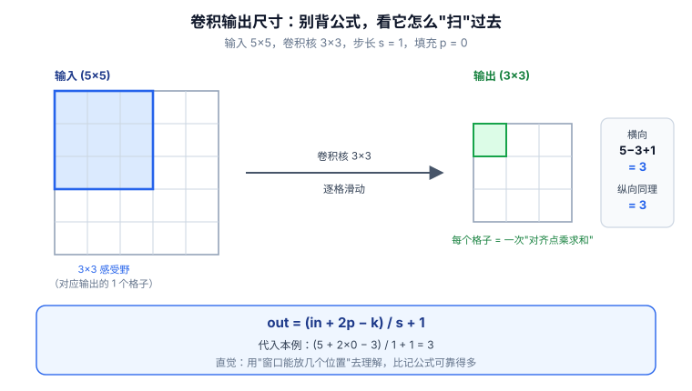
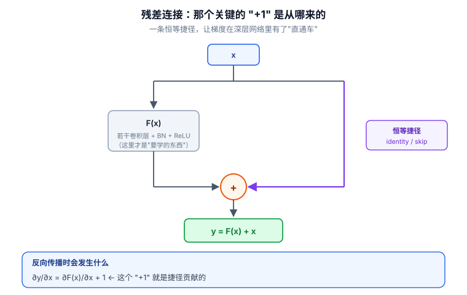

# 📘 第 3 周 · 卷积神经网络与视觉任务

> **本周目标**：吃透 CNN 的四个核心机制 —— 局部连接与权值共享、输出尺寸与感受野、残差连接、迁移学习。学完你应该能做到：给出任意卷积层参数直接算出输出尺寸并**反推 padding**；在纸上写出残差网络的梯度推导并指出那个 `+1`；用 1D-CNN 跑通一次时序异常检测。
>
> **本周知识清单**：C 域 11 条（C2 全组，融入每天末尾的 ✅ 知识自查）
>
> **阶段位置**：本周是阶段二（Day 15-28）的前半段，从"训练一个网络"进入"设计一个网络"。
>
> **使用方式**：在 Typora 中按标题折叠展开，每天读对应的小节即可。

[[深度学习学习总目录|← 返回总目录]]

---

## Day 15 —— 卷积的直觉：局部连接与权值共享

> **一句话**：卷积的全部秘密就两条 —— **每个输出只看输入的一小块（局部连接）**，**同一个核在整个输入上复用（权值共享）**。这两条把参数量从十亿级降到个位数。

### 一、全连接层处理图像的两个硬伤

假设一张 1000×1000 的灰度图，拉平后是 1,000,000 维输入向量。接一个只有 1000 个神经元的隐藏层：

```
参数量 = 1,000,000 × 1,000 = 1e9（十亿）
```

**硬伤一：参数量爆炸。** 一层就十亿参数，显存和训练时间都受不了。

**硬伤二：平移不变性丢失。** 全连接层把图像拉平成一维，像素的二维邻接关系被彻底打散。猫在左上角和猫在右下角，对全连接层来说是两组完全不同的输入 —— 它得**分别学两遍**。

| 硬伤 | 后果 |
|---|---|
| 参数量爆炸 | 1e9 参数/层，无法训练 |
| 空间结构被拉平 | 丢失邻接关系，无平移不变性 |
| 局部相关性先验被浪费 | 相邻像素高度相关，这个信息全丢了 |

> **卷积的三个先验假设**（这是理解 CNN 的钥匙）：**局部性**（相邻像素相关）、**平移不变性**（模式出现在哪都一样）、**层次性**（简单模式组合成复杂模式）。CNN 不是"碰巧有效"，是**把这三个先验直接写进了结构里**。

### 二、卷积核：一个小矩阵在输入上滑动

**卷积核（滤波器）** 是一个小的权重矩阵（比如 3×3），它在输入上按步长滑动，每滑到一个位置就和该位置的局部区域做**逐元素相乘再求和**。

```
输入（5×5）        核（3×3）        输出（3×3，stride=1, padding=0）
1 1 1 0 0         1 0 1           4 3 4
0 1 1 1 0    *    0 1 0     =     2 4 3
0 0 1 1 1         1 0 1           2 3 4
0 0 1 1 0
0 1 1 0 0
```

**卷积的输出叫特征图（feature map）** —— 它记录的是"这个核所代表的模式，在输入的每个位置上有多强"。

**通道（channel）** 是输入/输出的深度维度：

| 位置 | 通道数含义 |
|---|---|
| 输入（灰度图） | `C = 1` |
| 输入（RGB 图） | `C = 3` |
| 中间层特征图 | `C = 64 / 128 / 256 ...` |
| 输出层 | `C = 类别数` |

```python
import torch, torch.nn as nn

x = torch.randn(8, 3, 32, 32)              # [N, C, H, W] = 8 张 RGB 图
conv = nn.Conv2d(3, 16, kernel_size=3)     # 3 通道进，16 个核
y = conv(x)                                 # [8, 16, 30, 30]
```

> **注意**：一个 3×3×3 的核（跨 3 个输入通道）只输出 **1** 个通道。想输出 16 通道，就需要 16 个这样的核，每个核的权重独立。

### 三、局部连接与权值共享：参数量从 O(HW·HW) 降到 O(k²)

**局部连接**：每个输出只连接输入的一个 k×k 局部区域，不是全部。
**权值共享**：同一个核在输入的所有位置上复用同一组权重。

把这两条合起来算参数量（忽略偏置）：

| 方案 | 参数量 | 代入 H=W=1000, k=3 |
|---|---|---|
| 全连接 | `O(HW · HW)` | 1e12 |
| 局部连接（不共享） | `O(HW · k²)` | 1e6 × 9 = 9e6 |
| **局部连接 + 权值共享** | **`O(k²)`** | **9** |

**推导逻辑，三步走**：

1. **全连接**：每个输出点都要连到全部 `HW` 个输入 → `HW × HW`
2. **局部连接**：每个输出点只连 `k²` 个输入 → `HW × k²`（还是和图像大小成正比）
3. **再叠加权值共享**：所有 `HW` 个输出点**共用同一组** `k²` 权重 → **`k²`，与图像大小无关**

> **这就是卷积的本质**：用一个只有 9 个参数的核，处理任意尺寸的图像。参数量不再随图像变大而增长。

### 四、卷积核学到了什么：浅层边缘 → 深层语义

| 层深 | 学到的模式 | 类比 |
|---|---|---|
| 第 1-2 层 | 边缘、角点、颜色斑块 | 相当于 Sobel / Canny 算子 |
| 中间层 | 纹理、简单部件（眼睛、轮子） | 局部形状 |
| 深层 | 语义部件、整体物体 | "这是绝缘子""这是猫" |

**验证方式**：手写一个 Sobel 核做卷积，看竖边被高亮。

```python
import torch
import torch.nn.functional as F

sobel_x = torch.tensor([[-1., 0., 1.],
                        [-2., 0., 2.],
                        [-1., 0., 1.]])

img = torch.zeros(1, 1, 8, 8)
img[..., :, 4:] = 1.0                  # 左黑右白，中间有一条竖边

kernel = sobel_x.view(1, 1, 3, 3)
edge = F.conv2d(img, kernel, padding=1)
print(edge[0, 0])                       # 第 4 列附近出现大幅值 → 竖边被高亮
```

**看到竖边被高亮才算懂。** 而这个 Sobel 核是**手写**的 —— CNN 做的事就是**让这些核的数值自己学出来**：你只告诉它"有几个核、多大"，数值全靠反向传播。

### 五、和电网安全的关系

CNN 在电网安全里最直接的两个落点：

| 场景 | 输入 | 卷积在检测什么 |
|---|---|---|
| **设备缺陷图像识别** | 无人机 / 巡检机器人拍的绝缘子、金具照片 | 破损、锈蚀、异物等局部视觉模式 |
| **报文 / 量测时序异常** | `[N, C, T]` 的 1D 序列 | 局部波形的突变模式（尖峰、骤降） |

**为什么 CNN 天然适配安全检测**：攻击或缺陷通常表现为**局部异常**（一小段报文、一块区域），而卷积的局部连接假设正好就是"异常是局部的"。

> 反过来想：如果攻击是**全局的、缓慢漂移**的（比如持续 10 分钟的缓慢数据篡改），单层卷积的感受野可能覆盖不到 —— 这就要靠堆层或换 RNN / Transformer（第 4 周）。

### 🔍 延伸思考

1. 权值共享的隐含假设是"同一个模式出现在任何位置都应被同等对待"。这个假设在电网场景里成立吗？（提示：母线电压的"尖峰模式"和支路电流的"尖峰模式"，物理含义是同一件事吗？）
2. 如果把卷积核固定成 Sobel 而不让它学习，模型还有用吗？什么场景下"固定核"反而更好？

### 📚 参考

- 李沐《动手学深度学习》第 6.1-6.3 节「从全连接层到卷积」
- LeCun et al. (1998), *Gradient-Based Learning Applied to Document Recognition*

### 🎬 视频讲解

> 以下为**关键词检索式**推荐（平台搜索结果，非固定视频链接，避免失效）。
> 直接复制关键词到对应平台搜索即可，也可在结果里挑播放量高的看。

| 平台 | 推荐搜索关键词 | 说明 |
|---|---|---|
| **B站** | [卷积 通俗理解 动画](https://search.bilibili.com/all?keyword=卷积+通俗理解+动画) | 8 分钟建立卷积直觉，**必看** |
| **B站** | [CNN 卷积核 边缘检测](https://search.bilibili.com/all?keyword=CNN+卷积核+边缘检测) | 用 Sobel 核演示卷积在干什么 |
| **B站** | [局部连接 权值共享 参数量](https://search.bilibili.com/all?keyword=局部连接+权值共享+参数量) | 讲清参数量为什么能降下来 |
| **抖音** | [卷积神经网络 一分钟 讲懂](https://www.douyin.com/search/卷积神经网络+一分钟+讲懂) | 碎片时间过一遍直觉 |

### ✅ 知识自查

- [ ] 🟢 **概念** 卷积核（滤波器）：一个小的权重矩阵，在输入上滑动
- [ ] 🟢 **概念** 特征图（feature map）：卷积的输出
- [ ] 🟢 **概念** 通道（channel）：输入/输出的深度维度
- [ ] 🟢 **概念** **局部连接** —— 每个输出只看输入的局部区域
- [ ] 🟢 **概念** **权值共享** —— 同一个核在整个输入上复用
- [ ] 🟢 **推导** 局部连接 + 权值共享 让参数量从 O(HW·HW) 降到 O(k²)
- [ ] 🟡 **概念** 卷积核学到的模式：浅层边缘/纹理，深层语义部件
- [ ] 🟢 **实践** 手写 Sobel 核，在灰度图上看到竖边被高亮（`代码/15-手写卷积.py`）

---

## Day 16 —— 卷积层参数：输出尺寸公式与感受野

> **一句话**：卷积层只有四个旋钮 —— `k / s / p / C`，而 `out = (in + 2p - k)/s + 1` 是唯一需要背下来的公式；**背下来不算会，能反推 padding 才算**。

### 一、四个参数各管什么

| 参数 | 含义 | 调大的后果 |
|---|---|---|
| `kernel_size`（k） | 核大小，决定"一次看多宽" | 感受野变大，参数变多 |
| `stride`（s） | 滑动步长 | `s>1` 相当于下采样，输出变小 |
| `padding`（p） | 边缘补零圈数 | 输出变大，保留边缘信息 |
| `channels`（C_in / C_out） | 输入/输出通道数 | 容量变大；每层通常翻倍 |

### 二、输出尺寸公式（必须背）

```
out = (in + 2p - k) / s + 1        ← 除不尽时向下取整
```

**形状规则怎么理解**：

- `in + 2p`：补零之后的有效边长
- 减去 `k`：得到"核能滑动的区间长度"
- 除以 `s`：得到"能滑几步"
- 加 `1`：起点本身算一个位置

```python
import torch, torch.nn as nn
conv = nn.Conv2d(1, 1, kernel_size=3, padding=1, stride=1)
print(conv(torch.randn(1, 1, 32, 32)).shape)     # [1, 1, 32, 32]
```

**尺寸计算三连练**（先自己算，再用代码验证）：

| in | k | p | s | out |
|---|---|---|---|---|
| 32 | 3 | 1 | 1 | **32** |
| 32 | 3 | 1 | 2 | **16** |
| 28 | 5 | 0 | 1 | **24** |

验算过程：

```
(32 + 2×1 - 3) / 1 + 1 = 32      ✅
(32 + 2×1 - 3) / 2 + 1 = 16.5 → 16
(28 + 2×0 - 5) / 1 + 1 = 24      ✅
```

> **注意第二行**：16.5 向下取整成 16，说明最后一步滑动时"踩到了边界外"，PyTorch 直接丢弃这一步。**除不尽是常态，不是错误。**

**算错三次以上的人，后面必踩坑。**

### 三、反推 padding：想要多大输出就补多少



> **看图说话**：上图用“**窗口能放几个位置**”的方式解释 `out = (in + 2p − k)/s + 1`：灰色是 5×5 输入，蓝色虚线是补零后的边框，红色是 3×3 卷积核。核在补零后的输入上从左到右扫描，能落下的**不同位置数**就是输出边长。把公式拆成四步读：`in + 2p` 是补零后的有效边长 → 减去 `k` 是“核能滑动的区间” → 除以 `s` 是“能滑几步” → 加 `1` 是因为起点本身算一个位置。**图里最后一步落点踩到了边界外** —— 这就是“除不尽向下取整”的几何含义，PyTorch 直接丢弃这一步，不是错误。


把公式反解：

```
p = ((out - 1) · s - in + k) / 2
```

**same padding**：想让输出尺寸等于输入（`out = in`），当 `s = 1` 时：

```
p = (k - 1) / 2
```

| k | p | 说明 |
|---|---|---|
| 3 | 1 | 最常用 |
| 5 | 2 | |
| 7 | 3 | |
| 2 | 0.5 | ❌ 非整数 —— **所以卷积核几乎总是奇数** |

> **记住这条推论**：`k` 取奇数不是习惯，是被 `same padding` 要求 `p` 为整数逼出来的。

### 四、感受野：一个输出点"看到"多大区域

**感受野（Receptive Field, RF）**：输出特征图上的一个点，对应输入图像上多大的区域。

**递推公式**：

```
RF_l = RF_{l-1} + (k_l - 1) × ∏_{i<l} s_i
```

三层 `k=3, s=1` 的堆叠：

| 层 | k | s | 累计 stride | 感受野 |
|---|---|---|---|---|
| 输入 | — | — | 1 | 1 |
| Conv1 | 3 | 1 | 1 | 3 |
| Conv2 | 3 | 1 | 1 | 5 |
| Conv3 | 3 | 1 | 1 | 7 |

**两个推论**：

- 只用 `s=1` 时，感受野随层数**线性**增长（每层 +2）
- 一旦引入 `stride` 或池化，后续层的感受野**加速增长**（累计 stride 变大）

**这条直觉很重要**：如果感受野只覆盖了 7 个采样点，那么"跨越 100 个点的长程模式"模型根本看不到 —— **模型看不到的东西，它学不会**。

### 五、和电网安全的关系

一条 1 秒的 IEC 61850 报文序列，假设采样率 80 点/周波（50 Hz → 4000 点/秒）。卷积核该设多宽？

| 关心的模式 | 物理时间尺度 | 建议核宽（1D） |
|---|---|---|
| 单点突变（丢包、伪造帧） | ~1 ms | k = 3~5 |
| 一个周波内的波形畸变 | 20 ms | k = 80 |
| 数个周波的持续异常 | 60 ms | k = 240（或堆 2-3 层小核） |

**实践建议**：不要一上来用大核。**堆 3 层 `k=5` 的感受野是 13，参数只有 `3×5=15`**；而单层 `k=13` 参数是 13 —— 参数差不多，但三层堆叠**多了两次非线性**（Day 17 会算这笔账）。

> 电力信号的采样率决定了"一个时间步等于多少毫秒"。**先把核宽和物理时间对上，再谈模型结构** —— 这是审稿人会问的第一个问题。

### 🔍 延伸思考

1. `in=32, k=4, s=2, p=0` 时输出是多少？这个结果说明"偶数核 + stride 2"有什么风险？
2. 感受野是 7 的一个输出点，真的能"同等程度看到"全部 7 个输入点吗？（提示：有效感受野 effective RF，中间点的权重远大于边缘点）

### 📚 参考

- 李沐《动手学深度学习》第 6.3 节「填充和步幅」
- *Understanding the Effective Receptive Field in Deep Convolutional Neural Networks*（Luo et al., 2016，检索题名）

### 🎬 视频讲解

> 以下为**关键词检索式**推荐（平台搜索结果，非固定视频链接，避免失效）。

| 平台 | 推荐搜索关键词 | 说明 |
|---|---|---|
| **B站** | [卷积 输出尺寸 padding stride 计算](https://search.bilibili.com/all?keyword=卷积+输出尺寸+padding+stride+计算) | 公式推导 + 三连练逐个演示 |
| **B站** | [感受野 计算 讲解](https://search.bilibili.com/all?keyword=感受野+计算+讲解) | 讲清感受野递推 |
| **B站** | [从零搭建卷积神经网络](https://search.bilibili.com/all?keyword=从零搭建卷积神经网络) | 手把手过一遍参数设置 |
| **抖音** | [卷积核 为什么都是奇数](https://www.douyin.com/search/卷积核+为什么都是奇数) | 三分钟理解 same padding |

### ✅ 知识自查

- [ ] 🟢 **概念** `kernel_size`：卷积核大小，决定看多宽
- [ ] 🟢 **概念** `stride`：滑动步长，>1 就相当于下采样
- [ ] 🟢 **概念** `padding`：边缘补零，控制输出尺寸
- [ ] 🟢 **概念** `channels`：输入/输出通道数，每一层通常翻倍
- [ ] 🟢 **公式** **输出尺寸 `out = (in + 2p - k)/s + 1`** —— 必须背下来
- [ ] 🟢 **推导** 反推：想要输出尺寸 S，padding 该设多少？
- [ ] 🟡 **概念** "same padding" 的常见做法：`p = (k-1)/2`（k 为奇数）
- [ ] 🟡 **概念** **感受野**：输出上一个点对应输入多大的区域
- [ ] 🟡 **推导** 感受野的递推（每层按 stride 累加）
- [ ] 🟢 **实践** 用代码验证三连练的三个结果（`代码/16-输出尺寸计算.py`）

---

## Day 17 —— 池化与经典 CNN 结构：LeNet → VGG

> **一句话**：池化是"用少量信息换位置鲁棒性"的交易；而 VGG 用两个 3×3 替代一个 5×5 证明了 —— **深，比宽更划算**。

### 一、两种池化

| 类型 | 操作 | 保留什么 | 适合场景 |
|---|---|---|---|
| **最大池化** | 取窗口最大值 | 显著特征（最强响应） | 主流选择，检测/分类 |
| **平均池化** | 取窗口均值 | 整体趋势 | 平滑特征、回归 |

```python
pool = nn.MaxPool2d(kernel_size=2, stride=2)   # 边长减半
x = torch.randn(1, 1, 4, 4)
pool(x).shape                                   # [1, 1, 2, 2]
```

**池化层没有参数** —— 它只是固定规则的降采样。

### 二、池化的三个作用，和一个代价

| 作用 | 说明 |
|---|---|
| **降维** | 特征图边长减半 → 计算量和显存降到 1/4 |
| **增大感受野** | 后续层的一个点"看到"的输入区域成倍扩大 |
| **提供平移不变性** | 特征稍微平移，池化后结果基本不变 |

**代价（必须知道）**：池化是**不可逆的信息丢弃**。

> **在异常检测这类"细节敏感"任务里，池化可能是毒药** —— 异常往往就是微小偏差，最大池化只保留最大值，平均池化直接把它平均掉。第 21 天做 1D-CNN 异常检测时，**优先考虑用 stride 卷积代替池化**（可学习、可控）。

### 三、全局平均池化 GAP：替代最后的全连接层

```python
# 传统做法：展平 + 巨大全连接层
x = x.flatten(1)                      # [N, 512, 7, 7] → [N, 25088]
x = nn.Linear(25088, 10)(x)           # 25088×10 = 25 万个参数 ← 参数大户

# GAP 做法：对每个通道取平均
x = x.mean(dim=[2, 3])                # [N, 512, 7, 7] → [N, 512]
x = nn.Linear(512, 10)(x)             # 512×10 = 5120 个参数
```

| 对比 | 展平 + FC | GAP |
|---|---|---|
| 参数量 | 25088×10 = 250,880 | 512×10 = 5,120 |
| 输入尺寸依赖 | 必须固定尺寸 | 任意尺寸 |
| 过拟合风险 | 高 | 低 |

> GAP 是 ResNet、MobileNet 等现代网络的标配。**"最后一层全连接参数量巨大"是过拟合的主要来源之一**，GAP 直接把它消掉了。

### 四、经典结构演进：LeNet-5 → AlexNet → VGG

**LeNet-5（1998）**：2 卷积 + 2 池化 + 3 全连接，输入 `1×32×32`，输出 10 类。

| 层 | 操作 | 输出形状 |
|---|---|---|
| 输入 | — | `1×32×32` |
| C1 | Conv 5×5, 6 核 | `6×28×28` |
| S2 | AvgPool 2×2 | `6×14×14` |
| C3 | Conv 5×5, 16 核 | `16×10×10` |
| S4 | AvgPool 2×2 | `16×5×5` |
| C5 | Conv 5×5, 120 核 | `120×1×1` |
| F6 | FC 84 | `84` |
| 输出 | FC 10 | `10` |

**手画这张结构图并标注每层形状 —— 能画对，CNN 的形状变换就过关了。**

**AlexNet（2012）的两个关键改进**：

| 改进 | 为什么重要 |
|---|---|
| 用 **ReLU** 替代 Sigmoid | 缓解梯度消失（回顾 Day 9），训练速度提升数倍 |
| 用 **Dropout** | 抑制过拟合（回顾 Day 12），全连接层参数量太大 |

> AlexNet 不是结构上的天才设计，它是**"更大的网络 + 两个正确的训练技巧 + GPU"**。2012 年 ImageNet 夺冠引爆深度学习，靠的是这个组合。

**VGG（2014）的核心思想**：**只用 3×3 小核，一路堆深**（VGG-16 有 16 层带权重的层）。

| 网络 | 深度 | 核心贡献 |
|---|---|---|
| LeNet-5 | 5 层 | 证明卷积可行 |
| AlexNet | 8 层 | ReLU + Dropout + GPU |
| VGG-16 | 16 层 | 3×3 堆深，结构规整可复用 |

### 五、两个 3×3 等价于一个 5×5，但参数更少

**感受野相同**：`3 → 5`（两个 3×3 堆叠的感受野 = 5，见 Day 16 的递推表）。

**参数量对比**（假设通道数都是 C）：

| 方案 | 参数量 | 感受野 | 非线性层数 |
|---|---|---|---|
| 1 个 5×5 | `C × C × 25 = 25C²` | 5 | 1 |
| 2 个 3×3 | `2 × C × C × 9 = 18C²` | 5 | 2 |

**两个好处**：

1. **参数更少**：`18C² < 25C²`，省 28%
2. **非线性更强**：中间多了一个 ReLU，表达能力提升

> **这条推导是 VGG 论文的核心论证**，也是"小核堆深"成为主流的原因。**能自己写出这张表，才算真懂 VGG。**

### 六、和电网安全的关系

| 场景 | 池化该怎么处理 |
|---|---|
| **绝缘子缺陷图像识别** | 可以用池化 —— 缺陷是区域性的，位置鲁棒性有好处 |
| **量测/报文时序异常检测** | **慎用池化** —— 单点突变会被最大池化吞掉或平均池化抹平 |
| **需要精确定位异常时刻** | 用 `stride` 卷积或膨胀卷积代替池化（Day 21 展开） |

**实践建议**：在安全检测任务里做消融实验时，**"有池化 vs 无池化（用 stride 卷积）"是一个很有说服力的对比项** —— 它能直接说明你的结构设计不是抄来的。

### 🔍 延伸思考

1. 池化会丢信息，在异常检测这种"细节敏感"任务里合适吗？如果不用池化，怎么降低特征图尺寸？
2. VGG 用 3×3 堆深，为什么不干脆堆 1×1？（提示：1×1 的感受野永远是 1，无法扩大视野）

### 📚 参考

- 李沐《动手学深度学习》第 6.6 节「LeNet」、第 7 章「现代卷积神经网络」
- Simonyan & Zisserman (2014), *Very Deep Convolutional Networks for Large-Scale Image Recognition*（VGG）

### 🎬 视频讲解

> 以下为**关键词检索式**推荐（平台搜索结果，非固定视频链接，避免失效）。

| 平台 | 推荐搜索关键词 | 说明 |
|---|---|---|
| **B站** | [LeNet AlexNet VGG 结构演进](https://search.bilibili.com/all?keyword=LeNet+AlexNet+VGG+结构演进) | 三代经典网络一次讲清 |
| **B站** | [李沐 动手学深度学习 LeNet](https://search.bilibili.com/all?keyword=李沐+动手学深度学习+LeNet) | 官方课程，逐层过形状 |
| **B站** | [全局平均池化 GAP 讲解](https://search.bilibili.com/all?keyword=全局平均池化+GAP+讲解) | 讲清为什么能替代全连接 |
| **抖音** | [两个3x3 等于 一个5x5](https://www.douyin.com/search/两个3x3+等于+一个5x5) | 三分钟看懂 VGG 的核心论证 |

### ✅ 知识自查

- [ ] 🟢 **概念** 最大池化：取窗口最大值，保留显著特征
- [ ] 🟢 **概念** 平均池化：取窗口均值，保留整体趋势
- [ ] 🟢 **概念** 池化的作用：降维、增大感受野、提供平移不变性
- [ ] 🟢 **概念** 全局平均池化（GAP）：替代最后的全连接层
- [ ] 🟢 **概念** LeNet-5 结构：2 卷积 + 2 池化 + 3 全连接
- [ ] 🟡 **概念** AlexNet 的两个关键改进：ReLU + Dropout
- [ ] 🟡 **概念** VGG 的核心思想：用 3×3 小核堆深
- [ ] 🟡 **推导** 为什么两个 3×3 等价于一个 5×5，但参数更少
- [ ] 🟢 **实践** 手画 LeNet-5 结构图并标注每层形状（`代码/17-LeNet手写实现.py`）

---

## Day 18 —— ResNet 与残差连接：那个关键的 "+1"

> **一句话**：残差连接让梯度多了一条"高速公路" —— 反向传播时导数变成 `∂F/∂x + 1`，即使 `∂F/∂x ≈ 0`，梯度也能靠那个 `+1` 无损传回浅层。

### 一、退化问题：更深反而更差

按常识，网络越深表达能力越强，训练误差应该越低。但实验发现：

```
56 层的网络，训练误差 > 20 层的网络
```

**注意：这不是过拟合** —— 过拟合是训练误差低、测试误差高；退化是**训练误差本身就更高**。

| 现象 | 训练误差 | 测试误差 | 原因 |
|---|---|---|---|
| 过拟合 | 低 | 高 | 模型记性太好 |
| **退化** | **高** | **高** | 深层网络难优化 |

**为什么会退化**：理论上 56 层网络可以"退化"成 20 层网络（把多余的层学成恒等映射），但**让一堆非线性层学出恒等映射 `F(x) = x` 极其困难**。优化器找不到这条路。

### 二、残差块：让网络学"残差"而非"完整映射"

**核心设计**：

```
y = F(x) + x        ← 这个 "+x" 就是残差连接（skip connection）
```

- `F(x)`：两三层卷积的堆叠（要学的东西）
- `x`：**恒等映射**，直接抄近路加过来

**关键转变**：如果恒等映射是最优的，网络只需把 `F(x)` 学成 **0**（把权重压到 0 很容易），而不是学出完整的 `F(x) = x`。**"学 0"比"学恒等映射"简单得多。**

```python
class ResidualBlock(nn.Module):
    def __init__(self, channels):
        super().__init__()
        self.conv1 = nn.Conv2d(channels, channels, 3, padding=1)
        self.bn1 = nn.BatchNorm2d(channels)
        self.conv2 = nn.Conv2d(channels, channels, 3, padding=1)
        self.bn2 = nn.BatchNorm2d(channels)
        self.relu = nn.ReLU()

    def forward(self, x):
        identity = x                        # ← 抄近路的那一份
        out = self.relu(self.bn1(self.conv1(x)))
        out = self.bn2(self.conv2(out))
        out = out + identity                # ← 关键的一行
        return self.relu(out)
```

**形状要求**：`F(x)` 和 `x` 必须形状一致。如果通道数或尺寸变了（比如 stride=2 的下采样层），要用 **1×1 卷积 + stride** 调整 `x`：

```python
self.shortcut = nn.Sequential(
    nn.Conv2d(in_ch, out_ch, kernel_size=1, stride=2, bias=False),
    nn.BatchNorm2d(out_ch),
)
```

### 三、关键推导：那个 "+1"

**普通深层网络**：

```
y = F(x)
∂L/∂x = ∂L/∂y · ∂F/∂x
```

如果 `∂F/∂x < 1`（深层网络里很常见），梯度每过一层就被衰减一次 → 连乘 → 梯度消失。

**残差网络**：

```
y = F(x) + x
∂y/∂x = ∂F/∂x + 1                    ← 就是这里
∂L/∂x = ∂L/∂y · (∂F/∂x + 1)
```

**为什么 "+1" 如此重要**：

即使 `∂F/∂x ≈ 0`（深层网络的极端情况），括号里仍然是 `0 + 1 = 1` —— **梯度可以无损地传回浅层**。

```
普通网络：∂L/∂x = ∂L/∂y × 0.1 × 0.1 × 0.1 ...  → 指数衰减
残差网络：∂L/∂x = ∂L/∂y × 1.1 × 1.1 × 1.1 ...  → 保持甚至放大
```

> **这一行推导就是 ResNet 的全部价值**，务必自己写一遍。它是 Day 8 讲过的"梯度连乘"问题的一个**结构性解法** —— 不是换激活函数（Day 9 的 ReLU），不是换优化器，而是**改结构**。



> **看图说话**：上图是残差块的两条路：**上面**是 `F(x)`（两三层卷积，要学的东西），**下面**是恒等捷径 `x`。两者在 ⊕ 处相加得到 `y = F(x) + x`。关键在于箭头上的标注 —— 反向传播时 `∂y/∂x` 有两条路径的贡献相加：经 `F(x)` 的那条是 `∂F/∂x`，经捷径的那条是 `1`，**所以导数永远是 `∂F/∂x + 1`**。即使 `∂F/∂x` 被 Sigmoid 导数压到接近 0，那个 `+1` 也保证梯度能无损传回浅层。这就是本节标题里“那个 +1”的全部含义 —— 它不是调参技巧，是"加法求导"的直接结果。


### 四、瓶颈结构与 1×1 卷积

ResNet-50/101/152 用的不是上面的两层 3×3 块，而是**瓶颈结构（Bottleneck）**：

```
1×1（压缩：256 → 64）→ 3×3（处理：64 → 64）→ 1×1（扩张：64 → 256）
```

| 方案 | 参数量（C=256） |
|---|---|
| 两个 3×3 | `2 × 256 × 256 × 9 ≈ 1.18M` |
| 瓶颈 1×1→3×3→1×1 | `256×64 + 64×64×9 + 64×256 ≈ 0.07M` |

**参数量降到约 1/16**，深度才能堆到 152 层。

**1×1 卷积的两个作用**：

| 作用 | 说明 |
|---|---|
| **跨通道信息融合** | 在 (C, H, W) 的 C 维上做加权组合，不改变空间尺寸 |
| **降维 / 升维** | 用 1×1 把通道数压下来再处理，省参数 |

> **1×1 卷积不是"没用的卷积"** —— 它是"逐像素的全连接层"，专门负责通道维度的信息整合。这个概念在 Day 30 的注意力机制里还会再出现。

### 五、BatchNorm 与残差块的配合顺序

| 版本 | 顺序 | 特点 |
|---|---|---|
| **原版（post-activation）** | `Conv → BN → ReLU → Conv → BN → Add → ReLU` | ResNet 原文用法 |
| **改进版（pre-activation）** | `BN → ReLU → Conv → BN → ReLU → Conv → Add` | 恒等路径更干净，梯度回传更顺（ResNet v2） |

**为什么 pre-activation 更好**：原版里 `Add` 之后还有一个 ReLU，恒等路径被 ReLU 截断了一次；pre-activation 把 BN/ReLU 移到卷积前，**`x → x` 这条捷径完全无阻碍**。

### 六、和电网安全的关系

残差连接的思想可以**直接类比到安全检测的"基线 + 偏差"**：

| 深度学习 | 安全检测 |
|---|---|
| 恒等映射 `x` | 正常行为基线 |
| 残差 `F(x)` | 异常偏差 |
| 学习目标 | 只学"偏离基线的部分" |

**这正是异常检测的核心思路**：不要从零学"什么是正常的"（太难），而是**先有一个基线，只学"哪里不对"**。第 26 天的自编码器异常检测、以及状态估计里的残差 `r = z - H·x̂`，都是同一个数学形式。

**另外一个工程价值**：电网安全模型要部署在变电站的边缘设备上，算力有限。ResNet 的**结构可裁剪性**（去掉部分残差块仍能工作，因为恒等路径保证信息流通）让它很适合做轻量化。

### 🔍 延伸思考

1. 残差连接里 `∂F/∂x + 1` 的 `+1` 保证了梯度不消失。那如果 `∂F/∂x` 是负数（比如 -1.5），会发生什么？会不会有梯度爆炸的风险？
2. 如果残差连接改成 `y = F(x) + αx`（α 是可学习参数），效果会更好还是更差？为什么？

### 📚 参考

- He et al. (2016), *Deep Residual Learning for Image Recognition*, CVPR —— **本周最该精读的一篇**
- He et al. (2016), *Identity Mappings in Deep Residual Networks*（ResNet v2，pre-activation）
- 李沐《动手学深度学习》第 7.6 节「残差网络（ResNet）」

### 🎬 视频讲解

> 以下为**关键词检索式**推荐（平台搜索结果，非固定视频链接，避免失效）。

| 平台 | 推荐搜索关键词 | 说明 |
|---|---|---|
| **B站** | [李沐 动手学深度学习 ResNet](https://search.bilibili.com/all?keyword=李沐+动手学深度学习+ResNet) | 李沐把残差连接讲得很透 |
| **B站** | [ResNet 残差连接 为什么有效](https://search.bilibili.com/all?keyword=ResNet+残差连接+为什么有效) | 讲清退化问题与捷径 |
| **B站** | [残差 梯度 推导 +1](https://search.bilibili.com/all?keyword=残差+梯度+推导+1) | 跟着推一遍 ∂F/∂x+1 |
| **抖音** | [ResNet 一分钟 讲懂](https://www.douyin.com/search/ResNet+一分钟+讲懂) | 快速建立直觉 |

### ✅ 知识自查

- [ ] 🟢 **概念** 退化问题：网络更深，训练误差反而更大
- [ ] 🟢 **概念** 恒等映射：`y = F(x) + x`，让网络学"残差"而非"完整映射"
- [ ] 🟢 **概念** 残差连接让梯度可以"走捷径"回流，缓解梯度消失
- [ ] 🟢 **推导** 反向传播时 `∂y/∂x = ∂F/∂x + 1` —— **那个 "+1" 是关键**
- [ ] 🟢 **概念** 瓶颈结构（Bottleneck）：1×1 → 3×3 → 1×1，压缩再扩张
- [ ] 🟡 **概念** 1×1 卷积的作用：跨通道信息融合 + 降维
- [ ] 🟡 **概念** BatchNorm 与残差块的配合顺序
- [ ] 🟢 **实践** 手写一个 ResidualBlock，跑通形状（`代码/18-ResNet残差块.py`）

---

## Day 19 —— 迁移学习：冻结骨干 vs 全量微调

> **一句话**：迁移学习的本质是"**借用别人在大数据上学到的通用特征**"。你不需要重新发明边缘和纹理检测器，只需要教会模型"你的任务该怎么用这些特征"。

### 一、为什么迁移学习有效

ImageNet 上训练出来的 CNN，浅层学到的是**边缘、角点、颜色斑块** —— 这些特征**几乎对所有视觉任务通用**（自然图像、医学影像、工业缺陷图像都一样）。

```
ImageNet 预训练权重
  ├── 浅层：边缘/纹理   → 通用，可直接复用
  ├── 中层：局部部件   → 半通用，微调即可
  └── 深层：语义概念   → 任务相关，需要重新学
```

**两个好处**：

| 好处 | 说明 |
|---|---|
| **省数据** | 小数据集（几百张）也能训出可用模型 |
| **省时间** | 从"随机初始化"变成"从好起点出发"，收敛快得多 |

### 二、两种模式：特征提取 vs 微调

| 模式 | 冻结范围 | 可训练参数 | 适用 |
|---|---|---|---|
| **特征提取**（冻结骨干） | 全部卷积层冻结，只训分类头 | 极少（几万） | 数据极少（< 1000 张）、目标域接近源域 |
| **全量微调** | 全部层解冻，小学习率训练 | 全部 | 数据较多（> 5000 张）、目标域有差异 |
| **部分微调** | 冻结浅层，解冻深层 | 中等 | 最常用的折中方案 |

### 三、代码：加载预训练 + 冻结 + 替换分类头

```python
import torch, torch.nn as nn
import torchvision.models as models

# ① 加载预训练骨干
model = models.resnet18(pretrained=True)          # 新版写法：weights=ResNet18_Weights.DEFAULT

# ② 冻结全部参数（特征提取模式）
for p in model.parameters():
    p.requires_grad = False

# ③ 替换最后一层（新层默认 requires_grad=True）
num_classes = 3                                    # 比如：正常 / 破损 / 锈蚀
model.fc = nn.Linear(512, num_classes)

# ④ 只把分类头的参数交给优化器（关键！）
optimizer = torch.optim.Adam(model.fc.parameters(), lr=1e-3)
```

**第 ④ 步最容易错**：如果写成 `optim.Adam(model.parameters(), ...)`，虽然梯度是 0，但 Adam 仍会为所有参数维护状态，浪费显存；更重要的是**你误以为在微调**。

**部分微调怎么写**：

```python
# 只解冻最后两个 stage
for name, p in model.named_parameters():
    if name.startswith(('layer3', 'layer4', 'fc')):
        p.requires_grad = True
```

### 四、微调时学习率要调小

**原因**：预训练权重已经在一个很好的位置上。大学习率会**一步把它推离最优区域**，之前学的东西全废 —— 这叫"灾难性遗忘"。

| 训练阶段 | 建议学习率 |
|---|---|
| 分类头（随机初始化） | `1e-3` |
| 微调预训练层 | `1e-4` ~ `1e-5`（通常是分类头的 1/10） |

**更精细的做法 —— 分层学习率（差分学习率）**：

```python
params = [
    {'params': model.layer1.parameters(), 'lr': 1e-5},   # 浅层，几乎不动
    {'params': model.layer4.parameters(), 'lr': 1e-4},   # 深层，多动一点
    {'params': model.fc.parameters(),     'lr': 1e-3},   # 新层，正常学
]
optimizer = torch.optim.Adam(params)
```

> **越靠浅层学习率越小** —— 因为浅层特征越通用，越不需要改。

### 五、什么时候迁移学习没用

| 情况 | 为什么不灵 |
|---|---|
| **源域与目标域差异过大** | ImageNet 是自然图像；如果是红外热成像、SAR 图像、振动频谱图，浅层特征可能完全不通用 |
| **目标域数据充足** | 数据够多时，从零训练可能更好（不受源域偏置影响） |
| **输入通道数不匹配** | ImageNet 是 3 通道 RGB；如果是单通道灰度或 6 通道多光谱，第一层权重需要改造 |

**输入通道不匹配的改法**：

```python
# 把 3 通道的第一层换成 1 通道，权重取通道维均值
old = model.conv1.weight.data                     # [64, 3, 7, 7]
model.conv1 = nn.Conv2d(1, 64, kernel_size=7, stride=2, padding=3, bias=False)
model.conv1.weight.data = old.mean(dim=1, keepdim=True)   # [64, 1, 7, 7]
```

### 六、和电网安全的关系

**电力设备缺陷图像识别的样本天然稀少** —— 一台新投运的变压器可能几年才出一次故障，你能收集到的缺陷图像可能只有几十到几百张。

| 场景 | 数据量 | 推荐模式 |
|---|---|---|
| 绝缘子自爆/破损识别 | 数百张 | 冻结骨干 + 训练分类头 |
| 金具锈蚀分级 | 数千张 | 部分微调（解冻 layer3/4） |
| 红外热成像过热检测 | 数千张，域差异大 | 全量微调，但学习率要更小 |

**关键问题**：ImageNet 的**自然图像特征，能迁移到绝缘子、金具这类工业图像上吗？**

答案是**部分能**：浅层的边缘、纹理检测器通用性很强；但深层的"狗/猫/汽车"语义完全没用，必须重学。**所以"冻结浅层 + 微调深层"是电力视觉任务最实用的默认方案。**

**论文写法建议**：迁移学习是审稿人爱看的对比项 —— **"从零训练 / 冻结骨干 / 全量微调"三方对照实验**，直接证明了你的选择有依据，而不是随便调的。

### 🔍 延伸思考

1. 冻结骨干时，`BatchNorm` 层的运行均值（running_mean/var）还在更新吗？如果不想让它更新，该怎么做？（提示：`model.eval()` 或 `bn.eval()`）
2. 如果目标域只有 50 张图，全量微调会发生什么？为什么"冻结骨干"反而是更好的选择？

### 📚 参考

- 李沐《动手学深度学习》第 13.2 节「微调」
- Pan & Yang (2010), *A Survey on Transfer Learning*, IEEE TKDE（检索题名）
- Yosinski et al. (2014), *How transferable are features in deep neural networks?*, NeurIPS（检索题名）

### 🎬 视频讲解

> 以下为**关键词检索式**推荐（平台搜索结果，非固定视频链接，避免失效）。

| 平台 | 推荐搜索关键词 | 说明 |
|---|---|---|
| **B站** | [李沐 动手学深度学习 微调](https://search.bilibili.com/all?keyword=李沐+动手学深度学习+微调) | 官方课程，与本节代码对应 |
| **B站** | [迁移学习 微调 冻结层](https://search.bilibili.com/all?keyword=迁移学习+微调+冻结层) | 讲清两种模式的差别 |
| **B站** | [torchvision 预训练模型 使用](https://search.bilibili.com/all?keyword=torchvision+预训练模型+使用) | API 与常见报错 |
| **抖音** | [迁移学习 是什么 一分钟](https://www.douyin.com/search/迁移学习+是什么+一分钟) | 快速建立概念 |

### ✅ 知识自查

- [ ] 🟢 **概念** 迁移学习：在大数据集上预训练，迁移到小数据集
- [ ] 🟢 **概念** 特征提取模式：冻结骨干，只训练最后的分类头
- [ ] 🟢 **概念** 微调模式：解冻全部或部分层，用小学习率训练
- [ ] 🟢 **API** `torchvision.models.resnet18(pretrained=True)`
- [ ] 🟢 **API** 冻结参数：`for p in model.parameters(): p.requires_grad = False`
- [ ] 🟢 **API** 替换最后一层：`model.fc = nn.Linear(512, num_classes)`
- [ ] 🟡 **概念** 微调时学习率要调小（通常 1/10），否则会破坏预训练权重
- [ ] 🟡 **概念** 什么时候迁移学习没用：源域与目标域差异过大
- [ ] 🟢 **实践** 同一数据集跑三种设置对比：从零训练 / 冻结骨干 / 全量微调（`代码/19-迁移学习实践.py`）

---

## Day 20 —— 目标检测入门：IoU / NMS / YOLO

> **一句话**：分类回答"是什么"，检测还要回答"在哪里"。而把"在哪里"变成可训练问题的关键，就是 **IoU 定义好坏、NMS 去掉重复**。

### 一、检测 vs 分类

| 任务 | 输出 | 例子 |
|---|---|---|
| **分类** | 一个类别标签 | "这张图里有绝缘子" |
| **检测** | 若干 `(类别, 边界框, 置信度)` | "左上角有个破损绝缘子，置信度 0.92" |

**边界框的两种表示**：

```
(x, y, w, h)        中心点 + 宽高        ← YOLO 用这种
(x1, y1, x2, y2)    左上角 + 右下角      ← 标注文件常用这种（COCO/VOC）
```

> **坑**：两种格式混用是检测代码最常见的 bug。**归一化坐标（0~1）还是绝对像素**也要确认清楚。

### 二、IoU：交并比

**定义**：两个框的交集面积除以并集面积，取值 `[0, 1]`。

```
IoU = 交集面积 / 并集面积

┌─────────┐
│  A  ┌───┼──────┐
│     │███│      │     交集 = ██ 区域
└─────┼───┘      │     并集 = A ∪ B
      │     B    │
      └──────────┘
```

```python
def iou(box_a, box_b):
    # box: (x1, y1, x2, y2)
    x1 = max(box_a[0], box_b[0]);  y1 = max(box_a[1], box_b[1])
    x2 = min(box_a[2], box_b[2]);  y2 = min(box_a[3], box_b[3])
    inter = max(0, x2 - x1) * max(0, y2 - y1)          # ← max(0,·) 防止无交集时出负数

    area_a = (box_a[2]-box_a[0]) * (box_a[3]-box_a[1])
    area_b = (box_b[2]-box_b[0]) * (box_b[3]-box_b[1])
    union = area_a + area_b - inter
    return inter / union
```

**判定标准**：通常 `IoU > 0.5` 算检测正确（这个阈值记作 `IoU@0.5`）。

**IoU 的两个用途**：

1. **评估**：预测框和真值框的 IoU 超过阈值才算 TP
2. **训练**：作为定位损失的一部分（IoU Loss / GIoU / DIoU）

### 三、NMS：非极大值抑制

**问题**：检测器会为同一个物体输出**几十个重叠的框**。需要去掉重复的。

**流程**：

```
① 按置信度从高到低排序所有框
② 取置信度最高的框，保留
③ 删掉与它 IoU > 阈值的所有其他框（认为是同一个物体）
④ 回到 ②，直到没有框剩下
```

```python
def nms(boxes, scores, iou_thresh=0.5):
    order = scores.argsort(descending=True)
    keep = []
    while order.numel() > 0:
        i = order[0]
        keep.append(i.item())
        if order.numel() == 1:
            break
        rest = order[1:]
        ious = torch.tensor([iou(boxes[i], boxes[j]) for j in rest])
        order = rest[ious <= iou_thresh]          # 只保留重叠度低的
    return keep
```

**直觉**：一个物体周围应该只有一个框。**NMS 就是在"去重"。**

> **注意**：NMS 会误杀密集物体（比如一排紧挨着的绝缘子）。这是 YOLO 在密集小目标场景的一个已知弱点。

### 四、单阶段 vs 两阶段

| 类型 | 代表 | 流程 | 速度 | 精度 |
|---|---|---|---|---|
| **两阶段** | Faster R-CNN | 先提候选区域（RPN），再分类回归 | 慢 | 高 |
| **单阶段** | YOLO / SSD | 一步直接回归框和类别 | **快** | 略低（早期） |

**YOLO 的核心思想**：把图像分成 `S×S` 网格，**每个网格负责预测落在它中心的物体**。检测问题被转化成"网格上的回归问题"，一次前向就出结果。

```
输入图 → 划分 7×7 网格 → 每个网格预测 (2 个框 + 置信度 + 类别)
       → 一次前向输出所有预测 → NMS 去重 → 最终结果
```

**Anchor 机制与 Anchor-free 的演进**：

| 范式 | 做法 | 代表 |
|---|---|---|
| **Anchor-based** | 预设一批不同大小/长宽比的先验框，网络预测偏移量 | Faster R-CNN、YOLOv3 |
| **Anchor-free** | 直接预测中心点 + 尺寸，不用先验框 | FCOS、CenterNet、YOLOv8 |

Anchor-free 省掉了"调 anchor 尺寸"这个繁琐步骤，是近年的主流。

### 五、mAP：检测的主指标

**mAP（mean Average Precision）** 的计算逻辑：

```
① 对每个类别 c：
     按置信度排序所有预测 → 逐个判定 TP/FP（IoU > 阈值算 TP）
     → 画 PR 曲线 → 曲线下面积 = AP_c
② mAP = 所有类别 AP 的平均
```

| 指标 | 含义 |
|---|---|
| `mAP@0.5` | IoU 阈值取 0.5 时的 mAP |
| `mAP@0.5:0.95` | IoU 从 0.5 到 0.95 每 0.05 取一次，再平均 —— **更严格，COCO 主指标** |

> **注意**：`mAP@0.5:0.95` 比 `mAP@0.5` 低很多是正常的。**论文里报指标必须写清用的是哪个**，否则无法比较。

### 六、和电网安全的关系

**输电线路无人机巡检 + 目标检测，是一个现成的研究方向**：

| 检测目标 | 难点 |
|---|---|
| 绝缘子、防震锤、均压环 | 目标小、背景杂乱 |
| 销钉缺失、螺母松动 | **小目标 + 细粒度** |
| 鸟巢、风筝、塑料薄膜 | 形态多变 |
| 通道内树障 | 需要测距而非纯检测 |

**这个方向的现状**：**已经比较卷了**（每年大量论文），但仍有空间：

1. **小目标**：销钉只有几十像素，标准 YOLO 的下采样会把它们丢掉 —— 需要高分辨率特征图 / 特征金字塔改进
2. **缺陷检测而非部件检测**：检测"绝缘子在哪"已解决，检测"绝缘子哪里坏了"仍是开放问题
3. **类别极端不平衡**：正常样本远多于缺陷样本 —— 这里就要用 **Focal Loss**（Day 12 / 论文清单 #7）

> **对你有价值的选题切口**：把"检测"和"安全"结合，而不是单纯做检测精度提升。比如 **"检测模型本身是否会被对抗样本欺骗"**（在绝缘子上贴一个小扰动贴纸让模型漏检）—— 这类"AI 系统的安全性"问题，正好是你网络与信息安全背景的强项。

### 🔍 延伸思考

1. NMS 是按置信度排序删框的。如果一个低置信度的框其实是正确的、而高置信度的是误检，NMS 会怎么处理？有什么办法缓解？
2. 在"小目标检测"里，为什么直接增大输入分辨率不是最优解？（提示：计算量按面积增长，且需要重新训练）

### 📚 参考

- Redmon et al. (2016), *You Only Look Once: Unified, Real-Time Object Detection*（YOLO）
- Ren et al. (2015), *Faster R-CNN: Towards Real-Time Object Detection with Region Proposal Networks*
- Lin et al. (2017), *Focal Loss for Dense Object Detection*（RetinaNet，处理类别不平衡）

### 🎬 视频讲解

> 以下为**关键词检索式**推荐（平台搜索结果，非固定视频链接，避免失效）。

| 平台 | 推荐搜索关键词 | 说明 |
|---|---|---|
| **B站** | [YOLO 目标检测 原理](https://search.bilibili.com/all?keyword=YOLO+目标检测+原理) | YOLO 核心思想讲透 |
| **B站** | [IoU NMS 讲解](https://search.bilibili.com/all?keyword=IoU+NMS+讲解) | 两个关键操作的直觉 |
| **B站** | [mAP 计算 目标检测 指标](https://search.bilibili.com/all?keyword=mAP+计算+目标检测+指标) | 学会算 mAP |
| **抖音** | [YOLO 无人机 巡检](https://www.douyin.com/search/YOLO+无人机+巡检) | 看真实应用场景 |

### ✅ 知识自查

- [ ] 🟢 **概念** 检测 vs 分类：既要知道"是什么"，也要知道"在哪里"
- [ ] 🟢 **概念** 边界框表示：`(x, y, w, h)` 或 `(x1, y1, x2, y2)`
- [ ] 🟢 **概念** **IoU**（交并比）：两个框的重叠程度
- [ ] 🟢 **概念** **NMS**（非极大值抑制）：去除重复检测框
- [ ] 🟢 **概念** 单阶段（YOLO、SSD）vs 两阶段（Faster R-CNN）的取舍
- [ ] 🟡 **概念** Anchor 机制与 Anchor-free 的演进
- [ ] 🟡 **概念** mAP 指标的含义
- [ ] 🟢 **实践** 用 YOLO 预训练模型跑一次推理（`代码/20-YOLO推理体验.py`）

---

## Day 21 —— 复盘 + 1D-CNN 时序异常检测

> **一句话**：把 CNN 从"看图像"搬到"看序列"，改动只有几行代码 —— 但**因果卷积和膨胀卷积**这两个概念，决定了它能不能用在时序上。

### 一、CNN 知识总自查

| 条目 | 档位 | 自评 |
|---|---|---|
| 局部连接 + 权值共享 | 🟢 | ⬜ |
| 输出尺寸公式 | 🟢 | ⬜ |
| 感受野计算 | 🟡 | ⬜ |
| 池化两种类型 | 🟢 | ⬜ |
| 残差连接 `+1` 推导 | 🟢 | ⬜ |
| 迁移学习两种模式 | 🟢 | ⬜ |
| IoU / NMS | 🟢 | ⬜ |
| 1D 卷积输入形状 | 🟢 | ⬜ |

### 二、从 2D 迁到 1D：改动点对照

**1D 卷积的输入形状**：`[N, C, T]`（批次 / 通道 / 时间步）。

| 2D（图像） | 1D（序列） | 变化 |
|---|---|---|
| `nn.Conv2d` | `nn.Conv1d` | 核从 `k×k` 变成 `k` |
| `nn.MaxPool2d` | `nn.MaxPool1d` | 池化窗口一维 |
| `nn.BatchNorm2d` | `nn.BatchNorm1d` | 沿通道维归一化 |
| `[N, C, H, W]` | `[N, C, T]` | 少一个空间维 |
| `out = (in + 2p - k)/s + 1` | **同一个公式** | 尺寸公式不变 |

```python
class CNN1D(nn.Module):
    def __init__(self, in_ch, num_classes):
        super().__init__()
        self.net = nn.Sequential(
            nn.Conv1d(in_ch, 32, kernel_size=5, padding=2), nn.ReLU(),
            nn.Conv1d(32, 64, kernel_size=5, padding=2),    nn.ReLU(),
            nn.AdaptiveAvgPool1d(1),                       # 全局平均池化
            nn.Flatten(),
            nn.Linear(64, num_classes),
        )

    def forward(self, x):                # x: [N, C, T]
        return self.net(x)
```

> **注意 `AdaptiveAvgPool1d(1)`**：它把任意长度的序列压成 1 —— 这样模型就能接受**变长输入**（回顾 Day 17 的 GAP）。

### 三、因果卷积与膨胀卷积

**因果卷积（causal convolution）**：**只用过去的信息，不泄露未来**。

在时序预测里，如果第 t 步的预测"看到"了第 t+1 步，就是**数据泄漏**。实现方式是把右侧的 padding 全部去掉：

```python
# ❌ 普通卷积：padding 两侧都补，会看到未来
nn.Conv1d(C, C, kernel_size=5, padding=2)

# ✅ 因果卷积：只在左侧补 (k-1) 个零
nn.Conv1d(C, C, kernel_size=5, padding=0)     # 配合左侧手动 pad
# 或用 padding=4 + 裁掉右侧 4 个位置
```

**膨胀卷积（dilated convolution）**：卷积核中间"打洞"，用更少层获得更大感受野。

```
dilation=1:  ● ● ●              感受野 3
dilation=2:  ● ○ ● ○ ●          感受野 5（用 3 个权重）
dilation=4:  ● ○ ○ ○ ● ○ ○ ○ ●  感受野 9（还是 3 个权重）
```

```python
nn.Conv1d(C, C, kernel_size=3, dilation=4, padding=4)   # padding 通常 = dilation
```

| 手段 | 目的 |
|---|---|
| 因果卷积 | 防止看到未来（**时序必须**） |
| 膨胀卷积 | 少层数拿到大感受野（**长序列必须**） |

**堆叠因果 + 膨胀卷积 = TCN（Temporal Convolutional Network）** —— 一个可以完全替代 RNN 的时序结构，而且**能并行训练**（RNN 必须按时间步串行）。

### 四、1D-CNN 做时序异常检测

**基本范式**（和 Day 26 的自编码器思路一致）：

```
① 只用正常数据训练 1D-CNN，任务是"重建"或"预测下一时刻"
② 在验证集上算正常样本的误差分布
③ 取高分位数（如 99 分位）作为阈值
④ 测试时：误差 > 阈值 → 判为异常
```

**为什么用 CNN 而不是 LSTM 做这件事**：

| 维度 | 1D-CNN | LSTM |
|---|---|---|
| 训练速度 | **快**（可并行） | 慢（串行） |
| 感受野 | 需要堆层/膨胀 | 天然全历史 |
| 长程依赖 | 弱（除非膨胀） | 强 |
| 参数量 | 少 | 多 |

**实践建议**：**先用 1D-CNN 打基线，跑不动再上 LSTM。** 这是工程上最省时间的选择。

### 五、和电网安全的关系

1D-CNN 在电力场景里最直接的两个落点：

| 场景 | 输入形状 | 说明 |
|---|---|---|
| **量测序列异常检测** | `[N, C, T]`，C = 量测点数 | 电压/电流曲线的突变检测 |
| **报文序列异常检测** | `[N, C, T]`，C = 特征数 | 报文长度、类型、间隔的时序模式 |

**关键设计选择**：

- **用因果卷积还是普通卷积？** 异常检测是"实时判断当前是否异常"，因果卷积更贴近部署场景（不能看未来）
- **用不用池化？** 前面说过，单点突变会被吞掉 —— 建议用 `stride` 卷积或 `AdaptiveAvgPool`
- **核宽怎么定？** 回到 Day 16 的方法：**先把核宽和物理时间尺度对上**

### 六、W3 通关标准

> **CNN 这条线必须全部达标：**

- [ ] 给出任意卷积层参数，能算出输出形状（不查公式表）
- [ ] 能反推 padding 应该设多少
- [ ] 能画出 LeNet 结构图并标注每层形状
- [ ] 能在纸上写出残差网络梯度推导，并指出那个 `+1`
- [ ] 能说清 IoU 和 NMS 各自的作用
- [ ] 完成了 1D-CNN 时序异常检测实验

**本周最容易假会的三条**：

| 条目 | 假会表现 | 真会标准 |
|---|---|---|
| 输出尺寸公式 | 会背 | 能反推 padding |
| 残差连接 | 知道加个 x | 能写出 `∂F/∂x + 1` 并解释 |
| 池化 | 知道是降维 | 知道什么场景该避开它 |

### 🔍 延伸思考

1. TCN 用膨胀卷积替代 RNN，能并行训练。那 RNN 还有什么不可替代的地方？（提示：隐藏状态的"无限记忆" vs 固定感受野）
2. 如果异常检测模型用因果卷积，部署时是"每个时间步都推理一次"还是"攒一批再推理"？这两种方式对检测延迟和准确率有什么影响？

### 📚 参考

- Bai et al. (2018), *An Empirical Evaluation of Generic Convolutional and Recurrent Networks for Sequence Modeling*（TCN，检索题名）
- 李沐《动手学深度学习》第 6.3 节、第 7.6 节

### 🎬 视频讲解

> 以下为**关键词检索式**推荐（平台搜索结果，非固定视频链接，避免失效）。

| 平台 | 推荐搜索关键词 | 说明 |
|---|---|---|
| **B站** | [1D卷积 时序数据](https://search.bilibili.com/all?keyword=1D卷积+时序数据) | 从 2D 迁移到 1D 的直觉 |
| **B站** | [Conv1d 时序异常检测](https://search.bilibili.com/all?keyword=Conv1d+时序异常检测) | 完整跑一遍异常检测 |
| **B站** | [膨胀卷积 dilated convolution 讲解](https://search.bilibili.com/all?keyword=膨胀卷积+dilated+convolution+讲解) | 讲清感受野扩张 |
| **B站** | [TCN 时间卷积网络 原理](https://search.bilibili.com/all?keyword=TCN+时间卷积网络+原理) | 因果 + 膨胀的完整组合 |
| **抖音** | [因果卷积 是什么](https://www.douyin.com/search/因果卷积+是什么) | 三分钟理解"不泄露未来" |

### ✅ 知识自查

- [ ] 🟢 **概念** 1D 卷积的输入形状：`[N, C, T]`（批次 / 通道 / 时间步）
- [ ] 🟢 **API** `nn.Conv1d(in_channels, out_channels, kernel_size)`
- [ ] 🟢 **API** 从 2D 迁到 1D 的改动点（`Conv2d`→`Conv1d`，`MaxPool2d`→`MaxPool1d`）
- [ ] 🟢 **概念** 因果卷积（causal conv）：只用过去的信息，不泄露未来
- [ ] 🟢 **概念** 膨胀卷积（dilated conv）：用更少层获得更大感受野
- [ ] 🟡 **实践** 在时序数据上跑一次异常检测
- [ ] 🟢 **实践** 完成 1D-CNN 时序异常检测实验（`代码/21-1DCNN异常检测.py`）

---

## 📄 第 3 周 · 配套论文清单（CNN 与视觉任务）

> 本清单按"由易到难"排列。带 ⭐ 的是**强烈建议精读**的奠基性文献。
> 检索建议：Google Scholar / arXiv / DBLP。

| # | 论文 | 出处/年份 | 为什么读它 | 链接 |
|---|---|---|---|---|
| 1 | **Gradient-Based Learning Applied to Document Recognition**（LeNet, LeCun et al.） | *Proc. IEEE*, 1998 | CNN 的开山之作，读它理解卷积的原始动机 | [IEEE](https://ieeexplore.ieee.org/document/726791) |
| 2 | **ImageNet Classification with Deep Convolutional Neural Networks**（AlexNet, Krizhevsky et al.）⭐ | *NeurIPS*, 2012 | 引爆深度学习的那篇，理解"为什么 2012 是分水岭" | [NeurIPS](https://papers.nips.cc/paper/2012/hash/c399862d3b9d6b76c8436e924a68c45b-Abstract.html) |
| 3 | **Very Deep Convolutional Networks for Large-Scale Image Recognition**（VGG, Simonyan & Zisserman） | *ICLR*, 2015 | 小核堆深的经典论证，**配合 Day 17 读** | [arXiv](https://arxiv.org/abs/1409.1556) |
| 4 | **Batch Normalization**（Ioffe & Szegedy） | *ICML*, 2015 | 训练深网络的关键组件，**配合 Day 18 读** | [arXiv](https://arxiv.org/abs/1502.03167) |
| 5 | **Dropout: A Simple Way to Prevent Neural Networks from Overfitting**（Srivastava et al.） | *JMLR*, 2014 | AlexNet 里的第二个关键改进 | [JMLR](https://jmlr.org/papers/v15/srivastava14a.html) |
| 6 | **Deep Residual Learning for Image Recognition**（ResNet, He et al.）⭐ | *CVPR*, 2016 | 残差连接原论文，**Day 18 必读**，引用量超 20 万 | [arXiv](https://arxiv.org/abs/1512.03385) |
| 7 | **Faster R-CNN: Towards Real-Time Object Detection with Region Proposal Networks**（Ren et al.） | *NeurIPS*, 2015 | 两阶段检测的代表，理解 RPN 与 anchor | [arXiv](https://arxiv.org/abs/1506.01497) |
| 8 | **You Only Look Once: Unified, Real-Time Object Detection**（YOLO, Redmon et al.） | *CVPR*, 2016 | 单阶段检测的开山之作，**配合 Day 20 读** | [arXiv](https://arxiv.org/abs/1506.02640) |
| 9 | **Focal Loss for Dense Object Detection**（Lin et al.） | *ICCV*, 2017 | 解决类别不平衡的经典损失设计，**电网缺陷检测可直接借鉴** | [arXiv](https://arxiv.org/abs/1708.02002) |

**阅读顺序建议**：先读 #1、#2（看 CNN 的起源与爆发）→ 再读 #6（**本周最该精读的一篇**，残差连接是理解后续所有深网络的钥匙）→ 然后 #3（VGG 的论证，很短）→ 最后 #7、#8、#9（检测方向，按需查阅）。

> **本周精读建议**：#2 AlexNet、#6 ResNet 值得花时间细读。前者是范式转折点，后者是结构创新的范本 —— 你未来写论文时的"结构改进"思路，基本都是从 ResNet 这一类工作里学来的。
>
> **注意**：#4 BatchNorm 与 #5 Dropout 属于"背景知识"，扫一遍摘要和主要图表即可，不必逐行读。
