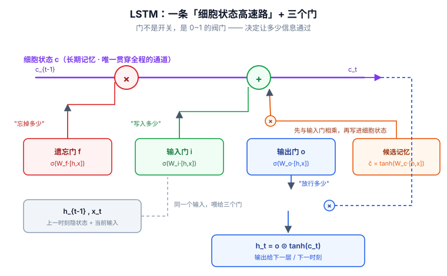
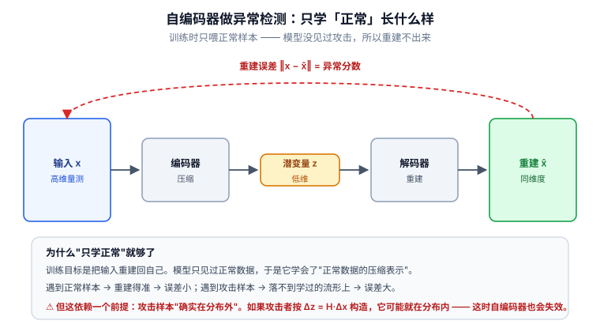

# 📘 第 4 周 · 循环网络与时间序列

> **本周目标**：掌握时序建模这条主线。学完你应该能做到：从零写出 RNN 的前向递推并追踪每一步张量形状；说清梯度消失与爆炸各自的成因和对应解法；独立完成一次电力负荷预测并说清指标选择理由；完整讲出自编码器异常检测的四步范式；用 PR-AUC 而不是 ROC-AUC 报告不平衡场景的结果。
>
> **本周知识清单**：C 域 11 条（C3 全组 + C5 全组，融入每天末尾的 ✅ 知识自查）
>
> **阶段位置**：本周是阶段二（Day 15-28）的后半段，学完即完成"模型结构"阶段，进入 Transformer 与论文阅读。
>
> **⚠️ 含金量提醒**：**电力数据 90% 以上是时序** —— 负荷预测、状态估计、异常检测全是时序任务。这一周学扎实，阶段三读论文会顺畅得多；学夹生了，后面每篇论文都要重来。
>
> **使用方式**：在 Typora 中按标题折叠展开，每天读对应的小节即可。

[[深度学习学习总目录|← 返回总目录]]

---

## Day 22 —— 为什么需要 RNN：隐藏状态与参数共享

> **一句话**：RNN 只有一个公式 `h_t = f(W_h·h_{t-1} + W_x·x_t + b)`，但它的意义是 —— **把"历史"压缩进一个向量里**，并且用同一套参数处理任意长度的序列。

### 一、前馈网络处理序列的三个硬伤

假设你要用 MLP 预测电力负荷。把过去 24 小时的负荷拉平成一个 24 维向量喂进去 —— 看起来可行。但换成 48 小时呢？输入维度变了，模型得重训。

| 硬伤 | 具体表现 | 后果 |
|---|---|---|
| **不定长** | 输入维度写死在 `nn.Linear(in_dim, ...)` | 换序列长度就要改网络 |
| **无记忆** | 每个样本独立处理，t 时刻看不到 t-1 | 无法建模"趋势""惯性" |
| **无位置概念** | 打乱时间步顺序，输出不变 | 时序结构信息丢失 |

**第二个硬伤最致命**。电力负荷的今天和昨天强相关，攻击检测里"前 5 秒的报文模式"和"当前报文"强相关 —— 这些都是**跨时间步的依赖**，前馈网络结构上就表达不了。

> **一个常见误解**："我把 lag 特征拼进去不就有记忆了吗？" —— 这只是**人为指定**要记住哪几步。真正的问题是一段序列里"哪些历史重要"本身应该是**学出来的**，而不是你替模型决定。

### 二、隐藏状态 `h_t`：对历史信息的压缩表示

RNN 的解法是引入一个**隐藏状态（hidden state）** `h_t`，它在时间上传递：

```
        x_1        x_2        x_3
         │          │          │
    ┌────▼────┐ ┌───▼─────┐ ┌──▼──────┐
h_0 │   RNN   │ │   RNN   │ │   RNN   │ ...
───►│  cell   ├─►│  cell   ├─►│  cell   ├──►
    └────┬────┘ └────┬────┘ └────┬────┘
        h_1         h_2         h_3
         │           │           │
        y_1         y_2         y_3
```

`h_t` 是一个**固定长度的向量**，它要装下"截至 t 时刻的全部历史"。

**这是 RNN 的核心思想，也是它的核心瓶颈**：用一个固定维度的向量去压缩任意长的历史 —— 历史越长，压缩损失越大。第 24 天的 LSTM 门控就是为了缓解这个损失。

### 三、核心递推与形状追踪

**两个公式，全部**：

```
h_t = tanh(W_h · h_{t-1} + W_x · x_t + b_h)      ← 更新隐藏状态
y_t = W_o · h_t                                   ← 每个时间步都可以输出
```

**参数形状**：

| 参数 | 形状 | 说明 |
|---|---|---|
| `W_x` | `[H, D_in]` | 输入 → 隐藏 |
| `W_h` | `[H, H]` | 隐藏 → 隐藏 |
| `W_o` | `[D_out, H]` | 隐藏 → 输出 |
| `b_h` | `[H]` | 偏置 |

**形状追踪**（这一步必须自己写下来）：

```
输入 x: [N, T, D_in]        (批次, 时间步, 特征)
隐藏 h: [N, H]              (批次, 隐藏维度)   ← 每个时间步都更新这一个
输出 y: [N, T, D_out]       (批次, 时间步, 输出维度)
```

**从零实现**（不调 `nn.RNN`）：

```python
import torch, torch.nn as nn

class RNNFromScratch(nn.Module):
    def __init__(self, d_in, hidden, d_out):
        super().__init__()
        self.W_x = nn.Linear(d_in, hidden)
        self.W_h = nn.Linear(hidden, hidden, bias=False)
        self.W_o = nn.Linear(hidden, d_out)

    def forward(self, x, h=None):
        N, T, _ = x.shape
        if h is None:
            h = torch.zeros(N, self.W_h.out_features, device=x.device)

        outputs = []
        for t in range(T):                       # ← 时间维必须串行
            h = torch.tanh(self.W_x(x[:, t]) + self.W_h(h))
            outputs.append(self.W_o(h))
        return torch.stack(outputs, dim=1), h    # [N, T, D_out], [N, H]
```

**注意 `for t in range(T)`**：这就是 RNN 无法并行训练的根本原因（对比 Day 21 的 TCN，可以一次性卷积完所有时间步）。

### 四、按时间展开 = 一个权值共享的超深前馈网络

把 RNN 沿时间轴"摊开"，你会看到：

```
x_1 → [同一套参数] → h_1
x_2 → [同一套参数] → h_2
x_3 → [同一套参数] → h_3
```

**这本质上是一个 100 层深的前馈网络，但每一层共享同一套权重。**

| 对比 | 普通深前馈网络 | 展开后的 RNN |
|---|---|---|
| 层数 | 固定 | 等于序列长度 T（可变） |
| 权重 | 每层独立 | **全部层共享** |
| 参数量 | 随层数增长 | **与 T 无关** |

**参数共享带来的好处**：

- 序列长度从 24 变成 240，参数量**完全不变**
- 在短序列上学到的模式，可以泛化到长序列
- 模型不需要见过"同样长度"的序列

**代价**：Day 23 会看到，**100 层共享权重的网络，梯度连乘 100 次** —— 梯度消失/爆炸在这里被放大到极致。

### 五、和电网安全的关系

| 场景 | RNN 在建模什么 |
|---|---|
| **电力负荷预测** | "今天 14:00 的负荷"依赖"昨天 14:00""前 3 小时" |
| **SCADA 量测异常检测** | 电压/电流的正常演化轨迹，偏离即异常 |
| **报文序列异常** | 连续报文的时序模式（正常轮询 vs 攻击扫描） |
| **慢速攻击检测** | 持续数分钟的缓慢数据篡改 |

**"昨天同一时刻"这个信息怎么进模型？** 两条路：

1. **作为额外特征拼进去**：把 `lag_24`、`lag_168` 直接拼到 `x_t` 上（Day 25 会这么做）
2. **让模型自己从 24 步前学到**：靠 `h_t` 传递 —— 但这要求 RNN 能记住 24 步，也就是要求它没有严重的梯度消失

**实践建议**：**两条路一起走**。显式的 lag 特征给模型一个"捷径"，`h_t` 负责捕捉无法预先指定的模式。这在工业时序任务里是最稳的做法。

### 🔍 延伸思考

1. 隐藏状态 `h_t` 是一个固定长度的向量。如果序列很长（比如 10000 步），这个压缩会丢什么？有没有办法让它"选择性记忆"？（提示：这正是 LSTM 要解决的问题）
2. 把 RNN 沿时间展开看，它是一个 100 层共享权重的网络。那么"共享权重"这件事，对梯度回传是好事还是坏事？

### 📚 参考

- 李沐《动手学深度学习》第 8.4 节「循环神经网络的从零开始实现」
- Elman (1990), *Finding Structure in Time*（RNN 的早期形式，检索题名）

### 🎬 视频讲解

> 以下为**关键词检索式**推荐（平台搜索结果，非固定视频链接，避免失效）。
> 直接复制关键词到对应平台搜索即可，也可在结果里挑播放量高的看。

| 平台 | 推荐搜索关键词 | 说明 |
|---|---|---|
| **B站** | [RNN 循环神经网络 通俗讲解](https://search.bilibili.com/all?keyword=RNN+循环神经网络+通俗讲解) | 隐藏状态与递推的直觉 |
| **B站** | [李沐 动手学深度学习 循环神经网络](https://search.bilibili.com/all?keyword=李沐+动手学深度学习+循环神经网络) | 官方课程，RNN 从零实现 |
| **B站** | [RNN 按时间展开 讲解](https://search.bilibili.com/all?keyword=RNN+按时间展开+讲解) | 把展开图讲清楚 |
| **抖音** | [RNN 隐藏状态 是什么](https://www.douyin.com/search/RNN+隐藏状态+是什么) | 三分钟建立直觉 |

### ✅ 知识自查

- [ ] 🟢 **概念** 前馈网络处理序列的三个硬伤：不定长、无记忆、无位置概念
- [ ] 🟢 **概念** 隐藏状态 `h_t`：对历史信息的压缩表示
- [ ] 🟢 **公式** 核心递推：`h_t = f(W_h·h_{t-1} + W_x·x_t + b)`
- [ ] 🟢 **概念** 输出：`y_t = W_o·h_t`（每个时间步都可输出）
- [ ] 🟢 **概念** 按时间展开 = 一个权值共享的超深前馈网络
- [ ] 🟡 **概念** 参数共享带来的好处：序列长度变化不影响参数量
- [ ] 🟢 **实践** 不调 `nn.RNN`，手写前向递推并追踪形状（`代码/22-RNN从零实现.py`）

---

## Day 23 —— BPTT 与梯度问题：消失、爆炸与裁剪

> **一句话**：梯度消失和梯度爆炸是**同一个数学事实的两面** —— 梯度要连乘 T 次 `W_h`。特征值小于 1 就衰减，大于 1 就爆炸，而**裁剪只能治爆炸**。

### 一、BPTT：把 RNN 展开后按普通 BP 处理

**BPTT（Backpropagation Through Time，时间反向传播）** 不是一个新算法 —— 它就是 Day 8 学的反向传播，只不过作用在"沿时间展开"的计算图上。

```
前向：x_1 → h_1 → x_2 → h_2 → x_3 → h_3 → L
反向：L → h_3 → h_2 → h_1        （沿时间倒着走）
```

**关键区别**：因为所有时间步**共享同一套 `W_h`**，反向传播时 `W_h` 的梯度是**所有时间步梯度之和**：

```
∂L/∂W_h = Σ_{t=1}^{T}  ∂L_t/∂W_h
```

> **好消息**：参数共享让每个时间步都在"投票"更新同一套参数，样本效率高。
> **坏消息**：这条梯度链里包含了 `W_h` 的 T 次连乘。

### 二、梯度连乘：消失与爆炸的同一个根

看梯度从 `h_T` 回传到 `h_t` 的路径：

```
∂h_T/∂h_t = ∏_{k=t+1}^{T} ∂h_k/∂h_{k-1}
          = ∏_{k=t+1}^{T} W_hᵀ · diag(tanh'(·))
```

**关键在 `W_hᵀ` 的连乘**。对 `W_h` 做特征值分解，设最大特征值为 `λ_max`：

| 条件 | 后果 | 症状 |
|---|---|---|
| `λ_max < 1` | 梯度**指数衰减** | 浅层收不到梯度，**记不住长依赖** |
| `λ_max > 1` | 梯度**指数增长** | 梯度数值溢出，**loss 变 NaN** |

```
λ_max = 0.9，T = 100  →  0.9¹⁰⁰ ≈ 2.7e-5     （消失）
λ_max = 1.1，T = 100  →  1.1¹⁰⁰ ≈ 1.4e4      （爆炸）
```

**这张表就是 RNN 的核心困难**，务必记住。

**一句话区分两个问题**：

| 问题 | 成因 | 症状 | 解法 |
|---|---|---|---|
| **梯度消失** | 梯度连乘 < 1 | 记不住长依赖 | **LSTM / GRU 门控**（Day 24） |
| **梯度爆炸** | 梯度连乘 > 1 | loss 变 NaN | **梯度裁剪**（本节） |

> **最容易搞混的一条**：**梯度裁剪只治爆炸，不治消失。** 裁剪是把过大的梯度"按比例缩小"，而消失的梯度本来就很小，裁剪对它毫无作用 —— 你没法把小数字"裁"成大数字。

### 三、梯度裁剪：一行代码治爆炸

```python
import torch.nn.utils as utils

loss.backward()
utils.clip_grad_norm_(model.parameters(), max_norm=1.0)   # ← 放在 backward 之后、step 之前
optimizer.step()
```

**原理**：计算所有参数梯度的全局范数 `‖g‖`。如果 `‖g‖ > max_norm`，就整体缩放到 `max_norm`：

```
g ← g × (max_norm / ‖g‖)
```

**注意是"整体缩放"，不是"逐元素截断"** —— 这样保持了梯度的**方向不变**，只缩小步长。

| 裁剪方式 | 做法 | 效果 |
|---|---|---|
| `clip_grad_norm_` | 按全局范数等比缩放 | ✅ 保持方向，推荐 |
| `clip_grad_value_` | 每个元素单独截断到 [-v, v] | 会改变梯度方向 |

**放置位置**（顺序不能错）：

```python
optimizer.zero_grad()          # ① 清空
loss.backward()                # ② 反向
clip_grad_norm_(...)           # ③ 裁剪 ← 必须在 backward 之后
optimizer.step()               # ④ 更新
```

> **RNN 训练的默认动作**：**只要用 RNN/LSTM，就把梯度裁剪加上。** 这是几乎零成本、收益确定的操作。

### 四、截断 BPTT：用"少看一点"换可训练性

即使有裁剪，T = 1000 步的完整 BPTT 依然太慢太占显存。**截断 BPTT（Truncated BPTT）** 的做法：

```
不在整个序列上回传，只在最后 k 步上回传梯度（比如 k = 35）
但隐藏状态 h 仍然一路带着往前走（不截断前向）
```

```python
# 伪代码：把长序列切成若干段，每段回传一次
for segment in split_sequence(x, seg_len=35):
    out, h = model(segment, h)
    loss = criterion(out, target_segment)
    loss.backward()                     # 只回传到本段起点
    clip_grad_norm_(model.parameters(), 1.0)
    optimizer.step()
    optimizer.zero_grad()
    h = h.detach()                      # ← 关键：切断跨段的梯度链
```

**`h = h.detach()` 这一行是精髓**：前向仍然带着完整历史，但梯度只回传 `seg_len` 步。**用"梯度视野变短"换"训练可行"**。

| 参数 | 权衡 |
|---|---|
| `seg_len` 大 | 能学到更长依赖，但慢、占显存 |
| `seg_len` 小 | 快，但长程依赖学不到 |

### 五、和电网安全的关系

**检测一个持续 10 分钟的慢速攻击，模型需要记住多长的历史？**

```
需要覆盖的时间步 = 采样率 × 时长
```

| 采样率 | 10 分钟 | 需要的 T |
|---|---|---|
| 1 次/秒（SCADA 秒级量测） | 600 s | 600 |
| 80 点/周波（4000 Hz） | 600 s | **2,400,000** |

**第二行说明了什么**：**原始高频采样下，没有任何 RNN 能"记住" 10 分钟。** 这是工程上必须做的两件事：

1. **降采样 / 聚合**：把高频信号聚合成秒级或分钟级特征（均值、最大值、峰峰值），把 T 压到可训练范围
2. **多尺度设计**：短窗口（秒级）抓突变，长窗口（分钟级）抓漂移，两个模型分别建模

> **论文写作提醒**：如果你声称检测"持续 10 分钟的慢速攻击"，审稿人一定会问"你的模型时间步是多少、覆盖多长"。**这个数字必须能自圆其说。**

**另外一条安全视角**：梯度裁剪不只是训练技巧，它也是**防御梯度爆炸攻击**的手段 —— 如果攻击者能注入极端样本诱发梯度爆炸，裁剪能限制单步更新的幅度。

### 🔍 延伸思考

1. 梯度裁剪把 `‖g‖` 缩放到 `max_norm`。如果攻击者构造的样本让梯度方向本身就是错的，裁剪能帮上忙吗？
2. `h = h.detach()` 让梯度只回传 `seg_len` 步。如果真正的长程依赖是 200 步，而 `seg_len = 35`，模型还有办法学到它吗？（提示：想想 LSTM 的细胞状态 + 多层堆叠）

### 📚 参考

- Pascanu, Mikolov & Bengio (2013), *On the difficulty of training recurrent neural networks*, ICML —— **本节必读**
- 李沐《动手学深度学习》第 8.5 节「循环神经网络的从零开始实现」（含梯度裁剪）、第 9.1 节

### 🎬 视频讲解

> 以下为**关键词检索式**推荐（平台搜索结果，非固定视频链接，避免失效）。

| 平台 | 推荐搜索关键词 | 说明 |
|---|---|---|
| **B站** | [梯度消失 梯度爆炸 RNN](https://search.bilibili.com/all?keyword=梯度消失+梯度爆炸+RNN) | 讲清连乘导致的两个极端 |
| **B站** | [BPTT 时间反向传播 讲解](https://search.bilibili.com/all?keyword=BPTT+时间反向传播+讲解) | 展开图上的反向传播 |
| **B站** | [梯度裁剪 讲解](https://search.bilibili.com/all?keyword=梯度裁剪+讲解) | 裁剪的原理与代码位置 |
| **B站** | [李宏毅 机器学习 RNN](https://search.bilibili.com/all?keyword=李宏毅+机器学习+RNN) | 梯度问题的直观讲解 |
| **抖音** | [梯度爆炸 怎么办](https://www.douyin.com/search/梯度爆炸+怎么办) | 三分钟了解裁剪 |

### ✅ 知识自查

- [ ] 🟡 **概念** BPTT（时间反向传播）：把 RNN 展开后按普通 BP 处理
- [ ] 🟢 **概念** 梯度消失：`W_h` 多次连乘，特征值 <1 就指数衰减
- [ ] 🟢 **概念** 梯度爆炸：特征值 >1 就指数增长
- [ ] 🟢 **API** 梯度裁剪：`torch.nn.utils.clip_grad_norm_(model.parameters(), max_norm)`
- [ ] 🟢 **概念** 梯度裁剪只治爆炸，**不治消失** —— 消失要靠 LSTM 门控
- [ ] 🟡 **概念** 截断 BPTT：限定回传的时间步数
- [ ] 🟡 **概念** 长程依赖问题的本质：模型记不住很久以前的信息
- [ ] 🟢 **实践** 跑一次梯度裁剪演示，观察 loss 是否变 NaN（`代码/23-梯度裁剪演示.py`）

---

## Day 24 —— LSTM 与 GRU：三个门如何学会忘记

> **一句话**：LSTM 的核心不是"记得更多"，而是**"学会忘记"** —— 遗忘门用 Sigmoid 输出一个 0~1 的系数，让模型自己决定哪些旧记忆该丢掉。

### 一、三个门：LSTM 的全部机制

**门（gate）** = Sigmoid + 逐元素相乘。Sigmoid 输出 `(0, 1)`，相当于一个**可学习的"开关"**。

| 门 | 公式 | 作用 |
|---|---|---|
| **遗忘门** `f_t` | `σ(W_f·[h_{t-1}, x_t] + b_f)` | 决定丢弃多少**旧记忆** |
| **输入门** `i_t` | `σ(W_i·[h_{t-1}, x_t] + b_i)` | 决定写入多少**新信息** |
| **输出门** `o_t` | `σ(W_o·[h_{t-1}, x_t] + b_o)` | 决定输出多少**当前记忆** |

**完整计算流程**：

```
① 候选记忆：  C̃_t = tanh(W_C·[h_{t-1}, x_t] + b_C)      ← 这一时刻"想记什么"
② 遗忘门：    f_t = σ(W_f·[h_{t-1}, x_t] + b_f)          ← 旧记忆保留多少
③ 输入门：    i_t = σ(W_i·[h_{t-1}, x_t] + b_i)          ← 新信息写入多少
④ 更新细胞：  C_t = f_t ⊙ C_{t-1} + i_t ⊙ C̃_t            ← ★ 加性更新
⑤ 输出门：    o_t = σ(W_o·[h_{t-1}, x_t] + b_o)
⑥ 输出隐藏：  h_t = o_t ⊙ tanh(C_t)
```

（`⊙` 表示逐元素相乘）

> **核心理解：门控机制的本质是"学会忘记"**
> - `f_t ≈ 1` → 完整保留旧记忆
> - `f_t ≈ 0` → 完全丢弃旧记忆
>
> **模型自己学出来"什么该记、什么该忘"** —— 这是它比裸 RNN 强的根本原因。

### 二、细胞状态：那条"传送带"，以及加性更新为什么能救梯度

**细胞状态 `C_t`** 是 LSTM 里那条贯穿始终的"传送带"，它**只做加法和逐元素乘法**，不经过矩阵乘法：

```
C_{t-1} ──×f_t──► ⊕ ──► C_t
                   ▲
              i_t ⊙ C̃_t
```

**为什么这能缓解梯度消失**（本节最重要的一段推导）：

**裸 RNN** 的梯度传递是**乘性**的：

```
h_t = tanh(W_h · h_{t-1} + ...)
∂h_t/∂h_{t-1} = W_hᵀ · diag(tanh')        ← 有矩阵连乘，特征值 <1 就衰减
```

**LSTM** 的细胞状态更新是**加性**的：

```
C_t = f_t ⊙ C_{t-1} + i_t ⊙ C̃_t
∂C_t/∂C_{t-1} = f_t                        ← 只有逐元素乘法，没有矩阵连乘！
```

**关键差别**：

| | 裸 RNN | LSTM |
|---|---|---|
| 状态更新 | `h_t = tanh(W_h·h_{t-1} + ...)` | `C_t = f_t⊙C_{t-1} + i_t⊙C̃_t` |
| 梯度传递 | `W_hᵀ · diag(tanh')`（**矩阵连乘**） | `f_t`（**逐元素系数**） |
| 连乘结果 | 特征值 <1 就指数衰减 | `f_t ≈ 1` 时**梯度几乎无损通过** |

**所以 LSTM 学到的"记住"（`f_t ≈ 1`）就意味着梯度也能一路传回去** —— 记忆和梯度走的是同一条路。这是 LSTM 设计最巧妙的地方。

> **一句话总结**：**裸 RNN 的梯度要穿过矩阵连乘；LSTM 的梯度只要穿过一串逐元素系数。** 前者会指数衰减，后者可以被学成接近 1。



> **看图说话**：上图把 LSTM 的六步公式画成了一张电路图。**紫色横线**是细胞状态 `c` —— 整张图里唯一从左贯到右、不经过任何矩阵乘法的通道，这就是“传送带”。**红色 ×** 是遗忘门在削减旧记忆（乘一个 0~1 的数）；**绿色 +** 是输入门在写入新记忆。最容易看漏的是橙色那个小 `×`：候选记忆 `c̃` **必须先和输入门相乘**才能进入加法节点 —— 公式 `C_t = f_t ⊙ C_{t-1} + i_t ⊙ C̃_t` 里的两个逐元素乘都在这里。最后蓝色的 `×` 是输出门在决定“这一刻对外交出多少”，`h_t = o ⊙ tanh(c_t)`。把这张图和本节那六行公式对照着看，`f / i / o` 三个门分别对应哪条线就一目了然了。


### 三、GRU：合并为两个门，参数更少

**GRU（Gated Recurrent Unit）** 把 LSTM 的三个门简化成两个，并把细胞状态和隐藏状态合并：

| 门 | 公式 | 作用 |
|---|---|---|
| **重置门** `r_t` | `σ(W_r·[h_{t-1}, x_t])` | 决定忽略多少历史 |
| **更新门** `z_t` | `σ(W_z·[h_{t-1}, x_t])` | 决定保留多少旧状态 |

```
h̃_t = tanh(W·[r_t ⊙ h_{t-1}, x_t])
h_t = (1 - z_t) ⊙ h_{t-1} + z_t ⊙ h̃_t
```

| 对比 | LSTM | GRU |
|---|---|---|
| 门数 | 3 个 | 2 个 |
| 状态 | `h_t` + `C_t`（两个） | 只有 `h_t` |
| 参数量 | 多 | **少约 25%** |
| 训练速度 | 慢 | **快** |
| 长序列表现 | **通常更好** | 略逊 |

**选择经验**：

| 情况 | 建议 |
|---|---|
| 数据量小 | **GRU**（参数少，不容易过拟合） |
| 长序列、依赖复杂 | **LSTM**（表达能力更强） |
| 算力受限 / 边缘部署 | **GRU** |
| 不确定 | **两个都试，用验证集说话** |

> 实际经验：**大多数任务上两者差距不大**，GRU 在中小数据集上常因参数少而略胜。论文里两个都报，是稳妥的做法。

### 四、PyTorch API 与形状

```python
import torch, torch.nn as nn

lstm = nn.LSTM(
    input_size=16,        # 每个时间步的特征数 D_in
    hidden_size=64,       # 隐藏维度 H
    num_layers=2,         # 堆叠层数
    batch_first=True,     # ★ 让输入是 [N, T, D] 而不是 [T, N, D]
    dropout=0.2,          # 层间 Dropout（num_layers=1 时无效）
    bidirectional=False,  # 是否双向
)

x = torch.randn(32, 50, 16)                      # [N=32, T=50, D_in=16]
output, (h_n, c_n) = lstm(x)
```

**三个返回值各自的含义**：

| 返回值 | 形状 | 含义 | 什么时候用 |
|---|---|---|---|
| `output` | `[N, T, H]` | **每个时间步**的隐藏状态 | 序列标注、逐点异常检测 |
| `h_n` | `[num_layers, N, H]` | **最后一个时间步**的隐藏状态 | 分类、回归（只要一个汇总向量） |
| `c_n` | `[num_layers, N, H]` | 最后一步的细胞状态 | 继续往下传（多段推理） |

> **最容易踩的坑**：`batch_first` 默认为 **False**。忘了设 `True` 就会把 `[N, T, D]` 当成 `[T, N, D]` 处理 —— **不报错，但结果是错的**。这个坑必须记住。

**典型用法**：

```python
# 分类/回归：只取最后一步
last = output[:, -1, :]                # [N, H]  ← 推荐，等价于 h_n[-1]
pred = nn.Linear(64, 1)(last)

# 逐点异常检测：用全部时间步
pred = nn.Linear(64, 1)(output)        # [N, T, 1]
```

### 五、和电网安全的关系

**门控机制和异常检测的滑动窗口是一回事吗？**

**不是，而且是本质区别**：

| | 滑动窗口 | 门控机制 |
|---|---|---|
| 谁决定看多长历史 | **人**（窗口大小写死） | **模型**（`f_t` 学出来） |
| 对不同时间步 | 一视同仁 | 差异化（该记的记，该忘的忘） |
| 对突变的响应 | 固定延迟 | 可学习 |

**为什么这在电力场景很重要**：负荷曲线的"日周期"要求记住 24 步前，"突发扰动"要求快速忘掉旧状态 —— **同一个模型需要同时具备这两种行为**。固定窗口做不到，门控可以。

**双向 LSTM（BiLSTM）在离线场景的价值**：

```python
lstm = nn.LSTM(16, 64, batch_first=True, bidirectional=True)
# output: [N, T, 128]（两个方向拼接）
```

| 场景 | 能否用双向 |
|---|---|
| **离线取证 / 事后分析** | ✅ 可以用 —— 全序列都在手上 |
| **在线检测 / 实时告警** | ❌ **不能用** —— 双向需要"未来"信息，属于数据泄漏 |

> **审稿人会挑这一点**：如果你声称"实时检测"却用了 BiLSTM，这是硬伤。**在线检测必须用单向（因果）结构。**

### 🔍 延伸思考

1. 遗忘门的偏置 `b_f` 在 PyTorch 里初始化为 1（而不是 0）。为什么要这么做？（提示：训练初期应该"默认记住"还是"默认忘记"）
2. LSTM 的梯度通过 `f_t` 逐元素传递，理论上 `f_t ≈ 1` 时能无限传递。那 LSTM 就真的能记住任意长的历史吗？（提示：`f_t` 是学出来的，不是常数；还有饱和问题）

### 📚 参考

- Hochreiter & Schmidhuber (1997), *Long Short-Term Memory*, Neural Computation —— **LSTM 原始论文，本节必读**
- Cho et al. (2014), *Learning Phrase Representations using RNN Encoder–Decoder for Statistical Machine Translation*（GRU 的出处）
- 李沐《动手学深度学习》第 9.2 节「长短期记忆网络（LSTM）」、第 10 章

### 🎬 视频讲解

> 以下为**关键词检索式**推荐（平台搜索结果，非固定视频链接，避免失效）。

| 平台 | 推荐搜索关键词 | 说明 |
|---|---|---|
| **B站** | [LSTM 三个门 动画 讲解](https://search.bilibili.com/all?keyword=LSTM+三个门+动画+讲解) | 逐门讲解，动画最直观 |
| **B站** | [LSTM 原理 通俗](https://search.bilibili.com/all?keyword=LSTM+原理+通俗) | 细胞状态与传送带类比 |
| **B站** | [LSTM GRU 区别 怎么选](https://search.bilibili.com/all?keyword=LSTM+GRU+区别+怎么选) | 两者对比与选型 |
| **B站** | [李沐 动手学深度学习 LSTM](https://search.bilibili.com/all?keyword=李沐+动手学深度学习+LSTM) | 官方课程，含代码实现 |
| **抖音** | [LSTM 遗忘门 一分钟](https://www.douyin.com/search/LSTM+遗忘门+一分钟) | 三分钟理解"学会忘记" |

### ✅ 知识自查

- [ ] 🟢 **概念** 遗忘门 `f_t`：决定丢弃多少旧记忆
- [ ] 🟢 **概念** 输入门 `i_t`：决定写入多少新信息
- [ ] 🟢 **概念** 输出门 `o_t`：决定输出多少当前记忆
- [ ] 🟢 **概念** 细胞状态 `C_t`：那条"传送带"，加性更新而非乘性
- [ ] 🟢 **推导** 为什么加性更新能缓解梯度消失（`C_t = f·C_{t-1} + i·C̃`，梯度不回连乘）
- [ ] 🟢 **概念** GRU：合并为更新门 + 重置门，参数更少
- [ ] 🟡 **概念** LSTM vs GRU 的选择经验：数据量小选 GRU，长序列选 LSTM
- [ ] 🟢 **API** `nn.LSTM(input_size, hidden_size, num_layers, batch_first=True)`
- [ ] 🟢 **API** LSTM 返回的 `(output, (h_n, c_n))` 各自含义
- [ ] 🟢 **实践** 用 LSTM 跑一次时序预测（`代码/24-LSTM时序预测.py`）

---

## Day 25 —— 时序预测实战：电力负荷预测

> **一句话**：负荷预测的胜负**八成不在模型，而在特征**。日周期、周周期、节假日这些"物理先验"喂进去，LSTM 才有东西可学。

### 一、短期负荷预测 STLF 与负荷的三种周期

**短期负荷预测（STLF, Short-Term Load Forecasting）**：预测未来 1 小时 ~ 1 天。它是电力系统调度、机组组合、经济调度的输入。

**负荷曲线有三层周期性**：

| 周期 | 时间尺度 | 物理原因 | 建模方式 |
|---|---|---|---|
| **日周期** | 24 小时 | 作息规律（早晚高峰、夜间低谷） | `lag_24`、`hour` 特征 |
| **周周期** | 168 小时 | 工作日 / 周末差异 | `lag_168`、`dayofweek` |
| **年周期 / 季节性** | 数月 | 气温、供暖/制冷 | `month`、温度特征 |

```
负荷
 │      ╱╲          ╱╲
 │     ╱  ╲        ╱  ╲         ← 日周期：每天两个峰
 │    ╱    ╲      ╱    ╲
 │   ╱      ╲    ╱      ╲
 │  ╱        ╲  ╱        ╲
 └──────────────────────────► 时间
   Mon  Tue  Wed  Thu  Fri  Sat  Sun
   └──── 工作日（高）────┘ └周末（低）┘  ← 周周期
```

> **建模启示**：**如果模型只有 `lag_1` 而没有 `lag_24`，它必须自己从 24 步的历史里"悟出"日周期** —— 这是不必要的困难。**把已知的物理结构显式喂给模型，是工程上最划算的操作。**

### 二、时间特征工程

```python
import pandas as pd

def add_time_features(df, ts_col="timestamp"):
    ts = pd.to_datetime(df[ts_col])

    df["hour"]       = ts.dt.hour
    df["dayofweek"]  = ts.dt.dayofweek          # 0=周一
    df["is_weekend"] = (ts.dt.dayofweek >= 5).astype(int)
    df["month"]      = ts.dt.month

    # ★ 周期特征的 sin/cos 编码（关键技巧）
    df["hour_sin"] = np.sin(2 * np.pi * df["hour"] / 24)
    df["hour_cos"] = np.cos(2 * np.pi * df["hour"] / 24)
    df["dow_sin"]  = np.sin(2 * np.pi * df["dayofweek"] / 7)
    df["dow_cos"]  = np.cos(2 * np.pi * df["dayofweek"] / 7)
    return df
```

**为什么必须做 sin/cos 编码？**

如果直接把 `hour` 当成数值 0~23 喂进去，模型会认为 **23 点和 0 点相隔 23**，而实际上它们**只差 1 小时**。周期特征在首尾是"接上"的：

| 编码方式 | 23 点 vs 0 点 | 模型的理解 |
|---|---|---|
| 原始数值 | 相差 23 | ❌ 完全无关 |
| **sin/cos** | 在单位圆上相邻 | ✅ 接近 |

> **这条技巧在电力场景非常常用，也是审稿人爱看的细节** —— 它体现了"你懂业务"。同理适用于 `month`（12 月 → 1 月）。

**节假日处理**：

```python
# 用 chinese_calendar 库（国内节假日）
import chinese_calendar as calendar
df["is_holiday"] = ts.dt.date.map(lambda d: calendar.is_holiday(d)).astype(int)

# 更细的：节前/节后各 1-2 天也是特殊模式
df["is_pre_holiday"] = df["is_holiday"].shift(-1).fillna(0).astype(int)
```

### 三、滞后特征构造：给模型"捷径"

```python
for lag in [1, 2, 3, 24, 25, 48, 168]:
    df[f"lag_{lag}"] = df["load"].shift(lag)

# 滑动统计量（捕捉近期趋势）
df["roll_mean_24"] = df["load"].shift(1).rolling(24).mean()
df["roll_std_24"]  = df["load"].shift(1).rolling(24).std()
df["roll_max_24"]  = df["load"].shift(1).rolling(24).max()
```

**为什么 `rolling` 前面要加 `.shift(1)`**：

> ⚠️ **这是最容易犯的数据泄漏错误**。`rolling(24).mean()` 在时刻 t 包含了 `load[t]` 本身 —— 而 `load[t]` 正是你要预测的目标！**必须先 shift(1) 把窗口移到"只看过去"。**

| 特征 | 含义 | 为什么有用 |
|---|---|---|
| `lag_1` | 上 1 小时 | 短期惯性 |
| `lag_24` | 昨天同一时刻 | 日周期 |
| `lag_168` | 上周同一时刻 | 周周期 |
| `roll_mean_24` | 过去 24h 均值 | 近期水平 |
| `roll_std_24` | 过去 24h 标准差 | 波动程度 |

### 四、滑动窗口构造训练样本

时序预测的标准做法：**用过去 L 步预测未来 H 步**。

```python
import numpy as np
from torch.utils.data import Dataset

class WindowDataset(Dataset):
    """输入: [N, L, F]  目标: [N, H]"""
    def __init__(self, feat, target, lookback=168, horizon=24):
        self.feat, self.target = feat, target
        self.L, self.H = lookback, horizon

    def __len__(self):
        return len(self.feat) - self.L - self.H + 1

    def __getitem__(self, i):
        x = self.feat[i : i + self.L]                 # [L, F]
        y = self.target[i + self.L : i + self.L + self.H]   # [H]
        return torch.FloatTensor(x), torch.FloatTensor(y)
```

**`lookback` 怎么定**：

| 预测目标 | 建议 lookback |
|---|---|
| 预测未来 1 小时 | 24~48（至少覆盖一个日周期） |
| 预测未来 24 小时 | **168**（覆盖一个完整周周期） |

> **原则**：**lookback 至少要覆盖你最关心的那个周期。** 要预测日周期，就得让它看到完整的 24 步。

**⚠️ 时序数据划分绝不能随机打散**（回顾 Day 13）：

```python
n = len(dataset)
train = dataset[: int(n * 0.7)]        # 早期
val   = dataset[int(n * 0.7) : int(n * 0.85)]
test  = dataset[int(n * 0.85) :]       # 最近期
```

### 五、模型与反归一化

```python
class LoadLSTM(nn.Module):
    def __init__(self, d_in, hidden=64, horizon=24):
        super().__init__()
        self.lstm = nn.LSTM(d_in, hidden, num_layers=2,
                            batch_first=True, dropout=0.2)
        self.head = nn.Linear(hidden, horizon)      # 一次性输出未来 H 步

    def forward(self, x):                           # x: [N, L, F]
        out, _ = self.lstm(x)
        return self.head(out[:, -1, :])             # 只取最后一步 → [N, H]
```

**归一化与反归一化**（回顾 Day 13 的红线）：

```python
# ① 只用训练集统计量
mu, sigma = y_train.mean(), y_train.std()

# ② 归一化
y_train_n = (y_train - mu) / sigma
y_val_n   = (y_val   - mu) / sigma

# ③ 训练完成后，评估前反归一化回原量纲（MW）
pred_mw = pred_n * sigma + mu
true_mw = true_n * sigma + mu
```

> **⚠️ 两个必错的点**：
> 1. 用**全量数据**算 `mu/sigma` → 数据泄漏
> 2. 报指标时**忘了反归一化** → 报出来的 MAE 是"归一化空间"的，不是 MW，**数字小得离谱**，审稿人一眼看穿

### 六、评价指标：MAE / RMSE / MAPE 的区别与陷阱

| 指标 | 公式 | 特性 | 何时用 |
|---|---|---|---|
| **MAE** | `mean(\|y - ŷ\|)` | 对异常值不敏感，量纲同原数据 | 通用，最诚实 |
| **RMSE** | `sqrt(mean((y - ŷ)²))` | 放大大误差，对异常值敏感 | 关心大偏差 |
| **MAPE** | `mean(\|y - ŷ\| / y) × 100%` | 无量纲，可跨序列比较 | **注意分母为 0** |

```python
def mae(y, p):  return np.mean(np.abs(y - p))
def rmse(y, p): return np.sqrt(np.mean((y - p) ** 2))
def mape(y, p):
    mask = np.abs(y) > 1e-6                    # ★ 过滤掉接近 0 的真实值
    return np.mean(np.abs((y[mask] - p[mask]) / y[mask])) * 100
```

**MAPE 的坑（必须知道）**：

```
真实值 y = 0.5，预测 ŷ = 1.0
MAPE = |0.5 - 1.0| / 0.5 = 100%      ← 单个样本就让指标爆掉
```

| 问题 | 说明 |
|---|---|
| **分母接近 0 时爆炸** | 电力场景里"零负荷"（检修、停运）很常见 |
| **对低估惩罚不对称** | 同样的绝对误差，真实值越小，MAPE 越大 |
| **无法处理负值** | 风电/光伏的净负荷可能为负 |

**实践建议**：

1. **主指标用 MAE**（物理含义清晰：平均误差多少 MW）
2. RMSE 作为补充（说明大偏差情况）
3. MAPE **必须做分母保护**，并在论文里注明处理方式

> **审稿人会问**："你的 MAPE 是怎么处理零负荷的？" —— 提前写好这句话。

### 七、和电网安全的关系

**负荷预测被攻击会造成什么后果？**

```
负荷预测 → 调度决策（机组组合、经济调度、备用容量） → 物理执行
```

**攻击链条**：如果攻击者能污染预测模型的输入（篡改量测数据），预测结果就会偏。**预测被操纵 = 决策被操纵**：

| 攻击目标 | 手段 | 后果 |
|---|---|---|
| 让预测偏高 | 注入虚高的负荷量测 | 多开机组，成本上升 |
| 让预测偏低 | 注入偏低的负荷量测 | **备用容量不足，可能引发连锁故障** |
| 让预测震荡 | 注入随机扰动 | 调度员失去信任，系统频繁调整 |

**这就是你的潜在选题。** 它有几个很好的性质：

1. **有明确的物理后果**（不是"指标掉几个点"这种抽象损失）
2. **可以量化**（预测误差 → 备用容量缺口 → 失负荷概率）
3. **有防御空间**（鲁棒训练、异常输入检测、多源交叉验证）
4. **结合了你的两个背景**（信息安全 + AI）

**论文的典型结构**：

```
① 用 LSTM 建一个正常的负荷预测模型（本周做的事）
② 设计攻击：篡改输入量测，让预测偏移（回顾 Day 5 的对抗样本思路）
③ 量化影响：偏移 X% → 备用容量缺口 Y MW → 风险指标 Z
④ 提出防御：输入异常检测 / 鲁棒损失 / 集成预测
⑤ 消融与对比
```

### 🔍 延伸思考

1. 如果负荷序列在某天发生了"从未出现过的模式"（比如疫情封控、极端天气），模型会怎样？这是"分布外泛化"问题，你会怎么检测它？
2. `lookback=168` 意味着模型输入有 168×F 个特征。如果 F=20，输入就是 3360 维。这和"时序越长越好"矛盾吗？（提示：参数量、过拟合、以及真正有用的历史长度）

### 📚 参考

- 李沐《动手学深度学习》第 9 章、第 10 章
- *Informer: Beyond Efficient Transformer for Long Sequence Time-Series Forecasting*（Zhou et al., AAAI 2021，长序列预测必读，Day 34 会展开）
- 电力负荷预测综述：检索 `short-term load forecasting review deep learning`

### 🎬 视频讲解

> 以下为**关键词检索式**推荐（平台搜索结果，非固定视频链接，避免失效）。

| 平台 | 推荐搜索关键词 | 说明 |
|---|---|---|
| **B站** | [LSTM 电力负荷预测 实战](https://search.bilibili.com/all?keyword=LSTM+电力负荷预测+实战) | 完整走一遍负荷预测 |
| **B站** | [时间序列预测 PyTorch](https://search.bilibili.com/all?keyword=时间序列预测+PyTorch) | 滑窗、划分、训练全流程 |
| **B站** | [时间特征 工程 sin cos 编码](https://search.bilibili.com/all?keyword=时间特征+工程+sin+cos+编码) | 周期编码技巧讲清楚 |
| **B站** | [MAE RMSE MAPE 区别](https://search.bilibili.com/all?keyword=MAE+RMSE+MAPE+区别) | 三个指标怎么选 |
| **抖音** | [电力负荷预测 怎么做](https://www.douyin.com/search/电力负荷预测+怎么做) | 快速了解业务背景 |

### ✅ 知识自查

- [ ] 🟢 **概念** 短期负荷预测 STLF：预测未来 1 小时 ~ 1 天
- [ ] 🟢 **概念** 负荷的典型模式：日周期 + 周周期 + 季节性
- [ ] 🟢 **实践** 时间特征工程：小时 / 星期 / 是否节假日 / 是否周末
- [ ] 🟢 **实践** 滞后特征构造：`lag_1` / `lag_24` / `lag_168`
- [ ] 🟢 **API** 滑动窗口构造训练样本（`TensorDataset` 或自定义 `Dataset`）
- [ ] 🟢 **概念** 评价指标：MAE / RMSE / MAPE 的区别
- [ ] 🟢 **概念** MAPE 的坑：真实值接近 0 时会爆炸
- [ ] 🟡 **实践** 归一化策略：用训练集统计量，且要能反归一化回原量纲
- [ ] 🟢 **实践** 跑通一次完整的负荷预测实验（`代码/25-负荷预测LSTM.py`）

---

## Day 26 —— 自编码器与异常检测：只学正常分布

> **一句话**：自编码器异常检测的全部逻辑是 —— **模型只见过正常数据，所以它只会重建正常数据；异常样本重建不出来，重建误差自然就大**。

### 一、自编码器结构：编码器 → 瓶颈层 → 解码器

```
输入 x ──► 编码器 Encoder ──► 瓶颈 z ──► 解码器 Decoder ──► 重建 x̂
 [D]        (降维)           [d ≪ D]       (升维)           [D]

损失 = MSE(x, x̂)
```

```python
import torch, torch.nn as nn

class AutoEncoder(nn.Module):
    def __init__(self, d_in=20, latent=4):
        super().__init__()
        self.encoder = nn.Sequential(
            nn.Linear(d_in, 32), nn.ReLU(),
            nn.Linear(32, 16),   nn.ReLU(),
            nn.Linear(16, latent),                    # 瓶颈层：4 维
        )
        self.decoder = nn.Sequential(
            nn.Linear(latent, 16), nn.ReLU(),
            nn.Linear(16, 32),     nn.ReLU(),
            nn.Linear(32, d_in),                      # 回到原维度
        )

    def forward(self, x):
        z = self.encoder(x)
        return self.decoder(z)
```

**训练目标是"重建自己"，不需要标签** —— 这是自编码器最大的工程优势（电力场景里标注异常样本极其昂贵）。

### 二、瓶颈层的作用：强制压缩，逼模型学"本质特征"

如果瓶颈层和输入一样大，模型可以学成**恒等映射**（`x̂ = x`），重建误差恒为 0，什么都没学到。

**瓶颈层比输入小得多**（比如 20 维 → 4 维），模型**必须**：

1. 找到数据里**真正的低维结构**（哪些特征组合是重要的）
2. 丢弃噪声和冗余

**这是"用容量限制换取表征质量"** —— 和 Day 3 讲的 L1 正则产生稀疏解是同一个哲学：**给模型加约束，逼它抓住本质**。

| 瓶颈维度 | 效果 |
|---|---|
| 太小 | 欠拟合，正常样本也重建不好 → 假阳性多 |
| 太大 | 学成恒等映射，异常也能重建 → 漏报多 |
| **合适** | 正常样本重建误差低，异常样本重建误差高 |

> **瓶颈维度是一个必须做消融的超参**。论文里报"latent ∈ {2, 4, 8, 16}"的对比曲线，是很加分的做法。



> **看图说话**：上图是自编码器的流水线：高维输入 `x` → 编码器压缩 → 瓶颈层 `z`（低维）→ 解码器重建 → `x̂`。顶部那条红色弧线是训练信号：**重建误差 `‖x − x̂‖` 本身就是异常分数**，不需要额外的判别头 —— 这是无监督方法省掉标注成本的关键。但底框里那条“诚实边界”必须看清：这套逻辑依赖一个**前提**，即攻击样本确实落在训练分布之外。而 FDI 攻击恰恰是**按 `Δz = H·Δx` 构造的**，它可能完全落在正常量测的分布里 —— 这时自编码器会把攻击样本重建得很好，误差一样小，检测不出来。所以做实验时**不能只报“AUC 0.99”就收工**，必须在论文里写清攻击是怎么造出来的。


### 三、四步训练范式（记住这个范式）

```
① 只用正常数据训练 AE，损失 = 重建 MSE
② 在验证集上算正常样本的重建误差分布
③ 取 99 分位作为阈值
④ 测试时：重建误差 > 阈值 → 判为异常
```

```python
# ① 只用正常数据训练
for x, in normal_loader:                    # 注意：loader 里只有正常样本
    optimizer.zero_grad()
    loss = nn.functional.mse_loss(model(x), x)
    loss.backward()
    optimizer.step()

# ② 在验证集（也是正常数据）上算误差分布
model.eval()
with torch.no_grad():
    errs = torch.stack([
        ((model(x) - x) ** 2).mean(dim=1)   # 每个样本一个误差值
        for x, in val_loader
    ]).flatten()

# ③ 取 99 分位作为阈值
threshold = torch.quantile(errs, 0.99)

# ④ 测试
with torch.no_grad():
    test_err = ((model(x_test) - x_test) ** 2).mean(dim=1)
    pred = (test_err > threshold).long()    # 1 = 异常
```

**异常分数的两种粒度**：

| 粒度 | 计算方式 | 用途 |
|---|---|---|
| **样本级** | `mean((x̂ - x)²)` 对整个样本 | 判断"这条样本是否异常" |
| **特征级 / 时间步级** | 每个维度/时间步单独算误差 | 定位"哪里异常"（可解释性更强） |

**特征级误差 + 加权**是更高级的做法：

```python
# 每个特征单独算误差，再按重要性加权
per_feat_err = (x_hat - x) ** 2              # [N, D]
score = (per_feat_err * importance).mean(dim=1)   # importance 可人为指定或学出来
```

> **在电网场景里，"哪个量测点异常"比"这条样本异常"更有价值** —— 运维需要知道去看哪个设备。**论文里做特征级归因，是很强的加分项。**

### 四、阈值选择：分位数 vs 其他方法

| 方法 | 做法 | 优缺点 |
|---|---|---|
| **分位数**（最常用） | 取验证集误差的 99 / 99.5 分位 | 简单，可控假阳性率 |
| **均值 + kσ** | `μ + 3σ` | 假设误差近似高斯，实际常不成立 |
| **极值理论 EVT** | 对尾部建模，外推极端分位 | 理论更严谨，实现复杂 |
| **按业务定** | 由可接受的误报率倒推 | 最贴近工业需求 |

**分位数的业务含义**：

```
阈值取 99 分位  →  在正常数据上，约 1% 的样本会被误报
```

> **这就是"误报率可调"** —— 运维能接受每小时几次误报？反推分位数。**这个换算关系在论文里写出来，会显得很工程化。**

### 五、两个重要变体：VAE 与 DAE

**VAE（变分自编码器）**：把瓶颈层从"一个点"换成"一个分布"。

| 对比 | 普通 AE | VAE |
|---|---|---|
| 瓶颈 | 确定性的向量 `z` | 分布 `q(z\|x) ~ N(μ, σ²)` |
| 输出 | 一个重建值 | **可以采样出多个重建，给出不确定性** |
| 损失 | 重建 MSE | 重建 MSE + KL 散度 |
| 异常分数 | 重建误差 | 重建误差 **+ KL 项**（异常样本的 `z` 偏离先验） |

**VAE 的优势**：能给出**概率而非点估计**，异常分数更平滑、更少受阈值波动影响。

**DAE（去噪自编码器）**：输入加噪，重建干净版本。

```python
noisy = x + 0.1 * torch.randn_like(x)     # 加噪
loss = nn.functional.mse_loss(model(noisy), x)    # 但目标是干净的原数据
```

**为什么 DAE 更适合异常检测**：它逼模型学"**从损坏的数据里恢复真实结构**" —— 这个能力天然地只在正常模式上有效，异常样本恢复不出来，**重建误差的区分度更大**。

> **实践建议**：**DAE 是异常检测里性价比最高的改进** —— 改一行代码（加噪），通常就能带来明显的指标提升。

### 六、和电网安全的关系

> ⚠️ **异常检测的致命假设**
>
> 这个范式假设"**训练集绝对干净**"。
> **如果攻击者能污染训练数据，把异常样本混进去，整个检测器就废了。**
> 这就是"**数据投毒攻击（data poisoning）**"，是你论文的另一个潜在选题。

**投毒是怎么起作用的**：

```
正常训练：AE 只学正常分布 → 异常样本重建误差大 → 能检出
投毒后：  AE 也学了"被注入的异常模式" → 该模式重建误差变小 → 漏检
```

**攻击者的最小代价**：只需要污染 **5%~10%** 的训练数据，就可能让特定类型的异常完全漏检。而且**这个攻击很难被发现** —— 因为训练损失看起来很正常（模型确实在好好重建它见过的数据）。

**防御方向**：

| 防御 | 思路 |
|---|---|
| **数据清洗** | 训练前用无监督方法剔除离群点（但可能误删真实的稀有正常模式） |
| **鲁棒损失** | 用截断损失 / 中位数而非均值，降低离群样本的影响 |
| **集成 + 投票** | 多个在不同数据子集上训练的 AE，攻击者需要同时污染所有 |
| **训练数据审计** | 记录数据来源，限制写入权限（**这回到了你的信息安全本行**） |

**这个选题的价值**：

1. **有真实威胁模型**（攻击者能污染 SCADA 历史数据库吗？在很多现场，答案是"能"）
2. **有清晰的量化指标**（投毒比例 vs 漏检率的曲线）
3. **防御方案可对比**（4 种防御的消融实验）
4. **交叉学科属性强** —— 纯粹的 AI 研究者不熟悉攻击建模，纯粹的安全研究者不熟悉 AE

### 🔍 延伸思考

1. 如果正常数据里天然存在"稀有但正常"的模式（比如一年一次的特殊运行方式），AE 会把它判成异常吗？这是误报还是应该的告警？
2. 投毒攻击要求攻击者能写入训练数据。在真实的电力 SCADA 系统里，攻击者需要什么权限才能做到？这比直接篡改实时量测更难还是更容易？

### 📚 参考

- Malhotra et al. (2016), *LSTM-based Encoder-Decoder for Multi-sensor Anomaly Detection*, ICML AD Workshop —— **时序 AE 异常检测的经典**
- An & Cho (2015), *Variational Autoencoder based Anomaly Detection using Reconstruction Probability*（检索题名）
- 李沐《动手学深度学习》第 17 章「自编码器」

### 🎬 视频讲解

> 以下为**关键词检索式**推荐（平台搜索结果，非固定视频链接，避免失效）。

| 平台 | 推荐搜索关键词 | 说明 |
|---|---|---|
| **B站** | [自编码器 异常检测 原理](https://search.bilibili.com/all?keyword=自编码器+异常检测+原理) | 完整讲一遍四步范式 |
| **B站** | [李沐 动手学深度学习 自编码器](https://search.bilibili.com/all?keyword=李沐+动手学深度学习+自编码器) | 官方课程，含从零实现 |
| **B站** | [VAE 变分自编码器 通俗](https://search.bilibili.com/all?keyword=VAE+变分自编码器+通俗) | 讲清与普通 AE 的区别 |
| **B站** | [去噪自编码器 DAE 讲解](https://search.bilibili.com/all?keyword=去噪自编码器+DAE+讲解) | 加噪为什么有用 |
| **抖音** | [Autoencoder anomaly detection](https://www.douyin.com/search/Autoencoder+anomaly+detection) | 快速过一遍直觉 |

### ✅ 知识自查

- [ ] 🟢 **概念** 自编码器结构：编码器 → 瓶颈层 → 解码器
- [ ] 🟢 **概念** 瓶颈层的作用：强制压缩，逼模型学"本质特征"
- [ ] 🟢 **概念** **只用正常样本训练** —— 这是异常检测的核心前提
- [ ] 🟢 **概念** 异常分数 = 重建误差（MSE 或每维误差的加权）
- [ ] 🟢 **概念** 阈值选择：用验证集正常样本的分位数（如 99 分位）
- [ ] 🟢 **概念** 为什么能 work：模型只见过正常模式，异常样本重建不出来
- [ ] 🟡 **概念** VAE：把瓶颈层换成分布，能给出概率而非点
- [ ] 🟡 **概念** 去噪自编码器（DAE）：输入加噪，重建干净版本
- [ ] 🟢 **实践** 跑通自编码器异常检测四步流程（`代码/26-自编码器异常检测.py`）

---

## Day 27 —— 时序异常检测实战：PR-AUC 与点调整

> **一句话**：在正常样本占 99.9% 的数据上，**ROC-AUC 会骗你，点调整会骗得更狠** —— 用 PR-AUC 当主指标，是安全类论文的基本素养。

### 一、数据集：SWaT / WADI

**SWaT（Secure Water Treatment）** 和 **WADI（Water Distribution）** 是新加坡科技设计大学（SUTD）iTrust 实验室公开的**真实工业控制系统数据集** —— 一个真实的水处理/配水试验台，运行数天，其中**按计划注入攻击**。

| 数据集 | 内容 | 规模 | 特点 |
|---|---|---|---|
| **SWaT** | 6 阶段水处理过程 | 51 个传感器/执行器，11 天 | 7 天正常 + 4 天攻击 |
| **WADI** | 配水网络 | 123 个传感器，16 天 | 攻击类型更丰富 |

**为什么这两个数据集重要**：它们是工控异常检测领域**最常用的基准**，几乎所有论文都在上面报结果。**你未来做电网异常检测，实验设计可以直接借鉴它们。**

**获取方式**：到 iTrust 官网申请（免费，需要填写用途说明）。

> **注意**：SWaT 的攻击注入方式是"**物理过程攻击**"（改 PLC 设定值、关阀门等），不是网络层攻击。**迁移到电力 SCADA 时要考虑差异** —— 电力的物理约束更强（潮流方程必须满足），很多"随意改数值"的攻击在电力系统里会立刻被状态估计发现。

### 二、极端不平衡下，为什么 ROC-AUC 会虚高

**先看定义**：

```
ROC-AUC 的两个轴：
    TPR = TP / (TP + FN)      ← 真正例率（分母 = 全部正样本）
    FPR = FP / (FP + TN)      ← 假正例率（分母 = 全部负样本）

PR-AUC 的两个轴：
    Recall    = TP / (TP + FN)      ← 同 TPR
    Precision = TP / (TP + FP)      ← 分母 = 所有被预测为正的样本
```

**关键差异在 FPR 的分母**。设异常占 0.1%，正常占 99.9%：

```
N_neg = 999,000（正常）    N_pos = 1,000（异常）

假设模型产生 1,000 个假阳性（误报）：
    FPR = 1,000 / 999,000 = 0.1%      ← 看起来很小！
    Precision = TP / (TP + 1,000)      ← 被 1000 个假阳性严重拉低

也就是说：
    1000 个误报在 ROC 的视角里"几乎没影响"（FPR 才 0.1%）
    但在 PR 的视角里是灾难（Precision 直接腰斩）
```

**结论**：

```
ROC-AUC = 关注 TP 和 FP 相对于全部负样本的能力
          当负样本极多时，FP 增加一点点，FPR 变化很小 → 虚高

PR-AUC  = 关注 Precision 和 Recall
          直接聚焦阳性识别的质量 → 更敏感、更诚实
```

**一个极端例子**：一个随机打分的模型，在 0.1% 异常率的数据上，**ROC-AUC 仍能达到 0.5**，但 **PR-AUC 会掉到接近 0.001**（等于随机基线）。

> **这条会被审稿人问**：安全类论文里，**用 ROC-AUC 报结果基本会被要求补 PR-AUC**。**提前养成习惯，用 PR-AUC 当主指标。**

### 三、用 `average_precision_score` 算 PR-AUC

```python
import numpy as np
from sklearn.metrics import (average_precision_score, roc_auc_score,
                             precision_recall_curve, f1_score)

# scores 是连续的异常分数（越大越异常），不要先二值化！
ap  = average_precision_score(y_true, scores)      # ← PR-AUC
roc = roc_auc_score(y_true, scores)                # ← ROC-AUC（对照用）

print(f"PR-AUC = {ap:.4f}   ROC-AUC = {roc:.4f}")

# 画 PR 曲线
prec, rec, thr = precision_recall_curve(y_true, scores)
```

**三个必须注意的点**：

| 坑 | 说明 |
|---|---|
| **不要先二值化再算** | PR-AUC 需要**连续的分数**来画曲线。先阈值化再算等于丢掉了所有排序信息 |
| **PR-AUC 的随机基线 ≠ 0.5** | 它等于**正样本比例**。0.1% 异常率下，随机基线是 0.001 |
| **`average_precision_score` ≠ 曲线下梯形面积** | sklearn 用的是阶梯插值，数值更合理。**报结果时说明用的是 AP** |

> **报告规范**：论文里写 `PR-AUC (Average Precision)`，并注明"随机基线 = 正样本比例"。这两句话会让审稿人知道你真懂。

### 四、点调整（point-adjust）协议及其争议

**问题背景**：异常通常是一段连续区间。如果模型在区间内检出了一些点但没覆盖全，按"逐点算 F1"会得分很低 —— 但**从运维角度，检测到了就够了**。

**点调整的做法**：只要一个异常片段内有**任意一个点**被命中，就把**整段**标为命中。

```python
import numpy as np

def point_adjust(y_true, y_pred):
    """y_true, y_pred 都是 0/1 的 np.ndarray（一维）"""
    y_true = y_true.copy()
    y_pred = y_pred.copy()

    # 找异常片段的起止位置（用差分找边界）
    diff  = np.diff(np.concatenate([[0], y_true, [0]]))
    starts = np.where(diff == 1)[0]
    ends   = np.where(diff == -1)[0]

    for s, e in zip(starts, ends):
        if y_pred[s:e].any():        # 片段内命中任意一个点
            y_pred[s:e] = 1          # 整段标为命中（这就是"调整"）
    return y_true, y_pred


y_t, y_p = point_adjust(y_true, y_pred_binary)
f1_pa = f1_score(y_t, y_p)
```

**争议（必须知道）**：

> **点调整会显著虚高指标。** 有研究证明：**即使给模型喂完全随机的异常分数，经过点调整后也能得到"接近 SOTA"的 F1**。

| 观点 | 论据 |
|---|---|
| **支持** | 贴合运维需求 —— "发现了这段异常"就是有价值 |
| **反对** | 指标失真，无法区分方法优劣；不同论文的调整细节还不统一 |

**学界现状**：**点调整是"被批评但仍在用"的协议**。稳妥的做法是**两种都报**：

| 指标 | 用不用点调整 | 说明 |
|---|---|---|
| PR-AUC | ❌ 不用 | 主指标，最诚实 |
| F1 | ✅ 用 | 与既有文献可比 |
| F1 | ❌ 不用 | 展示真实逐点性能 |

> **实践建议**：**加一列"用不用点调整"的双栏对比** —— 既证明你和现有工作可比，又证明你诚实。审稿人对这种"两个都报"的做法通常很认可。

### 五、实验结果表格模板

论文里的异常检测结果表，建议长这样：

| 方法 | PR-AUC ↑ | ROC-AUC | F1 (PA) ↑ | F1 (无 PA) | 参数量 |
|---|---|---|---|---|---|
| 随机基线 | 0.001 | 0.500 | — | — | — |
| Isolation Forest | | | | | — |
| 1D-CNN AE（W3 做过） | | | | | |
| LSTM-AE | | | | | |
| **你的方法** | | | | | |

**加分项**：

1. **加一行"随机基线"** —— 让读者知道 PR-AUC 的起点在哪，这一行非常少见但极有说服力
2. **同时报参数量和推理延迟** —— 工控场景关注部署可行性
3. **报告多组随机种子的均值 ± 标准差**（回顾 Day 11 的建议）
4. **给出"投毒比例 vs 性能下降"的曲线** —— 如果你做的是鲁棒性方向

### 六、和电网安全的关系

**SWaT 的攻击注入方式，能迁移到电力 SCADA 上吗？**

| 维度 | SWaT（水处理） | 电力 SCADA |
|---|---|---|
| 物理约束 | 相对宽松（水位、流量） | **强**（潮流方程、KCL/KVL 必须满足） |
| 攻击注入 | 改 PLC 设定值、关阀门 | FDI、命令注入、DoS、重放 |
| 检测难度 | 中等 | **更难**（攻击者必须让物理量自洽） |
| 数据规模 | 51 / 123 个传感器 | 可达数千个量测点 |

**关键差异**：电力系统的**物理约束是天然的防御** —— 一个不满足潮流方程的伪造量测会被状态估计直接发现。这也意味着**电力场景的攻击设计更难**，而这正是你论文的机会点（难的问题才有研究价值）。

**从 SWaT 实验中学到的可迁移经验**：

1. **评估协议要严谨**（PR-AUC + 点调整双栏）—— 这个习惯直接用到你自己的实验里
2. **基线要够强**（不要只和弱基线比）—— Isolation Forest、OC-SVM、LSTM-AE 是标准配置
3. **攻击类型要分类报**（不同攻击的检测难度差异巨大）—— 电力场景同样适用

### 🔍 延伸思考

1. 点调整会虚高指标。如果一篇论文只报了"点调整后的 F1"，你能从中判断出它的真实性能吗？你会怎么读它的结果表？
2. 电力系统有强物理约束。这个约束对攻击者是"障碍"，对检测者是"信息"。**你会怎么把潮流方程这类物理约束嵌入到检测模型里？**（提示：物理信息神经网络 PINN，这是你的一个潜在选题方向）

### 📚 参考

- Goh et al. (2016), *A Dataset to Support Research in the Design of Secure Water Treatment Systems*, CRITIS（SWaT 数据集论文，检索题名）
- iTrust 数据集申请页：[https://www.sutd.edu.sg/itrust/itrust-labs/datasets/](https://www.sutd.edu.sg/itrust/itrust-labs/datasets/)
- Kim et al. (2022), *Towards a Rigorous Evaluation of Time-series Anomaly Detection*, AAAI —— **点调整争议的关键文献，必读**

### 🎬 视频讲解

> 以下为**关键词检索式**推荐（平台搜索结果，非固定视频链接，避免失效）。

| 平台 | 推荐搜索关键词 | 说明 |
|---|---|---|
| **B站** | [时序异常检测 PR-AUC](https://search.bilibili.com/all?keyword=时序异常检测+PR-AUC) | 讲清为什么用 PR-AUC |
| **B站** | [ROC AUC PR AUC 不平衡 区别](https://search.bilibili.com/all?keyword=ROC+AUC+PR+AUC+不平衡+区别) | 不平衡场景的指标选择 |
| **B站** | [SWaT 数据集 异常检测](https://search.bilibili.com/all?keyword=SWaT+数据集+异常检测) | 工控异常检测基准数据集 |
| **B站** | [点调整 point adjust 异常检测](https://search.bilibili.com/all?keyword=点调整+point+adjust+异常检测) | 讲清协议与争议 |
| **抖音** | [PR-AUC 是什么](https://www.douyin.com/search/PR-AUC+是什么) | 三分钟建立概念 |

### ✅ 知识自查

- [ ] 🟡 **概念** SWaT / WADI：真实工业控制系统数据集（新加坡 iTrust 公开）
- [ ] 🟢 **概念** **PR-AUC vs ROC-AUC** —— 哪个适合极端不平衡？
- [ ] 🟢 **概念** 为什么不平衡时 ROC-AUC 会虚高（FPR 分母太大，指标失真）
- [ ] 🟢 **API** `sklearn.metrics.average_precision_score` 算 PR-AUC
- [ ] 🟢 **概念** 点调整（point-adjust）协议：只要片段内有一个点命中就算整段命中
- [ ] 🟡 **概念** 点调整的争议：它会显著虚高指标，审稿人经常挑这个
- [ ] 🟡 **实践** 加一列"用不用点调整"的双栏对比
- [ ] 🟢 **实践** 在 SWaT（或其子集）上跑一次完整评估（`代码/27-SWaT异常检测.py`）

---

## Day 28 —— 复盘 + 阶段二收尾

> **一句话**：今天把 CNN 和 RNN 两条线合到一张"什么数据用什么模型"的决策表里，并把阶段二的能力翻译成**三个具体的选题方向**。

### 一、CNN 与 RNN 的本质区别

| 维度 | CNN | RNN |
|---|---|---|
| **先验假设** | **空间局部性**（相邻位置相关） | **时间依赖性**（历史影响现在） |
| **信息流动** | 空间邻域，逐层扩大感受野 | 沿时间轴单向传递 |
| **参数共享方式** | 同一核在所有**空间位置**复用 | 同一组权重在所有**时间步**复用 |
| **能否并行** | ✅ 可以（所有位置同时算） | ❌ 必须串行（`h_t` 依赖 `h_{t-1}`） |
| **长程依赖** | 弱（除非膨胀卷积/堆深） | 强（LSTM/GRU 门控） |
| **输入形状** | `[N, C, H, W]` | `[N, T, F]` |

**一句话记住**：

```
CNN 处理"哪里"，RNN 处理"何时"。
```

**两者的共同点（这点很重要）**：**都是"参数共享 + 局部处理"** —— CNN 在空间上共享，RNN 在时间上共享。这个思路在 Day 30 的注意力机制里会被彻底打破（注意力是**全局**的，每个位置都看所有位置）。

### 二、模型选型决策表（自己填完整）

| 数据结构 | 推荐模型 | 理由 |
|---|---|---|
| 图像（2D 网格） | **CNN** | 局部相关性 + 平移不变 |
| 固定长时序 | **1D-CNN** | 快，感受野可控，可并行 |
| 长时序、有依赖 | **LSTM / GRU** | 门控记忆，能学"该记什么" |
| 超长序列、要并行 | **Transformer** | 全局注意力（Day 29-34） |
| 无标签、找异常 | **自编码器** | 只学正常分布 |
| 序列到序列（预测多步） | **Encoder-Decoder** | 编码整段历史，解码未来 |
| 图结构（电网拓扑） | **GNN** | 拓扑感知（Day 39 会用到） |

**在表格旁边补一列"电网场景举例"** —— 这一步能把抽象知识和你的目标方向绑起来。

### 三、阶段二知识总自查（Day 15-28）

| 条目 | 档位 | 自评 |
|---|---|---|
| 输出尺寸公式 | 🟢 | ⬜ |
| 残差 `+1` 推导 | 🟢 | ⬜ |
| RNN 隐藏状态递推 | 🟢 | ⬜ |
| LSTM 三个门 | 🟢 | ⬜ |
| 梯度消失 vs 爆炸的区分 | 🟢 | ⬜ |
| 自编码器异常检测范式 | 🟢 | ⬜ |
| PR-AUC vs ROC-AUC | 🟢 | ⬜ |
| 点调整协议 | 🟡 | ⬜ |
| MAE / RMSE / MAPE | 🟢 | ⬜ |

**最容易假会的五条**（对照自检）：

| 条目 | 假会表现 | 真会标准 |
|---|---|---|
| 梯度消失 vs 爆炸 | 知道名字 | 能说出"同一个连乘的两个方向"，并知道裁剪只治爆炸 |
| LSTM 门控 | 知道有三个门 | 能推出 `∂C_t/∂C_{t-1} = f_t`，并解释为什么这比矩阵连乘好 |
| 自编码器异常检测 | 会写 AE | 能说清"为什么只用正常样本训练"，以及投毒会怎么破坏它 |
| 迁移学习 | 会调 `pretrained=True` | 能说清冻结 vs 微调的选择依据，以及为什么学习率要调小 |
| 时序特征工程 | 会 `shift(1)` | 知道为什么 `rolling` 前面必须 shift，以及 sin/cos 编码解决什么问题 |

### 四、列出 3 个「电网 + 时序 AI」选题

**选题不是拍脑袋想出来的，是从"你的能力"和"领域痛点"的交集里找出来的。**

| # | 选题方向 | 核心问题 | 你的优势 |
|---|---|---|---|
| 1 | **负荷预测的对抗攻击与鲁棒防御** | 篡改量测 → 预测偏移 → 调度决策被操纵。影响有多大？怎么防？ | 信息安全背景（攻击建模）+ W4 学的 LSTM |
| 2 | **异常检测器的数据投毒鲁棒性** | 污染训练数据能让 AE 检测器失效吗？需要多少比例？ | 攻击建模 + Day 26 的 AE 范式 |
| 3 | **物理约束嵌入的时序异常检测** | 把潮流方程/KCL 作为约束加进模型，能否提升 FDI 检测？ | 电力物理知识 + 深度模型 |

**怎么把方向细化成可做的题目**（这个流程很重要）：

```
① 找一篇该方向的近期论文（arXiv / Google Scholar 搜关键词）
② 找到它的"局限性"段落（作者自己会写 future work）
③ 你的题目 = 它没做的事 + 你能做的事
④ 用一句话写出：本文提出 ____，解决 ____ 问题，相比 ____ 提升了 ____
```

**如果第 ④ 步写不出来，说明题目还没想清楚 —— 换一个。**

**本周要做的准备**：

- [ ] 装好 **Zotero**（文献管理，从第一天就养成习惯）
- [ ] 注册 **arXiv 订阅**（按关键词订阅，每天收新论文邮件）
- [ ] 在 Google Scholar 建一个"电网安全 + 深度学习"的文献夹，先存 20 篇

### 五、和电网安全的关系

阶段二学完，你已经拥有了做"电网 × AI"研究的**全部基础组件**：

| 电网安全任务 | 用到的阶段二能力 |
|---|---|
| 设备缺陷图像识别 | CNN + 迁移学习（Day 15-19） |
| 无人机巡检目标检测 | YOLO / IoU / NMS（Day 20） |
| 量测序列异常检测 | 1D-CNN（Day 21）+ LSTM（Day 24） |
| 负荷预测 | LSTM + 时序特征工程（Day 25） |
| 无监督异常检测 | 自编码器（Day 26） |
| 实验评估规范 | PR-AUC + 点调整（Day 27） |

**但还缺三块**（接下来的阶段会补）：

1. **Transformer / 注意力**（第 5 周）—— 当前时序建模的 SOTA 架构
2. **电力系统领域知识**（第 6 周）—— SCADA、状态估计、攻击面
3. **论文阅读与复现能力**（第 6-7 周）—— 从"会做实验"到"能写论文"

> **阶段二的定位**：它是**工具箱**。阶段三开始，你要做的不再是"学会一个模型"，而是"**用这些工具解决一个具体问题**"。

### 六、阶段二通关标准

> **阶段二（Day 15-28）结束，必须全部达标：**

- [ ] 能解释 LSTM 三个门各自的作用与加性更新的意义
- [ ] 能独立完成一次负荷预测任务，并说清指标选择理由
- [ ] 能完整讲出自编码器做异常检测的四步流程
- [ ] 能解释为什么不平衡场景要用 PR-AUC
- [ ] 知道点调整协议及其争议
- [ ] 已列出至少 3 个可能的选题方向

### 🔍 延伸思考

1. 如果让你给"电网安全 × 深度学习"画一张技术地图，阶段二学的东西分别落在哪几个格子里？还有哪些格子是空的？
2. 你的三个选题方向里，哪一个**最不需要新的领域知识就能开始做**？为什么从它开始可能是最优选择？

### 📚 参考

- 李沐《动手学深度学习》第 8-10 章（RNN / LSTM / 现代循环网络）
- 李宏毅《机器学习》系列 —— 时序与 RNN 部分的直觉讲解
- 检索建议：在 Google Scholar 搜 `power system cyber security deep learning survey`，找一篇近 3 年的综述建立全局视野

### 🎬 视频讲解

> 以下为**关键词检索式**推荐（平台搜索结果，非固定视频链接，避免失效）。

| 平台 | 推荐搜索关键词 | 说明 |
|---|---|---|
| **B站** | [CNN RNN 区别 讲解](https://search.bilibili.com/all?keyword=CNN+RNN+区别+讲解) | 两条线合起来看 |
| **B站** | [时序模型 选型 怎么选](https://search.bilibili.com/all?keyword=时序模型+选型+怎么选) | 建立选型决策能力 |
| **B站** | [李宏毅 机器学习 自注意力](https://search.bilibili.com/all?keyword=李宏毅+机器学习+自注意力) | 为第 5 周预热 |
| **B站** | [电网 深度学习 论文 选题](https://search.bilibili.com/all?keyword=电网+深度学习+论文+选题) | 看看别人怎么找选题 |
| **抖音** | [科研选题 怎么找](https://www.douyin.com/search/科研选题+怎么找) | 快速过一遍方法论 |

### ✅ 知识自查

- [ ] 🟢 **复盘** CNN 与 RNN 的本质区别（空间局部性 vs 时间依赖性）
- [ ] 🟢 **复盘** 建一张"什么数据用什么模型"的决策表
- [ ] 🟢 **输出** 列出 3 个你能想象的「电网 + 时序 AI」选题
- [ ] 🟡 **准备** 装好 Zotero，注册 arXiv 订阅
- [ ] 🟢 **实践** 完成阶段二复盘脚本（`代码/28-阶段二复盘.py`）

---

## 📄 第 4 周 · 配套论文清单（序列建模与异常检测）

> 本清单按"由易到难"排列。带 ⭐ 的是**强烈建议精读**的奠基性文献。
> 检索建议：Google Scholar / arXiv / DBLP。

| # | 论文 | 出处/年份 | 为什么读它 | 链接 |
|---|---|---|---|---|
| 1 | **Long Short-Term Memory**（Hochreiter & Schmidhuber）⭐ | *Neural Computation*, 1997 | LSTM 原始论文，**Day 24 必读**。读它理解"加性更新"的设计动机 | [PDF](https://www.bioinf.jku.at/publications/older/2604.pdf) |
| 2 | **On the difficulty of training recurrent neural networks**（Pascanu et al.） | *ICML*, 2013 | 梯度消失/爆炸的系统分析 + 梯度裁剪的出处，**Day 23 必读** | [PMLR](https://proceedings.mlr.press/v28/pascanu13.html) |
| 3 | **Learning Phrase Representations using RNN Encoder–Decoder**（Cho et al.） | *EMNLP*, 2014 | GRU 的出处，读它理解"两个门够不够" | [arXiv](https://arxiv.org/abs/1406.1078) |
| 4 | **Sequence to Sequence Learning with Neural Networks**（Sutskever et al.） | *NeurIPS*, 2014 | Encoder-Decoder 范式，多步预测的基础结构 | [arXiv](https://arxiv.org/abs/1409.3215) |
| 5 | **LSTM-based Encoder-Decoder for Multi-sensor Anomaly Detection**（Malhotra et al.）⭐ | *ICML AD Workshop*, 2016 | 时序 AE 异常检测的经典，**Day 26 直接对应** | [arXiv](https://arxiv.org/abs/1607.00148) |
| 6 | **Attention Is All You Need**（Vaswani et al.）⭐ | *NeurIPS*, 2017 | 推翻了 RNN 的统治，**第 5 周的核心**，提前读摘要建立印象 | [arXiv](https://arxiv.org/abs/1706.03762) |
| 7 | **Informer: Beyond Efficient Transformer for Long Sequence Time-Series Forecasting**（Zhou et al.） | *AAAI*, 2021 | 长序列时序预测的里程碑，直接用在电力负荷预测上 | [arXiv](https://arxiv.org/abs/2012.07436) |
| 8 | **Towards a Rigorous Evaluation of Time-series Anomaly Detection**（Kim et al.）⭐ | *AAAI*, 2022 | 揭示点调整协议会虚高指标，**Day 27 必读**，实验规范的关键文献 | [arXiv](https://arxiv.org/abs/2109.05257) |

**阅读顺序建议**：先读 #1（LSTM 原文，理解门控的设计动机）→ 再读 #2（梯度问题，建立理论直觉）→ 然后 #5（时序 AE 异常检测，和你的方向最贴近）→ 接着 #8（评估规范，**直接影响你未来论文的实验设计**）→ 最后 #6、#7（Transformer 线，第 5 周会正式展开）。

> **本周精读建议**：**#1、#2、#8 值得花时间细读**。#1 是本周的立身之本；#2 解释了为什么需要裁剪；#8 教会你"怎么写实验才不被审稿人挑刺" —— 后者的价值在时间上更长久。
>
> **⚠️ 关于数据集**：SWaT / WADI 的数据集论文（Goh et al., CRITIS 2016）请用题名检索获取；数据集本体到 iTrust 官网申请 —— [https://www.sutd.edu.sg/itrust/itrust-labs/datasets/](https://www.sutd.edu.sg/itrust/itrust-labs/datasets/)
