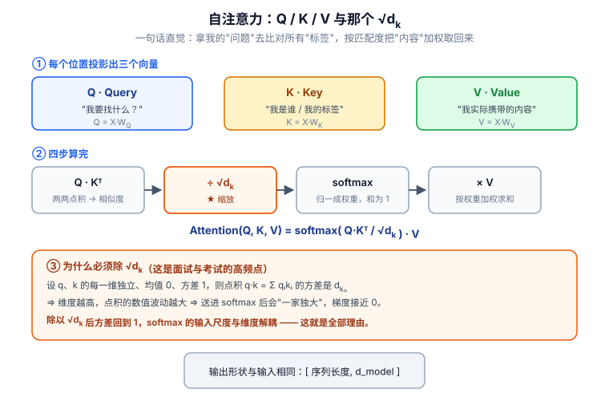

# 📘 第 5 周 · Transformer 与注意力机制

> **本周目标**：Transformer 是当前所有前沿论文的共同底座，绕不过去。学完你应该能做到：手写缩放点积注意力并标注每一维形状；**在纸上完整推出"为什么除以 √d_k"**；从零搭一个 mini-Transformer（约 7 万参数）并在序列反转任务上训到 100% 准确率；说清 LayerNorm 为什么适合序列；客观说出小样本场景下 LSTM 什么时候比 Transformer 更合适。
>
> **本周知识清单**：C 域 10 条（C4 全组）+ A 域 1 条（融入每天末尾的 ✅ 知识自查）
>
> **阶段位置**：本周是阶段二（Day 15-35）的收尾。第 35 天之后，你的身份从"消费知识"转向"生产知识"。
>
> **难度提示**：**本周是全程最难的一周。卡住就多花一天，不要囫囵吞枣。** Day 30 的推导和 Day 32 的代码是两个必须亲自过一遍的关卡。
>
> **使用方式**：在 Typora 中按标题折叠展开，每天读对应的小节即可。

[[深度学习学习总目录|← 返回总目录]]

---

## Day 29 —— 注意力机制的直觉：Q / K / V 与查字典

> **一句话**：注意力机制只有一个动作 —— **根据"我要找什么"和"每个东西是什么"的相似度，对"每个东西的内容"做加权平均**。Q、K、V 三个字母就是这三件事。

### 一、从"查字典"理解 Q / K / V

想象你在查一本字典：

| 角色 | 字典里的对应物 | 注意力里的符号 | 形状 |
|---|---|---|---|
| **Query（查询）** | 我要查的那个词 | `Q` | `[B, T_q, d_k]` |
| **Key（键）** | 每个词条的**索引/标题** | `K` | `[B, T_k, d_k]` |
| **Value（值）** | 每个词条的**正文内容** | `V` | `[B, T_k, d_v]` |

流程是三步：

```
① 拿我的 Query 和每一个 Key 比相似度  →  scores = Q @ Kᵀ
② 把相似度变成"权重"（加起来等于 1）   →  A = softmax(scores)
③ 按权重把所有 Value 加权平均          →  out = A @ V
```

**注意 Query 的数量和 Key 的数量可以不同** —— 你要查 3 个词（`T_q=3`），字典里有 5 个词条（`T_k=5`），这完全没问题。输出跟着 Query 走，所以输出长度是 `T_q`。

### 二、三个公式，逐维看形状

```python
import torch

B, T_q, T_k = 2, 3, 5
d_k, d_v = 8, 16

Q = torch.randn(B, T_q, d_k)     # [2, 3, 8]
K = torch.randn(B, T_k, d_k)     # [2, 5, 8]
V = torch.randn(B, T_k, d_v)     # [2, 5, 16]

scores = Q @ K.transpose(-2, -1)   # [2, 3, 8] @ [2, 8, 5] = [2, 3, 5]
attn   = torch.softmax(scores, dim=-1)   # [2, 3, 5]，最后一维加起来 = 1
out    = attn @ V                  # [2, 3, 5] @ [2, 5, 16] = [2, 3, 16]
```

**逐条记住**：

- `K.transpose(-2, -1)`：只交换**最后两维**，`[B, T_k, d_k] → [B, d_k, T_k]`。用 `-2, -1` 而不是 `0, 1`，是为了让代码对 batch 维不敏感。
- `scores` 的形状是 `[B, T_q, T_k]` —— 这是一张"**每个 Query 对每个 Key 的相似度表**"。
- `softmax(dim=-1)` 在**最后一维**归一化，也就是"对每个 Query，把它对所有 Key 的分数变成和为 1 的权重"。**方向搞错，整个注意力就废了。**
- `out` 的形状 `[B, T_q, d_v]` —— 输出长度跟 Query 走，特征维跟 Value 走。

**把形状注释写在每一行旁边。这是学注意力的唯一正确姿势。**

### 三、本质：加权平均，权重由相似度决定

把 `out = A @ V` 展开，对第 `i` 个 Query：

```
out_i = Σ_j A[i, j] · V_j
        └──── 权重 ────┘
```

这就是**加权平均**：`A[i, j]` 表示"第 i 个 Query 从第 j 个 Value 那里取多少信息"。

对比一下传统做法你就明白它的价值了：

| 做法 | 怎么组合信息 | 权重 |
|---|---|---|
| 简单平均 | `(V₁+V₂+...+V_n) / n` | 全部固定 `1/n`，不区分重要性 |
| 固定卷积 | 按固定邻域、固定核加权 | 权重是**学出来的但位置固定** |
| 注意力 | 按内容相似度动态加权 | 权重**随输入内容变化** |

**这是注意力和卷积最根本的区别**：卷积的权重是"位置相关、内容无关"的；注意力的权重是"**内容相关**"的 —— 输入变了，看哪里就变了。

### 四、硬注意力 vs 软注意力

| | 硬注意力（Hard） | 软注意力（Soft） |
|---|---|---|
| 权重取值 | 只选一个位置（one-hot） | 所有位置的连续权重 |
| 可导性 | ❌ 不可导（argmax 不可导） | ✅ 可导（softmax 可导） |
| 训练方式 | 需要强化学习 | 端到端反向传播 |
| 用得多吗 | 少 | **几乎所有 Transformer 都是它** |

**为什么必须用软注意力**：深度学习靠梯度训练。`argmax` 的梯度几乎处处为 0，梯度传不回去。`softmax` 是 `argmax` 的"可导近似"，而且它天然输出一个概率分布。

> 顺带一个直觉：`softmax` 的温度越高（logits 越小），输出越接近均匀分布；温度越低（logits 越大），越接近 one-hot。**软注意力到极致就是硬注意力。**

### 五、和电网安全的关系

注意力权重是**天然的、免费的、可解释性证据**。

设想你用 Transformer 做 IEC 61850 报文的异常检测。某条报文被判为异常，你可以把注意力矩阵调出来问：

```
这条报文的判断，主要参考了序列里的哪几个时间步？
```

如果模型高权重地看向"某几个时间步的 MMS 报文 + 一个异常的 GOOSE 跳闸信号"，那这个判断在运维上就是**可追溯、可审计**的。

这一点在安全领域是**加分项而非装饰**：

| 需求 | 注意力能提供什么 |
|---|---|
| 告警溯源 | 权重最高的若干时间步 = 触发依据 |
| 信任建立 | 运维敢不敢采纳一个黑箱告警？ |
| 论文卖点 | "可解释的电网异常检测"是审稿人喜欢的角度 |

**但要诚实**：注意力权重不等于因果解释。有研究指出注意力权重可以被"做得很好看"却与真实决策依据无关。所以论文里写的时候用词要准 —— 说"**注意力可作为线索**"，不要说"注意力解释了原因"。

### 🔍 延伸思考

1. 如果 `T_q = T_k = T`（自注意力），`scores` 是一个 `T×T` 的方阵。当 `T = 4096` 时这个矩阵有多大（假设 float32）？这解释了什么问题？
2. `softmax(dim=-1)` 和 `softmax(dim=-2)` 的区别是什么？如果写错成 `dim=-2`，输出的每一列加起来为 1，这在语义上意味着什么？为什么那是错的？

### 📚 参考

- 李沐《动手学深度学习》第 11.1-11.3 节「注意力机制」
- 李宏毅《机器学习》自注意力机制系列
- Vaswani et al. (2017), *Attention Is All You Need*, NeurIPS

### 🎬 视频讲解

> 以下为**关键词检索式**推荐（平台搜索结果，非固定视频链接，避免失效）。
> 直接复制关键词到对应平台搜索即可，也可在结果里挑播放量高的看。

| 平台 | 推荐搜索关键词 | 说明 |
|---|---|---|
| **B站** | [李宏毅 自注意力机制 详细解析](https://search.bilibili.com/all?keyword=李宏毅+自注意力机制+详细解析) | 最适合新手，本节首选 |
| **B站** | [注意力机制 QKV 通俗讲解 查字典](https://search.bilibili.com/all?keyword=注意力机制+QKV+通俗讲解+查字典) | 用查字典类比讲清 Q/K/V |
| **B站** | [Attention 注意力机制 图解](https://search.bilibili.com/all?keyword=Attention+注意力机制+图解) | 图多，适合建立直觉 |
| **抖音** | [注意力机制 三分钟 讲清](https://www.douyin.com/search/注意力机制+三分钟+讲清) | 碎片时间过一遍 |

### ✅ 知识自查

- [ ] 🟢 **概念** 用「查字典」理解 Q / K / V：
  - Query = 我要查什么
  - Key = 每个条目的索引
  - Value = 每个条目的内容
- [ ] 🟢 **公式** 注意力分数 `scores = Q @ Kᵀ`
- [ ] 🟢 **公式** 归一化权重 `A = softmax(scores)`
- [ ] 🟢 **公式** 输出 `out = A @ V`
- [ ] 🟢 **概念** 注意力的本质：**加权平均**，权重由相似度决定
- [ ] 🟢 **API** `torch.softmax(x, dim=-1)` 的方向（在最后一维归一化）
- [ ] 🟡 **概念** 硬注意力 vs 软注意力的区别

---

## Day 30 —— 自注意力与多头：为什么除以 √d_k

> **一句话**：`softmax(QKᵀ/√d_k)V` 里那个 `√d_k` 不是玄学 —— **它是把点积的方差从 `d_k` 拉回 1 的归一化因子**。不除，softmax 就饱和，梯度就消失，模型就训不动。

### 一、自注意力：Q、K、V 全部来自同一个序列

Day 29 的注意力里，`Q` 和 `K/V` 可以是两个不同的东西。**自注意力（Self-Attention）** 的特例是：三者都由**同一个输入序列** `X` 线性变换而来。

```python
X = torch.randn(B, T, d_model)        # [B, T, d_model]

W_q = nn.Linear(d_model, d_k, bias=False)
W_k = nn.Linear(d_model, d_k, bias=False)
W_v = nn.Linear(d_model, d_v, bias=False)

Q, K, V = W_q(X), W_k(X), W_v(X)      # 都是 [B, T, *]
```

**"自"字的含义**：序列自己查自己。每个位置向序列里**所有位置**（包括自己）询问"谁和我相关"，然后按相关度聚合信息。

对比一下三种注意力：

| 类型 | Q 来自 | K / V 来自 | 典型位置 |
|---|---|---|---|
| **自注意力** | 序列 A | 序列 A | 编码器内部 |
| **交叉注意力** | 序列 A | 序列 B | 解码器看编码器输出 |
| **掩码自注意力** | 序列 A | 序列 A（只看过去） | 解码器内部 |

> **关键洞察**：自注意力在**一层之内**就把任意两个位置连起来了。CNN 要堆很多层才能让感受野覆盖全图，RNN 要一步步传才能让信息走很远。**自注意力的路径长度恒为 1** —— 这就是它训练快、长程依赖强的根本原因。

### 二、缩放点积注意力：完整公式



> **看图说话**：上图左侧是“**自**”字的含义：Q、K、V 三组向量全部由**同一个输入序列 X** 线性变换而来 —— 序列自己查自己。右侧四步就是 `softmax(QKᵀ/√d_k)V` 的展开。重点看 **② ÷ √d_k** 那一格：`Q·K` 是 `d_k` 个独立随机数的点积，按方差可加性，结果的方差会**随 `d_k` 线性增长**。`d_k = 64` 时点积的量级能到 ±8，扔进 softmax 会立刻**饱和**（一个位置接近 1，其余全接近 0），而 softmax 在饱和区的导数**趋近于 0** —— 梯度就传不回来了。除以 `√d_k` 正好把方差从 `d_k` 拉回 `1`，让 softmax 停在“有梯度”的区间。**这不是玄学调参，是一个方差计算题。**


```
Attention(Q, K, V) = softmax( Q·Kᵀ / √d_k ) · V
```

```python
def scaled_dot_product_attention(Q, K, V, mask=None):
    d_k = Q.size(-1)
    scores = Q @ K.transpose(-2, -1) / math.sqrt(d_k)   # [B, T_q, T_k]
    if mask is not None:
        scores = scores.masked_fill(mask == 0, float('-inf'))
    attn = torch.softmax(scores, dim=-1)
    return attn @ V, attn
```

### 三、为什么除以 √d_k：完整推导

这是本周**必须能独立推出来**的一件事。原始论文只用一句话带过（"点积在高维时会变得很大"），我们把方差算出来。

**设定**：设 `q` 和 `k` 的每个分量 `q_i`、`k_i` 是**独立同分布**的随机变量，均值为 0、方差为 1。

**第 1 步：点积展开**

```
q · k = Σ_{i=1}^{d_k} q_i · k_i
```

**第 2 步：求每一项的均值**

因为 `q_i` 和 `k_i` 独立，所以乘积的期望等于期望的乘积：

```
E[q_i · k_i] = E[q_i] · E[k_i] = 0 × 0 = 0
```

**第 3 步：求每一项的方差**

```
Var(q_i k_i) = E[(q_i k_i)²] − (E[q_i k_i])²
             = E[q_i²] · E[k_i²] − 0        ← 独立 ⇒ 乘积的期望可拆
             = 1 × 1 − 0
             = 1
```

（因为方差为 1 且均值为 0 ⇒ `E[q_i²] = Var(q_i) + (E[q_i])² = 1`）

**第 4 步：求和的方差**

`d_k` 个**相互独立**的项相加，方差可以直接相加：

```
Var(q · k) = Σ_{i=1}^{d_k} Var(q_i k_i) = 1 + 1 + ... + 1 = d_k
```

**结论**：

```
E[q·k] = 0
Var(q·k) = d_k
标准差 = √d_k
```

**第 5 步：这为什么会坏事**

`d_k = 64` 时，点积的标准差是 **8**。假设点积近似正态分布，那它的取值范围大概是 `[-24, +24]`。而 `softmax` 的输入在 `±24` 量级时：

```
softmax([24, 0, 0]) ≈ [0.99999999992, 3.78e-11, 3.78e-11]
                    （因为 e⁻²⁴ ≈ 3.78e-11，两个非最大值分到的概率几乎为 0）
```

输出**几乎是 one-hot**。此时 softmax 的雅可比矩阵 `∂p_i/∂z_j = p_i(δ_ij − p_j)` 里，所有元素都趋近于 0 —— **梯度消失，参数收不到任何更新信号。**

**第 6 步：除以 √d_k 修好了什么**

```
Var( (q·k) / √d_k ) = Var(q·k) / d_k = d_k / d_k = 1
```

点积的方差被**拉回 1**，标准差为 1，softmax 的输入落在 `[-3, +3]` 这种"敏感区间"，输出是平滑的概率分布，梯度能正常回传。

| 量 | 不缩放 | 缩放后 |
|---|---|---|
| 点积方差 | `d_k` | `1` |
| 点积标准差（d_k=64） | `8` | `1` |
| softmax 输出 | 接近 one-hot | 平滑分布 |
| 梯度 | 趋近 0 | 正常 |

> **一句话记住**：`√d_k` 是"让 softmax 待在敏感区"的归一化因子。它和 Day 13 的标准化是同一个思想 —— **把输入的量级控制住，梯度才听话**。

**顺带一个可以自己验证的实验**：写一段代码，让 `d_k` 分别取 `1 / 8 / 64 / 512`，固定随机种子，打印 `scores.std()`。你会看到它单调地按 `√d_k` 增长。**自己跑一遍，比读十遍推导管用。**

### 四、多头注意力：把 d_model 切成 h 份

**单头的问题**：一次 softmax 只能产生**一种**"关注模式"。但一句话里的关系有很多种 —— 语法主谓关系、指代关系、时态关系…… 一个头不够用。

**多头的做法**：把 `d_model` 维度切成 `h` 份，每份独立做一次注意力，最后拼接。

```
d_model = 512, h = 8  ⇒  每个头 d_k = d_v = 64
```

**完整形状变换链（必须能默写）**：

```python
B, T, d_model, h = 2, 10, 512, 8
d_k = d_model // h          # 64

x = torch.randn(B, T, d_model)          # [2, 10, 512]

# ① 线性投影成 Q/K/V，再把 d_model 拆成 h 个头
Q = nn.Linear(d_model, d_model)(x)      # [2, 10, 512]
Q = Q.view(B, T, h, d_k)                # [2, 10, 8, 64]   把 512 拆成 8×64
Q = Q.transpose(1, 2)                   # [2, 8, 10, 64]   ← 头维提到 batch 后面
# K、V 同理

# ② 每个头独立算缩放点积注意力（批量并行）
scores = Q @ K.transpose(-2, -1) / math.sqrt(d_k)   # [2, 8, 10, 10]
attn   = torch.softmax(scores, dim=-1)              # [2, 8, 10, 10]
out    = attn @ V                                    # [2, 8, 10, 64]

# ③ 拼回 d_model
out = out.transpose(1, 2)               # [2, 10, 8, 64]
out = out.reshape(B, T, d_model)        # [2, 10, 512]
out = nn.Linear(d_model, d_model)(out)  # [2, 10, 512]  输出投影
```

**记住三个关键点**：

1. **`view` 拆头，`transpose` 换位，最后 `reshape` 拼回**。`view(B,T,h,d_k)` 和 `reshape` 在这里等价，因为张量连续。
2. **`transpose(1,2)` 是必须的**，否则 `Q @ K.transpose(-2,-1)` 会把"头"当成特征维算进去，完全错。
3. **总参数量不变**：8 个头各自 `d_k=64`，加起来还是 `512`。多头不是"算 8 倍"，而是**把同样的计算预算分成 8 份花**。

**用 `nn.MultiheadAttention` 一行搞定**：

```python
mha = nn.MultiheadAttention(embed_dim=512, num_heads=8, batch_first=True)
out, attn_weights = mha(x, x, x)         # 自注意力：q=k=v=x
# out: [2, 10, 512]    attn_weights: [2, 10, 10]（所有头平均后的）
```

> **坑**：`batch_first=True` 是 PyTorch 后来才加的，默认是 `False`，此时输入形状要求 `[T, B, d_model]`。**这是新手最常见的报错来源之一。** 建议永远显式写上 `batch_first=True`。

### 五、每个头学到了什么

这是一个真实的、有趣的、也是**可解释性研究的入口**。

经验观察（在语言模型上）：不同的头会分化出不同的功能 —— 有的头专门看"前一个词"，有的头专门看"句法上的主语"，有的头专门盯"分隔符"。这在论文里叫 **attention head specialization**。

**对你的意义**：如果你在电网数据上训 Transformer，把注意力矩阵画出来，可能会发现某个头专盯"某类量测通道"。**这是一个可以直接写成论文分析章节的发现**，而且成本极低（几十行代码）。

但要注意 —— 见 Day 29 的提醒：**注意力是线索，不是因果**。

### 六、和电网安全的关系

自注意力的"**路径长度恒为 1**"这个特性，在电网场景里有非常具体的价值。

考虑一次重放攻击：攻击者录下某时刻的正常报文，在 30 秒后重发。要识别它，模型必须**把当前报文和 30 秒前的那条报文关联起来**。

| 模型 | 要关联相隔 T 步的两个位置 |
|---|---|
| RNN / LSTM | 信息要穿过 T 个时间步的门控，越远越衰减 |
| 1D-CNN | 感受野要堆到覆盖 T 步，层数 ≈ log 或线性增长 |
| **自注意力** | **一步直达**，位置 i 和位置 j 直接算相似度 |

再加上注意力权重可以可视化 —— 你不仅能检出重放，还能**指出"我认为这条报文和 30 秒前那条高度相似"**。这个证据链在安全场景里价值很高。

### 🔍 延伸思考

1. 如果 `d_k` 很小（比如 2），除以 `√d_k` 还有必要吗？自己跑一下 `d_k=2` 的实验，看 softmax 输出是否还接近 one-hot。
2. 多头注意力里，如果 `h = d_model`（即 `d_k = 1`），每个头在算什么？这时的多头和单头有区别吗？（提示：`d_k=1` 时点积就是一个标量乘积）
3. 把 `out = A @ V` 换成"取权重最大的那个 V"（硬注意力），网络还能训练吗？为什么？

### 📚 参考

- Vaswani et al. (2017), *Attention Is All You Need*, NeurIPS —— 第 3.2.1 节就是缩放点积注意力的定义
- 李沐《动手学深度学习》第 11.3 节「注意力评分函数」、11.5 节「多头注意力」
- 李宏毅《自注意力机制》系列

### 🎬 视频讲解

> 以下为**关键词检索式**推荐（平台搜索结果，非固定视频链接，避免失效）。

| 平台 | 推荐搜索关键词 | 说明 |
|---|---|---|
| **B站** | [一次吃透多头注意力机制 0基础](https://search.bilibili.com/all?keyword=一次吃透多头注意力机制+0基础) | 多头注意力的本质讲得很清楚 |
| **B站** | [为什么除以根号dk 缩放点积注意力](https://search.bilibili.com/all?keyword=为什么除以根号dk+缩放点积注意力) | 方差推导的可视化讲解 |
| **B站** | [Attention 图解 MHA GQA MQA](https://search.bilibili.com/all?keyword=Attention+图解+MHA+GQA+MQA) | 三种变体的结构对比 |
| **B站** | [自注意力机制 计算过程 手推](https://search.bilibili.com/all?keyword=自注意力机制+计算过程+手推) | 跟着手推一遍形状变换 |
| **抖音** | [多头注意力 是什么](https://www.douyin.com/search/多头注意力+是什么) | 三分钟建立概念 |

### ✅ 知识自查

- [ ] 🟢 **概念** 自注意力：Q、K、V **全部来自同一个输入序列**
- [ ] 🟢 **公式** 缩放点积注意力 `Attention(Q,K,V) = softmax(QKᵀ/√d_k)V`
- [ ] 🟢 **推导** **为什么除以 √d_k**：d_k 越大，点积方差越大 → softmax 饱和 → 梯度趋近 0
- [ ] 🟢 **概念** 多头注意力：把 d_model 切成 h 份，各自算注意力再拼接
- [ ] 🟢 **API** `nn.MultiheadAttention(embed_dim, num_heads)`
- [ ] 🟢 **概念** 多头的意义：在不同子空间里并行看不同的关系
- [ ] 🟢 **实践** 形状变换：`[B,T,d_model]` → `[B,h,T,d_k]` → 注意力 → 拼回
- [ ] 🟡 **概念** 每个头学到了什么？（可解释性研究的切入点）

**必须练熟的手感**（自己填输出形状，`B=2, T=10, d_model=512, h=8`）：

| 表达式 | 输入形状 | 输出形状 |
|---|---|---|
| `x.view(B, T, h, d_k)` | `[2,10,512]` | ? |
| `x.transpose(1, 2)`（上一步之后） | `[2,10,8,64]` | ? |
| `Q @ K.transpose(-2,-1)` | `[2,8,10,64]` | ? |
| `attn @ V` | `[2,8,10,10]` 与 `[2,8,10,64]` | ? |
| `out.transpose(1,2).reshape(B,T,d_model)` | `[2,8,10,64]` | ? |

---

## Day 31 —— Transformer 完整结构：Add&Norm 与位置编码

> **一句话**：Transformer 的编码器块只有四个零件 —— **多头注意力、Add&Norm、前馈网络、Add&Norm**。再加一个位置编码解决"注意力不知道顺序"的先天缺陷，结构就齐了。

### 一、编码器块：四个组件的固定组合

```
输入 x
  │
  ├──────────────┐
  ↓              │
多头自注意力      │  ← 残差
  ↓              │
Add & Norm ←─────┘
  │
  ├──────────────┐
  ↓              │
前馈网络 FFN      │  ← 残差
  ↓              │
Add & Norm ←─────┘
  │
输出
```

```python
class EncoderBlock(nn.Module):
    def __init__(self, d_model, n_heads, d_ff, dropout=0.1):
        super().__init__()
        self.attn  = nn.MultiheadAttention(d_model, n_heads,
                                           dropout=dropout, batch_first=True)
        self.norm1 = nn.LayerNorm(d_model)
        self.norm2 = nn.LayerNorm(d_model)
        self.ffn = nn.Sequential(
            nn.Linear(d_model, d_ff), nn.GELU(), nn.Dropout(dropout),
            nn.Linear(d_ff, d_model), nn.Dropout(dropout),
        )
        self.drop = nn.Dropout(dropout)

    def forward(self, x):
        a, _ = self.attn(x, x, x, need_weights=False)
        x = self.norm1(x + self.drop(a))     # 注意力 → Add → Norm
        x = self.norm2(x + self.ffn(x))      # FFN   → Add → Norm
        return x
```

**"编码器块"就是这一坨的重复堆叠**。原论文堆 6 层，GPT-3 堆 96 层。**结构完全一样，只是层数不同。**

### 二、Add：残差连接（回顾 Day 18）

`Add` 就是 `x + f(x)`。为什么必须加？两个理由：

**理由一：梯度高速公路。**

```
∂(x + f(x))/∂x = 1 + ∂f(x)/∂x
                 ↑
              这个 1 保证梯度永远有一条"直通车道"
```

即使 `∂f/∂x` 因为层数太深衰减到接近 0，梯度依然能通过那个 `+1` 无损地传回浅层。**这就是 Day 8 说的"让梯度走捷径"。**

**理由二：Transformer 本来就深。** 96 层的 GPT-3 没有残差连接根本训不起来。

> **一个容易忽略的细节**：残差要求 `x` 和 `f(x)` 形状完全一致。所以 Transformer 里 `d_model` 在整条主干上**从头到尾不变**（比如恒为 512），中间扩大的部分（FFN 的 `d_ff = 4×d_model`）必须再缩回来。**这是设计上的强约束。**

### 三、Norm：LayerNorm 与它为什么适合序列

**LayerNorm 做什么**：对**单个样本的单个位置**，把它的 `d_model` 个特征做归一化。

```python
# 对一个 [B, T, d_model] 的张量
# LayerNorm 的统计量是在最后一维（d_model）上算的
# 每个 (b, t) 位置独立计算自己的均值方差
mean = x.mean(dim=-1, keepdim=True)     # [B, T, 1]
std  = x.std(dim=-1,  keepdim=True)     # [B, T, 1]
out  = (x - mean) / (std + eps) * gamma + beta
```

**LayerNorm vs BatchNorm（关键区别，必须能说清）**：

| | BatchNorm | LayerNorm |
|---|---|---|
| 归一化维度 | 跨**样本**（batch 维） | 跨**特征**（feature 维） |
| 依赖 batch size | 是（batch 小则统计不稳） | 否 |
| 训练/推理行为 | 不同（推理要用滑动均值） | **完全相同** |
| 适合 | CNN、大 batch | NLP、序列、小 batch |
| 额外状态 | 需要存 running_mean / running_var | 无 |

**为什么 NLP / Transformer 选 LayerNorm**：

1. **序列长度可变**。同一个 batch 里的样本长度不一（要 padding），BatchNorm 在 batch 维上算统计量时，padding 的 0 会污染统计。
2. **batch 常常很小**。长序列占显存，batch size 经常只有 8 或 16，BatchNorm 的统计量噪声极大。
3. **训练/推理必须一致**。序列模型推理时是逐 token 生成的，如果归一化行为跟训练时不一样，结果会飘。LayerNorm 没有这个状态，天然一致。

> **一句话对比**：BatchNorm 说"**和同批次的其他样本比**"，LayerNorm 说"**和我自己的其他特征比**"。序列任务里，前者不可靠，后者永远可用。

### 四、FFN：逐位置独立的两层 MLP

```python
self.ffn = nn.Sequential(
    nn.Linear(d_model, d_ff),    # 升维，通常 d_ff = 4 × d_model
    nn.GELU(),
    nn.Linear(d_ff, d_model),    # 降回来，保证残差能加
)
```

**关键点：`FFN` 是逐位置独立作用的。** 序列里第 `t` 个位置进 FFN，输出的也只是第 `t` 个位置 —— 不同位置之间**不交互**。

那位置之间靠什么交互？**全靠前面的注意力层。**

> **分工理解**：
> - **注意力层**负责"**跨位置的信息交换**"（token 之间对话）
> - **FFN 层**负责"**每个位置自己的深加工**"（消化收到的信息）
>
> 两者交替堆叠，就是 Transformer 的全部。

**参数量占比**（一个反直觉的事实）：当 `d_model = 512, d_ff = 2048` 时，

```
每个 FFN 参数量 ≈ 512×2048 × 2 = 2,097,152
每个注意力参数量 ≈ 4 × 512²      = 1,048,576
```

**FFN 占了编码器块约 2/3 的参数量。** Transformer 不是"注意力网络"，它是"注意力 + 大 MLP"的网络。

### 五、位置编码：注意力天生不知道顺序

**问题**：`softmax(QKᵀ/√d_k)V` 对输入的**行排列是等变的**。也就是说，如果把输入序列的位置 1 和位置 2 交换，输出也只是把位置 1 和位置 2 的输出交换 —— **模型本身完全感觉不到"顺序变了"**。

```
"我 打 你"  vs  "你 打 我"
注意力看到的：同一堆 token，只是排列不同
```

这在语言里是灾难，在时序里更是灾难（负荷曲线的先后顺序全丢了）。

**解决方案：把位置信息"加"进输入。**

```python
x = token_embedding + positional_encoding
# [B, T, d_model] + [1, T, d_model] → [B, T, d_model]
```

**正弦位置编码公式**：

```
PE(pos, 2i)   = sin( pos / 10000^(2i/d_model) )
PE(pos, 2i+1) = cos( pos / 10000^(2i/d_model) )
```

其中 `pos` 是位置下标，`i` 是维度下标（`0 ≤ i < d_model/2`）。

```python
import math, torch, torch.nn as nn

class PositionalEncoding(nn.Module):
    def __init__(self, d_model, max_len=512):
        super().__init__()
        pe = torch.zeros(max_len, d_model)
        pos = torch.arange(0, max_len, dtype=torch.float).unsqueeze(1)      # [L, 1]
        div = torch.exp(torch.arange(0, d_model, 2).float()
                        * (-math.log(10000.0) / d_model))                   # [d_model/2]
        pe[:, 0::2] = torch.sin(pos * div)     # 偶数维用 sin
        pe[:, 1::2] = torch.cos(pos * div)     # 奇数维用 cos
        self.register_buffer('pe', pe.unsqueeze(0))    # [1, L, d_model]

    def forward(self, x):                       # x: [B, T, d_model]
        return x + self.pe[:, :x.size(1)]
```

**为什么用 sin/cos 而不是直接用 `0,1,2,3...`**：

| 理由 | 说明 |
|---|---|
| **数值范围有界** | `sin/cos` 恒在 `[-1,1]`，不会因为位置大而爆炸（直接用下标的话位置 1000 就是 1000） |
| **相对位置可线性表达** | `PE(pos+k)` 可以写成 `PE(pos)` 的线性变换，模型容易学"相对距离" |
| **可外推** | 训练时见过长度 512，推理时稍长一点也能算出来 |

**可学习位置编码 vs 正弦编码**：

| | 正弦编码 | 可学习编码 |
|---|---|---|
| 参数 | 无 | `max_len × d_model` |
| 外推能力 | ✅ 理论上可外推 | ❌ 超过 max_len 就没有对应参数 |
| 实践中 | 原论文用，现已少用 | **BERT / GPT 都用它** |
| 典型实现 | 固定 buffer | `nn.Embedding(max_len, d_model)` |

**实践结论**：现在主流用**可学习位置编码**（够用且更灵活），除非你需要处理超长序列外推，才考虑正弦或 RoPE 等相对位置方案。

### 六、解码器与掩码注意力

编码器可以看全序列，**解码器不能** —— 因为解码器在生成第 `t` 个 token 时，第 `t+1` 个 token 还没生成。如果它能看见未来，训练时就是在作弊。

**掩码的做法**：在 softmax 之前，把"未来位置"的分数设成 `-inf`。

```python
T = 4
mask = torch.triu(torch.ones(T, T), diagonal=1).bool()   # 上三角（不含对角线）
scores = scores.masked_fill(mask, float('-inf'))
# softmax 之后，-inf 的位置权重正好是 0
```

```
掩码矩阵（True = 屏蔽）：
False  True  True  True
False False  True  True
False False False  True
False False False False
```

**为什么用 `-inf` 而不是 0**：softmax 里 `e^(-inf) = 0`，权重精确为 0。如果设成 0，`e^0 = 1`，反而给了未来位置一个不小的权重。

> **一个实用记忆法**：`triu(diagonal=1)` 是"严格上三角"，恰好就是"当前及之前可见"的掩码。写错 `diagonal` 就会导致模型看见自己或者看不见自己。

### 七、和电网安全的关系

**位置编码在电网时序里的作用被严重低估了。**

考虑电网量测的一个典型场景：一次**重放攻击** —— 攻击者把 t 时刻的正常报文录下来，在 t+300 秒重发。

| 有没有位置编码 | 模型会怎么判断 |
|---|---|
| **没有** | 只看内容：这条报文和 t 时刻的一模一样，**看起来完全正常** |
| **有** | 还知道"它在序列里的第几号位置"，能学到"同一内容在错误的时间出现 = 可疑" |

**位置编码是检测"时序错位类攻击"的必要条件。** 类似地：

- **延时攻击**：篡改报文时间戳 → 需要位置信息
- **慢速漂移攻击**：量测值在一段时间内缓慢偏移 → 需要位置信息才能看出"趋势异常"

另外，LayerNorm 的选择在工控场景里也有实际意义：工业数据采集的**批次大小经常受限于实时性要求**（不能等攒够 256 条再算），此时 BatchNorm 的统计量极不稳定，LayerNorm 是唯一可行的选择。

### 🔍 延伸思考

1. 如果把位置编码写成 `x = token_emb + pe`，为什么是"加"而不是"拼接"（`concat`）？拼接会带来什么好处和坏处？
2. 现代大模型普遍用 **Pre-LN**（`x = x + attn(norm(x))`）而不是原论文的 **Post-LN**（`x = norm(x + attn(x))`）。查一下这个改动解决了什么问题？（提示：和深层网络的训练稳定性、warmup 的关系）
3. FFN 占了 2/3 参数量。如果把它换成"共享权重的 FFN"（所有层用同一个 FFN），模型会怎样变化？

### 📚 参考

- Vaswani et al. (2017), *Attention Is All You Need*, NeurIPS —— 第 3.1 节讲编码器结构，3.5 节讲位置编码
- Ba et al. (2016), *Layer Normalization*, arXiv:1607.06450
- He et al. (2016), *Deep Residual Learning for Image Recognition*, CVPR
- 李沐《动手学深度学习》第 11.6-11.7 节

### 🎬 视频讲解

> 以下为**关键词检索式**推荐（平台搜索结果，非固定视频链接，避免失效）。

| 平台 | 推荐搜索关键词 | 说明 |
|---|---|---|
| **B站** | [李宏毅 Transformer 完整解析](https://search.bilibili.com/all?keyword=李宏毅+Transformer+完整解析) | 结构讲得最清楚，本节首选 |
| **B站** | [Transformer 编码器 结构 详解](https://search.bilibili.com/all?keyword=Transformer+编码器+结构+详解) | 逐层拆解编码器块 |
| **B站** | [位置编码 positional encoding 讲解](https://search.bilibili.com/all?keyword=位置编码+positional+encoding+讲解) | 正弦编码的可视化 |
| **B站** | [LayerNorm BatchNorm 区别 为什么](https://search.bilibili.com/all?keyword=LayerNorm+BatchNorm+区别+为什么) | 归一化维度的对比 |
| **抖音** | [残差连接 为什么有用](https://www.douyin.com/search/残差连接+为什么有用) | 三分钟理解那个 +1 |

### ✅ 知识自查

- [ ] 🟢 **概念** 编码器块 = 多头注意力 → Add&Norm → 前馈网络 → Add&Norm
- [ ] 🟢 **概念** **Add** = 残差连接（回顾 C2-8）
- [ ] 🟢 **概念** **Norm** = LayerNorm，归一化每个样本的特征维
- [ ] 🟢 **概念** 前馈网络 FFN：两层 Linear + 激活，逐位置独立作用
- [ ] 🟢 **概念** 位置编码：注意力本身无顺序概念，必须手工注入
- [ ] 🟢 **公式** 正弦位置编码 `PE(pos,2i) = sin(pos/10000^(2i/d))`
- [ ] 🟡 **概念** 可学习位置编码 vs 正弦编码
- [ ] 🟡 **概念** 解码器与掩码注意力（防止看到未来）
- [ ] 🟡 **概念** LayerNorm vs BatchNorm 的选择理由（序列长度可变 + 小批次）

---

## Day 32 —— 从零搭一个 mini-Transformer

> **一句话**：今天的目标不是"跑出好结果"，而是**让一个完整的 Transformer 在你的机器上跑起来并学会一个简单规律**。代码跑通了，前面三天的抽象概念才会变成你的。

### 一、先定任务：序列反转

**为什么选序列反转（Sequence Reversal）**：它是一个**只有顺序信息才能解决**的任务。

```
输入：[3, 7, 1, 9, 2, 5]
目标：[5, 2, 9, 1, 7, 3]
```

- 它不依赖任何语义，不需要外部数据
- **它必须理解位置** —— 如果模型没有位置编码，它**永远学不会**（因为反转是纯位置操作）
- 它可以在几秒内验证收敛

**这是位置编码最好的检验器**：加位置编码能学会，去掉就学不会。**这个对照实验值得亲手做一次。**

### 二、完整可运行代码

把下面这段完整存成 `代码/32-miniTransformer.py`，直接 `python 32-miniTransformer.py` 就能跑。

```python
"""
mini-Transformer：序列反转任务
参数量约 6.8 万，CPU 上 1-2 分钟可训到 100% 准确率
"""
import math
import torch
import torch.nn as nn
import torch.nn.functional as F

# ============ 超参数 ============
VOCAB   = 10      # token 取值 1..9（0 保留）
SEQ_LEN = 8       # 序列长度
D_MODEL = 64
N_HEADS = 4
D_FF    = 128
N_LAYERS = 2
DROPOUT = 0.1
DEVICE  = "cuda" if torch.cuda.is_available() else "cpu"


# ============ 位置编码 ============
class PositionalEncoding(nn.Module):
    def __init__(self, d_model, max_len=64):
        super().__init__()
        pe = torch.zeros(max_len, d_model)
        pos = torch.arange(0, max_len, dtype=torch.float).unsqueeze(1)
        div = torch.exp(torch.arange(0, d_model, 2).float()
                        * (-math.log(10000.0) / d_model))
        pe[:, 0::2] = torch.sin(pos * div)
        pe[:, 1::2] = torch.cos(pos * div)
        self.register_buffer("pe", pe.unsqueeze(0))       # [1, L, d_model]

    def forward(self, x):                                  # [B, T, d_model]
        return x + self.pe[:, : x.size(1)]


# ============ 编码器块 ============
class EncoderBlock(nn.Module):
    def __init__(self, d_model, n_heads, d_ff, dropout):
        super().__init__()
        self.attn  = nn.MultiheadAttention(d_model, n_heads,
                                           dropout=dropout, batch_first=True)
        self.norm1 = nn.LayerNorm(d_model)
        self.norm2 = nn.LayerNorm(d_model)
        self.ffn = nn.Sequential(
            nn.Linear(d_model, d_ff), nn.GELU(), nn.Dropout(dropout),
            nn.Linear(d_ff, d_model), nn.Dropout(dropout),
        )
        self.drop = nn.Dropout(dropout)

    def forward(self, x):
        a, _ = self.attn(x, x, x, need_weights=False)
        x = self.norm1(x + self.drop(a))          # 注意力 → Add & Norm
        x = self.norm2(x + self.ffn(x))           # FFN   → Add & Norm
        return x


# ============ mini-Transformer ============
class MiniTransformer(nn.Module):
    def __init__(self, vocab, d_model, n_heads, d_ff, n_layers,
                 max_len, dropout, use_pos=True):
        super().__init__()
        self.use_pos = use_pos
        self.emb   = nn.Embedding(vocab, d_model)
        self.pos   = PositionalEncoding(d_model, max_len)
        self.blocks = nn.ModuleList([
            EncoderBlock(d_model, n_heads, d_ff, dropout)
            for _ in range(n_layers)
        ])
        self.head = nn.Linear(d_model, vocab)     # 每个位置输出一个 token

    def forward(self, x):                          # x: [B, T] int64
        h = self.emb(x)                            # [B, T, d_model]
        if self.use_pos:
            h = self.pos(h)
        for blk in self.blocks:
            h = blk(h)
        return self.head(h)                        # [B, T, vocab]


# ============ 数据：序列反转 ============
def make_batch(bs):
    x = torch.randint(1, VOCAB, (bs, SEQ_LEN))     # 内容 token 1..9
    y = torch.flip(x, dims=[1])                    # 目标：反转
    return x.to(DEVICE), y.to(DEVICE)


# ============ ① 第一步：先在小数据上过拟合 ============
def sanity_check():
    print("=" * 60)
    print("第 ① 步：小数据过拟合检验（10 条样本，应训到 acc = 1.000）")
    print("=" * 60)
    torch.manual_seed(0)
    model = MiniTransformer(VOCAB, D_MODEL, N_HEADS, D_FF,
                            N_LAYERS, SEQ_LEN, 0.0).to(DEVICE)
    opt = torch.optim.Adam(model.parameters(), lr=3e-4)

    x, y = make_batch(10)                          # 固定 10 条，反复喂
    for step in range(501):
        logits = model(x)
        loss = F.cross_entropy(logits.reshape(-1, VOCAB), y.reshape(-1))
        opt.zero_grad(); loss.backward(); opt.step()
        if step % 100 == 0:
            with torch.no_grad():
                acc = (model(x).argmax(-1) == y).float().mean().item()
            print(f"  step {step:4d}   loss {loss.item():.4f}   acc {acc:.3f}")
    print("  → 如果 acc 到不了 1.0，代码有 bug，先别往下走。\n")


# ============ ② 第二步：正常训练（warmup + 梯度裁剪） ============
def train():
    print("=" * 60)
    print("第 ② 步：正常训练（随机数据，考验泛化）")
    print("=" * 60)
    torch.manual_seed(42)
    model = MiniTransformer(VOCAB, D_MODEL, N_HEADS, D_FF,
                            N_LAYERS, SEQ_LEN, DROPOUT).to(DEVICE)
    n_param = sum(p.numel() for p in model.parameters())
    print(f"  参数量：{n_param:,}")

    opt = torch.optim.Adam(model.parameters(), lr=3e-4,
                           betas=(0.9, 0.98), eps=1e-9)

    # warmup：前 400 步线性升到峰值，之后按 1/√step 衰减
    WARMUP = 400
    def lr_lambda(step):
        return min((step + 1) / WARMUP, math.sqrt(WARMUP / (step + 1)))
    sched = torch.optim.lr_scheduler.LambdaLR(opt, lr_lambda)

    for step in range(3001):
        x, y = make_batch(64)
        logits = model(x)
        loss = F.cross_entropy(logits.reshape(-1, VOCAB), y.reshape(-1))

        opt.zero_grad()
        loss.backward()
        torch.nn.utils.clip_grad_norm_(model.parameters(), 1.0)   # 梯度裁剪
        opt.step()
        sched.step()

        if step % 300 == 0:
            with torch.no_grad():
                xv, yv = make_batch(512)
                acc = (model(xv).argmax(-1) == yv).float().mean().item()
            print(f"  step {step:5d}   loss {loss.item():.4f}   "
                  f"acc {acc:.3f}   lr {sched.get_last_lr()[0]:.2e}")

    # 看一个具体例子
    with torch.no_grad():
        x, y = make_batch(3)
        pred = model(x).argmax(-1)
    print("\n  输入：", x[0].tolist())
    print("  目标：", y[0].tolist())
    print("  预测：", pred[0].tolist())
    print("  → 预测 == 目标 就成功了。\n")
    return model


if __name__ == "__main__":
    sanity_check()
    train()
```

**预期输出**（CPU 上大约 1-2 分钟；**下面数值为示意，你的实际结果会略有不同**）：

```
第 ① 步：小数据过拟合检验（10 条样本，应训到 acc = 1.000）
  step    0   loss 2.3412   acc 0.088
  step  100   loss 0.4183   acc 0.875
  step  200   loss 0.0921   acc 1.000
  ...
第 ② 步：正常训练
  参数量：68,234
  step     0   loss 2.3395   acc 0.101   lr 7.50e-07
  step  3000   loss 0.0112   acc 1.000   lr 1.55e-05
  输入： [7, 2, 9, 4, 1, 8, 3, 6]
  目标： [6, 3, 8, 1, 4, 9, 2, 7]
  预测： [6, 3, 8, 1, 4, 9, 2, 7]
```

> **参数量是怎么算出来的**（自己核一遍，确认理解每个模块的规模）：
>
> ```
> 词嵌入      10 × 64                    =    640
> 每个编码器块：
>   多头注意力  in_proj 3×64×64 + bias 192
>               out_proj 64×64 + bias 64  = 16,640
>   LayerNorm ×2                          =    256
>   FFN  64×128+128 与 128×64+64          = 16,576
>                                    小计  = 33,472
> 2 个编码器块                            = 66,944
> 输出头      64 × 10 + 10                =    650
> ─────────────────────────────────────────────────
> 合计                                    = 68,234
> ```
>
> **注意 FFN 占了将近一半的参数量**（16,576 / 33,472 ≈ 50%）。这印证了 Day 31 的结论：**Transformer 不是"注意力网络"，而是"注意力 + 大 MLP"的网络。**
>
> **如果 acc 到不了 1.000**：先增加训练步数（`range(3001)` → `range(8001)`），再考虑把 `N_LAYERS` 加到 3。**但不要一上来就调大模型** —— 先确认代码没问题。

### 三、调试口诀：先在小数据上过拟合

**这是深度学习里最值钱的一条调试经验，值得单独记住。**

> **如果模型连 10 个样本都记不住，那一定是代码有 bug，不是模型不够强。**

模型不收敛时的**排查顺序**：

| 顺序 | 检查什么 | 怎么查 |
|---|---|---|
| **1** | **先在小数据上过拟合** | 用 10 条样本训 500 步，看 acc 能否到 1.0 |
| 2 | 形状是否对得上 | 在 `forward` 里打印每一层的输出形状 |
| 3 | 学习率是不是太大 | 先试 `1e-4`，看损失是否平稳下降 |
| 4 | 梯度是否爆炸 | 打印 `grad_norm`，看是不是 `1e5` 量级 |
| 5 | 位置编码加了没有 | 关掉 `use_pos` 再训一次，对比准确率 |

**为什么第 1 条排在最前面**：它把问题**一分为二**。能过拟合 ⇒ 前向/反向/损失/优化器都正确，问题在泛化（数据、正则化、模型容量）。不能过拟合 ⇒ 问题在代码本身。**这两类问题的排查方向完全不同，先分类能省下大量时间。**

### 四、训练 Transformer 的两个关键技巧

**① Warmup 学习率**

```
lr(step) = min( step / warmup, √(warmup / step) ) × base_lr
```

- **前 `warmup` 步线性升温**：从接近 0 开始，慢慢涨到峰值
- **之后按 `1/√step` 衰减**

**为什么必须 warmup**：Transformer 刚初始化时，注意力权重接近均匀随机，输出的方差很大。此时如果学习率很大，一次更新就能把参数推到很糟的地方（类似 Day 9 说的"死亡神经元"，但这里更严重 —— 整层都可能崩）。**先小步走稳，再放大步长**，这是经验但极其有效。

> **观察代码输出**：`step 0` 时 lr 是 `7.5e-07`，非常小。这就是 warmup 在起作用。

**② 梯度裁剪**

```python
torch.nn.utils.clip_grad_norm_(model.parameters(), max_norm=1.0)
```

把所有参数的梯度**整体**缩放，使它们的 L2 范数不超过 `1.0`。回顾 Day 23：**裁剪只治爆炸，不治消失。**

**Transformer 特别容易梯度爆炸**，因为注意力层里存在 `QKᵀ` 这种乘积结构。**这两条（warmup + 裁剪）几乎是所有 Transformer 训练代码的标配。**

### 五、`nn.TransformerEncoderLayer` 与手写实现的对应关系

PyTorch 已经提供了现成的层，对照着看能确认自己写对了：

| 手写部分 | `nn.TransformerEncoderLayer` 参数 | 说明 |
|---|---|---|
| `nn.MultiheadAttention(...)` | `d_model, nhead` | 多头注意力 |
| `nn.Linear(d_model, d_ff)` | `dim_feedforward` | FFN 隐层维度 |
| `nn.LayerNorm` | `norm_first=False` | 默认 Post-LN，改 `True` 是 Pre-LN |
| `nn.Dropout(dropout)` | `dropout` | 统一 dropout 概率 |
| `nn.GELU()` | `activation='gelu'` | 默认是 `relu`，需显式指定 |

```python
layer = nn.TransformerEncoderLayer(
    d_model=64, nhead=4, dim_feedforward=128,
    dropout=0.1, activation="gelu", batch_first=True,
)
encoder = nn.TransformerEncoder(layer, num_layers=2)
```

**注意 `nn.TransformerEncoderLayer` 内部已经包含了位置编码吗？—— 没有。** 位置编码要你自己加在 embedding 之后。这是一个很常见的误解。

### 六、Dropout 在 Transformer 里的放置位置

| 位置 | 作用 |
|---|---|
| **Embedding + 位置编码之后** | 防止模型过度依赖某个 token 的嵌入 |
| **注意力权重 `attn` 上**（`attn_dropout`） | 随机断开部分位置间的连接 |
| **注意力输出投影之后** | 常规正则化 |
| **FFN 中间激活之后 + FFN 输出之后** | 常规正则化 |
| **残差相加之前**（本代码的做法） | 最常见的写法 |

**原论文的 `residual dropout`**：在把子层输出加到残差上**之前**做 dropout。本代码的 `self.norm1(x + self.drop(a))` 就是这个顺序。

### 七、和电网安全的关系

**"先在小数据上过拟合"这条调试方法，在电网场景里有个特殊变体。**

电网的正常运行数据是**极其平稳**的 —— 负荷曲线日复一日地重复，量测值波动很小。这意味着：

> 用一个**容量足够大**的模型去拟合一段电网正常数据，它很容易把这段数据**完全记住**。

这带来两个后果：

| 后果 | 说明 |
|---|---|
| **好的方面** | 如果你能过拟合，说明模型有足够容量学电网模式 —— 可以放心往上堆 |
| **坏的方面** | 如果验证集是同期同工况的数据，你看到的"低误差"可能是**记忆**而非**泛化** |

**所以电网场景的数据划分必须特别小心**（回顾 Day 13）：不能随机打散，必须**按时间切**；最好还要跨**季节**或跨**运行工况**划分验证集，否则你测到的是"模型记住了这个季节的负荷模式"。

而"序列反转"这个 toy 任务恰好是个**好对照**：它的解与数据分布无关（纯规则），所以训练集和测试集可以随机分。**这提醒你：任务的性质决定了评估方式。**

### 🔍 延伸思考

1. 把 `use_pos=False` 再训一次，准确率会掉到多少？（理论上应该接近随机，即 `1/9 ≈ 11%` 左右 —— 但因为有 `softmax` 和残差，实际可能略高）**亲手做这个对照实验，它比任何解释都有说服力。**
2. 把 `N_LAYERS` 从 2 改成 1、4、8，观察收敛速度和最终准确率。堆更多层一定更好吗？
3. 把 `n_heads` 从 4 改成 1（单头），其他不变。效果差多少？这说明了多头的什么价值？

### 📚 参考

- 李沐《动手学深度学习》第 11.7 节「Transformer 的从零实现」
- Vaswani et al. (2017), *Attention Is All You Need*, NeurIPS —— 第 5.3 节讲 optimizer 与 warmup
- PyTorch 官方文档：`nn.TransformerEncoderLayer` / `nn.MultiheadAttention`

### 🎬 视频讲解

> 以下为**关键词检索式**推荐（平台搜索结果，非固定视频链接，避免失效）。

| 平台 | 推荐搜索关键词 | 说明 |
|---|---|---|
| **B站** | [李沐 动手学深度学习 Transformer 从零实现](https://search.bilibili.com/all?keyword=李沐+动手学深度学习+Transformer+从零实现) | 手把手写，与本节代码对应 |
| **B站** | [Transformer 从零实现 PyTorch 代码](https://search.bilibili.com/all?keyword=Transformer+从零实现+PyTorch+代码) | 逐行讲解实现细节 |
| **B站** | [warmup 学习率 为什么需要](https://search.bilibili.com/all?keyword=warmup+学习率+为什么需要) | 解释 warmup 的作用 |
| **B站** | [深度学习 调试 小数据过拟合](https://search.bilibili.com/all?keyword=深度学习+调试+小数据过拟合) | 最重要的调试方法论 |
| **抖音** | [梯度裁剪 clip_grad_norm](https://www.douyin.com/search/梯度裁剪+clip_grad_norm) | 三分钟理解裁剪 |

### ✅ 知识自查

- [ ] 🟢 **实践** 完整实现编码器（参数量控制在百万级）
- [ ] 🟢 **实践** 在简单序列任务上验证能学会（序列反转 / 序列复制）
- [ ] 🟢 **调试技巧** **先在小数据上过拟合** —— 确认代码没 bug 再上全量
- [ ] 🟢 **概念** 训练 Transformer 的关键：warmup 学习率 + 梯度裁剪
- [ ] 🟢 **API** `nn.TransformerEncoderLayer` 与手写实现的对应关系
- [ ] 🟡 **概念** Dropout 在 Transformer 里的放置位置（注意力后 + FFN 后）

**通关验证**：小数据过拟合 acc 到 `1.000`，且随机数据训练后能正确反转序列。

---

## Day 33 —— 预训练与微调范式：BERT 与 HuggingFace

> **一句话**：预训练 + 微调把"从零训练"变成了"站在别人肩膀上"。你几乎永远不会从零训一个语言模型 —— **你会下载一个，然后改它的最后一层**。

### 一、为什么预训练 + 微调有效

**核心矛盾**：

| 需求 | 现实 |
|---|---|
| 想学通用语言/序列规律 | 需要**海量**无标注数据 |
| 想解决具体任务（比如分类异常报文） | 只有**少量**标注数据 |

**解法：分两步。**

```
① 预训练（Pre-training）：在海量无标注数据上做"自监督"任务
   目标：学到通用的表示能力
   产出：一个"懂语言/懂序列"的底座模型

② 微调（Fine-tuning）：在少量标注数据上做具体任务
   目标：把通用表示适配到你的任务
   产出：一个能用的分类器/检测器
```

**为什么有效**：预训练阶段模型学到了**通用的结构知识**（语法、搭配、序列模式），这些知识对下游任务有普适价值。微调只需要教它"如何用这些知识解决我的问题"，样本需求大幅降低。

> **类比**：预训练像是让一个人读一万本书（学会语言），微调像是让他花一周熟悉你公司的业务术语。**前者贵但通用，后者便宜但专用。**

### 二、BERT：掩码语言建模（MLM）

**BERT 的预训练任务：完形填空。**

```
原句： 电 网 调 度 需 要 实 时 监 控
输入： 电 [MASK] 调 度 需 要 [MASK] 监 控
目标： 预测被 mask 掉的位置是 "网" 和 "实"
```

**关键技术细节**：

| 细节 | 做法 | 为什么 |
|---|---|---|
| mask 比例 | 随机遮 **15%** 的 token | 太少学不到，太多上下文不足 |
| 80/10/10 规则 | 15% 里：80% 换 `[MASK]`、10% 换随机词、10% 保持不变 | 避免 `[MASK]` 只出现在预训练，微调时见不到 |
| 双向性 | **同时看左右两侧** | 这是 BERT 与 GPT 的根本区别 |
| 第二个任务 | 下一句预测（NSP） | 学句子间关系（后来被证明作用有限） |

**"双向"是 BERT 的杀手锏**：完形填空这个任务天然允许看两边 —— 要猜中间缺的词，左右都得看。这让 BERT 特别擅长**理解类**任务（分类、抽取、问答）。

### 三、GPT：自回归语言建模

**GPT 的预训练任务：预测下一个词。**

```
输入： 电 网 调 度 需 要
目标： 预测下一个词是 "实"
```

**关键区别**：

| | BERT | GPT |
|---|---|---|
| 任务 | 完形填空（MLM） | 预测下一个词（AR） |
| 方向 | **双向** | **单向（从左到右）** |
| 结构 | 只用**编码器** | 只用**解码器**（带掩码注意力） |
| 擅长 | 理解（分类、抽取、问答） | 生成（写作、对话、续写） |
| 微调方式 | 加分类头，全量微调 | 提示 / 少样本 / 指令微调 |

> **记住这一句**：**BERT 看两边，GPT 只看左边。** 这一个差别决定了它们擅长完全不同的事。

### 四、HuggingFace：三行代码加载预训练模型

HuggingFace 的 `transformers` 库把这一切变成了几行代码。

```bash
pip install transformers datasets evaluate
```

**① 加载分词器**

```python
from transformers import AutoTokenizer

tokenizer = AutoTokenizer.from_pretrained("bert-base-chinese")
enc = tokenizer("电网调度需要实时监控", return_tensors="pt")
print(enc["input_ids"].shape)        # [1, T]
```

`AutoTokenizer.from_pretrained(...)` 会**自动下载并匹配**模型对应的分词器 —— 你用哪个模型，就用哪个分词器，**不能混用**。

**② 加载模型**

```python
from transformers import AutoModelForSequenceClassification

model = AutoModelForSequenceClassification.from_pretrained(
    "bert-base-chinese",
    num_labels=2,               # 二分类：正常 / 异常
)
```

**注意 `num_labels=2`**：这会**自动丢弃**预训练的分类头，换一个全新的两层输出头。原来的 30000 词表分类头变成 2 分类头 —— **这就是"微调"的本质：保留主体，换掉最后一层。**

**③ 用 Trainer 简化训练**

```python
from transformers import Trainer, TrainingArguments

args = TrainingArguments(
    output_dir="./out",
    num_train_epochs=3,
    per_device_train_batch_size=16,
    learning_rate=2e-5,             # 微调的学习率必须小！
    eval_strategy="epoch",
    save_strategy="epoch",
    load_best_model_at_end=True,
    logging_steps=20,
)

trainer = Trainer(
    model=model,
    args=args,
    train_dataset=train_ds,
    eval_dataset=val_ds,
    compute_metrics=lambda p: {"acc": (p.predictions.argmax(-1) == p.label_ids).mean()},
)

trainer.train()
trainer.save_model("./my_bert_finetuned")
```

**为什么微调学习率必须小（`2e-5` 而非 `1e-3`）**：预训练权重已经是**好解**了，你要做的是**微调**而不是**重训**。学习率太大会把辛苦学到的表示一次性破坏掉 —— 这在文献里叫 **catastrophic forgetting（灾难性遗忘）**。

| 学习率 | 效果 |
|---|---|
| `1e-3` | 太大，预训练表示被破坏，效果反而不如不微调 |
| `2e-5` ~ `5e-5` | **微调的标准区间** |
| `1e-6` | 太小，几乎学不到任务 |

### 五、Tokenizer：分词粒度

| 粒度 | 例子 | 词表大小 | 问题 |
|---|---|---|---|
| **字（char）** | `电 / 网 / 调 / 度` | 小（几千） | 序列长，语义单元碎 |
| **词（word）** | `电网 / 调度` | 大（几十万） | **OOV**（未登录词）无法处理 |
| **子词（BPE / WordPiece）** | `电网 / 调 / ##度` | 中（3-5 万） | ✅ 平衡，主流方案 |

**子词是主流**：常用词保持完整（`电网`），罕见词拆成片段（`调` + `##度`）。这样既控制了词表大小，又**永远不会遇到 OOV**（最差情况拆成单个字符）。

> **`##` 前缀**是 WordPiece 的标记，表示"这个片段要接在前一个片段后面"。看到 `##` 就知道这是词的延续。

**对你的意义**：中文的"电网"、"潮流"、"断路器"这类专业术语，在通用分词器里可能被拆得七零八落。**领域预训练的价值就在这里。**

### 六、领域预训练

**做法**：在通用模型的基础上，用**你的领域语料**继续做一次 MLM。

```
通用 BERT → (在电网语料上继续 MLM) → 电网 BERT → (在标注数据上微调) → 你的检测器
```

**效果**：让模型熟悉领域术语的表示。代价是需要领域语料（几百万到几亿 token）和算力。

**什么时候值得做**：

| 情况 | 建议 |
|---|---|
| 领域术语密集、通用语料里罕见 | ✅ 值得 |
| 标注数据极少（几百条） | ✅ 领域预训练能显著帮忙 |
| 标注数据充足（几万条） | ⚠️ 收益有限，直接微调即可 |
| 没有领域语料 | ❌ 做不了 |

### 七、和电网安全的关系

**电网领域有大量"文本数据"，而且几乎没被充分挖掘。这是你的机会。**

| 数据类型 | 内容 | 潜在任务 |
|---|---|---|
| **调度日志** | 调度员的操作记录、指令 | 异常操作检测 |
| **故障报告** | 事故经过、原因分析 | 故障分类、知识抽取 |
| **检修记录** | 设备检修历史 | 设备缺陷预测 |
| **告警文本** | SCADA 系统的报警信息 | 告警关联、根因分析 |
| **规程文档** | 安全规程、操作手册 | 智能问答、规程匹配 |

**为什么这是机会**：

1. **数据量大但标注少** —— 完美契合"预训练 + 微调"范式
2. **纯文本，不需要电力物理建模** —— 你的信息安全背景 + NLP 能力可以直接用上
3. **电力背景的人做 NLP 的少，NLP 背景的人不懂电网** —— **交叉地带竞争小**
4. **有明确的实用价值** —— 告警关联能直接减轻调度员负担

**一个具体的选题思路**：

> 用**领域预训练 + 微调**做一个"电网告警文本关联分析"模型：把同一时段的大量告警文本聚合成一个事件，判断是真故障还是误报。这个任务的数据（告警日志）几乎每个电网公司都有，且标注成本低（调度员能快速判断）。

**但也要诚实**：这条线的难点在于**数据获取**。电网的调度日志和告警数据属于敏感数据，可能拿不到。**在锁定选题前，先确认数据可得性**（Day 42 会重点讲这个）。

### 🔍 延伸思考

1. BERT 的 `[MASK]` 在预训练时出现、微调时消失，这个不一致会带来什么问题？BERT 的 80/10/10 规则是怎么缓解它的？
2. 如果微调时学习率设成 `1e-3`，会发生什么？损失曲线会是什么样？为什么？
3. 电网告警文本有一个特点：**模板化程度极高**（"XX 线路 XX 保护动作"）。这对用预训练模型是好事还是坏事？

### 📚 参考

- Devlin et al. (2019), *BERT: Pre-training of Deep Bidirectional Transformers for Language Understanding*, NAACL —— arXiv:1810.04805
- Brown et al. (2020), *Language Models are Few-Shot Learners* (GPT-3), NeurIPS —— arXiv:2005.14165
- HuggingFace 官方文档：`transformers` 的 `AutoTokenizer` / `Trainer` 章节

### 🎬 视频讲解

> 以下为**关键词检索式**推荐（平台搜索结果，非固定视频链接，避免失效）。

| 平台 | 推荐搜索关键词 | 说明 |
|---|---|---|
| **B站** | [HuggingFace 微调 实战 教程](https://search.bilibili.com/all?keyword=HuggingFace+微调+实战+教程) | 从加载到训练走一遍 |
| **B站** | [BERT 预训练 微调 原理 讲解](https://search.bilibili.com/all?keyword=BERT+预训练+微调+原理+讲解) | 讲清 MLM 与微调的关系 |
| **B站** | [BERT GPT 区别 讲解](https://search.bilibili.com/all?keyword=BERT+GPT+区别+讲解) | 双向 vs 单向的本质差异 |
| **B站** | [tokenizer 分词 BPE 原理](https://search.bilibili.com/all?keyword=tokenizer+分词+BPE+原理) | 理解子词分词 |
| **抖音** | [微调 学习率 为什么小](https://www.douyin.com/search/微调+学习率+为什么小) | 三分钟理解灾难性遗忘 |

### ✅ 知识自查

- [ ] 🟢 **概念** 预训练 + 微调为什么有效（大规模无监督 + 小规模有监督）
- [ ] 🟢 **概念** BERT 的掩码语言建模（MLM）目标
- [ ] 🟢 **概念** GPT 的自回归语言建模目标
- [ ] 🟢 **API** `AutoTokenizer.from_pretrained(...)` 的用法
- [ ] 🟢 **API** `AutoModelForSequenceClassification.from_pretrained(...)`
- [ ] 🟢 **API** `Trainer` / `TrainingArguments` 的简化训练流程
- [ ] 🟡 **概念** tokenizer 的分词粒度（字 / 词 / 子词 BPE）
- [ ] 🟡 **概念** 领域预训练：在专业语料上继续预训练

---

## Day 34 —— 时序 Transformer 与前沿方向

> **一句话**：Transformer 做时序的核心矛盾是 **`O(T²)` 的复杂度**。Informer 和 PatchTST 是两条主流解法，但**小样本工业场景里 LSTM 常常更实用** —— 这一点必须诚实面对。

### 一、时序 Transformer 的共同痛点：`O(T²)`

自注意力的 `scores` 是 `[B, T, T]` 的矩阵。**计算量、显存占用都随 `T²` 增长。**

| 序列长度 T | `T²` | `scores` 显存（fp32, B=32） |
|---|---|---|
| 96 | 9,216 | 1.2 MB |
| 512 | 262,144 | 33 MB |
| 1024 | 1,048,576 | 134 MB |
| 4096 | 16,777,216 | 2.1 GB |
| 10000 | 100,000,000 | 12.8 GB |

**电力负荷预测的典型场景**：如果用 15 分钟采样，一天是 96 个点，一个月是 2880 个点。**直接上全注意力会直接爆显存。**

所以时序 Transformer 的研究几乎全在做一件事：**在不损失太多精度的前提下，把 `O(T²)` 降下来。**

### 二、Informer：稀疏注意力 + 自注意力蒸馏

**Informer 的两个核心改动**：

**① ProbSparse 注意力（稀疏化）**

观察：注意力矩阵是**稀疏**的 —— 大多数 Query 对所有 Key 的注意力都接近均匀分布（没什么区分度），只有少数 Query 的注意力是"尖锐"的（有明确关注点）。

**做法**：只挑出那些"尖锐"的 Query（原论文叫"活跃 Query"）参与计算，其余的直接用均值代替。复杂度从 `O(T²)` 降到 `O(T log T)`。

```
全注意力：每个 Query 都跟所有 Key 算相似度      → O(T²)
ProbSparse：只挑 √T 个"最活跃"的 Query 算        → O(T log T)
```

**② 自注意力蒸馏（Self-attention Distilling）**

在编码器的层与层之间，用一个带最大池化的卷积把序列长度**逐层减半**。

```
第 1 层：长度 T
第 2 层：长度 T/2      ← 每过一层砍一半
第 3 层：长度 T/4
...
```

**效果**：既降低了计算量，又让每个位置能"看到"更长的历史（类似 CNN 的感受野扩大）。

**Informer 的定位**：**长序列时序预测**（Long Sequence Time-series Forecasting, LSTF）。它在电力负荷预测上是很常用的 baseline。

### 三、PatchTST：把时序切 patch，类 ViT 处理

**核心思想（非常简洁）**：把一维时序**切成一个个 patch**，每个 patch 当成一个 token，然后直接用标准 Transformer。

```
原始时序：  [1, 2, 3, 4, 5, 6, 7, 8, 9, 10, 11, 12]
                          ↓ 切成 4 个 patch，每个长度 3
patch 序列：[1,2,3]  [4,5,6]  [7,8,9]  [10,11,12]
              ↓ 线性投影
token 序列：  t₁       t₂       t₃        t₄
              ↓ 标准 Transformer 编码器
```

**两个关键设计**：

| 设计 | 做法 | 好处 |
|---|---|---|
| **Patching** | 把 T 个点变成 `T/P` 个 patch | 序列长度降为 `1/P`，复杂度降为 `O((T/P)²)` |
| **通道独立（Channel Independence）** | 每个变量（通道）**单独**过一个共享的 Transformer | 参数量大幅减少，不易过拟合 |

**PatchTST 的灵感来自 ViT**（An Image is Worth 16x16 Words）—— 图像被切成 16×16 的 patch 当 token，时序被切成 patch 当 token，**思想完全一致**。

> **一个漂亮的洞察**：切 patch 之所以有效，是因为**时序的局部连续点高度冗余**。相邻的 3 个负荷值几乎一样，没必要每个都当一个 token。**这正好对应 Day 15 讲的"局部性先验"。**

### 四、LSTM vs Transformer 做时序：诚实对比

| 维度 | LSTM | Transformer |
|---|---|---|
| **复杂度** | `O(T)` | `O(T²)` |
| **长程依赖** | 有限（靠门控，会衰减） | 全局（一步直达） |
| **数据需求** | **小** | **大** |
| **训练速度** | 慢（时间步串行） | 快（可并行） |
| **推理速度** | 快（单步 O(1)） | 慢（需重算或缓存 KV） |
| **小样本场景** | ✅ 更稳 | ❌ 易过拟合 |
| **超参敏感度** | 低 | 高（warmup、层数、头数） |
| **可解释性** | 门控值可分析 | 注意力矩阵可分析 |

> **选型的诚实结论（重要）**
>
> **工业时序数据通常样本量不大，LSTM / 1D-CNN 往往比 Transformer 更实用。**
>
> 别因为 Transformer 火就往论文里硬套 —— **审稿人会问"为什么不用更简单的"。**

**什么时候该用 Transformer 做时序**：

| 条件 | 理由 |
|---|---|
| 序列很长（> 1000 步） | LSTM 的长程依赖会衰减，Transformer 有优势 |
| 数据量充足 | Transformer 参数量大，需要足够数据 |
| 需要多变量交叉建模 | 注意力天然能建模变量间关系 |
| 需要预训练 / 迁移 | Transformer 有成熟的预训练范式 |

**什么时候 LSTM 更好**：

| 条件 | 理由 |
|---|---|
| 数据量小（几千条以内） | LSTM 参数少，不易过拟合 |
| 序列短（< 200 步） | `O(T²)` 的优势体现不出来 |
| 实时推理要求高 | LSTM 单步推理是 `O(1)`，Transformer 需要 KV cache |
| 算力有限 | LSTM 训练成本低得多 |

> **写论文的实用建议**：**把 LSTM 当 baseline，把 Transformer 当方法。** 如果你用 Transformer 但打不过 LSTM，那就是选题有问题，早发现比晚发现好。**审稿人最喜欢看的就是这种诚实的对比实验。**

### 五、多模态大模型在工业场景的应用方向

**多模态 = 同时处理多种类型的数据。** 电网场景天然是多模态的：

| 模态 | 数据形式 | 电网里的例子 |
|---|---|---|
| **时序** | 数值序列 | 量测、负荷、功率 |
| **文本** | 自然语言 | 告警、日志、规程 |
| **图结构** | 节点+边 | 电网拓扑 |
| **图像** | 像素 | 设备外观、红外热像 |
| **音频** | 波形 | 变压器异响 |

**多模态融合的价值**：单一模态看不出的问题，融合后能看出来。

```
量测时序显示"某线路功率异常下降"
        +
告警文本显示"XX 保护动作"
        +
拓扑图显示"该线路是某区域的唯一通道"
        ↓
综合判断：这是真实故障，不是量测错误
```

**这是一个真问题，不是噱头。** 但难点在于：多模态数据的**对齐**（时间戳对齐、空间对齐）和**标注**都很贵。

**你的现实路径**：先从**双模态**开始（时序 + 文本），这已经足够写一篇论文，且工程量可控。

### 六、时序基础模型（Time-Series Foundation Models）

**思路**：把 NLP 里"预训练一个大模型，然后零样本/少样本迁移"的范式搬到时序上。

| 代表工作 | 思路 |
|---|---|
| **TimeGPT** | 在大规模多领域时序上预训练，提供 API 做零样本预测 |
| **Chronos** | 把时序值**离散化成 token**，用语言模型的方式建模 |
| **Moirai / Lag-Llama** | 开源时序基础模型，支持零样本预测 |
| **TimesFM** | Google 的时序基础模型 |

**核心创新：把连续数值"token 化"**。Chronos 的做法是：

```
连续值 3.14159  →  分桶到 1024 个区间  →  token id 517
```

这样时序预测就变成了**"预测下一个 token"** 的语言建模问题，可以直接套用 Transformer 的全套技术。

**现状评估（要冷静）**：

| 乐观面 | 谨慎面 |
|---|---|
| 零样本预测在某些数据集上确实有效 | 在专业领域（如电网）效果可能不如专门训练的模型 |
| 提供了新的研究范式 | 参数量大，部署成本高 |
| 开源模型可用 | 领域适配问题尚未解决 |

**对你的建议**：**跟踪但别投入**。时序基础模型还在早期，直接拿来做电网 FDI 检测大概率打不过专用模型。但**"时序基础模型在电网量测上的领域适配"** 本身是个有前景的选题方向 —— 如果你走学术路线，可以放在中长期规划里。

### 七、和电网安全的关系

**这一天的选型知识，直接决定你论文的实验设计。**

电网安全任务里，模型选型的实际情况：

| 任务 | 数据量 | 推荐模型 | 理由 |
|---|---|---|---|
| **FDI 检测（逐时刻）** | 中（仿真可造无限数据） | MLP / 1D-CNN / Transformer 都行 | 数据可控，看谁效果好 |
| **负荷预测** | 中（1-3 年历史） | LSTM / Informer | LSTM 是稳妥 baseline |
| **重放攻击检测** | 小 | **LSTM / Transformer 都需要长序列** | 必须建模时序上下文 |
| **报文序列异常** | 中 | 1D-CNN / Transformer | 序列较短 |
| **告警文本分析** | 大（无标注） | **BERT 类预训练** | 文本模态的标准解法 |

**一个具体的、可操作的建议**：

> 在论文的"实验"章节，**至少放三个 baseline**：
> 1. 传统方法（比如基于残差的 BDD，或 SVM）
> 2. 简单深度模型（MLP 或 1D-CNN）
> 3. 强 baseline（LSTM 或 GNN）
>
> 然后才放你的方法。**审稿人最反感的就是"只跟自己比"。**

**关于 `O(T²)` 的实际影响**：电网量测的采样率通常是秒级到分钟级，一天的数据量在 `10⁴` 量级。如果你用全注意力处理一整天的数据，**显存直接爆**。所以：

- 要么**降采样**（把 1 秒变 15 分钟）
- 要么**切窗口**（每次只看 96 个点）
- 要么**用稀疏注意力**（Informer 那套）

**这个工程约束在写论文时必须在"实验设置"里说清楚。**

### 🔍 延伸思考

1. PatchTST 的"通道独立"设计意味着它**不建模变量之间的相关性**。这在电网场景里是优点还是缺点？（提示：电网的多变量之间有强物理耦合 —— 潮流方程）
2. 如果审稿人问你"为什么不用 LSTM"，你会怎么回答？**现在就想好这个答案**，它会倒逼你把选题想清楚。
3. 时序基础模型把连续值离散成 token，这个操作丢失了数值精度。对负荷预测影响大，还是对 FDI 检测影响大？

### 📚 参考

- Zhou et al. (2021), *Informer: Beyond Efficient Transformer for Long Sequence Time-Series Forecasting*, AAAI —— arXiv:2012.07436
- Nie et al. (2023), *A Time Series is Worth 64 Words: Long-term Forecasting with Transformers* (PatchTST) —— arXiv:2211.14730
- Child et al. (2019), *Generating Long Sequences with Sparse Transformers* —— arXiv:1904.10509
- Tay et al. (2020), *Efficient Transformers: A Survey* —— arXiv:2009.06732
- Dosovitskiy et al. (2021), *An Image is Worth 16x16 Words* (ViT) —— arXiv:2010.11929

### 🎬 视频讲解

> 以下为**关键词检索式**推荐（平台搜索结果，非固定视频链接，避免失效）。

| 平台 | 推荐搜索关键词 | 说明 |
|---|---|---|
| **B站** | [Informer 时序预测 讲解](https://search.bilibili.com/all?keyword=Informer+时序预测+讲解) | ProbSparse 与蒸馏机制 |
| **B站** | [PatchTST 讲解 时序 Transformer](https://search.bilibili.com/all?keyword=PatchTST+讲解+时序+Transformer) | patching 与通道独立 |
| **B站** | [时序 Transformer 对比 LSTM 怎么选](https://search.bilibili.com/all?keyword=时序+Transformer+对比+LSTM+怎么选) | 选型的实际经验 |
| **B站** | [时间序列基础模型 TimeGPT Chronos](https://search.bilibili.com/all?keyword=时间序列基础模型+TimeGPT+Chronos) | 了解前沿方向 |
| **抖音** | [Transformer 为什么算得慢](https://www.douyin.com/search/Transformer+为什么算得慢) | 三分钟理解 O(T²) |

### ✅ 知识自查

- [ ] 🟡 **概念** Informer 的核心改动：稀疏注意力、蒸馏机制
- [ ] 🟡 **概念** PatchTST：把时序切 patch，类 ViT 处理
- [ ] 🟡 **概念** 时序 Transformer 的共同痛点：计算复杂度 O(T²)
- [ ] 🟢 **概念** 传统 LSTM 与 Transformer 做时序的优劣对比
- [ ] 🔴 **概念** 多模态大模型在工业场景的应用方向
- [ ] 🔴 **概念** 时序基础模型（TimeGPT / Chronos 一类）

---

## Day 35 —— 复盘 + 阶段二总复盘（身份转折点）

> **一句话**：今天把 CNN / RNN / Transformer 三条线合成一张决策表，然后**承认一件事：从明天起，你的身份从"学习已有知识"变成"生产新知识"**。

### 一、三条线合到一张表

| 维度 | CNN | RNN / LSTM | Transformer |
|---|---|---|---|
| **先验假设** | 空间局部性 | 时间依赖性 | **无强先验（全局）** |
| **信息流动** | 空间邻域，逐层扩大 | 沿时间单向传递 | **任意位置直达** |
| **参数共享** | 空间位置 | 时间步 | 位置间共享（同一组 W_q/W_k/W_v） |
| **能否并行** | ✅ | ❌ 串行 | ✅ |
| **复杂度** | `O(k²·T)`（k 为核大小） | `O(T)` | `O(T²)` |
| **路径长度** | `O(log T)`（堆层） | `O(T)` | **`O(1)`** |
| **数据需求** | 中 | 小 | **大** |
| **输入形状** | `[N,C,H,W]` | `[N,T,F]` | `[N,T,d_model]` |

**一句话记住三条线**：

```
CNN 处理"哪里"（空间）
RNN 处理"何时"（时间，串行）
Transformer 处理"谁和谁相关"（内容，全局）
```

**共同点**：三者都是"**参数共享 + 局部或全局的信息聚合**"。Transformer 的独特之处是**它把"相关性"从固定的空间/时间邻域，变成了由内容动态决定**。

### 二、模型选型决策表（完整版）

| 数据结构 | 推荐模型 | 理由 |
|---|---|---|
| 图像（2D 网格） | **CNN** | 局部相关性 + 平移不变 |
| 固定长时序 | **1D-CNN** | 快，感受野可控，可并行 |
| 长时序、有依赖、**数据少** | **LSTM / GRU** | 门控记忆，参数少不易过拟合 |
| 长时序、有依赖、**数据多** | **Transformer / Informer** | 全局注意力，可并行 |
| 超长序列（> 1000 步） | **稀疏注意力**（Informer 等） | 降 `O(T²)` |
| 无标签、找异常 | **自编码器** | 只学正常分布 |
| 序列到序列（多步预测） | **Encoder-Decoder** | 编码历史，解码未来 |
| 图结构（电网拓扑） | **GNN** | 拓扑感知 |
| 文本（告警/日志） | **BERT 类预训练模型** | 文本的标准解法 |
| 多模态融合 | **时序 + 文本双塔** | 工程量可控的起点 |

**在表格旁边补一列"电网场景举例"** —— 这一步能把抽象知识和你的目标方向绑起来。

### 三、阶段二知识总自查（Day 15-35）

| 条目 | 档位 | 自评 |
|---|---|---|
| 卷积输出尺寸公式 | 🟢 | ⬜ |
| 残差 `+1` 推导 | 🟢 | ⬜ |
| RNN 隐藏状态递推 | 🟢 | ⬜ |
| LSTM 三个门 | 🟢 | ⬜ |
| 梯度消失 vs 爆炸的区分 | 🟢 | ⬜ |
| 自编码器异常检测范式 | 🟢 | ⬜ |
| PR-AUC vs ROC-AUC | 🟢 | ⬜ |
| Q/K/V 的角色 | 🟢 | ⬜ |
| 缩放点积公式 | 🟢 | ⬜ |
| **除 √d_k 的推导** | 🟢 | ⬜ |
| 自注意力 vs 交叉注意力 | 🟢 | ⬜ |
| 多头注意力的形状变换 | 🟢 | ⬜ |
| 位置编码的必要性 | 🟢 | ⬜ |
| LayerNorm vs BatchNorm | 🟡 | ⬜ |
| 编码器块的四个组件 | 🟢 | ⬜ |
| 小数据过拟合调试法 | 🟢 | ⬜ |

### 四、本周最容易假会的三条

| 条目 | 假会表现 | 真会标准 |
|---|---|---|
| **除 √d_k** | 知道要除 | **能推出方差 `Var(q·k) = d_k` 的完整四步** |
| **多头注意力** | 知道有多个头 | **能默写出 `[B,T,d] → [B,h,T,d_k] → 注意力 → [B,T,d]` 的完整形状链** |
| **Transformer 选型** | 觉得它最好 | **能说出小样本时 LSTM 更合适，并给出具体理由** |

### 五、列出 3 个「电网 + Transformer」选题方向

**选题不是拍脑袋想出来的，是从"你的能力"和"领域痛点"的交集里找出来的。**

| # | 选题方向 | 核心问题 | 你的优势 |
|---|---|---|---|
| 1 | **基于注意力的 FDI 检测与可解释性分析** | 能否用注意力权重定位"被篡改的量测通道"，让告警可追溯？ | 安全背景 + W6 的 FDI 知识 + 注意力可解释性 |
| 2 | **重放攻击检测：位置编码的时序一致性检验** | 重放报文内容合法但时序错位，Transformer 能否靠位置信息识别？ | W5 位置编码 + W6 攻击面知识 |
| 3 | **电网告警文本的领域预训练与事件关联** | 用领域 BERT 把海量告警聚合成事件，减轻调度员负担 | 纯 NLP 路线，不依赖电力物理建模 |

**怎么把方向细化成可做的题目**：

```
① 找一篇该方向的近期论文（arXiv / Google Scholar 搜关键词）
② 找到它的"局限性"段落（作者自己会写 future work）
③ 你的题目 = 它没做的事 + 你能做的事
④ 用一句话写出：本文提出 ____，解决 ____ 问题，相比 ____ 提升了 ____
```

**如果第 ④ 步写不出来，说明题目还没想清楚 —— 换一个。**

### 六、阶段二通关标准

> **阶段二（Day 15-35）结束，必须全部达标：**

- [ ] 能解释 LSTM 三个门各自的作用与加性更新的意义
- [ ] 能独立完成一次负荷预测任务，并说清指标选择理由
- [ ] 能完整讲出自编码器做异常检测的四步流程
- [ ] 能解释为什么不平衡场景要用 PR-AUC
- [ ] **能手写缩放点积注意力，形状标注无错**
- [ ] **能推导"为什么除 √d_k"**
- [ ] **能从零搭一个 mini-Transformer 并训到能学东西**
- [ ] **能说清 LayerNorm 为什么适合 NLP**
- [ ] **能客观比较 LSTM 与 Transformer 的适用场景**
- [ ] 有"已掌握 / 仍模糊"两张清单，且模糊清单已列为阶段三重点

### 七、身份转折点

> **第 35 天之后，你的身份变了。**
>
> | | 前 35 天（Day 1-35） | 后 25 天（Day 36-60） |
> |---|---|---|
> | **角色** | 知识的**消费者** | 知识的**生产者** |
> | **行为** | 学已有的东西 | 做没人做过的东西 |
> | **评价标准** | "我懂了吗" | "**我做出来了吗**" |
> | **产出** | 笔记、代码练习 | **论文、复现实验、开源代码** |
>
> **这是读研和本科最大的分界。**
>
> 本科的及格线是"学会了"；研究生的及格线是"**做出了别人没有的东西**"。
>
> 阶段三开始时，请重读一遍总览里的「能诚实交付的成果」。

### 八、和电网安全的关系

阶段二学完，你已经拥有了做"电网 × AI"研究的**全部基础组件**：

| 电网安全任务 | 用到的阶段二能力 |
|---|---|
| 设备缺陷图像识别 | CNN + 迁移学习（Day 15-19） |
| 无人机巡检目标检测 | YOLO / IoU / NMS（Day 20） |
| 量测序列异常检测 | 1D-CNN（Day 21）+ LSTM（Day 24） |
| 负荷预测 | LSTM + 时序特征工程（Day 25） |
| 无监督异常检测 | 自编码器（Day 26） |
| **FDI 检测（逐时刻）** | **Transformer（Day 29-32）** |
| **重放攻击检测** | **位置编码 + 自注意力（Day 31-32）** |
| **告警文本分析** | **BERT 预训练微调（Day 33）** |
| **长序列量测建模** | **Informer / PatchTST（Day 34）** |
| 实验评估规范 | PR-AUC + 点调整（Day 27） |

**但还缺三块**（第 6 周补）：

1. **电力系统领域知识** —— SCADA、状态估计、FDI 的数学原理
2. **攻击面与攻击者建模** —— 你要防的是什么，攻击者能改什么
3. **论文阅读与复现能力** —— 从"会做实验"到"能写论文"

> **阶段二的定位**：它是**工具箱**。阶段三开始，你要做的不再是"学会一个模型"，而是"**用这些工具解决一个具体问题**"。

### 🔍 延伸思考

1. 如果让你给"电网安全 × 深度学习"画一张技术地图，阶段二学的东西分别落在哪几个格子里？还有哪些格子是空的？
2. 你的三个选题方向里，哪一个**最不需要新的领域知识就能开始做**？为什么从它开始可能是最优选择？
3. 现在回头看 Day 29 的注意力，你觉得它和 Day 24 的 LSTM 门控在"选择性地记住信息"这件事上，本质区别是什么？

### 📚 参考

- 李沐《动手学深度学习》第 10-11 章（注意力机制 / Transformer）
- 李宏毅《机器学习》系列 —— 自注意力与 Transformer 部分
- 检索建议：在 Google Scholar 搜 `power system cyber security deep learning survey`，找一篇近 3 年的综述建立全局视野

### 🎬 视频讲解

> 以下为**关键词检索式**推荐（平台搜索结果，非固定视频链接，避免失效）。

| 平台 | 推荐搜索关键词 | 说明 |
|---|---|---|
| **B站** | [李宏毅 Transformer 完整解析](https://search.bilibili.com/all?keyword=李宏毅+Transformer+完整解析) | 复盘时重看一遍，感受完全不同 |
| **B站** | [CNN RNN Transformer 对比 总结](https://search.bilibili.com/all?keyword=CNN+RNN+Transformer+对比+总结) | 三条线合起来看 |
| **B站** | [Transformer 总结 面试](https://search.bilibili.com/all?keyword=Transformer+总结+面试) | 用面试题的强度自检 |
| **B站** | [电网 深度学习 论文 选题](https://search.bilibili.com/all?keyword=电网+深度学习+论文+选题) | 看看别人怎么找选题 |
| **抖音** | [科研选题 怎么找](https://www.douyin.com/search/科研选题+怎么找) | 快速过一遍方法论 |

### ✅ 知识自查

- [ ] 🟢 **复盘** 画一张总图：CNN / RNN / Transformer 各适合什么数据结构
- [ ] 🟢 **复盘** 列出「已掌握」与「仍模糊」两张清单
- [ ] 🟢 **输出** 确定 2-3 篇阶段三要精读的论文
- [ ] 🟡 **准备** 规划阶段三的论文搜索关键词

**准备清单**：

- [ ] 装好 **Zotero**（文献管理，从第一天就养成习惯）
- [ ] 注册 **arXiv 订阅**（按关键词订阅，每天收新论文邮件）
- [ ] 在 Google Scholar 建一个"电网安全 + 深度学习"的文献夹，先存 20 篇
- [ ] 完成阶段二复盘脚本（`代码/35-模型选型决策树.py`）

---

## 📄 第 5 周 · 配套论文清单（Transformer 与注意力机制）

> 本清单按"由易到难"排列。带 ⭐ 的是**强烈建议精读**的奠基性文献。
> 检索建议：Google Scholar / arXiv / DBLP。

| # | 论文 | 出处/年份 | 为什么读它 | 链接 |
|---|---|---|---|---|
| 1 | **Attention Is All You Need**（Vaswani et al.）⭐ | *NeurIPS*, 2017 | **本周的立身之本**。推翻 RNN 统治的那一篇，第 3.2 节讲缩放点积注意力、3.5 节讲位置编码 | [arXiv](https://arxiv.org/abs/1706.03762) |
| 2 | **Deep Residual Learning for Image Recognition**（ResNet, He et al.）⭐ | *CVPR*, 2016 | 残差连接的原始论文。**理解 Add&Norm 里的那个 `+1` 必读** | [arXiv](https://arxiv.org/abs/1512.03385) |
| 3 | **Layer Normalization**（Ba et al.）⭐ | arXiv, 2016 | LayerNorm 原论文，**Day 31 必读**。读它理解"为什么序列任务不用 BatchNorm" | [arXiv](https://arxiv.org/abs/1607.06450) |
| 4 | **BERT: Pre-training of Deep Bidirectional Transformers**（Devlin et al.）⭐ | *NAACL*, 2019 | 预训练 + 微调范式的奠基，**Day 33 必读**。MLM 与 80/10/10 规则都在这里 | [arXiv](https://arxiv.org/abs/1810.04805) |
| 5 | **Language Models are Few-Shot Learners**（GPT-3, Brown et al.） | *NeurIPS*, 2020 | 自回归路线的巅峰。读它理解"BERT 看两边、GPT 看左边"的后果 | [arXiv](https://arxiv.org/abs/2005.14165) |
| 6 | **An Image is Worth 16x16 Words: Transformers for Image Recognition at Scale**（ViT, Dosovitskiy et al.） | *ICLR*, 2021 | 把 Transformer 从 NLP 搬到视觉。**PatchTST 的直接灵感来源** | [arXiv](https://arxiv.org/abs/2010.11929) |
| 7 | **Generating Long Sequences with Sparse Transformers**（Child et al.） | arXiv, 2019 | 稀疏注意力的早期系统工作，理解 `O(T²)` 问题的第一条解法 | [arXiv](https://arxiv.org/abs/1904.10509) |
| 8 | **Efficient Transformers: A Survey**（Tay et al.） | *ACM CSUR*, 2022 | 高效 Transformer 的全景综述，**需要降复杂度时按图索骥** | [arXiv](https://arxiv.org/abs/2009.06732) |
| 9 | **Informer: Beyond Efficient Transformer for Long Sequence Time-Series Forecasting**（Zhou et al.）⭐ | *AAAI*, 2021 | 长序列时序预测的里程碑，**电力负荷预测的常用 baseline** | [arXiv](https://arxiv.org/abs/2012.07436) |
| 10 | **A Time Series is Worth 64 Words: Long-term Forecasting with Transformers**（PatchTST, Nie et al.）⭐ | *ICLR*, 2023 | patching + 通道独立，**思想极简洁，值得细读**。也是"更简单的想法打赢复杂方法"的范例 | [arXiv](https://arxiv.org/abs/2211.14730) |

**阅读顺序建议**：

```
第 1 步（必读）：#1 Attention Is All You Need
   —— 本周核心。读三遍：第一遍看结构图，第二遍看公式，第三遍抠训练细节（warmup 在 5.3 节）

第 2 步（配合 Day 31）：#3 LayerNorm → #2 ResNet
   —— 先理解归一化，再理解残差。两个 Add&Norm 的组件就齐了

第 3 步（配合 Day 33）：#4 BERT → #5 GPT-3
   —— 对照读，体会"双向 vs 单向"带来的范式差异

第 4 步（配合 Day 34）：#9 Informer → #10 PatchTST
   —— 两条降复杂度的路线。先读 Informer（工程导向），再读 PatchTST（简洁优雅）

第 5 步（按需查阅）：#6 ViT → #7 Sparse Transformer → #8 Survey
   —— ViT 理解 patch 思想；#7、#8 在你需要优化复杂度时查阅
```

> **本周精读建议**：**#1 和 #3 必须精读**，它们是本周的理论骨架。#4 和 #9 建议精读，因为它们直接对应你的两个应用方向（文本 / 时序）。#2 你在 W2 已经读过，本周重读重点看"为什么残差对深层 Transformer 是必需的"。
>
> **⚠️ 一个诚实的提醒**：如果你时间有限，**只精读 #1**。把它读透（包括自己推出 `√d_k`、画出完整结构图、说清每个组件的作用），比囫囵吞枣读十篇更有价值。
