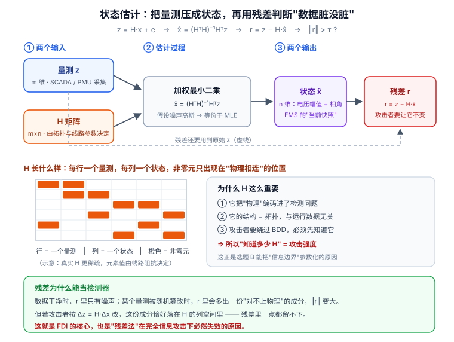
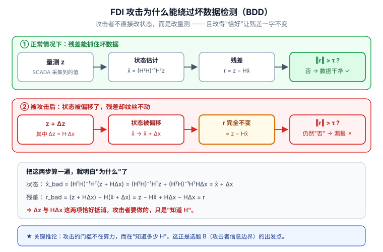

# 📘 第 6 周 · 论文阅读与电网场景

> **本周目标**：完成两件事 —— **① 掌握一套可复用的论文阅读方法**（三遍法 + 找 gap 的公式）；**② 把前面 5 周学的 AI 知识挂到电力系统上**。学完你应该能做到：40 分钟内读完一篇论文并说出贡献与局限；用生活类比讲清无功功率；**写出 `Δz = H·Δx` 并解释 FDI 为什么能绕过传统坏数据检测**；用 pandapower 跑通 IEEE 14 节点潮流；写出 FGSM 攻击代码。
>
> **本周知识清单**：E 域 4 条 + D 域 14 条（融入每天末尾的 ✅ 知识自查）
>
> **阶段位置**：本周是**阶段分水岭**。Day 35 之前你是知识的消费者，Day 36 开始你是知识的生产者。本周结束你会锁定一篇复现目标论文。
>
> **使用方式**：在 Typora 中按标题折叠展开，每天读对应的小节即可。

[[深度学习学习总目录|← 返回总目录]]

---

## Day 36 —— 三遍读论文法：找 gap 才是目的

> **一句话**：读论文不是为了知道别人做了什么，是为了知道**别人没做什么**。前四遍读懂，第五遍才是做研究。

### 一、为什么需要一套"方法"

新手读论文的典型状态：**从第一页第一行读到最后一行，读了三小时，合上论文说不出它干了什么。**

这不是能力问题，是**方法问题**。学术论文的结构是**为审稿人写的**，不是为读者写的 —— 它要求严谨、完整、可复现，所以信息密度极低（一篇 8 页的论文，核心贡献可能只有半页）。

**所以你需要一套"分层过滤"的读法。** 这就是 S. Keshav 在 *How to Read a Paper* 里提出的**三遍法**。

### 二、第一遍（5 分钟）：判断值不值得读

**只读这五样东西**：

| 读什么 | 找什么 |
|---|---|
| **标题** | 大致方向对不对 |
| **摘要** | 问题 + 方法 + 结果，一句话概括 |
| **引言最后一段 / 贡献列表** | 作者声称的贡献（通常是 bullet points） |
| **所有图表 + 图注** | 方法长什么样，结果好不好 |
| **结论** | 作者自己怎么总结 |

**读完之后必须能回答"五个 C"**：

```
① Category（类别）：这是什么类型的论文？方法创新 / 应用 / 综述 / 数据集？
② Context（背景）：它和哪些工作相关？基于谁？反驳谁？
③ Correctness（正确性）：假设看起来合理吗？
④ Contributions（贡献）：主要贡献是什么？
⑤ Clarity（清晰度）：写得好吗？
```

**然后做决定**：

| 判断 | 行动 |
|---|---|
| 和我的方向无关 | **直接丢掉**，不要有心理负担 |
| 有点相关但不是我需要的 | 记进 Zotero，标注"泛读" |
| **高度相关** | 进入第二遍 |

> **这一遍最重要的事情是"敢丢"。** 一个方向上的论文有几百篇，你只能精读 20 篇。**第一遍的价值就是把 200 篇筛成 20 篇。**

### 三、第二遍（30 分钟）：抓方法主干

**这一遍的目标：能给别人讲清楚这篇论文做了什么。** 但要**跳过证明和细节**。

**具体做法**：

1. **仔细看图表** —— 特别是**方法结构图**。这张图就是论文的核心。
2. **标注关键参数** —— 论文里没说的地方，在页边标记"这里没写"。
3. **跳过数学证明**，只看结论。
4. **读完相关工作（Related Work）**，你会知道这个领域有谁在做。
5. **读完实验部分**，重点看 baseline 和指标。

**第二遍结束时，你应该能写出**：

```
本文提出 ____，用于解决 ____ 问题。
它的核心 trick 是 ____。
在 ____ 数据集上，相比 ____ 提升了 ____。
```

**如果这四句话写不出来，说明第二遍没读到位 —— 重读，或者放弃这篇。**

### 四、第三遍（数小时）：逐行抠细节

**第三遍只留给精读论文** —— 一个方向上有 3-5 篇就够了。

**做法**：**假装自己是审稿人，要复现这篇论文。**

| 抠什么 | 具体问题 |
|---|---|
| **公式** | 每个符号定义清楚了吗？能自己推一遍吗？ |
| **数据** | 数据怎么来的？怎么划分的？有没有泄漏？ |
| **超参数** | 学习率、batch size、层数都写了吗？没写的话怎么猜？ |
| **baseline** | 是同一套数据划分吗？调过参吗？公平吗？ |
| **指标** | 为什么选这个指标？有没有报多个指标？ |
| **消融实验** | 每个模块都验证了吗？还是只是堆在一起？ |

**第三遍的标志性产物**：一份能让你**动手复现**的笔记。如果读完第三遍还是不知道怎么复现，那这篇论文要么写得烂，要么你还没读透。

### 五、快速定位贡献段和局限段

**这两段的位置是有规律的，记住能省很多时间。**

| 想找 | 去哪里找 |
|---|---|
| **贡献** | ① Intro 的最后一段（最常见）；② Conclusion 的开头；③ Intro 里的 bullet list |
| **局限** | ① Related Work 的末尾（"然而，这些方法都..."）；② Limitations 章节；③ Conclusion 里的 Future Work；④ Discussion 部分 |

**读"局限"时的关键技巧**：**作者承认的局限往往是"安全"的**（无伤大雅的小问题），真正的局限往往**作者没写**。所以：

> **读论文时要问两个问题**：
> 1. 作者自己承认了什么局限？
> 2. **作者没承认，但你看出来的局限是什么？**
>
> 第 2 个问题的答案，往往就是你的选题。

### 六、找 gap 的公式：把局限列出来，逐个问"我能不能补"

**这是本周最重要的一个操作流程。** 请把它当成一个可以机械执行的算法：

```
第 1 步：把这篇论文的"局限"全部列出来
        （作者承认的 + 你看出来的，越多越好，列 10 条也不嫌多）

第 2 步：对每一条局限，问三个问题
        Q1：这个局限重要吗？（补上它能带来实质提升吗）
        Q2：我能补吗？（我的能力 + 资源够不够）
        Q3：别人为什么没补？（是没想到，还是做不了，还是不值得做）

第 3 步：挑出 Q1=重要、Q2=能补、Q3=别人没做 的那一条

第 4 步：用一句话写出你的题目
        本文提出 ____，解决 ____ 问题，相比 ____ 提升了 ____
```

**举个具体的例子（用你后面要读的 FDI 检测论文）**：

| # | 局限 | 重要吗 | 我能补吗 | 别人为什么没补 |
|---|---|---|---|---|
| 1 | 只在仿真数据上验证 | 重要 | ✅ 能（仿真也是标准做法） | 真实数据拿不到 |
| 2 | 攻击样本是随机扰动的，不满足 `Δz = H·Δx` | **很重要** | ✅ 能（用 H 矩阵构造） | 很多人图省事 |
| 3 | 没考虑对抗攻击 | **很重要** | ✅ 能（W2 学的 FGSM） | 交叉领域，做电力的人不懂对抗 |
| 4 | 模型不可解释 | 中 | ✅ 能（注意力可视化） | 需要额外工作量 |
| 5 | 没有考虑拓扑变化 | 重要 | ⚠️ 难（需要多拓扑数据） | 数据构造复杂 |

**看第 2 和第 3 条** —— 这就是你的机会：**用符合物理约束的攻击样本 + 对抗攻击来评估检测器**。这个方向：

- 对电力背景的人：他们不懂对抗攻击
- 对 AI 背景的人：他们不懂 H 矩阵和状态估计
- **正好是你的交叉优势**

### 七、读论文时该问的五个问题

**每次读完一篇论文，用这五个问题过一遍**：

1. **它解决什么问题？**（一句话）
2. **之前的方法为什么不行？**（理解 motivation）
3. **它的核心 trick 是什么？**（技术贡献）
4. **实验能支撑它的结论吗？**（数据、baseline、指标是否公平）
5. **它的局限在哪？我能做什么？**（← **唯一真正重要的问题**）

> **第 5 个问题是唯一真正重要的。**
>
> 前 4 个是"**读懂**"，第 5 个是"**能做研究**"。
>
> **读论文不是为了知道别人做了什么，是为了知道别人没做什么。**

### 八、工具：Zotero 建库

**从第一天就建立文献库，不要等到要写论文时再补。**

**建议的分类结构**（按你的方向定制）：

```
电网安全 × AI/
├── 00-方法论/              （读论文方法、科研写作）
├── 01-电力系统基础/         （状态估计、潮流、SCADA）
├── 02-攻击面/              （FDI、DoS、重放、投毒）
├── 03-异常检测/            （AE、时序检测、评估协议）
├── 04-对抗攻防/            （FGSM、PGD、对抗训练）
├── 05-模型结构/            （CNN、RNN、Transformer、GNN）
├── 06-数据集与仿真/        （pandapower、IEEE 算例）
└── 99-待读/               （第一遍筛出来、还没读的）
```

**Zotero 的三个关键用法**：

| 功能 | 怎么用 |
|---|---|
| **浏览器插件** | 在 arXiv / IEEE 页面一键抓取元数据和 PDF |
| **标签（Tags）** | 打上 `已精读` / `泛读` / `复现候选` 标签，比文件夹更灵活 |
| **笔记（Notes）** | 每篇论文写五问的答案，**这是你未来写 related work 的原材料** |

### 九、和电网安全的关系

**电网安全这个方向，读论文有一个特殊之处：你必须读两个领域的论文。**

| 领域 | 顶会 / 顶刊 | 读什么 |
|---|---|---|
| **AI / 安全** | CCS, S&P, USENIX Security, NDSS, NeurIPS, ICML | 攻击方法、检测范式、评估规范 |
| **电力系统** | IEEE Trans. Smart Grid, IEEE Trans. Power Systems, Proc. IEEE | 攻击的物理可行性、系统约束、仿真设置 |

**为什么两个都要读**：

- **只读 AI 的论文** → 你会设计出物理上不可行的攻击（审稿人一句"这个量测在电网里根本不存在"就毙掉）
- **只读电力的论文** → 你会用落后五年的方法（电力期刊里的深度学习方法通常比 AI 顶会晚 2-3 年）

**你的定位优势就在这里**：**你是两个领域的翻译者。**

**一个实操建议**：读电力期刊的论文时，**只看它的"系统模型"和"攻击模型"两节，跳过所有方法细节**。你要的是"攻击者能改什么、系统约束是什么"，不是它用什么分类器。

### 🔍 延伸思考

1. 三遍法里的第一遍只有 5 分钟。为什么"敢丢论文"是一种能力？如果你把每一篇都精读，会付出什么代价？
2. 如果一篇论文的 Related Work 里写着"然而，现有方法都没有考虑 XX 情况"，这句话通常意味着什么？（提示：这是作者在为自己的工作铺路，XX 可能就是他的贡献）
3. 你现在能说出 3 个你读过的、和"电网 + AI"相关的论文标题吗？如果说不出来，说明你的第一遍筛选还没开始。

### 📚 参考

- Keshav, S. (2007), *How to Read a Paper*, ACM SIGCOMM CCR —— [PDF](https://web.stanford.edu/class/ee384m/Handouts/HowtoReadPaper.pdf)
- 检索建议：搜 `how to read a research paper`，找几篇不同视角的方法论文章对照看

### 🎬 视频讲解

> 以下为**关键词检索式**推荐（平台搜索结果，非固定视频链接，避免失效）。
> 直接复制关键词到对应平台搜索即可，也可在结果里挑播放量高的看。

| 平台 | 推荐搜索关键词 | 说明 |
|---|---|---|
| **B站** | [如何读论文 三遍法 研究生](https://search.bilibili.com/all?keyword=如何读论文+三遍法+研究生) | 三遍法的中文讲解 |
| **B站** | [吴恩达 读论文 方法](https://search.bilibili.com/all?keyword=吴恩达+读论文+方法) | 吴恩达关于如何读论文的建议 |
| **B站** | [科研入门 文献阅读 技巧](https://search.bilibili.com/all?keyword=科研入门+文献阅读+技巧) | 研究生新生必看 |
| **B站** | [Zotero 使用教程 文献管理](https://search.bilibili.com/all?keyword=Zotero+使用教程+文献管理) | 把工具用起来 |
| **抖音** | [研究生 怎么读论文](https://www.douyin.com/search/研究生+怎么读论文) | 碎片时间了解 |

### ✅ 知识自查

- [ ] 🟢 **方法** 第一遍（5 分钟）：标题 / 摘要 / 图表 / 结论 → 判断值不值得读
- [ ] 🟢 **方法** 第二遍（30 分钟）：方法主干，跳过证明和细节
- [ ] 🟢 **方法** 第三遍（数小时）：逐行抠细节，**只留给精读论文**
- [ ] 🟢 **方法** 快速定位贡献段：通常在 Intro 末尾和 Conclusion 开头
- [ ] 🟢 **方法** 快速定位局限段：Related Work 末尾、Limitations 章节、Future Work
- [ ] 🟢 **方法** 找 gap 的公式：**把局限列出来，逐个问"这个我能不能补"**
- [ ] 🟡 **工具** Zotero 建库 + 按主题分类（电网 / 异常检测 / 对抗攻击）

**今天就要做的事**：

- [ ] 装好 Zotero + 浏览器插件
- [ ] 按上面的目录结构建好分类
- [ ] 在 Google Scholar 搜 `false data injection attack detection deep learning`，**用第一遍法筛 10 篇**，存进 Zotero

---

## Day 37 —— 电力系统最小必要知识：SCADA 与状态估计

> **一句话**：电网安全的全部战场，浓缩成一个方程 —— **`z = Hx + e`**。理解了这个方程里每个字母的含义，你就理解了 FDI 攻击为什么能成功。

### 一、电力的四个环节

```
发电  →  输电  →  配电  →  用电
(电厂)  (高压网)  (中低压)  (用户)
```

| 环节 | 电压等级 | 典型设备 | 安全关注点 |
|---|---|---|---|
| **发电** | 10-20 kV（机端） | 发电机、励磁系统 | 发电机组控制 |
| **输电** | 220-1000 kV | 变压器、断路器、线路 | **状态估计的主战场** |
| **配电** | 10-35 kV | 开关柜、配电变压器 | 分布式电源接入 |
| **用电** | 220/380 V | 智能电表 | 需求侧响应、隐私 |

**输电环节是电网安全研究的核心** —— 因为：

- 输电网络是**互联的**，一处故障可能连锁反应（回顾 Day 38 会讲的级联失效）
- 输电系统有完整的**量测与控制系统**（SCADA / EMS），有明确的攻击面
- IEEE 的标准算例（14 / 118 节点）都是输电网络

### 二、电网的两个基本约束

**约束一：功率平衡**

```
发电功率 = 用电功率 + 损耗
```

**时时刻刻**都要成立。一旦不成立，频率就会偏离 50 Hz：

| 情况 | 频率变化 | 后果 |
|---|---|---|
| 发电 > 用电 | 频率上升 | 设备过速保护动作 |
| 发电 < 用电 | 频率下降 | 大规模切负荷（低频减载） |
| 严重不平衡 | 频率崩溃 | **大面积停电** |

> **为什么频率是 50 Hz**：这是发电机转速决定的。中国 / 欧洲用 50 Hz，美国用 60 Hz。**频率是全网统一的，它是"功率平衡"的直接体现。**

**约束二：电压范围**

节点电压必须维持在额定值的 `±5%` 左右（比如 `0.95 ~ 1.05 p.u.`）。电压过低会导致电机堵转、设备损坏；过高会击穿绝缘。

**关键区别**：

| 约束 | 靠什么维持 | 时间尺度 |
|---|---|---|
| **功率平衡（频率）** | **有功功率** P 的调节 | 秒级（惯量响应） |
| **电压范围** | **无功功率** Q 的调节 | 分钟级（励磁、电容器） |



> **看图说话**：上图刻意画成“**两个输入 → 估计过程 → 两个输出**”，请务必按这个结构理解，不要理解成一条线性流。**两个输入**是量测向量 `z` 和量测雅可比矩阵 `H` —— 注意 `H` **不是**由状态 `x` 推出来的，它由电网的**拓扑和线路参数**决定，在估计开始前就已经确定。**估计过程**是加权最小二乘 `x̂ = (HᵀH)⁻¹Hᵀz`。**两个输出**是状态估计 `x̂`（电压幅值 + 相角）与残差 `r = z − Hx̂`；残差 `r` 就是坏数据检测（BDD）的判据：`‖r‖ > τ` 就报警。图右侧那句话是重点：`H` 既是估计的骨架，也是 **FDI 攻击的钥匙** —— 攻击者只要知道 `H`，就能构造出绕过 BDD 的假数据。所以说“攻击者知道多少 `H`”，就是攻击强度的分水岭（选题 B 的物理基础）。


### 三、交流电的三个量

| 量 | 符号 | 含义 | 单位 |
|---|---|---|---|
| **电压幅值** | `V` | 电压的"大小" | p.u. 或 kV |
| **相角** | `θ` | 电压正弦波的相位偏移 | 度 / 弧度 |
| **频率** | `f` | 每秒变化的周期数 | Hz |

**为什么相角重要**：**有功功率的流动由相角差决定。**

```
P_ij ≈ (θ_i - θ_j) / X_ij
```

**相角差越大，流过的有功功率越大。** 这就是"潮流"的物理直觉 —— 电从相角高的地方流向相角低的地方（就像水从高处流向低处）。

> **这个关系极其重要**，因为它是 Day 41 里 DC 潮流和 H 矩阵的基础。

### 四、有功功率 P vs 无功功率 Q

**这是电力系统里最难懂、也最必须讲清的一对概念。**

**生活类比（记住这个）：**

> **有功功率 P** = 你搬砖，砖真的从 A 搬到了 B，**做了功**。
>
> **无功功率 Q** = 你站在原地**举着砖**，砖没动，但**你得一直用力**（维持这个姿势）。
> 一旦松手，砖就掉了 —— **对应到电网里，就是电压塌了。**

**为什么需要无功功率**：

电机、变压器、电抗器都是靠**磁场**工作的。建立和维持磁场需要无功功率。**没有无功，设备根本无法运行。**

**为什么无功功率麻烦**：

| 问题 | 说明 |
|---|---|
| 占线路容量 | 线路的传输容量有限，无功占了额度，有功就送不了那么多 |
| 不能远距离输送 | 无功在传输中损耗很大，必须**就地补偿** |
| 需要专门设备 | 并联电容器、SVG、调相机 —— 都是为了补无功 |

**就地补偿的直觉**：你举砖举累了，最有效的办法不是让远处的人帮你举（传不过去），而是**在你旁边放个支架**（就地装电容器）。

**对照表**：

| | 有功功率 P | 无功功率 Q |
|---|---|---|
| 单位 | MW | MVar |
| 做什么 | 真正做功、消耗能量 | 建立磁场、维持电压 |
| 平衡什么 | 频率 | 电压 |
| 能不能远送 | ✅ 可以 | ❌ 损耗大，需就地补偿 |
| 量测里常见吗 | ✅ 非常常见 | ✅ 也常见（可能为负） |
| 对你建模的影响 | 正常数值 | **可能为负值 → 注意 ReLU 死亡神经元（回顾 Day 9）** |

### 五、潮流方程：知道它是什么就够了

**潮流计算（Power Flow）**：已知发电和负荷，求全网的电压幅值和相角。

**方程长这样（不用会解）**：

```
P_i = V_i · Σ_j V_j · (G_ij cos θ_ij + B_ij sin θ_ij)
Q_i = V_i · Σ_j V_j · (G_ij sin θ_ij - B_ij cos θ_ij)
```

**你只需要知道三件事**：

1. 它是**非线性**的（有 `sin` / `cos` 和 `V` 的乘积）
2. 它有**唯一解**（在正常运行范围内）
3. **潮流方程是电网的"物理定律"** —— 任何量测组合如果不满足它，就是坏数据或攻击

> **第 3 条就是 Day 38 讲 FDI 检测时"物理约束方法"的基础。** 有很多论文在做"把潮流方程当约束加进神经网络"，思路就来自这里。

### 六、IEEE 14 / 118 节点测试系统

**学术界的标准算例。** 你以后看论文，几乎每一篇都会说"在 IEEE 14 / 118 节点系统上验证"。

| 算例 | 节点数 | 支路数 | 用途 |
|---|---|---|---|
| **IEEE 9** | 9 | 9 | 最简单的教学算例 |
| **IEEE 14** | 14 | 20 | **入门首选**，小到能手算，又有足够冗余 |
| **IEEE 30** | 30 | 41 | 中等规模 |
| **IEEE 57** | 57 | 80 | 较大规模 |
| **IEEE 118** | 118 | 186 | **论文里的标配**，规模够大 |
| **IEEE 300** | 300 | 411 | 大规模验证 |

**为什么用标准算例**：让别人的工作能和你的**可比**。如果你自己造一个电网，审稿人无法判断结果是否可推广。

**你的策略**：**IEEE 14 入门 → IEEE 118 出论文**。这是最常见的组合。

### 七、SCADA：电网的"眼睛"

**SCADA = Supervisory Control And Data Acquisition（数据采集与监控系统）**

**它是电网运行的眼睛和手**：

```
现场设备（RTU / PLC / IED）
        ↓ 采集
  通信网络（光纤 / 微波 / 电力线载波）
        ↓
   主站（EMS / DMS）
        ↓ 分析 + 决策
   控制指令下发
```

**SCADA 采集两类数据**：

| 类型 | 内容 | 特点 | 数据形式 |
|---|---|---|---|
| **遥测（Telemetry）** | 电压、电流、功率 | **模拟量**，连续变化 | 浮点数 |
| **遥信（Teleindication）** | 开关分/合、保护动作 | **状态量**，只有 0/1 | 整数 |

> **记忆**：**遥测 = "测"出来的数值**（连续的），**遥信 = "信"号状态**（离散的）。

**其他系统**：

| 系统 | 全称 | 管什么 |
|---|---|---|
| **EMS** | Energy Management System | 输电网的能量管理（含状态估计） |
| **DMS** | Distribution Management System | 配电网的管理 |
| **RTU** | Remote Terminal Unit | 现场的数据采集终端 |
| **PLC** | Programmable Logic Controller | 可编程逻辑控制器，执行控制逻辑 |
| **IED** | Intelligent Electronic Device | 智能电子设备（保护、测控） |

### 八、状态估计：电网可信性的守门人

**这是整个电网安全的核心环节。**

**问题**：SCADA 采集了几千个量测，但这些量测**有误差、可能有坏数据、可能被篡改**。上层应用（调度、潮流、稳定分析）需要的是一个**可信的全网状态**。

**状态估计做的就是这件事：用冗余的量测，推算出一个"最可信"的全网状态。**

**核心方程**：

```
z = H · x + e
```

| 符号 | 名称 | 维度 | 含义 |
|---|---|---|---|
| `z` | **量测量** | `m` | 节点电压、支路功率、注入功率……（**测出来的**） |
| `x` | **状态量** | `n` | 各节点的电压幅值和相角（**要算出来的**） |
| `H` | **量测矩阵** | `m × n` | 描述"状态如何映射到量测"（由**拓扑和线路参数**决定） |
| `e` | **量测误差** | `m` | 量测噪声 |

**关键：`m > n`（量测数 > 状态数）。** 这个**冗余**是状态估计能工作的前提 —— 有冗余才能"投票"选出最可信的状态。

**典型规模**：IEEE 14 节点系统，`n = 2×14 - 1 = 27` 个状态（14 个相角 + 14 个幅值，减去参考节点相角），`m` 通常取 50-100 个量测。冗余度 `m - n ≈ 30-70`。

### 九、状态估计的完整流程

```
第 1 步：收到量测 z（可能含坏数据）
          ↓
第 2 步：加权最小二乘（WLS）求解
         x̂ = argmin (z - Hx)ᵀ W (z - Hx)
         x̂ = (HᵀWH)⁻¹ HᵀW z
          ↓
第 3 步：计算残差
         r = z - H x̂
          ↓
第 4 步：坏数据检测（BDD）
         if ||r||₂ > τ:   → 有坏数据，剔除后重估
         else:            → 通过
          ↓
第 5 步：把 x̂ 交给上层应用（调度、稳定分析、市场出清）
```

**WLS 闭式解**：`x̂ = (HᵀWH)⁻¹HᵀWz`。这里 `W` 是权重矩阵（通常是量测误差方差的倒数 —— 精度高的量测权重大）。

> **注意**：`HᵀWH` 是 `n × n` 的方阵。它必须**可逆**（即 `H` 列满秩），这就是**可观测性（observability）**条件。如果某些状态无法被量测覆盖，状态估计就无解。

### 十、残差 `r = z - Hx̂` 的物理含义

**残差就是"量测和估计值的差"。**

```
r = z - H x̂
```

**直觉**：

- 如果量测都是好的，`r` 应该很小（只有噪声）
- 如果某个量测是坏数据，它和估计值会差很远，`r` 里对应的分量就会很大
- **所以 `||r||₂` 超过阈值，就判定有坏数据**

**BDD 的数学本质**：残差 `r` 是量测 `z` 在"残差子空间"上的投影。

```
r = z - H(HᵀWH)⁻¹HᵀWz = (I - H(HᵀWH)⁻¹HᵀW) z = K z
```

其中 `K` 是**残差灵敏度矩阵**，它是一个**投影矩阵**（幂等：`K² = K`）。它把 `z` 投影到 `range(H)` 的**正交补空间**上。

> **这个"投影"的视角极其重要** —— 因为 Day 38 的 FDI 攻击，本质就是**构造一个落在 `range(H)` 里的攻击向量**，从而在残差子空间里"投影为零"。

### 十一、和电网安全的关系：FDI 攻击的突破口就在这里

> **🔴 这是你论文的核心切入点，请务必看懂。**

**BDD 的假设是**：坏数据是**随机的**（比如传感器故障），所以它不会恰好满足物理规律。

**FDI 攻击打破了这个假设**：攻击者**故意构造**一个满足物理规律的攻击向量。

```
攻击者注入：Δz = H · Δx
```

**结果**：

```
新的量测：  z_a = z + Δz = z + H·Δx
新的估计：  x̂_a = (HᵀWH)⁻¹HᵀW(z + H·Δx)
                = x̂ + Δx                          ← 状态被偏移了 Δx！
新的残差：  r_a = z_a - H·x̂_a
                = (z + H·Δx) - H(x̂ + Δx)
                = z - H·x̂
                = r                                ← 残差完全没变！
```

> **这就是 FDI 的完整数学原理**：
>
> - 攻击者让**状态估计偏移 `Δx`**（误导上层决策）
> - 同时让**残差 `r` 保持完全不变**（绕过 BDD）
>
> **传统坏数据检测完全失效 —— 因为从数学上看，这组量测是"自洽"的。**

**一个可以手算验证的数值例子**（Day 38 会展开）：

```
3 节点系统，状态 x = [θ₂, θ₃]，4 个量测
H = [[-1, 0], [1, -1], [0, -1], [2, -1]]

真实状态：θ = [0.1, 0.05]
量测：    z = [-0.09, 0.04, -0.045, 0.145]   （含小噪声）

WLS 估计：x̂ = [0.09333, 0.04667]
残差：    r = [0.00333, -0.00667, 0.00167, 0.005]

攻击者选 Δx = [0.02, 0.03]，注入 Δz = H·Δx = [-0.02, -0.01, -0.03, 0.01]
新的量测：z_a = [-0.11, 0.03, -0.075, 0.155]

新的估计：x̂_a = [0.11333, 0.07667] = x̂ + Δx     ← 状态被成功偏移！
新的残差：r_a = [0.00333, -0.00667, 0.00167, 0.005] = r   ← 残差一模一样！
```

**BDD 看到 `||r_a||₂ = ||r||₂`，判定"数据正常"，放行。** 而调度员看到的状态已经偏了。

**这就是 FDI 攻击的全部威力。**

### 🔍 延伸思考

1. 如果攻击者只能篡改**部分**量测（比如只能改 3 个），他还能构造出完美的 FDI 吗？（提示：需要 `Δz` 落在 `H` 的列空间里，这要求攻击者能改的量测覆盖足够的"自由度"）
2. 为什么无功功率可能是负值？这对神经网络的输入处理有什么影响？（回顾 Day 9 的 ReLU 死亡神经元和 Day 13 的标准化）
3. 状态估计的冗余度 `m - n` 越大，FDI 攻击是更容易还是更难？为什么？

### 📚 参考

- Abur & Exposito (2004), *Power System State Estimation: Theory and Implementation*, CRC Press —— 状态估计的标准教材
- Liu, Ning & Reiter (2009), *False Data Injection Attacks against State Estimation in Electric Power Grids*, ACM CCS —— **FDI 开山之作**
- 检索建议：搜 `power system state estimation tutorial`，找一篇讲义把 WLS 推导看懂

### 🎬 视频讲解

> 以下为**关键词检索式**推荐（平台搜索结果，非固定视频链接，避免失效）。
> **注意**：B 站上的电力课程质量参差，**正规 MOOC 更靠谱**。

| 平台 | 推荐搜索关键词 | 说明 |
|---|---|---|
| **B站** | [电力系统分析 慕课 状态估计](https://search.bilibili.com/all?keyword=电力系统分析+慕课+状态估计) | 中国大学MOOC 的课程更系统 |
| **B站** | [有功功率 无功功率 通俗讲解](https://search.bilibili.com/all?keyword=有功功率+无功功率+通俗讲解) | 把 P 和 Q 的区别讲明白 |
| **B站** | [状态估计 电力系统 讲解](https://search.bilibili.com/all?keyword=状态估计+电力系统+讲解) | 状态估计的完整流程 |
| **B站** | [SCADA 系统 讲解 遥测 遥信](https://search.bilibili.com/all?keyword=SCADA+系统+讲解+遥测+遥信) | 工控系统的整体架构 |
| **抖音** | [无功功率 是什么](https://www.douyin.com/search/无功功率+是什么) | 三分钟建立直觉 |

### ✅ 知识自查

**D1 电力系统基础**

- [ ] 🔴 **概念** 四环节：发电 → 输电 → 配电 → 用电
- [ ] 🔴 **概念** 电网的两个基本约束：功率平衡、电压范围
- [ ] 🟡 **概念** 交流电的三个量：电压幅值 / 相角 / 频率
- [ ] 🟡 **概念** **有功功率 P**：实际做功、消耗能量的部分
- [ ] 🟡 **概念** **无功功率 Q**：建立磁场、维持电压的部分（不消耗但必需）
- [ ] 🟡 **概念** 潮流方程：描述功率如何按阻抗分布（**不用会解，知道它是什么**）
- [ ] 🟡 **概念** IEEE 14 / 118 节点测试系统：学术界的标准算例
- [ ] 🔴 **概念** 状态量 vs 量测量 的区别

**D2 工业控制系统**

- [ ] 🟡 **概念** SCADA：数据采集与监控系统，电网的"眼睛"
- [ ] 🟡 **概念** EMS / DMS：能量管理 / 配电管理系统
- [ ] 🟡 **概念** **遥测**（模拟量：电压、电流、功率）vs **遥信**（状态量：开关分合）
- [ ] 🟡 **概念** RTU / PLC / IED：现场设备
- [ ] 🟡 **概念** **状态估计**：用冗余量测推算全网状态，是电网可信性的守门人
- [ ] 🟡 **概念** 坏数据检测：状态估计中的残差检验环节

**必须能默写的三个东西**：

| # | 内容 |
|---|---|
| 1 | `z = Hx + e` 里每个符号的名称与含义 |
| 2 | 残差 `r = z - Hx̂` 的计算方式，以及 BDD 的判据 |
| 3 | 攻击构造 `Δz = H·Δx`，以及它为什么能让残差不变 |

**通关验证**：**能用生活类比（举砖）讲清无功功率**，且能在一张纸上写出 FDI 的完整推导。

---

## Day 38 —— 电网网络安全的攻击面：FDI / DoS / 重放

> **一句话**：电网攻击面分四层，攻击手法有三类，但**只有 FDI 是深度学习的天然战场** —— 因为它的攻击对象是高维数值，异常模式可以学。

### 一、四层攻击面

```
┌─────────────────────────────────────────┐
│  ④ 主站层（EMS / DMS）                   │  ← 控制中心、数据库、上层应用
├─────────────────────────────────────────┤
│  ③ 控制层（RTU / PLC / IED）             │  ← 现场设备，能直接操作开关
├─────────────────────────────────────────┤
│  ② 通信层（IEC 61850 / DNP3 / Modbus）   │  ← 报文可以被篡改、丢弃、重放
├─────────────────────────────────────────┤
│  ① 量测层（CT / PT / 传感器）             │  ← 物理量测可以被干扰
└─────────────────────────────────────────┘
```

| 层 | 攻击方式 | 难度 | 典型后果 |
|---|---|---|---|
| **量测层** | 物理干扰、传感器欺骗 | 高（要接触设备） | 量测偏差 |
| **通信层** | 报文篡改、注入、重放、DoS | **中（网络可达即可）** | **FDI / 重放 / DoS** |
| **控制层** | 恶意固件、逻辑篡改 | 高 | **直接操作开关（Stuxnet 式）** |
| **主站层** | 入侵服务器、篡改数据库 | 中高 | 全局失守 |

**为什么通信层是研究热点**：它是**唯一"网络可达就能攻击"** 的一层。不需要物理接触，不需要控制设备固件，只要能往通信链路上注入报文就够了。

### 二、FDI：虚假数据注入

**FDI = False Data Injection**

**做法**：篡改量测值，让状态估计算出错误的状态，误导上层决策。

**回顾 Day 37 的核心结论**：

```
攻击者注入 Δz = H · Δx
⇒ 状态估计偏移 Δx（得逞）
⇒ 残差 r 完全不变（绕过 BDD）
```

**FDI 的实际危害链**：

```
篡改量测 → 状态估计偏移 → 调度员看到错误的潮流
                              ↓
                    ┌─────────┴─────────┐
                    ↓                   ↓
              误判线路过载          误判线路空闲
              （不必要的切负荷）      （实际过载不处理）
                    ↓                   ↓
                经济损失            设备损坏 / 停电
```

**FDI 的三种能力假设（写论文时必须写清楚）**：

| 类型 | 攻击者知道什么 | 难度 | 论文里的定位 |
|---|---|---|---|
| **完全信息** | 完整的 `H` 矩阵（拓扑 + 线路参数） | 低 | 已被研究透 |
| **部分信息** | 部分拓扑（比如只知道子网） | 中 | **主流研究方向** |
| **无信息** | 什么都不知道 | 高 | **最贴近实战** |

> **⚠️ 写论文时这一栏必须写清楚。**
>
> 审稿人第一个会问的就是"**你的攻击者模型是什么**"。
> **说不清攻击者能力边界，论文直接挂。**

**为什么"部分信息"是主流**：因为它**更现实**。真实攻击者很难拿到完整的电网参数（这些是敏感信息），但通过长期观测和网络渗透，拿到部分信息是合理的。



> **看图说话**：上图上下两行对比了**随机坏数据**和**FDI 攻击**。**上行**：随机坏数据让 `z` 偏离，残差 `r` 明显变大，BDD 报警 —— 抓得住。**下行**：攻击者取 `Δz = H·Δx` 作为注入量。此时状态估计被推偏到 `x̂ + Δx`，但残差 `r_bad = z + Δz − H(x̂ + Δx) = z − Hx̂ = r` —— **两项恰好抵消，残差一个数字都没变**。这就是 FDI 的精髓：它不是“藏得好”，而是**在数学上让检测统计量恒定不变**。由此可以推出一个对你选题很重要的结论：在完全信息假设下“BDD 必然失效”是信息论层面的结论，不是模型不够强 —— 别把第一篇论文的时间花在“改进 BDD”上。


### 三、DoS：拒绝服务

**做法**：阻断通信，让控制中心"失明"。

**攻击方式**：

| 方式 | 说明 |
|---|---|
| 洪泛攻击 | 用大量流量淹没通信链路 |
| 报文丢弃 | 中间人直接丢掉报文 |
| 链路切断 | 物理破坏或协议层阻断 |

**DoS 的后果链**：

```
通信中断 → 状态估计失去量测 → 无法观测的状态区域
                                      ↓
                          调度员"盲调"，或系统降级运行
                                      ↓
                          最坏情况：触发保护动作，连锁跳闸
```

**为什么 DoS 不适合深度学习**：

- 它的**本质是通信中断**，特征非常明显（数据缺失、延迟飙升）
- 用**规则 / 统计方法**（超时计数、丢包率阈值）就能检测，又快又可靠
- 用深度学习是"杀鸡用牛刀"，而且引入不必要的复杂度和误报风险

> **一个诚实的判断**：如果你的论文选题是"用深度学习检测 DoS"，审稿人一定会问"为什么不用统计方法"。**答不上来就别选。**

### 四、重放攻击

**做法**：录下正常报文，稍后重复发送。

```
t = 0s:    录下 [电压 1.02, 电流 0.85, 功率 0.87]   ← 正常报文
t = 300s:  把上面这条原样重发
```

**为什么难检测**：

- **报文内容完全合法** —— 它就是一条真实的历史报文，每个字段都在正常范围内
- **单点看不出** —— 孤立地看这条报文，它是 100% 正常的
- **必须看时序上下文** —— 只有把它和"当前时刻应该是什么"对比，才能发现问题

**检测的关键**：

| 检测思路 | 需要什么 |
|---|---|
| 时间戳一致性检验 | 时间戳 + 序列号 |
| **序列上下文建模** | **时序模型（LSTM / Transformer）** |
| 与物理模型对比 | 潮流方程约束 |

**这是 Transformer 的用武之地**：回顾 Day 31，**位置编码让模型知道"这条报文出现在序列的第几号位置"**。如果同一内容出现在"不该出现的位置"，模型能学出来。

> **一个有意思的选题**：把重放攻击建模成"序列的位置-内容不一致性检测"，用 Transformer 的位置编码 + 自注意力来做。**这个题目在文献里相对少见，且你的 AI 背景直接对口。**

### 五、数据投毒

**做法**：污染训练数据，破坏 AI 检测器。

**为什么这是"攻击 AI 的 AI 攻击"**：

| 传统攻击 | 数据投毒 |
|---|---|
| 目标是**系统**（状态估计） | 目标是**检测器** |
| 攻击者改的是量测值 | 攻击者改的是**训练数据** |
| 防御靠物理约束 | 防御靠数据审计 |

**投毒的两种形式**：

| 形式 | 做法 | 效果 |
|---|---|---|
| **标签翻转** | 把攻击样本标成正常 | 检测器学会忽略这类攻击 |
| **后门注入** | 在正常样本里埋一个触发模式，让它被判为正常 | **特定触发条件下检测器完全失效** |

**为什么投毒对电网特别危险**：电网的 AI 检测器通常**用历史数据离线训练**。如果攻击者能污染历史数据库（比如通过主站层的入侵），那么检测器从"出生"就是坏的。

**这是你的一个高价值选题方向**：**"FDI 检测器的数据投毒鲁棒性"** —— 需要多少比例的投毒样本才能让检测器失效？怎么检测训练数据被污染了？这个方向：

- 攻击建模 → 你的信息安全背景
- 检测器训练 → 你的深度学习背景
- 电力场景 → 本周刚学的领域知识

### 六、两个必须知道的真实事件

**① 乌克兰电网事件（2015 / 2022）**

| | 2015 年（12 月） | 2022 年（4 月） |
|---|---|---|
| 影响 | 约 23 万用户停电 1-6 小时 | 部分变电站失电 |
| 手法 | 钓鱼邮件 → 远程操控 HMI → 手动开断路器 | 更自动化的攻击链 |
| **关键特征** | **用的是合法凭证和已知工具** | 攻击链更成熟 |

**为什么 2015 年事件是里程碑**：

> 攻击者没有用任何 0day 漏洞。他们用的是**合法的远程访问凭证**、**标准的 HMI 操作界面**、**已知的恶意软件**。传统基于签名和异常的检测**完全失效** —— 因为从系统日志看，一切都是"合法操作"。

**这直接说明了两件事**：

1. **传统规则引擎不够用**（Day 1 的核心论点）
2. **攻击者最擅长的不是"突破防线"，而是"看起来合法"** —— 这正是 FDI 的思想

**② Stuxnet（震网病毒，2010 年被发现）**

**攻击目标**：伊朗纳坦兹核设施的离心机。

**为什么它是工控安全的分水岭**：

| 特征 | 说明 |
|---|---|
| **跨物理隔离** | 通过 U 盘进入（气隙网络也能被打穿） |
| **篡改 PLC 逻辑** | 修改离心机转速控制逻辑 |
| **欺骗监控画面** | **向监控系统发送正常数据，让操作员以为一切正常** |
| **物理破坏** | 离心机因超速而损毁 |

> **注意第 3 条**：**"向监控系统发送正常数据"** —— 这就是 **FDI 思想的物理世界版本**。
>
> Stuxnet 的完整攻击链是：**篡改控制 → 物理破坏 → 同时伪造监控数据掩盖破坏**。
>
> **这是"网络攻击造成物理破坏"的第一个著名案例**，也是整个工控安全领域的起点。

### 七、三类攻击哪一个最适合深度学习

| 攻击 | 适合深度学习吗 | 理由 |
|---|---|---|
| **FDI** | ✅ **非常适合** | 量测是高维数值，异常模式可学习；攻击者会主动伪装，规则难以覆盖 |
| **DoS** | ⚠️ 一般 | 本质是通信中断，用规则/统计更快更可靠 |
| **重放** | ⚠️ **需要时序模型** | 单点看不出，必须看序列上下文（**Transformer 的机会**） |

**结论**：

- **FDI 是你的主战场** —— 文献最多、最容易上手、审稿人认可度高
- **重放是差异化方向** —— 文献相对少，你的 Transformer 能力正好用上
- **DoS 别碰** —— 没有足够的"深度学习的必要性"

### 八、工控通信协议（选学，知道是什么即可）

| 协议 | 全称 | 用途 | 特点 |
|---|---|---|---|
| **IEC 61850** | 变电站自动化国际标准 | 变电站内的通信标准 | **数据模型 + 通信协议的统一标准** |
| **GOOSE** | Generic Object Oriented Substation Event | **快速跳闸信号** | **毫秒级**（要求 < 4 ms），组播 |
| **SV** | Sampled Values | 电流电压采样数据传输 | 高频（每周波 80 点），实时性要求高 |
| **MMS** | Manufacturing Message Specification | 站控层通用通信 | 用于读写、报告、控制 |

**为什么 GOOSE 和 SV 值得注意**：

| 协议 | 实时性要求 | 安全含义 |
|---|---|---|
| **GOOSE** | 毫秒级 | 加密会引入延迟，**很难加安全机制** → 攻击面大 |
| **SV** | 高频 | 数据量大，带宽受限 → 同样难加密 |

> **一个真实的安全困境**：GOOSE 要求 4 毫秒内送达。如果加密引入了 5 毫秒延迟，保护就会误动作。**所以很多变电站的 GOOSE 是不加密的** —— 这是一个公认的、尚未完美解决的问题。

### 九、和电网安全的关系：FDI 完整数值演示

**这是今天最该亲手跑一遍的东西。** 下面的代码完整复现了 Day 37 的数值例子：

```python
import numpy as np

# ===== 1. 系统定义（3 节点 DC 潮流，状态 x = [θ₂, θ₃]）=====
H = np.array([
    [-1.,  0.],   # 支路 1-2 的潮流
    [ 1., -1.],   # 支路 2-3 的潮流
    [ 0., -1.],   # 支路 1-3 的潮流
    [ 2., -1.],   # 节点 2 的注入功率
])
m, n = H.shape
print(f"量测数 m = {m}，状态数 n = {n}，冗余度 = {m - n}")

# ===== 2. 真实状态与含噪量测 =====
x_true = np.array([0.1, 0.05])
noise  = np.array([0.01, -0.01, 0.005, -0.005])     # 量测噪声
z      = H @ x_true + noise

# ===== 3. WLS 状态估计（无权重版：x̂ = (HᵀH)⁻¹Hᵀz）=====
def wls(z, H):
    return np.linalg.solve(H.T @ H, H.T @ z)

def residual(z, H):
    x_hat = wls(z, H)
    return z - H @ x_hat, x_hat

r_before, x_hat_before = residual(z, H)
print("\n【攻击前】")
print(f"  真实状态 x      = {x_true}")
print(f"  估计状态 x̂      = {np.round(x_hat_before, 5)}")
print(f"  残差 r          = {np.round(r_before, 5)}")
print(f"  ||r||₂          = {np.linalg.norm(r_before):.6f}   ← BDD 判据")

# ===== 4. 构造 FDI 攻击：Δz = H · Δx =====
dx    = np.array([0.02, 0.03])          # 攻击者想让状态偏移这么多
dz    = H @ dx                          # 攻击向量（落在 H 的列空间里！）
z_att = z + dz

r_after, x_hat_after = residual(z_att, H)
print("\n【攻击后】")
print(f"  注入量 Δz       = {np.round(dz, 5)}")
print(f"  新量测 z_a      = {np.round(z_att, 5)}")
print(f"  新估计 x̂_a      = {np.round(x_hat_after, 5)}")
print(f"  状态偏移        = {np.round(x_hat_after - x_hat_before, 5)}   ← 应等于 Δx")
print(f"  新残差 r_a      = {np.round(r_after, 5)}")
print(f"  ||r_a||₂        = {np.linalg.norm(r_after):.6f}   ← 和攻击前一模一样！")
print(f"\n  BDD 判定：{'通过（攻击成功绕过！）' if np.isclose(np.linalg.norm(r_before), np.linalg.norm(r_after)) else '异常'}")

# ===== 5. 对照：随机攻击会被抓住 =====
rng = np.random.default_rng(0)
dz_rand = rng.normal(0, 0.05, size=m)      # 随机扰动，不满足 Δz = H·Δx
r_rand, _ = residual(z + dz_rand, H)
print(f"\n【对照实验】随机扰动攻击")
print(f"  ||r||₂ 从 {np.linalg.norm(r_before):.6f} 涨到 {np.linalg.norm(r_rand):.6f}")
print(f"  → 随机攻击会被 BDD 抓住，而 FDI 不会。这就是它的可怕之处。")
```

**预期输出**：

```
量测数 m = 4，状态数 n = 2，冗余度 = 2

【攻击前】
  真实状态 x      = [0.1  0.05]
  估计状态 x̂      = [0.09333 0.04667]
  残差 r          = [ 0.00333 -0.00667  0.00167  0.005  ]
  ||r||₂          = 0.009129   ← BDD 判据

【攻击后】
  注入量 Δz       = [-0.02 -0.01 -0.03  0.01]
  新量测 z_a      = [-0.11  0.03 -0.075  0.155]
  新估计 x̂_a      = [0.11333 0.07667]
  状态偏移        = [0.02 0.03]   ← 应等于 Δx
  新残差 r_a      = [ 0.00333 -0.00667  0.00167  0.005  ]
  ||r_a||₂        = 0.009129   ← 和攻击前一模一样！

  BDD 判定：通过（攻击成功绕过！）

【对照实验】随机扰动攻击
  ||r||₂ 从 0.009129 涨到 0.051163
  → 随机攻击会被 BDD 抓住，而 FDI 不会。这就是它的可怕之处。
```

> **跑完这段代码，你就真正理解了 FDI。** 这不是背概念，是**亲手验证了一个"传统检测方法必然失效"的数学事实**。
>
> **这也是你论文的起点**：既然传统方法失效，那**深度学习方法能不能学到"这些量测虽然自洽，但不符合历史正常模式"？**

### 🔍 延伸思考

1. 上面代码里 `Δz = H·Δx` 需要完整的 `H`。如果攻击者只知道 `H` 的前 3 行，他还能构造出绕过 BDD 的攻击吗？如果不能，他会选择什么替代策略？
2. 为什么"重放攻击"适合用 Transformer，而"DoS"不适合？从"数据里有没有可学的模式"这个角度回答。
3. Stuxnet 的"向监控系统发送正常数据"和 FDI 的 `Δz = H·Δx`，在思想上的共同点是什么？

### 📚 参考

- Liu, Ning & Reiter (2009), *False Data Injection Attacks against State Estimation in Electric Power Grids*, ACM CCS —— **FDI 开山之作**，必读
- Mo et al. (2012), *Cyber-Physical Security of a Smart Grid Infrastructure*, Proc. IEEE
- Langner (2011), *Stuxnet: Dissecting a Cyberwarfare Weapon*, IEEE Security & Privacy
- 检索建议：搜 `false data injection attack survey`，找一篇近 3 年的综述建立攻击方法全景

### 🎬 视频讲解

> 以下为**关键词检索式**推荐（平台搜索结果，非固定视频链接，避免失效）。

| 平台 | 推荐搜索关键词 | 说明 |
|---|---|---|
| **B站** | [工控安全 攻击面 讲解](https://search.bilibili.com/all?keyword=工控安全+攻击面+讲解) | 四层攻击面的整体认识 |
| **B站** | [乌克兰电网 攻击事件 复盘](https://search.bilibili.com/all?keyword=乌克兰电网+攻击事件+复盘) | 真实事件的完整链条 |
| **B站** | [震网病毒 Stuxnet 讲解](https://search.bilibili.com/all?keyword=震网病毒+Stuxnet+讲解) | 工控安全的分水岭事件 |
| **B站** | [虚假数据注入 攻击 检测 FDI](https://search.bilibili.com/all?keyword=虚假数据注入+攻击+检测+FDI) | FDI 的中文讲解 |
| **B站** | [IEC 61850 讲解 GOOSE MMS](https://search.bilibili.com/all?keyword=IEC+61850+讲解+GOOSE+MMS) | 变电站通信协议 |
| **抖音** | [什么是 虚假数据注入](https://www.douyin.com/search/什么是+虚假数据注入) | 三分钟建立概念 |

### ✅ 知识自查

**D3 攻击面**

- [ ] 🟢 **概念** 四层攻击面：量测层 / 通信层 / 控制层 / 主站层
- [ ] 🟢 **概念** **FDI（虚假数据注入）**：篡改量测值，误导状态估计
- [ ] 🟢 **概念** **DoS（拒绝服务）**：阻断通信，使控制中心"失明"
- [ ] 🟢 **概念** **重放攻击**：录下正常报文，稍后重复发送
- [ ] 🟢 **概念** **数据投毒**：污染训练数据，破坏 AI 检测器
- [ ] 🔴 **概念** 乌克兰电网事件（2015 年、2022 年）
- [ ] 🔴 **概念** 震网（Stuxnet）病毒 —— 工业控制系统攻击的里程碑

**D4 工控通信协议（选学）**

- [ ] 🔴 **概念** IEC 61850：变电站自动化的国际标准
- [ ] 🔴 **概念** GOOSE：快速跳闸信号，要求毫秒级
- [ ] 🔴 **概念** SV（采样值）：电流电压采样数据的实时传输
- [ ] 🔴 **概念** MMS：站控层通用通信报文

**通关验证**：

- [ ] 能写出 `Δz = H·Δx` 并解释为什么残差不变
- [ ] 能说清 FDI 三种能力假设的区别
- [ ] 能说出三类攻击中哪一类最适合深度学习，并给出理由
- [ ] 跑通了上面的 FDI 数值演示代码

---

## Day 39 —— 精读论文 A：FDI 检测

> **一句话**：今天你要完整走一遍三遍法，产出一份**能支撑复现**的论文笔记。**重点抠它的攻击者假设和数据生成方式 —— 这两处最常出问题。**

### 一、搜索与筛选策略

**搜索关键词**（复制到 Google Scholar / arXiv）：

```
false data injection attack detection deep learning power system
FDI detection power system state estimation neural network
deep learning false data injection detection smart grid
```

**筛选步骤**：

```
第 1 步：按"引用量"排序，取前 20 篇
第 2 步：用第一遍法（5 分钟/篇）筛出 5 篇
        筛选标准：① 有开源代码 或 ② 是近年高引综述 或 ③ 方向完全对口
第 3 步：从 5 篇里挑 1 篇精读（第三遍）
第 4 步：另外 4 篇做第二遍，写进 Zotero
```

**优先选什么**：

| 优先级 | 特征 | 理由 |
|---|---|---|
| **1** | 有开源代码 | 可以直接看实现细节，未来复现省一半时间 |
| **2** | 近年高引综述 | 帮你建立领域地图 |
| **3** | 免费全文（arXiv / OA 期刊） | 你现在可能没有 IEEE 全文权限 |
| **4** | 方法描述详细（公式 + 超参齐全） | 决定能不能复现 |

### 二、读的时候重点抠这四处

**这是今天最核心的方法论。** 读 FDI 检测论文，这四处决定论文的可信度：

**① 数据怎么来**

| 来源 | 说明 | 可信度 |
|---|---|---|
| **仿真**（pandapower / MATPOWER） | 用标准算例跑潮流生成 | ✅ 学术标准做法，但**必须在论文里坦白** |
| **真实数据** | 电网公司的实测数据 | ✅ 最可信，但极难获取 |
| **混合** | 仿真为主 + 少量真实数据校准 | ✅ 常见做法 |
| **公开数据集** | 如某研究组发布的数据集 | ⚠️ 要看数据集本身的质量和代表性 |

**要问的问题**：用的是 IEEE 14 还是 118？量测噪声怎么加的（高斯？什么标准差）？训练/测试怎么划分的？

**② 怎么造攻击样本（最关键）**

| 生成方式 | 做法 | 问题 |
|---|---|---|
| **随机扰动** | 在量测上加随机噪声 | ❌ **不满足 `Δz = H·Δx`，会被 BDD 抓住** —— 这等于在检测"容易的样本" |
| **构造式攻击** | 严格按 `Δz = H·Δx` 生成 | ✅ **正确的做法**，这才是真正绕过 BDD 的攻击 |
| **部分信息攻击** | 只用部分 `H` 构造 | ✅ 更贴近实战 |
| **优化式攻击** | 用优化方法找"最难检测"的攻击 | ✅ 最强的攻击建模 |

> **🔴 这是最容易出问题的地方。**
>
> 很多论文用"随机扰动"造攻击样本，然后声称"我们的方法检测率 99%"。但**随机扰动连传统 BDD 都能抓住** —— 这个 99% 是在检测一个**已经被解决的问题**。
>
> **看到"随机扰动"要警惕**：作者可能无意中（或有意地）把问题简化了。
>
> **这正好是你的 gap**：用**符合物理约束的构造式攻击**（甚至对抗攻击）来评估，看方法还能不能打。

**③ 实验公平吗**

| 检查点 | 具体问题 |
|---|---|
| **数据划分** | baseline 用的是同一套划分吗？ |
| **baseline 调参** | baseline 调过参吗？还是用默认参数？ |
| **指标** | 只报准确率？还是报了 P / R / F1 / PR-AUC？（回顾 Day 13） |
| **不平衡处理** | 攻击样本通常远少于正常样本，处理了吗？ |
| **多种子** | 报的是单次结果还是均值±标准差？ |

> **"baseline 没调参"是论文里最常见的作弊方式。** 你的方法调了半天，baseline 用默认参数 —— 这个对比毫无意义。

**④ 局限：作者承认了什么，没承认什么**

**两栏记录法**：

| 作者承认的局限 | 你看出来的局限 |
|---|---|
| （抄论文里 Limitations / Future Work 的话） | （自己想的，**这才是选题的种子**） |

**常见的"作者没承认但你看出来"的局限**：

- 只在单一拓扑上验证（没考虑拓扑变化）
- 攻击样本是随机扰动（不满足物理约束）
- 没有对抗攻击的鲁棒性评估
- 模型不可解释（告警无法溯源）
- 没有考虑量测缺失 / 通信延迟
- 数据集太小，没做交叉验证

### 三、论文笔记模板

**建议的笔记结构**（可以直接抄进 Zotero 的 Note）：

```markdown
## 基本信息
- 标题：
- 作者 / 年份 / 出处：
- 链接：
- 引用量：
- 是否有开源代码：

## 一句话总结
本文提出 ____，解决 ____ 问题，相比 ____ 提升了 ____。

## 问题与动机
- 解决什么问题：
- 之前方法为什么不行：

## 方法
- 核心 trick：
- 模型架构：（画个简图或贴论文里的图）
- 关键公式：
- 超参数：

## 实验
- 数据集：来源 / 规模 / 划分方式
- 攻击样本生成方式：（← 重点！）
- baseline 列表：
- 评价指标：
- 主要结果：

## 攻击者假设
- 完全 / 部分 / 无信息：
- 能改多少量测：
- 需要多少先验知识：

## 局限
- 作者承认的：
- 我看出来的：

## 对我有用的
- 可以借鉴的方法：
- 可以复现的部分：
- 可能的 gap：
```

**填完这份模板，你就完成了第三遍。** 如果某个格子填不出来，说明那里没读透 —— 回去补。

### 四、选一篇精读（候选清单）

| 论文 | 来源 | 链接 | 特点 |
|---|---|---|---|
| **Detection of False Data Injection Attacks (FDIA) on Power Dynamical Systems With a State Prediction Method** | arXiv, 2024 | [arXiv](https://arxiv.org/abs/2409.04609) | **免费全文，2024 年新工作，入门首选** |
| **Comparison of DL algorithms for FDIA site detection** | Springer OA, 2024 | [Springer](https://link.springer.com/article/10.1186/s42162-024-00381-9) | **开放获取**，对比多种方法，**找 baseline 必读** |
| FDI Detection Based on Deep Learning With Multi-Scale Feature Fusion | IEEE, 2024 | [IEEE](https://ieeexplore.ieee.org/document/10570442) | 方法完整，**复现候选**（需 IEEE 权限） |
| Robust FDIA Identification Framework | ScienceDirect, 2025 | [查看](https://www.sciencedirect.com/org/science/article/pii/S1546221825009142) | Bi-LSTM + 可解释性 |
| Online Detection of Stealthy False Data Injection Attacks | IEEE TSG, 2017 | [IEEE](https://ieeexplore.ieee.org/document/7526441) | **早期经典**，理解"隐形攻击"的检测思路 |

> **推荐路径**：
> 1. **先精读 arXiv 2409.04609**（免费、新、方法完整）—— 建立你的第一篇论文笔记
> 2. **再泛读 Springer OA 那篇**（免费）—— 收集 baseline 列表
> 3. 如果学校有 IEEE 权限，再补读 TSG 2017 那篇 —— 理解经典思路

### 五、和电网安全的关系

**为什么"数据生成方式"这一处值得你花最多时间抠？**

因为它是**整个 FDI 检测研究的地基**。如果攻击样本本身是"假的攻击"（比如随机扰动），那么：

```
随机扰动 → 连 BDD 都能抓住 → 检测任务太简单 → 99% 准确率没有意义
```

**而这正好是你的机会**。回顾 Day 36 的 gap 表格：

| 局限 | 重要吗 | 我能补吗 | 别人为什么没补 |
|---|---|---|---|
| 攻击样本是随机扰动的，不满足 `Δz = H·Δx` | **很重要** | ✅ 能（Day 38 的代码已经能生成） | 很多人图省事 |

**你的第一篇论文最可能的形态**：

> **"在符合物理约束的构造式 FDI 攻击下，现有深度学习检测方法的真实性能是多少？"**
>
> —— 这是一篇**评估型论文**（benchmark / evaluation paper），门槛相对低，价值明确，而且**你已经有全部工具了**：
> - 生成攻击样本：Day 38 的 `Δz = H·Δx`
> - 用 pandapower 造数据：Day 41
> - 训练检测器：前 5 周学的
> - 评估规范：Day 27 的 PR-AUC + 点调整

**评估型论文的好处**：

| 优点 | 说明 |
|---|---|
| 门槛低 | 不需要提出新方法，只需要严谨的对比 |
| 价值明确 | 揭示"现有方法被高估"本身就是贡献 |
| 风险低 | 一定能做出结果（不像新方法可能失败） |
| **可以作为跳板** | 做完评估，你自然就知道该提什么新方法了 |

> **⚠️ 但也要诚实**：评估型论文的**创新性有限**，适合作为**第一篇**（练手 + 建立基线），不适合作为**你的主要成果**。

### 🔍 延伸思考

1. 如果一篇 FDI 检测论文用随机扰动生成攻击样本，你会怎么评价它的实验？在论文里该怎么指出这一点才既严谨又不失礼貌？
2. 你精读的这篇论文，它的"作者承认的局限"里，有几条是真的重要？有几条是"安全的小问题"？
3. 如果让你用 Day 38 的代码生成攻击样本，你会怎么控制攻击强度？（提示：`Δx` 的大小决定攻击的"可见性" —— 太大容易被异常检测抓到，太小则影响有限）

### 📚 参考

- Liu, Ning & Reiter (2009), *False Data Injection Attacks against State Estimation in Electric Power Grids*, ACM CCS —— **读检测论文前先读攻击论文**
- 检索建议：在 Google Scholar 搜 `false data injection attack detection deep learning`，用第一遍法筛 10 篇

### 🎬 视频讲解

> 以下为**关键词检索式**推荐（平台搜索结果，非固定视频链接，避免失效）。

| 平台 | 推荐搜索关键词 | 说明 |
|---|---|---|
| **B站** | [虚假数据注入 攻击 检测 FDI](https://search.bilibili.com/all?keyword=虚假数据注入+攻击+检测+FDI) | FDI 检测的中文讲解 |
| **B站** | [电力系统 状态估计 坏数据检测](https://search.bilibili.com/all?keyword=电力系统+状态估计+坏数据检测) | 理解 BDD 的数学原理 |
| **B站** | [深度学习 论文 精读 方法](https://search.bilibili.com/all?keyword=深度学习+论文+精读+方法) | 精读的方法论 |
| **抖音** | [FDI 攻击 是什么](https://www.douyin.com/search/FDI+攻击+是什么) | 三分钟建立概念 |

### ✅ 知识自查

- [ ] 🟢 **方法** 用 `false data injection attack detection deep learning` 搜索
- [ ] 🟢 **方法** 按引用量排序，挑一篇高引的
- [ ] 🟢 **方法** 按三遍法完整读，用模板记录
- [ ] 🟢 **要素** 记录：数据集怎么来的 / 方法架构 / 评价指标 / 局限
- [ ] 🟢 **要素** 特别关注它的**攻击者假设**和**数据生成方式**
- [ ] 🟢 **产出** 填完 `_模板-论文笔记.md` 的完整一份

**通关验证**：笔记模板里的每个格子都填上了，且能回答"这篇论文的攻击样本是怎么生成的"。

---

## Day 40 —— 精读论文 B：对抗样本与检测器攻击

> **一句话**：对抗攻击把 FDI 的门槛从"必须知道完整 `H` 矩阵"降到了"**只要能拿到模型梯度**"。这让攻击者可以**绕过检测器**，也可以**制造海量误报**。

### 一、对抗样本：输入加微小扰动，模型误判

**核心事实（这个事实本身就很反直觉）**：

```
原图：熊猫 + 肉眼不可见的噪声 = 模型判为"长臂猿"，置信度 99.3%
```

**为什么这很可怕**：

| 直觉 | 现实 |
|---|---|
| 模型在正常数据上准确率 99% | ✅ 真的 |
| 加一点点噪声，人眼看不出 | ✅ 真的 |
| 模型还能判对 | ❌ **完全错了** |

**在电网场景里的对应**：

```
正常量测 + 精心设计的微小扰动 = 检测器判为"正常"
```

**关键区别**：FDI 攻击要求扰动**落在 `H` 的列空间里**（满足物理约束）。**对抗攻击没有这个要求** —— 它只要求"让模型判错"。

> **这就是对抗攻击降低门槛的地方**：攻击者不需要知道电网拓扑，不需要知道 `H` 矩阵，**只需要知道你的模型**（甚至只需要一个相似的模型）。

### 二、FGSM：沿梯度符号方向加一步扰动

**FGSM = Fast Gradient Sign Method**

```
x_adv = x + ε · sign( ∇ₓ L(x, y) )
```

**逐项拆解**：

| 符号 | 含义 |
|---|---|
| `x` | 原始输入 |
| `∇ₓ L(x, y)` | **损失对输入的梯度**（不是对参数！） |
| `sign(·)` | 取符号，只保留方向（+1 / -1），丢掉大小 |
| `ε` | 扰动强度（一个很小的数，比如 0.01） |
| `x_adv` | 对抗样本 |

**为什么用 `sign`**：

- 在 `L∞` 范数约束下（每个像素最多改 `ε`），**沿符号方向走是最优的一步**
- 它保证每个维度都恰好改 `ε`，且方向让损失**增长最快**
- 计算极快（只需一次反向传播）

**代码（10 行）**：

```python
import torch

def fgsm_attack(model, x, y, criterion, eps=0.01):
    x_adv = x.clone().detach().requires_grad_(True)
    loss = criterion(model(x_adv), y)
    model.zero_grad()
    loss.backward()                          # 求"输入"的梯度
    x_adv = x_adv + eps * x_adv.grad.sign()  # 沿符号方向走一步
    return x_adv.detach().clamp(0, 1)        # 裁剪回合法范围
```

> **注意这里的关键**：`loss.backward()` 之后取的是 `x_adv.grad`（**输入的梯度**），而不是参数的梯度。回顾 Day 5：**同一个 autograd 机制，换个求导对象就从"训练"变成了"攻击"**。

### 三、PGD：多步迭代版 FGSM

**PGD = Projected Gradient Descent**

```
x⁰ = x + 随机扰动
for t = 1 to K:
    x^t = Proj( x^(t-1) + α · sign( ∇ₓ L(x^(t-1), y) ) )
```

**区别**：

| | FGSM | PGD |
|---|---|---|
| 步数 | 1 步 | K 步（通常 10-50） |
| 每步步长 | `ε` | `α`（通常 `ε/4`） |
| 有投影吗 | 不需要 | ✅ 每步投影回 `ε` 球内 |
| 攻击强度 | 弱 | **强（被认为是"一阶攻击的基准"）** |
| 计算成本 | 1 次反向 | K 次反向 |

**"投影（Proj）"是什么**：每走一步，都要把结果**拉回**到"离原输入不超过 `ε`"的范围内。否则多步累加后扰动会变得很大、肉眼可见。

> **一句话对比**：FGSM 是"朝最陡的方向走一大步"，PGD 是"朝最陡的方向走 K 小步，但每步都不能离起点太远"。**PGD 是更彻底的搜索，所以更强。**

### 四、对抗训练：把对抗样本加进训练集

**最直接的防御：训练时就见过对抗样本。**

```python
for x, y in loader:
    # ① 先造对抗样本
    x_adv = fgsm_attack(model, x, y, criterion, eps=0.01)

    # ② 用对抗样本训练（也可以混合原始样本）
    optimizer.zero_grad()
    loss = criterion(model(x_adv), y)
    loss.backward()
    optimizer.step()
```

**效果与代价**：

| 方面 | 变化 |
|---|---|
| 对抗鲁棒性 | ✅ 大幅提升 |
| 干净数据准确率 | ⚠️ **可能略微下降** |
| 训练时间 | ❌ 增加（每步要多一次反向传播） |
| 对其他攻击的防御 | ⚠️ 只能防"训练时用的那种攻击" |

> **一个重要的警告**：对抗训练能防 FGSM，但不一定能防 PGD，更不一定能防**你没见过的攻击类型**。**没有万能的防御。**

### 五、迁移性：攻击 A 模型的样本常能骗过 B 模型

**这是对抗攻击在现实中最危险的性质。**

```
用模型 A 的梯度造的对抗样本  →  也能骗过模型 B（即使 B 的结构完全不同）
```

**迁移性带来的后果**：

| 攻击者的优势 | 说明 |
|---|---|
| **不需要白盒** | 攻击者可以自己训一个替代模型，用它造样本攻击你的模型 |
| **不需要知道你的架构** | 只要能拿到相似的数据分布就行 |
| **黑盒攻击可行** | 通过查询接口（输入输出对）就能做迁移攻击 |

**为什么迁移性存在**：不同模型在**同一数据分布**上学到的决策边界有相似性（因为它们拟合的是同一个"真实规律"）。所以在一个模型的边界附近找到的"越界点"，往往也在另一个模型的边界外。

> **对你的意义**：**这意味着你不能靠"隐藏模型结构"来防御。** 论文里如果只做白盒攻击实验，审稿人会问"黑盒呢"。

### 六、为什么对抗攻击对电网特别危险

> **🔴 双重打击 —— 这是本日最重要的内容。**

**打击一：绕过检测**

```
攻击者原本要精确构造 Δz = H·Δx（需要完整 H 矩阵）
              ↓ 加入对抗扰动
现在只需要：Δz = H·Δx + δ    其中 δ 是精心设计的对抗扰动
              ↓
传统 BDD 可能还是通不过（因为 δ 破坏了 Δz ∈ range(H)）
但 AI 检测器可能被绕过（因为 δ 让模型判为"正常"）
```

**打击二：制造误报**

```
攻击者在正常数据上加微小扰动
              ↓
AI 检测器疯狂报警
              ↓
运维人员疲于奔命 → 对告警麻木 → "狼来了"效应
              ↓
真正的攻击发生时，没人理会
```

**这两种打击的组合效果**：

| 攻击 | 目标 | 后果 |
|---|---|---|
| **绕过** | 让检测器**漏报** | 攻击得逞 |
| **误报** | 让检测器**误报** | 系统失去信任 |
| **两者结合** | 先制造大量误报，再趁机发动真实攻击 | **最危险的组合** |

**关键对比（这是你论文的核心论点）**：

| | 传统 FDI 攻击 | 对抗攻击 |
|---|---|---|
| 需要的知识 | **完整的 `H` 矩阵**（拓扑 + 线路参数） | **只要能拿到模型梯度**（或替代模型） |
| 门槛 | 高（电网参数是敏感信息） | **低** |
| 能否绕过 BDD | ✅ 能（`Δz = H·Δx`） | ⚠️ 不一定（扰动破坏物理约束） |
| 能否绕过 AI 检测器 | ⚠️ 不一定（可能被模式识别抓住） | ✅ 能 |
| 防御难度 | 中 | **高** |

> **结论**：**对抗攻击降低了 FDI 攻击的门槛，同时提高了防御的难度。这就是研究价值所在。**
>
> 你的论文可以这样做：
> 1. 先用 `Δz = H·Δx` 生成"物理可行的 FDI"（绕过 BDD）
> 2. 再在它上面叠加对抗扰动（绕过 AI 检测器）
> 3. 评估现有检测方法的鲁棒性
> 4. 提出防御方法（对抗训练 / 物理约束正则化 / 输入净化）

### 七、和电网安全的关系

**对抗攻击在电网场景里有一个独特的、可以深挖的切入点：物理约束。**

这是电网场景与图像场景的**根本区别**：

| | 图像对抗样本 | 电网量测对抗样本 |
|---|---|---|
| 约束 | 只要求"像素在 [0,255]" | **还要满足电网物理规律** |
| 可见性 | 人眼看不出 | 调度员可能看出（量测超范围） |
| 合法性 | 一张图，无所谓"合法" | **量测有物理可行域** |
| 防御手段 | 对抗训练、输入净化 | **额外可以用物理约束过滤** |

**这带来一个很有意思的研究问题**：

> **"物理约束能不能作为对抗攻击的天然防御？"**
>
> 直觉：如果对抗扰动破坏了 `Δz ∈ range(H)`，那用"残差检验 + 物理一致性检查"就能过滤掉一部分对抗样本。
>
> **但是**：如果攻击者**同时**满足物理约束（用 `Δz = H·Δx`）**和**欺骗 AI 检测器（加对抗扰动）—— 他就同时拥有两种攻击的优势。
>
> **这就是"物理可行的对抗 FDI 攻击"** —— 一个文献里相对少见的、你的背景完全对口的方向。

**一个具体的选题**：

> **题目**：物理约束下的对抗性 FDI 攻击及其防御
>
> **核心问题**：
> 1. 能否构造同时满足 `Δz ∈ range(H)` 且能欺骗深度学习检测器的攻击？
> 2. 这类攻击在现有检测器上的成功率是多少？
> 3. 物理约束过滤 + 对抗训练的组合防御能提升多少鲁棒性？
>
> **为什么这个题目适合你**：
> - 攻击构造 → 信息安全背景
> - 检测器训练 → 深度学习能力
> - 物理约束 → 本周学的电网知识
> - **三者交叉，竞争小，且有明确的实用价值**

### 🔍 延伸思考

1. FGSM 用 `sign(∇ₓL)` 而不是直接用 `∇ₓL`，为什么？在 `L∞` 约束下哪个更优？在 `L2` 约束下呢？
2. 如果攻击者不知道你的模型结构，他能不能通过"查询接口"（输入 → 输出）来估计梯度？这需要多少次查询？
3. 对抗训练会降低干净数据的准确率。在电网安全场景里，这个代价可以接受吗？（提示：回顾 Day 12 —— 漏报和误报的代价不对称）

### 📚 参考

- Goodfellow, Shlens & Szegedy (2015), *Explaining and Harnessing Adversarial Examples* (FGSM) —— arXiv:1412.6572
- Madry et al. (2018), *Towards Deep Learning Models Resistant to Adversarial Attacks* (PGD) —— arXiv:1706.06083
- *Adversarial Sample Generation for Anomaly Detection in Industrial Control Systems* —— arXiv:2505.03120（**免费 + 方向完全对口，重点读**）
- 检索建议：搜 `adversarial attack anomaly detection industrial control system`

### 🎬 视频讲解

> 以下为**关键词检索式**推荐（平台搜索结果，非固定视频链接，避免失效）。

| 平台 | 推荐搜索关键词 | 说明 |
|---|---|---|
| **B站** | [对抗样本 FGSM 讲解 原理](https://search.bilibili.com/all?keyword=对抗样本+FGSM+讲解+原理) | FGSM 的完整推导 |
| **B站** | [对抗攻击 对抗训练 深度学习](https://search.bilibili.com/all?keyword=对抗攻击+对抗训练+深度学习) | 攻击与防御的整体框架 |
| **B站** | [PGD 攻击 讲解 迭代](https://search.bilibili.com/all?keyword=PGD+攻击+讲解+迭代) | PGD 为什么比 FGSM 强 |
| **B站** | [对抗样本 迁移性 黑盒攻击](https://search.bilibili.com/all?keyword=对抗样本+迁移性+黑盒攻击) | 迁移性的原理与影响 |
| **抖音** | [对抗样本 是什么](https://www.douyin.com/search/对抗样本+是什么) | 三分钟建立概念 |

### ✅ 知识自查

- [ ] 🟢 **概念** 对抗样本：输入加微小扰动，模型误判
- [ ] 🟢 **概念** FGSM：沿梯度符号方向加一步扰动
- [ ] 🟢 **概念** PGD：多步迭代版 FGSM，更强
- [ ] 🟢 **概念** 对抗训练：把对抗样本加进训练集，提升鲁棒性
- [ ] 🟢 **概念** 迁移性：攻击 A 模型的样本常能骗过 B 模型
- [ ] 🟡 **概念** 对抗攻击在安全检测里的特殊含义（**攻击检测器本身**）
- [ ] 🟢 **实践** 用 `torchattacks` 或手写 FGSM 攻击自己的模型

**通关验证**：能在 MNIST 或你自己的检测器上跑通 FGSM，把准确率从 99% 打到 10% 以下。

---

## Day 41 —— 电力仿真工具上手：pandapower 与 IEEE 14

> **一句话**：pandapower 让"造电网数据"变成几行 Python。**跑通 IEEE 14 节点潮流，你就有了做实验的数据源。**

### 一、为什么要用 pandapower

| 对比 | pandapower | MATPOWER |
|---|---|---|
| 语言 | **纯 Python** | MATLAB |
| 依赖 | `pip install` 直装 | 需要 MATLAB 授权 |
| 深度学习集成 | ✅ **无缝**（都是 numpy） | ❌ 需转格式 |
| 上手难度 | 低 | 中 |
| 社区活跃度 | 高 | 中 |
| 生态 | pandapipes（气）、pandapower（电） | 电为主 |

> **结论：用 pandapower。** 你的实验要和 PyTorch 打通，**Python 生态是刚需**。

### 二、最小可运行示例：三行跑通 IEEE 14

```bash
pip install pandapower
```

```python
import pandapower as pp
import pandapower.networks as pn

net = pn.case14()            # 加载 IEEE 14 节点标准算例
pp.runpp(net)                # 跑潮流计算（run power flow）
print(net)
```

**就这三行，你已经跑通了一个真实的电力系统潮流计算。**

### 三、读懂结果：`res_bus` 和 `res_line`

```python
import pandapower as pp
import pandapower.networks as pn

net = pn.case14()
pp.runpp(net)

# 节点结果：电压幅值与相角
print("=== 节点结果（res_bus）===")
print(net.res_bus[['vm_pu', 'va_degree', 'p_mw', 'q_mvar']].round(4).head(8))

# 支路结果：功率与电流
print("\n=== 支路结果（res_line）===")
print(net.res_line[['p_from_mw', 'q_from_mvar',
                    'p_to_mw', 'q_to_mvar',
                    'loading_percent']].round(4).head(8))
```

**字段含义（必须记住）**：

| 字段 | 含义 | 单位 | 典型范围 |
|---|---|---|---|
| `vm_pu` | 电压幅值（标幺值） | p.u. | `0.95 ~ 1.05` |
| `va_degree` | 电压相角 | 度 | `-30 ~ 30` |
| `p_mw` | 有功功率 | MW | 正=注入，负=消耗 |
| `q_mvar` | **无功功率** | MVar | **可能为负** |
| `p_from_mw` | 支路"首端"有功 | MW | 正=流入支路 |
| `loading_percent` | 负载率 | % | > 100% 表示过载 |

> **注意 `vm_pu` 和 `va_degree`** —— **这两个就是状态估计里的状态量 `x`！**
>
> 回顾 Day 37：`x = [各节点电压幅值, 各节点电压相角]`。pandapower 的 `res_bus` 直接给你了。

### 四、从零建一个网络（API 速查）

```python
import pandapower as pp

net = pp.create_empty_network()                        # ① 建空网络

# ② 建节点（bus）
b1 = pp.create_bus(net, vn_kv=110, name="Bus 1")       # 110 kV 母线
b2 = pp.create_bus(net, vn_kv=110, name="Bus 2")

# ③ 建外部电网（平衡节点，相当于"无穷大电源"）
pp.create_ext_grid(net, bus=b1, vm_pu=1.02)            # 电压设为 1.02 p.u.

# ④ 建线路
pp.create_line(net, from_bus=b1, to_bus=b2,
               length_km=10, std_type="NA2XS2Y 1x185 RM/25 12/20 kV")

# ⑤ 建负荷
pp.create_load(net, bus=b2, p_mw=10, q_mvar=3, name="Load 1")

# ⑥ 跑潮流
pp.runpp(net)

print(net.res_bus)
print(net.res_line)
```

**API 速查表**：

| API | 作用 | 关键参数 |
|---|---|---|
| `create_empty_network()` | 建空网络 | — |
| `create_bus(net, vn_kv)` | 建节点 | 电压等级 |
| `create_ext_grid(net, bus, vm_pu)` | 建平衡节点 | 参考电压 |
| `create_line(net, from_bus, to_bus, length_km, std_type)` | 建线路 | 长度、型号 |
| `create_load(net, bus, p_mw, q_mvar)` | 建负荷 | 有功、无功 |
| `create_gen(net, bus, p_mw, vm_pu)` | 建发电机 | 有功、电压设定 |
| `create_transformer(...)` | 建变压器 | 变比、容量 |
| `runpp(net)` | **跑潮流计算** | — |

### 五、手工篡改负荷，观察电压怎么变

**这是理解"潮流"的最直观实验。**

```python
import pandapower as pp
import pandapower.networks as pn
import numpy as np

net = pn.case14()

results = []
for scale in [0.5, 1.0, 1.5, 2.0, 3.0]:
    net.load['p_mw'] = net.load['p_mw'].values * 0  # 先清零
    # 重新设置负荷（原始值 × 缩放系数）
    base = pn.case14().load['p_mw'].values
    net.load['p_mw'] = base * scale

    pp.runpp(net)
    vmin = net.res_bus['vm_pu'].min()
    vmax = net.res_bus['vm_pu'].max()
    p_loss = net.res_line['pl_mw'].sum()
    results.append((scale, vmin, vmax, p_loss))
    print(f"负荷 ×{scale:.1f}  →  电压范围 [{vmin:.4f}, {vmax:.4f}] p.u.  "
          f"网损 {p_loss:.2f} MW")

# 结论：负荷越重，电压越低、网损越大
```

**预期观察**：

```
负荷 ×0.5  →  电压范围 [0.98xx, 1.06xx] p.u.  网损 x.xx MW
负荷 ×1.0  →  电压范围 [0.9xxx, 1.06xx] p.u.  网损 xx.xx MW
负荷 ×2.0  →  电压范围 [0.8xxx, 1.06xx] p.u.  网损 xx.xx MW
负荷 ×3.0  →  电压可能越限，潮流可能不收敛
```

> **这就是"电压范围"约束的直观体现**（回顾 Day 37）。负荷加重 → 电流变大 → 线路压降变大 → 末端电压跌落。**当负荷重到一定程度，潮流方程会无解 —— 这就是电压崩溃。**

### 六、模拟一次坏数据注入，看残差怎么变

**这是把 Day 37-38 的知识落到代码上的关键一步。**

```python
import numpy as np
import pandapower as pp
import pandapower.networks as pn

net = pn.case14()
pp.runpp(net)

# ===== ① 从潮流结果里抽出量测向量 z =====
def measure(net):
    """量测 = 所有支路首端有功 + 所有节点电压幅值"""
    p_line = net.res_line['p_from_mw'].values          # 支路有功
    v_bus  = net.res_bus['vm_pu'].values               # 节点电压幅值
    return np.concatenate([p_line, v_bus])

z = measure(net)
print(f"量测维度 m = {len(z)}")
print(f"  其中支路有功 {len(net.res_line)} 个，节点电压 {len(net.res_bus)} 个")

# 状态维度 n = 2 × 节点数 - 1（14 节点：14 个相角 + 14 个幅值 - 1 个参考相角）
n = 2 * len(net.bus) - 1
print(f"状态维度 n = {n}，冗余度 = {len(z) - n}")

# ===== ② 构造 H 矩阵（有限差分数值法）=====
# 说明：runpp 会自动求解状态，不能直接"设定状态再量测"。
#      标准做法是用 MATPOWER 的 makeBdc / dSbus_dV 解析求 H，
#      或者用 pandapower 的 estimation 模块（pandapower >= 2.2）。
#      这里给一个教学用的最小 3 节点例子，验证 FDI 的数学性质。

H = np.array([
    [-1.,  0.],
    [ 1., -1.],
    [ 0., -1.],
    [ 2., -1.],
])

# ===== ③ 用一个小规模的量测做 FDI 演示 =====
z_toy = H @ np.array([0.1, 0.05]) + np.array([0.01, -0.01, 0.005, -0.005])

def wls(z, H):
    return np.linalg.solve(H.T @ H, H.T @ z)

x_hat = wls(z_toy, H)
r     = z_toy - H @ x_hat
print(f"\n【正常数据】")
print(f"  估计状态 x̂ = {np.round(x_hat, 5)}")
print(f"  残差范数   = {np.linalg.norm(r):.6f}")

# 注入 FDI：Δz = H·Δx
dx    = np.array([0.02, 0.03])
dz    = H @ dx
z_att = z_toy + dz

x_hat_a = wls(z_att, H)
r_a     = z_att - H @ x_hat_a
print(f"\n【FDI 攻击后】")
print(f"  估计状态 x̂_a = {np.round(x_hat_a, 5)}   （偏移了 {np.round(x_hat_a - x_hat, 5)}）")
print(f"  残差范数     = {np.linalg.norm(r_a):.6f}   （和攻击前完全相同！）")
print(f"\n  → BDD 无法发现，但状态估计已经被偏移了。")
```

> **⚠️ 关于在 IEEE 14 上构造真实 H 矩阵**
>
> `runpp` 是"给定发电/负荷，求解状态"，它**不直接暴露 H 矩阵**。在真实实验里，你有三条路：
>
> | 方法 | 说明 | 难度 |
> |---|---|---|
> | **MATPOWER 的 `makeBdc` / `dSbus_dV`** | 解析计算 `∂z/∂x`，最标准 | 中（需懂 MATPOWER 内部） |
> | **pandapower 的 `estimation` 模块** | `pandapower.estimation` 提供了 WLS 状态估计，可直接复用（需 pandapower ≥ 2.2） | 低 |
> | **数值有限差分** | 扰动发电/负荷，用 `runpp` 观察量测变化，反推灵敏度 | 中（要小心非线性） |
>
> **Day 39 精读的论文里通常会说明它用哪种方式。** 复现时优先找有开源代码的论文，直接看它怎么构造 H。
>
> **本节的 3 节点例子是为了把数学讲透** —— 它小到能手算，但完整保留了 FDI 的所有数学性质。

### 七、和电网安全的关系

**pandapower 是你整个实验的数据引擎。** 它具体给你什么：

| 你需要的东西 | pandapower 提供什么 |
|---|---|
| **正常量测数据** | `res_bus` / `res_line` 就是"完美量测"（无噪声） |
| **含噪量测** | 自己加高斯噪声：`z + N(0, σ²)` |
| **攻击样本** | 用 `Δz = H·Δx` 构造（Day 38 的代码） |
| **状态真值** | `res_bus` 的 `vm_pu` / `va_degree` 就是真实状态 `x_true` |
| **拓扑变化** | 用 `net.switch` 断开线路，重新跑潮流 |
| **不同规模** | `case14` / `case30` / `case57` / `case118` |
| **负荷变化** | 改 `net.load['p_mw']`，模拟不同工况 |

**一个完整的数据生成 pipeline**：

```
① 加载 case14 / case118
② 随机采样负荷（模拟不同工况：白天/夜间/高峰）
③ 对每个工况跑 runpp，得到状态真值 x_true
④ 由 x_true 计算量测 z = H·x_true + noise
⑤ 【正常样本】保存 (z, label=0)
⑥ 【攻击样本】随机选 Δx，构造 Δz = H·Δx，得到 z_a = z + Δz
   保存 (z_a, label=1)
⑦ 输出成 PyTorch Dataset
```

**这就是你第一篇论文的实验数据。** 全程 Python，无缝对接 PyTorch。

**几个必须注意的实验细节**：

| 细节 | 建议 |
|---|---|
| **噪声标准差** | 参考文献里常用的（通常 `σ = 0.01 ~ 0.02 p.u.`），并在论文里说明 |
| **攻击强度** | `‖Δx‖` 不能太大（否则量测明显越限，容易被抓到），也不能太小（影响有限） |
| **训练/测试划分** | **按工况或按时间划分，不要随机打散**（回顾 Day 13） |
| **类别不平衡** | 正常样本远多于攻击样本，**必须处理**（回顾 Day 13） |
| **多种子** | 至少跑 5 个随机种子，报均值±标准差 |

### 🔍 延伸思考

1. 如果把 `case14` 的一条线路断开（模拟拓扑变化），之前训练的检测器还能用吗？这暴露了什么局限？
2. pandapower 的 `res_bus` 是"完美量测"（无噪声）。真实 SCADA 的量测误差有多大？查一下文献里常用的噪声水平。
3. 攻击强度 `‖Δx‖` 越大，状态偏移越严重，但也越容易被检测。**这个权衡关系应该怎么在论文里展示？**（提示：画一张"攻击强度 vs 检测率"的曲线）

### 📚 参考

- Thurner et al. (2018), *pandapower — An Open-Source Python Tool for Convenient Modeling, Analysis, and Optimization of Electric Power Systems*, IEEE Trans. Power Systems —— arXiv:1709.06743
- pandapower 官方文档：https://pandapower.readthedocs.io/
- 检索建议：搜 `pandapower tutorial power flow`，官方文档有大量示例

### 🎬 视频讲解

> 以下为**关键词检索式**推荐（平台搜索结果，非固定视频链接，避免失效）。

| 平台 | 推荐搜索关键词 | 说明 |
|---|---|---|
| **B站** | [pandapower 教程 潮流计算](https://search.bilibili.com/all?keyword=pandapower+教程+潮流计算) | 从安装到跑通算例 |
| **B站** | [pandapower IEEE14 电力系统仿真](https://search.bilibili.com/all?keyword=pandapower+IEEE14+电力系统仿真) | 标准算例的使用 |
| **B站** | [功率潮流 计算 原理 讲解](https://search.bilibili.com/all?keyword=功率潮流+计算+原理+讲解) | 理解潮流计算的物理意义 |
| **B站** | [MATPOWER 教程 电力系统](https://search.bilibili.com/all?keyword=MATPOWER+教程+电力系统) | 对照了解另一个工具 |
| **抖音** | [潮流计算 是什么](https://www.douyin.com/search/潮流计算+是什么) | 三分钟建立概念 |

### ✅ 知识自查

- [ ] 🟢 **API** `pandapower.create_empty_network()` 建网络
- [ ] 🟢 **API** `pp.create_bus` / `create_line` / `create_load` / `create_ext_grid`
- [ ] 🟢 **API** `pp.runpp(net)` 跑潮流计算
- [ ] 🟢 **API** 读取结果：`net.res_bus` / `net.res_line`（电压、功率）
- [ ] 🟢 **API** 内置算例：`pandapower.networks.case14()` / `case118()`
- [ ] 🟢 **概念** 潮流计算的输出：各节点电压幅值/相角、各支路功率
- [ ] 🟢 **实践** 手工篡改一个负荷值，观察电压怎么变
- [ ] 🟢 **实践** 模拟一次坏数据注入，看状态估计残差怎么变

**通关验证**：

- [ ] `case14` 和 `case118` 都能跑通，能读出 `vm_pu` / `va_degree`
- [ ] 能画出"负荷倍率 vs 最低电压"的曲线
- [ ] 能解释为什么负荷加重会导致电压下降

---

## Day 42 —— 复盘 + 锁定复现目标

> **一句话**：今天做三件事 —— **把三篇论文的"已有方法 vs 未解决问题"列成对照表**，**锁定一篇能复现的目标**，**写一份诚实的复现计划**。

### 一、三篇论文对照表

**把 Day 36-40 读的论文放进同一张表。** 这张表就是你未来写 Related Work 的骨架。

| 维度 | 论文 A | 论文 B | 论文 C |
|---|---|---|---|
| **标题** | | | |
| **年份 / 出处** | | | |
| **解决什么问题** | | | |
| **方法类别** | | | |
| **数据来源** | | | |
| **攻击样本生成方式** | | | |
| **攻击者假设** | | | |
| **baseline 列表** | | | |
| **评价指标** | | | |
| **主要结果** | | | |
| **作者承认的局限** | | | |
| **我看出的局限** | | | |
| **有开源代码吗** | | | |

**填完之后，横向看"未解决问题"那一行**：

> **如果三篇论文的局限里出现了重复的、共性的问题 —— 那就是领域的真 gap。**

**这是找选题最有效的方法**：不是自己想，而是**看别人都没做什么**。

### 二、选复现目标的三个标准

| 标准 | 为什么重要 | 怎么判断 |
|---|---|---|
| **① 代码开源** | 没有代码，复现难度翻十倍 | 去 GitHub 搜论文标题，或在论文里找 "code available at" |
| **② 数据可得** | **数据拿不到，一切归零** | 看论文的数据来源，确认你能造出来 |
| **③ 方法描述详细** | 公式和超参齐全，才能对齐 | 看有没有完整的网络结构图 + 超参表 |

> **⚠️ 三选二也要慎重**
>
> 如果「**数据可得**」这一项不满足，**直接换论文**。
>
> 花两周搭好环境却发现数据要申请、要审批、要等三个月 —— **这是最常见的翻车方式。**

**一个务实的判断**：

| 情况 | 建议 |
|---|---|
| 有代码 + 数据能仿真 | ✅ **最理想，立刻开始** |
| 没代码 + 数据能仿真 | ✅ 可以做（pandapower 能造数据，方法按论文实现） |
| 有代码 + 数据要申请 | ⚠️ 先发邮件问，同时找备选 |
| **数据要申请 + 没代码** | ❌ **直接换论文** |

### 三、复现计划的写法

**复现计划不是"我要复现论文 X"，而是一份可执行的风险清单。**

```markdown
# 复现计划

## 目标论文
- 标题：
- 链接：
- 为什么选它：

## 可行性评估
| 标准 | 状态 | 说明 |
|---|---|---|
| 代码开源 | ✅ / ⚠️ / ❌ | |
| 数据可得 | ✅ / ⚠️ / ❌ | |
| 方法描述详细 | ✅ / ⚠️ / ❌ | |

## 我需要什么
### 数据
- 来源：pandapower case14 / case118
- 生成方式：
- 预计工作量：

### 算力
- 本地 GPU 够吗：
- 需要多少显存：
- 单次训练时间估计：

### 代码
- 需要自己实现哪些部分：
- 可以复用哪些库：

## 风险清单
| 风险 | 概率 | 影响 | 应对 |
|---|---|---|---|
| 数据生成脚本写不出来 | 中 | 高 | 先跑通 Day 41 的代码 |
| H 矩阵构造错误 | 中 | 高 | 用小规模系统验证残差性质 |
| 训练不收敛 | 低 | 中 | 回顾 Day 32 的调试口诀 |
| 复现结果和论文差很多 | 高 | 中 | 记录差异，这本身就是发现 |

## 时间安排
- 第 1 周：环境 + 数据生成
- 第 2 周：跑通 baseline
- 第 3 周：复现目标方法
- 第 4 周：对比 + 记录差异

## 这个复现能产出什么
- [ ] 一份可用的数据生成代码
- [ ] 一组可信的 baseline 结果
- [ ] 目标论文的复现结果（含差异分析）
- [ ] **可能的 gap：____**
```

**关于"复现结果和论文差很多"这条风险**：

> **这不是失败，这是发现。**
>
> 如果你严格按照论文描述复现，但结果差很多，那可能意味着：
> - 论文有未披露的细节（**很常见**）
> - 论文的结果有水分
> - 你漏了什么
>
> **前两种情况本身就是一篇论文的素材**（"我们对 XX 方法的复现发现..."）。所以**把差异记录下来，不要掩盖**。

### 四、阶段三知识自查（Day 36-42）

| 条目 | 档位 | 自评 |
|---|---|---|
| 三遍读论文法 | 🟢 | ⬜ |
| 找 gap 的方法 | 🟢 | ⬜ |
| 电力系统四环节 | 🔴 | ⬜ |
| 有功 vs 无功 | 🟡 | ⬜ |
| 状态估计的作用 | 🟡 | ⬜ |
| FDI 绕过检测的原理 | 🟢 | ⬜ |
| 三类攻击的差异 | 🟢 | ⬜ |
| 对抗样本 FGSM | 🟢 | ⬜ |
| pandapower 潮流计算 | 🟢 | ⬜ |

### 五、W6 通关标准

> **这周结束，你该能"和电力专业的人对话"了。**

- [ ] 能在 40 分钟内读完一篇论文并说出贡献与局限
- [ ] 能用生活类比讲清"无功功率"
- [ ] **能说清 FDI 为什么能绕过传统坏数据检测（能写出 `Δz = H·Δx` 更好）**
- [ ] pandapower 能跑通 IEEE 14 节点潮流
- [ ] 能写出 FGSM 攻击代码
- [ ] 已锁定一篇可复现的目标论文

### 六、D 域的学习边界

> **⚠️ 别在电力系统上陷太深**
>
> 你是做 AI 安全的，不是做电力系统的。
>
> **D 域只需要达到三个目标**：
> 1. **能和电力专业的人对话**（听得懂术语，能问对问题）
> 2. **知道数据长什么样**（量测量、状态量、拓扑、噪声水平）
> 3. **知道攻击者能改什么**（哪些量测可篡改、约束是什么）
>
> 遇到下面这些 —— **跳过，不心疼**：
>
> | 可以跳过的内容 | 为什么 |
> |---|---|
> | 潮流方程的具体解法（牛顿-拉夫逊、PQ 分解） | 那是电力专业的工作，pandapower 会帮你解 |
> | 保护整定计算 | 属于继电保护专业 |
> | 暂态稳定分析 | 时间尺度是毫秒级，和你的 AI 方法关系不大 |
> | 电机学、电磁场 | 完全不需要 |
> | 电力市场出清 | 除非你的选题和它相关 |
>
> **判断标准**：如果一个知识点**不能改变你的模型设计或实验设置**，那它就不需要学。

### 七、和电网安全的关系

**今天之后，你应该能回答这三个问题：**

**问题一：我的能力在电网安全里，到底能干什么？**

| 你的能力 | 电网安全里的应用 |
|---|---|
| 攻击建模（信息安全背景） | 构造符合物理约束的 FDI、对抗样本、投毒 |
| 深度学习（前 5 周学的） | 训练检测器、时序建模、文本分析 |
| 实验规范（Day 27） | 用 PR-AUC 而非准确率、点调整、多种子 |
| 论文方法（本周学的） | 读论文、找 gap、设计实验 |

**问题二：我的差异化优势在哪？**

```
电力背景的人：懂物理约束，但不懂对抗攻击、不懂深度学习前沿
AI 背景的人：懂模型，但不懂 H 矩阵、不懂状态估计、不懂电网约束

你：两者都懂一点 —— 这是稀缺的
```

**具体体现在**：你能设计出"**物理可行 + 能绕过 AI 检测器**"的攻击，而这个攻击：

- 电力背景的人想不出来（不知道对抗攻击）
- AI 背景的人构造不出来（不知道 `Δz = H·Δx`）

**问题三：我的第一篇论文最可能是什么？**

按门槛从低到高：

| # | 类型 | 门槛 | 创新性 | 建议 |
|---|---|---|---|---|
| 1 | **评估型**："在物理可行的 FDI 下，现有 DL 检测方法的真实性能" | 低 | 中 | ✅ **从这篇开始** |
| 2 | **改进型**："物理约束正则化的检测器" | 中 | 中高 | 第 2 篇 |
| 3 | **攻击型**："物理可行的对抗 FDI 攻击" | 中 | 高 | 第 2-3 篇 |
| 4 | **新范式**："基于 XX 的检测框架" | 高 | 高 | 中长期 |

> **从评估型开始，是最高效的路径。**
>
> 因为：
> - **一定能做出结果**（不像新方法可能失败）
> - **做完你就有了 baseline**（知道什么方法在什么条件下好用）
> - **做完你就知道 gap 在哪**（因为你在评估时必然发现某些条件下的短板）
> - **第 1 篇的产出直接是第 2 篇的输入**

### 🔍 延伸思考

1. 如果复现时发现结果和论文差很多，你会在论文里怎么写这件事？（提示：不要写成"论文造假"，要写成"我们对细节的理解可能不同"）
2. 你的三个候选论文里，哪一个的"数据可得性"最好？如果都不好，你的备选方案是什么？
3. 现在回头看你 Day 35 列的三个选题方向，经过这一周的学习，你还会选它们吗？为什么？

### 📚 参考

- 检索建议：在 GitHub 搜 `false data injection detection pytorch` / `power system anomaly detection code`，找可复现的开源项目
- 长期跟踪：`awesome-industrial-anomaly-detection` 等持续更新的资源库

### 🎬 视频讲解

> 以下为**关键词检索式**推荐（平台搜索结果，非固定视频链接，避免失效）。

| 平台 | 推荐搜索关键词 | 说明 |
|---|---|---|
| **B站** | [论文复现 经验 研究生](https://search.bilibili.com/all?keyword=论文复现+经验+研究生) | 复现的实战经验 |
| **B站** | [github 开源代码 阅读 方法](https://search.bilibili.com/all?keyword=github+开源代码+阅读+方法) | 怎么快速读懂别人的代码 |
| **B站** | [深度学习 项目 实验管理](https://search.bilibili.com/all?keyword=深度学习+项目+实验管理) | 记录实验、管理配置 |
| **抖音** | [研究生 第一篇论文](https://www.douyin.com/search/研究生+第一篇论文) | 快速了解论文写作流程 |

### ✅ 知识自查

- [ ] 🟢 **复盘** 三篇论文的「已有方法 vs 未解决问题」对照表
- [ ] 🟢 **决策** 锁定 1 篇目标论文，标准：**代码开源** 或 **方法描述够细**
- [ ] 🟢 **实践** 拉下代码仓库，跑 demo（跑不通也算进度）
- [ ] 🟢 **输出** 写复现计划：缺什么数据、缺什么算力、风险在哪

---

## 📄 第 6 周 · 配套论文清单（电网安全 × 深度学习）

> 本清单按"由易到难"排列。带 ⭐ 的是**强烈建议精读**的奠基性文献。
>
> **这是全课程最重要的一批论文。** 建议按"必读"顺序读完，再按需查阅"选读"部分。

### 🔴 必读（按顺序读）

| # | 论文 | 出处/年份 | 为什么读它 | 链接 |
|---|---|---|---|---|
| 1 | **How to Read a Paper**（Keshav）⭐ | *ACM SIGCOMM CCR*, 2007 | **三遍法的方法论原文**，只有 3 页，30 分钟读完，收益贯穿整个研究生阶段 | [PDF](https://web.stanford.edu/class/ee384m/Handouts/HowtoReadPaper.pdf) |
| 2 | **False Data Injection Attacks against State Estimation in Electric Power Grids**（Liu, Ning & Reiter）⭐ | *ACM CCS*, 2009 | **FDI 开山之作**。整个研究方向都从这篇开始，`Δz = H·Δx` 的原始出处。**必读，且要读透** | [ACM](https://dl.acm.org/doi/10.1145/1653662.1653666) |
| 3 | **Cyber-Physical Security of a Smart Grid Infrastructure**（Mo et al.）⭐ | *Proc. IEEE*, 2012 | 电网信息物理安全的**权威综述**。读它建立"攻击面 + 防御体系"的完整地图 | [IEEE](https://ieeexplore.ieee.org/document/6016202) |
| 4 | **Cyber-Physical System Security for the Electric Power Grid**（Sridhar et al.） | *Proc. IEEE*, 2012 | 与 #3 对照读，**两篇综述的差异部分就是学术争议点** | [IEEE](https://ieeexplore.ieee.org/abstract/document/6032699) |
| 5 | **Detection of False Data Injection Attacks (FDIA) on Power Dynamical Systems With a State Prediction Method** ⭐ | arXiv, 2024 | **免费全文 + 2024 年新工作**。Day 39 精读首选，方法完整，适合作为复现起点 | [arXiv](https://arxiv.org/abs/2409.04609) |
| 6 | **Adversarial Sample Generation for Anomaly Detection in Industrial Control Systems** ⭐ | arXiv, 2025 | **免费 + 方向完全对口**。Day 40 重点读，对抗攻击 × 工控异常检测的交叉点 | [arXiv](https://arxiv.org/abs/2505.03120) |
| 7 | **pandapower — An Open Source Python Tool for Convenient Modeling, Analysis and Optimization of Electric Power Systems**（Thurner et al.）⭐ | *IEEE Trans. Power Systems*, 2018 | **你未来所有实验的数据引擎**。Day 41 的工具出处，读它理解潮流计算在做什么 | [arXiv](https://arxiv.org/abs/1709.06743) |

### 🔵 选读（按需查阅）

| # | 论文 | 出处/年份 | 为什么读它 | 链接 |
|---|---|---|---|---|
| 8 | **Explaining and Harnessing Adversarial Examples**（FGSM, Goodfellow et al.）⭐ | *ICLR*, 2015 | **对抗攻击的奠基论文**，只有 8 页。Day 40 的理论基础，必读 | [arXiv](https://arxiv.org/abs/1412.6572) |
| 9 | **Towards Deep Learning Models Resistant to Adversarial Attacks**（PGD, Madry et al.） | *ICLR*, 2018 | PGD 攻击 + 对抗训练的**标准参考**。做鲁棒性评估时必查 | [arXiv](https://arxiv.org/abs/1706.06083) |
| 10 | **Online Detection of Stealthy False Data Injection Attacks in Power System State Estimation** | *IEEE Trans. Smart Grid*, 2017 | **早期经典**，理解"隐形攻击"的在线检测思路。和 2024 年的方法对比能看到领域演进 | [IEEE](https://ieeexplore.ieee.org/document/7526441) |
| 11 | **Catastrophic cascade of failures in interdependent networks**（Buldyrev et al.） | *Nature*, 2010 | 理解"为什么电网攻击会造成大面积停电"的**复杂网络理论**。做级联失效方向必读 | [Nature](https://www.nature.com/articles/nature08932) |
| 12 | **Stuxnet: Dissecting a Cyberwarfare Weapon**（Langner） | *IEEE Security & Privacy*, 2011 | 工控安全的分水岭事件分析。**"伪造监控数据掩盖物理破坏"的思想源头** | [IEEE](https://ieeexplore.ieee.org/document/5888997) |
| 13 | **Comparison of Deep Learning Algorithms for FDIA Site Detection** | *Springer OA*, 2024 | **开放获取**，系统对比多种 DL 方法。**收集 baseline 列表必读** | [Springer](https://link.springer.com/article/10.1186/s42162-024-00381-9) |
| 14 | **NIST SP 800-82 Rev.3: Guide to Operational Technology (OT) Security** | NIST, 2023 | **工控安全的权威标准文档**。写论文的"背景与动机"部分可以直接引用 | [NIST](https://csrc.nist.gov/pubs/sp/800/82/r3/final) |

### 阅读顺序建议

```
第 1 步（1 小时）：#1 How to Read a Paper
   —— 先学会方法，再开始读。这 1 小时的投入会省下几十小时

第 2 步（配合 Day 37-38）：#2 FDI 开山之作
   —— 本周最该读透的一篇。读的时候把 Δz = H·Δx 的推导自己走一遍
      如果卡住，回看 Day 37 的"状态估计完整流程"和 Day 38 的数值演示

第 3 步（配合 Day 37-38）：#3 → #4 两篇 Proc. IEEE 综述
   —— 建立领域地图。读的时候画一张"攻击面 × 防御手段"的表格
      注意：#3 和 #4 的作者不同，观点差异就是学术争议点

第 4 步（配合 Day 39）：#5 + #13
   —— 精读一篇方法论文（#5，免费），泛读一篇对比论文（#13，免费，收集 baseline）

第 5 步（配合 Day 40）：#6 + #8
   —— #8 建立对抗攻击的理论基础（8 页，1 小时能读完）
      #6 看对抗攻击怎么用在工控场景（和你方向最贴近）

第 6 步（配合 Day 41）：#7
   —— pandapower 论文。不用精读，重点看它怎么建模电网

第 7 步（按需）：#9 - #14
   —— 做鲁棒性评估时查 #9；写背景时引 #10 #14；做级联失效时读 #11；写动机时引 #12
```

> **本周精读建议**：
>
> **#1、#2、#3、#5、#6 这五篇值得花时间。**
>
> - **#1** 是方法（1 小时，回报最高）
> - **#2** 是地基（**必须读透，`Δz = H·Δx` 要能自己推**）
> - **#3** 是地图（建立全局视野）
> - **#5** 是你的第一篇复现候选
> - **#6** 是你的差异化方向（对抗攻击 × 工控）
>
> **如果时间紧张，只读 #1 和 #2。** 把 FDI 的数学原理搞透，比读十篇检测方法更有价值 —— 因为**所有的检测方法都是在对抗这一个攻击构造**。

### 论文搜索关键词备份

```
false data injection attack detection deep learning power system
adversarial attack anomaly detection industrial control system
power system state estimation attack detection
physics-informed neural network power system security
cyber-physical security smart grid survey
```

> **💡 优先在 arXiv 找**
>
> arXiv 论文**全部免费全文**，且更新最快。
>
> **搜索技巧**：`site:arxiv.org false data injection detection`
>
> **搜索关键词比链接更持久 —— 链接会失效，关键词不会。**
>
> **补充技巧**：
> - 在 Google Scholar 点"引用"→ 看谁引用了它（**找后续工作**）
> - 在 Connected Papers 输入一篇论文，能看到它的**引用关系图**（**快速建立领域地图**）
> - 在 Semantic Scholar 看"Related Papers"（**找相似工作**）

### 长期跟踪资源

| 资源 | 内容 | 链接 |
|---|---|---|
| **awesome-industrial-anomaly-detection** | 工控异常检测论文与数据集持续更新库 | [GitHub](https://github.com/M-3LAB/Awesome-Industrial-Anomaly-Detection) |
| **arXiv 订阅** | 按关键词订阅，每天收新论文邮件 | 用上面的搜索关键词 |
| **Google Scholar 提醒** | 对关键论文设"被引用提醒" | Google Scholar 页面 |
| **IEEE Trans. Smart Grid** | 电网安全方向的核心期刊 | 定期浏览目录 |
