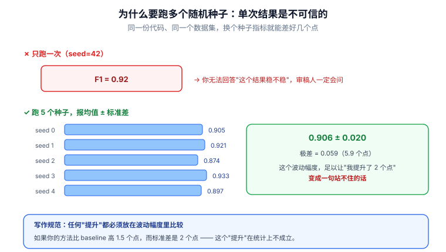

# 📘 第 8 周 · 实验设计与论文写作

> **本周目标**：跑出主实验，并**同步开始写论文**（不要等实验全做完才动笔）。学完你应该能做到：写出一份自洽的威胁模型，能回答"攻击者能做什么"；用至少 3 个 baseline 做公平对比并报均值±标准差；补上对抗鲁棒性实验；写完 Abstract、Method、Intro 与 Experiments 四个章节。
>
> **本周知识清单**：E 域 9 条（E3 + E4）+ F 域 4 条（融入每天末尾的 ✅ 知识自查）
>
> **使用方式**：在 Typora 中按标题折叠展开，每天读对应的小节即可。

[[深度学习学习总目录|← 返回总目录]]

---

## Day 50 —— 确立威胁模型：攻击者能力边界

> **一句话**：威胁模型是安全类论文的**第一块地基** —— 说不清"攻击者能做什么"，后面所有实验都没有意义，因为你不知道自己在防什么。

### 一、威胁模型要回答的四个问题

任何威胁模型都绕不开这四问，缺一个都会被审稿人抓住：

| 问题 | 对应要素 | 写不清的后果 |
|---|---|---|
| **攻击者想干什么？** | 攻击目标 | 不知道要优化什么指标 |
| **攻击者能做什么？** | 攻击能力 | 实验设置没有边界 |
| **攻击者知道什么？** | 知识假设（白/黑/灰盒） | 结论适用范围不明 |
| **攻击者受什么限制？** | 攻击预算 + 物理约束 | 攻击强度不可控，无法比较 |

### 二、攻击者能力边界：两个必须量化的维度

> **能改多少量测？能改哪些位置？**

| 维度 | 说法 | 具体化 |
|---|---|---|
| **广度** | 能改多少 | 最大篡改比例 X%（如 5% 的量测点） |
| **深度** | 能改多少 | 单点最大篡改幅度 ε（如相对真值 ±10%） |
| **位置** | 能改哪些 | 指定节点集合 / 任意节点 / 仅边缘节点 |
| **时间** | 什么时候改 | 持续注入 / 单次注入 / 周期性注入 |

**为什么必须量化**：如果不限定"最多改 5%"，那么攻击者可以改掉全部量测 —— 任何检测器都会失效。**没有边界的攻击者，等于没有威胁模型。**

### 三、白盒 / 黑盒 / 灰盒

| 类型 | 攻击者知道什么 | 现实对应 | 论文里的位置 |
|---|---|---|---|
| **白盒** | 完全知道模型参数与结构 | 内部人员 / 模型被泄漏 | 上界分析，最容易被审稿人要求 |
| **黑盒** | 只能查询模型的输入输出 | 外部攻击者，通过接口探测 | 最贴近现实，说服力最强 |
| **灰盒** | 知道部分信息（如模型类型但不知参数） | 知道用了 LSTM，不知具体权重 | 折中，最常用 |

**写法建议**：**主实验用灰盒或黑盒（现实），同时报告白盒结果作为性能上界**。这样审稿人问"如果攻击者知道你的模型呢"，你已经有答案了。

> **白盒不是"不现实所以不用做"，而是"最强的攻击者都打不垮我，那弱攻击者更打不垮"。** 它是你方法鲁棒性的天花板证明。

### 四、攻击目标的两类

| 目标 | 攻击方式 | 对检测器的影响 |
|---|---|---|
| **完整性攻击** | 让检测器**漏报**（把攻击样本判为正常） | 召回率下降 → 攻击得逞 |
| **可用性攻击** | 让检测器**狂误报**（把正常判为异常） | 误报率上升 → 运维瘫痪，被迫关闭检测器 |

**两类都要评估**。很多论文只测了完整性攻击，审稿人一句"攻击者也可以通过制造大量误报来让你的系统不可用"就能要求你补实验。

### 五、攻击预算与物理约束

**电力场景的特殊性在于：攻击者不能随便改量测。** 篡改后的量测必须**满足潮流方程**，否则会被最基础的坏数据检测（Bad Data Detection）抓住：

```
篡改后的量测必须满足：|Δm - H·Δx| < τ
```

| 符号 | 含义 |
|---|---|
| `Δm` | 攻击者注入的量测偏差向量 |
| `H` | 量测雅可比矩阵（描述状态如何映射到量测） |
| `Δx` | 对应的状态偏差 |
| `τ` | 坏数据检测阈值 |

**这就是 FDI（False Data Injection）攻击的数学本质**：构造一个 `Δm = H·Δx`，使得残差 `r = z - H·x̂` 几乎不变，从而绕过传统检测。**你的检测器要能抓住的，正是这类"物理上自洽"的攻击。**

### 六、威胁模型模板（照着填）

```
【攻击者目标】
  - 类型：完整性攻击（使检测器漏报）/ 可用性攻击（使检测器大量误报）
  - 具体目标：使目标线路的负荷被错误估计 / 使指定节点的异常被漏检

【攻击者能力】
  - 可篡改的节点集合：{...}
  - 最大篡改比例：X%
  - 单点最大篡改幅度：ε
  - 是否知道 H 矩阵：是 / 否
  - 是否知道检测模型：白盒 / 黑盒 / 灰盒

【物理约束】
  - 篡改后的量测必须满足：|Δm - H·Δx| < τ
  - 是否考虑量测噪声：是（σ = ...）/ 否

【攻击预算】
  - 单次最多改 K 个量测点
  - 攻击持续时长 / 注入频率：...

【攻击者知识假设的合理性论证】
  - 为什么这个假设在现实场景中成立？（一句话说明）
```

> **说不清威胁模型 = 论文直接挂。**
> 审稿人第一个问题一定是"你的攻击者能做什么"。
> **写不清这一栏，后面所有实验都没意义 —— 因为你不知道在防什么。**

### 七、和电网安全的关系

电网场景的威胁模型有一个**别的领域没有的优势**：物理约束给了你一个天然的攻击预算上限。

| 场景 | 攻击者现实能力 | 威胁模型该怎么写 |
|---|---|---|
| 篡改 RTU 量测 | 通常只能控制少量 RTU | 限制篡改比例 ≤ 5%，指定节点集合 |
| 中间人攻击通信链路 | 能改报文但不改变物理量 | 攻击后量测可能违反潮流方程 → 必须约束 |
| 内部人员注入 | 知道拓扑与参数（`H` 矩阵） | 白盒 + 知道 H 矩阵，最强设定 |
| 恶意软件长期潜伏 | 可缓慢持续注入 | 时间维度上限定注入频率 |

**另外，电力场景的攻击目标天然明确**：让某条线路的过载保护不动作、让状态估计给出错误结果。**这种"目标明确"的攻击比通用对抗攻击更好写论文** —— 你的评估指标可以非常具体。

### 🔍 延伸思考

1. 如果攻击者知道你的检测模型，你的方法还成立吗？（提示：这就是"自适应攻击"，最强的评估设置，也是最容易被审稿人要求补的实验）
2. 如果攻击者完全遵守物理约束（`Δm = H·Δx`），那你的检测器还能靠什么区分正常量测和攻击量测？

### 📚 参考

- NIST SP 800-82 Rev.3（工控系统安全指南，威胁建模章节）
- Adversarial Sample Generation for Anomaly Detection in ICS（**重点看它的威胁模型怎么写的**）

### 🎬 视频讲解

> 以下为**关键词检索式**推荐（平台搜索结果，非固定视频链接，避免失效）。
> 直接复制关键词到对应平台搜索即可，也可在结果里挑播放量高的看。

| 平台 | 推荐搜索关键词 | 说明 |
|---|---|---|
| **B站** | [威胁模型 怎么写 论文](https://search.bilibili.com/all?keyword=威胁模型+怎么写+论文) | 安全论文威胁模型的写法 |
| **B站** | [对抗攻击 白盒 黑盒 区别](https://search.bilibili.com/all?keyword=对抗攻击+白盒+黑盒+区别) | 三种知识假设的差异 |
| **B站** | [安全论文 威胁模型 案例](https://search.bilibili.com/all?keyword=安全论文+威胁模型+案例) | 看真实论文怎么组织这一节 |
| **抖音** | [威胁模型 是什么](https://www.douyin.com/search/威胁模型+是什么) | 一分钟建立概念 |

### ✅ 知识自查

- [ ] 🟢 **概念** 攻击者能力边界：**能改多少量测？能改哪些位置？**
- [ ] 🟢 **概念** **白盒**：攻击者完全知道模型参数与结构
- [ ] 🟢 **概念** **黑盒**：只能查询模型输入输出
- [ ] 🟢 **概念** **灰盒**：知道部分信息（如模型类型但不知参数）
- [ ] 🟢 **概念** 电力场景的物理约束：攻击者改的量测必须满足潮流方程
- [ ] 🟢 **概念** 攻击目标分类：**完整性攻击**（让它漏报）vs **可用性攻击**（让它狂误报）
- [ ] 🟢 **概念** 攻击预算：改动量测的比例上限、幅度上限
- [ ] 🟡 **概念** 攻击者是否知道检测器在做检测（自适应攻击）

---

## Day 51 —— 建立基线对比：公平对比三要素

> **一句话**：审稿人最先看的不是你的方法，是**你的 baseline 够不够强** —— baseline 弱，再好的方法也会被拒。

### 一、baseline 怎么选：两条腿走路

**传统方法 + 深度学习方法各选几个**，缺一条腿都会被质疑：

| 类别 | 候选方法 | 为什么要有 |
|---|---|---|
| **传统方法** | 残差阈值法（卡方检验 BDD）、SVM、随机森林 | 证明"不用深度模型也行的场景我更好" |
| **深度方法** | MLP、LSTM-AE、1D-CNN、Transformer | 证明"同类方法里我最好" |

**为什么传统 baseline 必须有**：审稿人一定会问"为什么不用更简单的方法？"。如果你连残差阈值法都没比，这个问题你答不上来。**而且在工业场景里，简单方法的性价比往往很高** —— 你必须证明自己的方法值得那个复杂度。

### 二、公平对比三要素

| 要素 | 含义 | 违反的后果 |
|---|---|---|
| **相同数据划分** | 所有方法用同一份 train/val/test | 指标不可比，结论无效 |
| **相同评价指标** | 用同一套指标定义与实现 | 数字对不上，被质疑 |
| **相同调参预算** | 每个方法都认真调过参 | 被质疑"你的方法调了，别人的没调" |

> **第三条最容易被忽略，也最致命。**
> 你给自己的方法调了两周超参，baseline 用默认参数跑一遍 —— 这不是对比，这是自欺欺人。
> **正确做法：每个方法都做相同的网格搜索，或都用一个统一的自动调参预算。**

### 三、用同一份代码框架跑所有 baseline

这是保证公平性最实用的技巧：

```
framework/
├── data/          # 数据加载：所有方法共用
├── models/
│   ├── threshold.py    # 残差阈值法
│   ├── svm.py
│   ├── mlp.py
│   ├── lstm_ae.py
│   └── ours.py         # 你的方法
├── trainer.py     # 训练循环：所有方法共用
└── evaluate.py    # 评估指标：所有方法共用
```

**好处**：数据划分、预处理、指标实现、训练轮数全部自动一致 —— **实现差异带来的不公平被结构性消除**。这也让"参数量/推理时延"的对比变得可信。

### 四、基线对比表模板

| 方法 | Precision | Recall | F1 | PR-AUC | 参数量 | 推理时延(ms) |
|---|---|---|---|---|---|---|
| 残差阈值法 | | | | | — | |
| SVM | | | | | | |
| MLP | | | | | | |
| LSTM-AE | | | | | | |
| **本文方法** | | | | | | |

**为什么必须比推理时间**：工业场景对实时性有硬要求。电力系统的量测采样周期可能是毫秒到秒级，一个准确率高但推理要 500 ms 的模型，**在变电站边缘设备上根本用不了**。报出推理时延，等于告诉审稿人"我的方法能落地"。

> **最常被拒的原因：baseline 太弱。**
> 挑一个好几年前的弱方法当 baseline，审稿人一眼就看出来。
> **要挑近两年 SOTA，或至少是同一任务下的主流方法。**

### 五、和电网安全的关系

电网异常检测的 baseline 选择有很强的领域特征，建议这样配：

| 层次 | baseline | 为什么是它 |
|---|---|---|
| **物理层** | 残差阈值法（卡方检验 / LNR 检验） | 电力系统运行了几十年的标准做法，不比它等于没说 |
| **传统 ML 层** | SVM / 随机森林 / 孤立森林 | 工业界实际在用的方法 |
| **深度层** | LSTM-AE / 1D-CNN / Transformer | 近两年论文的主流方法 |

**特别注意**：残差阈值法虽然简单，但它是**专门针对 FDI 攻击设计**的（FDI 攻击的原始论文就是通过绕过它来定义攻击的）。**如果你的方法打不过残差阈值法，那你的方法在电力场景里没有存在意义。** 这是电力方向比通用异常检测更难的地方 —— 你的对手不是随机森林，是几十年的领域积累。

### 🔍 延伸思考

1. 如果只是指标高一点，审稿人会买账吗？还需要什么证据？（提示：鲁棒性、可解释性、效率、跨数据集泛化）
2. 你的方法比 LSTM-AE 高 2 个点，但参数量是它的 10 倍、推理慢 5 倍 —— 这个"提升"值得吗？你会怎么在论文里论证？

### 📚 参考

- Comparison of Deep Learning algorithms for FDIA site detection（开放获取，**直接参考它的 baseline 设置**）
- 目标期刊近两年的同类论文（看它们都比了谁）

### 🎬 视频讲解

> 以下为**关键词检索式**推荐（平台搜索结果，非固定视频链接，避免失效）。
> 直接复制关键词到对应平台搜索即可，也可在结果里挑播放量高的看。

| 平台 | 推荐搜索关键词 | 说明 |
|---|---|---|
| **B站** | [论文 baseline 怎么选](https://search.bilibili.com/all?keyword=论文+baseline+怎么选) | baseline 选择的判断标准 |
| **B站** | [实验对比 公平性 论文](https://search.bilibili.com/all?keyword=实验对比+公平性+论文) | 怎么保证对比公平 |
| **B站** | [异常检测 常用方法 对比](https://search.bilibili.com/all?keyword=异常检测+常用方法+对比) | 熟悉常见 baseline 家族 |
| **抖音** | [baseline 是什么 论文](https://www.douyin.com/search/baseline+是什么+论文) | 一分钟建立概念 |

### ✅ 知识自查

- [ ] 🟢 **概念** baseline 的选择：传统方法 + 深度学习方法各选
- [ ] 🟢 **实践** 传统 baseline 候选：SVM / 随机森林 / 残差阈值法
- [ ] 🟢 **实践** 深度 baseline 候选：MLP / LSTM-AE / 1D-CNN
- [ ] 🟢 **概念** **公平对比三要素**：相同数据划分 + 相同指标 + 相同调参预算
- [ ] 🟢 **实践** 表格化：方法 / 指标 / 参数量 / 推理时间
- [ ] 🟢 **概念** 为什么必须比推理时间（工业场景对实时性有硬要求）
- [ ] 🟡 **实践** 用同一份代码框架跑所有 baseline（避免实现差异）

---

## Day 52 —— 跑主实验：多种子与均值±标准差

> **一句话**：单次实验的数字**不是结果，是抽样**。论文里报的必须是**多种子的均值 ± 标准差** —— 这既是统计规范，也是学术诚信的底线。

### 一、为什么要多种子

深度学习训练充满了随机性，来源至少有四处：

| 随机源 | 具体是什么 |
|---|---|
| 权重初始化 | 初始参数是随机采样的 |
| 数据顺序 | DataLoader 的 shuffle |
| Dropout | 训练时随机丢弃神经元 |
| 数据划分 | 随机切分时每次不同（如果是随机切分） |

**单次实验的指标，只是这个随机分布里的一个采样点。** 报单次结果，等于用一次抽样代表整个分布。

### 二、固定随机种子

```python
import random, numpy as np, torch

def set_seed(seed: int):
    random.seed(seed)
    np.random.seed(seed)
    torch.manual_seed(seed)
    torch.cuda.manual_seed_all(seed)
    # 下面两行让 cudnn 使用确定性算法（速度会略降，但结果可复现）
    torch.backends.cudnn.deterministic = True
    torch.backends.cudnn.benchmark = False

for seed in [42, 0, 123]:
    set_seed(seed)
    f1 = run_experiment()
    print(f"seed={seed}, F1={f1:.4f}")
```

**注意**：固定种子是为了**让实验可复现**，不是为了让结果好看。**换了种子就报不同的数，说明模型不稳定，这本身是需要解决的问题。**

### 三、至少 3 个种子，报均值±标准差

```
本文方法：F1 = 0.923 ± 0.008  (3 个种子)
基线方法：F1 = 0.887 ± 0.015  (3 个种子)
```

**这两个数字的信息量远超单次结果**：

| 对比 | 单次结果能看出 | 均值±标准差能看出 |
|---|---|---|
| 谁更强 | ✅ | ✅ |
| 差距是否稳定 | ❌ | ✅（0.923-0.887 = 0.036 远大于两者的标准差） |
| 谁更稳定 | ❌ | ✅（0.008 < 0.015，你的方法更稳） |

> **报告均值±标准差反而更有说服力**：它说明你的方法**稳定**。工业场景里，一个 0.92±0.03 的方法可能不如一个 0.90±0.002 的方法好用 —— 因为后者可预测。



> **看图说话**：上图把“为什么要跑多个种子”画得很直白。**上半部分**：只跑一次得到 `F1 = 0.92`，你无法回答“这个结果稳不稳”—— 而审稿人一定会问。**下半部分**：跑 5 个种子，得到 `0.906 ± 0.020`。要注意绿框里的**极差 0.059（5.9 个点）**：同一份代码、同一个数据集，只换随机种子就能差出近 6 个点。在这个噪声水平下，一句“我的方法比 baseline 高 1.5 个点”**在统计上根本不成立**。所以这条规范值得抄在实验记录本扉页上：**任何“提升”都必须放在波动幅度里比较**。代价只是多跑几次；但如果审稿人先发现这个问题，返工的就是整篇论文。


### 四、学术诚信红线

> **这条红线不能碰：**
> 1. **只报最好的那一次**（挑种子）
> 2. **在测试集上调参**（用测试集选超参 = 测试集泄漏）

这两件事一被发现，**学术生涯就结束了**。而且同行复现不出来，迟早会暴露 —— 论文发出去之后被撤稿的案例，大多属于这一类。

**正确做法**：

| 环节 | 用什么数据 |
|---|---|
| 训练 | 训练集 |
| 选超参、早停 | **验证集** |
| 最终报告 | **测试集**（只跑一次，或固定 3 个种子） |

**保存所有原始日志和种子** —— 这是可复现的底线。审稿人要求提供代码和日志时，你能直接给出来。

### 五、怎么展示结果分布

| 方式 | 适用 | 优点 |
|---|---|---|
| **表格**（均值±标准差） | 主结果 | 紧凑，便于比较 |
| **箱线图** | 种子间分布 | 一眼看出离散程度和异常值 |
| **折线图 + 误差带** | 随超参/数据量变化 | 展示趋势与不确定性 |

```python
import numpy as np
scores = np.array([0.915, 0.923, 0.931])   # 3 个种子
print(f"{scores.mean():.3f} ± {scores.std(ddof=1):.3f}")
```

> **小细节**：用 `ddof=1`（样本标准差）而不是默认的 `ddof=0`（总体标准差）。样本量小的时候，前者更严谨。

### 六、和电网安全的关系

多种子实验在电力场景里有一个额外的现实意义：**运维人员不会接受一个"时好时坏"的检测器。**

| 场景 | 对稳定性的要求 |
|---|---|
| 变电站在线监测 | 每次更新模型后的表现必须可预测，否则运维不敢用 |
| 调度辅助决策 | 方差大意味着误报率不可控，可能触发不必要的调度动作 |
| 长期部署 | 方差大说明对初始条件敏感，换一个季节的数据可能就失效 |

**方差大说明什么？** 可能是超参太敏感、可能是数据里有难以学习的样本、可能是模型容量与数据量不匹配。**这本身就是一个要改进的点，可以写进论文的"局限与未来工作"。**

### 🔍 延伸思考

1. 方差大说明什么？会不会是超参太敏感？（提示：方差大 = 方法不稳定，工业落地不敢用，这本身也是要改进的点）
2. 如果 3 个种子的标准差是 0.000（完全一样），你会觉得是好事还是有问题？（提示：是不是哪里被意外固定了？）

### 📚 参考

- PyTorch 官方文档：Reproducibility
- 目标期刊近两年论文的"Implementation Details"小节（看别人怎么报结果）

### 🎬 视频讲解

> 以下为**关键词检索式**推荐（平台搜索结果，非固定视频链接，避免失效）。
> 直接复制关键词到对应平台搜索即可，也可在结果里挑播放量高的看。

| 平台 | 推荐搜索关键词 | 说明 |
|---|---|---|
| **B站** | [随机种子 固定 复现 深度学习](https://search.bilibili.com/all?keyword=随机种子+固定+复现+深度学习) | 四个 seed 一次讲清 |
| **B站** | [多种子实验 均值 标准差](https://search.bilibili.com/all?keyword=多种子实验+均值+标准差) | 结果该怎么报 |
| **B站** | [论文 实验结果 表格 规范](https://search.bilibili.com/all?keyword=论文+实验结果+表格+规范) | 表格与箱线图怎么画 |
| **抖音** | [论文 实验 标准差 怎么算](https://www.douyin.com/search/论文+实验+标准差+怎么算) | 快速看计算方法 |

### ✅ 知识自查

- [ ] 🟢 **实践** 固定随机种子并记录：`torch.manual_seed` / `np.random.seed` / `random.seed`
- [ ] 🟢 **实践** 多种子重复至少 3 次
- [ ] 🟢 **规范** 报告 **均值 ± 标准差**，不是单次最优
- [ ] 🟢 **诚信** **不要只报最好的那一次** —— 这是学术诚信问题
- [ ] 🟢 **实践** 保存所有原始日志和种子（可复现的底线）
- [ ] 🟡 **实践** 用表格或箱线图展示结果分布

---

## Day 53 —— 补充实验：对抗鲁棒性与可解释性

> **一句话**：主实验证明"我更好"，补充实验证明"我在恶劣条件下依然好"。对安全类论文来说，**对抗鲁棒性不是加分项，是必答题**。

### 一、优先做的四类补充实验

| 优先级 | 实验 | 为什么 |
|---|---|---|
| 高 | **对抗鲁棒性** | 安全类论文的**必答题** |
| 高 | **超参敏感性** | 证明方法不是"调出来的" |
| 中 | **可解释性** | 加分项，工业场景很看重 |
| 中 | **数据效率** | 证明小样本可用，工业场景刚需 |

> **安全类论文的必答题**：
> **任何"AI + 安全"的论文，审稿人都会问：如果攻击者针对你的检测器做对抗攻击，会怎样？**
> 这一天不补这个实验，W9 提交后大概率被要求补 —— 那时候再回来做，代价大得多。

### 二、对抗鲁棒性：FGSM 与 PGD

**对抗攻击的本质**：给输入加一个肉眼不可察觉的小扰动，让模型判断出错。

```python
# FGSM：一步攻击，沿梯度符号方向走一大步
x_adv = x + eps * x_adv.grad.sign()

# PGD：多步迭代攻击，每步走小一点，走完投影回 eps 球内
for _ in range(steps):
    x_adv = x_adv + alpha * x_adv.grad.sign()
    x_adv = torch.clamp(x_adv, x - eps, x + eps)
```

| 方法 | 强度 | 用途 |
|---|---|---|
| **FGSM** | 弱（单步） | 快速评估，看最低门槛 |
| **PGD** | 强（多步迭代） | 标准评估，通常作为主报告 |

**评估方式**：固定攻击强度 ε，从 0 逐渐增大，画一条"性能 vs 攻击强度"的曲线：

| ε | 0（无攻击） | 0.01 | 0.05 | 0.1 | 0.2 |
|---|---|---|---|---|---|
| 本文方法 F1 | | | | | |
| baseline F1 | | | | | |

**关键**：不要只报"我的方法在 ε=0.1 下 F1 还有 0.85"，要**和 baseline 同条件对比**。**鲁棒性的相对优势才是你的贡献。**

### 三、对抗训练：让模型自己变强

如果时间允许，做一组对抗训练对比：

```
标准训练：只在干净样本上训练
对抗训练：训练时混入对抗样本（通常是 PGD 生成的）
```

| 模型 | 干净数据 F1 | 攻击下 F1 | 训练成本 |
|---|---|---|---|
| 标准训练 | 高 | 低 | 1× |
| **对抗训练** | 略低 | **高** | 3-10× |

**注意这个 trade-off**：对抗训练通常会让干净数据上的性能略微下降，换来攻击下的鲁棒性。**这个 trade-off 本身就是论文里值得讨论的一段。**

### 四、可解释性

| 方法 | 适用 | 怎么做 |
|---|---|---|
| 注意力热图 | 用了注意力的模型 | 画注意力权重，看模型关注哪些时间步/特征 |
| 特征重要性 | 任意模型 | Permutation importance / SHAP |
| 重构误差可视化 | 自编码器类 | 画每个时间步的重构误差，看异常定位在哪 |

**可解释性在电力场景的价值特别高**：运维人员不会信任一个说不出理由的告警。如果模型能指出"第 37-42 个时间步的 A 相电流异常"，运维才能去核查对应设备。

### 五、超参敏感性与数据效率

| 实验 | 做法 | 想证明 |
|---|---|---|
| **超参敏感性** | 只调一个关键超参（如 λ），画性能曲线 | 方法在一个区间内都表现好 → 不是"调出来的" |
| **数据效率** | 训练集从 10% 递增到 100% | 少量数据就有效 → 工业场景数据稀缺时可用 |

**超参敏感性曲线的理想形态是"平台"而不是"尖峰"**：如果性能只在某一个特定值上最好，说明方法很脆弱。

### 六、和电网安全的关系

在电力场景里，对抗鲁棒性实验要做一层**领域特化** —— 不能直接套用图像领域的 `ε` 扰动：

| 通用做法 | 电力场景该怎么做 |
|---|---|
| 对输入加 `ε` 扰动 | 扰动必须满足物理约束 `\|Δm - H·Δx\| < τ`，否则会被 BDD 抓走 |
| 攻击目标是让分类错误 | 攻击目标是让**特定线路**的异常被漏检（目标攻击） |
| 随机加噪 | 加的是**符合量测噪声分布**的噪声（不是高斯白噪） |

**这样做的价值**：你的鲁棒性实验就变成了"在**物理上可行的攻击**下的鲁棒性"，而不是"在任意扰动下的鲁棒性"。**后者审稿人会说"不现实"，前者才是真正的威胁。**

### 🔍 延伸思考

1. 哪一张图最能让审稿人信服你的方法有效？（提示：想想如果你只放一张图，放哪张？）
2. 对抗训练让干净数据的性能掉了 2 个点、攻击下提升了 15 个点 —— 这个交换在电网场景里划算吗？你会怎么论证？

### 📚 参考

- Explaining and Harnessing Adversarial Examples（FGSM 原论文）
- Towards Deep Learning Models Resistant to Adversarial Attacks（PGD 原论文）

### 🎬 视频讲解

> 以下为**关键词检索式**推荐（平台搜索结果，非固定视频链接，避免失效）。
> 直接复制关键词到对应平台搜索即可，也可在结果里挑播放量高的看。

| 平台 | 推荐搜索关键词 | 说明 |
|---|---|---|
| **B站** | [对抗鲁棒性 评估 方法](https://search.bilibili.com/all?keyword=对抗鲁棒性+评估+方法) | 怎么设计鲁棒性实验 |
| **B站** | [对抗训练 原理 FGSM PGD](https://search.bilibili.com/all?keyword=对抗训练+原理+FGSM+PGD) | 两种攻击的实现差异 |
| **B站** | [注意力可视化 可解释性](https://search.bilibili.com/all?keyword=注意力可视化+可解释性) | 画热图的实操 |
| **抖音** | [对抗样本 一分钟 讲懂](https://www.douyin.com/search/对抗样本+一分钟+讲懂) | 快速建立直觉 |

### ✅ 知识自查

- [ ] 🟢 **实践** 超参数敏感性分析：调关键超参，看性能曲线
- [ ] 🟢 **实践** 数据效率实验：训练集从 10% 到 100%，看性能增长
- [ ] 🟢 **实践** 鲁棒性测试：加噪声 / 攻击强度递增
- [ ] 🟢 **实践** 对抗鲁棒性：在 FGSM/PGD 攻击下的性能
- [ ] 🟢 **实践** 可解释性可视化（如果用了注意力，画注意力热图）
- [ ] 🟡 **实践** 消融实验的完整版（W7 已做初步）
- [ ] 🟡 **概念** 哪一张图最能说服审稿人

---

## Day 54 —— 论文结构与摘要：Abstract 四句话套路

> **一句话**：Abstract 不是"摘要"，是**全文的广告** —— 用四句话让审稿人在 30 秒内决定要不要继续读。

### 一、论文的六大章节

| 章节 | 回答什么问题 | 篇幅占比 |
|---|---|---|
| **Abstract** | 这篇论文做了什么、结果如何 | — |
| **Introduction** | 为什么要做、贡献是什么 | 15% |
| **Related Work** | 别人做到哪一步了 | 12% |
| **Method** | 你怎么做的 | 28% |
| **Experiments** | 证明你做得更好 | 30% |
| **Conclusion** | 总结与未来工作 | 5% |

**各章节篇幅参考（8 页论文）**：

| 章节 | 占比 | 页数 |
|---|---|---|
| Abstract | — | 0.2 |
| Introduction | 15% | 1.2 |
| Related Work | 12% | 1.0 |
| Method | 28% | 2.2 |
| Experiments | 30% | 2.4 |
| Conclusion | 5% | 0.4 |
| References | — | 1.8 |

> **注意 Method + Experiments 占了将近 60%** —— 这是论文的主体。很多人 Intro 写得很华丽，Method 只有一页，审稿人会觉得"没东西"。

### 二、Abstract 四句话套路

```
第 1 句：问题背景与重要性
   → 电力系统状态估计对 FDI 攻击的检测能力不足，可能导致设备过载与连锁故障。

第 2 句：已有方法的不足
   → 现有深度学习方法主要依赖统计离群性，而 FDI 攻击通过满足潮流方程
     保持残差不变，导致这类方法在隐蔽攻击上漏报率高达 XX%。

第 3 句：本文提出的方法
   → 本文提出 XXX 方法，将潮流方程残差显式引入损失函数，迫使模型学习
     物理不一致性而非统计离群性。

第 4 句：主要结果（带具体数字）
   → 在 IEEE 14 / 39 节点系统上的实验表明，本方法在隐蔽攻击场景下
     F1 达到 0.923 ± 0.008，相比最优 baseline 提升 11.2%，
     且推理时延仅 3.2 ms。
```

**每一句都不可省：**

| 句子 | 缺了会怎样 |
|---|---|
| 第 1 句 | 读者不知道这个问题重不重要 |
| 第 2 句 | 读者不知道你为什么要做（gap 不明） |
| 第 3 句 | 读者不知道你做了什么 |
| 第 4 句 | 读者不知道你做得好不好 |

**第 4 句必须有数字。** "实验表明本方法有效"是废话；"F1 达到 0.923，相比最优 baseline 提升 11.2%"才是信息。

### 三、Abstract 的长度与写法规范

| 项 | 规范 |
|---|---|
| 长度 | **150-250 词**（中文 300-400 字） |
| 时态 | 方法用**现在时**，实验结果用**过去时** |
| 语态 | 英文多用被动，中文多用主动 |
| 缩写 | 首次出现给全称（FDI = False Data Injection） |
| 引用 | **不引文献、不放公式、不放图表编号** |

> **Abstract 为什么先写**：因为它强迫你**用四句话把整个工作讲清楚**。
> 写不出来，说明你还没想清自己的贡献是什么。
> 而且它后面会被改很多遍，**先写不亏**。

### 四、Abstract 写完要做的三件事

1. **数词数** —— 超了 250 词就砍，砍掉的通常都是第 1 句的宏观铺垫。
2. **检查第 4 句有没有数字** —— 没有数字就回去补。
3. **给不懂你方向的同学看一遍** —— 如果他读完能说出"你做了什么"，Abstract 就合格了。

### 五、和电网安全的关系

电网安全论文的 Abstract 有一个特点：**问题背景可以用真实事件来增强说服力**。

| 写法 | 效果 |
|---|---|
| "电力系统面临网络攻击威胁" | 空泛，任何人都能写 |
| "2015 年乌克兰电网事件中，攻击者通过篡改量测使调度员失去态势感知" | 具体、有冲击力 |

**但注意**：事件描述要**准确**，不要凭印象写。引用真实事件时必须有文献支撑 —— **编造或夸大数据是学术不端**。

另外，电力方向的审稿人特别关心**实际部署可行性**，所以 Abstract 的第 4 句除了准确率，建议补一句推理时延或参数量 —— 这会显著提升"可落地"的印象。

### 🔍 延伸思考

1. 用一句话说出你的贡献，说不清就是还没想清。你现在能说出来吗？
2. 如果审稿人只读你的 Abstract 就决定拒稿，你觉得最可能的原因是什么？（提示：是不是第 2 句的 gap 不够有说服力？）

### 📚 参考

- 目标期刊近两年的高被引论文（拆解它们的 Abstract 结构）
- Detection of FDIA on Power System（看 Introduction 怎么讲故事）

### 🎬 视频讲解

> 以下为**关键词检索式**推荐（平台搜索结果，非固定视频链接，避免失效）。
> 直接复制关键词到对应平台搜索即可，也可在结果里挑播放量高的看。

| 平台 | 推荐搜索关键词 | 说明 |
|---|---|---|
| **B站** | [论文摘要 怎么写 套路](https://search.bilibili.com/all?keyword=论文摘要+怎么写+套路) | Abstract 的四句话结构 |
| **B站** | [Abstract 写作 技巧 英文](https://search.bilibili.com/all?keyword=Abstract+写作+技巧+英文) | 英文摘要的时态与语态 |
| **B站** | [学术写作 入门 研究生](https://search.bilibili.com/all?keyword=学术写作+入门+研究生) | 从零开始学论文写作 |
| **抖音** | [论文摘要 四句话](https://www.douyin.com/search/论文摘要+四句话) | 一分钟记住套路 |

### ✅ 知识自查

- [ ] 🟢 **结构** 六大章节：Abstract / Intro / Related Work / Method / Experiments / Conclusion
- [ ] 🟢 **写法** Abstract 四句话套路：问题背景与重要性 → 已有方法的不足 → 本文提出的方法 → 主要结果（**带具体数字**）
- [ ] 🟢 **写法** Abstract 长度：150-250 词
- [ ] 🟢 **写法** 每个章节大致篇幅占比
- [ ] 🟡 **写法** 时态规范：方法用现在时，实验用过去时
- [ ] 🟡 **写法** 语态：多用被动（英文）/ 主动（中文）

---

## Day 55 —— Method 章节：画好方法总图

> **一句话**：Method 章节是**用文字复述一张图** —— 所以先画图，再写文字。图画不好，这一章一定写不好。

### 一、方法总图：论文最重要的一张图

**审稿人的阅读顺序是：标题 → Abstract → 图 → 正文。** 方法总图往往是决定他"继续读还是放下"的关键。

**一张好图的四个标准**：

| 标准 | 具体做法 |
|---|---|
| **不看正文能懂个大概** | 层级清晰、箭头明确、数据流向一致 |
| **模块名称与正文一致** | 图里叫 A，正文不能叫 B（这是最常见的低级错误） |
| **标注张量形状** | 尤其是形状变换的关键处，如 `[B, T, F] → [B, H]` |
| **突出创新点** | 你的新模块用不同颜色/边框/底纹 |

**图里必须包含的要素**：输入 → 各模块 → 数据流方向 → 输出。

### 二、按图讲解：每个模块对应一段文字

Method 章节的组织方式就是**跟着图走**：

```
3.1 问题定义        ← 符号定义、问题形式化
3.2 整体框架        ← 放方法总图，用一段话概括数据流
3.3 模块 A          ← 对应图中第一个模块
3.4 模块 B          ← 对应图中第二个模块
3.5 训练目标        ← 损失函数（含每一项的物理含义）
3.6 复杂度分析      ← 时间/空间复杂度
```

**每个小节只讲一件事，且必须能在图上找到对应位置。** 如果某个小节在图上找不到，说明图缺了一块。

### 三、公式与符号规范

> **公式要么给完整的，要么不给，不要给一半。**

| 规范 | 说明 |
|---|---|
| **公式完整** | 别写"其中 f 是某个非线性函数"就完事，要给出 f 的具体形式 |
| **符号表** | 所有符号首次出现时给定义；符号多时单独列一张符号表 |
| **公式编号** | 每个独立公式编号，正文中引用（"由式 (3) 可得"） |
| **维度说明** | 关键公式后面标注每个符号的维度 |

```latex
% 前向传播：给出完整形式
h = \sigma(W_1 x + b_1)          % h ∈ R^d
z = W_2 h + b_2                  % z ∈ R^C

% 训练目标：每一项都要说清含义
L = L_{rec} + \lambda L_{phy} + \mu \|W\|_2^2
```

**特别提醒**：损失函数里的每一个权重系数（λ、μ），都要说明它怎么选的（网格搜索？经验值？）。**审稿人一定会问。**

### 四、复杂度分析

| 指标 | 怎么写 |
|---|---|
| **时间复杂度** | 前向传播的复杂度（与序列长度、特征维度、层数的关系） |
| **空间复杂度** | 参数量、显存占用 |
| **推理时延** | 实测值（ms），标注硬件 |

**为什么要写**：工业场景的落地评估就靠这一节。而且如果你的方法参数量比 baseline 小、效果还更好，**这是一个很有力的卖点，不写就浪费了**。

### 五、和电网安全的关系

电力场景的 Method 章节里，**物理约束必须作为一等公民写清楚**，不能塞在附录里：

| 要素 | 怎么写 | 为什么 |
|---|---|---|
| **物理模型** | 给出 `z = H·x + e` 的完整定义与符号含义 | 不懂电力的审稿人需要它 |
| **约束如何进入模型** | 是加在损失函数里、还是作为网络的一层、还是后处理 | 决定你的创新点是否清晰 |
| **约束的松弛处理** | 硬约束 vs 软约束（惩罚项） | 真实系统有噪声，硬约束不成立 |

**一个建议**：如果你的方法涉及物理约束，在方法总图里**专门画一个"物理约束模块"**，并用不同颜色标出来。**这张图就是审稿人记住你论文的地方。**

### 🔍 延伸思考

1. 一个不了解你工作的同行，能只看方法图就懂大概吗？现在就找个人试一下。
2. 你的方法总图里，哪一个模块是可以被替换掉的？如果替换后效果不变，你的贡献还成立吗？

### 📚 参考

- FDI Detection With Multi-Scale Feature Fusion（看 Method 章节怎么组织）
- 李沐《动手学深度学习》第 7 章（现代网络结构的描述方式）

### 🎬 视频讲解

> 以下为**关键词检索式**推荐（平台搜索结果，非固定视频链接，避免失效）。
> 直接复制关键词到对应平台搜索即可，也可在结果里挑播放量高的看。

| 平台 | 推荐搜索关键词 | 说明 |
|---|---|---|
| **B站** | [论文 方法 章节 怎么写](https://search.bilibili.com/all?keyword=论文+方法+章节+怎么写) | Method 的组织逻辑 |
| **B站** | [论文 框架图 怎么画](https://search.bilibili.com/all?keyword=论文+框架图+怎么画) | 方法总图的绘图工具与技巧 |
| **B站** | [学术论文 配图 规范](https://search.bilibili.com/all?keyword=学术论文+配图+规范) | 分辨率、字号、配色要求 |
| **抖音** | [论文 画图 工具 推荐](https://www.douyin.com/search/论文+画图+工具+推荐) | 快速找顺手的绘图工具 |

### ✅ 知识自查

- [ ] 🟢 **产图** 画方法总图 —— **论文最重要的一张图**
- [ ] 🟢 **写法** 图里应该包含：输入 / 各模块 / 数据流 / 输出
- [ ] 🟢 **写法** 按图讲解，每个模块对应一段文字
- [ ] 🟢 **规范** 公式要么给完整的，要么不给，**不要给一半**
- [ ] 🟢 **规范** 符号表：所有符号首次出现时给定义
- [ ] 🟡 **写法** 前向传播用公式表达，训练目标用损失函数表达
- [ ] 🟡 **写法** 复杂度分析（时间/空间）

---

## Day 56 —— 复盘 + Intro 与实验章节

> **一句话**：Introduction 的**贡献列表**是审稿人唯一会逐字读的部分，**这是最该花时间的地方**；Experiments 的每个表都必须配一段"读表"的文字。

### 一、Introduction 的四段结构

| 段落 | 内容 | 写法要点 |
|---|---|---|
| **第 1 段** | 研究动机 | 从宏观问题收窄到具体问题，**不要一上来就讲方法** |
| **第 2 段** | 已有工作的不足 | 用自己的话讲，**不要堆引用** |
| **第 3 段** | 本文方法概述 | 一段话讲清核心思路 |
| **第 4 段** | **贡献列表 + 组织结构** | 全文最该花时间的地方 |

**"不要堆引用"是什么意思**：

```
❌ 差：文献 [1-15] 研究了 FDI 攻击检测。[16-23] 使用了深度学习方法。
        [24-30] 研究了注意力机制。

✅ 好：现有工作可分为两类。基于残差检验的方法 [1-5] 依赖物理模型，
        但在攻击者构造 Δm = H·Δx 时失效；基于数据驱动的方法 [6-12]
        转而学习统计模式，但电力量测的极端不平衡（攻击样本 < 0.1%）
        使其难以学到稳定决策边界。
```

**区别在于：好的写法在"分类 + 评价"，差的写法只是"罗列"。**

### 二、贡献列表：三条贡献的黄金结构

> **三条贡献的黄金结构：**
> 1. **问题层面**：我们首次指出 X 场景下存在 Y 问题
> 2. **方法层面**：我们提出 Z 方法，通过 A 机制解决了这个问题
> 3. **实验层面**：在 N 个数据集上验证，相比 SOTA 提升 M%
>
> **每条都要有动词开头，且是可验证的。**
> 不要写"我们深入研究了..."这种没有信息量的话。

**对照示例**：

| 写法 | 评价 |
|---|---|
| ❌ "我们深入研究了电力系统的 FDI 攻击问题" | 没有信息量，看不出做了什么 |
| ✅ "我们**首次指出**满足潮流方程的隐蔽 FDI 攻击会使残差检验类方法的检测能力退化为随机猜测" | 有动词、有具体结论、可验证 |
| ❌ "我们提出了一个基于深度学习的检测方法" | 太笼统 |
| ✅ "我们**提出** XXX 方法，将潮流方程残差显式引入损失函数，迫使模型学习物理不一致性" | 说清了机制 |
| ❌ "实验证明了我们方法的有效性" | 没有数字 |
| ✅ "在 IEEE 14 / 39 节点系统上**验证**，隐蔽攻击场景下 F1 达 0.923，相比最优 baseline **提升** 11.2%" | 有数字、可验证 |

### 三、Experiments 章节的写法

**实验设置**必须写全这四项：

```
数据集：名称、规模、划分方式与比例、类别分布
评价指标：每个指标的定义与实现（尤其是不平衡场景下的选择理由）
实现细节：框架版本、优化器、学习率、batch size、训练轮数
硬件环境：GPU 型号、显存、单次训练时长
```

**正文的四个部分**：

| 部分 | 内容 | 关键要求 |
|---|---|---|
| 主结果 | 表格 + 分析 | 每张表都要有"读表"的段落 |
| 消融实验 | 表格 + 结论 | 说明每个模块的贡献 |
| 补充实验 | 鲁棒性、可解释性 | 回应"如果攻击者针对你" |
| 效率对比 | 参数量、推理时延 | 回应"能不能落地" |

> **每个表都要有"读表"的段落，不要只放表不讲。**
>
> **差的写法**："表 2 展示了各方法的实验结果。"
> **好的写法**："表 2 显示，本方法在隐蔽攻击场景下相比最优 baseline 提升 11.2%（0.923 vs 0.830）。值得注意的是，所有方法在强攻击场景下的差距小于 2%，说明物理约束使得隐蔽攻击才是真正的难点 —— 这也是本文方法的着力点。"

### 四、和电网安全的关系

电力安全论文的 Introduction 有一个天然的"故事线"优势：**痛点由真实事件背书**。

推荐的叙事顺序：

```
1. 电网是国家级关键基础设施，网络攻击后果严重（引用真实事件 + NIST 等标准）
2. FDI 攻击是其中最隐蔽的一类（引用 Liu et al. 2009 的奠基工作）
3. 现有检测方法的两条路线及其失效场景（残差检验 vs 数据驱动）
4. 电力场景的三个特有难点（物理约束 / 极端不平衡 / 时序强相关）
5. 本文方法与贡献
```

**第 4 步是你论文的"差异化"所在**。通用异常检测论文不会有这一段，而它恰好是你方法的合法性来源。

**实验章节要额外回应一个电力特有质疑**："你只在仿真数据上验证，能代表真实电网吗？" 建议在实验设置或局限部分明确说明：仿真数据的参数来源（如 IEEE 标准算例）、方法对仿真参数的敏感性（做了敏感性分析）、以及未来在真实数据上验证的计划。

### 五、W8 通关标准

> 这周结束，你该有一份"能给导师看"的东西了。

- [ ] 威胁模型写清且自洽，能回答"攻击者能做什么"
- [ ] 有至少 3 个 baseline 的公平对比（含近两年方法）
- [ ] 主实验做了多种子重复，报了均值±标准差
- [ ] 有对抗鲁棒性实验（安全类论文必答）
- [ ] 论文六大章节都有实质内容
- [ ] 方法总图清晰到"不看正文能懂大概"

**最容易在答辩时被问倒的三条**：

| 问题 | 你必须能答出 |
|---|---|
| "你的攻击者模型是什么？" | 能力边界、知识假设、预算 |
| "为什么不用更简单的方法？" | 简单方法在你的场景下为什么失效 |
| "如果攻击者知道你的检测器呢？" | 自适应攻击下的性能下降幅度 |

### 🔍 延伸思考

1. 你的三条贡献里，哪一条最难被审稿人挑战？哪一条最容易被要求补实验？
2. 你的实验章节里，哪一个表如果被删掉，论文的结论就不再成立？那个表就是你的核心证据。

### 📚 参考

- Adversarial Sample Generation for Anomaly Detection in ICS（看威胁模型和实验怎么呼应）
- Detection of FDIA on Power System（看 Introduction 怎么讲故事）

### 🎬 视频讲解

> 以下为**关键词检索式**推荐（平台搜索结果，非固定视频链接，避免失效）。
> 直接复制关键词到对应平台搜索即可，也可在结果里挑播放量高的看。

| 平台 | 推荐搜索关键词 | 说明 |
|---|---|---|
| **B站** | [Introduction 怎么写 论文](https://search.bilibili.com/all?keyword=Introduction+怎么写+论文) | Intro 的四段结构 |
| **B站** | [论文 贡献点 怎么写](https://search.bilibili.com/all?keyword=论文+贡献点+怎么写) | 三条贡献的写法 |
| **B站** | [实验章节 写作 论文](https://search.bilibili.com/all?keyword=实验章节+写作+论文) | 表格与读表段落 |
| **抖音** | [论文 创新点 怎么提炼](https://www.douyin.com/search/论文+创新点+怎么提炼) | 快速看提炼思路 |

### ✅ 知识自查

**Introduction**

- [ ] 🟢 **写法** 研究动机：从宏观问题收窄到具体问题
- [ ] 🟢 **写法** 已有工作的不足（用自己的话讲，不要堆引用）
- [ ] 🟢 **写法** **贡献列表（通常 3 条）** —— 这是最该花时间的地方
- [ ] 🟢 **写法** 论文组织结构图（最后一段）

**Experiments**

- [ ] 🟢 **写法** 实验设置：数据集 / 指标 / 实现细节 / 硬件
- [ ] 🟢 **写法** 主结果表格 + 分析文字
- [ ] 🟢 **写法** 消融实验表格 + 结论
- [ ] 🟢 **写法** 补充实验（鲁棒性、可解释性）
- [ ] 🟡 **写法** 每个表都要有"读表"的段落，不要只放表不讲

---

## 📄 第 8 周 · 配套论文清单（实验设计与安全评估）

> 本清单按"由易到难"排列。带 ⭐ 的是**强烈建议精读**的奠基性文献。
> 检索建议：Google Scholar / arXiv / IEEE Xplore / DBLP。

| # | 论文 | 出处/年份 | 为什么读它 | 链接 |
|---|---|---|---|---|
| 1 | **False Data Injection Attacks against State Estimation in Electric Power Grids**（Liu, Ning & Reiter）⭐ | *ACM CCS*, 2009 | FDI 攻击的奠基之作，威胁模型与物理约束的源头 | [ACM](https://dl.acm.org/doi/10.1145/1653662.1653666) |
| 2 | **Explaining and Harnessing Adversarial Examples**（Goodfellow et al., FGSM）⭐ | *ICLR*, 2015 | 对抗攻击的最小实现，你 Day 53 的实验基础 | [arXiv](https://arxiv.org/abs/1412.6572) |
| 3 | **Towards Deep Learning Models Resistant to Adversarial Attacks**（Madry et al., PGD）⭐ | *ICLR*, 2018 | 对抗鲁棒性的标准评估方法，必引 | [arXiv](https://arxiv.org/abs/1706.06083) |
| 4 | **Online Detection of Stealthy False Data Injection Attacks in Power System State Estimation** | *IEEE TSG*, 2017 | 隐蔽攻击在线检测的代表工作，你的直接对手 | [IEEE](https://ieeexplore.ieee.org/document/7526441) |
| 5 | **Adversarial Sample Generation for Anomaly Detection in ICS** | *arXiv*, 2025 | 看它怎么写威胁模型 + 实验呼应 | [arXiv](https://arxiv.org/abs/2505.03120) |
| 6 | **Detection of False Data Injection Attacks (FDIA) on Power Dynamical Systems With a State Prediction Method** | *arXiv*, 2024 | FDI 检测的近期工作，对比与引用 | [arXiv](https://arxiv.org/abs/2409.04609) |
| 7 | **Comparison of Deep Learning algorithms for FDIA site detection** | *Energy Informatics*, 2024 | 开放获取，baseline 设置与指标选择直接可参考 | [Springer](https://link.springer.com/article/10.1186/s42162-024-00381-9) |
| 8 | **Guide to Operational Technology (OT) Security**（NIST SP 800-82 Rev.3） | *NIST*, 2023 | 工控安全的标准文档，威胁建模与背景引用的权威来源 | [NIST](https://csrc.nist.gov/pubs/sp/800/82/r3/final) |

**阅读顺序建议**：先读 #1（搞清 FDI 攻击的数学本质，这是你威胁模型的根）→ 再读 #4（看清领域内的检测思路）→ 然后 #2 / #3（对抗攻击与鲁棒性评估的实现）→ 写论文时对照 #5 / #6 / #7 的写作方式 → #8 作为背景与标准引用随时查阅。

> **写作阶段最好的学习方式：拆解范文。**
> 打开上面这几篇，**专门看它们的写法**：
> - #4 → 看 Method 章节怎么组织
> - #5 → 看威胁模型和实验怎么呼应
> - #6 → 看 Introduction 怎么讲故事
>
> **抄结构不抄内容** —— 这是最快的学术写作入门方式。
