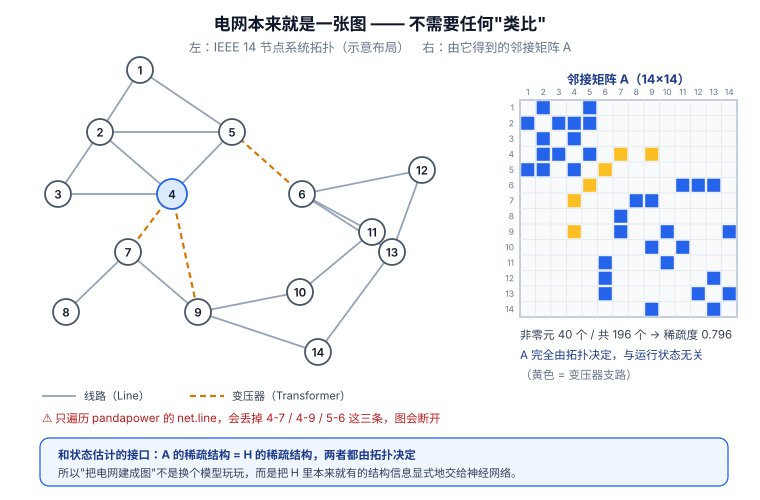
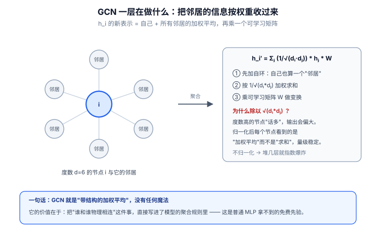

# 📘 第 10 周 · 图神经网络与电网拓扑建模

> **本周目标**：前 9 周你的模型看到的都是"一行一行"的数据 —— 一条量测是一个向量，一段负荷是一条序列。但电网不是一堆孤立的量测，它是**一张有物理连接的图**：14 号母线的电压受 13 号母线影响，线路潮流由两端状态决定。本周要学的是**怎么把这个拓扑结构喂给神经网络**。学完你应该能做到：把 IEEE 14 节点系统转成 PyG 的 `Data` 对象；手写一个 GCN 层并解释它为什么等价于"邻居加权平均"；说清 GCN / GraphSAGE / GAT 三者的取舍；在节点级异常检测任务上跑通一个图模型；**并且在别人吹 GNN 的时候，你能说出它在电网场景下什么时候其实不如 MLP**。
>
> **本周知识清单**：G 域 8 条（融入每天末尾的 ✅ 知识自查）
>
> **阶段位置**：这是第二阶段（Day 61-120）的第一周。第一阶段你学会了"用通用深度学习做检测"，第二阶段要做的是"**用对结构的方法做对的问题**"。图解决"空间/拓扑"，生成解决"数据不够"。
>
> **使用方式**：在 Typora 中按标题折叠展开，每天读对应的小节即可。

[[深度学习学习总目录|← 返回总目录]]

---

## Day 61 —— 为什么电网是图：邻接矩阵与节点特征

> **一句话**：电网的拓扑不是"背景信息"，它是**物理约束本身** —— 量测矩阵 `H` 由拓扑和线路参数决定，所以拓扑变了，`H` 就变了，检测器看到的"正常"也就变了。

### 一、电网天然就是一张图

把电网画出来，你不需要任何抽象：

```
节点（Node）= 母线（Bus）            ← 电压、相角挂在这里
边（Edge）  = 线路（Line）、变压器   ← 潮流、阻抗挂在这里
```

**这不是"类比"，是字面意义上的图。**

| 电网概念 | 图论概念 | 数据落在哪 |
|---|---|---|
| 母线（Bus） | 节点 | 电压幅值 `vm_pu`、相角 `va_degree`、注入 `p_mw` / `q_mvar` |
| 线路（Line） | 边 | 首末端有功/无功、电流、负载率 |
| 变压器（Transformer） | 边 | 同上，另有变比 |
| 发电机（Gen） | 节点属性 | 有功出力、电压设定值 |
| 负荷（Load） | 节点属性 | 消耗功率 |

**回顾 Day 37 的状态估计方程 `z = H · x + e`**：

> `H` 的每一行对应"某条边或某个节点的量测"，每一列对应"某个节点的状态"。
> **而 `H` 的稀疏结构完全由拓扑决定** —— 只有物理相连的节点之间，`H` 才有非零元。
> **换句话说：`H` 就是这张图的邻接关系在物理定律下的具体化。**

### 二、邻接矩阵：把拓扑写成一个矩阵

```
A[i][j] = 1  如果节点 i 和 j 之间有边
A[i][j] = 0  否则
```

IEEE 14 的 `A` 是 14×14 的 0/1 矩阵（节选）：

```
     1  2  3  4  5  6  7 ...
 1 [ 0  1  0  0  1  0  0 ... ]
 2 [ 1  0  1  1  1  0  0 ... ]
 3 [ 0  1  0  1  0  0  0 ... ]
 4 [ 0  1  1  0  1  1  1 ... ]
 5 [ 1  1  0  1  0  0  0 ... ]
```

**三个必须注意的性质**：

| 性质 | 含义 | 对你的影响 |
|---|---|---|
| **对称** | `A[i][j] = A[j][i]` | 电网潮流有方向，但拓扑连接无方向 —— 注意区分"连接"和"流向" |
| **稀疏** | IEEE 118 只有 186 条边，而 `118² = 13924` | 用稀疏矩阵，别用稠密 `A` 浪费内存 |
| **对角为 0** | 节点不和自己相连 | 但 GCN 会人为加自环（Day 62） |

```python
import numpy as np
import pandapower.networks as pn

net = pn.case14()
n_bus = len(net.bus)
A = np.zeros((n_bus, n_bus))

for _, row in net.line.iterrows():                 # 线路
    i, j = int(row['from_bus']), int(row['to_bus'])
    A[i, j] = A[j, i] = 1
for _, row in net.trafo.iterrows():                # 变压器（容易被忘掉！）
    i, j = int(row['hv_bus']), int(row['lv_bus'])
    A[i, j] = A[j, i] = 1

print(f"节点数 {n_bus}，边数 {int(A.sum() / 2)}，稀疏度 {1 - A.sum() / A.size:.3f}")
```

> **⚠️ 变压器的坑**：pandapower 的 `net.line` **不包含变压器**。只遍历 `net.line`，IEEE 14 会丢掉 4-7、4-8、4-9 这几条边，图就断了。**这是新手最常犯的错误**，而且不报错，只会让你后面的结果莫名其妙地差。



> **看图说话**：上图左边是 IEEE 14 节点系统的拓扑，右边是它对应的 14×14 邻接矩阵。**橙色虚线**是 3 条变压器支路（4-7、4-9、5-6）—— IEEE 14 一共 **20 条支路**，其中 3 条是变压器，画图或写代码时**最容易漏掉**这一类。右侧矩阵里每个实心方格对应一条支路，白色就是无连接：**稀疏度 0.796**，也就是 95% 以上的格子是空的。底部那条结论是全图的落点：**`A` 的稀疏结构与状态估计里 `H` 的稀疏结构，两者都由拓扑决定**。所以“把电网建成图”不是换个模型玩玩，而是把 `H` 里本来就存在的结构信息显式地交给神经网络 —— 这正是普通 MLP 拿不到的免费先验，也是 GNN 在电网场景真正的立足点。


### 三、节点特征与边特征：什么挂在哪里

有了拓扑（谁连谁），还要有特征（各自什么状态）。**这一步决定了模型能学到什么。**

**节点特征（`x`，形状 `[N, F_node]`）**：

| 候选特征 | 来源 | 是否推荐 |
|---|---|---|
| 电压幅值 `vm_pu` | `res_bus` | ✅ 核心状态量，必选 |
| 电压相角 `va_degree` | `res_bus` | ⚠️ 含参考节点，需处理基准 |
| 节点注入有功 `p_mw` | `res_bus` | ✅ 推荐 |
| 节点注入无功 `q_mvar` | `res_bus` | ✅ 推荐（注意可能为负） |
| 节点度数（degree） | 由 `A` 算出 | 🟡 结构特征，有时有用 |

**边特征（`edge_attr`，形状 `[E, F_edge]`）**：

| 候选特征 | 来源 | 说明 |
|---|---|---|
| 首端有功 `p_from_mw` | `res_line` | ✅ 动态，FDI 主战场之一 |
| 末端有功 `p_to_mw` | `res_line` | ✅ 与首端不等，方向信息 |
| 负载率 `loading_percent` | `res_line` | ✅ 物理上最有意义的"异常"指标 |
| 线路阻抗 `r` / `x` | `net.line` | 静态，决定潮流怎么分 |
| 线路容量 `max_i_ka` | `net.line` | 判断过载的基准 |

**一个关键取舍**：**同一份量测，挂到节点上还是挂到边上，会改变模型能学到什么。**

```
p_from_mw 作为「边特征」 → 模型学的是「线路上的异常」
p_mw      作为「节点特征」 → 模型学的是「注入的异常」
```

**FDI 攻击篡改支路潮流时，它本质上是"边上的异常"。** 只建模节点特征，就丢掉了这一层信息。

### 四、和电网安全的关系

**为什么不能直接用 MLP？**

| 场景 | MLP 的做法 | 图模型的做法 | 谁更好 |
|---|---|---|---|
| **拓扑不变，量测充足** | 量测拼成长向量 | 按拓扑聚合 | **MLP 通常不差，甚至更好** |
| **拓扑变化（检修、断线）** | 输入维度变了 → **模型直接失效** | 结构不变，只换 `edge_index` | ✅ 图模型 |
| **新增节点（扩建）** | 需重新设计输入层 | 归纳式模型可直接迁移 | ✅ 图模型 |
| **数据量小** | 参数少，不易过拟合 | 参数多，容易过拟合 | **MLP** |

**最有价值的一条是"拓扑变化"**。回顾 Day 41 的延伸思考：

```
MLP 的答案：不能用了。输入第 37 维是"线路 4-7 的首端有功"，
            线路一断这一维就没了，整个输入向量的语义全乱。

图模型的答案：还能用。A 矩阵去掉 4 和 7 的连接，edge_index 少一条边，
            节点特征维度完全不变，模型结构一字不改。
```

**这就是"结构性"的价值 —— 不是精度更高，而是对拓扑变化更稳。**

**但也要诚实**：

> 如果你的实验设定里**拓扑永远固定**（大多数 FDI 检测论文就是这样），那图模型的这个优势**用不上**。
>
> 这时你上 GNN 的理由只剩两条：① 你想做"拓扑变化下的鲁棒检测"这个题目；② 你想利用"相邻节点量测应满足潮流关系"这个先验。
>
> **如果这两条都不成立，MLP 是更务实的选择。** 审稿人问"为什么不用 MLP"，你要答得上来。

**一个可做的选题**：**"拓扑变化下的 FDI 检测"** —— 现有检测器在 N-1 断线后性能掉多少？图模型能不能扛住？门槛适中（pandapower 改 `net.line` 就能造数据）、文献相对少、有明确工程意义（电网天天在检修）。

### 🔍 延伸思考

1. 电网的 `A` 是对称的，但潮流有方向（`p_from_mw ≠ p_to_mw`）。用无向图模型会不会丢掉方向信息？怎么补回来？
2. 如果把线路电抗作为边权写进 `A`（即 `A[i][j] = 1/x_ij`），这个矩阵有什么物理含义？（提示：回顾 `P_ij ≈ (θ_i - θ_j) / X_ij`）
3. 一个 118 节点系统，如果每条边的状态都要标注，你需要多少标签？这对实验设计意味着什么？

### 📚 参考

- Kipf & Welling (2017), *Semi-Supervised Classification with Graph Convolutional Networks*, ICLR —— [arXiv:1609.02907](https://arxiv.org/abs/1609.02907)（读第 2 节，看它怎么把图结构写进公式）
- 检索建议：Google Scholar 搜 `graph neural network power system`，先看综述建立地图
- pandapower 官方文档的 `net.line` / `net.trafo` 字段说明

### 🎬 视频讲解

> 以下为**关键词检索式**推荐（平台搜索结果，非固定视频链接，避免失效）。
> 直接复制关键词到对应平台搜索即可，也可在结果里挑播放量高的看。

| 平台 | 推荐搜索关键词 | 说明 |
|---|---|---|
| **B站** | [图神经网络 入门 讲解](https://search.bilibili.com/all?keyword=图神经网络+入门+讲解) | 建立"节点/边/邻接矩阵"的直觉 |
| **B站** | [图论 邻接矩阵 讲解](https://search.bilibili.com/all?keyword=图论+邻接矩阵+讲解) | 补图论最小必要知识 |
| **B站** | [电力系统 拓扑 图论 建模](https://search.bilibili.com/all?keyword=电力系统+拓扑+图论+建模) | 看电力人怎么把电网画成图 |
| **抖音** | [图神经网络 是什么](https://www.douyin.com/search/图神经网络+是什么) | 一分钟建立概念 |

### ✅ 知识自查

- [ ] 🟢 **概念** 电网 → 图的映射：母线=节点，线路/变压器=边
- [ ] 🟢 **概念** 邻接矩阵 `A` 的定义，以及它的对称性、稀疏性
- [ ] 🟢 **概念** `H` 矩阵的稀疏结构由拓扑决定（把 Day 37 和今天连起来）
- [ ] 🟢 **实践** 用 `net.line` + `net.trafo` 构建 IEEE 14 的邻接矩阵
- [ ] 🟢 **实践** 把 `vm_pu` / `p_mw` 组织成节点特征矩阵 `x`，形状 `[N, F]`
- [ ] 🟡 **概念** 节点特征 vs 边特征，以及"挂在哪"如何影响模型学到什么
- [ ] 🟡 **判断** MLP 和 GNN 在电网场景下的适用边界
- [ ] 🔴 **概念** 拓扑变化（N-1、检修）为什么会让 MLP 失效

---

## Day 62 —— 图卷积 GCN：从谱域到空域

> **一句话**：GCN 的全部魔法，就是**把"每个节点取自己邻居的平均值"这件事写成了一个矩阵乘法** `ÂH W` —— 谱域的推导很漂亮，但空域的理解（邻居聚合）才是你真正要记住的。

### 一、问题：图上的"卷积"该怎么定义

CNN 的卷积有明确定义：**一个窗口在规则网格上滑动，窗口内像素加权求和。**

```
图像：每个像素的邻居是「上下左右」—— 固定 4 个（或 8 个）
图：  每个节点的邻居是「和它相连的节点」—— 数量不定，顺序不定
```

| 难点 | 图像 | 图 |
|---|---|---|
| 邻居数量 | 固定（3×3 = 9） | **不定**（1 个到几十个） |
| 邻居顺序 | 有（左上、上、右上……） | **没有**（谁排第一？） |
| 平移不变性 | 有 | **没有** |

**不能直接照搬 CNN 的卷积核，必须换一个定义方式。** 历史上走了两条路：

```
谱域方法（Spectral）：用图的拉普拉斯矩阵做"图上的傅里叶变换"，在频域做卷积
      ↓ 计算太贵（要特征分解）
ChebNet：用切比雪夫多项式近似，只用到 K 跳邻居
      ↓ 再简化
GCN：只取一阶近似，得到极简公式
      ↓
空域方法（Spatial）：直接理解成"邻居聚合"，和谱域等价但更好懂、更好扩展
```

### 二、谱域视角：拉普拉斯矩阵与图傅里叶变换

**图拉普拉斯矩阵**是谱域方法的核心：

```
L = D - A            （D 是度矩阵，对角线上 D[i][i] = Σ_j A[i][j]）
L_sym = I - D^(-1/2) A D^(-1/2)     （对称归一化版本，更常用）
```

**为什么 `L` 重要**：它是图上"二阶差分算子"的类比。

| 概念 | 连续 / 图像 | 图 |
|---|---|---|
| 一阶差分 | 梯度 | `((D-A)x)_i = Σ_j A_ij (x_i - x_j)` |
| 二阶差分 | 拉普拉斯算子 | `L x` |
| 基函数 | 傅里叶基 `e^{iωt}` | **`L` 的特征向量 `u_k`** |
| 频率 | `ω` | **`L` 的特征值 `λ_k`** |

**图傅里叶变换与谱域卷积**：

```
正变换：x̂ = Uᵀ x          逆变换：x = U x̂       （U 的列是 L 的特征向量）
图卷积：y = U · g_θ(Λ) · Uᵀ · x
```

> **⚠️ 致命的工程问题**：`U` 需要**对 `L` 做特征分解**，复杂度 `O(N³)`。IEEE 118 也许还行，几千节点就崩了。而且 `U` 依赖具体的图 —— **换一个拓扑，`U` 全变，模型没法迁移。**
>
> **这两条问题直接判了原始谱域方法的死刑。** 后面所有工作都在绕开它。

### 三、从 ChebNet 到 GCN：简化、空域理解、手写实现

**第一步：ChebNet 用切比雪夫多项式近似**

```
g_θ(Λ) ≈ Σ_{k=0}^{K-1} θ_k · T_k(Λ̃)
```

这样 `U g_θ Uᵀ x` 可以改写成**只用 `L` 的幂次**的形式，不再需要特征分解：

```
y ≈ Σ_{k=0}^{K-1} θ_k · T_k(L̃) · x
```

**关键好处**：`L̃^k x` 只涉及**K 跳邻居**，且 `L` 稀疏，矩阵乘法很快。

**第二步：GCN 取 `K = 1` 并再做两次简化**

```
① 取 K = 1（只看一跳邻居）
② 令 θ₀ = -θ₁ = θ（减少参数）
③ 加自环（renormalization trick）：Ã = A + I，D̃[i][i] = Σ_j Ã[i][j]

最终：H^(l+1) = σ( D̃^(-1/2) Ã D̃^(-1/2) · H^(l) · W^(l) )
```

| 符号 | 含义 | 维度 |
|---|---|---|
| `H^(l)` | 第 l 层的节点表示 | `[N, F_l]` |
| `W^(l)` | 可学习权重 | `[F_l, F_{l+1}]` |
| `Ã = A + I` | 加自环的邻接矩阵 | `[N, N]` |
| `D̃^(-1/2) Ã D̃^(-1/2)` | **归一化邻接矩阵**，记作 `Â` | `[N, N]` |

**没有特征分解，没有傅里叶，只有一个稀疏矩阵乘法 + 一个线性层。**

**第三步：空域视角 —— 它其实就是"邻居加权平均"**

把公式按行拆开（节点 `i` 的新表示）：

```
h_i^(l+1) = σ( Σ_{j ∈ N(i) ∪ {i}}  Â[i][j] · h_j^(l) · W )
```

翻译成人话：**① 把自己和邻居的特征按 `Â` 的权重加起来 → ② 过线性层 `W` → ③ 过激活函数。**

`Â[i][j] = 1 / sqrt(d̃_i · d̃_j)` 的物理含义：

| 情况 | 权重 | 直觉 |
|---|---|---|
| 度数大的节点 | 权重小 | "交际广"的节点，每条边的贡献被稀释 |
| 度数小的节点 | 权重大 | "小圈子"的节点，每条边都很重要 |
| 自己（自环） | 也有权重 | 保留自身信息，不是只看邻居 |

> **GCN 最该记住的一句话**：
> **GCN 层 = "把邻居的信息按度归一化后平均过来，再做个线性变换"。**
> 谱域那套推导，是为了说明**为什么这么平均有理论依据**，而不是让你每次都用傅里叶去理解它。

**第四步：手写一个 GCN 层**

**不要一上来就用 PyG。先手写一遍，你才知道里面在算什么。**

```python
import numpy as np

def normalize_adj(A):
    """Â = D̃^(-1/2) (A + I) D̃^(-1/2)"""
    N = A.shape[0]
    A_tilde = A + np.eye(N)                       # ① 加自环
    d = A_tilde.sum(axis=1)                       # ② 度
    d_inv_sqrt = np.power(d, -0.5)
    d_inv_sqrt[np.isinf(d_inv_sqrt)] = 0.0        # 孤立节点保护
    return np.diag(d_inv_sqrt) @ A_tilde @ np.diag(d_inv_sqrt)

def gcn_layer(A_hat, H, W, activation=True):
    """一层 GCN：H' = σ(Â · H · W)"""
    out = A_hat @ H @ W                           # 邻居聚合 + 线性变换
    return np.maximum(out, 0) if activation else out

A = np.array([[0.,1.,1.,0.],
              [1.,0.,1.,1.],
              [1.,1.,0.,0.],
              [0.,1.,0.,0.]])
A_hat = normalize_adj(A)
print("每行和 =", np.round(A_hat.sum(axis=1), 4))

H0 = np.eye(4)[:, :3]                             # 4 个节点，3 维特征
W = np.random.default_rng(0).normal(0, 0.5, size=(3, 2))
print(gcn_layer(A_hat, H0, W).shape)              # (4, 2)
```

**PyTorch 版本**：

```python
import torch
import torch.nn as nn

class GCNLayer(nn.Module):
    def __init__(self, in_dim, out_dim):
        super().__init__()
        self.linear = nn.Linear(in_dim, out_dim, bias=False)

    def forward(self, x, A_hat):        # x: [N, in_dim]  A_hat: [N, N]
        return torch.relu(self.linear(A_hat @ x))
```



> **看图说话**：上图左边是节点 `i` 和它的 6 个邻居，右边是把它们聚合成 `h_i′` 的三步。**第 ① 步加自环最容易漏**：自己也算一个“邻居”，不加的话更新后连自己的信息都丢了。**第 ② 步的权重 `1/√(d_i·d_j)` 是全图的核心**。红字那段是它的理由：度数高的节点参与很多次聚合、“话多”，输出会偏大；除以这个系数后每个节点看到的是**加权平均**而不是“求和”，量级就稳了。**这不是理论洁癖**：项目里的 `graph_basics.py` 实测过，不归一化时堆到第 10 层幅值会炸到 `8.699e+05`，归一化后是 `0.319`。三层以上的 GCN 不归一化基本训不动 —— 这个数字你可以自己跑一遍验证。


### 四、和电网安全的关系

**GCN 在电网上有一个非常直观的物理意义 —— 它和潮流方程是同构的。**

回顾 Day 37：

```
P_i = V_i · Σ_j V_j · (G_ij cos θ_ij + B_ij sin θ_ij)
        ↑
    节点 i 的注入功率 = 对所有邻居 j 的求和
```

**看那个 `Σ_j`** —— 节点 i 的物理量由它的邻居决定，**这正是 GCN 在做的事**。

| 潮流方程 | GCN |
|---|---|
| 节点 i 的注入功率 = Σ over 邻居 j | 节点 i 的新表示 = Σ over 邻居 j |
| 系数 `G_ij, B_ij` 由线路参数决定，**已知** | 系数 `Â[i][j]` 固定 + `W` **可学习** |
| 一次计算（潮流是静态方程） | 堆 L 层 = 看 L 跳邻居 |

**一个自然的研究想法**：

> **"能不能用线路导纳替代 `Â` 的度归一化权重？"**
>
> 即 `A[i][j] = |B_ij|` 或 `1/x_ij`，而不是 `1`。物理上更合理 —— 电气距离近的节点，信息传播应该更强。
>
> **这个想法文献里已经有人做过**（搜 `physics-informed graph neural network power system`），但**在"FDI 检测"这个具体任务上是否做透，需要你自己去查**。如果没做透，这就是一个门槛不高、有物理动机的改进点。

**三个诚实的边界**：

| 说法 | 是否成立 |
|---|---|
| "GNN 一定比 MLP 好" | ❌ **不成立**。拓扑固定 + 数据充足时，MLP 经常打平甚至更好 |
| "GCN 能自动学到物理规律" | ⚠️ **过于乐观**。它学的是统计相关性，不是潮流方程 |
| "GCN 能处理拓扑变化" | ✅ 成立，但前提是**训练时见过多种拓扑**（否则它只是没见过） |

### 🔍 延伸思考

1. 如果去掉归一化（直接用 `Ã`），度数大的节点表示会变成什么量级？这对深层 GCN 的数值稳定性有什么影响？
2. GCN 堆 5 层以上会发生什么？（提示：搜 `over-smoothing graph neural network` —— 这是已知问题，不是你的错觉）
3. 如果某个枢纽变电站连了 10 条线，GCN 的度归一化会让它的信息被"稀释"吗？这对检测有没有影响？

### 📚 参考

- Kipf & Welling (2017), *Semi-Supervised Classification with Graph Convolutional Networks*, ICLR —— [arXiv:1609.02907](https://arxiv.org/abs/1609.02907)
- Defferrard et al. (2016), *Convolutional Neural Networks on Graphs with Fast Localized Spectral Filtering*（ChebNet）—— [arXiv:1606.09375](https://arxiv.org/abs/1606.09375)
- 检索建议：搜 `graph convolutional network tutorial spectral`，找一篇把谱域推导讲清楚的讲义

### 🎬 视频讲解

> 以下为**关键词检索式**推荐（平台搜索结果，非固定视频链接，避免失效）。
> 直接复制关键词到对应平台搜索即可，也可在结果里挑播放量高的看。

| 平台 | 推荐搜索关键词 | 说明 |
|---|---|---|
| **B站** | [GCN 原理 讲解 推导](https://search.bilibili.com/all?keyword=GCN+原理+讲解+推导) | 从谱域到空域的完整推导 |
| **B站** | [图卷积 谱域 空域 区别](https://search.bilibili.com/all?keyword=图卷积+谱域+空域+区别) | 两条路线的关系 |
| **B站** | [拉普拉斯矩阵 图信号处理 讲解](https://search.bilibili.com/all?keyword=拉普拉斯矩阵+图信号处理+讲解) | 补谱域所需的数学 |
| **抖音** | [图卷积 是什么](https://www.douyin.com/search/图卷积+是什么) | 三分钟建立直觉 |

### ✅ 知识自查

- [ ] 🟢 **概念** 图拉普拉斯矩阵 `L = D - A` 与对称归一化版本
- [ ] 🟢 **概念** 图傅里叶变换：`L` 的特征向量是基，特征值是频率
- [ ] 🟢 **概念** 谱域图卷积 `U g_θ(Λ) Uᵀ x`，以及它为什么贵（`O(N³)` 特征分解）
- [ ] 🟢 **概念** ChebNet 用切比雪夫多项式近似，把复杂度降到只涉及 K 跳邻居
- [ ] 🟢 **推导** GCN 公式 `H' = σ(Â H W)`，`Â = D̃^(-1/2) Ã D̃^(-1/2)`
- [ ] 🟢 **实践** 手写 `normalize_adj` 和一个 GCN 层（numpy 或 PyTorch）
- [ ] 🟡 **概念** GCN 的空域理解：邻居按度归一化后加权平均
- [ ] 🟡 **概念** GCN 与潮流方程的类比（`Σ_j` 结构），以及这个类比不能推得太远

---

## Day 63 —— GraphSAGE 与 GAT：归纳学习与注意力聚合

> **一句话**：GCN 有个致命缺陷 —— 它把整张图"背"进了权重里（直推式）。**GraphSAGE 用"采样+聚合"换来了对新节点的泛化；GAT 用注意力换来了"邻居权重不用手工定"。**

### 一、GCN 的两个局限

**局限一：直推式（transductive）。** `Â` 是**固定的**：

```
训练时见过的图 → 用得好
测试时出现的新节点 / 新拓扑 → 模型不知道怎么处理
```

| 场景 | GCN 的处境 |
|---|---|
| 变电站扩建，新增一个母线 | ❌ 需要重新训练 |
| 线路检修断开（N-1） | ⚠️ 训练时见过这个拓扑才行，没见过就崩 |
| 换一个算例（case14 → case118） | ❌ **完全不能迁移** |

**局限二：权重是"度决定的"，不是"学出来的"。**

```
Â[i][j] = 1/sqrt(d̃_i · d̃_j)  ← 算出来的
所有邻居被平等对待（只按度数归一化），但现实中不同邻居的重要性显然不同
```

**举例**：一个母线连了三台发电机和一条弱联络线。GCN 会给这条弱联络线分配和发电机支路同量级的权重 —— **这显然不合理**，联络线上的潮流小，异常信号也弱。

### 二、GraphSAGE：采样 + 聚合，从直推变归纳

**核心改动：不再用固定的 `Â`，而是"对每个节点，采样它的邻居，用一个可学习的聚合函数把它们合起来"。**

```
h_i^(l+1) = σ( W · CONCAT( h_i^(l),  AGG({ h_j^(l) : j ∈ N(i) }) ) )
```

| 部分 | 作用 |
|---|---|
| `AGG(...)` | 聚合函数，把不定数量的邻居特征变成一个固定维度的向量 |
| `CONCAT(h_i, agg)` | **把自己的表示和邻居聚合结果拼起来** —— 关键设计 |
| `W` | 线性变换 |

**为什么 `CONCAT` 很重要**：

```
GCN：      h_i' = 自己的 + 邻居的          （混在一起，分不清）
GraphSAGE：h_i' = [自己的 ; 邻居的]        （显式区分，让模型自己决定各占多少）
```

**三种聚合函数**：

| 聚合 | 公式 | 特点 |
|---|---|---|
| **Mean** | `mean({h_j})` | 最简单，效果好，**默认首选** |
| **LSTM** | 把邻居排序后过 LSTM | 表达力强，但对顺序敏感（图本来没顺序） |
| **Pool** | `max(σ(W_pool h_j + b))` | 每维取最大，能捕捉"最突出的特征" |

**"采样"的意义**：邻居多时（枢纽节点连 20 条线），全部聚合计算量大 → 随机采样固定数量（比如 10 个）。小电网上不是瓶颈，大电网上必要。

**归纳能力从哪来**：

```
GCN 学到的是「节点 7 的表示 = 节点 7 的邻居特征的加权和」—— 一张查找表
GraphSAGE 学到的是「如何聚合任意一个节点的邻居」—— 一条规则
```

**所以 GraphSAGE 可以处理训练时没见过的节点和拓扑。** 这对"拓扑变化下的检测"是刚需。

```python
import torch
import torch.nn.functional as F
from torch_geometric.nn import SAGEConv

class GraphSAGENet(torch.nn.Module):
    def __init__(self, in_dim, hidden, out_dim):
        super().__init__()
        self.conv1 = SAGEConv(in_dim, hidden, aggr='mean')
        self.conv2 = SAGEConv(hidden, out_dim, aggr='mean')

    def forward(self, x, edge_index):
        x = F.relu(self.conv1(x, edge_index))
        x = F.dropout(x, p=0.5, training=self.training)
        return self.conv2(x, edge_index)
```

> `SAGEConv` 的 `aggr` 可选 `'mean'` / `'max'` / `'lstm'` / `'sum'`，默认 `'mean'`。**换聚合函数是一个成本极低的消融实验**，值得做一次。

### 三、GAT：用注意力自动学邻居权重

**核心思想**：**"邻居的权重不该由度数决定，该由数据决定。"**

```
第一步（算注意力分数）：e_ij = LeakyReLU( aᵀ · [W h_i ; W h_j] )
第二步（归一化）：      α_ij = softmax_j(e_ij) = exp(e_ij) / Σ_{k∈N(i)} exp(e_ik)
第三步（加权聚合）：    h_i' = σ( Σ_{j∈N(i)} α_ij · W h_j )
```

| 符号 | 含义 |
|---|---|
| `W` | 共享的线性变换（对所有节点） |
| `[W h_i ; W h_j]` | 把 i 和邻居 j 的变换后表示拼起来（`2F` 维） |
| `a` | 可学习的向量（`2F` 维）—— `aᵀ[·]` 内积得到一个标量，就是"i 对 j 的注意力分数" |

**对比 GCN**：

| | GCN | GAT |
|---|---|---|
| 邻居权重 | `1/sqrt(d̃_i d̃_j)`，**算出来的** | `α_ij`，**学出来的** |
| 权重依赖 | 只看度数 | **看特征**（不同输入，权重不同） |
| 计算成本 | 低 | 中（要算所有边的注意力） |
| 参数 | 少 | 多（多了 `a`） |

```python
from torch_geometric.nn import GATConv

# 多头 + 拼接：输出维度 = out_channels * heads
conv = GATConv(in_channels=8, out_channels=16, heads=4, concat=True)     # → 64 维
# 最后一层用平均而不是拼接
conv_last = GATConv(in_channels=64, out_channels=2, heads=4, concat=False)  # → 2 维
```

> **⚠️ 维度坑**：`concat=True` 时输出维度是 `out_channels × heads`。**这是最常见的维度对不上原因**（回顾 Day 3 的形状心法）。

**⚠️ "GAT 的注意力可以解释模型"这个说法要打问号。**

| 说法 | 实际情况 |
|---|---|
| "注意力权重高 = 这个邻居更重要" | ❌ **不必然成立**。已有工作指出注意力权重和特征重要性经常对不上（搜 `attention is not explanation`） |
| "注意力可以帮我们定位异常源" | ⚠️ 可作线索，不能作结论。要验证需做扰动实验（移除高注意力邻居，看输出变多少） |

**在电网场景里**：如果要用注意力做"异常溯源"（告警时告诉调度员是哪条线路出问题），**必须做额外验证实验**。审稿人会问这个。

### 四、和电网安全的关系

**三种模型对应三种电网场景**：

| 场景 | 推荐模型 | 理由 |
|---|---|---|
| **拓扑固定，只做检测** | GCN 或 MLP | 简单够用，GraphSAGE/GAT 的额外能力用不上 |
| **拓扑会变（检修、断线）** | **GraphSAGE** | 归纳式，能处理新拓扑；聚合函数是"规则"不是"查找表" |
| **不同线路重要性差异大** | **GAT** | 让模型自己学"哪条线更值得关注" |
| **要做异常溯源（定位到线路）** | GAT（+ 严格验证） | 注意力可作线索，但需扰动实验支撑 |
| **大规模系统（case118 以上）** | GraphSAGE（带采样） | 采样控制计算量 |

**一个具体的研究设计**：

```
问题：现有 FDI 检测器在拓扑变化后性能掉多少？

① 训练集：case14 在 T 种拓扑下的数据（T = 20，随机断 0~2 条线）
② 测试集 A：见过的拓扑（in-distribution）
③ 测试集 B：没见过的拓扑（out-of-distribution）  ← 关键
④ 对比：MLP / GCN / GraphSAGE / GAT

诚实预测：
  - 测试集 A：四种方法差不多，MLP 可能不输
  - 测试集 B：MLP 崩（输入语义全乱），GCN 崩或大幅下降，GraphSAGE 最稳
```

> **这个预测是有可能不成立的** —— 如果 GraphSAGE 也崩了，那就是一个更有意思的发现（"图模型也不能解决拓扑变化问题"）。
>
> **做实验前先写下预期，跑完对比** —— 这是 Day 47 学的"先预测再跑"。

**必须写进论文的细节**：做拓扑变化实验时，**必须说明"训练时见过多少种拓扑、测试拓扑与训练拓扑差多远"**。否则审稿人会问"你这不是在测泛化，是在测记忆"。

### 🔍 延伸思考

1. GraphSAGE 的 `CONCAT(h_i, agg)` 和 GCN 的"自环 + 平均"在数学上有什么区别？去掉 `CONCAT`，GraphSAGE 会退化成什么？
2. GAT 的注意力系数 `α_ij` 在电网里有没有物理对应物？（提示：回顾 `P_ij ≈ (θ_i - θ_j)/X_ij` —— 潮流大小是不是也可以看成一个"注意力"？）
3. 如果训练时只见过 case14，测试时换成 case118，GraphSAGE 能直接用吗？会缺什么？

### 📚 参考

- Hamilton et al. (2017), *Inductive Representation Learning on Large Graphs*（GraphSAGE）—— [arXiv:1706.02216](https://arxiv.org/abs/1706.02216)
- Veličković et al. (2018), *Graph Attention Networks*（GAT）—— [arXiv:1710.10903](https://arxiv.org/abs/1710.10903)
- 检索建议：搜 `attention is not explanation`，读一读为什么注意力权重不能直接当解释

### 🎬 视频讲解

> 以下为**关键词检索式**推荐（平台搜索结果，非固定视频链接，避免失效）。
> 直接复制关键词到对应平台搜索即可，也可在结果里挑播放量高的看。

| 平台 | 推荐搜索关键词 | 说明 |
|---|---|---|
| **B站** | [GraphSAGE 归纳学习 讲解](https://search.bilibili.com/all?keyword=GraphSAGE+归纳学习+讲解) | 采样+聚合的完整思路 |
| **B站** | [GAT 图注意力网络 讲解](https://search.bilibili.com/all?keyword=GAT+图注意力网络+讲解) | 注意力系数怎么算 |
| **B站** | [直推式 归纳式 图神经网络 区别](https://search.bilibili.com/all?keyword=直推式+归纳式+图神经网络+区别) | 理解 GCN 的局限 |
| **抖音** | [图注意力网络 是什么](https://www.douyin.com/search/图注意力网络+是什么) | 一分钟建立概念 |

### ✅ 知识自查

- [ ] 🟢 **概念** GCN 的直推式局限：固定的 `Â`，不能处理新节点/新拓扑
- [ ] 🟢 **概念** GraphSAGE 的采样+聚合框架，以及 `CONCAT` 的作用
- [ ] 🟢 **概念** 三种聚合函数：mean / LSTM / pool，各自特点
- [ ] 🟢 **概念** GAT 的注意力系数 `e_ij` 与归一化 `α_ij` 的计算
- [ ] 🟢 **API** `SAGEConv(in, out, aggr=)` 与 `GATConv(in, out, heads=, concat=)` 的维度变化
- [ ] 🟢 **实践** 在同一个图上跑 GCN / GraphSAGE / GAT，对比参数量与耗时
- [ ] 🟡 **判断** "注意力权重 = 可解释性"这个说法为什么不成立
- [ ] 🟡 **判断** 什么电网场景该选 GraphSAGE，什么场景 GAT 更合适

---

## Day 64 —— 电网图建模实战：把 IEEE 14 节点变成一张图

> **一句话**：今天只做一件事 —— **写一个能复用的 `pandapower → PyG Data` 转换函数**。这 60 行代码，是你后面所有图实验的地基。

### 一、先想清楚三件事（比写代码重要）

| 决策 | 选项 | 建议 |
|---|---|---|
| **节点特征放什么** | 只放状态量？还是加结构特征？ | 先放 `[vm_pu, va_degree, p_mw, q_mvar]` 四维 |
| **边特征放什么** | 静态参数？动态量测？ | 放 `[p_from, q_from, p_to, q_to, pl_mw, loading_percent]` |
| **边是双向还是单向** | 潮流有方向，拓扑没有 | **双向**（`i→j` 和 `j→i` 都建），否则信息传不回来 |

### 二、完整实现

```python
import numpy as np
import torch
import pandapower as pp
import pandapower.networks as pn
from torch_geometric.data import Data


def net_to_pyg(net, label=None):
    """
    把 pandapower 网络转成 PyG 的 Data 对象。
    net 必须已经跑过 runpp。
    """
    n_bus = len(net.bus)

    # ========== ① 节点特征 [N, 4]，顺序固定 ==========
    x_np = np.stack([
        net.res_bus['vm_pu'].values,
        net.res_bus['va_degree'].values,
        net.res_bus['p_mw'].values,
        net.res_bus['q_mvar'].values,
    ], axis=1).astype(np.float32)

    # ========== ② 边表：线路 + 变压器，双向 ==========
    src, dst = [], []
    for _, row in net.line.iterrows():
        i, j = int(row['from_bus']), int(row['to_bus'])
        src += [i, j]; dst += [j, i]
    for _, row in net.trafo.iterrows():
        i, j = int(row['hv_bus']), int(row['lv_bus'])
        src += [i, j]; dst += [j, i]
    edge_index = torch.tensor([src, dst], dtype=torch.long)      # [2, 2E]

    # ========== ③ 边特征 [2E, 6] ==========
    line_f = np.stack([
        net.res_line['p_from_mw'].values,
        net.res_line['q_from_mvar'].values,
        net.res_line['p_to_mw'].values,
        net.res_line['q_to_mvar'].values,
        net.res_line['pl_mw'].values,             # 有功损耗
        net.res_line['loading_percent'].values,   # 负载率
    ], axis=1).astype(np.float32)

    trafo_f = np.stack([
        net.res_trafo['p_hv_mw'].values,
        net.res_trafo['q_hv_mvar'].values,
        net.res_trafo['p_lv_mw'].values,
        net.res_trafo['q_lv_mvar'].values,
        net.res_trafo['pl_mw'].values,
        net.res_trafo['loading_percent'].values,
    ], axis=1).astype(np.float32)

    # 顺序必须和 ② 一致：线路(正反) → 变压器(正反)
    edge_f = np.concatenate([line_f, line_f, trafo_f, trafo_f], axis=0)
    edge_attr = torch.tensor(edge_f, dtype=torch.float32)

    # ========== ④ 一致性检查（非常重要）==========
    assert edge_index.shape[1] == edge_attr.shape[0], \
        f"边数不匹配：{edge_index.shape[1]} vs {edge_attr.shape[0]}"

    y = None if label is None else torch.tensor([label], dtype=torch.long)
    return Data(x=torch.tensor(x_np), edge_index=edge_index,
                edge_attr=edge_attr, y=y, num_nodes=n_bus)


# ==================== 用法 ====================
net = pn.case14()
pp.runpp(net)
data = net_to_pyg(net)
print(data)
print(f"节点数 {data.num_nodes}，无向边数 {data.edge_index.shape[1] // 2}")
print(f"平均度数 {data.edge_index.shape[1] / data.num_nodes:.2f}")
```

**预期输出**（形状应与下面一致，边数因 pandapower 版本可能略有差异）：

```
Data(x=[14, 4], edge_index=[2, 40], edge_attr=[40, 6], num_nodes=14)
节点数 14，无向边数 20
平均度数 2.86
```

> **IEEE 14 的边数取决于 pandapower 版本里 case14 的定义。** 以你的实际输出为准，**关键是要和你从 `net.line` / `net.trafo` 数出来的数对得上**。
>
> **永远不要"假设"边数，永远打印出来核对。** 这是图建模里最常见的静默错误来源。

### 三、四个容易踩的坑

**坑 1：变压器的边特征字段名不同**

| 线路 | 变压器 |
|---|---|
| `p_from_mw` / `p_to_mw` | `p_hv_mw` / `p_lv_mw` |
| `q_from_mvar` / `q_to_mvar` | `q_hv_mvar` / `q_lv_mvar` |

**直接照抄线路的字段名去取变压器，会 KeyError** —— 或者更糟，得到一列 NaN。

**坑 2：边顺序必须和特征顺序严格对应**

```
edge_index 的构造顺序：  线路(i→j), 线路(j→i), 变压器(i→j), 变压器(j→i)
edge_attr 的构造顺序：   必须完全一致

❌ 错误写法：np.concatenate([line_f, trafo_f], axis=0)   # 少了反向，数量对不上
```

**用 `assert` 兜底** —— 这一行能救你半天时间。

**坑 3：`va_degree` 的参考节点**

IEEE 14 的参考节点（slack bus）相角恒为 0，**这一维没有信息量，但也不是错的**（它是个常数）。

| 处理方式 | 说明 |
|---|---|
| 保留原样 | 最简单，模型能学会"这一维是常数" |
| 删掉参考节点 | ⚠️ 会改变图结构，不推荐 |
| 用相对相角（减去参考节点） | ✅ 物理上更合理，但增加复杂度 |

**建议**：先用最简单的，跑通后再考虑优化。**不要一上来就做花哨的预处理。**

**坑 4：节点索引不连续**

pandapower 的 bus 索引**不保证是 0..N-1 连续整数**。删过节点后索引可能变成 `[0,2,5,7,...]`。

```python
bus_map = {old: new for new, old in enumerate(net.bus.index)}
for _, row in net.line.iterrows():
    i = bus_map[int(row['from_bus'])]
    j = bus_map[int(row['to_bus'])]
```

> **不做这个映射，`edge_index` 会出现超出 `num_nodes` 的索引** —— PyG 会报错（这个错误还算友好）。但如果索引恰好都在范围内，**它不会报错，只会静默地连错节点** —— 这才是最可怕的。

### 四、和电网安全的关系

**这个转换函数直接决定了你能做哪些实验。**

| 你想做的实验 | 需要在转换函数里改什么 |
|---|---|
| **FDI 检测（拓扑固定）** | 不用改，直接用 |
| **拓扑变化下的检测** | 生成数据时改 `net.line`（断开线路），转换函数不变 |
| **边级异常检测** | 边特征里必须包含 `p_from_mw` / `p_to_mw`（已包含） |
| **节点级异常检测** | 节点特征里必须包含 `p_mw` / `q_mvar`（已包含） |
| **时空建模** | 需要输出序列 `[T, N, F]`，把 `net_to_pyg` 包一层循环 |
| **加入物理约束** | 边特征里加 `x`（电抗），节点特征里加导纳相关量 |

**一个关于"标签粒度"的提前提醒**（Day 65 展开）：

```
你现在做的是「图级」转换 —— 一张图一个标签（正常 / 被攻击）
但 FDI 攻击通常只改了几个量测，标签应该是「节点级」或「边级」的

所以转换函数还需要扩展：
    node_label: [N]   每个节点是否被篡改
    edge_label: [E]   每条边是否被篡改
```

**今天先把"正常情况"的转换跑通，这个扩展在第 65 天做。**

> **上面这段代码只有 60 行左右，但它覆盖了你后面 90% 的图实验需求。**
>
> 不要急着上复杂模型。**先跑通、打印出正确的形状、用一个最简单的 GCN 跑出一个不高不低的准确率。** 这比堆一个花哨的时空注意力模型有用得多。
>
> **很多人的图实验失败，不是模型不行，是 `edge_index` 和 `edge_attr` 对不上。**

### 🔍 延伸思考

1. 如果把 `loading_percent` 从边特征里删掉，模型还能不能检测出"线路过载"这类异常？这说明什么？
2. 变压器两端电压等级不同（比如 110 kV 和 10 kV），把它们当成同质的边处理合理吗？你会怎么区分？
3. 你的转换函数对 `case118` 需要改吗？如果不用改，这说明了什么设计原则？

### 📚 参考

- PyG 官方文档 `torch_geometric.data.Data` 的字段约定 —— [pytorch-geometric.readthedocs.io](https://pytorch-geometric.readthedocs.io/)
- pandapower 官方文档 `res_line` / `res_trafo` / `res_bus` 字段说明 —— [pandapower.readthedocs.io](https://pandapower.readthedocs.io/)
- 检索建议：搜 `pytorch geometric custom dataset tutorial`，看官方怎么组织自定义图数据

### 🎬 视频讲解

> 以下为**关键词检索式**推荐（平台搜索结果，非固定视频链接，避免失效）。
> 直接复制关键词到对应平台搜索即可，也可在结果里挑播放量高的看。

| 平台 | 推荐搜索关键词 | 说明 |
|---|---|---|
| **B站** | [PyTorch Geometric 教程 入门](https://search.bilibili.com/all?keyword=PyTorch+Geometric+教程+入门) | PyG 的安装与基本用法 |
| **B站** | [PyG Data 数据集 构建](https://search.bilibili.com/all?keyword=PyG+Data+数据集+构建) | 自定义图数据怎么写 |
| **B站** | [edge_index 图数据 讲解](https://search.bilibili.com/all?keyword=edge_index+图数据+讲解) | 把 edge_index 彻底搞明白 |
| **抖音** | [PyG 怎么用](https://www.douyin.com/search/PyG+怎么用) | 一分钟了解 PyG |

### ✅ 知识自查

- [ ] 🟢 **实践** 写出 `net_to_pyg(net)` 并打印出正确的 `x` / `edge_index` / `edge_attr` 形状
- [ ] 🟢 **实践** 线路和变压器的边特征分开处理（字段名不同）
- [ ] 🟢 **实践** 双向边（`i→j` 和 `j→i` 都建），保证信息双向传播
- [ ] 🟢 **实践** 用 `assert` 检查 `edge_index.shape[1] == edge_attr.shape[0]`
- [ ] 🟢 **实践** 处理 bus 索引不连续的情况（建立 `bus_map`）
- [ ] 🟡 **概念** 节点特征 / 边特征的选择如何影响能检测哪类异常
- [ ] 🟡 **概念** 图级 / 节点级 / 边级标签的区别（Day 65 展开）
- [ ] 🔴 **API** `torch_geometric.data.Data` 的标准字段约定

---

## Day 65 —— 图上的异常检测：节点级 / 边级 / 图级

> **一句话**：**标签挂在哪个粒度上，决定了你的模型长什么样、指标怎么算、论文能不能自圆其说** —— 这是图异常检测里最容易被搞错、也最容易被审稿人抓住的地方。

### 一、三个粒度

```
图级（Graph-level）：整张图一个标签 —— 这个系统此刻正常吗？
节点级（Node-level）：每个节点一个标签 —— 这个母线被篡改了吗？
边级（Edge-level）  ：每条边一个标签   —— 这条线路的潮流被篡改了吗？

图级：   [ 系统正常 ]                     ← 一个 0/1
节点级： [0, 0, 1, 0, 0, 0, 1, 0, ...]     ← N 个 0/1
边级：   [0, 1, 0, 0, 1, 0, ...]           ← E 个 0/1
```

| 粒度 | 输出维度 | 典型任务 | 标签获取难度 |
|---|---|---|---|
| **图级** | `[1]` 或 `[C]` | 系统级入侵检测 | 容易（但**样本极少**） |
| **节点级** | `[N]` 或 `[N, C]` | 定位被篡改的母线 | 中（仿真可控） |
| **边级** | `[E]` 或 `[E, C]` | 定位被篡改的线路潮流 | 中（仿真可控） |

### 二、为什么"图级"在电网上通常不适用

**听起来最自然的做法是图级** —— "这一帧数据被攻击了吗？"但它有三个致命问题：

| 问题 | 说明 |
|---|---|
| **样本量爆炸式减少** | 10000 个时间步 × 14 个节点，图级只有 10000 个样本，节点级有 140000 个 |
| **信息被平均掉** | 14 个节点里只有 1 个被攻击，全局池化会把这点信号平均掉 |
| **无法定位** | 告警了，但调度员不知道去哪查 —— 实用价值大打折扣 |

**"信息被平均掉"这一条最要命**：

```
图级做法：h_graph = mean(所有节点的表示)   → [1, F]
          ↓
   1 个异常节点 + 13 个正常节点，平均之后异常信号被稀释 14 倍
```

**所以在电网上，主流做法是节点级或边级。**

### 三、节点级与边级异常检测

**节点级：重构误差路线（图自编码器 GAE）**

```
编码器：x → GCN → GCN → z        （[N, F] → [N, d]）
解码器：z → MLP → x̂               （[N, d] → [N, F]）
损失：  L = Σ_i ||x_i - x̂_i||²     （逐节点重构误差）
```

**核心思想**（和 Day 26 完全一致）：**只用正常数据训练** → 模型学会"正常节点特征长什么样" → **异常节点重构误差大**。

```python
import torch
import torch.nn as nn
import torch.nn.functional as F
from torch_geometric.nn import GCNConv

class GraphAE(nn.Module):
    def __init__(self, in_dim, hidden, latent):
        super().__init__()
        self.enc1 = GCNConv(in_dim, hidden)
        self.enc2 = GCNConv(hidden, latent)
        # 解码器用 MLP（不要再用 GCN，见下方说明）
        self.dec = nn.Sequential(
            nn.Linear(latent, hidden), nn.ReLU(),
            nn.Linear(hidden, in_dim),
        )

    def forward(self, x, edge_index):
        z = F.relu(self.enc1(x, edge_index))
        z = self.enc2(z, edge_index)          # [N, latent]
        return self.dec(z), z                 # x_hat, z

# ===== 训练（只用正常样本！）=====
model = GraphAE(in_dim=4, hidden=32, latent=8)
opt = torch.optim.Adam(model.parameters(), lr=1e-3)
for epoch in range(200):
    model.train(); opt.zero_grad()
    x_hat, _ = model(data.x, data.edge_index)
    loss = F.mse_loss(x_hat, data.x)
    loss.backward(); opt.step()

# ===== 推理：逐节点重构误差作为异常分数 =====
model.eval()
with torch.no_grad():
    x_hat, _ = model(data.x, data.edge_index)
    scores = torch.norm(data.x - x_hat, dim=1)     # [N]
print(scores.numpy().round(4))
```

**一个关键的实现细节：解码器不要再用 GCN。**

```
❌ 编码器 GCN + 解码器 GCN：图卷积会把邻居信息混进来，
   如果邻居是正常的，异常节点的重构误差会被"抹平"
✅ 编码器 GCN + 解码器 MLP：逐节点独立解码，误差不被邻居污染
```

> 文献里做法不统一。**你可以在自己的实验里把两种都跑一遍 —— 这是一个成本极低的消融实验。**

**边级：两种做法**

```python
# 做法一：用两端节点表示的不一致程度作为边分数
def edge_scores(z, edge_index):
    src, dst = edge_index
    return torch.norm(z[src] - z[dst], dim=1)      # [E]

# 做法二：专门的边分类器，输入 = [h_i ; h_j ; edge_attr_ij]
class EdgeClassifier(nn.Module):
    def __init__(self, node_dim, edge_dim, hidden):
        super().__init__()
        self.enc = GCNConv(node_dim, hidden)
        self.cls = nn.Sequential(
            nn.Linear(2 * hidden + edge_dim, hidden), nn.ReLU(),
            nn.Linear(hidden, 1),
        )

    def forward(self, x, edge_index, edge_attr):
        h = F.relu(self.enc(x, edge_index))
        src, dst = edge_index
        e_in = torch.cat([h[src], h[dst], edge_attr], dim=1)
        return self.cls(e_in).squeeze(-1)          # [E] logits
```

> **注意**：`edge_index` 是双向的（`2E` 条），输出也是 `2E`。**做指标计算时要决定是"正反向都算"还是"只算正向"** —— 论文里必须说清楚。

### 四、和电网安全的关系

**先回答一个核心问题：FDI 攻击在图上到底是什么粒度？**

回顾 Day 38 的攻击构造 `Δz = H · Δx`：**`Δx` 是状态偏移（节点级），`Δz` 是量测偏移（节点级 + 边级）。**

| 攻击变体 | 改了什么 | 标签粒度 |
|---|---|---|
| 篡改节点注入功率量测 | `Δz` 中对应节点注入的分量 | **节点级** |
| 篡改支路潮流量测 | `Δz` 中对应支路的分量 | **边级** |
| 篡改节点电压幅值量测 | `Δz` 中对应电压的分量 | **节点级** |
| 同时篡改多种 | 都有 | **节点级 + 边级（多任务）** |

**这带来一个直接的实验设计问题**：

```
如果你的量测向量 z = [支路有功..., 节点电压幅值...]，那么：
  - 用「节点特征」的模型 → 只能检测节点电压类的篡改
  - 用「边特征」的模型   → 只能检测支路潮流类的篡改
  - 两者都建模           → 才能覆盖完整的攻击面
```

**这就解释了为什么 Day 64 的转换函数里，节点和边都要有特征。**

**一个可写的选题**：

> **"多粒度图异常检测：同时定位被篡改的母线与线路"**
>
> 用多任务学习：一个共享的 GCN 编码器，两个头（节点级 + 边级），损失是两者加权和。
>
> 卖点：单粒度方法只能定位一类篡改，多粒度方法能同时覆盖，且两个任务互相有帮助（节点异常会体现在相邻边上）。

**指标怎么算 —— 这里有个坑。**

| 粒度 | 指标 | 坑 |
|---|---|---|
| 图级 | 准确率 / F1 | 类别极不平衡，**必须用 PR-AUC**（回顾 Day 27） |
| 节点级 | 节点级 PR-AUC | 正常节点远多于异常节点，同样不平衡 |
| 边级 | 边级 PR-AUC | 更不平衡（边数比节点多） |

**"节点级 PR-AUC"的正确算法**：

```
把所有 (样本, 节点) 对拉平成一个长列表：
    [ (t=1, node=0, score, label), (t=1, node=1, score, label), ... ]
然后在这个长列表上算 PR-AUC

⚠️ 不要对每个样本单独算 PR-AUC 再平均 —— 那样会高估
   （单个样本里可能一个异常节点都没有，PR-AUC 无定义）
```

**这是图异常检测里最常见的指标错误。论文里必须写清楚你怎么算的。**

**另一个必须明确的问题：FDI 的"节点标签"怎么定义？**

| 定义方式 | 含义 | 问题 |
|---|---|---|
| 被篡改的量测所在节点 | 直接定义 | ✅ 最直观 |
| 状态偏移 `\|Δx_i\| > τ` 的节点 | 攻击影响到的节点 | ⚠️ 阈值 τ 怎么定？ |
| `H·Δx` 中非零分量对应的节点 | 攻击向量的支撑集 | ✅ 严格，但可能很大 |

**论文里必须明确选哪一种并说明理由** —— 不同的定义会得到完全不同的指标。

### 🔍 延伸思考

1. 如果 FDI 只篡改了 2 个量测，而你的模型是"图级"的，信号被稀释了多少倍？改成节点级呢？
2. 用重构误差做异常分数有个隐含假设：**攻击者会让量测偏离正常分布**。如果攻击者刻意让量测落在正常范围内（只是组合方式异常），重构误差还能 work 吗？
3. 节点级和边级两个任务，哪个更容易？为什么？（提示：想想标签数量、以及异常信号在特征里有多明显）

### 📚 参考

- Pang et al., *Deep Learning for Anomaly Detection: A Review* —— [arXiv:2007.02500](https://arxiv.org/abs/2007.02500)
- 检索建议：搜 `graph neural network anomaly detection survey`，找一篇近两年的综述建立方法地图
- 检索建议：搜 `graph autoencoder anomaly detection node level`，看 GAE 类方法的标准做法

### 🎬 视频讲解

> 以下为**关键词检索式**推荐（平台搜索结果，非固定视频链接，避免失效）。
> 直接复制关键词到对应平台搜索即可，也可在结果里挑播放量高的看。

| 平台 | 推荐搜索关键词 | 说明 |
|---|---|---|
| **B站** | [图异常检测 节点级 图级 讲解](https://search.bilibili.com/all?keyword=图异常检测+节点级+图级+讲解) | 三个粒度的区别 |
| **B站** | [图自编码器 异常检测 讲解](https://search.bilibili.com/all?keyword=图自编码器+异常检测+讲解) | GAE 的完整思路 |
| **B站** | [异常检测 标签 粒度 讲解](https://search.bilibili.com/all?keyword=异常检测+标签+粒度+讲解) | 标签定义怎么影响实验 |
| **抖音** | [图异常检测 是什么](https://www.douyin.com/search/图异常检测+是什么) | 一分钟建立概念 |

### ✅ 知识自查

- [ ] 🟢 **概念** 三个粒度：图级 / 节点级 / 边级，各自的输出维度
- [ ] 🟢 **概念** 为什么图级在电网上通常不适用（样本量、信息稀释、无法定位）
- [ ] 🟢 **实践** 用 GCN 编码器 + MLP 解码器搭一个 GraphAE
- [ ] 🟢 **实践** 用逐节点重构误差作为异常分数
- [ ] 🟢 **概念** FDI 攻击的 `Δz` 同时包含节点级和边级分量
- [ ] 🟡 **实践** 边级异常检测的两种做法（节点表示差 / 专门的边分类器）
- [ ] 🟡 **判断** 节点级 PR-AUC 的正确计算方式（拉平所有 (样本,节点) 对）
- [ ] 🔴 **判断** FDI 的"节点标签"三种定义方式及其影响

---

## Day 66 —— 时空图神经网络：动态拓扑与联合建模

> **一句话**：电网的异常有**空间**维度（拓扑）也有**时间**维度（负荷周期、攻击持续），时空图网络就是把两者一起建模 —— 但要小心：**参数量翻倍，你的数据量跟得上吗？**

### 一、为什么需要"时空"

**前面几天的模型都是"单帧"的**：给一帧量测，判一次异常。**但电网异常有强烈的时间特征**：

| 现象 | 时间特性 |
|---|---|
| **负荷周期** | 白天高、夜间低，24 小时周期 —— **不看历史就分不清"异常"和"正常的晚高峰"** |
| **重放攻击** | 报文内容完全合法，只有**时序上下文**能发现（回顾 Day 38） |
| **FDI 持续攻击** | 单帧可能还行，连续多帧的状态偏移就明显了 |
| **传感器漂移** | 缓慢变化，单帧完全正常 |

**只看单帧的模型，会漏掉一大类异常。**

### 二、三条技术路线与最小实现

**路线 A：先空间后时间（堆叠式）**

```
每帧 t：x_t → GCN → h_t        （空间建模）
序列：  [h_1, ..., h_T]        （[T, N, d]）
再：    → 1D-CNN / LSTM / TCN   （时间建模）→ 异常分数
```

**路线 B：图 + 循环（耦合式）**：`h_t = GRU( GCN(x_t, edge_index), h_{t-1} )`

**路线 C：时空注意力**：时间维 + 空间维分别做注意力，表达力最强，参数最多。

| 路线 | 参数量 | 训练难度 | 数据需求 | 建议 |
|---|---|---|---|---|
| A 堆叠式 | 中 | 低 | 中 | ✅ **首选**，模块化，好调，好做消融 |
| B 耦合式 | 中 | 中 | 中 | 时序依赖强时更好 |
| C 双注意力 | 高 | 高 | **高** | ⚠️ 数据少时必过拟合 |

> **建议从路线 A 开始**：GCN 和时间模型分开测，最容易调试。

```python
import torch
import torch.nn as nn
import torch.nn.functional as F
from torch_geometric.nn import GCNConv

class SpatioTemporalGNN(nn.Module):
    """
    输入: x_seq [B, T, N, F_node]，edge_index [2, E]（假设窗口内拓扑不变）
    输出: scores [B, N]
    """
    def __init__(self, node_dim, gcn_hidden, gru_hidden):
        super().__init__()
        self.gcn = GCNConv(node_dim, gcn_hidden)
        self.gru = nn.GRU(gcn_hidden, gru_hidden, batch_first=True)
        self.head = nn.Linear(gru_hidden, 1)

    def forward(self, x_seq, edge_index):
        B, T, N, Fd = x_seq.shape

        # ===== ① 空间：每一帧单独做 GCN =====
        x_flat = x_seq.reshape(B * T * N, Fd)
        ei_batch = torch.cat([edge_index + b * N for b in range(B * T)], dim=1)
        h = F.relu(self.gcn(x_flat, ei_batch)).reshape(B, T, N, -1)

        # ===== ② 时间：每个节点独立过 GRU =====
        h = h.permute(0, 2, 1, 3).reshape(B * N, T, -1)   # [B*N, T, d]
        out, _ = self.gru(h)
        out = out[:, -1, :]                               # 取最后时刻

        # ===== ③ 输出每个节点的分数 =====
        return self.head(out).reshape(B, N)

model = SpatioTemporalGNN(node_dim=4, gcn_hidden=32, gru_hidden=32)
print(model(torch.randn(32, 12, 14, 4), data.edge_index).shape)   # [32, 14]
```

> **⚠️ 这段代码有一个性能问题**：用 Python 循环构造 `ei_batch`，`B*T = 384` 次循环。**真实训练里应该用 PyG 的 `DataLoader` + `Batch`**（它会自动处理偏移）。这里写成循环是为了让你看清"每一帧是一张独立的图"。**跑通之后换成 `DataLoader`。**

### 三、动态拓扑：图会变怎么办

| 情况 | 时间尺度 | 对拓扑的影响 |
|---|---|---|
| 断路器正常操作 | 秒级 | 局部拓扑变化 |
| 线路检修 | 小时-天 | 拓扑变化 |
| 故障跳闸 | 毫秒-秒 | 拓扑变化 |
| 新设备投运 | 月-年 | 拓扑变化 |

**三种处理方式**：

| 方式 | 做法 | 优点 | 缺点 |
|---|---|---|---|
| **窗口内固定** | 假设 T 步内拓扑不变 | 简单 | 断路器动作时失效 |
| **每帧一个 `edge_index`** | 每个时间步用自己的拓扑 | 准确 | 实现复杂，慢 |
| **用邻接矩阵序列** | 把 `A_t` 也作为输入 | 灵活 | 需要模型支持动态图 |

**建议先用"窗口内固定"。** 如果拓扑变化是你的重点（比如 N-1 场景），再上第二种。

**一个诚实的问题**：要建模动态拓扑，**你的数据生成脚本必须记录每一步的 `edge_index`**。

```
数据格式：
{
    'x_seq':        [T, N, F],
    'edge_index_t': [T, 2, E_t],   ← 每帧一份，E 可能不同
    'y':            [T, N]
}
```

**这个格式比"固定 edge_index"复杂得多，但更贴近真实场景。** 是否值得，取决于你的选题。

### 四、和电网安全的关系

**时空图模型在电网安全里的三个具体用法**：

| 用法 | 输入 | 输出 | 适合的攻击类型 |
|---|---|---|---|
| **时序 FDI 检测** | 量测序列 + 拓扑 | 每帧异常分数 | FDI（持续偏移） |
| **重放攻击检测** | 报文序列 | 异常分数 | 重放（时序不一致） |
| **拓扑变化检测** | 量测序列 + 拓扑 | 拓扑是否被篡改 | 拓扑投毒 |

**重放攻击是时空模型最自然的用武之地**：

```
单帧看：报文完全合法（内容 = 历史某个时刻的真实报文）
时序看：这个值在时间上的变化模式和正常模式不符
        （比如负荷在上升，但量测值却"回到"了两小时前的水平）
```

**回顾 Day 38 的延伸思考** —— "把重放攻击建模成序列的位置-内容不一致性检测"。**时空图模型正好能做这件事**：空间维看"这个值在物理上是否自洽"，时间维看"这个值在时间上是否突兀"。

**⚠️ 但必须诚实说三条边界**：

| 说法 | 是否成立 |
|---|---|
| "时空模型一定比单帧模型好" | ❌ **不一定**。异常在单帧就很明显时，加时间维只会增加参数和过拟合风险 |
| "参数量大 = 表达力强 = 效果好" | ❌ **数据少的时候，参数量大 = 更差** |
| "时空模型能处理动态拓扑" | ⚠️ 只有你显式地把动态拓扑喂进去才行，堆个 GCN+GRU 不会自动获得这个能力 |

**一个务实的 baseline 阶梯**：

```
① MLP（单帧，无拓扑）        ← 必须有的 baseline
② LSTM（时序，无拓扑）        ← 必须有的 baseline
③ GCN（单帧，有拓扑）         ← 必须有的 baseline
④ GCN + LSTM（时空）          ← 你的方法
⑤ GCN + Transformer（时空）    ← 可选

如果 ④ 打不过 ② 或 ③，说明：
  - 要么拓扑没提供额外信息（那 GCN 是多余的）
  - 要么时间维没提供额外信息（那 LSTM 是多余的）
  - 要么你的数据量不够
```

> **这个阶梯是审稿人最想看到的。** 只跟 MLP 比，看不出你的贡献到底来自图还是来自时间。

### 🔍 延伸思考

1. 上面代码里 GCN 是对每一帧独立做的。如果改成"先过 GRU 再过 GCN"（先时间后空间），结果会不一样吗？什么时候这种顺序更好？
2. 时间窗口长度 `T` 该取多少？取 1（退化成单帧）和取 100（覆盖一整天）各有什么问题？
3. 如果拓扑在窗口内变了但你的模型假设它不变，会发生什么？这个错误会被检测出来吗？

### 📚 参考

- Yu et al. (2018), *Spatio-Temporal Graph Convolutional Networks: A Deep Learning Framework for Traffic Forecasting*（STGCN）—— [arXiv:1709.04875](https://arxiv.org/abs/1709.04875)
- Zhao et al. (2019), *T-GCN: A Temporal Graph Convolutional Network for Traffic Prediction* —— [arXiv:1811.05320](https://arxiv.org/abs/1811.05320)
- 检索建议：搜 `spatio-temporal graph neural network anomaly detection`，找工业/传感器场景的工作（电力场景文献相对少，这本身就是机会）

### 🎬 视频讲解

> 以下为**关键词检索式**推荐（平台搜索结果，非固定视频链接，避免失效）。
> 直接复制关键词到对应平台搜索即可，也可在结果里挑播放量高的看。

| 平台 | 推荐搜索关键词 | 说明 |
|---|---|---|
| **B站** | [时空图神经网络 讲解](https://search.bilibili.com/all?keyword=时空图神经网络+讲解) | 时空建模的整体框架 |
| **B站** | [STGCN 图卷积 时间序列 讲解](https://search.bilibili.com/all?keyword=STGCN+图卷积+时间序列+讲解) | 堆叠式路线的代表作 |
| **B站** | [动态图 神经网络 讲解](https://search.bilibili.com/all?keyword=动态图+神经网络+讲解) | 拓扑会变时怎么处理 |
| **抖音** | [时空图神经网络 是什么](https://www.douyin.com/search/时空图神经网络+是什么) | 一分钟建立概念 |

### ✅ 知识自查

- [ ] 🟢 **概念** 为什么需要时空建模（负荷周期、重放攻击、持续 FDI）
- [ ] 🟢 **概念** 三条技术路线：堆叠式 / 耦合式 / 双注意力，各自的取舍
- [ ] 🟢 **实践** 写出"GCN 每帧 + GRU 时序"的最小实现
- [ ] 🟢 **实践** 构造 `[B, T, N, F]` 形状的输入和 batched `edge_index`
- [ ] 🟢 **概念** 动态拓扑的三种处理方式，以及各自的实现代价
- [ ] 🟡 **实践** 设计从简到繁的 baseline 阶梯（MLP / LSTM / GCN / GCN+LSTM）
- [ ] 🟡 **判断** 什么时候"加时间维"和"加拓扑"是多余的
- [ ] 🔴 **API** 用 `DataLoader` + `Batch` 替代手写 `edge_index` 偏移

---

## Day 67 —— 复盘 + 图方法在电网安全的适用边界

> **一句话**：这一周学的不是"GNN 很强"，而是**"GNN 在什么条件下比 MLP 强，在什么条件下只是徒增参数"** —— 能说清这个边界，比会调 PyG 重要得多。

### 一、本周知识地图

```
Day 61  电网 → 图：节点/边/邻接矩阵/A 矩阵的稀疏性
   ↓
Day 62  GCN：谱域推导 → 空域理解（邻居按度归一化加权平均）
   ↓
Day 63  GraphSAGE（归纳式，采样+聚合） / GAT（注意力，权重可学）
   ↓
Day 64  工程实现：pandapower → PyG Data（本土地基）
   ↓
Day 65  任务粒度：节点级 / 边级 / 图级，标签怎么定义
   ↓
Day 66  时空联合：GCN + 时序，动态拓扑
   ↓
Day 67  适用边界（今天）
```

**一句话串起来**：

> 电网是图 → 图上有卷积 → 卷积可以更聪明（归纳、注意力）→ 落地要写转换代码 → 任务要定粒度 → 加上时间维 → **但这一切都有前提条件。**

### 二、GNN 什么时候有用：一份判断清单

**逐条打分，如果 4 条以上是"否"，就不要用 GNN。**

| # | 判断问题 | 如果是"否" |
|---|---|---|
| 1 | 数据**天然有图结构**，且这个结构**提供了额外信息**？ | 用 MLP |
| 2 | 拓扑**会变化**，或你希望模型对拓扑变化鲁棒？ | 用 MLP |
| 3 | 节点之间的**依赖关系**是任务的关键（不是噪声）？ | 用 MLP |
| 4 | 有**足够的数据**支撑更多参数（GNN 参数量 > MLP）？ | 用 MLP |
| 5 | 你能**说清**"拓扑信息在哪里帮到了模型"？ | 说明你还没想清楚，先做 MLP baseline |
| 6 | 你的 baseline 里**已经有 MLP 和 LSTM**，且 GNN 确实赢了？ | 先补 baseline 再说 |

**关键的第 5 条**：

> **如果你说不出"拓扑信息在哪一步、以什么形式帮到了模型"，那你上 GNN 的理由就只是"GNN 听起来高级"。**
>
> 审稿人一定会问："Why not MLP?" —— 这个问题你必须能一句话回答。

```
✅ 好的回答：
"因为电网量测的异常模式依赖于拓扑 —— 例如线路 L 的潮流异常会同时
 体现在两端母线的注入量测上。MLP 把量测当作独立特征处理，无法建模
 这种跨节点的相关性。我们在第 4.3 节的消融实验中验证了这一点：
 去掉图结构后，F1 从 0.87 降到 0.79。"

❌ 差的回答：
"因为 GNN 能建模图结构信息，效果更好。"
```

### 三、GNN 在电网里"可能不如 MLP"的四种情形

**情形 1：拓扑固定，且量测已经覆盖了拓扑信息**

```
如果你的输入是「所有支路潮流 + 所有节点电压」，
那么 H 矩阵（拓扑 + 参数）的信息其实已经隐含在这些量测的相关性里了 ——
模型从数据里就能学到，不需要你显式告诉它拓扑
```

**情形 2：数据量小。** IEEE 14 只有 14 个节点。一个 2 层 GCN 的参数量通常是 MLP 的 1.5-3 倍。在几千个样本上，多出来的参数就是过拟合的来源。

**情形 3：异常信号在单节点上就很明显。** 如果攻击把某节点电压改成 1.5 p.u.（远超 0.95-1.05 的正常范围），一个阈值规则就能检测，用 GNN 是杀鸡用牛刀。

**情形 4：你的"图"是硬凑出来的**

```
❌ 硬凑：把 10 个不相关的传感器按"编号相邻"连成一条链，然后上 GNN
✅ 合理：按电网的真实拓扑连边
```

> **这一条最危险。** 很多论文为了"用上 GNN"，把本来没有图结构的数据硬凑成图，然后说"我们用了图神经网络"。**审稿人一眼能看出来。**
>
> **判断标准：去掉图结构后，性能掉多少？如果几乎不掉，说明这个图是装饰品。**

### 四、和电网安全的关系

**一份诚实的适用性表**：

| 电网安全任务 | GNN 有用吗 | 理由 |
|---|---|---|
| **FDI 检测（拓扑固定）** | ⚠️ **边际收益有限** | MLP 已经能打平；除非你能证明拓扑提供了额外信息 |
| **FDI 检测（拓扑变化）** | ✅ **有明显价值** | MLP 的输入语义会乱，图模型结构不变 |
| **异常定位（哪条线路被改）** | ✅ **有价值** | 边级建模天然对应，MLP 需要额外设计 |
| **重放攻击检测** | ✅ **有价值**（时空） | 空间一致性 + 时序一致性双重校验 |
| **DoS 检测** | ❌ **没必要** | 本质是通信中断，规则/统计就够（回顾 Day 38） |
| **拓扑投毒检测** | ✅ **有价值** | 图结构本身是被攻击对象，只有图模型能直接建模 |
| **N-1 安全分析** | ✅ **有价值**（但这是电力专业方向） | 图模型天然适合，但你的 AI 安全背景在这里不占优 |

**给你的一句话结论**：

> **如果选题是"FDI 检测（固定拓扑）"，GNN 不是必需的，MLP/LSTM 完全够用。**
>
> **如果选题涉及"拓扑变化"或"异常定位"，GNN 的价值就体现出来了。**
>
> **所以：把 GNN 和"拓扑变化"绑定，比把 GNN 和"检测精度"绑定更容易做出有说服力的工作。**

**本周三个可以立刻动手的实验**：

| 实验 | 设计 | 价值 |
|---|---|---|
| **实验 1：GNN vs MLP 公平对比** | 同一份数据、同一划分、同样轮数、5 个种子；对比 MLP / GCN / GraphSAGE / GAT，报告 F1、PR-AUC 的均值±标准差、参数量、单轮耗时 | 最低成本，最先做。**如果在固定拓扑上四者差距在 ±2% 以内，这个"负面结果"本身就有价值** |
| **实验 2：拓扑变化下的鲁棒性** | 训练用 case14 的 20 种随机断线拓扑；测试 A = 见过的拓扑，测试 B = 没见过的拓扑 | 最有价值。预期：A 上大家差不多，B 上 MLP 崩、GraphSAGE 最稳 |
| **实验 3：拓扑是装饰品吗** | 变体 1 = 真实拓扑；变体 2 = 随机拓扑（同样边数，连错）；变体 3 = 单位矩阵（退化成 MLP） | **最容易被忽略、最能体现研究诚实**。如果三者结果差不多，说明拓扑没被用上 |

### 五、G 域知识清单（图部分）

- [ ] 🟢 电网 → 图的映射，邻接矩阵的构建（含变压器）
- [ ] 🟢 GCN 公式 `H' = σ(Â H W)`，以及空域理解
- [ ] 🟢 GraphSAGE 的采样+聚合，以及归纳能力从哪来
- [ ] 🟢 GAT 的注意力系数计算与多头机制
- [ ] 🟢 `pandapower → PyG Data` 的完整转换
- [ ] 🟢 图异常检测的三个粒度与标签定义
- [ ] 🟡 时空图网络的三种路线
- [ ] 🟡 GNN 在电网安全里的适用边界（**这一条最重要**）

### 🔍 延伸思考

1. 如果你做完实验 1，发现 GCN 比 MLP 低 1%，你会怎么处理这个结果？（提示：诚实报告 + 分析原因，这比硬调参调到 GCN 赢更有价值）
2. 本周的内容里，哪一条最可能出现在你未来论文的"Method"章节？哪一条最可能出现在"Limitations"章节？
3. 下周要学生成模型。生成模型和图模型能不能结合？（提示：搜 `graph generative model` —— 生成新的电网拓扑，用于扩充拓扑变化的数据）

### 📚 参考

- 检索建议：搜 `graph neural network power system survey`，找一篇综述看领域全景
- 检索建议：搜 `when do graph neural networks help`，读一读讨论 GNN 何时有效的分析性工作
- PyG 官方 examples 仓库（找 `Node Classification` / `Anomaly Detection` 的例子）

### 🎬 视频讲解

> 以下为**关键词检索式**推荐（平台搜索结果，非固定视频链接，避免失效）。
> 直接复制关键词到对应平台搜索即可，也可在结果里挑播放量高的看。

| 平台 | 推荐搜索关键词 | 说明 |
|---|---|---|
| **B站** | [图神经网络 综述 讲解](https://search.bilibili.com/all?keyword=图神经网络+综述+讲解) | 建立完整的方法地图 |
| **B站** | [GNN 电力系统 应用 讲解](https://search.bilibili.com/all?keyword=GNN+电力系统+应用+讲解) | 看别人怎么在电网上用图模型 |
| **B站** | [什么时候该用 图神经网络 MLP 对比](https://search.bilibili.com/all?keyword=什么时候该用+图神经网络+MLP+对比) | 模型选择的判断依据 |
| **抖音** | [图神经网络 有什么用](https://www.douyin.com/search/图神经网络+有什么用) | 一分钟了解适用场景 |

### ✅ 知识自查

- [ ] 🟢 **复盘** 本周 6 天的知识主线，能串成一段话说出来
- [ ] 🟢 **判断** GNN 适用性的 6 条判断清单
- [ ] 🟢 **判断** 至少 3 种"GNN 不如 MLP"的具体情形
- [ ] 🟢 **实践** 设计 GNN vs MLP 的公平对比实验（含 5 个种子）
- [ ] 🟡 **实践** 设计"随机拓扑 vs 真实拓扑"的消融实验
- [ ] 🟡 **判断** 能在论文里用一句话回答"Why not MLP?"
- [ ] 🟡 **产出** 写下本周的实验计划（三个实验，各一行）

---

## 📄 第 10 周 · 配套论文清单（图神经网络与电力系统）

> 本清单按"由易到难"排列。带 ⭐ 的是**强烈建议精读**的奠基性文献。
> 检索建议：Google Scholar / arXiv / IEEE Xplore / DBLP。
>
> **说明**：图神经网络 × 电力系统的交叉文献，**顶会（NeurIPS/ICML/ICLR）上的工作相对少，大量工作发表在电力类期刊（IEEE TSG / TPS）上**。这意味着：① 方法创新度可能不如纯 AI 论文；② 但领域认可度高、竞争小。**这既是机会也是风险。**

### 一、图神经网络基础（必读，方法来源）

| # | 论文 | 出处/年份 | 为什么读它 | 链接 |
|---|---|---|---|---|
| 1 | **Semi-Supervised Classification with Graph Convolutional Networks**（Kipf & Welling）⭐ | *ICLR*, 2017 | GCN 的原始论文，只有 7 页，必精读 | [arXiv:1609.02907](https://arxiv.org/abs/1609.02907) |
| 2 | **Convolutional Neural Networks on Graphs with Fast Localized Spectral Filtering**（Defferrard et al.） | *NeurIPS*, 2016 | ChebNet，理解谱域到空域的桥梁 | [arXiv:1606.09375](https://arxiv.org/abs/1606.09375) |
| 3 | **Inductive Representation Learning on Large Graphs**（Hamilton et al.）⭐ | *NeurIPS*, 2017 | GraphSAGE，归纳式学习的奠基工作 | [arXiv:1706.02216](https://arxiv.org/abs/1706.02216) |
| 4 | **Graph Attention Networks**（Veličković et al.）⭐ | *ICLR*, 2018 | GAT，注意力聚合的奠基工作 | [arXiv:1710.10903](https://arxiv.org/abs/1710.10903) |
| 5 | **Graph Neural Network-Based Anomaly Detection in Multivariate Time Series**（GDN） | *AAAI*, 2021 | 用图结构做多变量时序异常检测，**方法和你的任务形态最接近** | [arXiv:2106.06947](https://arxiv.org/abs/2106.06947) |

### 二、时空图网络（如果你想做时序 + 拓扑）

| # | 论文 | 出处/年份 | 为什么读它 | 链接 |
|---|---|---|---|---|
| 6 | **Spatio-Temporal Graph Convolutional Networks**（STGCN） | *IJCAI*, 2018 | 堆叠式路线的代表作，结构清晰 | [arXiv:1709.04875](https://arxiv.org/abs/1709.04875) |
| 7 | **T-GCN: A Temporal Graph Convolutional Network for Traffic Prediction** | *IEEE T-ITS*, 2019 | 图卷积 + GRU 的耦合式路线 | [arXiv:1811.05320](https://arxiv.org/abs/1811.05320) |

### 三、图方法 × 电力系统（需要你自己检索）

> **以下四类工作我无法给出确切的 arXiv 编号或 DOI，请你用检索题名自己去查。**
> 检索建议：在 Google Scholar 搜下面给的检索式，**按引用量排序，取前 10 篇用第一遍法筛**。

| # | 检索题名（Google Scholar 检索式） | 为什么读它 | 链接 |
|---|---|---|---|
| 8 | `graph neural network power system state estimation` | 看别人怎么把拓扑信息融进状态估计 | [Scholar](https://scholar.google.com/scholar?q=graph+neural+network+power+system+state+estimation) |
| 9 | `graph neural network false data injection attack detection` | **最直接的相关工作**，看它们怎么建模拓扑、怎么定义标签 | [Scholar](https://scholar.google.com/scholar?q=graph+neural+network+false+data+injection+attack+detection) |
| 10 | `graph neural network power grid topology change robustness` | 拓扑变化下的鲁棒性，本周推荐的选题方向 | [Scholar](https://scholar.google.com/scholar?q=graph+neural+network+power+grid+topology+change+robustness) |
| 11 | `physics-informed graph neural network power system` | 把物理约束（潮流方程、导纳矩阵）写进图模型 | [Scholar](https://scholar.google.com/scholar?q=physics-informed+graph+neural+network+power+system) |

**阅读顺序建议**：

```
第 1 步：精读 #1（GCN），7 页，一天能读完
第 2 步：读 #3 和 #4 的摘要 + 方法节，理解"归纳"和"注意力"两个概念
第 3 步：读 #5（GDN），看一个完整的"图 + 异常检测"系统是怎么设计的
第 4 步：用 #9 的检索式找到 3-5 篇电力 + GNN 的 FDI 检测工作，横向对比：
        它们用的是什么图？节点特征是什么？标签粒度是什么？
        → 这张对比表就是你未来 Related Work 的骨架
第 5 步：#2、#6、#7 按需读，不要一开始就啃
```

**一个必须自己确认的问题**：

> 用 #9 的检索式找到的论文里，**有没有人做过"拓扑变化下的 FDI 检测"**？
>
> - 如果**没有** → 这是一个明确的 gap，你的选题方向
> - 如果**有** → 读它，看它做到什么程度，找它没做的部分
>
> **不要跳过这一步。** 花两小时检索，能省你两周白做。

**持续跟踪资源**：

| 资源 | 用途 | 链接 |
|---|---|---|
| PyG 官方 examples | 找可直接运行的图模型实现 | [github.com/pyg-team/pytorch_geometric](https://github.com/pyg-team/pytorch_geometric/tree/master/examples) |
| Papers with Code（Graph） | 按任务找图模型的 SOTA 与代码 | [paperswithcode.com](https://paperswithcode.com) |
| Open Graph Benchmark | 图模型的标准化评测基准（了解评测规范） | [ogb.stanford.edu](https://ogb.stanford.edu) |
