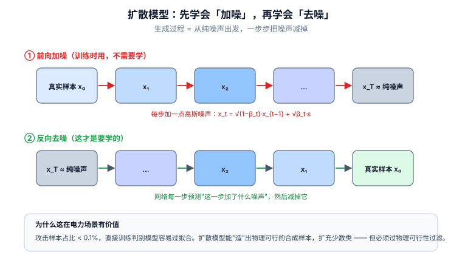

# 📘 第 11 周 · 生成模型与数据增强

> **本周目标**：上一周你学会了用拓扑结构提升模型，这一周解决另一个更根本的问题 —— **数据不够**。电网安全的攻击样本天然稀缺：真实攻击几乎无记录，仿真攻击是你自己造的，标注成本高、类别极不平衡。生成模型（VAE / GAN / 扩散）是目前最主流的数据增强手段。学完你应该能做到：写出 VAE 的重参数化技巧和 ELBO；说清 GAN 为什么会模式崩塌；理解扩散模型的加噪-去噪框架；**最关键的是 —— 能构造"满足 `Δz ∈ range(H)` 的物理可行攻击样本"**；并且能识别数据增强实验里那些会让结论完全失效的陷阱。
>
> **本周知识清单**：G 域 8 条（融入每天末尾的 ✅ 知识自查）
>
> **阶段位置**：第 10 周解决"结构"，本周解决"数据"。两者是第二阶段的两条腿 —— 前者让模型更懂问题，后者让模型有足够的东西可学。
>
> **使用方式**：在 Typora 中按标题折叠展开，每天读对应的小节即可。

[[深度学习学习总目录|← 返回总目录]]

---

## Day 68 —— 为什么需要生成模型：攻击样本稀缺的困境

> **一句话**：FDI 检测器的敌人从来不是"模型不够强"，而是**你手里只有几十个真的攻击样本，却有几十万条正常数据** —— 生成模型是应对这件事的一类手段，但不是唯一手段，也不是万能的。

### 一、把"稀缺"量化一下

**先看一组典型的实验数据规模**（你自己跑 Day 41 的 pipeline 时也会得到类似量级）：

| 类别 | 数量级 | 来源 |
|---|---|---|
| 正常量测 | 10⁴ ~ 10⁶ | 各种工况下跑潮流，随机采样负荷 |
| 攻击量测 | 10² ~ 10⁴ | 你自己用 `Δz = H·Δx` 构造 |
| **真实攻击记录** | **接近 0** | 电网的攻击事件不会公开量测数据 |

**注意第二行**：你造的"攻击样本"是**人造的**。它的分布取决于你的攻击模型假设 ——

```
你假设攻击者怎么改量测  →  你造出什么样的攻击样本  →  你的检测器学到什么
        ↑
   这一层如果错了，后面全错
```

**这就是"稀缺"的真正含义**：不是样本数量少，而是**你不知道真实攻击长什么样**。

### 二、应对类别不平衡的四条路

| 路线 | 做法 | 优点 | 缺点 |
|---|---|---|---|
| **① 算法层面** | 代价敏感损失（给少数类更大权重）、Focal Loss | 不改数据，简单可靠 | 样本太少时仍学不到模式 |
| **② 重采样** | 过采样少数类 / 欠采样多数类 / SMOTE | 实现成本最低 | 过采样容易过拟合；SMOTE 在时序数据上不适用 |
| **③ 仿真生成** | 用物理模型（`Δz = H·Δx`）造样本 | **物理上一定可行** | 攻击模式受限于你的假设 |
| **④ 生成模型** | VAE / GAN / 扩散模型学攻击分布，再采样 | 能生成"你没显式设计过"的模式 | 训练不稳定；生成样本可能不可行；容易泄漏 |

> **⚠️ 最重要的一句话**：
>
> **在电网场景里，路线 ③（仿真生成）通常比路线 ④（生成模型）更可靠。**
>
> 因为你**知道物理约束**（`H` 矩阵、潮流方程），而生成模型是从数据里"猜"约束 —— 猜错了你不知道。
>
> **生成模型的真正价值不是"替代仿真"，而是"在仿真样本的基础上扩充多样性"。**

### 三、生成模型的三种用途（要分清）

| 用途 | 做法 | 评估标准 |
|---|---|---|
| **数据增强** | 生成样本加入训练集，提升检测器性能 | **下游任务指标**（在真实测试集上的 PR-AUC） |
| **攻击生成** | 生成"最难检测"的攻击样本，压力测试检测器 | 攻击成功率 |
| **分布建模** | 学正常/异常分布，用似然或重构误差做检测 | 检测指标 |

**这三种用途的评估方式完全不同。** 很多论文把三者混在一起说，导致结论站不住。

**你这一周最该关心的是第一种（数据增强）** —— 因为它直接对应你的困境：攻击样本太少。

### 四、和电网安全的关系

**核心问题：生成模型生成的量测，物理上可行吗？**

回顾 Day 37 的 `z = Hx + e`。任何真实的量测都满足：

```
z ∈ range(H) + 噪声      （量测落在 H 的列空间附近）
```

**如果你直接用一个 GAN 生成 14 维量测向量，它极大概率不满足这个约束** —— 因为 GAN 只知道"这些数字的统计分布"，不知道"H 矩阵"。

```
❌ 直接生成 z_attack：
   数字看起来像量测（均值、方差都对），但组合起来违反潮流方程
   → 传统 BDD 一眼就抓住（残差巨大）
   → 这个"攻击样本"连第一道防线都过不去

✅ 先生成 Δx（状态偏移），再用 Δz = H·Δx 映射：
   Δx 是低维的（IEEE 14 只有 27 维），生成难度小
   映射之后自动满足物理约束（Day 72 展开）
```

**这张对比表就是本周的核心论点**：

| 做法 | 物理可行性 | 生成难度 | 检测难度 |
|---|---|---|---|
| 直接生成 `z` | ❌ 基本不可行 | 高（高维） | 低（BDD 能抓） |
| 生成 `Δx` 再映射 | ✅ **保证可行** | **低（低维）** | 高（BDD 抓不住） |
| 生成 `Δz` 后投影 | ✅ 可行 | 中 | 高 |

**一个诚实的边界**：

> **生成模型在电网安全里的价值，很可能被高估了。**
>
> 原因：你的"攻击样本"本来就是仿真的，仿真脚本比生成模型更可控、更可解释、更容易复现。生成模型能带来的额外价值是**"生成你没设计过的攻击模式"** —— 但这个价值需要实验证明，不能靠想象。
>
> **如果审稿人问"为什么不直接用仿真生成更多样本"，你必须答得上来。** 可能的答案：仿真只能覆盖你想到的攻击模式，而生成模型可以从少量真实/仿真样本中学到更丰富的模式 —— **但这句话需要实验支撑。**

### 🔍 延伸思考

1. 如果真实攻击样本接近 0，那"用生成模型学攻击分布"这件事本身是不是就无从谈起？（提示：你只能学到你有的那些样本的分布 —— 这限制了上限）
2. 代价敏感损失（路线①）几乎不需要额外工作。你会怎么设计实验，判断"生成模型带来的增益是否值得那些复杂度"？
3. 在电网上，"数据增强"应该增强哪一类数据？（提示：不只是攻击样本少 —— 正常样本里"罕见的正常工况"可能也少）

### 📚 参考

- 检索建议：搜 `data augmentation anomaly detection imbalanced`，看通用的不平衡处理手段
- 检索建议：搜 `generative model power system false data injection augmentation`，看有没有人做过
- 回顾 Day 13 的类别不平衡与 Day 27 的 PR-AUC（本周所有实验都要用这两个）

### 🎬 视频讲解

> 以下为**关键词检索式**推荐（平台搜索结果，非固定视频链接，避免失效）。
> 直接复制关键词到对应平台搜索即可，也可在结果里挑播放量高的看。

| 平台 | 推荐搜索关键词 | 说明 |
|---|---|---|
| **B站** | [生成模型 入门 讲解](https://search.bilibili.com/all?keyword=生成模型+入门+讲解) | 建立生成模型的整体地图 |
| **B站** | [数据增强 类别不平衡 处理](https://search.bilibili.com/all?keyword=数据增强+类别不平衡+处理) | 不平衡的四条路线 |
| **B站** | [SMOTE 过采样 讲解](https://search.bilibili.com/all?keyword=SMOTE+过采样+讲解) | 最经典的过采样方法 |
| **抖音** | [生成模型 是什么](https://www.douyin.com/search/生成模型+是什么) | 一分钟建立概念 |

### ✅ 知识自查

- [ ] 🟢 **概念** 攻击样本稀缺的真正含义（不是数量少，而是不知道真实攻击长什么样）
- [ ] 🟢 **概念** 应对不平衡的四条路线：代价敏感 / 重采样 / 仿真生成 / 生成模型
- [ ] 🟢 **判断** 在电网场景里，仿真生成为什么通常比生成模型更可靠
- [ ] 🟢 **概念** 生成模型的三种用途：数据增强 / 攻击生成 / 分布建模
- [ ] 🟢 **概念** 直接生成 `z` 为什么不满足 `z ∈ range(H)`
- [ ] 🟡 **判断** 生成模型在电网安全里的价值可能被高估（以及怎么用实验检验）
- [ ] 🟡 **判断** "为什么不直接用仿真生成更多样本"这个问题该怎么回答
- [ ] 🔴 **概念** 罕见正常工况的稀缺问题

---

## Day 69 —— VAE：潜空间与重参数化技巧

> **一句话**：VAE 做了两件事 —— **把编码器的输出从"一个点"变成"一个分布"**（这样潜空间才有结构、才能采样），以及**用重参数化技巧让"从分布里采样"这个操作可导**。

### 一、从自编码器到 VAE：差在哪里

**回顾 Day 26 的自编码器（AE）**：

```
x → 编码器 → z（一个点） → 解码器 → x̂
损失：||x - x̂||²
```

**AE 为什么不能生成**：

```
AE 的潜空间是"散乱"的 —— 训练数据里没出现过的 z，解码出来可能是垃圾
你随便采一个 z ~ N(0, I)，解码器根本不知道该怎么办
```

**VAE 的改动**：编码器不再输出一个点，而是输出**一个高斯分布的两个参数**：

```
x → 编码器 → μ(x), log σ²(x)   ← 注意是 log σ²，不是 σ²（见下面的坑）
从 N(μ, σ²) 中采样 → z → 解码器 → x̂
```

**这样一来，潜空间被"规整"了**：所有样本的 `μ` 都被拉向原点附近，`σ` 被约束在 1 附近 —— **任意采一个 `z ~ N(0, I)`，解码出来都像一个正常样本。**

### 二、ELBO：损失函数从哪来

**VAE 的目标是最大化数据的对数似然 `log p(x)`。** 但这个量直接算不出来（要对所有可能的 `z` 积分）。所以引入变分下界 ELBO：

```
log p(x) ≥ E_{q(z|x)}[ log p(x|z) ]  -  KL( q(z|x) || p(z) )
              └────── 重构项 ──────┘     └──── 正则项 ────┘
```

**两项的物理含义**：

| 项 | 作用 | 如果去掉会怎样 |
|---|---|---|
| **重构项** `E[log p(x\|z)]` | 让解码器能从 `z` 还原 `x` | 解码出来全是噪声 |
| **KL 项** `KL(q(z\|x) \|\| p(z))` | 把编码器输出的分布拉向标准正态 | 潜空间散乱，无法采样生成 |

**实际实现（高斯假设下）**：

```python
# 重构损失：假设 p(x|z) 是高斯 → 等价于 MSE
recon_loss = F.mse_loss(x_hat, x, reduction='sum')

# KL 损失：两个高斯之间的 KL，有闭式解
# KL(N(μ,σ²) || N(0,1)) = -0.5 * Σ (1 + log σ² - μ² - σ²)
kl_loss = -0.5 * torch.sum(1 + logvar - mu.pow(2) - logvar.exp())

loss = recon_loss + beta * kl_loss      # beta 默认 1
```

> **`beta` 是个可调的旋钮**（这就是 β-VAE 的来源）：
> - `beta < 1` → 更看重重构 → 生成样本更像训练数据，但潜空间结构差
> - `beta > 1` → 更看重正则 → 潜空间更规整，但重构变模糊

### 三、重参数化技巧：让采样可导

**问题**：

```
z ~ N(μ, σ²)    ← 采样操作本身是随机的，梯度传不回去
```

**解法（重参数化）**：

```
z = μ + σ ⊙ ε,   ε ~ N(0, I)
```

**为什么这样就可行**：

```
随机性被"搬"到了 ε 上 —— ε 与参数 (μ, σ) 无关
于是 z 对 μ 和 σ 是可导的：
    ∂z/∂μ = 1        ∂z/∂σ = ε
```

**代码（这就是 VAE 的全部核心）**：

```python
import torch
import torch.nn as nn
import torch.nn.functional as F

class VAE(nn.Module):
    def __init__(self, in_dim, hidden, latent):
        super().__init__()
        self.enc = nn.Sequential(nn.Linear(in_dim, hidden), nn.ReLU())
        self.fc_mu = nn.Linear(hidden, latent)
        self.fc_logvar = nn.Linear(hidden, latent)      # 注意输出 log σ²
        self.dec = nn.Sequential(
            nn.Linear(latent, hidden), nn.ReLU(),
            nn.Linear(hidden, in_dim),
        )

    def encode(self, x):
        h = self.enc(x)
        return self.fc_mu(h), self.fc_logvar(h)

    def reparameterize(self, mu, logvar):
        std = torch.exp(0.5 * logvar)          # σ = exp(0.5 * log σ²)
        eps = torch.randn_like(std)            # ε ~ N(0, I)
        return mu + std * eps                  # z = μ + σ ⊙ ε

    def forward(self, x):
        mu, logvar = self.encode(x)
        z = self.reparameterize(mu, logvar)
        return self.dec(z), mu, logvar


def vae_loss(x, x_hat, mu, logvar, beta=1.0):
    recon = F.mse_loss(x_hat, x, reduction='sum')
    kl = -0.5 * torch.sum(1 + logvar - mu.pow(2) - logvar.exp())
    return recon + beta * kl
```

> **⚠️ 为什么输出 `log σ²` 而不是 `σ²`**：`σ²` 必须为正，而线性层的输出可正可负。用 `log σ²` 就自动保证了 `σ² = exp(log σ²) > 0`。**这是新手最常写错的地方**（写成 `fc_std` 然后忘记保证正性，训练会崩）。

**⚠️ 数值稳定性**：`logvar.exp()` 在 `logvar` 很大时会溢出。工程上通常 `clamp` 一下：

```python
logvar = torch.clamp(logvar, -10, 10)
```

### 四、和电网安全的关系

**VAE 在电网安全里有两个用法，一个常见、一个被高估。**

**用法一：用重构误差做异常检测（常见）**

```
只用正常量测训练 VAE → 正常样本重构误差小，攻击样本重构误差大
```

**但这里有一个必须知道的坑**：

> **VAE 的重构误差对"小幅攻击"往往不敏感。**
>
> 原因是 VAE 的 KL 项会迫使模型学一个"平滑"的潜空间。**输入一个略有异常的量测，VAE 倾向于把它"重构回正常值"** —— 重构误差反而不大。
>
> 这个现象和 Day 26 讲的自编码器异常检测是同一个问题，只是 VAE 更严重（因为 KL 项的平滑作用）。
>
> **所以：如果攻击强度小（`||Δx||` 小），VAE 重构误差法的检测能力可能明显不如简单的统计方法。** 这一点文献里有讨论，值得你自己做实验验证。

**用法二：生成攻击样本做数据增强（被高估）**

| 问题 | 说明 |
|---|---|
| **VAE 生成的样本偏"模糊"** | 重构损失是 MSE，等价于在像素/特征空间求均值 → 生成的样本趋向"平均样本"，多样性不足 |
| **直接生成量测会破坏物理约束** | 必须用 Day 72 的"生成 Δx 再映射"路线 |
| **潜空间维度选择困难** | 潜空间太小 → 学不到模式；太大 → 退化成普通 AE |

**一个可以做的对比实验**：

```
实验：VAE 生成样本做增强 vs 简单方法
  ① 基线：不做任何增强（只有原始攻击样本）
  ② SMOTE 过采样
  ③ 加高斯噪声的粗糙增强
  ④ VAE 生成样本增强
  ⑤ 纯仿真生成（Day 41 的 pipeline 多跑一些工况）

评估：在"真实"测试集（不参与任何生成过程）上的 PR-AUC
```

> **诚实预测**：在电网量测这种**低维、有强物理约束**的数据上，**⑤ 很可能最强，① 和 ③ 未必比 ④ 差多少。**
>
> **如果跑出来确实是这个结果，那它本身就是有价值的结论** —— 它说明"在物理模型已知的场景里，生成模型的数据增强收益有限"。这种诚实的负面结果，比硬凹一个"VAE 提升了 3%"要值钱。

### 🔍 延伸思考

1. 如果把 KL 项的权重 `beta` 设为 0，VAE 会退化成什么？还能采样生成吗？
2. 为什么 VAE 生成的样本通常比 GAN 模糊？（提示：从损失函数的形状想 —— MSE 对"不确定"的惩罚方式）
3. 用 VAE 做异常检测时，异常分数可以用"重构误差"，也可以用"ELBO"或"KL 项"。三者会给出不同的排序吗？哪个更适合电网场景？

### 📚 参考

- Kingma & Welling (2014), *Auto-Encoding Variational Bayes* —— [arXiv:1312.6114](https://arxiv.org/abs/1312.6114)
- Doersch (2016), *Tutorial on Variational Autoencoders* —— [arXiv:1606.05908](https://arxiv.org/abs/1606.05908)（**入门首选，比原论文好懂**）
- 检索建议：搜 `variational autoencoder anomaly detection limitations`，看 VAE 做异常检测的已知问题

### 🎬 视频讲解

> 以下为**关键词检索式**推荐（平台搜索结果，非固定视频链接，避免失效）。
> 直接复制关键词到对应平台搜索即可，也可在结果里挑播放量高的看。

| 平台 | 推荐搜索关键词 | 说明 |
|---|---|---|
| **B站** | [VAE 变分自编码器 讲解 推导](https://search.bilibili.com/all?keyword=VAE+变分自编码器+讲解+推导) | ELBO 的完整推导 |
| **B站** | [重参数化技巧 讲解](https://search.bilibili.com/all?keyword=重参数化技巧+讲解) | 为什么采样可以可导 |
| **B站** | [变分推断 ELBO 讲解](https://search.bilibili.com/all?keyword=变分推断+ELBO+讲解) | 补贝叶斯推断的基础 |
| **抖音** | [变分自编码器 是什么](https://www.douyin.com/search/变分自编码器+是什么) | 三分钟建立直觉 |

### ✅ 知识自查

- [ ] 🟢 **概念** AE 为什么不能生成（潜空间无结构）
- [ ] 🟢 **概念** VAE 的编码器输出 `μ` 和 `log σ²` 而不是一个点
- [ ] 🟢 **推导** ELBO 的两项：重构项 + KL 项，各自的物理含义
- [ ] 🟢 **推导** 重参数化 `z = μ + σ ⊙ ε`，以及为什么它让采样可导
- [ ] 🟢 **实践** 写出完整的 VAE（编码器 / 重参数化 / 解码器 / 损失）
- [ ] 🟢 **实践** KL 项的闭式解 `-0.5 * Σ(1 + logσ² - μ² - σ²)`
- [ ] 🟡 **判断** VAE 重构误差对小幅攻击不敏感，以及原因
- [ ] 🔴 **概念** β-VAE 中 `beta` 旋钮的作用

---

## Day 70 —— GAN：生成器与判别器的博弈

> **一句话**：GAN 把"生成"变成了一个**对抗游戏** —— 生成器负责骗，判别器负责拆穿，两者互相逼着进步。**但这个游戏的平衡极难维持，训练不稳定和模式崩塌是常态，不是意外。**

### 一、博弈框架

```
生成器 G：输入噪声 z ~ N(0, I) → 输出假样本 G(z)
判别器 D：输入样本 x → 输出"真"的概率 D(x) ∈ (0, 1)

目标（min-max）：
    min_G max_D  E_{x~p_data}[ log D(x) ]  +  E_{z~p_z}[ log(1 - D(G(z))) ]
```

**直观理解**：

| 角色 | 目标 | 训练时的梯度来源 |
|---|---|---|
| **D** | 尽量把真样本判为真、假样本判为假 | 直接来自上面的目标 |
| **G** | 尽量让 `D(G(z))` 接近 1（骗过 D） | 只通过 D 反传（**G 看不到真实数据！**） |

> **这一条很关键**：**G 从来没有"见过"真实数据，它只知道"D 觉得像不像"。** 这既是 GAN 强大的原因（能学到难以显式建模的分布），也是它不稳定的原因（D 的判断可能有偏，G 会朝偏的方向狂奔）。

### 二、训练不稳定：两种典型病症

**病症一：模式崩塌（Mode Collapse）**

```
G 发现"只生成某一类样本"就能骗过 D
→ 所有 z 都映射到同一个输出
→ D 很快学会"凡是这种样本就是假的"
→ G 又跳到另一个模式
→ 循环往复，永远学不全整个分布
```

**在电网场景下的后果**：

```
模式崩塌 = 生成器只会造一种攻击
→ 你用它做数据增强，检测器只见到这一种攻击
→ 检测器在"这种攻击"上表现极好，在别的攻击上依然瞎
→ 你以为你的方法很有效，其实是在一个被简化的问题上自嗨
```

**⚠️ 这是 GAN 数据增强最危险的失败模式 —— 而且它不会报错，指标甚至可能变好。**

**病症二：梯度消失**

```
D 太强 → D(G(z)) ≈ 0 → log(1 - D(G(z))) ≈ 0 → G 的梯度趋近 0 → G 学不动
D 太弱 → G 随便生成都能骗过 → G 也学不到东西
```

**判别器的平衡是最难调的部分。**

### 三、三个关键的改进

**改进一：WGAN —— 换一个距离度量**

原始 GAN 用 JS 散度衡量两个分布的差异。**当两个分布没有重叠时，JS 散度是常数，梯度为 0** —— 这就是梯度消失的数学根源。

WGAN 改用 **Wasserstein 距离**（推土机距离），即使分布不重叠也能提供有意义的梯度：

```
WGAN 的损失（判别器改叫"critic"，不输出概率，输出一个实数分数）：
    L_D = E[D(fake)] - E[D(real)]
    L_G = -E[D(fake)]
约束：D 必须满足 1-Lipschitz 连续性
```

**改进二：WGAN-GP —— 用梯度惩罚替代权重裁剪**

```
原始 WGAN 用"把权重裁到 [-c, c]"来近似 Lipschitz 约束 → 效果差、调参难
WGAN-GP 改为惩罚判别器梯度的范数：
    penalty = λ · E[( ||∇_x̂ D(x̂)||₂ - 1 )²]
其中 x̂ 是真实样本和生成样本之间的随机插值
```

**改进三：条件 GAN（cGAN）—— 按标签生成**

```
把标签 y 也喂给 G 和 D：
    G(z, y) → 生成"类别 y"的样本
    D(x, y) → 判断"x 是否属于类别 y 且真实"
```

**cGAN 对电网场景特别有用**：你可以指定"生成第 3 类攻击的样本"，而不是随机生成。

### 四、和电网安全的关系

**cGAN 造攻击样本的完整流程**：

```python
import torch
import torch.nn as nn

class Generator(nn.Module):
    def __init__(self, z_dim, n_classes, out_dim, hidden=128):
        super().__init__()
        self.emb = nn.Embedding(n_classes, 16)          # 标签嵌入
        self.net = nn.Sequential(
            nn.Linear(z_dim + 16, hidden), nn.ReLU(),
            nn.Linear(hidden, hidden), nn.ReLU(),
            nn.Linear(hidden, out_dim),
        )

    def forward(self, z, y):
        return self.net(torch.cat([z, self.emb(y)], dim=1))


class Discriminator(nn.Module):
    def __init__(self, in_dim, n_classes, hidden=128):
        super().__init__()
        self.emb = nn.Embedding(n_classes, 16)
        self.net = nn.Sequential(
            nn.Linear(in_dim + 16, hidden), nn.LeakyReLU(0.2),
            nn.Linear(hidden, hidden), nn.LeakyReLU(0.2),
            nn.Linear(hidden, 1),                        # WGAN-GP 下不接 sigmoid
        )

    def forward(self, x, y):
        return self.net(torch.cat([x, self.emb(y)], dim=1))


def gradient_penalty(D, real, fake, y, device='cpu'):
    """WGAN-GP 的梯度惩罚项"""
    alpha = torch.rand(real.size(0), 1, device=device)
    interp = (alpha * real + (1 - alpha) * fake).requires_grad_(True)
    score = D(interp, y)
    grad = torch.autograd.grad(
        outputs=score, inputs=interp,
        grad_outputs=torch.ones_like(score),
        create_graph=True, retain_graph=True,
    )[0]
    return ((grad.norm(2, dim=1) - 1) ** 2).mean()
```

**但你必须先回答三个问题**（写进论文里）：

| 问题 | 为什么重要 |
|---|---|
| **生成什么？** 直接生成量测 `z`，还是生成状态偏移 `Δx`？ | 直接生成 `z` 会破坏物理约束（Day 68 / 72） |
| **生成几类？** 单一攻击类型还是多种？ | 单一类型 → 模式崩塌的后果更隐蔽 |
| **怎么验证没崩塌？** | 必须做多样性检查（Day 74） |

**一个诚实的判断**：

> **在电网量测这种低维（IEEE 14 约 50-100 维）、有强物理约束的数据上，GAN 的优势不明显。**
>
> 原因：
> 1. **维度低** —— 高维图像的复杂分布才需要 GAN 这种强表达力模型，低维数据的分布用简单方法（高斯混合、KDE）就能拟合得不错
> 2. **约束强** —— 生成样本必须落在 `range(H)` 附近，GAN 不知道这个约束
> 3. **训练不稳定** —— 你需要额外花时间调参、检查崩塌，投入产出比可能不高
>
> **所以：如果你要上 GAN，理由不能是"GAN 很流行"，而必须是"我做了对比实验，GAN 比 SMOTE / 高斯噪声 / 纯仿真更好"。**

### 🔍 延伸思考

1. 模式崩塌为什么"不会报错、甚至指标变好"？你会设计什么检查来发现它？（提示：看生成样本之间的相似度）
2. 在 WGAN-GP 里，梯度惩罚的 `λ` 取多大合适？如果 `λ` 太大或太小，分别会发生什么？
3. 如果攻击者有动机"让检测器只对某一种攻击敏感"（这样其他攻击就能得逞），那用 GAN 做数据增强反而可能被利用。这个攻击面你怎么建模？

### 📚 参考

- Goodfellow et al. (2014), *Generative Adversarial Networks* —— [arXiv:1406.2661](https://arxiv.org/abs/1406.2661)
- Arjovsky et al. (2017), *Wasserstein GAN* —— [arXiv:1701.07875](https://arxiv.org/abs/1701.07875)
- Gulrajani et al. (2017), *Improved Training of Wasserstein GANs*（WGAN-GP）—— [arXiv:1704.00028](https://arxiv.org/abs/1704.00028)
- Mirza & Osindero (2014), *Conditional Generative Adversarial Nets*（cGAN）—— [arXiv:1411.1784](https://arxiv.org/abs/1411.1784)

### 🎬 视频讲解

> 以下为**关键词检索式**推荐（平台搜索结果，非固定视频链接，避免失效）。
> 直接复制关键词到对应平台搜索即可，也可在结果里挑播放量高的看。

| 平台 | 推荐搜索关键词 | 说明 |
|---|---|---|
| **B站** | [GAN 原理 讲解 推导](https://search.bilibili.com/all?keyword=GAN+原理+讲解+推导) | min-max 博弈的完整推导 |
| **B站** | [GAN 训练不稳定 模式崩塌 讲解](https://search.bilibili.com/all?keyword=GAN+训练不稳定+模式崩塌+讲解) | 最常见的两种病症 |
| **B站** | [WGAN 讲解 梯度惩罚](https://search.bilibili.com/all?keyword=WGAN+讲解+梯度惩罚) | 从 JS 散度到 Wasserstein 距离 |
| **抖音** | [GAN 是什么](https://www.douyin.com/search/GAN+是什么) | 三分钟建立直觉 |

### ✅ 知识自查

- [ ] 🟢 **概念** GAN 的 min-max 目标函数，以及 G 和 D 各自的梯度来源
- [ ] 🟢 **概念** G 看不到真实数据（只通过 D 反传），这是不稳定性的根源
- [ ] 🟢 **概念** 模式崩塌：现象、成因、**在数据增强里的隐蔽危害**
- [ ] 🟢 **概念** 梯度消失的数学根源（JS 散度在分布不重叠时为常数）
- [ ] 🟢 **概念** WGAN 用 Wasserstein 距离替代 JS 散度，WGAN-GP 用梯度惩罚替代权重裁剪
- [ ] 🟢 **实践** 写出 cGAN 的生成器 / 判别器 / 梯度惩罚
- [ ] 🟡 **判断** 为什么 GAN 在低维、强约束的电网量测上优势不明显
- [ ] 🔴 **概念** 判别器（critic）在 WGAN 里不输出概率，输出实数分数

---

## Day 71 —— 扩散模型：从加噪到去噪

> **一句话**：扩散模型把"生成"拆成两步 —— **前向过程一步步把数据加噪成纯噪声（这一步没有参数），反向过程学一个网络一步步把噪声去回去（这一步才是要学的）。**

### 一、前向过程：加噪（无参数）

```
x_0 → x_1 → x_2 → ... → x_T ≈ N(0, I)
```

**每一步加一点高斯噪声**：

```
q(x_t | x_{t-1}) = N( x_t ;  sqrt(1 - β_t) · x_{t-1},  β_t · I )
```

其中 `β_t` 是预设的噪声调度（通常从 `1e-4` 线性或余弦增长到 `0.02`）。

**关键性质：可以直接跳到任意时刻 `t`**（不用一步步迭代）：

```
q(x_t | x_0) = N( x_t ;  sqrt(ᾱ_t) · x_0,  (1 - ᾱ_t) · I )
其中 ᾱ_t = Π_{s=1}^{t} (1 - β_s)

等价写法：x_t = sqrt(ᾱ_t) · x_0 + sqrt(1 - ᾱ_t) · ε,   ε ~ N(0, I)
```

> **这个闭式解极其重要** —— 它让训练变成"随机采一个 `t`，一次性算出 `x_t`"，不需要跑完整条链。

**当 `T` 足够大（比如 1000）时，`ᾱ_T ≈ 0`，`x_T` 就接近纯噪声。**

### 二、反向过程：去噪（要学的部分）

```
p_θ(x_{t-1} | x_t) = N( x_{t-1} ;  μ_θ(x_t, t),  Σ_θ(x_t, t) )
```

**训练目标（DDPM 的核心简化）**：不直接预测 `μ`，而是**预测加进去的那个噪声 `ε`**：

```
L_simple = E_{t, x_0, ε} [ || ε - ε_θ( x_t, t )||² ]
其中 x_t = sqrt(ᾱ_t) · x_0 + sqrt(1 - ᾱ_t) · ε
```

**翻译成人话**：

```
① 随机取一个干净样本 x_0
② 随机取一个时间步 t
③ 随机采噪声 ε，算出 x_t = sqrt(ᾱ_t)·x_0 + sqrt(1-ᾱ_t)·ε
④ 让网络看着 (x_t, t)，预测"你被加进去的噪声是 ε 吗"
⑤ 损失 = 预测噪声和真实噪声的 MSE
```

**就这么简单。** 整个训练过程就是一个带时间条件的回归任务。

```python
import torch
import torch.nn as nn
import torch.nn.functional as F

class SimpleDenoiser(nn.Module):
    """极简去噪网络：输入 (x_t, t)，输出预测噪声"""
    def __init__(self, in_dim, hidden=256, t_emb=32):
        super().__init__()
        self.t_emb = nn.Embedding(1000, t_emb)
        self.net = nn.Sequential(
            nn.Linear(in_dim + t_emb, hidden), nn.SiLU(),
            nn.Linear(hidden, hidden), nn.SiLU(),
            nn.Linear(hidden, in_dim),
        )

    def forward(self, x_t, t):
        return self.net(torch.cat([x_t, self.t_emb(t)], dim=1))


def make_schedule(T=1000, beta_start=1e-4, beta_end=0.02):
    betas = torch.linspace(beta_start, beta_end, T)
    alphas = 1.0 - betas
    alpha_bars = torch.cumprod(alphas, dim=0)      # ᾱ_t
    return betas, alpha_bars


def train_step(model, x0, alpha_bars, T, opt):
    B = x0.size(0)
    t = torch.randint(0, T, (B,))
    eps = torch.randn_like(x0)
    ab = alpha_bars[t].unsqueeze(1)
    x_t = ab.sqrt() * x0 + (1 - ab).sqrt() * eps    # 闭式加噪
    eps_pred = model(x_t, t)
    loss = F.mse_loss(eps_pred, eps)
    opt.zero_grad(); loss.backward(); opt.step()
    return loss.item()
```

**采样（推理）时**要一步步从 `x_T` 走到 `x_0`：

```
for t = T-1 down to 0:
    x_{t-1} = (1/sqrt(α_t)) · ( x_t - (β_t / sqrt(1-ᾱ_t)) · ε_θ(x_t, t) ) + σ_t · z
    其中 z ~ N(0, I)（t > 0 时），t = 0 时不加噪声
```

> **⚠️ 采样慢是扩散模型最大的工程问题**：`T = 1000` 就要跑 1000 次前向。这是后续大量加速工作（DDIM、蒸馏、一致性模型）的动机。



> **看图说话**：上图两行对应扩散模型的两个过程。**① 前向加噪**：从真实样本 `x₀` 出发，每一步加一点高斯噪声，`x_t = √(1−β_t)·x_{t−1} + √β_t·ε`，走足够多步后变成纯噪声。**这个过程不需要学** —— 它是固定的马尔可夫链，公式写死在代码里。**② 反向去噪**：从纯噪声出发一步步往回走，**网络要学的就是“这一步加了多少噪声”，然后把它减掉**。注意两条链的方向差异：前向是逐步“毁掉”结构，反向是逐步“长出”结构。底框说明了它在电力场景的价值：攻击样本占比常常低于 0.1%，直接训判别模型容易过拟合，扩散模型能“造”出合成样本扩充少数类。**但必须过物理可行性过滤** —— 造出来的量测如果违反潮流方程，那就是往数据集里加脏数据。


### 三、和 VAE / GAN 的对比

| 维度 | VAE | GAN | 扩散模型 |
|---|---|---|---|
| **训练稳定性** | ✅ 稳定（有明确损失） | ❌ 不稳定（博弈） | ✅ **稳定**（就是回归） |
| **生成质量** | ⚠️ 偏模糊 | ✅ 锐利 | ✅ **最好** |
| **多样性** | ✅ 好 | ❌ 模式崩塌风险 | ✅ **好** |
| **采样速度** | ✅ 一次前向 | ✅ 一次前向 | ❌ **慢（T 次前向）** |
| **似然可算** | ✅ ELBO | ❌ | ✅ 有变分下界 |
| **调参难度** | 低 | 高 | 中 |

**一句话总结**：**扩散模型用"采样慢"换来了"训练稳 + 质量高 + 多样性好"。**

### 四、和电网安全的关系

**扩散模型在电网量测这种低维数据上，情况比较微妙。**

| 因素 | 对扩散模型有利？ |
|---|---|
| **维度低（~50-100 维）** | ⚠️ **不利**。扩散模型的优势在高维复杂分布（图像 512×512×3 ≈ 786k 维）；低维数据的分布用更简单的方法就能拟合 |
| **训练稳定** | ✅ 有利。不需要像 GAN 那样反复调参 |
| **样本量小** | ⚠️ 不利。扩散模型参数量大，小数据上容易过拟合 |
| **物理约束** | ❌ 不感知。和 GAN 一样，生成出来不保证落在 `range(H)` |
| **生成速度慢** | ⚠️ 做数据增强要生成几千个样本，1000 步采样 × 几千次 = 很慢 |

**文献现状（需要你自己去查证）**：

> 扩散模型在**表格数据**（tabular data）上的工作已经有一些（搜 `diffusion model tabular data`、`TabDDPM`），在**时间序列生成**上也有（搜 `diffusion model time series generation`）。
>
> 但**在"电网量测 + FDI 攻击样本生成"这个具体交叉点上，公开工作相对少。**
>
> **这是一个"可能有机会、也可能因为不 work 所以没人做"的方向。** 你在投入之前，先用第一遍法筛 10 篇相关工作，判断是"没人想到"还是"试过了不行"。

**一个务实的建议**：

```
不要一上来就上扩散模型。按这个顺序试：
  ① 高斯噪声增强（最简单，几乎零成本）
  ② SMOTE / 简单重采样
  ③ 条件采样（按攻击强度分档生成）
  ④ VAE / GAN / 扩散（成本递增）

如果 ① ② 已经能把 PR-AUC 提升到接近上限，后面几步就没有意义。
```

### 🔍 延伸思考

1. 前向加噪过程没有可学习参数，为什么还需要它？能不能直接学一个"从噪声到数据"的一次性映射（那就是 GAN 的 G）？
2. 扩散模型的损失是 MSE（预测噪声）。为什么预测噪声比预测 `x_0` 或预测 `μ` 效果更好？（提示：看不同 `t` 下的信号噪声比）
3. 如果只有 1000 个攻击样本，你会用扩散模型吗？如果用，怎么防止过拟合？（提示：模型要小、早停、加正则）

### 📚 参考

- Ho et al. (2020), *Denoising Diffusion Probabilistic Models*（DDPM）—— [arXiv:2006.11239](https://arxiv.org/abs/2006.11239)
- Song et al. (2021), *Score-Based Generative Modeling through Stochastic Differential Equations* —— [arXiv:2011.13456](https://arxiv.org/abs/2011.13456)
- Dhariwal & Nichol (2021), *Diffusion Models Beat GANs on Image Synthesis* —— [arXiv:2105.05233](https://arxiv.org/abs/2105.05233)
- 检索建议：搜 `diffusion model tabular data` / `diffusion model time series generation`，看在结构化数据上的做法

### 🎬 视频讲解

> 以下为**关键词检索式**推荐（平台搜索结果，非固定视频链接，避免失效）。
> 直接复制关键词到对应平台搜索即可，也可在结果里挑播放量高的看。

| 平台 | 推荐搜索关键词 | 说明 |
|---|---|---|
| **B站** | [扩散模型 原理 讲解 推导](https://search.bilibili.com/all?keyword=扩散模型+原理+讲解+推导) | 加噪-去噪的完整框架 |
| **B站** | [DDPM 讲解 公式推导](https://search.bilibili.com/all?keyword=DDPM+讲解+公式推导) | 逐行拆解 DDPM |
| **B站** | [扩散模型 时间序列 生成 讲解](https://search.bilibili.com/all?keyword=扩散模型+时间序列+生成+讲解) | 在非图像数据上的应用 |
| **抖音** | [扩散模型 是什么](https://www.douyin.com/search/扩散模型+是什么) | 三分钟建立直觉 |

### ✅ 知识自查

- [ ] 🟢 **概念** 前向加噪过程（无参数）与反向去噪过程（要学）
- [ ] 🟢 **推导** 闭式加噪 `x_t = sqrt(ᾱ_t)·x_0 + sqrt(1-ᾱ_t)·ε`，以及为什么它让训练变简单
- [ ] 🟢 **推导** DDPM 的简化损失 `||ε - ε_θ(x_t, t)||²`
- [ ] 🟢 **实践** 写出去噪网络 + 噪声调度 + 训练步
- [ ] 🟢 **概念** 采样需要 `T` 次前向，这是扩散模型最大的工程瓶颈
- [ ] 🟢 **概念** VAE / GAN / 扩散在稳定性、质量、多样性、速度上的取舍
- [ ] 🟡 **判断** 扩散模型在低维、强约束的电网量测上优势为什么不明显
- [ ] 🔴 **概念** DDIM / 一致性模型等加速采样方法的存在

---

## Day 72 —— 用生成模型造攻击样本：物理可行性约束

> **一句话**：**不要生成量测，要生成状态偏移** —— `Δx` 是低维的、无约束的，而 `Δz = H·Δx` 会自动满足物理规律。**这是本周唯一一个你必须在论文里写清楚的技术决策。**

### 一、为什么"直接生成量测"是错的

**先做个实验（你可以在 Day 41 的代码上直接加几行）**：

```python
import numpy as np
import pandapower as pp
import pandapower.networks as pn

net = pn.case14(); pp.runpp(net)
z_real = np.concatenate([net.res_line['p_from_mw'].values,
                         net.res_bus['vm_pu'].values])

# 假设你用生成模型"直接生成"了一个假量测（这里用加噪模拟）
rng = np.random.default_rng(0)
z_fake = z_real + rng.normal(0, z_real.std() * 0.3, size=z_real.shape)

print(f"真实量测残差量级      : {np.abs(z_real).mean():.4f}")
print(f"假量测的偏离量级      : {np.abs(z_fake - z_real).mean():.4f}")
print("→ 这个偏离在统计上'看起来合理'，但它不满足 z ∈ range(H)")
```

**为什么这是致命的**：

```
你生成的假量测"数字上像量测"（均值、方差都对），但组合起来违反潮流方程
→ 用 BDD（残差检验）一扫就抓到，`||r||₂` 远超阈值
→ 这个"攻击样本"连第一道防线都过不去
→ 用这种样本训练的检测器，学到的是"检测容易的样本"
```

**这和 Day 39 批评的"随机扰动攻击"是同一个错误**，只是换了个生成方式。

### 二、正确路线：生成 `Δx`，映射到 `Δz`

```
攻击的物理定义：Δz = H · Δx
       ↑                ↑
    高维（m 个量测）   低维（n 个状态，IEEE 14 时 n = 27）

所以：先生成 Δx（低维、无约束），再映射成 Δz（自动满足 Δz ∈ range(H)）
```

**为什么这条路线更好**：

| 对比 | 生成 `Δz` | 生成 `Δx` 再映射 |
|---|---|---|
| 维度 | 高（m ≈ 50-100） | **低（n = 27）** |
| 需要满足的约束 | **必须落在 `range(H)` 里** | **无约束** |
| 物理可行性 | 不保证 | ✅ **数学上保证** |
| 绕过 BDD | 不保证 | ✅ **保证（`Δz = H·Δx` 残差不变）** |

**"低维 + 无约束"这两点，让 `Δx` 的生成难度大幅降低。** 你甚至不需要复杂的生成模型 —— 高斯混合、KDE、或者一个简单的条件 VAE 就够了。

### 三、三种实现方式（按推荐度排序）

**方式 1（推荐）：生成 `Δx`，再线性映射**

```python
import numpy as np

def sample_attack_from_dx(H, generator, n_samples, attack_strength=0.05):
    """
    生成物理可行的 FDI 攻击样本。
    H: [m, n] 量测矩阵
    generator: 任何能生成 Δx 的模型（或直接从分布采样）
    返回: Δz [n_samples, m]，满足 Δz = H·Δx
    """
    dz_list = []
    for _ in range(n_samples):
        # ① 采样一个状态偏移（低维、无约束）
        dx = generator()                                # [n]
        # ② 归一化到目标攻击强度（控制"可见性"）
        norm = np.linalg.norm(dx)
        if norm > 1e-8:
            dx = dx / norm * attack_strength
        # ③ 映射到量测空间（自动满足物理约束）
        dz_list.append(H @ dx)                          # [m]
    return np.stack(dz_list)


# 最简单的 generator：从高斯分布采样
def gaussian_dx(n, sigma=1.0):
    return np.random.default_rng().normal(0, sigma, size=n)


# 用法
# z_attack = z_normal + sample_attack_from_dx(H, lambda: gaussian_dx(n), 1000)
```

**方式 2：生成 `Δz`，然后投影回 `range(H)`**

```python
def project_to_range_H(dz, H):
    """
    把任意的 Δz 投影到 H 的列空间上。
    P = H (HᵀH)^(-1) Hᵀ  是投影矩阵（幂等：P² = P）
    """
    HtH_inv = np.linalg.pinv(H.T @ H)
    P = H @ HtH_inv @ H.T
    return P @ dz


# 用法：先让生成模型自由发挥，再投影
dz_raw = some_generator()                 # 任意生成
dz_valid = project_to_range_H(dz_raw, H)  # 投影后一定满足 Δz ∈ range(H)
```

> **⚠️ 投影的代价**：投影之后 `||Δz||` 会变小（甚至可能接近 0）。
>
> **如果投影后攻击强度被削弱了 90%，说明你的生成模型输出的方向大部分在 `range(H)` 之外** —— 也就是说，你的生成模型根本没学到物理约束。
>
> **这个"投影前后范数比"本身就是一个很好的评估指标**：
>
> ```
> ratio = ||P·Δz|| / ||Δz||
> ratio ≈ 1  → 生成模型已经隐含学到了物理约束（好）
> ratio ≈ 0  → 生成的东西和物理完全无关（生成模型没用）
> ```

**方式 3：把约束写进损失函数**

```python
# 在生成模型的损失里加一项"物理一致性惩罚"
loss = recon_loss + kl_loss + lam * torch.norm(dz - project(dz), dim=1).mean()
#                                              ↑ 强制 dz 靠近 range(H)
```

**为什么不推荐方式 3**：多了一个超参 `lam` 要调，而且**软约束不如硬约束可靠**（`lam` 调小了约束不生效，调大了影响其他损失项）。**能用硬约束（方式 1 / 2）就别用软约束。**

### 四、和电网安全的关系

**这张表是你论文里"攻击样本生成"这一节的骨架**：

| 生成方式 | 物理可行 | 绕过 BDD | 生成难度 | 论文里的定位 |
|---|---|---|---|---|
| 直接生成 `z` + 随机噪声 | ❌ | ❌ | 低 | **不要用**（Day 39 已批评过） |
| 生成 `Δz` 后投影 | ✅ | ✅ | 中 | 可作为对比方法 |
| **生成 `Δx` 再映射** | ✅ | ✅ | **低** | ✅ **推荐主方法** |
| 生成 `Δx` 再映射 + 对抗扰动 | ⚠️ 部分 | ⚠️ 部分 | 高 | 第 12 周的内容（物理可行 vs 对抗鲁棒的权衡） |

**三个必须写进论文的细节**：

```
① 攻击强度怎么控制？
   ‖Δx‖ 太大 → 量测明显越限，容易被规则/统计方法抓到
   ‖Δx‖ 太小 → 对状态估计的影响可忽略，攻击"没意义"
   → 通常做法：固定 ‖Δx‖，或在一个范围内扫描（画"攻击强度 vs 检测率"曲线）

② 攻击强度应该按什么单位衡量？
   - ‖Δx‖₂（绝对范数）      —— 简单，但不同系统不可比
   - ‖Δx‖ / ‖x‖（相对）     —— 跨系统可比，推荐
   - max|Δx_i|（最大偏移）   —— 物理上最直观（对应"相角偏了多少度"）

③ 生成的样本有多少是"有效攻击"？
   → 必须统计：生成 1000 个，有多少个真正让状态估计偏移超过阈值？
   → 如果有效率只有 10%，说明你的生成模型大部分输出是无用的
```

**一个诚实的技术边界**：

> **生成 `Δx` 再映射这条路线，本质上和"直接用仿真脚本随机采样 `Δx`"没有本质区别** —— 除非你的生成模型学到了**比随机采样更好的 `Δx` 分布**（比如"更容易被漏检的 `Δx`"）。
>
> **所以你的论文必须回答**：你的生成模型相比"随机采样 `Δx`"多带来了什么？
>
> 可能的答案：
> - 生成模型学到了真实攻击样本的分布特征（如果你有真实样本）
> - 生成模型能条件生成（按攻击强度、按目标节点指定）
> - 生成模型能生成"更隐蔽"的攻击（需要实验证明）
>
> **如果答不上来，那就老老实实说"我们用随机采样 `Δx`"** —— 这不是缺陷，反而更可复现、更容易被审稿人接受。

### 🔍 延伸思考

1. 投影矩阵 `P = H(HᵀH)^(-1)Hᵀ` 是幂等的（`P² = P`）。这个性质说明 `P` 的几何意义是什么？
2. 如果攻击者只能篡改部分量测（比如只能改 3 个），那么他生成的 `Δz` 还必须满足"只有 3 个分量非零"。这个约束怎么加进生成过程？
3. "攻击强度 vs 检测率"这条曲线，你预期它长什么样？如果检测率随攻击强度**不升反降**，说明了什么？

### 📚 参考

- Liu, Ning & Reiter (2009), *False Data Injection Attacks against State Estimation in Electric Power Grids*, ACM CCS —— `Δz = H·Δx` 的原始出处
- 检索建议：搜 `physically feasible adversarial attack power system`，看别人怎么处理物理约束
- 检索建议：搜 `constrained generation adversarial examples`，看通用的约束生成方法

### 🎬 视频讲解

> 以下为**关键词检索式**推荐（平台搜索结果，非固定视频链接，避免失效）。
> 直接复制关键词到对应平台搜索即可，也可在结果里挑播放量高的看。

| 平台 | 推荐搜索关键词 | 说明 |
|---|---|---|
| **B站** | [投影矩阵 列空间 讲解](https://search.bilibili.com/all?keyword=投影矩阵+列空间+讲解) | 理解"投影回 range(H)" |
| **B站** | [虚假数据注入 攻击 构造 FDI](https://search.bilibili.com/all?keyword=虚假数据注入+攻击+构造+FDI) | 回顾攻击的物理约束 |
| **B站** | [物理约束 生成模型 讲解](https://search.bilibili.com/all?keyword=物理约束+生成模型+讲解) | 约束生成的一般思路 |
| **抖音** | [生成对抗样本 是什么](https://www.douyin.com/search/生成对抗样本+是什么) | 一分钟建立概念 |

### ✅ 知识自查

- [ ] 🟢 **概念** 直接生成量测 `z` 为什么不满足物理约束（`z ∈ range(H)`）
- [ ] 🟢 **概念** 生成 `Δx` 再映射 `Δz = H·Δx` 的完整理由（低维 + 无约束 + 保证可行）
- [ ] 🟢 **实践** 写出 `sample_attack_from_dx(H, generator, ...)`
- [ ] 🟢 **实践** 写出投影函数 `P = H(HᵀH)^(-1)Hᵀ` 并用它把任意 `Δz` 投影回 `range(H)`
- [ ] 🟢 **实践** 计算"投影前后范数比"，作为生成模型是否学到物理约束的指标
- [ ] 🟡 **判断** 硬约束（方式 1/2）比软约束（方式 3）更可靠，以及原因
- [ ] 🟡 **判断** 攻击强度的三种度量方式（绝对 / 相对 / 最大偏移）及各自的适用场景
- [ ] 🔴 **判断** "生成模型相比随机采样 `Δx` 多带来了什么"这个问题怎么回答

---

## Day 73 —— 数据增强的陷阱：合成样本真的有用吗

> **一句话**：数据增强的实验里，**最常见的错误不是方法不够好，而是评估方式有问题** —— 生成器在测试数据上训过、只报不平衡指标、只跟"不增强"比而不跟"简单增强"比，这三条任一都能让结论完全失效。

### 一、合成样本有效的三个前提

**不是"生成样本越多越好"，而是必须同时满足三条**：

| 前提 | 含义 | 违反的后果 |
|---|---|---|
| **① 分布匹配** | 合成样本的分布要接近真实样本 | 学到的模式不适用 |
| **② 标签正确** | 合成样本的标签必须无误 | 引入噪声标签，模型学坏 |
| **③ 多样性足够** | 覆盖真实的模式空间 | 模式崩塌 → 检测器只对一种攻击有效 |

**三条里最容易违反的是第 ③ 条** —— 而且它不会报错，指标甚至可能变好（Day 70 讲过）。

### 二、三个会毁掉实验的坑

**坑 1：数据泄漏 —— 在测试集上生成/训练生成器**

```
❌ 错误流程：
   全部数据 → 训生成器 → 生成合成样本 → 混合 → 划分训练/测试
                                          ↑
                         合成样本来自"未来的测试数据"，严重泄漏

✅ 正确流程：
   全部数据 → 先划分训练/测试
   只用训练集 → 训生成器 → 生成合成样本
   训练集 + 合成样本 → 训练检测器
   测试集（从头到尾没参与任何生成过程）→ 评估
```

> **这个错误在生成模型类论文里非常常见。** 原因很实际：很多人先做数据预处理（包括增强），后划分数据集。**顺序反了，结论就废了。**
>
> **自查方法**：在你的代码里搜一遍，确认"测试集变量"从未出现在生成器或检测器的训练代码里。

**坑 2：只报不平衡指标，不报绝对性能**

```
❌ "用了生成样本后，PR-AUC 从 0.62 提升到 0.71"
   → 但如果你的检测器在"简单多数类"上本来就有 0.95 的表现呢？
   → 这个 0.71 是真的进步，还是把模型拉向了一个更容易但没用的方向？
```

**必须同时报**：

| 指标 | 作用 |
|---|---|
| **PR-AUC（攻击类）** | 不平衡下的核心指标 |
| **F1 / 精确率 / 召回率** | 实际部署关心的权衡 |
| **误报率 @ 固定召回率** | 工程上最有用（"我要抓到 90% 的攻击，会误报多少"） |
| **在多数类（正常）上的表现** | 确认没有为了少数类牺牲多数类 |

**坑 3：只跟"不增强"比，不跟"简单增强"比**

```
❌ 消融阶梯（不够）：
   不增强 → 用我的生成模型增强
   ↑ 这个对比说明不了"生成模型有用"，只说明"加数据有用"

✅ 消融阶梯（够）：
   ① 不增强（只有原始攻击样本）
   ② 加高斯噪声（最粗糙的增强）
   ③ SMOTE / 简单重采样
   ④ 纯仿真多采样（多跑一些工况）
   ⑤ 我的生成模型
```

> **如果 ② 或 ③ 就已经达到 ⑤ 的效果，那你的生成模型没有存在价值。**
>
> **这个消融是审稿人一定会问的。** 主动做，比被审稿人问出来好。

### 三、一个正确的实验设计模板

```markdown
# 数据增强实验设计

## 数据划分（顺序绝对不能反）
1. 生成原始数据：pandapower 采样 N 个工况，每个工况跑潮流
2. 构造攻击样本：Δx ~ 某分布，Δz = H·Δx
3. **先划分**：训练集 70% / 验证集 15% / 测试集 15%（按工况划分，不随机打散）
4. **只在训练集上**训练生成器
5. 用生成器扩充训练集 → 得到"增强训练集"

## 对比方法（必须齐全）
| 编号 | 方法 | 说明 |
|---|---|---|
| ① | 不增强 | 基线 |
| ② | 高斯噪声增强 | 最粗糙 |
| ③ | SMOTE / 随机过采样 | 经典重采样 |
| ④ | 纯仿真多采样 | 用物理模型造更多样本 |
| ⑤ | 我的生成模型 | 待验证的方法 |

## 评估
- 在**固定的测试集**上评估（测试集从未参与任何生成）
- 5 个随机种子，报均值 ± 标准差
- 指标：PR-AUC、F1、误报率@90%召回

## 必做的额外检查
- [ ] 生成样本的多样性（Day 74 的覆盖率指标）
- [ ] 生成样本的物理可行性（投影前后范数比）
- [ ] 训练集/测试集的工况分布是否重叠（避免"测试集工况训练时没见过"）
```

### 四、和电网安全的关系

**电网场景有两个特殊的数据增强陷阱。**

**陷阱 A：工况分布偏移被误认为"增强有效"**

```
如果你的训练集只覆盖"轻负荷"工况，测试集包含"重负荷"工况，
那么：
  ① 用重负荷工况生成的合成样本去增强训练集
  ② 检测器在测试集上表现提升
  → 你以为"生成模型有效"
  → 实际上是"你偷偷把测试工况的信息泄漏进了训练集"
```

**处理方式**：**生成器只能用训练集工况的数据训练**，且论文里要说明"训练和测试的工况覆盖范围"。

**陷阱 B：物理可行性被"增强"破坏**

```
如果你用生成模型直接生成量测（Day 72 说的错误做法），
生成的"攻击样本"大部分不满足 Δz ∈ range(H)

结果：
  ① 检测器在这些样本上学到"识别不满足物理约束的异常"
  ② 但真实攻击恰恰是满足物理约束的（否则 BDD 就抓到了）
  ③ 检测器在真实测试集上表现很差
  → 你在一个错误的任务上取得了很好的成绩
```

**处理方式**：**生成样本必须通过物理可行性检查**（投影前后范数比 > 0.9，或者残差范数在合理范围内）。

**一个诚实的判断**：

> **在电网场景里，"数据增强"的收益很可能来自"仿真多采样"，而不是"生成模型"。**
>
> 原因：你的物理模型是已知的、精确的。用 `pandapower` 多跑 10000 个工况，得到的样本比任何生成模型造的样本都更可信。
>
> **生成模型的唯一潜在优势是"学到真实攻击的分布"** —— 但你没有真实攻击样本，所以这个优势用不上。
>
> **这不是说生成模型没用，而是说：你必须先证明它有额外价值，再去用它。**
>
> **一个可能有价值的方向**：不是"生成更多攻击样本"，而是**"生成更难的攻击样本"**（比如用 GAN 的判别器当"检测器代理"，生成能骗过它的攻击）—— 这是第 12 周对抗攻击的内容。

### 🔍 延伸思考

1. 如果合成样本真的有用，那"多少比例合适"？（提示：合成样本占比过高会让模型偏向合成分布 —— 建议做占比的敏感性分析）
2. 你会怎么设计实验，区分"生成模型学到了分布"和"生成模型只是加了噪声"？
3. 如果检测器在"原始数据 + 高斯噪声增强"上就已经达到上限，你怎么在论文里诚实地报告这个结果？

### 📚 参考

- 回顾 Day 13（数据划分与类别不平衡）与 Day 27（PR-AUC 与点调整）—— 本周实验的基础
- 检索建议：搜 `data leakage machine learning pitfalls`，看通用的泄漏问题清单
- 检索建议：搜 `synthetic data augmentation evaluation pitfalls`，看增强评估的常见错误

### 🎬 视频讲解

> 以下为**关键词检索式**推荐（平台搜索结果，非固定视频链接，避免失效）。
> 直接复制关键词到对应平台搜索即可，也可在结果里挑播放量高的看。

| 平台 | 推荐搜索关键词 | 说明 |
|---|---|---|
| **B站** | [数据泄漏 常见错误 机器学习](https://search.bilibili.com/all?keyword=数据泄漏+常见错误+机器学习) | 最常见的实验致命错误 |
| **B站** | [合成数据 训练 效果 评估](https://search.bilibili.com/all?keyword=合成数据+训练+效果+评估) | 合成数据怎么评估才可信 |
| **B站** | [消融实验 怎么设计](https://search.bilibili.com/all?keyword=消融实验+怎么设计) | 增强实验的消融阶梯 |
| **抖音** | [数据增强 有什么用](https://www.douyin.com/search/数据增强+有什么用) | 一分钟了解常见手段 |

### ✅ 知识自查

- [ ] 🟢 **概念** 合成样本有效的三个前提：分布匹配 / 标签正确 / 多样性足够
- [ ] 🟢 **实践** 正确的划分顺序（**先划分，再只在训练集上训生成器**）
- [ ] 🟢 **概念** 数据泄漏在生成模型类实验里最常见的发生方式
- [ ] 🟢 **实践** 设计完整的消融阶梯（不增强 / 高斯噪声 / SMOTE / 纯仿真 / 生成模型）
- [ ] 🟢 **实践** 同时报告 PR-AUC、F1、误报率@固定召回率、多数类表现
- [ ] 🟡 **概念** 电网场景的两个特殊陷阱（工况分布偏移、物理可行性被破坏）
- [ ] 🟡 **判断** 为什么电网场景下"仿真多采样"的收益可能高于"生成模型"
- [ ] 🔴 **实践** 合成样本占比的敏感性分析

---

## Day 74 —— 复盘 + 生成质量评估（保真度与多样性）

> **一句话**：评估生成质量有三层 —— **保真度**（像不像）、**多样性**（全不全）、**下游效果**（有没有用）。**只有第三层才是真正重要的，但前两层能帮你诊断问题出在哪。**

### 一、三层评估框架

```
第一层：保真度（Fidelity）—— 生成的样本像真实样本吗？
第二层：多样性（Diversity）—— 生成样本覆盖了多少真实模式？
第三层：下游效果（Utility）—— 用这些样本训练，检测器在真实测试集上变好了吗？
```

> **三层都要报，但决策只看第三层。**
>
> **为什么还要报前两层**：如果第三层没提升，前两层能告诉你原因 —— 是生成得不像（保真度低）？还是只生成了一种模式（多样性低）？

### 二、保真度指标

| 指标 | 怎么算 | 优点 | 缺点 |
|---|---|---|---|
| **重构误差 / 似然** | 在生成样本上算 VAE 的 ELBO 或扩散模型的损失 | 简单 | 不同模型间不可比 |
| **判别器分数** | 用训练好的判别器给生成样本打分 | 直观 | 判别器自己可能有偏 |
| **统计距离** | 比较均值、方差、协方差、边缘分布 | 可解释 | 只看低阶统计量 |
| **物理可行性检查** | 投影前后范数比 / 残差范数 | ✅ **电网场景特有且最重要** | 需要 `H` 矩阵 |

**对电网场景，最有价值的保真度指标是"物理可行性"**：

```python
import numpy as np

def feasibility_report(dz_samples, H):
    """
    评估生成的攻击向量有多少是物理可行的。
    dz_samples: [K, m]  生成的攻击向量
    H:          [m, n]
    """
    HtH_inv = np.linalg.pinv(H.T @ H)
    P = H @ HtH_inv @ H.T                        # 投影到 range(H)

    ratios = []
    for dz in dz_samples:
        n_orig = np.linalg.norm(dz)
        n_proj = np.linalg.norm(P @ dz)
        ratios.append(n_proj / n_orig if n_orig > 1e-8 else 0.0)

    ratios = np.array(ratios)
    print(f"投影前后范数比：均值 {ratios.mean():.3f}，"
          f"中位数 {np.median(ratios):.3f}")
    print(f"物理可行样本占比（ratio > 0.9）：{(ratios > 0.9).mean():.1%}")
    return ratios
```

> **解读**：
> - `ratio ≈ 1` → 生成样本本来就在 `range(H)` 里（生成模型学到了物理约束）
> - `ratio ≈ 0` → 生成样本和物理无关（生成模型没用，或你直接生成了 `z`）
>
> **这个指标应该在论文里报出来。** 它能直接证明"我们的攻击样本是物理可行的"。

### 三、多样性指标：覆盖率与密度

**最常用的一对指标（Naeem et al. 的 density & coverage，用最近邻距离定义）**：

```python
import numpy as np
from sklearn.neighbors import NearestNeighbors

def diversity_report(real, fake, k=5):
    """
    real, fake: [N, d] 真实样本与生成样本
    返回 (density, coverage)
      density 高 → 生成样本落在真实分布支撑集内（保真）
      coverage 高 → 生成样本覆盖了真实分布的多个模式（多样）
    """
    # ① 真实样本的 k 近邻半径
    nn_real = NearestNeighbors(n_neighbors=k + 1).fit(real)
    r_real = nn_real.kneighbors(real)[0][:, -1]

    # ② 生成样本到真实样本的 k 近邻半径
    r_fake = nn_real.kneighbors(fake, n_neighbors=k)[0][:, -1]

    # density：生成样本落在真实流形内的比例
    density = (r_fake <= r_real[:len(fake)]).mean() if len(fake) <= len(real) else \
              (r_fake <= np.percentile(r_real, 90)).mean()

    # coverage：被至少一个生成样本"覆盖"的真实样本比例
    nn_fake = NearestNeighbors(n_neighbors=1).fit(fake)
    d_real_to_fake = nn_fake.kneighbors(real, n_neighbors=1)[0][:, 0]
    coverage = (d_real_to_fake <= np.percentile(r_real, 90)).mean()

    return density, coverage
```

> **`coverage` 是发现模式崩塌最直接的指标**：
> - 如果 `coverage` 很低（比如 0.2），说明生成样本只覆盖了真实分布的一小块 —— **模式崩塌**
> - 如果 `coverage` 高但下游指标不升，说明生成样本"全但没用"（可能都落在容易区分的区域）

### 四、和电网安全的关系

**把三层指标串成一个完整的实验报告**：

| 层次 | 指标 | 电网场景的具体做法 | 报告什么 |
|---|---|---|---|
| **保真度** | 物理可行性 | 投影前后范数比、残差范数分布 | "98.2% 的生成样本满足 `Δz ∈ range(H)`" |
| **保真度** | 统计相似度 | 各量测维度的均值/方差对比 | "生成样本与真实样本的均值差 < 5%" |
| **多样性** | 覆盖率 | 最近邻覆盖 | "coverage = 0.87（对比：随机采样基线 0.91）" |
| **多样性** | 攻击类型覆盖 | 按攻击强度分档，看每档生成了多少 | "覆盖了 5 个攻击强度档位" |
| **下游** | **PR-AUC** | 固定测试集上的检测性能 | **"从 0.62 提升到 0.71（5 种子均值±std）"** |

**一个诚实的判断框架**：

```
情形 1：保真度低 + 多样性低 + 下游没提升
        → 生成模型没训好，或数据本身不适合生成建模
        → 结论：老老实实说"生成模型在这个任务上无效"

情形 2：保真度高 + 多样性低 + 下游提升
        → ⚠️ 危险信号！可能是模式崩塌带来的"假提升"
        → 必须检查：提升是不是只体现在某一种攻击上

情形 3：保真度高 + 多样性高 + 下游没提升
        → 生成样本"看起来没问题"但"没有额外信息"
        → 结论：仿真多采样也能达到同样效果，生成模型没有存在价值

情形 4：保真度高 + 多样性高 + 下游提升
        → ✅ 真正的正面结果
        → 但仍需证明"简单增强做不到这一点"（Day 73 的消融阶梯）
```

> **情形 2 和情形 3 是最常见的"看起来成功实际失败"。** 只报下游指标的话，你根本分辨不出来。

### 五、G 域知识清单（生成部分）

- [ ] 🟢 攻击样本稀缺的四种应对路线
- [ ] 🟢 VAE 的 ELBO 与重参数化技巧
- [ ] 🟢 GAN 的 min-max 目标与模式崩塌
- [ ] 🟢 扩散模型的前向加噪与反向去噪
- [ ] 🟢 物理可行攻击样本的构造（`Δx → Δz = H·Δx`）
- [ ] 🟢 数据增强的正确实验设计（划分顺序、消融阶梯）
- [ ] 🟡 生成质量的三层评估（保真度 / 多样性 / 下游效果）
- [ ] 🟡 生成模型在电网安全里的真实价值边界

### 🔍 延伸思考

1. 如果 `coverage` 很高但下游指标没提升，你会怎么诊断？（提示：可能是生成样本都落在"容易区分的区域"，没有增加决策边界的难度）
2. 物理可行性检查（投影前后范数比）是电网场景特有的。这个思路能不能推广到其他有约束的场景？
3. 本周学的内容里，如果只能选一个用在你的论文里，你选哪个？为什么？

### 📚 参考

- Heusel et al. (2017), *GANs Trained by a Two Time-Scale Update Rule Converge to a Local Nash Equilibrium*（FID）—— [arXiv:1706.08500](https://arxiv.org/abs/1706.08500)
- Sajjadi et al. (2018), *Assessing Generative Models via Precision and Recall* —— [arXiv:1806.00035](https://arxiv.org/abs/1806.00035)
- Kynkäänniemi et al. (2019), *Improved Precision and Recall Metric for Assessing Generative Models* —— [arXiv:1904.06991](https://arxiv.org/abs/1904.06991)（density & coverage 的来源）
- Theis et al. (2016), *A note on the evaluation of generative models* —— [arXiv:1511.01844](https://arxiv.org/abs/1511.01844)（讲评估指标的各种坑）

### 🎬 视频讲解

> 以下为**关键词检索式**推荐（平台搜索结果，非固定视频链接，避免失效）。
> 直接复制关键词到对应平台搜索即可，也可在结果里挑播放量高的看。

| 平台 | 推荐搜索关键词 | 说明 |
|---|---|---|
| **B站** | [生成模型 评估 指标 讲解](https://search.bilibili.com/all?keyword=生成模型+评估+指标+讲解) | 保真度与多样性的整体框架 |
| **B站** | [FID 指标 讲解 原理](https://search.bilibili.com/all?keyword=FID+指标+讲解+原理) | 最常用的生成质量指标 |
| **B站** | [生成数据 质量 评估 方法](https://search.bilibili.com/all?keyword=生成数据+质量+评估+方法) | 各种评估方法的对比 |
| **抖音** | [生成质量 怎么评估](https://www.douyin.com/search/生成质量+怎么评估) | 一分钟了解评估思路 |

### ✅ 知识自查

- [ ] 🟢 **概念** 三层评估框架：保真度 / 多样性 / 下游效果
- [ ] 🟢 **概念** 为什么决策只看第三层，但前两层能帮助诊断
- [ ] 🟢 **实践** 用"投影前后范数比"评估生成样本的物理可行性
- [ ] 🟢 **实践** 用最近邻方法计算 density 与 coverage
- [ ] 🟢 **判断** coverage 低 = 模式崩塌（最直接的发现手段）
- [ ] 🟡 **判断** 四种情形（保真/多样/下游的组合）分别意味着什么
- [ ] 🟡 **判断** 情形 2 和情形 3 是最常见的"看起来成功实际失败"
- [ ] 🟡 **产出** 写一份完整的生成质量评估报告模板

---

## 📄 第 11 周 · 配套论文清单（生成模型与数据增强）

> 本清单按"由易到难"排列。带 ⭐ 的是**强烈建议精读**的奠基性文献。
> 检索建议：Google Scholar / arXiv / IEEE Xplore / DBLP。

### 一、生成模型基础（必读，方法来源）

| # | 论文 | 出处/年份 | 为什么读它 | 链接 |
|---|---|---|---|---|
| 1 | **Tutorial on Variational Autoencoders**（Doersch）⭐ | *arXiv*, 2016 | **VAE 最好的入门材料**，比原论文好懂十倍 | [arXiv:1606.05908](https://arxiv.org/abs/1606.05908) |
| 2 | **Auto-Encoding Variational Bayes**（Kingma & Welling）⭐ | *ICLR*, 2014 | VAE 原始论文，重参数化技巧的出处 | [arXiv:1312.6114](https://arxiv.org/abs/1312.6114) |
| 3 | **Generative Adversarial Networks**（Goodfellow et al.）⭐ | *NeurIPS*, 2014 | GAN 原始论文，只有 6 页 | [arXiv:1406.2661](https://arxiv.org/abs/1406.2661) |
| 4 | **Improved Training of Wasserstein GANs**（Gulrajani et al.） | *NeurIPS*, 2017 | WGAN-GP，实践中真正好用的 GAN 训练方案 | [arXiv:1704.00028](https://arxiv.org/abs/1704.00028) |
| 5 | **Conditional Generative Adversarial Nets**（Mirza & Osindero） | *arXiv*, 2014 | cGAN，**按标签生成样本**，对你的场景最实用 | [arXiv:1411.1784](https://arxiv.org/abs/1411.1784) |
| 6 | **Denoising Diffusion Probabilistic Models**（Ho et al.）⭐ | *NeurIPS*, 2020 | DDPM，扩散模型的奠基之作 | [arXiv:2006.11239](https://arxiv.org/abs/2006.11239) |
| 7 | **Diffusion Models Beat GANs on Image Synthesis**（Dhariwal & Nichol） | *NeurIPS*, 2021 | 扩散模型超过 GAN 的转折点，读它的对比实验设计 | [arXiv:2105.05233](https://arxiv.org/abs/2105.05233) |

### 二、结构化数据生成（和你场景最接近）

| # | 论文 | 出处/年份 | 为什么读它 | 链接 |
|---|---|---|---|---|
| 8 | **Modeling Tabular Data using Conditional GAN**（CTGAN） | *NeurIPS*, 2019 | 在**表格数据**（不是图像）上做条件生成，方法论最接近你的需求 | [arXiv:1907.00503](https://arxiv.org/abs/1907.00503) |
| 9 | **TimeGAN: Time-series Generative Adversarial Networks** | Yoon et al., *NeurIPS*, 2019 | 时序数据生成，如果你做时空模型会用到 | [NeurIPS 官方 PDF](https://papers.neurips.cc/paper/8789-time-series-generative-adversarial-networks.pdf) · [官方代码](https://github.com/jsyoon0823/TimeGAN)（注：该文无 arXiv 版本，勿引用错误编号） |
| 10 | **TabDDPM: Modelling Tabular Data with Diffusion Models** | *ICML*, 2023 | 扩散模型在表格数据上的工作，验证"扩散是否适用于低维数据" | [arXiv:2209.15421](https://arxiv.org/abs/2209.15421) |
| 11 | **Unsupervised Anomaly Detection with Generative Adversarial Networks**（AnoGAN） | *ICLR Workshop*, 2017 | GAN 做异常检测的早期代表工作 | [arXiv:1703.05921](https://arxiv.org/abs/1703.05921) |

### 三、生成质量评估（做实验前必读）

| # | 论文 | 出处/年份 | 为什么读它 | 链接 |
|---|---|---|---|---|
| 12 | **A note on the evaluation of generative models**（Theis et al.）⭐ | *ICLR*, 2016 | **讲清楚了评估生成模型的几乎所有坑**，短且必读 | [arXiv:1511.01844](https://arxiv.org/abs/1511.01844) |
| 13 | **Assessing Generative Models via Precision and Recall** | *NeurIPS*, 2018 | 保真度与多样性的形式化，coverage 指标的思想来源 | [arXiv:1806.00035](https://arxiv.org/abs/1806.00035) |

### 四、生成模型 × 电力系统（需要你自己检索）

> **以下检索式我无法给出确切的论文编号，请你自己去查。**
> 检索建议：在 Google Scholar 搜下面的检索式，**按引用量排序，取前 10 篇用第一遍法筛**。

| # | 检索题名（Google Scholar 检索式） | 为什么读它 | 链接 |
|---|---|---|---|
| 14 | `generative adversarial network false data injection attack detection power system` | **最直接的相关工作**，看别人怎么用 GAN 造攻击样本 / 做检测 | [Scholar](https://scholar.google.com/scholar?q=generative+adversarial+network+false+data+injection+attack+detection+power+system) |
| 15 | `data augmentation power system anomaly detection imbalanced` | 数据增强在电力场景的实际收益有多大 | [Scholar](https://scholar.google.com/scholar?q=data+augmentation+power+system+anomaly+detection+imbalanced) |
| 16 | `physically feasible adversarial attack power grid` | 物理可行性约束怎么做（本周 Day 72 的核心） | [Scholar](https://scholar.google.com/scholar?q=physically+feasible+adversarial+attack+power+grid) |
| 17 | `variational autoencoder anomaly detection power system measurement` | VAE 在电力量测上的异常检测效果 | [Scholar](https://scholar.google.com/scholar?q=variational+autoencoder+anomaly+detection+power+system+measurement) |

**阅读顺序建议**：

```
第 1 步：读 #1（VAE tutorial），这是本周唯一"读完就懂"的材料，一天能读完
第 2 步：读 #12（评估的坑）—— 在做任何增强实验之前读，能帮你避免整周的返工
第 3 步：读 #5（cGAN）+ #8（CTGAN），这是你最可能实际用到的生成模型
第 4 步：用 #14 / #16 的检索式找 3-5 篇电力 + 生成模型的工作，横向对比：
        它们生成什么（z 还是 Δx）？怎么保证物理可行？怎么做消融？
        → 这张对比表就是你论文 Method 和 Experiment 章节的骨架
第 5 步：#6 / #7 / #10 按需读，不要一开始就啃扩散模型
```

**一个必须自己确认的问题**：

> 用 #14 的检索式找到的论文里，**有没有人做过"物理可行的攻击样本生成"？**
>
> - 如果**没有** → 这是你的 gap，而且门槛不高（Day 72 的方法你已经有全部工具）
> - 如果**有** → 读它，看它怎么定义"物理可行"、怎么评估，找它没做的部分

**持续跟踪资源**：

| 资源 | 用途 | 链接 |
|---|---|---|
| Papers with Code（Generative Models） | 按任务找生成模型的 SOTA 与代码 | [paperswithcode.com](https://paperswithcode.com) |
| Awesome Time Series Anomaly Detection | 时序异常检测的论文与数据集持续更新 | [GitHub](https://github.com/rob-med/awesome-TS-anomaly-detection) |
| scikit-learn 的 `imblearn` 文档 | SMOTE 等重采样方法的实现与用法 | [imbalanced-learn.org](https://imbalanced-learn.org) |
