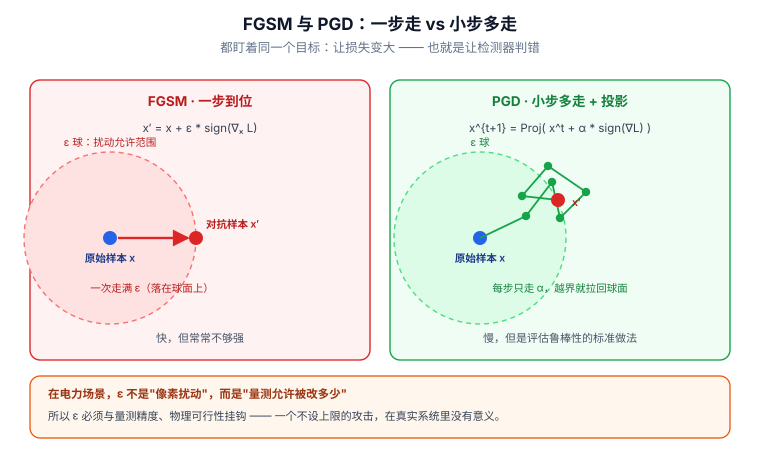

# 📘 第 12 周 · 对抗攻防进阶

> **本周目标**：Day 40 你已经见过 FGSM 和 PGD 的入门版本。这一周要把攻防两条线都推到"能做研究"的深度。**攻击侧**：把威胁模型形式化（`max L s.t. ||δ||≤ε`），搞清白盒 / 灰盒 / 黑盒的区别与查询预算，学会用迁移性和集成攻击打"不知道模型结构"的目标。**防御侧**：说清对抗训练的代价、理解认证鲁棒性能证明什么、不能证明什么。**最后一天**：把这些拼成一份**诚实的检测器安全评估协议** —— 这一份协议，是你论文里最容易被审稿人挑刺、也最能体现研究水平的部分。学完你应该能做到：给自己的检测器写一份经得起推敲的安全评估方案，并且**能主动说出自己的方法在什么攻击下会失效**。
>
> **本周知识清单**：H 域 8 条（融入每天末尾的 ✅ 知识自查）
>
> **阶段位置**：第 10 周解决"结构"（图），第 11 周解决"数据"（生成），本周解决"**对手**"。三周合起来，就是第二阶段"专精"的完整闭环 —— 你的模型、数据、和它面对的敌人。
>
> **使用方式**：在 Typora 中按标题折叠展开，每天读对应的小节即可。

[[深度学习学习总目录|← 返回总目录]]

---

## Day 75 —— 对抗样本基础：FGSM 与 PGD

> **一句话**：对抗攻击的本质是一个**带约束的优化问题** —— `max L(f(x+δ), y) s.t. ||δ|| ≤ ε`。FGSM 是它的一步近似解，PGD 是它的多步迭代解。**理解了这句话，后面所有攻击方法都是它的变体。**

### 一、形式化：把"攻击"写成一个优化问题

```
给定：模型 f、输入 x、真实标签 y、损失 L、扰动预算 ε

攻击者的目标：max_δ  L( f(x + δ), y )
约束：        ||δ||_p ≤ ε
```

**逐项拆解**：

| 符号 | 含义 | 谁决定 |
|---|---|---|
| `ε` | 扰动预算（攻击强度上限） | **攻击者的能力假设**（写论文时必须交代） |
| `p` | 范数类型（`∞` / `2` / `0`） | 攻击者的约束类型 |
| `L` | 损失函数 | 攻击者的知识（白盒时与训练一致） |

**三种范数的物理含义（在电网场景下尤其重要）**：

| 范数 | 约束 | 电网场景的对应 |
|---|---|---|
| `L∞` | `max_i \|δ_i\| ≤ ε` | **每个量测的偏移都不超过 ε**（最贴近传感器篡改能力） |
| `L2` | `‖δ‖₂ ≤ ε` | 总扰动能量有上限 |
| `L0` | 非零分量个数 ≤ k | **只能篡改 k 个量测**（最贴近"只能黑进 k 个 RTU"的现实） |

> **⚠️ 这一条必须写进论文**：**你的威胁模型用的是哪种范数，以及为什么。**
>
> 在电网场景里，`L0` 约束往往比 `L∞` 更现实 —— 攻击者通常只能攻陷有限数量的量测点。但 `L0` 攻击更难做，所以文献里 `L∞` 更多。**你可以把"`L0` 约束下的攻击与防御"作为一个差异化的切入点。**

### 二、FGSM：一步近似解

**核心思路**：把损失函数在 `x` 处做**一阶泰勒展开**：

```
L(f(x+δ), y) ≈ L(f(x), y) + δᵀ ∇_x L(f(x), y)
```

**要让 `L` 增长最快，就让 `δ` 与梯度方向一致，且取到约束边界**：

```
在 L∞ 约束下，最优的一步是：
    δ = ε · sign( ∇_x L(f(x), y) )
```

**为什么是 `sign` 而不是直接用梯度**：

```
L∞ 约束下，每个维度最多改 ε。要让内积 δᵀ∇L 最大，
每个维度都应该取到 ±ε，方向与梯度一致 —— 这正是 sign 的作用
（如果直接用梯度，各维度幅度不一，大部分维度没取到边界，总效果更弱）
```

```python
import torch

def fgsm(model, x, y, criterion, eps=0.01):
    x_adv = x.clone().detach().requires_grad_(True)
    loss = criterion(model(x_adv), y)
    model.zero_grad()
    loss.backward()                          # 求"输入"的梯度，不是参数梯度
    return (x + eps * x_adv.grad.sign()).detach()
```

> **FGSM 的线性假设什么时候失效**：当 `ε` 很大时，一阶近似不再准确，FGSM 的效果会饱和甚至变差。**这就是 PGD 存在的理由。**

### 三、PGD：多步迭代解

```
x⁰ = x + 均匀随机扰动（落在 ε 球内）
for t = 1 to K:
    x^t = Proj_ε( x^(t-1) + α · sign( ∇_x L(f(x^(t-1)), y) ) )
```

| 参数 | 典型取值 | 说明 |
|---|---|---|
| `K` | 10 ~ 50 | 迭代步数 |
| `α` | `ε / 4` 或 `ε / 10` | 单步步长 |
| 随机起点 | 有 | **随机重启（random restart）能显著提升攻击强度** |

```python
import torch

def pgd(model, x, y, criterion, eps=0.08, alpha=0.02, steps=20, restarts=1):
    """L∞ 约束下的 PGD 攻击（含随机重启）"""
    best_adv, best_loss = x.clone(), -float('inf')

    for _ in range(restarts):
        # ① 随机起点
        delta = torch.empty_like(x).uniform_(-eps, eps)
        x_adv = (x + delta).detach()

        for _ in range(steps):
            x_adv.requires_grad_(True)
            loss = criterion(model(x_adv), y)
            grad = torch.autograd.grad(loss, x_adv)[0]

            # ② 沿符号方向走一步
            x_adv = x_adv.detach() + alpha * grad.sign()
            # ③ 投影回 ε 球（L∞ 下就是逐元素 clamp）
            delta = torch.clamp(x_adv - x, -eps, eps)
            x_adv = (x + delta).detach()

        # ④ 记录最强的那个
        with torch.no_grad():
            cur = criterion(model(x_adv), y).item()
        if cur > best_loss:
            best_loss, best_adv = cur, x_adv.clone()

    return best_adv
```

**对比**：FGSM 是 1 步、步长 `ε`、不需要投影、1 次反向；PGD 是 K 步、步长 `α`（通常 `ε/4`）、每步投影回 `ε` 球、K 次反向。

> **PGD 被广泛当作"一阶攻击的基准"** —— 如果你的防御能扛住 PGD，说明它不是靠梯度掩蔽（Day 79 展开）。**评估鲁棒性时，PGD 是最低要求。**

其他值得一提的攻击：**C&W**（优化式求解，强但慢）、**DeepFool**（迭代找最近决策边界）、**FAB**（最小化到边界的距离）—— 后两者主要用于"求最小扰动"。



> **看图说话**：上图左右两栏的差别只看**路径形状**。**左（FGSM）**：以原始样本 `x` 为圆心画出的虚线圆就是 **ε 球**，代表“允许的扰动上限”。FGSM 沿梯度方向**一步走满 ε**，样本直接落在球面上 —— 快，但只能走一个方向，常常不够强。**右（PGD）**：改成小步多走，每步只走 `α`，**越界就拉回球面（投影）**，所以路径是锯齿状的。慢得多，但它能在球内找到**更优解**，因此成为评估鲁棒性的标准做法 —— 报鲁棒性时只用 FGSM 会被认为“测得太弱”。底框是电网场景的关键转译：**这里的 ε 不是“像素扰动”，而是“量测允许被改多少”**。所以 ε 必须与量测精度、物理可行性挂钩 —— 一个不设上限的攻击，在真实系统里没有意义，审稿人也不会接受。


### 四、和电网安全的关系

**这一节回答一个电网场景特有的问题：`ε` 该取多大？**

**在图像上，`ε = 8/255 ≈ 0.031` 是常用值**（人眼看不出）。**但电网量测没有"人眼"，`ε` 必须由物理意义决定。**

**三种定 `ε` 的方式**：

| 方式 | 依据 | 举例 |
|---|---|---|
| **按量测噪声水平** | `ε = k · σ`（`σ` 是 SCADA 量测噪声标准差） | 若 `σ = 0.01 p.u.`，取 `ε = 0.05`（5 倍噪声） |
| **按状态估计精度要求** | 攻击不能让状态偏移超过某个阈值 | 若要求 `\|Δθ\| < 0.5°`，反推 `ε` |
| **按量测的量程** | 相对量程的百分比 | 电压量测 `ε = 1% × 1.0 p.u. = 0.01` |

**为什么这一条特别重要**：

```
❌ 如果你的 ε 取得比量测噪声还小：
   攻击毫无效果 → 你的"鲁棒性"结论没有意义（对抗一个不存在的攻击）

❌ 如果你的 ε 取得很大（比如让电压变成 1.5 p.u.）：
   任何阈值规则都能检测 → 你的"鲁棒性"结论同样没有意义
   （你只是在证明"我的模型能检测明显的异常"）

✅ 正确的做法：
   ε 取在"量测噪声的 3-5 倍"这个区间，并在论文里说明理由
   然后画一条「ε vs 检测性能」的曲线（而不是只报一个 ε 的结果）
```

**⚠️ 一个关键的额外约束：物理可行性**

**回顾 Day 72**：真实攻击必须满足 `Δz = H·Δx`（否则 BDD 就抓到了）。

```
所以你的对抗攻击有两种设定：

设定 A（无约束对抗攻击）：
    δ 只受 ||δ||∞ ≤ ε 约束
    → 攻击可能破坏物理一致性
    → 评估的是"检测器在任意扰动下的鲁棒性"
    → 意义：检测器作为纯 ML 模型的鲁棒性

设定 B（物理可行的对抗攻击）：
    δ 还必须满足 Δz + δ ∈ range(H)（或近似满足）
    → 攻击既绕过 BDD 又试图欺骗 AI 检测器
    → 评估的是"真实攻击者能做到什么"
    → 意义：更贴近实战，但实现更难
```

> **这个"物理约束 + 对抗攻击"的组合，才是你的差异化方向。** 实现思路是把 `δ` 投影到 `range(H)` 上再叠加：

```python
def physical_pgd(model, x, y, H, criterion, eps=0.05, alpha=0.01, steps=20):
    """约束在 range(H) 内的 PGD：每步先算梯度，投影到物理可行空间，再走一步"""
    P = H @ torch.linalg.pinv(H.T @ H) @ H.T      # 投影矩阵
    x_adv = x.clone().detach()
    for _ in range(steps):
        x_adv.requires_grad_(True)
        loss = criterion(model(x_adv), y)
        grad = torch.autograd.grad(loss, x_adv)[0]
        x_adv = x_adv.detach() + alpha * (P @ grad).sign()   # 梯度也投影
        delta = torch.clamp(x_adv - x, -eps, eps)
        x_adv = (x + P @ delta).detach()                     # 扰动再投影一次
    return x_adv
```

> **⚠️ 诚实提醒**：投影之后扰动强度会衰减（`||Pδ|| ≤ ||δ||`）。**如果衰减得太厉害，说明在 `ε` 约束下"物理可行的对抗扰动"空间很小** —— 这本身就是一个有价值的发现（"物理约束提供了天然的对抗鲁棒性"）。

### 🔍 延伸思考

1. FGSM 在 `L2` 约束下的最优一步是什么？（提示：`L2` 下的等值面是球，最优方向是归一化梯度而不是 sign）
2. PGD 的随机重启为什么能提升攻击强度？（提示：从多个起点找局部最优，取最坏的）
3. 如果 `ε` 小于量测噪声标准差，对抗攻击还有意义吗？你的论文该怎么设定 `ε`？

### 📚 参考

- Goodfellow et al. (2015), *Explaining and Harnessing Adversarial Examples*（FGSM）—— [arXiv:1412.6572](https://arxiv.org/abs/1412.6572)
- Madry et al. (2018), *Towards Deep Learning Models Resistant to Adversarial Attacks*（PGD）—— [arXiv:1706.06083](https://arxiv.org/abs/1706.06083)
- Carlini & Wagner (2017), *Towards Evaluating the Robustness of Neural Networks*（C&W）—— [arXiv:1608.04644](https://arxiv.org/abs/1608.04644)
- 检索建议：搜 `adversarial attack industrial control system`，看工控场景下 ε 怎么设定

### 🎬 视频讲解

> 以下为**关键词检索式**推荐（平台搜索结果，非固定视频链接，避免失效）。
> 直接复制关键词到对应平台搜索即可，也可在结果里挑播放量高的看。

| 平台 | 推荐搜索关键词 | 说明 |
|---|---|---|
| **B站** | [FGSM 原理 推导 讲解](https://search.bilibili.com/all?keyword=FGSM+原理+推导+讲解) | 为什么用 sign 而不是梯度 |
| **B站** | [PGD 攻击 讲解 迭代 投影](https://search.bilibili.com/all?keyword=PGD+攻击+讲解+迭代+投影) | PGD 的完整流程 |
| **B站** | [C&W 攻击 讲解](https://search.bilibili.com/all?keyword=CW+攻击+讲解) | 优化式攻击的代表 |
| **抖音** | [对抗攻击 是什么](https://www.douyin.com/search/对抗攻击+是什么) | 三分钟建立概念 |

### ✅ 知识自查

- [ ] 🟢 **概念** 对抗攻击的形式化：`max L s.t. ||δ||_p ≤ ε`
- [ ] 🟢 **概念** 三种范数（`L∞` / `L2` / `L0`）的物理含义与电网对应
- [ ] 🟢 **推导** FGSM 的一阶泰勒展开，以及为什么在 `L∞` 下取 `sign`
- [ ] 🟢 **实践** 写出 FGSM 与 PGD（含随机重启、每步投影）
- [ ] 🟢 **概念** PGD 是一阶攻击的基准，评估鲁棒性时必须做
- [ ] 🟢 **概念** 电网场景里 `ε` 的三种定法（噪声水平 / 精度要求 / 量程）
- [ ] 🟡 **判断** `ε` 取太小或太大都会让结论失去意义
- [ ] 🟡 **实践** 把扰动投影到 `range(H)`，实现"物理可行的 PGD"

---

## Day 76 —— 规避攻击：黑盒与查询受限场景

> **一句话**：白盒攻击假设攻击者能拿到梯度 —— 这在现实中通常不成立。**黑盒攻击才是真实威胁，而它的核心约束是"查询预算"** —— 在电网上，这个预算由 SCADA 的采集周期决定。

### 一、威胁模型的三档

| 档位 | 攻击者知道什么 | 能做什么 | 现实性 |
|---|---|---|---|
| **白盒** | 模型结构 + 参数 + 梯度 | 直接算梯度（FGSM/PGD） | 低（除非模型开源） |
| **灰盒** | 模型类型 + 训练数据分布，但不知参数 | 训替代模型 + 迁移 | **中（最现实）** |
| **黑盒（有查询）** | 只能输入 x，看到输出 `f(x)` | 查询接口 + 估计梯度 | 中 |
| **黑盒（无查询）** | 什么都不知道 | 只能靠迁移 + 猜测 | 低（除非有先验） |

> **⚠️ 论文里必须明确你评估的是哪一档。** 只做白盒实验，审稿人一定会问"黑盒呢"。

### 二、黑盒攻击的三条技术路线

**路线 1：迁移攻击（最实用，零查询）**

```
攻击者自己训一个替代模型（surrogate），用它的梯度造样本，再打到目标模型上
（Day 79 会专门展开）
```

**优点**：不需要查询目标模型。**缺点**：需要知道训练数据的分布（灰盒假设）。

**路线 2：基于分数的查询攻击（SPSA / NES）**

**核心思想**：不知道梯度，但可以**用有限差分估计梯度**。

```
∇_x L ≈ ( L(x + c·u) - L(x - c·u) ) / (2c) · u
其中 u 是随机方向向量（通常从 N(0, I) 采样）
```

**为什么用随机方向而不是逐维差分**：

```
逐维差分：维度 m 的量测需要 2m 次查询 —— IEEE 14 的 m ≈ 50-100，
         一次梯度估计要 100-200 次查询，太贵
随机方向：SPSA 用 1 个（或几个）随机方向就能得到梯度的无偏估计
         → 每次迭代只需 2 次查询
```

```python
import torch

def spsa_gradient_estimate(model, x, y, criterion, c=1e-3, n_samples=1):
    """用 SPSA 估计损失对输入的梯度（每次迭代只需 2*n_samples 次查询）"""
    grad_est = torch.zeros_like(x)
    for _ in range(n_samples):
        u = torch.randn_like(x)                       # 随机方向
        u = u / u.norm()                              # 归一化
        with torch.no_grad():
            l_plus = criterion(model(x + c * u), y)
            l_minus = criterion(model(x - c * u), y)
        grad_est += ((l_plus - l_minus) / (2 * c)) * u
    return grad_est / n_samples
```

**路线 3：基于决策的查询攻击（Boundary Attack）**

**更强的假设**：攻击者**只知道模型判了什么类**，拿不到置信度分数。

```
思路：从一个"已经是误分类"的样本出发，
     沿着决策边界一步步走，同时最小化到原样本的距离
```

**优点**：假设最弱（连分数都拿不到）。**缺点**：查询次数极多（通常上万次）。

### 三、查询预算：把"能不能查"算清楚

**这是黑盒攻击在电网场景下最关键的现实约束。**

**SCADA 的采集周期**（回顾 Day 37）：典型值 **2-4 秒**一帧。取 4 秒：

```
一天 = 86400 秒 / 4 秒 = 21600 帧
→ 攻击者一天最多能查询 21600 次（假设他能看到每一帧的检测结果）
```

**把各方法的查询需求对照一下**：

| 方法 | 查询次数（量级） | 在 21600 次预算内能做什么 |
|---|---|---|
| **迁移攻击** | 0（对目标模型） | ✅ 完全可行 |
| **SPSA / NES** | 10³ ~ 10⁴（迭代 100-1000 次 × 每次 2 查询） | ✅ 可行（约几小时到一天） |
| **Boundary Attack** | 10⁴ ~ 10⁵ | ⚠️ 勉强 / 不可行 |
| **逐维有限差分** | 10² ~ 10³ **每次梯度估计** × 迭代次数 | ❌ 不可行 |

> **⚠️ 这段计算必须写进论文。** 审稿人最反感的就是"攻击者可以无限次查询"这种不现实假设。
>
> **如果你的威胁模型是"攻击者能查询 10⁶ 次"，你必须说明他在什么时间尺度内能做到这件事** —— 而在电网上，这需要几十天。

**还有一个更现实的约束：查询会不会被发现？**

```
攻击者大量查询 → 检测系统的输入分布会发生变化 → 可能触发异常告警
→ 这本身就是一个"攻击者暴露"的渠道
```

**这个观察带来一个有意思的防御思路**：**监控查询模式，而不是监控单个样本。** 这是"对抗攻击检测"（而不是"对抗攻击防御"）的方向。

### 四、和电网安全的关系

**一份电网场景的黑盒威胁模型模板**：

```markdown
## 攻击者能力假设

### 知识
- [ ] 知道电网拓扑（H 矩阵）？  是 / 否 / 部分
- [ ] 知道检测器的架构？        是 / 否
- [ ] 知道检测器的参数？        是 / 否
- [ ] 能拿到检测器的输出分数？  是 / 否（只能拿到二值判定？）

### 能力
- [ ] 能篡改的量测数量上限：____（L0 约束）
- [ ] 单个量测的篡改幅度上限：____（L∞ 约束）
- [ ] 查询次数上限：____（受 SCADA 采集周期限制）
- [ ] 可用的时间窗口：____（攻击需要在多长时间内完成）

### 约束
- [ ] 攻击必须满足 Δz ∈ range(H)？  是 / 否
- [ ] 攻击必须不触发 BDD？          是 / 否
- [ ] 攻击必须不被运维人员肉眼发现？是 / 否
```

**把这张表填完，你就有了一个"可辩护"的威胁模型。** 每一行都是一个你能在论文里论证的决策。

**三个诚实的判断**：

| 说法 | 是否成立 |
|---|---|
| "黑盒攻击一定比白盒弱" | ✅ 成立（信息少） |
| "黑盒攻击在电网上不可行" | ❌ **不成立**。迁移攻击零查询就能做，而且效果不差（Day 79） |
| "只要隐藏模型结构就安全" | ❌ **不成立**。这是"通过隐匿实现安全"，是最脆弱的安全假设 |

**一个可以做的实验**：

```
实验：不同威胁模型下的检测器性能
  ① 无攻击（干净数据）
  ② 白盒 PGD（ε = 0.05）
  ③ 灰盒迁移攻击（用一个结构不同的替代模型）
  ④ 黑盒 SPSA（查询预算 20000 次）

报告：每种设定下的 PR-AUC 与攻击成功率
```

> **这个实验的成本不高（都是你已有的工具），但说服力很强** —— 它证明了你的评估是全面的。

### 🔍 延伸思考

1. SPSA 的有限差分里，`c` 取多大合适？太小会被数值误差淹没，太大则一阶近似不成立 —— 这个权衡和什么有关？
2. 如果攻击者的查询会被监控，他会怎么降低查询次数？（提示：迁移攻击 + 少量查询微调）
3. 在电网上，"攻击者能看到检测器的输出"这个假设现实吗？（提示：检测器通常是离线分析还是在线告警？调度员能不能看到告警？）

### 📚 参考

- Ilyas et al. (2018), *Query-Efficient Black-box Adversarial Examples*（NES 方法）—— [arXiv:1712.07113](https://arxiv.org/abs/1712.07113)（注：该文已被作者自己的 *Black-Box Adversarial Attacks with Limited Queries and Information* 取代，读后者更完整）
- Chen et al. (2017), *ZOO: Zeroth Order Optimization Based Black-Box Attacks* —— [arXiv:1708.03999](https://arxiv.org/abs/1708.03999)
- 检索建议：搜 `decision based adversarial attack boundary`，找 Boundary Attack 的原文（Brendel & Bethge）
- 检索建议：搜 `adversarial attack detection by query pattern`，看"检测攻击"而不是"防御攻击"的思路

### 🎬 视频讲解

> 以下为**关键词检索式**推荐（平台搜索结果，非固定视频链接，避免失效）。
> 直接复制关键词到对应平台搜索即可，也可在结果里挑播放量高的看。

| 平台 | 推荐搜索关键词 | 说明 |
|---|---|---|
| **B站** | [黑盒攻击 讲解 原理](https://search.bilibili.com/all?keyword=黑盒攻击+讲解+原理) | 三条技术路线的对比 |
| **B站** | [迁移攻击 讲解 原理](https://search.bilibili.com/all?keyword=迁移攻击+讲解+原理) | 零查询攻击的思路 |
| **B站** | [无梯度优化 SPSA 讲解](https://search.bilibili.com/all?keyword=无梯度优化+SPSA+讲解) | 有限差分估计梯度 |
| **抖音** | [黑盒攻击 是什么](https://www.douyin.com/search/黑盒攻击+是什么) | 一分钟建立概念 |

### ✅ 知识自查

- [ ] 🟢 **概念** 威胁模型的四档：白盒 / 灰盒 / 黑盒有查询 / 黑盒无查询
- [ ] 🟢 **概念** 黑盒攻击的三条路线：迁移 / 基于分数 / 基于决策
- [ ] 🟢 **推导** SPSA 的有限差分梯度估计，以及为什么用随机方向
- [ ] 🟢 **实践** 写出 `spsa_gradient_estimate` 并用它做一次黑盒攻击
- [ ] 🟢 **实践** 按 SCADA 采集周期算出查询预算（21600 次/天）
- [ ] 🟢 **判断** 不同方法在这个预算下是否可行（迁移 ✅ / SPSA ✅ / Boundary ⚠️ / 逐维差分 ❌）
- [ ] 🟡 **判断** "隐藏模型结构就能安全"为什么不成立
- [ ] 🔴 **概念** 通过监控查询模式来检测攻击的思路

---

## Day 77 —— 对抗训练：最有效的防御及其代价

> **一句话**：对抗训练是目前**唯一被广泛验证有效**的对抗防御 —— 做法极其简单（把对抗样本加进训练集），但**代价是干净精度下降、训练成本翻几倍，而且只对训练时用的那个 `ε` 有效**。

### 一、min-max 形式化

**对抗训练把"攻击"和"训练"写成了一个联合优化**：

```
min_θ  E_{(x,y)~D} [ max_{||δ||≤ε}  L( f_θ(x + δ), y ) ]
      └── 外层：学参数 θ，让"最坏情况下的损失"最小 ──┘
                       └── 内层：找最坏的扰动 δ ──┘
```

**内层就是 PGD 攻击，外层就是普通的梯度下降。** 所以：

```
对抗训练的一个 batch 的流程：
  ① 对每个样本，用 PGD 找到对抗样本（K 步，K 次前向+反向）
  ② 用这些对抗样本做一次参数更新（1 次前向+反向）
```

**训练成本 ≈ 普通训练的 (K + 1) 倍。** `K = 10` 就是 11 倍。

```python
import torch

def adversarial_training_step(model, x, y, criterion, opt,
                              eps=0.05, alpha=0.01, steps=10):
    # ① 内层：PGD 造对抗样本（不计算参数梯度）
    x_adv = pgd(model, x, y, criterion, eps=eps, alpha=alpha, steps=steps)

    # ② 外层：用对抗样本更新参数
    model.train()
    opt.zero_grad()
    loss = criterion(model(x_adv), y)
    loss.backward()
    opt.step()
    return loss.item()
```

> **这就是全部。** 没有任何魔法 —— 对抗训练的简单性正是它的优点（容易复现、容易解释）。

### 二、代价：三个必须承认的账

**代价 1：干净精度下降（鲁棒性-精度权衡）**

```
在图像分类上，这个权衡非常明显：
  CIFAR-10 干净精度 95% 的模型，对抗训练后干净精度可能降到 85%，
  但对 PGD 的鲁棒精度能从 0% 提升到 45% 左右

这个权衡不是"训练不够好"，而是理论上有下界的
（搜 `no free lunch adversarial robustness` / `robustness accuracy tradeoff`）
```

**代价 2：训练时间**

| 配置 | 相对成本 |
|---|---|
| 普通训练 | 1× |
| 对抗训练 `K = 10` | ~11× |
| 对抗训练 `K = 20` | ~21× |

**对每天只有 1 小时算力的你，这是硬约束。** 应对方式：用 `K = 5`、用小模型、用加速方法（见下）。

**代价 3：只对训练时用的 `ε` 有效**

```
用 ε = 0.05 训练 → 对 ε = 0.05 的攻击鲁棒
                  → 对 ε = 0.1 的攻击**完全崩溃**
```

> **⚠️ 这是一个非常常见的误读**：论文里写"我们做了对抗训练，模型变鲁棒了"，但**没有说明是"对哪个 ε 鲁棒"**。
>
> **正确的表述**：画一条「ε vs 鲁棒精度」曲线，展示在训练 `ε` 附近鲁棒，超出后迅速下降。

### 三、三个改进方向

**改进 1：TRADES —— 把损失拆成"精度"和"鲁棒"两项**

```
L_TRADES = L( f(x), y )  +  β · KL( f(x) || f(x_adv) )
           └── 干净精度 ──┘    └── 鲁棒性（让预测分布稳定）──┘
```

**核心思想**：不要求对抗样本被正确分类，只要求**预测分布和干净样本一致**。这样能更好地平衡精度与鲁棒性。

**改进 2：MART —— 更关注被误分类的样本**

**核心思想**：在对抗训练中，**已经被误分类的样本应该被赋予更高权重**（因为它们更能揭示模型的弱点）。

**改进 3：加速 —— 把 11 倍成本降下来**

| 方法 | 思路 | 加速比 |
|---|---|---|
| **Free AT** | 复用上一次迭代算出的扰动，省掉内层 PGD | ~3-4× |
| **Fast AT** | 用 FGSM（单步）+ 随机起点替代 PGD | ~10× |
| **YOPO** | 只对第一层做完整前向，其余层用近似 | ~3-5× |

> **对你的建议**：**先用 Fast AT（FGSM + 随机起点）**。它的成本几乎和普通训练一样，效果虽然不如 PGD-AT，但**足以证明"对抗训练在这个任务上有效/无效"**。如果有效，再上 PGD-AT 精调。

### 四、和电网安全的关系

**电网场景下，对抗训练的账要重新算一遍 —— 因为代价是不对称的。**

**回顾 Day 12**：在电网安全里，**漏报的代价远大于误报**。

| 错误类型 | 后果 | 代价 |
|---|---|---|
| **漏报**（攻击被判为正常） | 攻击得逞，可能造成物理损坏 / 停电 | **极高** |
| **误报**（正常被判为攻击） | 运维人员去核查，浪费人力 | 中（但如果太多会"狼来了"） |

**看起来"可以接受干净精度下降"**，但有个陷阱：

```
对抗训练会降低干净精度 → 干净样本上的误报率上升
→ 运维人员每天收到更多告警
→ 告警疲劳（alarm fatigue）→ 真正的攻击被忽略
→ 从系统层面看，安全性反而下降了
```

**所以不能简单地说"电网能接受精度下降"。** 必须具体看：

| 指标 | 对抗训练前 | 对抗训练后 | 可接受？ |
|---|---|---|---|
| 干净数据的误报率 | 1% | 5% | ⚠️ 需要评估运维能否承受 |
| 干净数据的漏报率 | 3% | 2% | ✅ 变好了 |
| 对抗攻击下的漏报率 | 60% | 25% | ✅ 大幅变好 |

> **必须报"误报率"这一行，而且要算清楚"每天会多出多少条误报"**（`误报率 × 每天帧数`）。这个数字比百分比更能说服人。

**三个诚实的判断**：

| 说法 | 是否成立 |
|---|---|
| "对抗训练是万能防御" | ❌ 只对训练 `ε` 附近的攻击有效 |
| "对抗训练能防住所有攻击类型" | ❌ 只防住训练时用的那种（`L∞` 训的防不住 `L0` 攻击） |
| "对抗训练后模型就安全了" | ❌ 还可能被 Day 79 的集成攻击、Day 78 提到的其他攻击方式突破 |

**一个电网场景特有的替代方案**：

```
对抗训练很贵。在电网上你有更便宜的选择：物理约束过滤。

   任何量测组合，先检查它是否满足 z ∈ range(H) 附近（残差检验）
   → 不满足的直接过滤掉
   → 这一步成本几乎为零，且能挡掉一部分对抗样本

然后对"通过了物理检查的攻击"再用对抗训练。
→ 两层防御，成本更低，且第二层面对的样本更少
```

> **这个"物理约束 + 对抗训练"的组合防御，本身就是一个可写的选题。** 而且它比单纯做对抗训练更有电网特色 —— 审稿人会觉得"这个作者真的懂电网"。

### 🔍 延伸思考

1. 如果训练时用 `ε = 0.05`，测试时用 `ε = 0.03` 的攻击，模型鲁棒吗？为什么？（提示：想想训练时见过的扰动分布）
2. 对抗训练和 Day 11 的正则化（Dropout / 权重衰减）在思想上有共同点吗？
3. 如果攻击者知道你用了对抗训练，他会怎么调整攻击？（这就是 Day 80 的"自适应攻击"）

### 📚 参考

- Madry et al. (2018), *Towards Deep Learning Models Resistant to Adversarial Attacks* —— [arXiv:1706.06083](https://arxiv.org/abs/1706.06083)（对抗训练的标准做法）
- Zhang et al. (2019), *Theoretically Principled Trade-off between Robustness and Accuracy*（TRADES）—— [arXiv:1901.08573](https://arxiv.org/abs/1901.08573)
- Wong et al. (2020), *Fast is better than free: Revisiting adversarial training* —— [arXiv:2001.03994](https://arxiv.org/abs/2001.03994)（**算力有限时最实用**）
- 检索建议：搜 `adversarial robustness accuracy tradeoff theory`，理解这个权衡的理论下界

### 🎬 视频讲解

> 以下为**关键词检索式**推荐（平台搜索结果，非固定视频链接，避免失效）。
> 直接复制关键词到对应平台搜索即可，也可在结果里挑播放量高的看。

| 平台 | 推荐搜索关键词 | 说明 |
|---|---|---|
| **B站** | [对抗训练 讲解 min max](https://search.bilibili.com/all?keyword=对抗训练+讲解+min+max) | 内外层优化的完整框架 |
| **B站** | [TRADES 对抗训练 讲解](https://search.bilibili.com/all?keyword=TRADES+对抗训练+讲解) | 精度与鲁棒性的平衡 |
| **B站** | [鲁棒性 精度 权衡 讲解](https://search.bilibili.com/all?keyword=鲁棒性+精度+权衡+讲解) | 为什么不可能两者兼得 |
| **抖音** | [对抗训练 有什么用](https://www.douyin.com/search/对抗训练+有什么用) | 一分钟了解防御手段 |

### ✅ 知识自查

- [ ] 🟢 **概念** 对抗训练的 min-max 形式化（内层 PGD，外层梯度下降）
- [ ] 🟢 **实践** 写出 `adversarial_training_step`
- [ ] 🟢 **概念** 三个代价：干净精度下降 / 训练成本 (K+1) 倍 / 只对训练 `ε` 有效
- [ ] 🟢 **概念** TRADES 的损失设计（精度项 + 鲁棒项）
- [ ] 🟢 **概念** 加速方法：Fast AT（FGSM + 随机起点）最实用
- [ ] 🟢 **实践** 画出「ε vs 鲁棒精度」曲线（而不是只报一个 ε）
- [ ] 🟡 **判断** 电网场景下误报率上升 → 告警疲劳 → 系统安全性反而下降
- [ ] 🟡 **判断** "物理约束过滤 + 对抗训练"的组合防御为什么更适合电网

---

## Day 78 —— 认证鲁棒性：可证明的防御边界

> **一句话**：前面所有防御都是"**经验性**"的 —— 攻击者没打穿，不代表打不穿。认证鲁棒性要做的是**证明**：在半径 `ε` 内，无论攻击者怎么选扰动，预测都不会变。**但这份"证明"有严格的适用范围，在检测器任务和电网场景下都有明显局限。**

### 一、定义：什么叫"认证"

**经验鲁棒性（empirical robustness）**：

```
用 PGD 攻击，没打穿 → 只能说"在这个攻击下没被打穿"
攻击者换一个更强的攻击，可能就打穿了
```

**认证鲁棒性（certified robustness）**：

```
证明：∀δ, ||δ|| ≤ ε  ⇒  f(x + δ) = f(x)
      └── 对所有可能的扰动都成立，不管攻击者多强 ──┘
```

**认证半径 `r`**：对给定样本，能保证预测不变的最大 `ε`。

| | 经验鲁棒性 | 认证鲁棒性 |
|---|---|---|
| 保证 | 对特定攻击成立 | **对任意攻击成立** |
| 强度 | 弱 | **强** |
| 代价 | 低 | 高（保守、精度损失大） |
| 能否证伪 | 打穿就证伪 | 无法证伪（但可能很保守） |

### 二、三类认证方法

**方法 1：区间边界传播（IBP）**

**核心思想**：把输入的 `ε` 球传播成每一层的**区间** `[l, u]`，看输出层能不能被区分开。

```
输入：x ∈ [x - ε, x + ε]
经过每一层，区间被传播（线性层：精确；ReLU：取上下界的 min/max）
最终得到输出的区间 [l_out, u_out]

如果"正确类的 logit 下界" > "其他类 logit 的上界"
⇒ 在 ε 球内预测一定不变 ⇒ 认证成功
```

**特点**：**快，但非常保守**（区间会越传越宽，认证半径通常很小）。

**方法 2：CROWN 系列（线性松弛）**

**核心思想**：不做区间传播，而是**用线性函数松弛非线性激活**，得到更紧的界。

**特点**：比 IBP 紧得多，认证半径更大。但实现复杂、计算更慢。

**方法 3：随机平滑（Randomized Smoothing）**

**核心思想（完全不同的思路）**：

```
定义一个"平滑分类器"：
    g(x) = argmax_c  P( f(x + η) = c ),   η ~ N(0, σ²I )
        └── 对 x 加高斯噪声后，模型最可能判成哪个类 ──┘

定理（Cohen et al.）：如果 g(x) = c_A 且这个类的概率下界为 p_A，
则 g 在 L2 半径 r = (σ/2)·(Φ⁻¹(p_A) - Φ⁻¹(p̄_A)) 内一定不变
```

**为什么随机平滑很受欢迎**：

| 优点 | 说明 |
|---|---|
| **模型无关** | 不要求模型可微、不要求特定结构，黑盒模型也能认证 |
| **可扩展到大数据集** | ImageNet 上也能跑 |
| **实现简单** | 主要成本是采样（推理时多跑几百次） |

**缺点**：

| 缺点 | 说明 |
|---|---|
| **推理慢** | 每个样本要采样几百次 |
| **只对 `L2` 有效** | 原始理论针对 `L2`，`L∞` 版本有但更弱 |
| **σ 要调** | `σ` 越大认证半径越大，但干净精度越低 |

```python
import torch

def randomized_smoothing_predict(model, x, sigma=0.25, n_samples=500):
    """随机平滑的预测：采样 n_samples 次，取最可能的类"""
    counts = torch.zeros(10)                       # 假设 10 类
    for _ in range(n_samples):
        noisy = x + sigma * torch.randn_like(x)
        with torch.no_grad():
            pred = model(noisy).argmax().item()
        counts[pred] += 1
    p_hat = counts.max() / n_samples
    c_hat = counts.argmax().item()
    return c_hat, p_hat


def certified_radius(p_hat, sigma, n_samples, alpha=0.001):
    """用 Clopper-Pearson 下界算认证半径（简化版）"""
    from scipy.stats import norm
    # 实际应用要用二项分布的置信下界，这里用点估计示意
    p_a = p_hat
    if p_a < 0.5:
        return 0.0                                 # 无法认证
    p_bar = 1 - p_a
    return sigma * (norm.ppf(p_a) - norm.ppf(p_bar))
```

### 三、认证半径 vs 精度：又一条权衡曲线

**认证方法的报告方式是固定的**：

```
横轴：认证半径 ε
纵轴：在这个半径下被认证正确的样本比例（certified accuracy）

曲线上的每一点表示："有 X% 的测试样本，能保证在半径 ε 内预测不变"
```

**典型曲线形状**：

```
ε = 0        → certified accuracy ≈ 干净精度（比如 90%）
ε = 0.1      → certified accuracy 掉到 60%
ε = 0.3      → 掉到 30%
ε = 0.5      → 掉到 10%
```

> **报告时必须报整条曲线，不能只报一个点。** 只报"在 ε = 0.1 时认证精度 60%"是没有意义的 —— 换个 ε 数字就完全不同。

### 四、和电网安全的关系

**这一节必须说清楚：认证鲁棒性在电网安全检测器上，局限性很大。**

**局限 1：认证理论主要针对分类任务**

```
认证方法的前提是"输出一个类别，证明类别不变"

但你的检测器输出的是"异常分数"（一个实数），不是类别
→ 认证什么？"分数不变"？那攻击者只要让分数跨过阈值就够了
→ 如果改成二分类（正常/攻击），那"认证半径"的含义变成了
  "在这个半径内，样本一定被判为同一类"
```

**局限 2：电网场景的认证半径通常很小**

```
电网量测的 ε（按噪声水平定）通常是 0.01 ~ 0.05 这个量级
而认证方法在图像上报告的认证半径（归一化后）也就在 0.1 ~ 0.3

→ 在 ε = 0.05 这个量级上，认证方法能给出的保证可能非常弱
→ 甚至可能"认证半径 = 0"（即无法认证任何非平凡的攻击）
```

**局限 3：认证的是"分类不变"，不是"攻击被检测到"**

```
假设你的检测器是二分类（正常 / 攻击）：
  认证"在 ε 内都判为攻击" → 有意义（攻击一定被检测到）
  认证"在 ε 内都判为正常" → ⚠️ 这是坏消息（攻击一定被漏检！）

而认证方法通常报告的是"认证正确的比例" —— 
对于攻击样本，"认证正确"意味着"被正确检测为攻击"
对于正常样本，"认证正确"意味着"被判为正常"

→ 报告时必须分开报这两个数字！
→ 混在一起报会掩盖"对攻击样本的认证率很低"这个事实
```

**一个诚实的结论**：

> **在电网安全检测器上做认证鲁棒性，目前不是一条好走的路。**
>
> 原因：
> 1. 检测器输出的是分数不是类别，认证目标不清晰
> 2. 电网的 ε 量级小，认证半径很可能覆盖不了
> 3. 认证方法的保守性会导致"能认证的样本很少"
>
> **如果你一定要做，建议的切入点是**：
> - 用随机平滑（模型无关、实现简单）
> - 只对**攻击样本**做认证，报告"有多少攻击样本能被保证检测到"
> - 把这个数字和"经验鲁棒性"（PGD 下的检测率）放在一起对比
>
> **如果认证率很低（比如 < 10%），那就诚实地报告这个结果** —— "现有认证方法在电网检测任务上的适用性有限"本身就是一个有价值的结论。

### 🔍 延伸思考

1. 随机平滑的认证半径公式里，`σ` 越大半径越大。那为什么不把 `σ` 设得极大？（提示：`σ` 大了干净精度会掉）
2. IBP 的区间传播为什么"越传越宽"？这对深层网络意味着什么？
3. 如果认证方法给出的半径是 0，这个结论该怎么写进论文？（提示：这是一个负面结果，但有信息量）

### 📚 参考

- Cohen et al. (2019), *Certified Adversarial Robustness via Randomized Smoothing* —— [arXiv:1902.02918](https://arxiv.org/abs/1902.02918)
- Gowal et al. (2019), *Scalable Verified Training for Provably Robust Image Classification*（IBP；arXiv 版标题为 *On the Effectiveness of Interval Bound Propagation for Training Verifiably Robust Models*）—— [arXiv:1810.12715](https://arxiv.org/abs/1810.12715)
- 检索建议：搜 `CROWN neural network verification`，找 CROWN 系列的原始论文；再搜 `certified robustness survey` 看认证方法的整体地图与局限

### 🎬 视频讲解

> 以下为**关键词检索式**推荐（平台搜索结果，非固定视频链接，避免失效）。
> 直接复制关键词到对应平台搜索即可，也可在结果里挑播放量高的看。

| 平台 | 推荐搜索关键词 | 说明 |
|---|---|---|
| **B站** | [认证鲁棒性 讲解 可证明](https://search.bilibili.com/all?keyword=认证鲁棒性+讲解+可证明) | 什么叫"可证明的防御" |
| **B站** | [随机平滑 认证 讲解](https://search.bilibili.com/all?keyword=随机平滑+认证+讲解) | 最实用的认证方法 |
| **B站** | [区间边界传播 IBP 讲解](https://search.bilibili.com/all?keyword=区间边界传播+IBP+讲解) | 认证方法的基本思路 |
| **抖音** | [可证明鲁棒性 是什么](https://www.douyin.com/search/可证明鲁棒性+是什么) | 一分钟建立概念 |

### ✅ 知识自查

- [ ] 🟢 **概念** 经验鲁棒性 vs 认证鲁棒性的区别
- [ ] 🟢 **概念** 认证半径的定义：保证预测不变的最大 `ε`
- [ ] 🟢 **概念** 三类方法：IBP（快但保守）/ CROWN（紧但慢）/ 随机平滑（模型无关）
- [ ] 🟢 **概念** 随机平滑的核心定理（`σ`、`p_A` 与认证半径的关系）
- [ ] 🟢 **实践** 报告"认证半径 vs 认证精度"的完整曲线，而不是一个点
- [ ] 🟡 **判断** 认证方法在检测器任务上的三个局限（分数 vs 类别 / ε 量级 / 认证对象）
- [ ] 🟡 **判断** 必须分开报"攻击样本的认证率"和"正常样本的认证率"
- [ ] 🔴 **判断** 在电网安全检测器上做认证鲁棒性为什么不是好走的路

---

## Day 79 —— 攻击迁移性与集成攻击

> **一句话**：迁移性是对抗攻击最危险的性质 —— **攻击者不需要知道你的模型，只要训一个差不多的替代模型，用它造的样本就能骗过你**。而评估防御时如果只用单模型攻击，很可能被"梯度掩蔽"骗了。

### 一、迁移性：现象与解释

**现象**：

```
用模型 A 的梯度造的对抗样本 → 也能骗过模型 B（结构完全不同）
```

**三种解释（都不完全，但都有道理）**：

- **决策边界相似**：不同模型在同一数据分布上学到的边界有相似性 —— 在一个模型边界外找到的点，往往也在另一个模型边界外。
- **特征空间相似**：模型学到的中间特征有共性，扰动这些共性特征对多个模型都有效。
- **梯度方向相似**：在数据点附近，不同模型的损失曲面在大尺度上形状相似。

> **对你的意义**：**你不能靠"隐藏模型结构"来防御。** 论文里如果只做白盒攻击实验，审稿人一定会问"黑盒呢"。

### 二、提升迁移性的三种方法

**方法 1：动量迭代（MI-FGSM）**

**问题**：普通迭代攻击容易过拟合到当前模型的局部细节，迁移性差。

**解法**：在迭代中加入动量，让更新方向更稳定：

```
g_{t+1} = μ · g_t + ∇_x L(x_t, y) / ||∇_x L(x_t, y)||₁
x_{t+1} = x_t + α · sign( g_{t+1} )
```

**直觉**：动量抹平了单步梯度的噪声，让扰动朝着"更通用的方向"走。

**方法 2：输入多样性（DI）**

**解法**：每次迭代前，对输入做随机变换（缩放、padding），再算梯度：

```
x'_t = random_resize_and_pad(x_t)
grad = ∇_x L(x'_t, y)
```

**直觉**：让攻击对输入的微小变化也有效 —— 这正好对上了"不同模型对输入的处理方式略有不同"这个事实。

**方法 3：集成攻击（Ensemble Attack）**

**最直接、也最有效的方法**：

```
同时攻击 N 个模型，让扰动对它们都有效：

    max_δ  Σ_{i=1}^{N}  L( f_i(x + δ), y )

实践中的两种做法：
  ① 对每个模型的梯度求平均，再走一步
  ② 对每个模型的损失求和，一次反向传播
```

```python
import torch

def ensemble_pgd(models, x, y, criterion, eps=0.05, alpha=0.01, steps=20):
    """集成 PGD：对多个模型的梯度取平均"""
    x_adv = x.clone().detach()
    for _ in range(steps):
        x_adv.requires_grad_(True)
        # ① 对所有模型的损失求和
        loss = sum(criterion(m(x_adv), y) for m in models)
        grad = torch.autograd.grad(loss, x_adv)[0]
        # ② 走一步 + 投影
        x_adv = x_adv.detach() + alpha * grad.sign()
        x_adv = x + torch.clamp(x_adv - x, -eps, eps)
    return x_adv.detach()
```

> **为什么集成攻击有效**：如果扰动对多个结构不同的模型都有效，那它很可能**捕捉到了数据分布层面的共同弱点**，而不是某个模型的特殊缺陷 —— 因此对没见过的模型也有迁移性。

### 三、梯度掩蔽：一个必须知道的评估陷阱

**"梯度掩蔽"（Obfuscated Gradients）** 指的是：**模型看起来鲁棒，实际上只是让攻击者算不出有效梯度。**

**四种常见的掩蔽方式**：

| 方式 | 做法 | 为什么是掩蔽而不是真防御 |
|---|---|---|
| **破碎梯度** | 用不可微的操作（如量化、JPEG 压缩） | 攻击者可以用 BPDA（后向微分近似）绕过 |
| **随机梯度** | 每次前向加随机噪声 | 攻击者可以对多次采样取期望 |
| **梯度爆炸/消失** | 让梯度变成 NaN 或极小值 | 攻击者可以改用无梯度方法（SPSA） |
| **数值不稳定** | 用极小的数值精度 | 换用其他攻击方法 |

**怎么识别"我是不是在做梯度掩蔽"**：

```
自查清单：
□ 无梯度攻击（SPSA / 迁移攻击）是否也打不穿？如果打穿了 → 是梯度掩蔽
□ 把 ε 调大几倍，攻击成功率是否突然飙升？如果是 → 是梯度掩蔽
□ 用不同随机种子重跑攻击，成功率是否波动极大？如果是 → 是梯度掩蔽
□ 用更强的攻击（更多步、更多重启）是否显著提升成功率？如果是 → 是梯度掩蔽
```

> **⚠️ 这一条极其重要。** 文献里大量"我们的防御把攻击成功率降到 1%"的论文，后来被证明只是梯度掩蔽。
>
> **你的评估里必须包含至少一种"不依赖梯度"的攻击**（迁移攻击或 SPSA），否则结论不可信。

### 四、和电网安全的关系

**在电网场景下，迁移性意味着什么？**

**场景推演**：

```
假设你的实验室训练了一个 FDI 检测器，部署在某电网公司。
攻击者不知道这个检测器的结构（这是合理假设，模型通常不公开）。

攻击者能做什么？
  ① 自己收集一批量测数据（可能从历史记录、或者用自己的仿真）
  ② 自己训一个检测器（结构随便选）
  ③ 用自己模型的梯度造攻击样本
  ④ 打到真实检测器上

结果：如果迁移性成立，攻击成功 → 你的检测器失效
```

**这就是为什么"白盒攻击实验"不够。**

**一个必须做的实验设计**：

```
实验：迁移攻击矩阵

准备 4 个结构不同的检测器：
  A: MLP          B: LSTM
  C: 1D-CNN       D: Transformer

对每一对 (源模型, 目标模型)，用源模型的梯度造样本，测目标模型的检测率：

       目标 A  目标 B  目标 C  目标 D
源 A    —       ?       ?       ?
源 B    ?       —       ?       ?
源 C    ?       ?       —       ?
源 D    ?       ?       ?       —

对角线 = 白盒攻击（最强）
非对角线 = 迁移攻击（真实威胁）

报告：非对角线上的平均检测率 = "你的检测器在未知攻击者面前的真实鲁棒性"
```

> **这张矩阵是审稿人最想看到的。** 它一次性回答了"白盒"和"黑盒"两个问题。
>
> **而且这个实验的成本很低** —— 四个小模型，跑一遍就有结果。

**三个诚实的判断**：

| 说法 | 是否成立 |
|---|---|
| "只要攻击者不知道我的模型结构，他就打不了" | ❌ **迁移性让这句话不成立** |
| "我的防御扛住了 PGD，所以它鲁棒" | ❌ 可能是梯度掩蔽，必须用无梯度攻击验证 |
| "集成攻击只是为了评估，现实中攻击者不会用" | ❌ 现实中攻击者完全可以训多个替代模型 |

### 🔍 延伸思考

1. 迁移性和"模型之间的相似度"有关吗？两个同架构不同种子的模型，迁移性会不会比两个不同架构的更强？
2. 集成攻击里，如果其中一个模型明显更弱（比如准确率只有 60%），它会不会拖累整体效果？
3. 在电网场景里，攻击者要训一个替代模型，需要什么数据？这个门槛有多高？（提示：pandapower 是公开的，拓扑参数在文献里也是公开的）

### 📚 参考

- Dong et al. (2018), *Boosting Adversarial Attacks with Momentum*（MI-FGSM）—— [arXiv:1710.06081](https://arxiv.org/abs/1710.06081)
- Xie et al. (2019), *Improving Transferability of Adversarial Examples with Input Diversity*（DI-FGSM，CVPR 2019）—— [arXiv:1803.06978](https://arxiv.org/abs/1803.06978)
- Athalye et al. (2018), *Obfuscated Gradients Give a False Sense of Security* ⭐ —— [arXiv:1802.00420](https://arxiv.org/abs/1802.00420)（**必读，评估防御时的第一道关**）
- Athalye et al. (2018), *Synthesizing Robust Adversarial Examples*（EOT）—— [arXiv:1707.07397](https://arxiv.org/abs/1707.07397)

### 🎬 视频讲解

> 以下为**关键词检索式**推荐（平台搜索结果，非固定视频链接，避免失效）。
> 直接复制关键词到对应平台搜索即可，也可在结果里挑播放量高的看。

| 平台 | 推荐搜索关键词 | 说明 |
|---|---|---|
| **B站** | [对抗样本 迁移性 讲解](https://search.bilibili.com/all?keyword=对抗样本+迁移性+讲解) | 迁移性的原理与影响 |
| **B站** | [集成攻击 讲解](https://search.bilibili.com/all?keyword=集成攻击+讲解) | 多模型攻击的做法 |
| **B站** | [梯度掩蔽 讲解 假鲁棒](https://search.bilibili.com/all?keyword=梯度掩蔽+讲解+假鲁棒) | 评估防御时的最大陷阱 |
| **抖音** | [迁移攻击 是什么](https://www.douyin.com/search/迁移攻击+是什么) | 一分钟建立概念 |

### ✅ 知识自查

- [ ] 🟢 **概念** 迁移性现象与三种解释（决策边界 / 特征空间 / 梯度方向相似）
- [ ] 🟢 **概念** MI-FGSM：用动量稳定更新方向，提升迁移性
- [ ] 🟢 **概念** DI：用输入变换提升迁移性
- [ ] 🟢 **实践** 写出集成 PGD（对多模型梯度求平均或损失求和）
- [ ] 🟢 **实践** 构造"迁移攻击矩阵"（4 个模型两两互相攻击）
- [ ] 🟢 **概念** 梯度掩蔽的四种方式，以及为什么它们不是真防御
- [ ] 🟡 **判断** 梯度掩蔽的四条自查清单
- [ ] 🟡 **判断** 为什么评估里必须包含至少一种"不依赖梯度"的攻击

---

## Day 80 —— 安全评估协议：诚实评估自己的检测器

> **一句话**：**审稿人不会因为你的方法不够强而拒稿，但一定会因为你的评估不诚实而拒稿**。今天把前面学的攻防知识拼成一份清单 —— 你论文的实验章节，应该照着它逐条自查。

### 一、评估清单（12 条）

**威胁模型（4 条）**

| # | 检查项 | 不合格的表现 |
|---|---|---|
| 1 | 攻击者的**知识假设**明确（白盒 / 灰盒 / 黑盒） | 只说"我们做了对抗攻击实验" |
| 2 | 攻击者的**能力约束**明确（`L∞` 的 `ε`、`L0` 的 `k`、查询预算） | 没写 `ε` 是怎么定的 |
| 3 | 攻击者的**目标**明确（误分类 / 逃逸 / 制造误报） | 把"逃逸"和"误报"混为一谈 |
| 4 | **物理约束**是否考虑（`Δz ∈ range(H)`） | 只做无约束对抗攻击，却说"评估了真实威胁" |

**攻击强度（4 条）**

| # | 检查项 | 不合格的表现 |
|---|---|---|
| 5 | 用**最强的一阶攻击**（PGD，多步 + 随机重启） | 只用 FGSM |
| 6 | 包含**至少一种无梯度攻击**（迁移 / SPSA） | 只有白盒攻击 |
| 7 | 报告 **`ε` 的扫描曲线**，而不是单个 `ε` | 只报 `ε = 0.05` 的结果 |
| 8 | 做了**梯度掩蔽自查**（Day 79 的四条） | 没提这个风险 |

**指标（4 条）**

| # | 检查项 | 不合格的表现 |
|---|---|---|
| 9 | 用 **PR-AUC**，不用准确率（回顾 Day 27） | 类别不平衡还报 accuracy |
| 10 | 报**误报率 @ 固定召回率**（工程上最有用） | 只报 F1 |
| 11 | **5 个随机种子**，报均值 ± 标准差 | 单次结果 |
| 12 | 干净数据上的性能**同时报告**（防止"鲁棒但没用"） | 只报对抗鲁棒性 |

### 二、自适应攻击：评估的"终极考验"

**定义**：**攻击者知道你的防御方法，并专门针对它设计攻击。**

```
❌ 非自适应攻击：
   攻击者用标准的 PGD，不知道你加了什么防御
   → 你的防御"有效"可能只是因为攻击者"没瞄准"

✅ 自适应攻击：
   攻击者知道你的防御机制，把防御考虑进攻击目标里
```

**举例（假设你的防御是"物理约束过滤 + 检测器"）**：

| 攻击者的自适应策略 | 怎么做 |
|---|---|
| **把物理约束写进攻击约束** | 用 Day 75 的 `physical_pgd`，保证 `δ` 落在 `range(H)` 内 |
| **把过滤器当成可微的一层** | 如果过滤器可微，直接端到端反向传播 |
| **用 EOT 处理不可微的过滤器** | 如果过滤器不可微，用期望过变换（EOT）近似梯度 |
| **攻击过滤器本身** | 如果过滤器有阈值，专门优化让样本刚好落在阈值内侧 |

> **⚠️ 一条硬规则**：**如果你的防御没被自适应攻击测试过，它就不能被称为"有效的防御"。**
>
> 这不是苛刻，是领域的共识。Athalye 等人的工作（Day 79 的参考）证明了大量"有效防御"在自适应攻击下崩溃。

**一个实用的自适应攻击设计流程**：

```
第 1 步：写下你的防御机制（比如"先做残差检验过滤，再送进检测器"）
第 2 步：问"如果我是攻击者，我会怎么绕过它？"
        - 过滤器的判据是什么？我能满足它同时还是攻击吗？
        - 防御里有可微的部分吗？能端到端反传吗？
        - 有随机性吗？能对随机性取期望吗？
第 3 步：实现这个攻击
第 4 步：报告结果（很可能比非自适应攻击差很多）
第 5 步：如果差很多，分析原因，而不是掩盖
```

### 三、常见的不诚实做法（逐条对照）

| # | 做法 | 为什么是问题 | 正确做法 |
|---|---|---|---|
| 1 | **只报对抗鲁棒性，不报干净性能** | "鲁棒但检测不出东西"的模型没有价值 | 两个都报 |
| 2 | **`ε` 选得很小** | 攻击本来就无效，鲁棒性结论无意义 | 说明 `ε` 的选取依据，并给扫描曲线 |
| 3 | **攻击用弱方法**（只做 FGSM） | 高估自己的鲁棒性 | 用 PGD（多步 + 重启） |
| 4 | **只做白盒攻击** | 忽略了迁移攻击这个真实威胁 | 加迁移攻击矩阵 |
| 5 | **baseline 不做对抗训练** | 不公平对比（你的方法训练时见过对抗样本） | baseline 也要做同等强度的对抗训练 |
| 6 | **在测试集上调 `ε` 或阈值** | 数据泄漏 | 在验证集上调 |
| 7 | **不报失败案例** | 掩盖方法的边界 | 主动报告"在 XX 情况下我们的方法失效" |
| 8 | **把"攻击成功率下降"等同于"安全性提升"** | 下降的可能是误报率（模型乱报警） | 分开报漏报率和误报率 |

> **第 8 条特别隐蔽**：
>
> ```
> "攻击成功率从 60% 降到 10%" 听起来很好
> 但如果代价是"误报率从 1% 涨到 30%"，那这个模型根本不能用
> → 攻击成功率下降，可能只是因为模型倾向于"什么都判为攻击"
> ```

### 四、和电网安全的关系

**把上面的清单落到电网场景，形成一份具体的协议**：

```markdown
# 电网 FDI 检测器安全评估协议

## 1. 威胁模型
- 知识：攻击者知道拓扑 H（公开的 IEEE 算例）✅
- 能力：可篡改 k 个量测（L0），单点幅度 ≤ ε（L∞）
- 约束：攻击必须满足 Δz ∈ range(H)（否则 BDD 会抓）
- 查询：无（迁移攻击）或 ≤ 20000 次（受 SCADA 采集周期限制）

## 2. 攻击方法（必须齐全）
- [ ] 无攻击（干净基线）
- [ ] FGSM（最弱，作为下界）
- [ ] PGD（ε = 0.02 / 0.05 / 0.10，各 5 个随机种子）
- [ ] 物理可行 PGD（扰动投影到 range(H)）
- [ ] 迁移攻击（用 MLP / LSTM / CNN / Transformer 作为替代模型）
- [ ] SPSA（查询预算 20000）

## 3. 防御方法（对比）
- [ ] 无防御
- [ ] 对抗训练（Fast AT，ε = 0.05）
- [ ] 物理约束过滤（残差检验）
- [ ] 组合防御（过滤 + 对抗训练）

## 4. 指标（全部要报）
| 指标 | 干净 | PGD | 迁移 | SPSA |
|---|---|---|---|---|
| PR-AUC | | | | |
| 召回率 @ 误报率=1% | | | | |
| 误报率 @ 召回率=90% | | | | |
| 攻击成功率 | — | | | |
| **每天额外误报条数** | | | | |

## 5. 自适应攻击
- [ ] 攻击者知道"物理约束过滤"机制 → 用物理可行 PGD
- [ ] 攻击者知道"对抗训练"的 ε → 用更大的 ε 测试
- [ ] 攻击者能端到端反传 → 把过滤器实现为可微层

## 6. 诚实声明（写在论文 Limitations 里）
- [ ] 我们的攻击样本来自仿真，真实攻击分布未知
- [ ] 我们只验证了 L∞ 约束下的鲁棒性，L0 约束未测试
- [ ] 对抗训练的 ε 固定为 0.05，超出这个范围鲁棒性未验证
- [ ] 我们只用了 IEEE 14 / 118 算例，未验证更大规模系统
```

> **第 6 部分（诚实声明）是最容易被忽略、也最能加分的。**
>
> **主动写出自己方法的局限，不会让审稿人觉得你的工作差 —— 反而会让他们觉得你靠谱。** 反过来，如果你不写，审稿人会自己找出来，而且会认为你在掩盖。

**"每天额外误报条数"这个指标为什么重要**：

```
误报率 1% × 21600 帧/天 = 216 条/天   → 运维能处理
误报率 5% × 21600 帧/天 = 1080 条/天  → 运维处理不过来

→ 这个数字比"误报率 5%"更能说明问题
→ 而且它直接对应"你的方法能不能真的部署"
```

### 🔍 延伸思考

1. 如果你的检测器在自适应攻击下性能崩溃，你会怎么写这个结果？（提示：这不是失败，是"揭示了一个之前被忽略的问题"）
2. "每天额外误报条数"这个指标，应该用什么单位？（提示：可以考虑"每条误报需要的核查时间 × 条数 = 人力成本"）
3. 你的论文里，哪一条自查项最可能被你漏掉？现在就去检查你的实验代码。

### 📚 参考

- Carlini et al. (2019), *On Evaluating Adversarial Robustness* ⭐ —— [arXiv:1902.06705](https://arxiv.org/abs/1902.06705)（**评估清单的权威版本，必读**）
- Athalye et al. (2018), *Obfuscated Gradients Give a False Sense of Security* —— [arXiv:1802.00420](https://arxiv.org/abs/1802.00420)
- 检索建议：搜 `adaptive attacks adversarial defense evaluation`，看怎么设计自适应攻击

### 🎬 视频讲解

> 以下为**关键词检索式**推荐（平台搜索结果，非固定视频链接，避免失效）。
> 直接复制关键词到对应平台搜索即可，也可在结果里挑播放量高的看。

| 平台 | 推荐搜索关键词 | 说明 |
|---|---|---|
| **B站** | [对抗鲁棒性 评估 方法 讲解](https://search.bilibili.com/all?keyword=对抗鲁棒性+评估+方法+讲解) | 评估协议的整体框架 |
| **B站** | [自适应攻击 讲解](https://search.bilibili.com/all?keyword=自适应攻击+讲解) | 为什么必须做自适应攻击 |
| **B站** | [安全评估 常见错误 论文](https://search.bilibili.com/all?keyword=安全评估+常见错误+论文) | 评估里的常见坑 |
| **抖音** | [鲁棒性 怎么评估](https://www.douyin.com/search/鲁棒性+怎么评估) | 一分钟了解评估要点 |

### ✅ 知识自查

- [ ] 🟢 **实践** 逐条核对评估清单的 12 条（威胁模型 4 + 攻击强度 4 + 指标 4）
- [ ] 🟢 **概念** 自适应攻击的定义：攻击者知道你的防御并针对性设计
- [ ] 🟢 **实践** 为你的检测器设计一个自适应攻击
- [ ] 🟢 **概念** 8 种常见的不诚实做法，以及各自的正解
- [ ] 🟢 **判断** "攻击成功率下降"不等于"安全性提升"（要分开报漏报率和误报率）
- [ ] 🟢 **实践** 计算"每天额外误报条数"（误报率 × 21600 帧/天）
- [ ] 🟡 **产出** 写一份完整的《检测器安全评估协议》
- [ ] 🟡 **产出** 在论文 Limitations 里写下至少 4 条诚实声明

---

## Day 81 —— 复盘 + 从攻击者视角审视自己的方法

> **一句话**：这一周学的所有攻击方法，最终目的不是"打败别人"，而是**让你自己成为自己方法最严厉的批评者** —— 在你投出去之前，先把它打一遍。

### 一、三周知识地图（G 域 + H 域）

```
【第 10 周 · 结构】电网是图
  邻接矩阵 → GCN → GraphSAGE / GAT → PyG 工程实现
  → 节点级/边级/图级任务 → 时空图 → 适用边界

【第 11 周 · 数据】攻击样本稀缺
  稀缺的四种应对 → VAE / GAN / 扩散 → 物理可行生成（Δx → Δz = H·Δx）
  → 数据增强的陷阱 → 生成质量三层评估

【第 12 周 · 对手】攻防对抗
  FGSM / PGD（形式化 + ε 的物理含义）→ 黑盒与查询预算
  → 对抗训练及其代价 → 认证鲁棒性的局限
  → 迁移性与梯度掩蔽 → 诚实的评估协议
```

**串成一句话**：

> **结构（图）让模型懂问题，数据（生成）让模型有得学，对手（攻防）让模型经得起打。**
>
> 这三样合起来，才是一篇"能站住"的电网安全 AI 论文。

### 二、红队思维：8 个问题

**假设你是要攻击自己方法的人，逐个回答这 8 个问题**：

| # | 问题 | 如果答不上来 |
|---|---|---|
| 1 | 我的威胁模型里，攻击者**不知道**什么？**知道**什么？ | 威胁模型没想清楚 |
| 2 | 攻击者要绕过我的检测器，**最少需要多少信息**？ | 可能高估了攻击难度 |
| 3 | 我的方法在**哪种攻击**下会失效？ | 没做足够的攻击实验 |
| 4 | 我的方法的**超参**（阈值、`ε`、层数）是怎么定的？攻击者能利用这个规律吗？ | 可能有数据泄漏 |
| 5 | 我的训练数据里，**攻击样本是怎么生成的**？真实攻击会是这样吗？ | 可能在做"容易的任务" |
| 6 | 如果攻击者**知道我的方法**（自适应攻击），他能做什么？ | 没做自适应攻击 |
| 7 | 我的方法**误报**的时候，运维人员会看到什么？代价多大？ | 没考虑工程落地 |
| 8 | 我的方法**漏报**的时候，最坏后果是什么？ | 没做风险分析 |

> **第 6 题是分水岭**：做过自适应攻击的论文，和没做过的，水平差距非常明显。

### 三、威胁模型写作模板

**把这份模板填完，可以直接放进论文的 Method 或 Threat Model 章节**：

```markdown
## 威胁模型

### 攻击者目标
攻击者希望 [篡改状态估计结果 / 让检测器漏报 / 让检测器大量误报]，
从而 [误导调度决策 / 隐藏真实攻击 / 使运维人员对告警麻木]。

### 攻击者知识
- 电网拓扑与线路参数（H 矩阵）：[已知 / 部分已知 / 未知]
  理由：IEEE 标准算例是公开的；真实电网参数虽属敏感信息，
        但通过长期观测可部分推断。
- 检测器架构：[已知 / 未知]
  理由：模型通常不公开，但可通过迁移攻击绕过。
- 检测器输出：[完整分数 / 仅二值判定 / 不可见]

### 攻击者能力
- 可篡改量测数量：≤ k 个（对应攻陷 k 个 RTU）
- 单点篡改幅度：|δ_i| ≤ ε，其中 ε = [依据，如 5 倍量测噪声标准差]
- 查询次数：≤ [N] 次（受 SCADA 采集周期 [T] 秒限制）
- 时间窗口：[攻击需在多久内完成]

### 攻击者约束
- 必须满足 Δz ∈ range(H)（否则被 BDD 检测）
- 不能引起量测越限（否则被规则引擎检测）
- [可选] 不能改变量测的时序统计特征（否则被时序模型检测）

### 不在范围内的攻击
- 物理层攻击（需要接触设备）
- DoS 攻击（本质是通信中断，不属于本方法的目标）
- 数据投毒（假设训练数据可信）
```

> **最后一段"不在范围内"特别重要** —— 它明确划定了你的方法的边界，**避免审稿人用"你没考虑 XX 攻击"来拒稿**。

### 四、和电网安全的关系

**一份给电网安全研究者的诚实清单**：

| 说法 | 诚实版本 |
|---|---|
| "我们的方法在对抗攻击下仍保持高检测率" | "在 `ε ≤ 0.05` 的 `L∞` 攻击下，我们的方法保持 XX% 的检测率；`ε > 0.1` 时性能显著下降" |
| "我们的方法优于所有 baseline" | "在 IEEE 14 / 118 算例、仿真数据、5 个随机种子上，我们的方法在 PR-AUC 上优于 [具体的 3 个 baseline]" |
| "我们考虑了物理约束" | "我们要求攻击样本满足 `Δz ∈ range(H)`，但未考虑量测时序约束" |
| "我们的方法可以用于实际电网" | "我们的实验基于仿真数据，实际部署需要真实量测数据校准；我们未验证在真实 SCADA 数据上的性能" |
| "对抗训练提升了鲁棒性" | "对抗训练将 `ε = 0.05` 下的攻击成功率从 60% 降到 25%，代价是干净数据误报率从 1% 升到 4%（约每天多 650 条告警）" |

**右边这一列才是能过审稿的写法。**

**最后：一份"投稿前自检"清单**

- [ ] 我的威胁模型写清楚了（知识 / 能力 / 约束 / 不在范围内）
- [ ] 我的攻击样本满足物理约束（`Δz ∈ range(H)`）
- [ ] 我做了 PGD（多步 + 重启），不只是 FGSM
- [ ] 我做了迁移攻击（不只白盒）
- [ ] 我做了梯度掩蔽自查
- [ ] 我做了自适应攻击
- [ ] 我报了 PR-AUC 而不是准确率
- [ ] 我报了"误报率 @ 固定召回率"
- [ ] 我报了 5 个种子的均值 ± 标准差
- [ ] 我同时报了干净性能和鲁棒性能
- [ ] 我算了"每天额外误报条数"
- [ ] 我在 Limitations 里主动写了至少 4 条局限

### 五、H 域知识清单

- [ ] 🟢 对抗攻击的形式化与三种范数约束
- [ ] 🟢 FGSM 与 PGD 的完整实现
- [ ] 🟢 威胁模型四档（白盒 / 灰盒 / 黑盒有查询 / 黑盒无查询）
- [ ] 🟢 黑盒攻击三条路线与查询预算计算
- [ ] 🟢 对抗训练的 min-max 形式化与三个代价
- [ ] 🟢 认证鲁棒性的定义与三类方法
- [ ] 🟡 迁移性、集成攻击、梯度掩蔽
- [ ] 🟡 一份诚实的检测器安全评估协议（**这一条最重要**）

### 🔍 延伸思考

1. 这三周（图 / 生成 / 攻防）里，哪一条最可能成为你论文的核心贡献？哪一条最可能只是"锦上添花"？
2. 如果审稿人问"你的方法相比 [某篇具体论文] 有什么本质区别"，你现在能回答吗？如果不能，你需要补读哪篇论文？
3. 下一步你打算做什么？把答案写下来 —— 第二阶段已经过半，接下来该产出真正的东西了。

### 📚 参考

- Carlini et al. (2019), *On Evaluating Adversarial Robustness* —— [arXiv:1902.06705](https://arxiv.org/abs/1902.06705)
- 回顾 Day 50（确立威胁模型）—— 本周的内容是它的进阶版本
- 回顾 Day 53（补充实验：对抗鲁棒性）—— 本周提供了更完整的实验设计

### 🎬 视频讲解

> 以下为**关键词检索式**推荐（平台搜索结果，非固定视频链接，避免失效）。
> 直接复制关键词到对应平台搜索即可，也可在结果里挑播放量高的看。

| 平台 | 推荐搜索关键词 | 说明 |
|---|---|---|
| **B站** | [红队 思维 攻防 讲解](https://search.bilibili.com/all?keyword=红队+思维+攻防+讲解) | 从攻击者视角审视自己的方法 |
| **B站** | [威胁模型 怎么写 论文](https://search.bilibili.com/all?keyword=威胁模型+怎么写+论文) | 威胁模型的写作模板 |
| **B站** | [论文 局限 怎么写 Limitations](https://search.bilibili.com/all?keyword=论文+局限+怎么写+Limitations) | 诚实地写局限 |
| **抖音** | [红队 是什么](https://www.douyin.com/search/红队+是什么) | 一分钟了解红队思维 |

### ✅ 知识自查

- [ ] 🟢 **复盘** 三周（图 / 生成 / 攻防）的知识主线，能串成一段话说出来
- [ ] 🟢 **实践** 逐条回答红队思维的 8 个问题
- [ ] 🟢 **产出** 用模板写出完整的威胁模型（含"不在范围内"一段）
- [ ] 🟢 **判断** 把 5 条"夸大说法"改写成"诚实版本"
- [ ] 🟢 **实践** 逐条核对"投稿前自检"的 12 条
- [ ] 🟡 **产出** 写下下一阶段（第 13-18 周）的目标
- [ ] 🟡 **判断** 三周内容里哪一条是核心贡献，哪一条是锦上添花
- [ ] 🟡 **判断** 能说清自己的方法与最接近的已有工作的本质区别

---

## 📄 第 12 周 · 配套论文清单（对抗攻防与安全评估）

> 本清单按"由易到难"排列。带 ⭐ 的是**强烈建议精读**的奠基性文献。
> 检索建议：Google Scholar / arXiv / IEEE Xplore / DBLP。
>
> **说明**：对抗攻防是深度学习领域最活跃的方向之一，论文数量极大。**不要试图读全** —— 按下面的顺序读透 5-6 篇，比泛读 50 篇有用得多。

### 一、攻击方法（必读）

| # | 论文 | 出处/年份 | 为什么读它 | 链接 |
|---|---|---|---|---|
| 1 | **Explaining and Harnessing Adversarial Examples**（Goodfellow et al.）⭐ | *ICLR*, 2015 | FGSM，对抗样本的奠基之作，只有 6 页 | [arXiv:1412.6572](https://arxiv.org/abs/1412.6572) |
| 2 | **Towards Deep Learning Models Resistant to Adversarial Attacks**（Madry et al.）⭐ | *ICLR*, 2018 | PGD + 对抗训练，**本篇是攻防两端的共同基准** | [arXiv:1706.06083](https://arxiv.org/abs/1706.06083) |
| 3 | **Towards Evaluating the Robustness of Neural Networks**（Carlini & Wagner） | *IEEE S&P*, 2017 | C&W 攻击，优化式攻击的代表 | [arXiv:1608.04644](https://arxiv.org/abs/1608.04644) |
| 4 | **Boosting Adversarial Attacks with Momentum**（Dong et al.） | *CVPR*, 2018 | MI-FGSM，迁移攻击的标准方法 | [arXiv:1710.06081](https://arxiv.org/abs/1710.06081) |
| 5 | **Query-Efficient Black-box Adversarial Examples**（Ilyas et al.） | *ICLR*, 2018 | 黑盒查询攻击的代表工作（NES 方法）。注：该文已被作者的 *Black-Box Adversarial Attacks with Limited Queries and Information* 取代，读后者更完整 | [arXiv:1712.07113](https://arxiv.org/abs/1712.07113) |

### 二、防御方法

| # | 论文 | 出处/年份 | 为什么读它 | 链接 |
|---|---|---|---|---|
| 6 | **Theoretically Principled Trade-off between Robustness and Accuracy**（TRADES） | *ICML*, 2019 | 精度-鲁棒性权衡的理论与算法 | [arXiv:1901.08573](https://arxiv.org/abs/1901.08573) |
| 7 | **Fast is better than free: Revisiting adversarial training**（Wong et al.） | *ICLR*, 2020 | **算力有限时的首选**（FGSM + 随机起点） | [arXiv:2001.03994](https://arxiv.org/abs/2001.03994) |
| 8 | **Certified Adversarial Robustness via Randomized Smoothing**（Cohen et al.） | *ICML*, 2019 | 随机平滑，最实用的认证方法 | [arXiv:1902.02918](https://arxiv.org/abs/1902.02918) |
| 9 | **Scalable Verified Training for Provably Robust Image Classification**（IBP） | *ICCV*, 2019 | 区间边界传播，认证训练的经典方法 | [arXiv:1810.12715](https://arxiv.org/abs/1810.12715) |

### 三、评估与陷阱（**最重要的一批**）

| # | 论文 | 出处/年份 | 为什么读它 | 链接 |
|---|---|---|---|---|
| 10 | **Obfuscated Gradients Give a False Sense of Security**（Athalye et al.）⭐ | *ICML*, 2018 | **必读**：证明了大量"有效防御"其实只是梯度掩蔽 | [arXiv:1802.00420](https://arxiv.org/abs/1802.00420) |
| 11 | **On Evaluating Adversarial Robustness**（Carlini et al.）⭐ | *arXiv*, 2019 | **评估清单的权威版本**，做实验前逐条核对 | [arXiv:1902.06705](https://arxiv.org/abs/1902.06705) |
| 12 | **Synthesizing Robust Adversarial Examples**（EOT，Athalye et al.） | *ICML*, 2018 | 期望过变换，处理不可微/随机防御的标准手段 | [arXiv:1707.07397](https://arxiv.org/abs/1707.07397) |

### 四、工控 / 电力场景的对抗攻防（需要你自己检索）

> **以下检索式我无法给出确切的论文编号，请你自己去查。**
> 检索建议：在 Google Scholar 搜下面的检索式，**按引用量排序，取前 10 篇用第一遍法筛**。

| # | 检索题名（Google Scholar 检索式） | 为什么读它 | 链接 |
|---|---|---|---|
| 13 | `adversarial attack industrial control system anomaly detection` | **最直接的相关工作**：别人怎么把对抗攻击用到工控场景 | [Scholar](https://scholar.google.com/scholar?q=adversarial+attack+industrial+control+system+anomaly+detection) |
| 14 | `adversarial machine learning smart grid false data injection` | 电网 + 对抗攻防的交叉工作，看威胁模型怎么定义 | [Scholar](https://scholar.google.com/scholar?q=adversarial+machine+learning+smart+grid+false+data+injection) |
| 15 | `adversarial robustness evaluation power system machine learning` | 别人怎么做鲁棒性评估（对照 Day 80 的清单） | [Scholar](https://scholar.google.com/scholar?q=adversarial+robustness+evaluation+power+system+machine+learning) |
| 16 | `physics constrained adversarial attack cyber physical system` | 物理约束下的对抗攻击（**本周的差异化方向**） | [Scholar](https://scholar.google.com/scholar?q=physics+constrained+adversarial+attack+cyber+physical+system) |

**阅读顺序建议**：

```
第 1 步：读 #10（梯度掩蔽）和 #11（评估清单）—— 这两篇应该在动手做实验之前读
        理由：它们会直接改变你的实验设计，读晚了要返工

第 2 步：读 #1（FGSM）和 #2（PGD + 对抗训练）—— 攻防两端的共同基准

第 3 步：读 #7（Fast AT）—— 你的算力有限，这是最实用的对抗训练方案

第 4 步：用 #13 / #16 的检索式找 3-5 篇工控 / 电力场景的对抗攻防工作，横向对比：
        它们的威胁模型是什么？ε 怎么定？考虑物理约束了吗？
        做了自适应攻击吗？报了哪些指标？
        → 这张对比表直接就是你论文 Experiment 章节的设计依据

第 5 步：#3 / #4 / #5 / #6 / #8 / #9 / #12 按需读，不要一开始就啃认证方法
```

**一个必须自己确认的问题**：

> 用 #16 的检索式找到的论文里，**有没有人做过"物理约束下的对抗攻击评估"**？
>
> - 如果**没有** → 这是你的 gap。而且你有全部工具（Day 75 的 `physical_pgd`）
> - 如果**有** → 读它，看它的物理约束怎么定义（是投影到 `range(H)`？还是加潮流方程残差惩罚？），找它没做的部分

**三周（第 10-12 周）的联合检索建议**：

```
把你的三个方向组合起来检索，看有没有人同时做过：

  `graph neural network adversarial robustness power system`
  `physically feasible adversarial false data injection graph`
  `generative model adversarial training power grid`

如果这三个检索式里有任何一个返回了高度相关的工作 —— 
立刻读它，因为它可能是你最直接的竞争对手。
如果三个都返回"没什么相关结果" —— 那说明这个交叉点是空的，
要么是机会，要么是"试过不 work"，你需要自己判断。
```

**持续跟踪资源**：

| 资源 | 用途 | 链接 |
|---|---|---|
| RobustBench | 对抗鲁棒性的标准化评测榜单（了解评测规范） | [robustbench.github.io](https://robustbench.github.io) |
| Adversarial Robustness Toolbox (ART) | IBM 的攻防工具箱，实现齐全 | [github.com/Trusted-AI/adversarial-robustness-toolbox](https://github.com/Trusted-AI/adversarial-robustness-toolbox) |
| torchattacks | PyTorch 的对抗攻击库，接口简单，**上手最快** | [github.com/Harry24k/adversarial-attacks-pytorch](https://github.com/Harry24k/adversarial-attacks-pytorch) |
| Papers with Code（Adversarial） | 按任务找攻防方法的 SOTA 与代码 | [paperswithcode.com](https://paperswithcode.com) |
