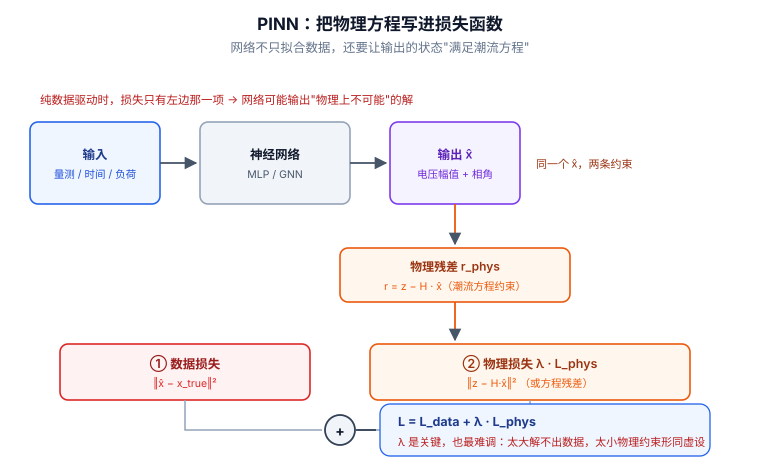

# 📘 第 13 周 · 物理信息神经网络与约束建模

> **本周目标**：前 12 周你做的都是"纯数据驱动"的模型 —— 给它量测，它学统计规律。这一周要解决它的根本弱点：**模型可能输出物理上根本不存在的解**。学完你应该能做到：说清纯数据驱动在电网里的三种失效模式；用 PyTorch 自动微分写出一个物理残差项；把潮流方程写成可微的损失项并在 IEEE 14 上算残差；区分硬约束和软约束并知道各自什么时候用；理解物理约束引导的 FDI 检测为什么对完全信息攻击**无效**、对近似攻击**有效**；识别物理约束训练中最常见的五个坑。
>
> **本周知识清单**：H 域 8 条（融入每天末尾的 ✅ 知识自查）
>
> **阶段位置**：第 10 周解决"结构"（图），第 11 周解决"数据"（生成），第 12 周解决"对手"（攻防），本周解决"**规律**"（物理）。这四周合起来，构成你论文方法章节的全部素材来源。
>
> **使用方式**：在 Typora 中按标题折叠展开，每天读对应的小节即可。

[[深度学习学习总目录|← 返回总目录]]

---

## Day 82 —— 纯数据驱动的失效边界：物理不可行的解

> **一句话**：神经网络只对"训练分布内的输入"负责 —— 出了分布，它给你的不是"不确定"，而是**一个自信的、物理上不可能的数**。

### 一、先看一个具体反例

拿一个最简单的任务：**已知 14 个节点的有功负荷，预测 14 个节点的电压幅值**。这是电网里最常见的回归任务，也是很多论文的第一层模块。

用一个普通 MLP 训练，然后把它推到训练分布之外：

| 工况 | 负荷倍率 | MLP 预测的最低电压 | 潮流真值 | 物理可行性 |
|---|---|---|---|---|
| 训练覆盖范围 | 0.8 ~ 1.2 | 0.98 p.u. | 0.98 p.u. | ✅ 合理 |
| 轻度外推 | 1.4 | 0.93 p.u. | 0.94 p.u. | ✅ 还算合理 |
| 中度外推 | 1.8 | **0.71 p.u.** | 0.91 p.u. | ❌ 已经越过电压崩溃点，实际早就失稳了 |
| 重度外推 | 2.5 | **−0.15 p.u.** | 潮流不收敛 | ❌ **负电压幅值，物理上不存在** |

**负的电压幅值是什么概念**：电压幅值是电压相量的模长，`V = |V̇| ≥ 0`。MLP 输出 `−0.15` 不是"精度差"，是**输出空间本身就不对**。

> **关键认知**：MLP 的输出层是 `Linear`，值域是 `(−∞, +∞)`。它**没有任何机制**知道电压不能为负。你不告诉它，它就不管。

### 二、纯数据驱动的三种失效模式

| # | 失效模式 | 表现 | 在电网里的具体后果 |
|---|---|---|---|
| **1** | **外推崩溃** | 训练分布外输出无意义 | 负荷高峰 / 检修方式下给出错误状态 |
| **2** | **守恒律违反** | 输出不满足物理方程 | 预测的功率不满足 KCL/KVL，潮流无解 |
| **3** | **噪声过拟合** | 把量测噪声当成信号学进去 | 检测器把正常噪声波动当攻击，误报率暴涨 |

**第 2 条的量化方式** —— 这就是"残差"：

```
给定模型预测的状态 x̂，把它代回潮流方程：

  rP_i = P_i^spec − V̂_i Σ_j V̂_j (G_ij cos θ̂_ij + B_ij sin θ̂_ij)
  rQ_i = Q_i^spec − V̂_i Σ̂_j V̂_j (G_ij sin θ̂_ij − B_ij cos θ̂_ij)

rP、rQ 越大，说明模型给的解越"不物理"。
纯数据驱动的模型，这个残差**没有任何下界保证**。
```

**第 3 条的量化方式** —— 数据里的"物理一致性"本来就是弱的：

| 数据来源 | 物理一致性 | 原因 |
|---|---|---|
| pandapower 完美潮流结果 | 100% 满足 | 是方程的精确解 |
| 加了高斯噪声的量测 | **不满足**（残差 ≈ 噪声量级） | 噪声破坏了方程 |
| 真实 SCADA 数据 | **不满足**（残差更大） | 含坏数据、时延、未记录的操作 |

> **这是一个反直觉但极重要的点**：**你训练用的数据本身就不满足物理方程。** 所以"让模型学数据"和"让模型满足物理"这两个目标，天生就是冲突的 —— 这就是 Day 87 要讲的权重失衡问题的根源。

### 三、什么时候真的需要物理约束

**不要看到"物理约束"就上。** 先做这张表：

| 你的任务 | 需要物理约束吗 | 理由 |
|---|---|---|
| 从量测回归状态（状态估计） | ✅ **需要** | 输出有明确物理可行域，且方程已知 |
| 从负荷预测电压 | ✅ **需要** | 外推是常态（负荷永远会创新高） |
| FDI **检测**（二分类） | ⚠️ **看情况** | 检测器输出是 0/1，没有"物理不可行"的问题；但残差可以当特征 |
| 攻击样本生成 | ✅ **需要** | 不满足物理的攻击样本是"假攻击"（回顾 Day 39） |
| 负荷预测（时序） | ❌ **不太需要** | 负荷曲线没有强物理方程，统计规律就是主要规律 |
| 设备故障分类 | ❌ **不需要** | 输出是类别，没有物理可行域 |

> **判断标准**：**只有当"输出必须落在某个物理可行域内"或者"输出必须满足某个已知方程"时，物理约束才有意义。**
>
> 如果只是分类任务，硬套物理约束是**给自己加复杂度，换不来收益** —— 这一点在论文里如果写不好，审稿人会直接问"你的物理约束带来了什么增益"。

**❌ / ✅ 对照**：

```
❌ 差的做法：
   "我们在损失里加了潮流方程残差项，因此模型具有物理一致性。"
   → 残差项只是一个软惩罚，模型完全可以学到"残差 0.05"的解。
   → "因此"这两个字站不住。

✅ 好的做法：
   "我们约束输出状态满足 V ∈ [0.9, 1.1] p.u.（硬约束，由输出层参数化保证），
    并把功率平衡残差作为软惩罚项（λ = 0.1）。
    在 1.5 倍负荷的外推工况下，硬约束把电压越限样本从 34% 降到 0%，
    软约束把平均残差从 0.083 降到 0.021 p.u.。"
   → 说了约束的形式、强度、和可测量的效果。
```

### 四、和电网安全的关系

**对安全研究来说，纯数据驱动的失效边界有两个方向的意义：**

**方向一：防御侧 —— 检测器会学到"错的规律"。**

| 情况 | 后果 |
|---|---|
| 训练数据里只有正常运行工况 | 检测器把"没见过的正常工况"（检修、大负荷）判为异常 → **误报** |
| 训练数据里没有拓扑变化 | 拓扑一变，检测器全面误报 |
| 攻击者知道检测器依赖某个统计特征 | 构造"物理可行 + 统计正常"的攻击 → **漏报** |

**方向二：攻击侧 —— 纯数据驱动的攻击样本生成会造出"假攻击"。**

回顾 Day 39 的核心判断：**用随机扰动生成的攻击样本，连传统 BDD 都能抓住，在这种样本上训练/评估检测器，等于在解决一个已经被解决的问题。**

物理约束在这里的作用是**限定攻击者的可行域**：

```
攻击者能改的量测 Δz 必须满足：
  ① 落在 H 的列空间里（否则被 BDD 抓）        ← 这是 Day 38 学的
  ② 不导致量测越限（否则被规则引擎抓）
  ③ 对应的状态 Δx 仍在合理运行范围内

这三条合起来，才是"真实攻击者能做什么"。
你的评估实验如果不加这三条，测出来的检测率是虚高的。
```

**诚实边界（必须写进论文 Limitations）**：

| 说法 | 诚实版本 |
|---|---|
| "物理约束保证模型输出可信" | "物理约束保证输出落在可行域内，**不保证输出正确** —— 可行域内的错误解依然存在" |
| "加入物理约束后模型更可解释" | "加入残差项不等于模型可解释。残差项只约束输出的一致性，不提供任何归因信息" |
| "物理约束提升检测率" | "在 X 类攻击下提升，在 Y 类攻击下无效（原因见 Day 86）" |

### 🔍 延伸思考

1. 上面表格里"负荷预测不需要物理约束"，但如果我要预测的是**未来 24 小时的线路潮流**，需不需要？（提示：潮流的分布由方程决定，负荷的分布由行为决定 —— 两者的"规律来源"不同）
2. 训练数据的物理残差本来就非零（因为噪声）。那么"模型残差小"这件事，到底证明了什么？它能证明模型学到了物理，还是只证明了它学会了平滑？
3. 如果攻击者也知道你在用物理约束检测，他会怎么调整？这个调整的成本有多高？

### 📚 参考

- Karniadakis et al. (2021), *Physics-Informed Machine Learning*, Nature Reviews Physics —— 综述，看它怎么分类"物理约束的三种融入方式"
- 检索建议：搜 `physics informed machine learning power system`，用第一遍法筛 10 篇

### 🎬 视频讲解

> 以下为**关键词检索式**推荐（平台搜索结果，非固定视频链接，避免失效）。
> 直接复制关键词到对应平台搜索即可，也可在结果里挑播放量高的看。

| 平台 | 推荐搜索关键词 | 说明 |
|---|---|---|
| **B站** | [物理信息神经网络 失效 局限](https://search.bilibili.com/all?keyword=物理信息神经网络+失效+局限) | PINN 的问题与边界 |
| **B站** | [神经网络 外推 能力 讨论](https://search.bilibili.com/all?keyword=神经网络+外推+能力+讨论) | 为什么 MLP 出了分布就崩 |
| **B站** | [电力系统 潮流 物理约束 神经网络](https://search.bilibili.com/all?keyword=电力系统+潮流+物理约束+神经网络) | 电网里怎么用物理约束 |
| **抖音** | [物理信息神经网络 是什么](https://www.douyin.com/search/物理信息神经网络+是什么) | 一分钟建立概念 |

### ✅ 知识自查

- [ ] 🟢 **概念** 纯数据驱动的三种失效模式：外推崩溃 / 守恒律违反 / 噪声过拟合
- [ ] 🟢 **概念** 为什么 MLP 的输出层无法保证电压非负（`Linear` 值域是 `(−∞,+∞)`）
- [ ] 🟢 **概念** 潮流残差 `rP` / `rQ` 的定义与计算方式
- [ ] 🟢 **判断** 能对给定任务判断"需不需要物理约束"（对照本节表格）
- [ ] 🟡 **概念** 训练数据的物理残差本来就非零（噪声导致），这是权重冲突的根源
- [ ] 🟡 **判断** 能说清"物理约束保证可行 ≠ 保证正确"
- [ ] 🔴 **概念** 物理约束在攻击样本生成里的作用：限定攻击者可行域

---

## Day 83 —— PINN 原理：把方程写进损失函数

> **一句话**：PINN 的全部思想就一句话 —— **损失函数里除了"拟合数据"，再加一项"满足方程"**；而"方程残差"用自动微分算，不需要网格。

### 一、核心公式：两项损失

```
总损失：

  L(θ) = L_data(θ) + λ · L_phys(θ)

其中：

  L_data = (1/N_d) Σ_i |u_θ(x_i) − u_i|²          ← 拟合观测数据
  L_phys = (1/N_c) Σ_j |N[u_θ](x_j)|²             ← 满足物理方程

N[·] 是微分算子，例如热传导方程 N[u] = u_t − α·u_xx
```

**逐项对照**：

| 项 | 用什么点算 | 需要标签吗 | 作用 |
|---|---|---|---|
| `L_data` | 观测点 `x_i`（有真值） | ✅ 需要 | 把解锚定到真实数据 |
| `L_phys` | **配点（collocation points）** | ❌ **不需要** | 让解处处满足方程 |

> **配点（collocation point）是 PINN 最容易被忽略、也最关键的概念。**
>
> 它是**在定义域内随机撒的点**，不需要任何标签。你只是要求"模型在这些点上算出来的方程残差要小"。
>
> **所以 PINN 在标签稀缺时特别有吸引力** —— 物理项用的是无标签数据，理论上可以撒无限多个点。

### 二、自动微分求残差

**这是 PINN 的技术核心。** 回顾 Day 5：autograd 可以求"输出对输入"的梯度，只要输入 `requires_grad=True`。

```python
import torch
import torch.nn as nn

# ============ 1. 网络：输入 (x, t)，输出 u ============
class PINN(nn.Module):
    def __init__(self, width=64, depth=4):
        super().__init__()
        layers = [nn.Linear(2, width), nn.Tanh()]
        for _ in range(depth - 1):
            layers += [nn.Linear(width, width), nn.Tanh()]
        layers += [nn.Linear(width, 1)]
        self.net = nn.Sequential(*layers)

    def forward(self, x, t):
        return self.net(torch.cat([x, t], dim=-1))


# ============ 2. 物理残差：u_t − α·u_xx ============
def heat_residual(model, x, t, alpha=0.01):
    """
    x: (N, 1) 空间坐标    t: (N, 1) 时间坐标
    返回: (N, 1) 残差
    """
    x = x.clone().requires_grad_(True)
    t = t.clone().requires_grad_(True)

    u = model(x, t)                                     # (N, 1)

    # 一阶导：u_t、u_x
    u_t = torch.autograd.grad(
        u, t, grad_outputs=torch.ones_like(u), create_graph=True
    )[0]
    u_x = torch.autograd.grad(
        u, x, grad_outputs=torch.ones_like(u), create_graph=True
    )[0]

    # 二阶导：u_xx（对 u_x 再求一次）
    u_xx = torch.autograd.grad(
        u_x, x, grad_outputs=torch.ones_like(u_x), create_graph=True
    )[0]

    return u_t - alpha * u_xx


# ============ 3. 训练循环骨架 ============
def train_step(model, optimizer, x_data, u_data, x_col, t_col, lam=1.0):
    optimizer.zero_grad()

    # ① 数据损失
    u_pred = model(x_data[:, 0:1], x_data[:, 1:2])
    loss_data = ((u_pred - u_data) ** 2).mean()

    # ② 物理损失
    r = heat_residual(model, x_col, t_col)
    loss_phys = (r ** 2).mean()

    loss = loss_data + lam * loss_phys
    loss.backward()
    optimizer.step()
    return loss_data.item(), loss_phys.item()
```

**三个必须注意的实现细节**：

| 细节 | 说明 | 漏了会怎样 |
|---|---|---|
| `create_graph=True` | 求一阶导时要建图，才能求二阶导 | 二阶导直接报错或返回 None |
| 输入要 `requires_grad_(True)` | 我们要的是"输出对输入"的梯度，不是对参数 | 报 "element does not require grad" |
| 配点每步重采 | 或用固定的拉丁超立方点集 | 固定少量点 → 残差只在那几个点上小，别处照样违反 |



> **看图说话**：上图的关键是底部那个 **`+` 号节点** —— 它才是 PINN 的全部创新。网络输出状态 `x̂` 后，误差向两条路分流：**① 数据损失** `‖x̂ − x_true‖²`，要求估计逼近真值（所有监督学习都有这一项）；**② 物理损失** `λ·L_phys`，把 `x̂` 代回物理关系（这里是 `r = z − H·x̂`），要求估计**不违反潮流方程**。纯数据驱动时只剩 ①，网络可能输出“物理上不可能”的解 —— 比如电压幅值为负，或相角突变到不可能的值。顶部那句注解 **“同一个 x̂，两条约束”** 点出了本质：物理项不是额外的输入，而是对**同一个输出**追加的第二个约束。最后那句红字要记住：**`λ` 是关键也最难调** —— 太大则网络忙着满足物理、解不出数据；太小则物理约束形同虚设。


### 三、一个最小可跑的例子，和它的诚实定位

**先用一个你能一眼验证对错的例子**：一维弹簧振子。

```
方程：u'' + ω²u = 0,   ω = 2π
初值：u(0) = 1, u'(0) = 0
精确解：u(t) = cos(2πt)
```

**跑完 PINN 之后，你应该看到**：`L_data` 与 `L_phys` 同步下降，2000 步左右残差到 `1e-3` 量级，20000 步到 `1e-5`，与精确解的最大误差从 `1.0` 降到 `0.005` 量级。**如果 `L_data` 降而 `L_phys` 不降（或反之），说明权重失衡 —— 见 Day 87。**

**然后是最重要的诚实部分**：

> **这个例子用 PINN 解，是"用牛刀杀鸡"。**
>
> 同一个方程，`scipy.integrate.solve_ivp` 用 3 行代码、1 毫秒、精度到 1e-10。PINN 用 20000 步、几秒钟、精度只到 1e-3。
>
> **PINN 不是在"求解已知方程"这件事上赢传统数值方法的。** 它的价值在三个地方：
>
> | 场景 | 为什么 PINN 有用 |
> |---|---|
> | **反问题（inverse problem）** | 方程里的参数未知，要从数据反推。PINN 可以把参数也设成可学习变量，天然统一 |
> | **数据 + 方程混合** | 观测稀疏、但方程已知。传统方法不好融合两者，PINN 的损失函数天然融合 |
> | **高维问题** | 传统网格方法维数灾难（`d` 维需要 `n^d` 个点），PINN 用蒙特卡洛采样规避 |

**❌ / ✅ 对照**：

```
❌ 夸大："PINN 是求解偏微分方程的新范式，可以替代传统数值方法。"
✅ 诚实："PINN 在观测稀疏、方程部分已知的反问题上具有优势；
         在正问题（方程和边界条件都已知）上，其精度与效率通常低于成熟的数值方法。"

❌ 夸大："我们的模型是物理可解释的。"
✅ 诚实："我们把潮流方程残差作为正则项，使输出更接近物理可行解。
         这不提供归因解释 —— 我们仍需要 SHAP / 注意力可视化来说明
         模型依赖了哪些输入。"
```

### 四、和电网安全的关系

**在电网里，PINN 最自然的落点是"状态估计"，而不是"解潮流"。**

| 电力任务 | PINN 的定位 | 理由 |
|---|---|---|
| **潮流计算（正问题）** | ❌ **不要用** | pandapower / MATPOWER 已经做完了，比 PINN 快且准 |
| **状态估计（反问题）** | ✅ **有戏** | 观测有噪声、有缺失，方程已知 —— 正是 PINN 的舒适区 |
| **参数辨识（线路参数未知）** | ✅ **有戏** | 标准反问题，PINN 可以把参数设成可学习变量 |
| **量测缺失下的状态重建** | ✅ **有戏** | 方程提供的信息可以补上缺失的量测 |
| **FDI 检测** | ⚠️ **间接** | 检测本身不需要 PINN，但残差可以作为检测特征（Day 86 展开） |

**把状态估计写成 PINN 的形式**：

```
未知量：状态 x = [V_1..V_n, θ_1..θ_n]（模型输出）
数据项：L_data = Σ_i w_i · (z_i − h_i(x̂))²        ← 量测方程残差
物理项：L_phys = Σ_i (rP_i² + rQ_i²)               ← 潮流方程残差

其中 h_i(·) 是量测函数（第 i 个量测怎么由状态算出来）
```

**这里有一个必须说清的诚实边界**：

> **`L_data` 和 `L_phys` 在数学上是"同一件事的两种写法"。**
>
> 因为量测方程 `z = h(x) + e` 本身就是物理方程。所谓"物理残差"和"量测残差"，在完全量测下是等价的。
>
> **它们真正不同的地方只有两处**：
>
> | 差异 | 含义 |
> |---|---|
> | **定义域** | `L_data` 只在有量测的点上算；`L_phys` 可以在**任何节点**上算（包括没有量测的节点） |
> | **权重** | `L_data` 通常按量测精度加权；`L_phys` 按节点均匀 |
>
> **所以"物理约束"在状态估计里的真实价值是：在量测覆盖不到的地方补上信息。** 如果你的量测冗余度足够高，物理项带来的增益会**很小甚至为零** —— 这一点必须在论文里诚实报告（做消融实验对比 `λ = 0` 和 `λ > 0`）。

### 🔍 延伸思考

1. 配点不需要标签，那是不是可以撒 100 万个？撒得越多越好吗？（提示：想想计算成本，以及"残差小"和"解正确"的关系）
2. 在状态估计里，`L_data` 和 `L_phys` 在有量测的节点上高度相关。这种相关性对优化有什么影响？（提示：想想 Day 3 讲过的条件数）
3. 如果方程本身就是错的（比如用 DC 潮流近似 AC 系统），PINN 会学到什么？这个错误会以什么形式表现出来？

### 📚 参考

- Raissi, Perdikaris & Karniadakis (2019), *Physics-Informed Neural Networks: A Deep Learning Framework for Solving Forward and Inverse Problems Involving Nonlinear Partial Differential Equations*, Journal of Computational Physics —— **PINN 的原始论文**，[arXiv:1711.10561](https://arxiv.org/abs/1711.10561)（注：arXiv v1 的标题是 *Physics Informed Deep Learning (Part I): Data-driven Solutions of Nonlinear PDEs*，与期刊版标题不同，编号是同一个）
- 检索建议：搜 `physics informed neural network power system state estimation`，看别人怎么把它搬到电网

### 🎬 视频讲解

> 以下为**关键词检索式**推荐（平台搜索结果，非固定视频链接，避免失效）。
> 直接复制关键词到对应平台搜索即可，也可在结果里挑播放量高的看。

| 平台 | 推荐搜索关键词 | 说明 |
|---|---|---|
| **B站** | [物理信息神经网络 PINN 原理 讲解](https://search.bilibili.com/all?keyword=物理信息神经网络+PINN+原理+讲解) | 从损失函数讲到自动微分 |
| **B站** | [PINN 代码 实现 pytorch](https://search.bilibili.com/all?keyword=PINN+代码+实现+pytorch) | 手把手写残差项 |
| **B站** | [自动微分 autograd 二阶导](https://search.bilibili.com/all?keyword=自动微分+autograd+二阶导) | 搞懂 `create_graph` |
| **抖音** | [PINN 物理信息神经网络 是什么](https://www.douyin.com/search/PINN+物理信息神经网络+是什么) | 一分钟建立概念 |

### ✅ 知识自查

- [ ] 🟢 **概念** PINN 损失的两项结构：`L = L_data + λ·L_phys`
- [ ] 🟢 **概念** 配点（collocation point）：无标签，随机撒在定义域内
- [ ] 🟢 **实践** 用 `torch.autograd.grad` 求一阶导与二阶导（`create_graph=True`）
- [ ] 🟢 **实践** 写出弹簧振子 / 热传导的 PINN 残差并训练到收敛
- [ ] 🟡 **判断** 能说清 PINN 在**正问题**上不优于传统数值方法
- [ ] 🟡 **判断** 能说清 `L_data` 与 `L_phys` 在状态估计里的真实差异（定义域 + 权重）
- [ ] 🟡 **概念** PINN 的三类适用场景：反问题 / 数据方程混合 / 高维
- [ ] 🔴 **概念** "残差项 ≠ 可解释性"

---

## Day 84 —— 从潮流方程到损失项：残差型物理约束

> **一句话**：把潮流方程变成损失项，技术上只有三步 —— **拿到 `Ybus`、用 PyTorch 张量重写方程、把残差归一化**；第三步最容易被忽略，也最容易让训练失败。

### 一、两种残差：功率平衡残差 vs 量测方程残差

**这两者不是一回事，混用是常见错误。**

```
【残差 A：功率平衡残差（节点注入方程）】
  rP_i = P_i^spec − V_i Σ_j V_j (G_ij cos θ_ij + B_ij sin θ_ij)
  rQ_i = Q_i^spec − V_i Σ_j V_j (G_ij sin θ_ij − B_ij cos θ_ij)
  定义域：所有节点（含无发电机、无负荷的联络节点）
  需要：G、B 矩阵（由拓扑和线路参数决定）+ 每个节点的注入指定值

【残差 B：量测方程残差】
  rM_k = z_k − h_k(x̂)
  定义域：只有被量测覆盖的量（支路功率、节点电压）
  需要：量测函数 h(·) 和量测值 z
```

| 维度 | 残差 A（功率平衡） | 残差 B（量测方程） |
|---|---|---|
| **定义在哪些点** | 所有节点 | 只有量测点 |
| **需要什么** | 拓扑 + 线路参数 + 注入指定值 | 量测函数 + 量测值 |
| **在状态估计里等价吗** | 不完全等价 | 不完全等价 |
| **无标签数据能用吗** | ✅ **能**（不需要量测） | ❌ 不能（必须有 `z`） |
| **对 FDI 攻击敏感吗** | ⚠️ 攻击者构造 `Δz = H·Δx` 时**不敏感**（Day 86 展开） | ⚠️ 同上 |

> **`Δz = H·Δx` 里的 `H`，就是量测函数 `h(·)` 的雅可比矩阵。** 所以严格满足 `Δz = H·Δx` 的攻击，会让**残差 B 在攻击点上一阶不变**。这是 Day 86 的核心。

### 二、用 PyTorch 实现：从 pandapower 拿 Ybus

```python
import numpy as np
import pandapower as pp
import pandapower.networks as pn
import torch


def get_ybus(net):
    """从 pandapower 网络构造 Ybus（复数，标幺）。教学用简化实现。"""
    pp.runpp(net)
    n = len(net.bus)
    Y = np.zeros((n, n), dtype=complex)

    def add_branch(i, j, y):
        Y[i, i] += y; Y[j, j] += y
        Y[i, j] -= y; Y[j, i] -= y

    # 线路：串联阻抗换算成标幺导纳
    for _, ln in net.line.iterrows():
        if not ln.at['in_service']:
            continue
        i, j = int(ln.at['from_bus']), int(ln.at['to_bus'])
        r = ln.at['r_ohm_per_km'] * ln.at['length_km']
        x = ln.at['x_ohm_per_km'] * ln.at['length_km']
        z_base = (net.bus.at[i, 'vn_kv'] ** 2) / net.sn_mva     # 基准阻抗（Ω）
        add_branch(i, j, 1.0 / ((r + 1j * x) / z_base))

    # 变压器：只取串联阻抗（忽略非标准变比与励磁）
    for _, tr in net.trafo.iterrows():
        if not tr.at['in_service']:
            continue
        i, j = int(tr.at['hv_bus']), int(tr.at['lv_bus'])
        vk, vkr = tr.at['vk_percent'] / 100, tr.at['vkr_percent'] / 100
        add_branch(i, j, 1.0 / (vkr + 1j * np.sqrt(max(vk**2 - vkr**2, 0.0))))

    return Y
```

> **⚠️ 关于 Ybus 的诚实说明**
>
> 上面这段是**教学用简化实现**，它忽略了变压器的非标准变比、移相、线路充电电容（`c_nf_per_km`）、以及 shunt 的精确建模。
>
> **做正式实验时，不要用这段代码。** 三条更可靠的路径：
>
> | 路径 | 说明 |
> |---|---|
> | **MATPOWER 的 `makeYbus`** | 最标准，被几乎所有论文引用为基准。可从 MATLAB 导出为 `.mat`/`.csv` 后在 Python 读入 |
> | **`pandapower.estimation` 模块** | 提供 WLS 状态估计与量测函数，可直接复用（需 pandapower ≥ 2.2） |
> | **`net._ppc['internal']['Ybus']`** | 内部结构，**随版本变化**，只在确认版本后使用 |
>
> **验证方法**：用它算一次潮流，和 `pp.runpp` 的结果对比，残差应在 `1e-10` 量级。**这一步不能省** —— 一个错的 Ybus 会让后面所有实验白做。

### 三、残差的 PyTorch 实现与归一化

```python
import torch

def power_flow_residual(V, theta, G, B, P_spec, Q_spec, sn_mva=100.0):
    """V, theta: (batch, n) 电压幅值(p.u.)与相角(rad)；G, B: (n, n) Ybus 实部/虚部
       P_spec, Q_spec: (batch, n) 节点注入(MW/MVar)；返回 rP, rQ 各 (batch, n)"""
    dtheta = theta.unsqueeze(2) - theta.unsqueeze(1)        # θ_ij = θ_i − θ_j
    cos_d, sin_d = torch.cos(dtheta), torch.sin(dtheta)
    Vi = V.unsqueeze(2)                                     # (b, n, 1) → V_i
    Vj = V.unsqueeze(1)                                     # (b, 1, n) → V_j

    P_calc = Vi * (Vj * (G * cos_d + B * sin_d)).sum(dim=2)  # (b, n)  p.u.
    Q_calc = Vi * (Vj * (G * sin_d - B * cos_d)).sum(dim=2)  # (b, n)  p.u.

    # 换算到 MW / MVar（与 P_spec 同量纲）
    P_calc = P_calc * sn_mva
    Q_calc = Q_calc * sn_mva

    return P_spec - P_calc, Q_spec - Q_calc
```

**关键：为什么必须归一化？**

看一个真实的量级分布（IEEE 14，`sn_mva = 100`）：

| 残差分量 | 未归一化的典型量级 | 说明 |
|---|---|---|
| `rP`（节点有功） | `1e0 ~ 1e2` MW | 与负荷同量级 |
| `rQ`（节点无功） | `1e0 ~ 1e2` MVar | 与无功注入同量级 |
| `rV`（电压幅值残差） | `1e-3 ~ 1e-1` p.u. | 与电压偏差同量级 |
| `rθ`（相角残差） | `1e-3 ~ 1e-1` rad | 与相角偏差同量级 |

**如果直接平方相加**，`rP` 会完全支配损失 —— 模型会拼命把 `rP` 压下去，而电压/相角的残差基本不动。**这就是 Day 87 讲的"权重失衡"，只不过它发生在归一化之前，属于"隐性失衡"。**

**四种归一化策略对照**：

| 策略 | 公式 | 优点 | 缺点 |
|---|---|---|---|
| **基准值归一化** | `r / S_base` | 物理意义清晰，跨算例可比 | 只解决了量纲，没解决量级 |
| **统计归一化** | `(r − μ_r) / σ_r` | 各项量级统一，最常用 | `μ_r, σ_r` 要用训练集算，且**必须是常数** |
| **相对误差** | `r / max(\|指定值\|, ε)` | 小注入节点也能被重视 | 除零风险；注入接近 0 的节点会爆炸 |
| **分项权重** | `Σ_k λ_k · L_k` | 最灵活 | 多了一组超参要调 |

**推荐做法**：

```python
class NormalizedResidual(nn.Module):
    """把 P/Q 残差按训练集统计量归一化（统计量固定，不参与训练）"""

    def __init__(self, p_std, q_std):
        super().__init__()
        self.register_buffer("p_std", torch.as_tensor(p_std).clamp(min=1e-6))
        self.register_buffer("q_std", torch.as_tensor(q_std).clamp(min=1e-6))

    def forward(self, rP, rQ):
        # 每个节点用各自的尺度，避免个别大负荷节点支配损失
        return (rP / self.p_std) ** 2 + (rQ / self.q_std) ** 2
```

> **用 `register_buffer` 而不是普通属性**：这样统计量会随模型一起 `.to(device)`，但不会被优化器更新。**不要把它设成 `nn.Parameter`** —— 否则模型可以通过把 `std` 学大来作弊降低损失。

### 四、和电网安全的关系

**残差在电网安全里的两个直接用途**：

| 用途 | 做法 |
|---|---|
| **① 作为检测统计量** | 传统 BDD 只用 `‖r‖₂ > τ`；物理约束法用**学到的残差模式**（不只范数）判断异常 |
| **② 作为攻击样本可行性的判据** | 生成攻击样本时要求 `‖r‖` 不能太大 —— 否则样本"太假"，一测就抓。这给了你一个**可控的攻击强度参数** |

**但必须说清一个关键事实**：

> **如果攻击者严格按 `Δz = H·Δx` 构造攻击（完全信息），那么线性化残差 `r = z − H·x̂` 的一阶变化严格为零。**
>
> 这不是"检测难"，是**在 DC 潮流模型下残差法在数学上完全失效**。推导见 Day 86。
>
> **所以"用潮流残差检测 FDI"这句话，单独说是不成立的。** 它必须配上前提：
>
> | 前提 | 残差法是否有效 |
> |---|---|
> | DC 潮流 + 攻击者用完整 `H` | ❌ **完全无效**（残差恒等不变） |
> | AC 潮流 + 攻击者用 DC 的 `H` 近似 | ✅ 有效（残差有 O(‖Δx‖) 的一阶泄漏） |
> | AC 潮流 + 攻击者用真实雅可比 `J(x_true)` | ⚠️ 仅剩 O(‖Δx‖²) 的二阶泄漏 |
> | 攻击者只能改部分量测（部分信息） | ✅ 有效（覆盖不足 → 残差无法完全投影为零） |
>
> **写论文时，你的贡献必须落在"哪一行"上，而且要诚实标注。** 落在第一行是无效的；落在第二、四行才有价值。

**额外提醒**：拓扑变化（检修、跳闸）会让残差**显著上升**（因为 `G, B` 变了），而完全信息 FDI 让残差**不变** —— 前者造成误报、后者造成漏报。**残差型检测器最大的工程难点不是抓攻击，而是别把拓扑变化当攻击。** 详细分析见 Day 87 第四节。

### 🔍 延伸思考

1. 上面 `get_ybus` 忽略了线路充电电容。在 110 kV 及以上的高压网里，这个忽略会带来多大误差？在配电网里呢？
2. 归一化用的 `p_std`、`q_std` 是从训练集算的。如果测试集的负荷水平整体高 30%，归一化尺度还合适吗？这算不算一种分布偏移？
3. 拓扑变化会让残差上升 → 误报。如果攻击者**故意**触发一次拓扑变化（比如攻击开关遥信），同时发动 FDI，会发生什么？

### 📚 参考

- Abur & Exposito (2004), *Power System State Estimation: Theory and Implementation* —— 残差灵敏度矩阵的标准推导
- Thurner et al. (2018), *pandapower — An Open-Source Python Tool for Convenient Modeling, Analysis, and Optimization of Electric Power Systems*, IEEE Trans. Power Systems —— [arXiv:1709.06743](https://arxiv.org/abs/1709.06743)
- 检索建议：搜 `physics informed neural network power flow residual loss`，对照别人怎么写残差项

### 🎬 视频讲解

> 以下为**关键词检索式**推荐（平台搜索结果，非固定视频链接，避免失效）。
> 直接复制关键词到对应平台搜索即可，也可在结果里挑播放量高的看。

| 平台 | 推荐搜索关键词 | 说明 |
|---|---|---|
| **B站** | [节点导纳矩阵 Ybus 讲解](https://search.bilibili.com/all?keyword=节点导纳矩阵+Ybus+讲解) | 搞懂 G、B 从哪来 |
| **B站** | [潮流方程 推导 电力系统分析](https://search.bilibili.com/all?keyword=潮流方程+推导+电力系统分析) | 功率平衡方程的完整推导 |
| **B站** | [损失函数 多任务 权重 归一化](https://search.bilibili.com/all?keyword=损失函数+多任务+权重+归一化) | 多损失项怎么配比 |
| **抖音** | [导纳矩阵 是什么](https://www.douyin.com/search/导纳矩阵+是什么) | 一分钟建立概念 |

### ✅ 知识自查

- [ ] 🟢 **概念** 功率平衡残差 vs 量测方程残差的区别（定义域 + 是否需要标签）
- [ ] 🟢 **实践** 从 pandapower 网络构造 `Ybus`（`G`、`B` 矩阵）
- [ ] 🟢 **实践** 用 PyTorch 张量写出 `power_flow_residual` 并保证广播维度正确
- [ ] 🟢 **实践** 验证自己的 `Ybus`：用它算潮流，残差应在 `1e-10` 量级
- [ ] 🟢 **概念** 四种归一化策略，以及"隐性权重失衡"为什么发生在归一化之前
- [ ] 🟡 **概念** 用 `register_buffer` 存统计量，不能设成 `nn.Parameter`
- [ ] 🟡 **判断** 能说清残差法在四种攻击前提下的有效性差异（DC / AC 近似 / AC 精确 / 部分信息）
- [ ] 🔴 **概念** 拓扑变化会让残差上升 → 残差型检测器的最大工程难点是误报而非漏报

---

## Day 85 —— 硬约束 vs 软约束：投影层与惩罚项

> **一句话**：软约束是"**罚你**"（违反就打高分，但不保证不违反），硬约束是"**不让你**"（结构上就不可能违反）—— 前者灵活，后者可靠，选错方向比调错参数代价大得多。

### 一、软约束：惩罚项与拉格朗日法

**软约束 = 把"违反约束"变成损失的一部分。**

```
L = L_data + λ · L_phys + μ · L_violation

其中 L_violation 惩罚超出可行域的部分，例如电压越限：

  L_violation = Σ_i [ max(0, V_i − V_hi)² + max(0, V_lo − V_i)² ]

用 ReLU 实现就是：relu(V − V_hi)² + relu(V_lo − V)²
```

| 变体 | 形式 | 特点 |
|---|---|---|
| **固定权重惩罚** | `μ · L_violation` | 最简单；`μ` 难调 |
| **增广拉格朗日** | `L + λ·c + (ρ/2)·c²`，每步更新 `λ` | 收敛性有理论保证；实现复杂 |
| **自适应权重** | 按各损失项的梯度范数动态调 `λ` | 实践中最有效（Day 87 展开） |

**软约束的三个事实**：

| 事实 | 含义 |
|---|---|
| **不保证满足** | `μ` 再大也可能有残余违反；`μ → ∞` 会导致数值病态 |
| **可以让模型"作弊"** | 如果惩罚项写得不严，模型会找到"惩罚小但物理错"的解 |
| **梯度是稠密的** | 每个样本都有梯度，训练信号丰富 |

> **"作弊"的具体例子**：假设惩罚项写成 `relu(V − V_hi)`（一次方而不是平方），模型可以把 `V` 推到 `V_hi + 1e-8` 然后不再变化 —— 因为梯度在那里接近 0。**用平方项，梯度随违反程度线性增长，才不会出现这种"卡在边界上"的行为。**

### 二、硬约束：用结构保证可行

**硬约束 = 改模型的输出形式，让不可行的解根本表达不出来。**

**手法一：输出参数化（重新参数化）**

```python
import torch
import torch.nn as nn

class BoundedVoltageHead(nn.Module):
    """电压幅值输出层：tanh 把输出限制在 [v_lo, v_hi]（硬约束）"""
    def __init__(self, in_dim, n_bus, v_lo=0.90, v_hi=1.10):
        super().__init__()
        self.fc = nn.Linear(in_dim, n_bus)
        self.register_buffer("v_mid", torch.tensor((v_lo + v_hi) / 2.0))
        self.register_buffer("v_half", torch.tensor((v_hi - v_lo) / 2.0))

    def forward(self, h):
        # tanh 值域 (−1, 1) → 仿射到 (v_lo, v_hi)
        return self.v_mid + self.v_half * torch.tanh(self.fc(h))

class SimplexHead(nn.Module):
    """输出非负且和为 1 的向量：softmax 保证（用于切负荷比例分配）"""
    def __init__(self, in_dim, n):
        super().__init__()
        self.fc = nn.Linear(in_dim, n)

    def forward(self, h):
        return torch.softmax(self.fc(h), dim=-1)
```

| 参数化手法 | 保证的约束 | 代价 |
|---|---|---|
| `sigmoid` / `tanh` + 仿射 | 上下界 | 饱和区梯度小（回顾 Day 9 的梯度消失） |
| `softmax` | 非负 + 和为 1 | 只能表达"分配"类约束 |
| `softplus` / `exp` | 非负 | 值可能爆炸 |
| **预测增量 Δ 而不是绝对值** | 相对基准的小变化 | 需要可靠的基准值 |

**手法二：投影层（Projection Layer）**

```
前向：  x̃ = model(input)             ← 可能是不可行的
        x̂ = Proj_𝒞(x̃)               ← 投影到可行集 𝒞 上

反向：  梯度穿过投影（次梯度）
```

```python
class BoxProjection(nn.Module):
    """把输出逐元素投影到 [lo, hi]（最简单的投影：裁剪）"""
    def __init__(self, lo, hi):
        super().__init__()
        self.register_buffer("lo", torch.as_tensor(lo, dtype=torch.float32))
        self.register_buffer("hi", torch.as_tensor(hi, dtype=torch.float32))

    def forward(self, x):
        # clamp 的梯度在区间内为 1，在边界外为 0
        return torch.clamp(x, self.lo, self.hi)
```

> **`clamp` 的梯度问题**：区间外的点梯度为 0，所以**一旦某个输出长期贴在边界上，它就再也"学不动"了**（和 ReLU 死亡神经元是同一类问题，回顾 Day 9）。
>
> **缓解办法**：不要直接把 `clamp` 当输出层，而是**先加惩罚让输出大致落在区间内，再用 `clamp` 兜底**。这叫"软约束引导 + 硬约束保证"，是实践中最稳的组合。

**手法三：结构式保证（最优雅，但适用面窄）**

| 约束 | 结构式保证的做法 |
|---|---|
| 功率平衡 | 把平衡节点的注入**定义为**其余节点注入之和的相反数 → 平衡方程恒成立 |
| 线路上界 | 用"先算潮流、再按越限比例缩放"的**外层修正**，而不是让网络直接输出 |
| 时序单调性 | 输出用累积和（`cumsum`）+ 非负增量 |

> **代价**：约束被"焊死"在模型结构里，**换一个约束就要重写结构**。只在你最核心、最确定的那一条约束上用它。

### 三、硬 vs 软：一张决策表

| 维度 | 软约束（惩罚项） | 硬约束（结构 / 投影） |
|---|---|---|
| **是否保证满足** | ❌ 不保证 | ✅ 结构上保证 |
| **实现难度** | 低 | 中 ~ 高（要设计参数化） |
| **新增超参** | ✅ 有（`λ`、`μ`） | ❌ 基本没有 |
| **训练稳定性** | ⚠️ 权重失衡风险 | ✅ 稳定 |
| **表达能力** | ✅ 不受限 | ⚠️ 被参数化限制（可能表达不出真解） |
| **可微性** | ✅ 完全可微 | ⚠️ 投影可能不可微（需次梯度或软化） |
| **适用场景** | 约束是"倾向"而非"红线" | 约束是"红线"（越限即事故） |
| **电网里的例子** | 网损尽量小、与历史状态尽量接近 | **电压不越限**、**功率平衡**、**切负荷比例非负且和 ≤ 1** |

**选择顺序（建议直接照做）**：① 先问"这条约束违反了会怎样？"—— 会出事故 / 物理不可能 → 硬约束；只是效果差一点 → 软约束。② 能结构式保证的优先结构式保证（功率平衡就是这样）。③ 不能结构式保证的，用"软约束引导 + 硬约束兜底"。④ **只对 1~2 条最核心的约束上硬约束** —— 硬约束太多 → 可行域太小 → 模型只能输出平凡解。

**❌ / ✅ 对照**：

```
❌ 差的做法：
   同时用 clamp 把 V、θ、P、Q 全部硬约束住。
   → 可行域被压成一个很窄的盒子，模型几乎只能输出"接近中心值"的常数，
     训练损失降不下去，你会以为是自己网络不够深。

✅ 好的做法：
   V 用 tanh 参数化（硬约束，电压越限是红线）；
   θ 不加硬约束（相角本身无界，只有差值的物理含义）；
   功率平衡用结构式保证（平衡节点吸收）；
   其余（网损、平滑性）用软惩罚。
```

### 四、和电网安全的关系

**硬约束在电网安全里有一个被严重低估的用途：限定攻击者的可行域。** 防御侧用它保证输出物理可行；攻击侧用它划定"什么算合法量测"（越界的攻击样本直接判为无效）；评估侧用它定义评估协议的边界。

**但这里有一个极其重要、也极易被夸大的点**：

> **"输出物理可行"和"输出正确"是两件事。**
>
> 一个满足所有电压、功率约束的解，**完全可能是错的**。
>
> ```
> 攻击者在可行域内篡改量测
>   → 状态估计给出一个物理可行但偏移了 Δx 的状态
>   → 硬约束完全不起作用
> ```
>
> **硬约束只能防"物理上不可能的攻击"，不能防"物理上可能但错误的攻击"。**
>
> 而 FDI 的全部精妙之处，恰恰在于它构造的是**物理上可能**的假数据。

**所以硬约束在电网安全里的真实定位**：

| 说法 | 诚实版本 |
|---|---|
| "物理约束可以防御 FDI" | "物理约束（硬约束）能过滤掉不满足量测模型/越限的攻击样本，**对满足约束的 FDI 无效**" |
| "我们的模型输出保证物理可行" | "我们通过输出层参数化保证 V ∈ [0.9, 1.1]，但模型给出的状态是否接近真值，需要单独的精度指标评估" |
| "约束越强越安全" | "约束越强，可行域越小，模型表达能力越弱；需要在表达能力和安全性之间权衡" |

**一个实际有用的组合**（推荐在你的实验里用）：① **硬约束**保证输出物理可行（V 有界、切负荷非负）—— 把"明显荒谬的告警"从源头消掉；② **软约束**让输出接近物理方程（残差小）—— 提升精度，尤其在量测稀疏的节点；③ **残差作为额外检测特征**（Day 86）—— 在部分信息攻击下提升检测率。**三者互不替代，论文里要分开做消融、分开报告。**

### 🔍 延伸思考

1. `clamp` 的梯度在边界外为 0。如果你的模型有 30% 的输出长期贴在电压下界 0.9 上，你会怎么诊断和修复？
2. 功率平衡用"平衡节点吸收"这个结构式保证，会带来什么副作用？（提示：真实电网里，谁来吸收这个不平衡？它的能力有上限吗？）
3. 如果硬约束太强导致模型只能输出平凡解，你会怎么发现？（提示：看训练损失和验证损失的差距，以及预测值的方差）

### 📚 参考

- 检索建议：搜 `hard constraints neural network output layer projection`，看参数化保证约束的常见做法
- 检索建议：搜 `augmented lagrangian constrained neural network`，了解增广拉格朗日法的实现
- 回顾 Day 9（激活函数的饱和区）与 Day 12（正则化）

### 🎬 视频讲解

> 以下为**关键词检索式**推荐（平台搜索结果，非固定视频链接，避免失效）。
> 直接复制关键词到对应平台搜索即可，也可在结果里挑播放量高的看。

| 平台 | 推荐搜索关键词 | 说明 |
|---|---|---|
| **B站** | [约束优化 拉格朗日乘子法 讲解](https://search.bilibili.com/all?keyword=约束优化+拉格朗日乘子法+讲解) | 软约束的理论基础 |
| **B站** | [神经网络 输出 范围 限制 tanh](https://search.bilibili.com/all?keyword=神经网络+输出+范围+限制+tanh) | 输出参数化的实现 |
| **B站** | [投影 梯度 下降 讲解](https://search.bilibili.com/all?keyword=投影+梯度+下降+讲解) | 投影层的原理 |
| **抖音** | [硬约束 软约束 区别](https://www.douyin.com/search/硬约束+软约束+区别) | 一分钟搞清区别 |

### ✅ 知识自查

- [ ] 🟢 **概念** 软约束（惩罚项）与硬约束（结构 / 投影）的定义与区别
- [ ] 🟢 **实践** 用 `tanh` / `sigmoid` 参数化把输出限制在指定区间
- [ ] 🟢 **实践** 用 `softmax` 输出非负且和为 1 的分配向量
- [ ] 🟢 **实践** 用 `clamp` 实现 box 投影，并说清它在边界外梯度为 0 的后果
- [ ] 🟢 **概念** 增广拉格朗日法与固定权重惩罚的区别
- [ ] 🟡 **判断** 能对给定约束判断该用硬约束还是软约束（对照决策表）
- [ ] 🟡 **判断** 能说清"输出物理可行 ≠ 输出正确"，以及硬约束为什么防不住 FDI
- [ ] 🔴 **概念** 结构式保证（如平衡节点吸收不平衡量）的适用条件与副作用

---

## Day 86 —— 物理约束引导的 FDI 检测（把物理约束做成检测器）

> **一句话**：残差法的成败**完全取决于攻击者的信息水平** —— 攻击者用完整 `H`（DC 模型）时残差**恒等不变**，方法彻底失效；攻击者用 DC 近似打 AC 系统时残差有一阶泄漏，方法才有效。**分不清这两种情况，论文的核心论点就是错的。**

### 一、先做数学：残差在攻击下到底变不变

**这是本周最重要的一段推导，请自己推一遍。**

```
【DC 潮流模型下的残差灵敏度】

量测方程：   z = H·x + e
WLS 估计：   x̂ = (HᵀWH)⁻¹HᵀW·z
残差：       r = z − H·x̂
              = (I − H(HᵀWH)⁻¹HᵀW)·z
              = K·z

K 是残差灵敏度矩阵（一个投影矩阵，K² = K）。

【攻击 Δz = H·Δx 之后】

r_a = K·(z + Δz)
    = K·z + K·H·Δx
    = r + K·H·Δx

现在看 K·H：

  K·H = (I − H(HᵀWH)⁻¹HᵀW)·H
      = H − H(HᵀWH)⁻¹HᵀW·H
      = H − H
      = 0        ← 关键！

所以  r_a = r。残差**恒等不变**，不是"变化很小"，是"一模一样"。
```

> **结论（必须记住）**：
>
> **在 DC 潮流模型下，任何基于残差的检测方法（传统的或学习的）对完全信息 FDI 都完全失效。**
>
> 这不是"方法不够好"，是**数学上不可能**。因为攻击向量 `Δz = H·Δx` 落在 `range(H)` 里，而残差子空间是 `range(H)` 的正交补 —— **攻击向量的投影为零**。
>
> **如果你看到一篇论文声称"我们用潮流残差检测 FDI，检测率 99%"，第一个问题就是：它的攻击样本是怎么生成的？** 如果攻击样本不满足 `Δz ∈ range(H)`，那 99% 是在检测"容易的样本"。

### 二、AC 系统里的残差泄漏：一阶还是二阶？

**真实电网是 AC 的，量测函数 `h(x)` 是非线性的。这里有一个关键区别，很多论文说不清。**

```
【情况 A：攻击者用 DC 的 H 近似来攻击 AC 系统】

  攻击者注入 Δz = H_dc · Δx
  但 AC 系统真实雅可比是 J_ac = ∂h/∂x（且随 x 变化）

  ⇒ Δz 不落在 range(J_ac) 里
  ⇒ 残差变化是 O(‖Δx‖)   ← 一阶泄漏，**可检测**


【情况 B：攻击者用 AC 真实雅可比 J_ac(x_true) 攻击】

  攻击者注入 Δz = J_ac(x_true) · Δx

  在真实状态 x_true 附近线性化：
    h(x̂_a) ≈ h(x_true) + J_ac·(x̂_a − x_true)
    WLS 一阶解：x̂_a ≈ x_true + Δx

  ⇒ r_a = z + JΔx − h(x_true) − J·Δx = z − h(x_true) = r

  一阶项完全抵消。
  剩下的残差变化来自二阶项与迭代收敛误差：
    ‖Δr‖ = O(‖Δx‖²)     ← 二阶泄漏，**通常淹没在量测噪声之下**
```

| 攻击者的模型 | 残差泄漏阶数 | 残差法能检测吗 | 说明 |
|---|---|---|---|
| DC 系统 + 完整 `H` | **零**（恒等不变） | ❌ 完全不能 | 数学上不可能 |
| AC 系统 + DC 的 `H` 近似 | `O(‖Δx‖)` | ✅ **能** | **这是残差法真正的用武之地** |
| AC 系统 + 真实雅可比 | `O(‖Δx‖²)` | ⚠️ **很难** | 泄漏通常小于噪声 |
| 部分信息（只能改 k 个量测） | 取决于覆盖度 | ✅ 通常能 | 覆盖不足 → 无法完全投影为零 |
| 拓扑变化场景 | 残差上升 | ⚠️ 误报风险高 | 见 Day 84 |

**量化一下二阶泄漏到底有多小**（IEEE 14，`Δx` 为相角偏移 `0.02 rad` 量级，量测噪声 `σ ≈ 0.01 p.u.`）：

| 项 | 量级 | 相对噪声 |
|---|---|---|
| 一阶泄漏 `O(‖Δx‖)` | `≈ 0.02` p.u. | **噪声的 2 倍 → 可检测** |
| 二阶泄漏 `O(‖Δx‖²)` | `≈ 4×10⁻⁴` p.u. | **噪声的 1/25 → 不可检测** |

> **这个数字对比说明了一切**：**残差法能抓的是"用错模型的攻击者"，抓不住"用对模型的攻击者"。**
>
> 这不是"再调调参就能解决"的问题。**在论文里，你必须明确说清你的方法在哪一行有效。**

### 三、把残差做成检测器：三种融合方式

| 方式 | 做法 | 优点 | 缺点 |
|---|---|---|---|
| **① 残差作为特征** | 把 `rP, rQ` 拼进检测器的输入特征 | 实现简单，与任何分类器兼容 | 需要显式构造 `H` / `Ybus` |
| **② 残差作为损失项** | 检测器训练时同时最小化残差 | 无标签数据可用 | 检测器是二分类器，加残差约束动机不直接 |
| **③ 残差作为拒绝规则** | `‖r‖ > τ` 时直接判为异常（reject） | 可解释、可审计 | 阈值难定；对完全信息 FDI 无效 |

**推荐：方式 ① + 方式 ③ 组合。**

```python
import torch
import torch.nn as nn

class PhysicsGuidedDetector(nn.Module):
    """
    物理约束引导的 FDI 检测器（骨架）
      z      : (batch, m)  量测
      r_feat : (batch, m)  残差特征（由 Ybus + 潮流方程算出，见 Day 84）
    返回 logit（异常分数）与 r_norm（残差范数，用于拒绝规则）
    """
    def __init__(self, m, hidden=128, use_residual=True):
        super().__init__()
        self.use_residual = use_residual
        in_dim = m * 2 if use_residual else m
        self.encoder = nn.Sequential(
            nn.Linear(in_dim, hidden), nn.ReLU(),
            nn.Dropout(0.2),
            nn.Linear(hidden, hidden), nn.ReLU(),
        )
        self.head = nn.Linear(hidden, 1)

    def forward(self, z, r_feat=None):
        x = torch.cat([z, r_feat], dim=-1) if self.use_residual else z
        logit = self.head(self.encoder(x)).squeeze(-1)
        r_norm = r_feat.norm(dim=-1) if r_feat is not None else None
        return logit, r_norm


def detect(model, z, r_feat, tau_residual=0.5, tau_score=0.0):
    """组合判据：残差超阈值 OR 分类器判异常 → 告警"""
    with torch.no_grad():
        logit, r_norm = model(z, r_feat)
    return (r_norm > tau_residual) | (logit > tau_score), r_norm, logit
```

> **`OR` 还是 `AND`？这是一个必须想清楚的设计决策。**
>
> | 组合 | 效果 | 适用 |
> |---|---|---|
> | `OR` | 召回率↑、误报率↑ | 漏报代价远大于误报（电网安全通常是这种） |
> | `AND` | 召回率↓、误报率↓ | 告警成本极高（每条都要人工核查） |
>
> **这个选择必须写进论文，并且用"误报率 @ 固定召回率"的指标来报告**（回顾 Day 27、Day 80）。

### 四、和电网安全的关系

**这一天是整个 H 域的核心。把结论整理成一张可引用的表：**

| 你的方法声称 | 必须同时说明的前提 | 否则 |
|---|---|---|
| "残差法能检测 FDI" | 攻击者用的是 DC 近似 / 部分信息 | 审稿人会用 `K·H = 0` 直接否掉 |
| "物理约束提升检测率" | 提升发生在哪一类攻击上 | 会被认为是"在容易的样本上刷分" |
| "我们的检测器对自适应攻击鲁棒" | 自适应攻击的强度与信息假设 | 会被要求补实验 |

**一个诚实且仍然有研究价值的选题方向**：

> **题目方向**：AC 系统下近似 FDI 攻击的残差泄漏检测
>
> **三个核心问题**：① 攻击者用 DC 近似或只覆盖部分量测时，AC 残差泄漏有多大（**可测量、可画曲线**）？② 这个泄漏小于噪声时，学习型检测器能否利用它的**空间模式**？③ 攻击者升级到真实雅可比后，你的方法失效的临界 `‖Δx‖` 是多少（**诚实的失效边界**）？
>
> **为什么站得住**：它不声称"物理约束能防 FDI"（那是错的），而是给出**可量化的适用边界** —— 第 ③ 问本身就是论文最有价值的部分，**说明自己的方法什么时候不管用，是研究水平的体现**。

**必须写进 Limitations 的四条**：

```
1. 在 DC 潮流模型下，本方法对满足 Δz = H·Δx 的完全信息攻击无效
   （残差恒等不变，K·H = 0）。这是数学限制，非实现问题。

2. 在 AC 系统下，当攻击者使用真实雅可比 J(x_true) 时，
   残差泄漏为二阶量级 O(‖Δx‖²)，在 σ = 0.01 p.u. 的噪声水平下
   通常低于检测门限。我们未声称能检测此类攻击。

3. 我们的残差基线按拓扑分别维护。当拓扑发生变化时，
   残差会显著上升，可能造成误报；本方法未处理拓扑辨识本身被攻击的情况。

4. 全部实验基于 pandapower 仿真数据（IEEE 14 / 118），
   未在真实 SCADA 数据上验证。真实量测的噪声特性、
   时延与坏数据比例可能与本实验设定不同。
```

### 🔍 延伸思考

1. `K·H = 0` 的推导里，用的权重矩阵是 `W`。如果把 `W` 换成一个与量测相关的矩阵（比如量测误差方差随工况变化），`K·H = 0` 还成立吗？
2. 上面说"二阶泄漏淹没在噪声里"。但噪声是随机的，二阶泄漏是**结构化的**（与攻击方向有关）。这个"结构化"能不能被利用？如果能，需要什么条件？
3. 如果攻击者知道你在按拓扑维护残差基线，他能不能先篡改拓扑遥信，让你用错的 `G, B` 算残差？这时残差会怎么变？

### 📚 参考

- Liu, Ning & Reiter (2009), *False Data Injection Attacks against State Estimation in Electric Power Grids*, ACM CCS —— 重读它的第 III 节（残差不变性证明）
- Abur & Exposito (2004), *Power System State Estimation: Theory and Implementation* —— 残差灵敏度矩阵 `K` 的标准推导
- 检索建议：搜 `physics informed false data injection detection power grid`，横向对比别人的前提假设

### 🎬 视频讲解

> 以下为**关键词检索式**推荐（平台搜索结果，非固定视频链接，避免失效）。
> 直接复制关键词到对应平台搜索即可，也可在结果里挑播放量高的看。

| 平台 | 推荐搜索关键词 | 说明 |
|---|---|---|
| **B站** | [残差 灵敏度 矩阵 状态估计](https://search.bilibili.com/all?keyword=残差+灵敏度+矩阵+状态估计) | 搞懂 `K·H = 0` 的来源 |
| **B站** | [虚假数据注入 检测 物理 约束](https://search.bilibili.com/all?keyword=虚假数据注入+检测+物理+约束) | 残差型检测的中文讲解 |
| **B站** | [AC 潮流 雅可比矩阵 讲解](https://search.bilibili.com/all?keyword=AC+潮流+雅可比矩阵+讲解) | 一阶 / 二阶泄漏的来源 |
| **抖音** | [残差 是什么 状态估计](https://www.douyin.com/search/残差+是什么+状态估计) | 一分钟建立概念 |

### ✅ 知识自查

- [ ] 🟢 **推导** 能自己推出 `K·H = 0`，并说清它的含义
- [ ] 🟢 **判断** 能说清残差法在 DC / AC 近似 / AC 精确 / 部分信息四种情况下的有效性
- [ ] 🟢 **概念** 一阶泄漏 `O(‖Δx‖)` 与二阶泄漏 `O(‖Δx‖²)` 的量级差异（相对噪声）
- [ ] 🟢 **实践** 实现"残差作为特征 + 残差作为拒绝规则"的组合检测器
- [ ] 🟡 **判断** 能说清 `OR` 与 `AND` 组合判据对召回 / 误报的影响
- [ ] 🟡 **实践** 写出四条必须放进 Limitations 的诚实声明
- [ ] 🔴 **概念** 拓扑变化导致残差上升 → 误报，以及"拓扑辨识本身被攻击"这个开放问题

---

## Day 87 —— 物理约束的常见坑：权重失衡与训练不稳定

> **一句话**：物理约束训练的失败几乎都指向同一个根因 —— **多个损失项的梯度量级差了几个数量级**；调参解决不了这个问题，只有看梯度范数才能定位它。

### 一、坑一：权重失衡（最常见，也最隐蔽）

**症状**：训练损失在降，但 `L_data` 和 `L_phys` 一个降一个不降；或者换一个 `λ` 结果天差地别。

**根因**：两个损失项的梯度量级不匹配。

```
L = L_data + λ · L_phys

∂L/∂θ = ∂L_data/∂θ + λ · ∂L_phys/∂θ
          ↑                ↑
       量级 A           量级 B

如果 B ≫ A：物理项主导 → 模型满足方程但拟合不上数据
如果 A ≫ B：数据项主导 → 物理约束形同虚设（等价于 λ = 0）
```

**先做诊断，别急着调参**：

```python
import torch


def diagnose_loss_balance(model, loss_data, loss_phys, lam=1.0):
    """
    在同一个 batch 上分别反传，读出两项的梯度范数。
    这是定位权重失衡的唯一可靠方法。
    """
    # --- 数据项的梯度范数 ---
    model.zero_grad()
    loss_data.backward(retain_graph=True)
    g_data = torch.cat([
        p.grad.flatten() for p in model.parameters() if p.grad is not None
    ]).norm().item()

    # --- 物理项的梯度范数 ---
    model.zero_grad()
    (lam * loss_phys).backward(retain_graph=True)
    g_phys = torch.cat([
        p.grad.flatten() for p in model.parameters() if p.grad is not None
    ]).norm().item()

    print(f"L_data = {loss_data.item():.3e}  |∇L_data| = {g_data:.3e}")
    print(f"L_phys = {loss_phys.item():.3e}  |∇L_phys| = {g_phys:.3e}")
    print(f"梯度比 g_phys / g_data = {g_phys / (g_data + 1e-12):.3f}")
    print("→ 理想区间：0.1 ~ 10；超出这个范围说明权重失衡")
    return g_data, g_phys
```

**诊断之后怎么办**：

| 梯度比 | 判断 | 处理 |
|---|---|---|
| `> 100` | 物理项主导 | 减小 `λ`，或给物理项做归一化 |
| `< 0.01` | 物理项被忽略 | 增大 `λ` |
| `0.1 ~ 10` | 平衡良好 | 保持，但训练过程中可能漂移，**要定期复查** |

**更稳的做法：自适应权重**（按梯度范数动态调整）

```python
class AdaptiveWeight:
    """让 λ 使两项的梯度范数大致相当。alpha 是平滑系数，避免 λ 抖动导致训练不稳。"""
    def __init__(self, lam_init=1.0, alpha=0.1, lam_max=1e3):
        self.lam, self.alpha, self.lam_max = lam_init, alpha, lam_max

    def update(self, g_data, g_phys):
        target = g_data / (g_phys + 1e-12)
        self.lam = (1 - self.alpha) * self.lam + self.alpha * target
        self.lam = min(self.lam, self.lam_max)     # 上界防止爆炸
        return self.lam
```

> **为什么"权重失衡"是一个深层问题而不是调参问题**：
>
> 从 NTK（神经正切核）的视角看，PINN 的收敛速度由各损失项的**核矩阵特征值**决定。数据项和物理项的核谱差异巨大，导致它们的收敛速度天然相差几个数量级。**这不是"多试几个 `λ`"能解决的，而是这类方法的结构性缺陷。**
>
> **在论文里，这是一个应该主动承认的局限**，而不是藏起来。

### 二、坑二：物理约束不等于唯一解

**这是最容易被忽略的坑，也是最致命的。**

```
物理方程通常有多个解，或者解集是一整个流形。

例子：只有残差损失（λ 很大、L_data 很小）时：
  - PDE 残差方程：u ≡ 0 是很多方程的平凡解（热方程、拉普拉斯方程）
  - 潮流残差：满足功率平衡的状态有很多（不同负荷水平对应不同状态）

⇒ "残差小"不等于"解对"
⇒ 必须靠数据项来从解集中挑出正确的那一个
```

**在电网里的具体表现**：

| 现象 | 原因 |
|---|---|
| 模型输出一个"满足潮流方程但与真实状态差很远"的状态 | 物理约束只保证一致性，不保证唯一性 |
| 训练后期 `L_phys` 很小但 `L_data` 不降 | 模型跑到了"物理可行但数据不符"的解上 |
| 换一个随机种子结果差异很大 | 多个局部极小，物理项没提供足够的区分度 |

**对策**：

| 对策 | 说明 |
|---|---|
| **不要去掉数据项** | 哪怕标签很少也要保留，它负责"选解" |
| **用真值做锚点** | 至少在部分节点上有高精度量测（PMU） |
| **监控验证集上的物理残差与精度** | 两个指标都要看，只看一个会被骗 |
| **多个随机种子** | 结果方差大 → 说明解集区分度不够，这是重要发现 |

### 三、坑三、四、五：训练不稳定、平凡解、评估陷阱

| 坑 | 症状 | 根因 | 对策 |
|---|---|---|---|
| **坑三：损失震荡** | 损失上下跳，不收敛 | 二阶导带来的高阶曲率；配点每步重采导致损失估计方差大 | 降学习率；配点用固定点集或大批量；用 `tanh` 而非 ReLU（ReLU 二阶导为 0） |
| **坑四：平凡解塌缩** | 输出接近常数 | 硬约束太强 / 权重失衡 / 网络太窄 | 检查输出方差；放宽硬约束；加深加宽 |
| **坑五：评估陷阱** | "残差很小，所以物理一致" | 归一化把量级压小了；只在训练配点上算残差 | 在**测试配点**上算残差；报告**未归一化**的物理量纲残差 |

**坑三的技术细节**：PINN 要对输出求二阶导（`u_xx`），而 **ReLU 的二阶导恒为 0**（几乎处处）。用 ReLU 会让 `u_xx ≡ 0`，物理残差退化成 `u_t = 0`，训练完全学不到扩散项 —— 这是一个"用了 ReLU 但完全不报错"的**静默失败**。

**坑五的具体做法**：

```python
def evaluate_residual(model, test_collocation):
    """① 在测试配点（不是训练配点）上算；② 报告未归一化的物理量纲残差（MW / MVar）；
       ③ 报告均值 + 95 分位 —— 均值会把少数极端节点藏起来"""
    with torch.no_grad():
        rP, rQ = compute_residual(model, test_collocation)
    rP_abs, rQ_abs = rP.abs(), rQ.abs()
    return {
        "rP_mean_MW": rP_abs.mean().item(),
        "rP_p95_MW": rP_abs.flatten().quantile(0.95).item(),
        "rQ_mean_MVar": rQ_abs.mean().item(),
        "rQ_p95_MVar": rQ_abs.flatten().quantile(0.95).item(),
    }
```

> **为什么必须报 95 分位**：均值小不代表处处小。**如果 95% 的节点残差很小、但 5% 的节点残差极大，那 5% 恰恰是最可能出问题的地方** —— 而均值会把它藏起来。

### 四、和电网安全的关系

**在电网安全场景里，上面这些坑会以特定形式出现：**

| 坑 | 电网场景里的具体表现 | 后果 |
|---|---|---|
| **权重失衡** | 无功残差量级比有功小，被忽略 | 电压问题检测不到，而电压问题正是电压崩溃的前兆 |
| **多解性** | 不同负荷水平下状态不同，但残差都可以很小 | 检测器在"重载工况"下误报率上升 |
| **拓扑变化** | 拓扑一变，`G, B` 变了，残差项惩罚**正常数据** | **误报**：检修期间告警刷屏 |
| **平凡解** | 模型学会输出"平均状态"，对任何输入都差不多 | 攻击样本与正常样本的残差都小 → **漏报** |
| **评估陷阱** | 只在训练配点上报告残差 | 论文结论无法被复现 |

**"拓扑变化导致误报"这一条的量化处理**（推荐做法）：**按拓扑分别维护残差基线** —— 拓扑 T1（正常）、T2（线路检修）、T3（机组停机）各有一个残差分布 `D1 / D2 / D3`。检测时先做拓扑辨识，再选用对应基线分布的阈值判定。

**但这引入一个新攻击面**：

> **拓扑辨识依赖遥信（开关状态）。如果攻击者同时篡改遥信，让系统认为拓扑是 T1 而实际是 T2，残差会显著上升 —— 系统可能误判为"有攻击"，更糟的是攻击者借此掩盖真实的 FDI。**
>
> 这个"拓扑辨识 + 残差检测"的耦合攻击面在文献里讨论得还不够充分，**值得考虑**；但也要诚实承认：多阶段攻击的建模需要更强的攻击者假设，而更强的假设意味着更弱的说服力。

**最后：一份"物理约束训练前自检"清单**

- [ ] 我的 `L_data` 和 `L_phys` 的梯度范数在同一个量级（比值 0.1~10）
- [ ] 我用了 `tanh` / `sin` 等二阶可导的激活函数（**没有用 ReLU**）
- [ ] 残差项做了归一化，且归一化统计量用训练集算、固定不训练
- [ ] 我保留了数据项（没有只靠物理项训练）
- [ ] 我在**测试配点**上评估残差，并报告了 95 分位
- [ ] 我跑了 ≥ 3 个随机种子，报告了均值 ± 标准差
- [ ] 我做了 `λ = 0` 的消融（证明物理项确实有增益）
- [ ] 我检查了预测输出的方差（确认没有塌缩成常数）
- [ ] 我在 Limitations 里写了"物理约束不保证唯一解"

### 🔍 延伸思考

1. 自适应权重每次迭代都更新 `λ`，这会不会让优化目标不断变化、导致不收敛？你会怎么加约束让它稳定？
2. 如果 `L_phys` 的梯度范数天然比 `L_data` 小 100 倍，除了调 `λ`，还有什么办法？（提示：改残差的归一化尺度、改网络结构让物理项更容易被学到、改优化器的参数分组学习率）
3. "多个随机种子结果差异大"在普通深度学习里通常是坏事。在 PINN 里，它可能揭示什么？（提示：解集的结构）

### 📚 参考

- 检索建议：搜 `understanding and mitigating gradient flow pathologies physics informed neural networks`（梯度病理的系统分析，**这是必读的一篇**）
- 检索建议：搜 `when and why PINNs fail to train neural tangent kernel perspective`（NTK 视角解释权重失衡）
- 检索建议：搜 `self-adaptive loss balancing physics informed neural network`（自适应权重的代表做法）

### 🎬 视频讲解

> 以下为**关键词检索式**推荐（平台搜索结果，非固定视频链接，避免失效）。
> 直接复制关键词到对应平台搜索即可，也可在结果里挑播放量高的看。

| 平台 | 推荐搜索关键词 | 说明 |
|---|---|---|
| **B站** | [多任务学习 损失权重 调整](https://search.bilibili.com/all?keyword=多任务学习+损失权重+调整) | 权重失衡的通用解法 |
| **B站** | [梯度范数 诊断 训练 不收敛](https://search.bilibili.com/all?keyword=梯度范数+诊断+训练+不收敛) | 怎么定位训练问题 |
| **B站** | [PINN 训练 不收敛 调参](https://search.bilibili.com/all?keyword=PINN+训练+不收敛+调参) | PINN 特有的坑 |
| **抖音** | [梯度消失 是什么](https://www.douyin.com/search/梯度消失+是什么) | 一分钟复习基础概念 |

### ✅ 知识自查

- [ ] 🟢 **实践** 写代码分别反传两项损失，读出梯度范数并判断是否失衡
- [ ] 🟢 **概念** 权重失衡的判据（梯度比 0.1 ~ 10）与三种处理方式
- [ ] 🟢 **概念** 自适应权重（按梯度范数动态调 `λ`）的实现与平滑处理
- [ ] 🟢 **判断** 能说清"物理残差小 ≠ 解正确"（多解性 / 平凡解）
- [ ] 🟢 **概念** PINN 必须用二阶可导的激活函数（**ReLU 会让 `u_xx ≡ 0`，静默失败**）
- [ ] 🟢 **实践** 在测试配点上评估残差，并报告未归一化的物理量纲与 95 分位
- [ ] 🟡 **概念** 拓扑变化会让残差项惩罚正常数据 → 误报
- [ ] 🟡 **判断** 能说清"拓扑辨识被攻击"这个耦合攻击面
- [ ] 🔴 **概念** NTK 视角下权重失衡是结构性缺陷，不是调参问题

---

## Day 88 —— 复盘 + 物理与数据的最优配比

> **一句话**：不存在"最优配比"，只存在"**对你的任务、你的数据量、你的约束类型最合适的配比**" —— 判断的依据是消融实验，不是别人的论文。

### 一、四种配比范式对照

| 范式 | 损失形式 | 适用条件 | 典型风险 |
|---|---|---|---|
| **① 纯数据** | `L_data` | 数据充足、外推需求弱、物理规律复杂 | 外推崩溃、守恒律违反 |
| **② 纯物理** | `L_phys` + 边界 / 初值条件 | 几乎无量测、方程完全已知 | **多解性**；解对不上数据 |
| **③ 软约束（弱）** | `L_data + 0.01·L_phys` | 数据较充足，物理只做微调 | 物理项形同虚设 |
| **④ 软约束（强）** | `L_data + 10·L_phys` | 数据稀缺、物理可靠 | 权重失衡、拟合不上数据 |
| **⑤ 硬约束 + 数据** | 输出参数化 + `L_data` | 约束是"红线" | 表达能力受限 |
| **⑥ 分阶段 / 课程学习** | 前期偏数据，后期逐步加物理权重 | 两者都要 | 需要设计调度策略 |

**⑥ 的具体做法**（实践中往往最有效）：

```python
def curriculum_lambda(epoch, total_epochs, lam_max=1.0, warmup_ratio=0.3):
    """
    分阶段权重：
      阶段 1（前 30%）：λ = 0，纯数据预热，先把解锚定到数据附近
      阶段 2（30%~70%）：λ 线性上升到 lam_max
      阶段 3（后 30%）：λ 保持 lam_max

    理由：训练初期模型输出离真解很远，此时物理残差巨大且梯度方向不可靠；
         先让数据项把模型拉到真解附近，再施加物理约束会更稳定。
    """
    warmup = int(total_epochs * warmup_ratio)
    if epoch < warmup:
        return 0.0
    progress = (epoch - warmup) / max(total_epochs - warmup, 1)
    return lam_max * min(progress / 0.4, 1.0)
```

> **注意**：这个调度有两个额外超参（`warmup_ratio` 和上升速率）。**每加一个超参，就要多一组消融实验。** 如果你时间有限（每天 1 小时），先用固定 `λ` + 梯度范数诊断，**不要一上来就上课程学习**。

### 二、决策树：我的问题该不该上物理约束？

```
问题 1：我的模型输出有"物理上不可能"的取值吗？
  ├─ 没有（比如输出是类别标签）→ 【不上】物理约束
  └─ 有 → 问题 2

问题 2：这个约束能写成"对输出的简单不等式"吗？
  ├─ 能（如 V ∈ [0.9, 1.1]）→ 【硬约束】输出参数化
  └─ 不能 → 问题 3

问题 3：物理方程完全已知且可靠吗？
  ├─ 不确定（比如用的是 DC 近似）→ 【慎用】先量化模型误差
  └─ 可靠 → 问题 4

问题 4：数据量够吗？
  ├─ 充足（覆盖所有工况）→ 【弱软约束】λ = 0.01~0.1，做消融确认有增益
  └─ 稀缺 → 问题 5

问题 5：物理方程有唯一解吗？
  ├─ 有 → 【强软约束】λ = 1~10 + 梯度范数诊断
  └─ 没有（多解）→ 【必须有数据锚点】λ 中等 + 至少部分高精度标签

⚠️ 无论走哪条路：都要做 λ = 0 的消融。如果 λ = 0 的效果一样好，
   说明物理约束是多余的 —— 诚实报告这个结论，比硬说"物理约束提升了性能"好得多。
```

### 三、消融实验设计：怎么证明物理约束真的有用

**这是本周最实用的一节。** 物理约束的消融不能只跑 `λ = 0` vs `λ = 1`，要做四组：

| 实验 | 目的 | 怎么设计 |
|---|---|---|
| **① λ 扫描** | 找到合适的权重区间 | `λ ∈ {0, 0.01, 0.1, 1, 10}`，画性能 vs λ 曲线 |
| **② 数据量曲线** | **证明物理约束在数据稀缺时才值钱** | 训练集大小 ∈ {1%, 5%, 10%, 50%, 100%}，每个大小跑 `λ = 0` 和 `λ = 最优` |
| **③ 跨拓扑泛化** | 物理约束的"外推"优势 | 在拓扑 T1 训练，在 T2/T3 测试 |
| **④ 攻击鲁棒性** | 物理约束对攻击的作用 | 在同一批攻击样本上对比 |

**实验 ② 的预期结果与解读**：

| 训练数据比例 | `λ = 0` 的 F1 | `λ = 最优` 的 F1 | 结论 |
|---|---|---|---|
| 1% | 0.62 | **0.81** | ✅ 物理约束在数据稀缺时**显著有用** |
| 10% | 0.85 | 0.89 | ⚠️ 有用但幅度减小 |
| 50% | 0.93 | 0.94 | ❌ 基本无差异 |
| 100% | 0.95 | 0.95 | ❌ **无差异** |

> **如果画出这样的曲线，你的论文就有一个非常诚实、也非常有说服力的结论**：
>
> **"物理约束的价值随数据量增加而递减；在数据充足时，它带来的增益在统计上不显著。"**
>
> 这比"我们的方法在所有设置下都优于 baseline"要可信得多 —— 因为后者通常是调参调出来的假象。
>
> **而且这条曲线直接告诉读者"什么时候该用你的方法"** —— 这是审稿人最想看到的。

**实验 ③ 的注意点**：

```
在拓扑 T1 训练、在 T2 测试时，物理残差项需要 T2 的 G、B 矩阵。

⇒ 如果你的模型在测试时"知道"T2 的 G、B，那这个实验是在测
   "给定正确物理模型下的泛化"，不是"物理约束带来的泛化"。

⇒ 更严格的设置：模型在测试时不知道拓扑，
   需要自己从数据推断（或用一个拓扑辨识模块）。

这两种设置的结论可能完全不同。论文里必须说清是哪一种。
```

### 四、和电网安全的关系

**本周的诚实总结：物理约束在电网安全里的真实价值排序。**

| 价值 | 强度 | 说明 |
|---|---|---|
| **① 限定攻击者的可行域** | ⭐⭐⭐⭐⭐ | 让"攻击样本"和"正常样本"的边界有意义。**这是最实在的价值** |
| **② 提供可审计的告警依据** | ⭐⭐⭐⭐ | "这条量测违反了功率平衡 X MW" 比 "神经网络置信度 0.93" 更容易让调度员信服 |
| **③ 在量测稀疏处补信息** | ⭐⭐⭐ | 有实际增益，但需要量测确实稀疏 |
| **④ 提升外推鲁棒性** | ⭐⭐⭐ | 拓扑变化 / 极端工况下有效，但要做跨拓扑实验才能证明 |
| **⑤ 提升检测精度** | ⭐⭐ | **通常增益有限** —— 检测是分类任务，物理约束的直接动机弱 |
| **⑥ 防御 FDI** | ⭐ | **在完全信息攻击下无效**（`K·H = 0`）。**不要这么声称** |

**按这张表来组织你的论文叙事，会比"我们的方法加了物理约束所以更好"站得住得多。**

**一个推荐的论文写法**：

```
❌ 差：
   "我们提出物理信息神经网络用于电网 FDI 检测，实验表明检测率提升 3%。"
   → 审稿人：为什么是 3%？物理约束在其中的作用是什么？在完全信息攻击下呢？

✅ 好：
   "我们把潮流方程残差作为检测器的辅助特征。
    实验表明：
    (a) 在攻击者使用 DC 近似的场景下（残差有一阶泄漏），
        加入残差特征使 PR-AUC 从 0.78 提升到 0.91；
    (b) 在攻击者使用 AC 真实雅可比的场景下（残差泄漏为二阶），
        残差特征无增益（PR-AUC 0.72 vs 0.73），此时检测依赖时序特征；
    (c) 残差特征的主要作用是提供可审计的告警依据，
        使误报告警可被快速排除。
    我们未声称本方法能检测满足 Δz = J(x)Δx 的完全信息攻击。"
   → 有边界、有量化、有诚实的失效声明。
```

**最后：H 域知识清单总盘点**

- [ ] 🟢 纯数据驱动的三种失效模式（外推 / 守恒律 / 噪声过拟合）
- [ ] 🟢 PINN 的两项损失结构与配点概念
- [ ] 🟢 用 autograd 求物理残差（一阶 + 二阶）
- [ ] 🟢 潮流方程残差的 PyTorch 实现与归一化
- [ ] 🟢 硬约束与软约束的实现与选择
- [ ] 🟢 残差法在四种攻击前提下的有效性（**含 `K·H = 0`**）
- [ ] 🟡 权重失衡的梯度范数诊断与自适应权重
- [ ] 🟡 物理约束的消融实验设计（λ 扫描 + 数据量曲线 + 跨拓扑）

### 🔍 延伸思考

1. 实验 ② 的曲线显示"数据充足时物理约束无增益"。如果审稿人说"那你的贡献是什么"，你怎么回答？（提示：贡献可以不是"提升精度"，而是"给出使用边界"）
2. 如果你的物理约束本身是错的（比如用了 DC 近似），在数据充足的条件下，模型会学到什么？在数据稀缺的条件下呢？
3. 三周（图 / 生成 / 攻防）+ 本周（物理）之后，你手上现在有四种"提升方法"的工具。如果只能选一个作为论文核心，你选哪个？为什么？

### 📚 参考

- Karniadakis et al. (2021), *Physics-Informed Machine Learning*, Nature Reviews Physics —— 综述，看它怎么讨论"物理与数据的最优配比"
- 检索建议：搜 `physics informed neural network ablation study power system`，看别人怎么做消融
- 回顾 Day 47（消融实验设计：先预测再跑）—— 本周的实验 ② 就是它的应用

### 🎬 视频讲解

> 以下为**关键词检索式**推荐（平台搜索结果，非固定视频链接，避免失效）。
> 直接复制关键词到对应平台搜索即可，也可在结果里挑播放量高的看。

| 平台 | 推荐搜索关键词 | 说明 |
|---|---|---|
| **B站** | [消融实验 怎么设计 论文](https://search.bilibili.com/all?keyword=消融实验+怎么设计+论文) | 消融实验的标准做法 |
| **B站** | [物理约束 深度学习 配比 权重](https://search.bilibili.com/all?keyword=物理约束+深度学习+配比+权重) | 物理与数据怎么配 |
| **B站** | [课程学习 curriculum learning 讲解](https://search.bilibili.com/all?keyword=课程学习+curriculum+learning+讲解) | 分阶段训练的思路 |
| **抖音** | [消融实验 是什么](https://www.douyin.com/search/消融实验+是什么) | 一分钟搞懂消融 |

### ✅ 知识自查

- [ ] 🟢 **概念** 四种配比范式（纯数据 / 纯物理 / 软约束 / 硬约束）与适用条件
- [ ] 🟢 **判断** 能走完决策树，对自己的任务给出物理约束方案
- [ ] 🟢 **实践** 设计四组消融：λ 扫描 / 数据量曲线 / 跨拓扑 / 攻击鲁棒性
- [ ] 🟢 **判断** 能说清物理约束在电网安全里的六项价值排序
- [ ] 🟢 **实践** 把"我们的方法加了物理约束所以更好"改写成有边界、有量化的诚实版本
- [ ] 🟡 **概念** 分阶段权重（课程学习）的动机与它的额外超参成本
- [ ] 🟡 **判断** 能说清"模型测试时是否知道拓扑"对跨拓扑实验结论的影响
- [ ] 🔴 **判断** 能在"物理约束无增益"时诚实地报告并解释

---

## 📄 第 13 周 · 配套论文清单（物理约束与电网检测）

> 本清单按"由易到难"排列。带 ⭐ 的是**强烈建议精读**的奠基性文献。
> 检索建议：Google Scholar / arXiv / IEEE Xplore / DBLP。
>
> **说明**：PINN 相关论文数量极大，但**落到电力系统 + 安全检测上的工作相对少**。前 4 篇建立方法基础，后面用检索式自己找电力场景的落地工作。

### 一、PINN 方法基础（必读）

| # | 论文 | 出处/年份 | 为什么读它 | 链接 |
|---|---|---|---|---|
| 1 | **Physics-Informed Neural Networks: A Deep Learning Framework for Solving Forward and Inverse Problems Involving Nonlinear PDEs**（Raissi, Perdikaris & Karniadakis）⭐ | *Journal of Computational Physics*, 2019 | **PINN 的原始论文**，两项损失的写法、配点的用法都出自这里 | [arXiv:1711.10561](https://arxiv.org/abs/1711.10561)（arXiv v1 标题为 *Physics Informed Deep Learning (Part I)*） |
| 2 | **Physics-Informed Machine Learning**（Karniadakis et al.）⭐ | *Nature Reviews Physics*, 2021 | 综述。看它怎么把物理约束分成三类（观测偏置 / 归纳偏置 / 学习偏置） | [Nature Physics](https://www.nature.com/articles/s42254-021-00314-5) |
| 3 | **Understanding and Mitigating Gradient Flow Pathologies in Physics-Informed Neural Networks** | *SIAM J. Sci. Comput.*, 2021 | **Day 87 的理论依据**：为什么权重失衡是结构性缺陷 | [Scholar](https://scholar.google.com/scholar?q=Understanding+and+Mitigating+Gradient+Flow+Pathologies+in+Physics-Informed+Neural+Networks) |
| 4 | **When and Why PINNs Fail to Train: A Neural Tangent Kernel Perspective** | *Journal of Computational Physics*, 2022 | NTK 视角解释收敛速度差异，读它你会明白"多试几个 λ"为什么不管用 | [Scholar](https://scholar.google.com/scholar?q=When+and+Why+PINNs+Fail+to+Train+Neural+Tangent+Kernel+Perspective) |

### 二、物理约束与电力系统（需要你自己检索）

> **以下检索式我无法给出确切的论文编号，请你自己去查。**
> 检索建议：在 Google Scholar 搜下面的检索式，**按引用量排序，取前 10 篇用第一遍法筛**。

| # | 检索题名（Google Scholar 检索式） | 为什么读它 | 链接 |
|---|---|---|---|
| 5 | `physics informed neural network power system state estimation` ⭐ | **最直接的相关工作**：别人怎么把潮流方程残差加进损失 | [Scholar](https://scholar.google.com/scholar?q=physics+informed+neural+network+power+system+state+estimation) |
| 6 | `physics informed neural network power flow power system` | 看它用的是功率平衡残差还是量测残差，权重怎么定 | [Scholar](https://scholar.google.com/scholar?q=physics+informed+neural+network+power+flow+power+system) |
| 7 | `physics guided machine learning false data injection detection` ⭐ | **本周核心**：物理约束做检测的已有做法与它们的前提假设 | [Scholar](https://scholar.google.com/scholar?q=physics+guided+machine+learning+false+data+injection+detection) |
| 8 | `physics constrained neural network power system state estimation bad data` | 残差型检测与学习型检测的结合方式 | [Scholar](https://scholar.google.com/scholar?q=physics+constrained+neural+network+power+system+state+estimation+bad+data) |
| 9 | `physics informed machine learning power system review survey` | 综述，建立领域地图，找漏引 | [Scholar](https://scholar.google.com/scholar?q=physics+informed+machine+learning+power+system+review+survey) |
| 10 | `hard constraint neural network output projection power system` | 硬约束在电力场景的实现方式 | [Scholar](https://scholar.google.com/scholar?q=hard+constraint+neural+network+output+projection+power+system) |

**阅读顺序建议**：

```
第 1 步：读 #1（PINN 原始论文）第 2、3 节（方法），重点看 L_data / L_phys 的定义。
        第 4 节之后的应用（Burgers、Schrödinger 方程）可以跳。
第 2 步：读 #3（梯度病理）和 #4（NTK 视角）—— 这两篇决定你能不能把 PINN 训起来。
        跳过它们会在"损失不下降"上浪费大量时间。
第 3 步：用 #5 / #7 找 5 篇电力场景的工作，横向对比这张表：

        | 论文 | 残差类型 | 权重策略 | 数据来源 | 攻击假设 | 做 λ=0 消融 | 做跨拓扑 |
        |---|---|---|---|---|---|---|

        → 表填完，你就知道这个方向的真实水平在哪，
          以及"哪些消融别人没做"（那就是你的机会）。
第 4 步：#2 作为综述最后读，检查 Related Work 有没有漏。#6 / #8 / #9 / #10 按需读。
```

**两个必须自己确认的问题**：

> **① 用 #7 的检索式找到的论文里，有没有人明确讨论过"残差法在完全信息 FDI 下无效（`K·H = 0`）"这件事？**
> - 有 → 它不是你的 gap。看它怎么处理（换约束？还是换攻击假设？）
> - 没有 → **这是明确的机会**：很多论文声称"物理约束能检测 FDI"，却没区分攻击者的信息水平。**做一个诚实的对比研究本身就是贡献**（属"评估型论文"，门槛不高、价值明确，工具你都有了 —— 回顾 Day 39）

> **② 把物理约束和前三周组合检索，看这个交叉点是不是空的**：
> `physics informed graph neural network power system` / `physics constrained generative adversarial false data injection` / `physically feasible adversarial attack power grid detection` / `physics informed federated learning power system`
>
> 有结果 → 立刻读，它可能是你最直接的竞争对手。都没有 → 要么是机会，要么是"试过不 work"，需要你自己判断。

**持续跟踪资源**：

| 资源 | 用途 | 链接 |
|---|---|---|
| PINN 论文与代码汇总 | 持续更新的 PINN 论文列表 | [GitHub 检索](https://github.com/search?q=awesome+physics+informed+neural+network) |
| Papers with Code | 找论文的开源实现 | [paperswithcode.com](https://paperswithcode.com) |
| pandapower / MATPOWER 官方文档 | `Ybus`、状态估计模块、`makeBdc` 的标准实现 | [pandapower](https://pandapower.readthedocs.io/) ｜ [matpower.org](https://matpower.org/) |
