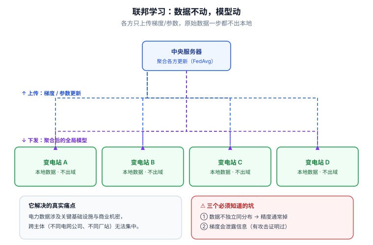

# 📘 第 15 周 · 联邦学习与隐私保护

> **本周目标**：前 14 周你都假设"数据能集中到一起"。这一周要面对一个更现实的约束：**电力数据不能出域**。学完你应该能做到：说清电力数据不能集中的四类原因（并分清哪些是法律要求、哪些是工程选择）；手写实现 FedAvg 并算清通信开销；解释非独立同分布为什么会让全局模型掉点，并说出五种解法各自的条件；写出 `(ε, δ)`-DP 的定义与 DP-SGD 的噪声机制，**并指出 ε 的三种常见误用**；说清联邦学习的两类攻击面（投毒与梯度泄露）与四类防御；最后给出一个诚实的结论：**在仿真条件下，集中式几乎总是不差于联邦，联邦的价值来自"数据不能集中"这个约束本身，而不是精度**。
>
> **本周知识清单**：I 域 8 条（融入每天末尾的 ✅ 知识自查）
>
> **阶段位置**：第 13 周解决"规律"（物理），第 14 周解决"行动"（决策），本周解决"**边界**"（隐私与合规）。这一周的内容大量涉及法律与合规，**我会标明哪些是"你需要自己去核对官方文本"的部分** —— 涉及法条的东西，任何二手转述都不能当作依据。
>
> **使用方式**：在 Typora 中按标题折叠展开，每天读对应的小节即可。

[[深度学习学习总目录|← 返回总目录]]

---

## Day 96 —— 为什么电力数据不能出域：合规与商业机密

> **一句话**：电力数据不出域，有四类完全不同的原因 —— **法律强制、商业利益、安全风险、工程现实**；把它们混为一谈，你的论文 motivation 就写错了。

### 一、四类原因（必须分清）

| 类别 | 具体内容 | 性质 | 违反的后果 |
|---|---|---|---|
| **① 法规强制** | 重要数据出境限制、关键信息基础设施相关保护要求、个人信息处理规则 | **法律义务**，不可协商 | 行政处罚、法律责任 |
| **② 商业机密** | 电网拓扑与参数、负荷特性、设备运行数据、用户用电画像 | 竞争利益 | 商业损失（但可协商，比如签保密协议） |
| **③ 安全风险** | 拓扑 + 参数 + 运行状态可被用于策划攻击；量测可反推运行方式 | 技术风险 | 成为攻击面的信息来源 |
| **④ 工程现实** | 数据量极大（TB/天级）、传输成本高、各方数据格式不统一 | 工程约束 | 成本高、效率低 |

> **为什么必须分清**：
>
> - 如果原因主要是 **①（法规）** → 联邦学习是**必要**的，不是"可选的技术优化"。论文的 motivation 应该是"在合规约束下如何联合建模"。
> - 如果原因主要是 **②（商业）** → 联邦学习是一个**谈判结果**。审稿人会问"为什么不签一个数据共享协议？"—— 你必须回答"即使签了协议，各方仍不愿交出原始数据"。
> - 如果原因主要是 **③（安全）** → **联邦学习只解决了一部分问题**：它避免了原始数据集中，但梯度本身可能泄露信息（Day 101 展开）。
> - 如果原因主要是 **④（工程）** → 那用联邦学习是**过度设计**。分布式训练（数据并行）就够了，不需要联邦。

**❌ / ✅ 对照**：

```
❌ 差的 motivation：
   "电力数据敏感，所以我们要用联邦学习。"
   → 审稿人：敏感在哪？是法律禁止集中，还是各方不愿意？这两种情况的
     技术方案和论文贡献完全不同。

✅ 好的 motivation：
   "电力数据分散在多个运营主体（省网 / 地市公司 / 用户侧），
     出于合规与商业保密要求无法集中。这带来两个具体后果：
     (a) 各方只能看到本地的运行工况，攻击样本的分布严重偏斜；
     (b) 各方的设备型号与负荷特性不同，数据分布天然非独立同分布。
     我们研究在此约束下，如何联合训练一个性能接近集中式的检测器。"
   → 指出了约束 → 指出了约束带来的具体技术困难 → 指出你要解决哪一个。
```

### 二、法规框架：名称可以引用，条款必须自查

> **⚠️ 本节只列法规名称与一般原则。具体的条款编号、适用范围、处罚标准，请以官方发布的正式文本为准。**
>
> 我不复述条文内容 —— 一是法律文本会修订，二是二手转述容易出错，三是**你的论文如果引用了错误的条款，比不引用更糟**。

| 法规（按生效时间） | 大致涉及什么 | 你需要自己去核对什么 |
|---|---|---|
| **《中华人民共和国网络安全法》** | 网络运行安全、数据保护的一般要求 | 关键信息基础设施运营者的义务范围 |
| **《中华人民共和国数据安全法》** | 数据分类分级、重要数据保护、数据出境 | "重要数据"的定义与目录、出境评估要求 |
| **《中华人民共和国个人信息保护法》** | 个人信息处理的合法性基础、跨境提供规则 | 用户用电数据是否构成个人信息、如何告知同意 |
| **关键信息基础设施安全保护相关条例** | 关键行业设施的识别与保护义务 | 电力行业哪些系统被纳入 |
| **电力监控系统安全防护相关规定** | 电力监控系统的分区隔离要求 | 具体条款与适用范围 |

**一个业内广为人知的原则**（这个可以放心引用，它在电力行业是常识）：

```
电力监控系统安全防护的"十六字方针"：

  安全分区 · 网络专用 · 横向隔离 · 纵向认证

含义：
  安全分区 —— 把系统按安全等级分区（生产控制区 / 管理信息区）
  网络专用 —— 生产控制区使用专用网络
  横向隔离 —— 不同安全区之间用隔离装置（单向物理隔离）
  纵向认证 —— 上下级之间用加密认证

⇒ 这个架构本身就决定了"数据无法自由流动"。
⇒ 联邦学习在这里的价值是：在不打破隔离架构的前提下实现联合建模。
```

**怎么在论文里引用法规**：

```
✅ 正确做法：
   "根据《中华人民共和国数据安全法》对重要数据出境的相关要求，
    以及电力监控系统'安全分区、网络专用、横向隔离、纵向认证'的防护原则，
    各运营主体的原始量测数据无法集中存储与处理。"

❌ 错误做法：
   "根据《数据安全法》第 XX 条第 X 款……"   ← 如果你不确定条款号，不要写
   → 审稿人（或编辑）一旦发现条款引用错误，对你整篇论文的严谨性都会打折扣
```

### 三、电力数据的特殊性

**为什么电力数据比其他行业数据更敏感**：

| 数据类型 | 敏感在哪 | 泄露后的后果 |
|---|---|---|
| **网络拓扑与线路参数** | 这是攻击者构造 FDI 攻击的**必需输入**（回顾 Day 84 的 `H` 矩阵） | 直接降低攻击门槛 |
| **量测数据（电压/功率/电流）** | 可反推运行方式、负荷水平、设备状态 | 可推断电网薄弱环节 |
| **用户用电数据** | 可推断家庭在不在家、作息、甚至电器类型 | 涉及个人隐私 |
| **设备指纹** | 厂商、型号、固件版本、规约版本 | 便于匹配已知漏洞 |
| **开关状态遥信** | 反映当前运行方式 | 可推断检修计划 |

> **第一行最关键**：**拓扑与线路参数就是 FDI 攻击的 `H` 矩阵。** 这解释了为什么"数据不出域"在电网安全里不只是隐私问题，而是**直接的攻击面收敛问题**。也解释了为什么"联邦学习保护隐私"这个说法在电网里需要更谨慎：**即使只交换梯度，如果梯度能反推出拓扑信息，攻击面并没有收敛**（Day 101 展开）。

**三类"不能集中"的具体场景**：

| 场景 | 参与方 | 为什么不能集中 | 联邦学习的价值 |
|---|---|---|---|
| **跨区域电网** | 多个省网 / 地市公司 | 分级管理 + 安全隔离 | 联合建模全网异常模式 |
| **电网—用户侧** | 电网公司 + 聚合商 / 充电桩运营商 | 用户数据属于个人 / 商业数据 | 负荷预测、需求响应 |
| **电网—第三方** | 电网公司 + 设备厂商 / 研究机构 | 商业机密 + 安全审查 | 设备故障诊断、模型优化 |

### 四、和电网安全的关系

**这一天的内容直接决定你论文的 motivation 能不能站住。**

| 说法 | 诚实版本 |
|---|---|
| "联邦学习可以保护数据隐私，所以我们用它" | "联邦学习避免了原始数据集中，**但不等于数据安全** —— 梯度仍可能泄露信息，需要额外的隐私机制（Day 99 / 101）" |
| "联邦学习是合规的" | "联邦学习是**满足'数据不出域'这一约束的技术手段之一**。合规性取决于具体的法规要求与部署方式，**技术方案本身不能保证合规**" |
| "联邦学习性能接近集中式" | "在 [算例 / 客户端数 / 非 IID 程度] 下，联邦模型的 F1 比集中式低 X%。**在攻击样本分布极度偏斜时，差距会扩大到 Y%**" |

> **第二行是本周最重要的一条诚实边界。** **"用了联邦学习"≠"合规"。** 合规是一个法律判断，涉及数据处理的目的、合法性基础、告知同意、出境评估等一整套要求；技术方案只能提供**技术保障**，不能替代合规审查。
>
> **如果你的论文里写"我们的方法满足合规要求"，这是一个法律主张，你没有资格做这个主张** —— 应该说"我们的方法避免了原始数据集中，从而在技术上支持'数据不出域'的部署要求"。

**一个具体的研究切入点**：

> **电网场景的联邦学习，其特殊性在于"数据不能集中的原因里，安全因素（攻击面收敛）和技术因素（隔离架构）占主导，而不只是隐私。** 这意味着三件事：
> 1. 评估指标不应只有"隐私"，还应有"**攻击面是否收敛**"
> 2. 防御目标不应只有"防止数据泄露"，还应有"**防止恶意客户端破坏全局模型**"（Day 101）
> 3. 拓扑信息在联邦场景下**本身就是敏感信息** —— 各方不应上传与自身拓扑强相关的特征

### 🔍 延伸思考

1. 如果各参与方都是同一个集团的下属单位（比如同一省网下的几个地市公司），"数据不能集中"的理由还成立吗？如果成立，是什么理由？
2. "梯度可能泄露信息"这一点，对"联邦学习能收敛攻击面"这个说法意味着什么？你需要什么额外机制才能让这个说法成立？
3. 如果你的论文 motivation 写的是"法规要求数据不能集中"，而审稿人恰好是电力行业的，他可能提出什么质疑？

### 📚 参考

- 检索建议：在官方网站检索《中华人民共和国网络安全法》《数据安全法》《个人信息保护法》的**正式全文**，不要看二手解读
- 检索建议：搜 `federated learning survey open problems`，读综述的第一节（motivation 部分写得最规范）
- 回顾 Day 38（攻击面）与 Day 84（`H` 矩阵）—— 理解为什么拓扑信息本身就是敏感数据

### 🎬 视频讲解

> 以下为**关键词检索式**推荐（平台搜索结果，非固定视频链接，避免失效）。
> 直接复制关键词到对应平台搜索即可，也可在结果里挑播放量高的看。

| 平台 | 推荐搜索关键词 | 说明 |
|---|---|---|
| **B站** | [联邦学习 是什么 原理 讲解](https://search.bilibili.com/all?keyword=联邦学习+是什么+原理+讲解) | 建立整体认识 |
| **B站** | [数据安全法 重要数据 解读](https://search.bilibili.com/all?keyword=数据安全法+重要数据+解读) | 了解法规框架（**仍以官方文本为准**） |
| **B站** | [电力监控系统 安全防护 分区 隔离](https://search.bilibili.com/all?keyword=电力监控系统+安全防护+分区+隔离) | 理解"十六字方针" |
| **抖音** | [联邦学习 是什么](https://www.douyin.com/search/联邦学习+是什么) | 一分钟建立概念 |

### ✅ 知识自查

- [ ] 🟢 **概念** 电力数据不能出域的四类原因，以及它们的性质差异
- [ ] 🟢 **概念** 电力监控系统安全防护的"十六字方针"（安全分区 / 网络专用 / 横向隔离 / 纵向认证）
- [ ] 🟢 **判断** 能写出规范的 motivation（指出约束 → 约束带来的技术困难 → 你要解决哪个）
- [ ] 🟢 **判断** 能说清"拓扑与线路参数就是 FDI 的 `H` 矩阵"，因此属于攻击面信息
- [ ] 🟢 **概念** 三类"不能集中"的场景（跨区域 / 电网-用户 / 电网-第三方）
- [ ] 🟡 **判断** 能说清"用了联邦学习 ≠ 合规"
- [ ] 🟡 **概念** 法规名称可以引用，但**条款编号必须自查官方文本**
- [ ] 🔴 **概念** 为什么"数据不能集中的原因"决定了你的评估指标该包含什么

---

## Day 97 —— 联邦学习基础：FedAvg 与通信轮次

> **一句话**：FedAvg 的全部内容是"**本地多跑几步、上传参数、按数据量加权平均**"—— 它的精妙之处在于"本地多跑几步"这个设计把通信轮次降了一个数量级。

### 一、FedAvg 算法

```
输入：K 个客户端，客户端 k 有 n_k 个样本，总样本数 n = Σ n_k
      本地迭代次数 E（local epochs），批大小 B，学习率 η

初始化：全局参数 w⁰

for 通信轮次 t = 1, 2, ..., T:
    ① 服务器挑选一部分客户端（或全部）
    ② 服务器下发 w^t
    ③ 每个被选中的客户端 k 并行执行【本地更新】：
           w_k^{t+1} ← 从 w^t 开始，在本地数据上做 E 个 epoch 的 SGD
    ④ 客户端上传 w_k^{t+1}（不上传数据！）
    ⑤ 服务器【加权平均】：
           w^{t+1} ← Σ_k  (n_k / n) · w_k^{t+1}

返回 w^T
```

**三步记住 FedAvg**：

| 步骤 | 做什么 | 关键点 |
|---|---|---|
| **分发** | 服务器把全局模型发给选中的客户端 | 通信量 = 参数量 × 客户端数 |
| **本地更新** | 各客户端在本地数据上跑 `E` 个 epoch | **`E` 越大，通信轮次越少** |
| **聚合** | 按样本数加权平均参数 | 权重是 `n_k / n`，不是平均 |

**两个容易忽略的细节**：

| 细节 | 为什么重要 |
|---|---|
| **加权用的是样本数** | 如果客户端数据量差很多（比如一个变电站有 10 万样本、另一个有 1000），不加权会让小客户端主导模型 |
| **是"参数平均"不是"梯度平均"** | 参数平均对**非凸**模型没有理论保证（Day 98 展开）。梯度平均（FedSGD）有更好的理论，但通信轮次多得多 |

**`E` 与 `T` 的权衡（FedAvg 的核心设计）**：

```
E = 1（即 FedSGD）：每轮本地只跑一个 batch
  → 通信轮次 T 极大（可能上万轮）
  → 通信开销不可接受

E = 5~50：每轮本地跑多个 epoch
  → 通信轮次 T 降低 1~2 个数量级
  → 但本地模型"跑偏"得更远，聚合时偏差更大

⇒ 这是联邦学习最核心的权衡：通信 ↔ 收敛质量
```



> **看图说话**：上图把联邦学习最常被误解的一点画清楚了：**蓝色上行走的只有梯度和参数更新，绿色框里的原始数据一步都没动**；紫色下行是聚合后的全局模型。“数据不动，模型动”这七个字是联邦学习的全部分量所在。底框左边的**真实痛点**解释了它为什么在电力场景特别相关：电力数据涉及关键基础设施与商业机密，不同电网公司、不同厂站之间无法集中 —— 联邦让“多方联合训练”在合规上成为可能。右边的**三个坑必须记住**，尤其第 ② 条：**梯度本身会泄露信息**，这是有攻击论文证明过的（能从梯度反推出训练样本），所以“只传梯度”不等于“安全”。第 ③ 条同样重要：**集中式训练几乎总不差于联邦** —— 如果数据本来就能集中，用联邦只是给自己找麻烦，写论文时必须能说出正当理由。


### 二、通信开销：算清这笔账

**这是审稿人一定会问的数字。**

```
单轮通信量 = 2 × 参数量 × 4 字节 × 参与客户端数
             （上传 + 下发，float32）

例：一个 3 层 MLP，输入 100 维量测，隐藏层 256，输出 1
    参数量 ≈ 100×256 + 256×256 + 256×1 ≈ 91k
    单轮上行 = 91k × 4 B ≈ 364 KB（每个客户端）
    100 个客户端 ⇒ 单轮总上行 ≈ 36 MB
    T = 500 轮 ⇒ 总计 ≈ 18 GB

对照：直接把 100 个客户端的数据集中
    每个客户端 10 万样本 × 100 维 × 4 B ≈ 40 MB
    总计 ≈ 4 GB（只传一次）

⇒ 结论：在小模型 + 多轮次的情况下，联邦学习的通信量可能【比直接传数据还大】。
```

| 模型规模 | 单轮上行（100 客户端） | 500 轮总计 | 直接传数据 |
|---|---|---|---|
| MLP（≈ 91k 参数） | 36 MB | **18 GB** | ≈ 4 GB |
| ResNet-18（≈ 11M 参数） | 4.4 GB | **2.2 TB** | ≈ 4 GB |
| Transformer（≈ 100M 参数） | 40 GB | **20 TB** | ≈ 4 GB |

> **这张表是本周最反直觉、也最该记住的东西。**
>
> **联邦学习省的是"数据隐私"，不是"通信带宽"。** 在模型大、轮次多的情况下，联邦学习的通信开销远大于直接传数据。
>
> **所以"联邦学习降低通信开销"是一个错误说法** —— 正确的说法是"联邦学习用**更高的通信开销**换取**数据不出域**"。
>
> **如果你的论文里写"联邦学习降低了通信成本"，审稿人只要算一下参数量就能否掉。**

**降低通信的三种手段**：

| 手段 | 做法 | 代价 |
|---|---|---|
| **增大 `E`** | 本地多跑几个 epoch，减少轮次 | 聚合偏差增大，收敛变差 |
| **模型压缩** | 量化（float32 → int8）、稀疏化、低秩分解 | 精度损失 |
| **只传部分参数** | 冻结骨干，只训练 / 传输头部 | 表达能力受限 |

### 三、手写 FedAvg（不依赖框架）

```python
import copy
import torch
import torch.nn as nn


def local_train(model, loader, epochs, lr):
    """客户端本地训练：从当前全局模型出发，跑 epochs 个 epoch"""
    model = copy.deepcopy(model)
    opt = torch.optim.SGD(model.parameters(), lr=lr, momentum=0.9)
    crit = nn.BCEWithLogitsLoss()
    model.train()
    for _ in range(epochs):
        for x, y in loader:
            opt.zero_grad()
            crit(model(x).squeeze(-1), y.float()).backward()
            opt.step()
    return model


def fedavg(global_model, client_loaders, rounds=50, epochs=5, lr=0.01):
    """client_loaders: 每个元素对应一个客户端的本地 DataLoader"""
    for _ in range(rounds):
        local_models = [local_train(global_model, ld, epochs, lr) for ld in client_loaders]
        weights = [len(ld.dataset) for ld in client_loaders]        # 按样本数加权
        total = sum(weights)
        weights = [w / total for w in weights]

        with torch.no_grad():
            for name, param in global_model.state_dict().items():
                if not param.is_floating_point():
                    continue                  # 跳过 BN 的 num_batches_tracked 等
                param.copy_(sum(lm.state_dict()[name].float() * w
                                for lm, w in zip(local_models, weights)))
    return global_model
```

**三个实现陷阱**：

| 陷阱 | 表现 | 原因 |
|---|---|---|
| **BN 的统计量** | 聚合后性能突然变差 | `running_mean/var` 是客户端特有的，直接平均会破坏它。**做法**：只聚合可学习参数，BN 统计量重新在全局数据上估计（或改用 GroupNorm / LayerNorm） |
| **`copy.deepcopy` 漏了** | 所有客户端在改同一个模型 | 本地训练必须从**副本**开始，否则客户端之间互相污染 |
| **`num_batches_tracked`** | 报错或类型不对 | 它是整数张量，不能参与浮点加权平均 |

> **第一行在电网场景里特别重要**：不同变电站的量测分布不同（非 IID），**BN 的统计量在本地估计出来差异很大**。直接平均 BN 统计量会让模型在每一方都表现不好。
>
> **最省事的做法：检测器里不要用 BatchNorm，用 LayerNorm 或 GroupNorm。**

### 四、和电网安全的关系

**把变电站当作客户端，几个必须想清楚的设计问题**：

| 设计问题 | 选项 | 建议 |
|---|---|---|
| **客户端是谁** | 变电站 / 地市公司 / 区域电网 | 按"数据管理边界"划分，不是按物理位置 |
| **数据量差异** | 110 kV 站 vs 500 kV 站，量测数量差很多 | 加权平均，但要报告"小客户端上的性能" |
| **参与率** | 全部参与 vs 每轮抽样 | 抽样（如每轮 10%）可降低通信，但引入方差 |
| **攻击样本分布** | 攻击样本只在少数站点出现 | **这是最严重的问题**（Day 98 展开） |
| **通信网络** | 生产控制区不能直连 | 需要专门的数据通道设计 |

**一个必须算的数字**：**在你的论文里，把"联邦 vs 集中式"的通信开销算出来对比。**

| 方案 | 通信量 | 隐私 | 性能 |
|---|---|---|---|
| **集中式** | 一次性传数据 | ❌ 数据出域 | 上界 |
| **FedAvg（T 轮）** | `2 × 参数量 × 客户端数 × T` | ✅ 数据不出域 | 接近上界（IID）/ 明显下降（Non-IID） |

**诚实边界（必须写进论文）**：

| 说法 | 诚实版本 |
|---|---|
| "联邦学习降低了通信开销" | "联邦学习**避免了数据集中**，但在 [模型规模 / 轮次] 下，其通信量为 X GB，**高于**一次性传输数据的 Y GB" |
| "联邦学习性能接近集中式" | "在 IID 划分下差距 X%，在 Non-IID 划分下差距扩大到 Y%" |
| "我们用 FedAvg 训练了检测器" | "我们实现了 FedAvg，客户端数为 K，本地 epoch 数 E，通信轮次 T，聚合权重为样本数加权" |

### 🔍 延伸思考

1. FedAvg 是"参数平均"，而参数平均对非凸模型没有理论保证。那为什么它实践上能work？（提示：想想 Day 2 讲的损失曲面，以及"好的局部解之间是连通的"这个现象）
2. 如果各客户端的数据量差异是 100:1，加权平均合理吗？不加权会怎样？
3. 如果电网的生产控制区不能直连，那"联邦学习"的通信是怎么实现的？（提示：这决定了你能不能真的用联邦学习）

### 📚 参考

- McMahan et al. (2017), *Communication-Efficient Learning of Deep Networks from Decentralized Data*, AISTATS —— **FedAvg 原始论文**，[arXiv:1602.05629](https://arxiv.org/abs/1602.05629)
- Kairouz et al. (2021), *Advances and Open Problems in Federated Learning* —— 综述，看第 2 节的系统挑战，[arXiv:1912.04977](https://arxiv.org/abs/1912.04977)
- Flower 框架（跨框架的联邦学习实现，接口简单）：[flwr.dev](https://flower.ai/)

### 🎬 视频讲解

> 以下为**关键词检索式**推荐（平台搜索结果，非固定视频链接，避免失效）。
> 直接复制关键词到对应平台搜索即可，也可在结果里挑播放量高的看。

| 平台 | 推荐搜索关键词 | 说明 |
|---|---|---|
| **B站** | [FedAvg 联邦平均 算法 讲解](https://search.bilibili.com/all?keyword=FedAvg+联邦平均+算法+讲解) | 算法流程的完整推导 |
| **B站** | [联邦学习 代码 实现 pytorch](https://search.bilibili.com/all?keyword=联邦学习+代码+实现+pytorch) | 手写一个 FedAvg |
| **B站** | [联邦学习 通信 开销 优化](https://search.bilibili.com/all?keyword=联邦学习+通信+开销+优化) | 通信量怎么算、怎么降 |
| **抖音** | [FedAvg 是什么](https://www.douyin.com/search/FedAvg+是什么) | 一分钟建立概念 |

### ✅ 知识自查

- [ ] 🟢 **概念** FedAvg 的三步（分发 / 本地更新 / 加权聚合）
- [ ] 🟢 **实践** 手写实现 FedAvg（含 `deepcopy` 与按样本数加权）
- [ ] 🟢 **概念** `E`（本地 epoch）与 `T`（通信轮次）的权衡关系
- [ ] 🟢 **实践** 能算清"联邦 vs 集中式"的通信量对比
- [ ] 🟢 **判断** 能说清"联邦学习省的是隐私，不是通信"
- [ ] 🟡 **概念** 参数平均 vs 梯度平均（FedAvg vs FedSGD）的区别与理论差异
- [ ] 🟡 **概念** BN 统计量不能直接平均，以及"用 LayerNorm 代替"的工程做法
- [ ] 🔴 **概念** 降低通信的三种手段（增大 E / 模型压缩 / 只传部分参数）及其代价

---

## Day 98 —— 非独立同分布：各变电站数据分布不同怎么办

> **一句话**：Non-IID 是联邦学习从"能用"到"不能用"的分界线 —— **各方的数据分布差异越大，全局模型在每一方都越差**，而电网场景的 Non-IID 程度天然很高。

### 一、电网场景的 Non-IID 来源

| 来源 | 具体表现 | 严重程度 |
|---|---|---|
| **负荷类型不同** | 工业区站（冲击性负荷）vs 居民区站（早晚双峰）vs 商业区站 | 高 |
| **电压等级不同** | 500 kV 枢纽站 vs 10 kV 配电站，量测的物理量级与波动范围完全不同 | 高 |
| **设备型号不同** | 不同厂商的 CT/PT 精度、采样率、噪声特性不同 | 中 |
| **拓扑不同** | 不同站点的关联节点数、连接度不同（回顾 Day 61-64 的图视角） | 高 |
| **攻击样本只在个别站点出现** | **只有 3 个变电站经历过某类 FDI 攻击** | **极高** |
| **数据量不同** | 枢纽站样本多、末端站样本少 | 中 |

> **最后一行是电网安全特有的、也是最致命的一条。**
>
> 在通用联邦学习里，Non-IID 主要是"标签分布偏斜"（比如各客户端的手写数字类别不同）。
>
> **在电网安全检测里，Non-IID 表现为"攻击样本只出现在少数客户端"** —— 这意味着**绝大多数客户端从来没见过攻击**，它们的本地训练几乎不提供任何攻击相关信息。
>
> **这个问题的严重性被严重低估了。** 后面第四节会展开。

### 二、后果：两个可观测的现象

**现象一：权重发散（weight divergence）**

```
直觉解释：
  客户端 A 的数据分布 P_A 与客户端 B 的 P_B 差异很大
  ⇒ 各自本地训练 E 个 epoch 后，w_A 与 w_B 朝不同方向跑
  ⇒ E 越大，跑得越远（"客户端漂移"，client drift）
  ⇒ 聚合时平均出来的 w 可能落在两个都不好的位置

量化：
  定义 w_k^{t,E} 为客户端 k 在第 t 轮本地训练 E 步后的参数
  发散程度 ≈ ‖ w_k^{t,E} − w^t ‖ 的期望

  E 越大 → 发散越大 → 聚合质量越差
```

**现象二：全局模型在本地数据上掉点**

| 划分方式 | 集中式 F1 | FedAvg F1 | 差距 |
|---|---|---|---|
| **IID**（随机打散到各客户端） | 0.95 | 0.94 | ≈ 1% |
| **中度 Non-IID**（按负荷类型分） | 0.95 | 0.89 | ≈ 6% |
| **重度 Non-IID**（按站点分，各站工况差异大） | 0.95 | 0.81 | ≈ 14% |
| **极端 Non-IID**（攻击样本只在一个客户端） | 0.95 | 0.68 | ≈ 27% |

> **上面这张表的数字是"典型量级"，不是某个具体实验的结果。** 你在论文里必须报**你自己实验的真实数字**，而且要同时报"全局模型在各客户端的性能分布"（不只看平均）。
>
> **注意最后一行**：当攻击样本极度偏斜时，联邦学习的性能可能**接近随机**。这是电网安全场景的核心困难。

### 三、五类解法对照

| 方法 | 核心思想 | 代价 | 适用条件 |
|---|---|---|---|
| **FedProx** | 在本地损失里加一项"不要偏离全局模型太远"的惩罚 | 多一个超参 `μ`；本地收敛变慢 | 中度 Non-IID，通用性最好 |
| **SCAFFOLD** | 用控制变量（类似 SVRG）修正客户端漂移 | 每轮多传 `2×` 参数量（控制变量） | 通信不是瓶颈时效果好 |
| **个性化 FL（pFL）** | 每个客户端保留自己的个性化头部 + 共享骨干 | 不再有"单一全局模型" | 各方任务有差异时最合适 |
| **聚类联邦** | 把相似的客户端分到一组，组内聚合 | 需要聚类逻辑；组数难定 | 客户端可分组时 |
| **共享数据 / 知识蒸馏** | 各方共享少量代表性数据，或交换模型输出 | **共享数据可能违反"不出域"约束** | 允许小规模共享时 |

**FedProx 的实现（改动极小）**：

```python
def local_train_fedprox(model, global_model, loader, epochs, lr, mu=0.01):
    """
    与普通本地训练的唯一区别：损失里加一项 proximal 惩罚
        L_total = L_task + (mu / 2) * || w - w_global ||²
    mu = 0  → 退化成 FedAvg；mu 很大 → 本地几乎不更新（等价于 FedSGD）
    """
    model = copy.deepcopy(model)
    global_params = [p.detach().clone() for p in global_model.parameters()]
    opt = torch.optim.SGD(model.parameters(), lr=lr, momentum=0.9)
    crit = torch.nn.BCEWithLogitsLoss()

    model.train()
    for _ in range(epochs):
        for x, y in loader:
            opt.zero_grad()
            loss = crit(model(x).squeeze(-1), y.float())
            loss = loss + 0.5 * mu * sum(
                ((p - g) ** 2).sum() for p, g in zip(model.parameters(), global_params)
            )
            loss.backward()
            opt.step()
    return model
```

> **`mu` 的作用**：它控制"本地训练的自由度"。
>
> `mu = 0` → 完全自由的 FedAvg（Non-IID 下漂移严重）
> `mu → ∞` → 本地完全不更新（等价于 FedSGD）
>
> **最优 `mu` 取决于 Non-IID 程度，而 Non-IID 程度你事先不知道** ⇒ 要做 `mu` 的扫描实验。

**"个性化 FL"为什么在电网里特别有吸引力**：

```
通用 FL 的目标：学一个对所有客户端都好的单一模型
电网场景的现实：
  - 500 kV 枢纽站和 10 kV 配电站的"正常模式"完全不同
  - 强行用一个全局模型 → 两边都照顾不好

个性化 FL 的做法：
  共享：特征提取骨干（学通用的量测模式）
  私有：分类头（每个站点自己微调）
  ⇒ 骨干让没见过攻击的站点也能受益于见过攻击的站点
  ⇒ 头部让每个站点适配自己的工况
```

### 四、和电网安全的关系

**"攻击样本只在少数站点出现"这个问题的完整分析：**

```
设定：10 个变电站，只有 2 个站经历过某类 FDI 攻击
      集中式：把 10 个站的数据合起来 → 攻击样本总量虽然少，但都在训练集里
      联邦式：每个站只用自己的数据训练 → 8 个站完全没见过攻击

结果对比：
  ┌────────────────────────────────────────────────┐
  │ 集中式：能学到攻击模式（因为攻击样本在训练集里）      │
  │ 联邦式：8 个站的本地模型对这类攻击完全无感            │
  │         聚合后，全局模型被 8 个"无攻击样本"的站稀释   │
  │         ⇒ 检测率大幅下降                          │
  └────────────────────────────────────────────────┘
```

**这意味着一个反直觉但必须承认的结论**：

> **在"攻击样本高度偏斜"这个电网安全的核心场景下，标准 FedAvg 可能显著劣于集中式。**
>
> **联邦学习在这里的价值，不来自"精度"，而来自"数据不能集中"这个约束。** 你的论文必须把这句话写清楚。

**三条可能的改进方向（都有代价）**：

| 方向 | 做法 | 代价 |
|---|---|---|
| **攻击感知的聚合** | 给"有攻击样本的客户端"更高权重 | 需要知道谁有攻击样本（本身是信息泄露）；且攻击者可以伪装 |
| **联邦 + 生成模型** | 有攻击样本的站点用生成模型（回顾 Day 69-72）合成样本，共享给其他站点 | 合成样本可能不物理可行；且共享合成数据也可能被视为数据出域 |
| **联邦 + 迁移学习** | 共享的是"特征提取能力"而不是"分类决策" | 提升有限，因为问题在于"没见过这个类别" |

**诚实边界（必须写进论文）**：

| 说法 | 诚实版本 |
|---|---|
| "联邦学习解决了数据孤岛问题" | "联邦学习避免了数据集中，但在攻击样本高度偏斜时，其检测性能显著低于集中式（低 X%）。我们量化了这一差距" |
| "我们的方法优于 FedAvg" | "在 [Non-IID 设置] 下，我们的方法比 FedAvg 高 X% F1，但仍比集中式低 Y%" |
| "个性化 FL 解决了 Non-IID" | "个性化 FL 改善了**正常样本**上的表现，但对'本地从未见过的攻击类型'无改善 —— 因为问题不是模型不适配，而是信息不存在" |

> **最后一行是一个关键区分**：Non-IID 有两类后果 —— **适配问题**（模型不适配本地分布）和 **信息缺失问题**（本地数据里根本没有某类样本）。**个性化 FL 解决前者，解决不了后者。** 把这个区分写清楚，能显著提升论文的深度。

### 🔍 延伸思考

1. 如果 8 个站从来没见过攻击，联邦学习还能让它们受益吗？在什么条件下能（提示：骨干共享 + 少数站的攻击特征足够通用）？
2. "给有攻击样本的客户端更高权重"这个做法，会泄露什么信息？攻击者能否利用它？
3. 如果允许各方共享"少量"数据（比如每方 100 个样本），Non-IID 问题会缓解多少？这个方案违反"数据不出域"吗？

### 📚 参考

- 检索建议：搜 `federated learning non-iid survey`，建立解法全景
- 检索建议：搜 `federated learning heterogeneous data client drift`，理解权重发散的量化方式
- 检索建议：搜 `personalized federated learning`，看个性化 FL 的多种实现路线
- 回顾 Day 61-64（图神经网络与电网拓扑）—— 不同站点的图结构差异也是一种 Non-IID

### 🎬 视频讲解

> 以下为**关键词检索式**推荐（平台搜索结果，非固定视频链接，避免失效）。
> 直接复制关键词到对应平台搜索即可，也可在结果里挑播放量高的看。

| 平台 | 推荐搜索关键词 | 说明 |
|---|---|---|
| **B站** | [联邦学习 非独立同分布 Non-IID](https://search.bilibili.com/all?keyword=联邦学习+非独立同分布+Non-IID) | Non-IID 问题的中文讲解 |
| **B站** | [FedProx 算法 讲解](https://search.bilibili.com/all?keyword=FedProx+算法+讲解) | 最实用的一个改进 |
| **B站** | [个性化联邦学习 讲解](https://search.bilibili.com/all?keyword=个性化联邦学习+讲解) | 个性化 FL 的思路 |
| **抖音** | [非独立同分布 是什么](https://www.douyin.com/search/非独立同分布+是什么) | 一分钟建立概念 |

### ✅ 知识自查

- [ ] 🟢 **概念** 电网场景 Non-IID 的六个来源，以及哪个最致命
- [ ] 🟢 **概念** 客户端漂移（client drift）与权重发散，以及 `E` 对它的影响
- [ ] 🟢 **实践** 实现 FedProx 的 proximal 惩罚项并做 `mu` 扫描
- [ ] 🟢 **概念** 五类 Non-IID 解法的核心思想、代价与适用条件
- [ ] 🟢 **判断** 能区分 Non-IID 的两类后果：**适配问题 vs 信息缺失问题**
- [ ] 🟡 **判断** 能说清"个性化 FL 解决适配问题，解决不了信息缺失问题"
- [ ] 🟡 **判断** 能说清"联邦在攻击样本偏斜时可能显著劣于集中式"
- [ ] 🔴 **概念** 攻击感知聚合的代价（信息泄露 + 攻击者可伪装）

---

## Day 99 —— 差分隐私：加噪与隐私预算 ε

> **一句话**：ε 不是"隐私强度打分"，而是"**你愿意承诺的隐私泄露上界**"—— 它是**你要先承诺的东西**，不是**你要调优的超参数**。

### 一、(ε, δ)-DP 的形式化定义

```
定义：随机化机制 M 满足 (ε, δ)-差分隐私，如果对任意两个【相邻数据集】
      D 与 D'（只差一条记录），以及任意输出集合 S ⊆ Range(M)，都有：

        P[ M(D) ∈ S ]  ≤  e^ε · P[ M(D') ∈ S ]  +  δ

逐项理解：
  ε  —— 隐私预算。ε 越小，D 与 D' 的输出分布越接近，越难区分，
        隐私越强。ε = 0 是完美隐私（输出与数据完全无关，因此也完全无用）。
  δ  —— 允许"定义被违反"的概率。δ = 0 是纯 ε-DP；
        实践里常取 δ ≪ 1/n（n 是数据集大小），例如 δ = 1e-5。
  S  —— 任意输出集合。这个"任意"很关键：保证对【任何】攻击者的
        任何判别规则都成立，不需要假设攻击者的策略。
```

**相邻数据集（adjacent datasets）** 是定义的核心：

| 定义方式 | 含义 | 用在哪 |
|---|---|---|
| **替换一条（bounded DP）** | `D` 与 `D'` 相差一条记录（一条被替换） | 常见于 DP-SGD 的某些分析 |
| **增删一条（unbounded DP）** | `D'` 比 `D` 多/少一条记录 | 常见于统计查询 |

> **两者给出的 ε 不可直接比较** —— 这是"ε 的语义容易被误用"的第一个来源（见第三节）。

### 二、DP-SGD：梯度裁剪 + 高斯噪声

**这是把 DP 用到深度学习上的标准方法。**

```
标准 SGD 的梯度：        g = (1/B) Σ_i g_i          ← g_i 是第 i 个样本的梯度
DP-SGD 的梯度：

  第 1 步【逐样本裁剪】   ḡ_i = g_i / max(1, ‖g_i‖₂ / C)
                         ⇒ 每个样本的贡献被限制在 L2 范数 ≤ C 以内
                         ⇒ 这一步定义了【敏感度】的上界：Δ = C

  第 2 步【加噪】         g̃ = (1/B) [ Σ_i ḡ_i + N(0, σ²C² I) ]
                         ⇒ 加高斯噪声，噪声尺度 σ 由 ε 决定

  第 3 步【正常更新】     w ← w − η · g̃
```

**高斯机制的噪声尺度**（单步，无子采样）：

```
σ ≥ Δ · sqrt( 2 · ln(1.25 / δ) ) / ε        其中 Δ = C

⇒ ε 越小（隐私越强）⇒ σ 越大（噪声越多）⇒ 模型越差
```

**但实际训练有 `T` 步，需要组合定理**：

```
T 步的组合：隐私预算会累积
  朴素组合：      ε_total = T · ε_step                  ← 极度保守
  高级组合：      ε_total ≈ sqrt(2 T ln(1/δ')) · ε_step   ← 好一些
  RDP / 矩会计：  更紧的界，实践中最常用

⇒ 关键结论：ε_total 与 T 强相关。同一个 σ，训练 100 轮和 10000 轮的 ε 差了近两个数量级。
⇒ 报告 ε 时必须同时报告：σ、C、B、T、δ、子采样率 q、以及用的哪种 accountant。
```

**子采样放大（privacy amplification by subsampling）**：如果每步只随机抽取 `q` 比例的数据（`q = B/n`），隐私会放大，即 `ε_effective < ε_without_subsampling`。直觉是：攻击者不知道这一步用了哪些样本，**不确定性本身就是隐私**。所以减小 batch size 能改善隐私（但损害训练效率）。

```python
import torch

def dp_sgd_step(model, batch, optimizer, C=1.0, sigma=1.0):
    """
    DP-SGD 的单步更新（骨架）
      C     : 逐样本梯度裁剪阈值（= 敏感度 Δ）
      sigma : 噪声尺度，由 (ε, δ, T, q) 通过 accountant 反推
    逐样本梯度需要 per-sample grad 支持（torch.func 或 Opacus 之类的库）
    """
    x, y = batch
    optimizer.zero_grad()

    per_sample_grads = compute_per_sample_grads(model, x, y)   # ① 逐样本梯度

    norms = per_sample_grads.flatten(1).norm(dim=1, keepdim=True).clamp(min=1e-6)
    scale = (C / norms).clamp(max=1.0)                        # ② 逐样本裁剪
    clipped = per_sample_grads * scale.view(-1, *([1] * (per_sample_grads.dim() - 1)))

    summed = clipped.sum(dim=0)                               # ③ 求和 + 加噪
    grad = (summed + torch.randn_like(summed) * (sigma * C)) / x.size(0)

    assign_grads(model, grad)                                 # ④ 写回并更新
    optimizer.step()
```

> **实践建议：不要自己实现 DP-SGD。** 逐样本梯度、accountant、噪声调度都很容易写错，而**写错的 DP 不是"弱隐私"，是"没有隐私"**。用成熟库：
>
> | 库 | 适用 |
> |---|---|
> | **Opacus**（PyTorch 官方生态） | 最常用，接口侵入性小 |
> | **TensorFlow Privacy** | TF 生态 |
> | 联邦场景：**Flower + DP 策略** | 联邦 + DP 的组合 |

### 三、ε 的语义：三种常见误用

> **这是本周最重要的一节。** ε 的误用在论文里非常普遍，审稿人（尤其是懂隐私的）一眼就能看出来。

| # | 错误说法 | 为什么错 |
|---|---|---|
| **一** | "我们的 ε = 1.0 比文献 [X] 的 ε = 3.0 更隐私" | ε 的含义完全依赖五个前提：**① 相邻数据集定义（bounded / unbounded）② 哪种 accountant ③ 子采样率 `q` ④ `δ` 的取值 ⑤ 保护对象（整个训练集还是单条记录）**。两个 ε = 1.0 的机制，实际隐私强度可能差几倍。**ε 不可跨机制、跨假设直接比较** |
| **二** | "我们试了 ε ∈ {0.1, 1, 10}，ε = 10 时精度最高，所以选 10" | **把因果反了。** ε 是隐私要求给定的**输入**，不是你要优化的**输出**。正确逻辑：隐私要求 ε = 1（来自合规 / 业务）→ 在这个约束下最大化精度。**论文里应先说明"为什么选这个 ε"，再报告性能** |
| **三** | "ε = 1 保证数据无法被反推" | ① DP 保证的是**输出分布的不可区分性**，不是"数据不能被反推"—— 它限制的是攻击者从输出中学到关于**单条记录**的信息量上界；② 保证依赖**实现正确**（裁剪写错、噪声加错位置 → 保证不成立）；③ 不防**数据集层面**的信息泄露；④ 不防其他侧信道（时间、内存访问、通信元数据） |

**正确的写法对照**：

```
❌ 差："我们使用 ε = 1 的差分隐私保护，保证数据安全。"

✅ 好："我们采用 DP-SGD 实现 (ε = 1.0, δ = 1e-5)-差分隐私，裁剪阈值 C = 1.0，
        噪声尺度 σ = 1.1（由 RDP accountant 在 T = 500 轮、子采样率 q = 0.01
        下反推）。在此设置下，检测器的 PR-AUC 从无噪声的 0.91 降到 0.76。
        我们注意到 ε 的绝对值不可跨机制比较；本设置下的隐私-效用数据点是
        (ε = 1.0, PR-AUC = 0.76)。我们未声称本方法满足任何特定的合规要求。"
```

**一个粗略的经验参照（不是定理）**：

| ε 量级 | 常见解读 | 注意 |
|---|---|---|
| `ε < 0.1` | 极强隐私 | 效用通常损失严重 |
| `ε ≈ 1` | 较强隐私（多数文献的默认区间） | **仅在上述假设明确时才有意义** |
| `ε ≈ 10` | 较弱隐私 | 有些文献认为这个量级已接近"无隐私" |
| `ε = ∞` | **无隐私保证** | 等价于不做 DP |

> **再强调一次：上表只是经验参照。** 说"ε = 1 是强隐私"必须附上"在什么机制、什么假设、什么 δ 下"。

### 四、和电网安全的关系

**在电网数据上做 DP，有一个特殊困难：数据本身噪声就很大。**

```
量测噪声（SCADA/CT/PT 的物理误差）：  σ_data ≈ 0.01 p.u.
DP 噪声（在梯度上，等效到量测层面）：  σ_dp ∝ C·σ / B
要检测的信号（FDI 造成的状态偏移 Δx）：量级可能只有 0.02 ~ 0.05 p.u.

⇒ 量测噪声 + DP 噪声叠加后，信噪比进一步恶化
⇒ 检测器的性能下降幅度，通常【大于】在图像分类任务上的下降幅度
```

| 任务 | 无 DP 性能 | ε = 1 时性能 | 下降幅度 |
|---|---|---|---|
| MNIST 分类（文献常见量级） | ~99% | ~96% | ~3% |
| **电网量测 FDI 检测（典型量级）** | ~0.91 PR-AUC | ~0.76 PR-AUC | **~16%** |

> **上表是"典型量级"的示意，不是具体实验结论。** 但**方向是确定的**：**信号越弱、噪声越大的任务，DP 的代价越大。**
>
> **这一点必须在论文里诚实报告** —— 如果你只报告"ε = 1 时性能仅下降 3%"（在某个容易的任务上），审稿人会质疑任务难度。

**"隐私-效用权衡是硬约束，不是调参"这句话的完整含义**：

| 层 | 含义 |
|---|---|
| **它是约束** | ε 由隐私要求给定（合规 / 数据分级 / 与某标准对齐），**不能为了精度而放宽** |
| **它是硬的** | 一旦承诺 ε = 1，你就必须在 ε = 1 下报告结果。**不能"我们主实验用 ε = 1，但附录里也给了 ε = 10 的结果来展示上限"然后只强调后者** |
| **它不是调参** | 你的工作是"在 ε = 1 下把精度做到最好"（通过更好的模型、更好的训练策略），而不是"找一个让精度好看的 ε" |
| **权衡曲线是必报项** | 报告 `ε ∈ {0.1, 0.5, 1, 5, 10, ∞}` 下的性能曲线，**让读者自己判断这个权衡是否可接受** |

**诚实边界（必须写进论文）**：

| 说法 | 诚实版本 |
|---|---|
| "我们实现了差分隐私，保护了数据" | "我们采用 DP-SGD，参数为 (ε, δ, C, σ, T, q)，使用 [accountant]。**DP 保证依赖实现正确性，我们使用了 [库名]**" |
| "ε = 1 是强隐私" | "在 [相邻数据集定义 / accountant / δ] 下，ε = 1 对应的隐私-效用数据点为 (1.0, 0.76)。**ε 不可跨机制比较**" |
| "差分隐私对精度影响很小" | "在 [任务] 上，ε = 1 时 PR-AUC 从 0.91 降到 0.76（下降 16%）。**电网量测任务的信号较弱，DP 代价高于图像任务**" |

### 🔍 延伸思考

1. DP 保护的是"单条记录"的隐私。但在电网场景里，敏感信息可能是"某个变电站的拓扑结构"（一个集合级别的信息）。DP 能保护这种信息吗？
2. 如果各客户端的隐私要求不同（有的要求 ε = 0.5，有的接受 ε = 5），联邦学习该怎么做？（提示：本地 DP vs 全局 DP）
3. 在联邦学习里，"本地 DP"（客户端自己加噪）和"全局 DP"（服务器加噪）的隐私保证和精度有什么不同？

### 📚 参考

- Dwork & Roth (2014), *The Algorithmic Foundations of Differential Privacy*, Foundations and Trends in Theoretical Computer Science —— **DP 的标准教材，官方免费 PDF**，[PDF](https://www.cis.upenn.edu/~aaroth/Papers/privacybook.pdf)
- Abadi et al. (2016), *Deep Learning with Differential Privacy*, ACM CCS —— **DP-SGD 原始论文**，[arXiv:1607.00133](https://arxiv.org/abs/1607.00133)
- Opacus（PyTorch 的 DP 库）：[opacus.ai](https://opacus.ai/)

### 🎬 视频讲解

> 以下为**关键词检索式**推荐（平台搜索结果，非固定视频链接，避免失效）。
> 直接复制关键词到对应平台搜索即可，也可在结果里挑播放量高的看。

| 平台 | 推荐搜索关键词 | 说明 |
|---|---|---|
| **B站** | [差分隐私 原理 讲解 ε](https://search.bilibili.com/all?keyword=差分隐私+原理+讲解+ε) | 定义与直觉 |
| **B站** | [DP-SGD 差分隐私 深度学习 实现](https://search.bilibili.com/all?keyword=DP-SGD+差分隐私+深度学习+实现) | 梯度裁剪与加噪 |
| **B站** | [差分隐私 隐私预算 组合 会计](https://search.bilibili.com/all?keyword=差分隐私+隐私预算+组合+会计) | ε 的累计怎么算 |
| **抖音** | [差分隐私 是什么](https://www.douyin.com/search/差分隐私+是什么) | 一分钟建立概念 |

### ✅ 知识自查

- [ ] 🟢 **概念** `(ε, δ)`-DP 的形式化定义（相邻数据集 / 输出集合 / `e^ε` 与 `δ`）
- [ ] 🟢 **概念** 相邻数据集的两种定义（bounded vs unbounded）与它们的 ε 不可比
- [ ] 🟢 **实践** 说出 DP-SGD 的三步（逐样本裁剪 / 加高斯噪声 / 正常更新）
- [ ] 🟢 **概念** 高斯机制的噪声尺度公式与"`ε` 越小 → 噪声越大 → 精度越差"
- [ ] 🟢 **概念** 隐私预算的组合与 `T` 的关系，以及必须同时报告哪些参数
- [ ] 🟢 **判断** 能指出 ε 的三种误用（跨机制比较 / 当调优参数 / 当安全保证）
- [ ] 🟡 **实践** 写出规范的 DP 实验报告（含 accountant、子采样率、`δ`）
- [ ] 🟡 **判断** 能说清"隐私-效用权衡是硬约束不是调参"的四层含义
- [ ] 🔴 **概念** 本地 DP 与全局 DP 的区别

---

## Day 100 —— 联邦异常检测实战：多方联合训练检测器

> **一句话**：这一天的目的不是"做出一个好模型"，而是**量化"联邦 vs 集中式"的差距**—— 这个差距本身就是你的论文结论。

### 一、任务设定

**任务**：K 个变电站各自持有本地量测数据（含正常与攻击样本），在数据不出域的前提下联合训练一个 FDI 检测器。

| 设定项 | 选项 | 建议 |
|---|---|---|
| **模型** | 自编码器（无监督，只看正常样本）/ 分类器（有监督） | **两者都做**：自编码器是异常检测的经典范式（Day 26），且不需要攻击标签 |
| **客户端数 `K`** | 5 / 10 / 20 | 至少 5，否则 Non-IID 效应不显著 |
| **划分方式** | IID / 按工况 / 按站点 | **至少做 IID 和"按站点"两种**，对比差距 |
| **本地 epoch `E`** | 1 / 5 / 20 | 做扫描，画 `E` vs 性能曲线 |
| **通信轮次 `T`** | 20 / 50 / 100 | 画 `T` vs 性能曲线（看是否收敛） |
| **攻击样本分布** | 均匀 / 集中在少数客户端 | **必须做"集中"这一种**（Day 98 的核心） |

**自编码器方案为什么值得做**：

```
优点：
  ① 只用正常样本训练 ⇒ 不需要攻击标签 ⇒ 绕开了"攻击样本稀缺 + 分布偏斜"问题
  ② 异常分数 = 重构误差 ⇒ 天然可解释
  ③ 联邦聚合的是重构能力（正常模式），不是攻击模式
     ⇒ 每个客户端都有大量正常样本 ⇒ Non-IID 问题轻得多

缺点：
  ① 对"与正常模式接近的攻击"检测能力有限
  ② 阈值需要跨客户端统一（各客户端的重构误差量级不同）
```

> **注意最后一条**：各客户端的重构误差量级不同（因为工况不同），**直接用一个全局阈值会造成某些客户端大量误报**。这是联邦异常检测的一个具体工程坑。

### 二、完整流程骨架

```python
import copy
import numpy as np
import torch
import torch.nn as nn


class AE(nn.Module):
    """量测自编码器：异常分数 = 重构误差"""

    def __init__(self, m, latent=16):
        super().__init__()
        self.enc = nn.Sequential(nn.Linear(m, 64), nn.ReLU(), nn.Linear(64, latent))
        self.dec = nn.Sequential(nn.Linear(latent, 64), nn.ReLU(), nn.Linear(64, m))

    def forward(self, x):
        return self.dec(self.enc(x))

    def anomaly_score(self, x):
        return (self(x) - x).pow(2).mean(dim=-1)


def local_train_ae(model, normal_loader, epochs, lr):
    """客户端本地训练自编码器：只用正常样本"""
    model = copy.deepcopy(model)
    opt = torch.optim.Adam(model.parameters(), lr=lr)
    model.train()
    for _ in range(epochs):
        for x, _ in normal_loader:
            opt.zero_grad()
            (model(x) - x).pow(2).mean().backward()
            opt.step()
    return model


def fedavg_ae(global_model, client_loaders, rounds=50, epochs=5, lr=1e-3):
    """聚合部分完全复用 Day 97 的 fedavg，只把 local_train 换成 local_train_ae"""
    for _ in range(rounds):
        local_models = [local_train_ae(global_model, ld, epochs, lr)
                        for ld in client_loaders]
        weights = [len(ld.dataset) for ld in client_loaders]
        total = sum(weights)
        weights = [w / total for w in weights]
        with torch.no_grad():
            for name, param in global_model.state_dict().items():
                if not param.is_floating_point():
                    continue
                param.copy_(sum(m.state_dict()[name].float() * w
                                for m, w in zip(local_models, weights)))
    return global_model


# ================== 评估：三种方案对比 ==================
def evaluate(model, loader):
    """返回 PR-AUC（回顾 Day 27：不平衡场景不能用准确率）"""
    from sklearn.metrics import average_precision_score
    model.eval()
    scores, labels = [], []
    with torch.no_grad():
        for x, y in loader:
            scores.append(model.anomaly_score(x).cpu().numpy())
            labels.append(y.numpy())
    return average_precision_score(np.concatenate(labels), np.concatenate(scores))
```

**三条必须画的曲线**：① 联邦（FedAvg）vs 本地单独训练 vs 集中式上界；② 通信轮次 `T` vs 全局模型 PR-AUC；③ 本地 epoch `E` vs 全局模型 PR-AUC（看 client drift）。

**三个必须做的对比**：

| 对比 | 目的 | 预期结果 |
|---|---|---|
| **联邦 vs 本地单独训练** | 证明"联合"确实有用 | 联邦 > 本地（否则联邦没有意义） |
| **联邦 vs 集中式** | 量化"数据不出域"的代价 | 联邦 ≤ 集中式（差距就是你的核心结论） |
| **IID vs Non-IID** | 量化分布偏斜的代价 | IID 差距小，Non-IID 差距大 |

> **第二行是必须诚实报告的。** 如果联邦的性能**等于**集中式，那太好了（但很少见）；如果**低于**集中式，**这个差距就是论文最重要的数字**。
>
> **不要因为"联邦比集中式差"就觉得论文没价值。** 你的贡献是"在数据不能集中的约束下，做到了离上界只差 X%"—— 这本身就是一个明确的、可验证的结论。

### 三、评估：必须报告的四类数字

| # | 报告内容 | 为什么 |
|---|---|---|
| **1** | 全局模型在**各客户端**上的性能分布（不只平均） | 平均值可能掩盖"某些客户端完全失效" |
| **2** | **最差客户端**的性能 | 联邦的基本公平性要求（不能牺牲某一方） |
| **3** | **通信量**（GB）与**训练时间** | 联邦的成本必须量化（Day 97 的账） |
| **4** | **`T` 与 `E` 的曲线** | 证明超参选择合理，不是碰巧 |

**"各客户端性能分布"的展示方式**：

```
❌ 差：只报平均 PR-AUC = 0.87
✅ 好：报 [min, 25%, 中位数, 75%, max] = [0.61, 0.83, 0.88, 0.90, 0.92]
       + 明确说明"最差的客户端是 [某类型站点]，原因是 [该站点没有攻击样本]"
```

> **为什么"最差客户端"特别重要**：联邦学习有一个隐含的公平性要求 —— **不能因为某一方的数据少或分布特殊就牺牲它**。如果某个客户端在全局模型上完全失效，那它参与联邦就没有意义（还不如自己训一个）。
>
> **这个指标在电网场景里尤其重要**：一个末端小站参与了联邦，结果全局模型在它上面还不如它自己训的 —— 它下次就不会再参与了。

### 四、和电网安全的关系

**这一节给出本周最重要的诚实结论。**

> **在仿真条件下，集中式几乎总是不差于联邦。**
>
> **原因很简单**：联邦学习能用的信息 ⊆ 集中式能用的信息。集中式拿到了所有数据，联邦只拿到梯度/参数。信息论上，集中式不会更差（除非有正则化效应这种次要因素）。
>
> **所以联邦学习的价值来自约束，而不是来自算法。**

**这句话对你的论文意味着什么：**

| 如果 | 那么你的论文贡献应该是 |
|---|---|
| 你的动机是"数据不能集中" | 贡献 = "**在约束下逼近上界**"：报告联邦与集中式的差距，并给出缩小差距的方法 |
| 你的动机是"隐私保护" | 贡献 = "**隐私-效用曲线**"：报告 `ε` 与性能的权衡，并给出该权衡下的最优点 |
| 你的动机是"提升精度" | ❌ **这个动机站不住**。联邦学习不提升精度，它是在约束下工作 |

**❌ / ✅ 对照（论文 motivation 的写法）**：

```
❌ 差：
   "我们提出基于联邦学习的 FDI 检测方法，实验表明检测率提升 5%。"
   → 审稿人：比什么提升 5%？联邦学习凭什么比集中式好？如果数据能集中，
     你为什么要用联邦？

✅ 好：
   "电力量测数据分散在多个运营主体，出于合规与安全要求无法集中。
    我们把 FedAvg 应用于 FDI 检测任务，量化了'数据不出域'的代价：
    在 IID 划分下，联邦模型的 PR-AUC 为 0.90（集中式 0.93）；
    在按站点划分（Non-IID）下降至 0.78，其中攻击样本仅出现在
    2/10 个客户端的设置下降至 0.61。
    我们进一步提出 [某方法]，把 Non-IID 下的差距从 0.15 缩小到 0.08。"
   → 承认了约束 → 量化了代价 → 给出了改进 → 结论可验证。
```

**一个真正有价值的选题方向**：

> **"联邦场景下的异常检测，其瓶颈不是模型能力，而是信息分布。"**
>
> 沿着这个判断，有价值的问题包括：
> 1. **信息在客户端之间如何分布？** 有没有一种度量，能预测"哪些客户端的信息对全局模型最重要"？
> 2. **能不能只共享"信息"而不共享"数据"？**（比如共享的是正常模式的统计量、或者是特征空间的分布）
> 3. **在"攻击样本只在少数客户端"的极端 Non-IID 下，联邦学习的信息下界是多少？**（这是一个理论问题，但可以用实验逼近）
>
> **第 3 个问题的价值在于**：它把"联邦学习在这个场景下最多能做到多好"变成了一个**可量化的问题**，而不是"我们试了各种方法，效果一般"。

### 🔍 延伸思考

1. 自编码器方案绕开了"攻击样本偏斜"问题（因为只用正常样本训练）。那它的性能瓶颈在哪？（提示：阈值、以及"与正常模式接近的攻击"）
2. 各客户端的重构误差量级不同，全局阈值会造成误报。你会怎么设计一个"自适应阈值"？这个设计会不会引入新的攻击面？
3. 如果某个客户端在全局模型上表现很差，它有什么动机继续参与联邦学习？（提示：这涉及联邦学习的激励机制，是一个独立的研究方向）

### 📚 参考

- 检索建议：搜 `federated learning anomaly detection industrial control system`，看工控场景的联邦异常检测
- 检索建议：搜 `federated learning intrusion detection power grid`，看电网场景的具体工作
- 回顾 Day 26（自编码器与异常检测）与 Day 27（PR-AUC 与点调整）—— 这两天的内容在联邦场景下完全复用

### 🎬 视频讲解

> 以下为**关键词检索式**推荐（平台搜索结果，非固定视频链接，避免失效）。
> 直接复制关键词到对应平台搜索即可，也可在结果里挑播放量高的看。

| 平台 | 推荐搜索关键词 | 说明 |
|---|---|---|
| **B站** | [联邦学习 异常检测 入侵检测](https://search.bilibili.com/all?keyword=联邦学习+异常检测+入侵检测) | 联邦 + 安全检测的结合 |
| **B站** | [自编码器 异常检测 讲解](https://search.bilibili.com/all?keyword=自编码器+异常检测+讲解) | 复习基础方法 |
| **B站** | [联邦学习 实验 复现 教程](https://search.bilibili.com/all?keyword=联邦学习+实验+复现+教程) | 完整跑一遍 |
| **抖音** | [联邦学习 落地 难在哪](https://www.douyin.com/search/联邦学习+落地+难在哪) | 碎片时间了解 |

### ✅ 知识自查

- [ ] 🟢 **实践** 用 FedAvg 训练一个联邦异常检测器（自编码器方案）
- [ ] 🟢 **实践** 做出三个对比：联邦 / 本地单独 / 集中式上界
- [ ] 🟢 **实践** 做出两条曲线：通信轮次 `T` vs 性能、本地 epoch `E` vs 性能
- [ ] 🟢 **实践** 报告各客户端的性能分布（含**最差客户端**）
- [ ] 🟢 **概念** 自编码器方案为什么绕开了"攻击样本偏斜"问题，以及它的瓶颈
- [ ] 🟡 **判断** 能说清"集中式几乎总是不差于联邦"，以及联邦的价值来自约束而非算法
- [ ] 🟡 **实践** 写出规范的联邦实验 motivation（承认约束 → 量化代价 → 给出改进）
- [ ] 🔴 **概念** 全局阈值在 Non-IID 下造成误报的问题与自适应阈值设计

---

## Day 101 —— 联邦学习的攻击面：投毒与梯度泄露

> **一句话**：联邦学习让数据不出域，但**引入了一个新的信任问题** —— 服务器必须相信客户端上传的东西；而上传的东西既能**破坏模型**（投毒），也能**泄露数据**（梯度泄露）。

### 一、投毒攻击：破坏全局模型

**投毒分两类，作用阶段不同：**

| 类型 | 攻击者控制什么 | 目标 | 例子 |
|---|---|---|---|
| **数据投毒** | 本地的训练数据 | 让模型学错 | 标签翻转（把攻击样本标为正常） |
| **模型投毒** | 上传的模型更新 | 直接操纵聚合结果 | 上传放大的恶意更新 |

**三种典型的模型投毒手法（概念描述，不展开实现）：**

| 手法 | 思路 | 效果 |
|---|---|---|
| **放大攻击（scale attack）** | 上传一个方向恶意、但幅度被放大的更新 | 因为聚合是加权平均，幅度大的更新会主导全局模型 |
| **后门（backdoor）** | 在训练数据里埋一个触发模式，让带触发的输入被判为正常 | **平时表现正常，特定触发条件下完全失效** |
| **分布式投毒** | 多个恶意客户端协同，各自上传小幅恶意更新 | 单个更新看起来正常，合起来能偏移全局模型 |

**后门攻击为什么在电网场景里特别危险**：

```
场景：
  攻击者控制了一个变电站的数据采集通道
  ⇒ 它在本地训练数据里注入"后门"：只要量测里出现某个特定的
     数值模式（比如某几个量测同时偏移一个固定量），就判为正常
  ⇒ 训练出的全局检测器：平时正常，遇到这个特定模式就漏报
  ⇒ 攻击者之后用这个模式发动真实 FDI ⇒ 检测器失效

关键点：
  后门模型在【干净测试集】上表现完全正常
  ⇒ 只报干净测试集性能的论文，检测不出后门的存在
  ⇒ 必须做"触发条件下的性能"评估
```

> **这是联邦学习在安全场景里最容易被忽略、也最危险的一类攻击。** 它的隐蔽性来自"平时完全正常"。

**防御手段对照**：

| 防御 | 做法 | 适用 | 局限 |
|---|---|---|---|
| **Krum / Multi-Krum** | 选与其他更新最"接近"的那个/那些作为聚合结果 | 恶意客户端数 < 一半 | 计算量大（两两距离）；Non-IID 下会误伤诚实客户端 |
| **Trimmed-mean** | 对每个参数维度，去掉最大最小各 `k` 个后取平均 | 恶意客户端数已知 | 需要知道 `k`；Non-IID 下会削掉真实差异 |
| **中位数聚合** | 每个维度取中位数 | 恶意客户端 < 一半 | 收敛慢；同样在 Non-IID 下误伤 |
| **差分隐私** | 加噪掩盖单个客户端的贡献 | 抗梯度泄露 | **不抗投毒**（噪声不区分好坏更新） |
| **安全聚合（Secure Aggregation）** | 服务器只能看到所有更新的和，看不到单个 | 抗梯度泄露 | **不抗投毒**（服务器仍能看到聚合结果） |

> **最容易被混淆的一点**：**差分隐私和安全聚合都不防投毒。**
>
> - DP 防的是"从输出反推输入"（泄露），不是"输入本身是恶意的"（投毒）
> - 安全聚合防的是"服务器看到单个客户端的更新"，也不是"更新是恶意的"
>
> **防泄露和防投毒是两套完全不同的机制，必须分别部署。** 论文里如果把这两件事混为一谈，是很明显的硬伤。

**❌ / ✅ 对照**：

```
❌ 差：
   "我们使用差分隐私和安全聚合，因此联邦学习框架是安全的。"

✅ 好：
   "我们部署了 (a) 安全聚合防止服务器观测单个客户端的更新；
    (b) DP-SGD 限制单个样本对全局模型的影响；
    (c) Trimmed-mean 聚合抵御投毒。
    需要说明：(a)(b) 不防投毒，(c) 不防泄露，三者互补而非替代。
    我们未验证在 [X] 个恶意客户端同时攻击下的鲁棒性。"
```

### 二、梯度泄露：上传的梯度携带信息

**概念性说明（本节不展开攻击实现细节）：**

```
核心事实：
  梯度是【训练数据的函数】。
  ⇒ 梯度里必然包含训练数据的信息。
  ⇒ 如果攻击者（比如一个好奇的服务器，或一个窃听者）能拿到梯度，
     在特定条件下可以【反推出训练样本的近似】。

已发表的研究表明（这是被反复验证的公开结论）：
  ① 在单样本或小批量、全连接层、模型较浅等条件下，
     从梯度恢复输入样本的近似是可行的（恢复出来的输入与真实样本相似度很高）
  ② 图像数据上的恢复效果最直观；表格 / 时序数据的恢复难度更高，
     但在特定设置下同样可行
  ③ 加入 DP 噪声可以显著提高恢复难度 —— 这正是 DP 的主要用途之一

⇒ 对联邦学习的含义：
   "只传梯度不传数据" 并不能保证数据安全。
   "数据不出域" 与 "数据不泄露" 是两件事。
```

**影响恢复难度的因素（越高越难恢复）**：

| 因素 | 方向 | 说明 |
|---|---|---|
| **批量大小** | 批量越大越难 | 梯度是批内样本的平均，混在一起更难分离 |
| **模型深度 / 结构** | 越深越难 | 早期层梯度携带更多输入细节 |
| **数据维度** | 维度越高越容易（图像） | 高维数据的梯度信息量更大 |
| **是否有 DP 噪声** | 有噪声显著更难 | 噪声直接破坏恢复所需的精度 |
| **是否多次观测** | 观测越多越容易 | 攻击者可以用多轮梯度做联合优化 |
| **是否知道模型结构** | 知道则更容易 | 白盒假设 |

> **注意最后两行**：**联邦学习的多轮迭代，恰好给了攻击者"多次观测"的机会。** 这使梯度泄露在联邦场景下比单次梯度发布更危险。

**防御手段**：

| 手段 | 作用 | 代价 |
|---|---|---|
| **DP-SGD** | 直接限制单个样本对梯度的影响 | 精度下降（Day 99） |
| **安全聚合** | 服务器看不到单个客户端的更新 | 需要密码学协议；通信开销增加；掉线容错复杂 |
| **增大本地批量** | 提高恢复难度 | 训练效率可能下降 |
| **梯度压缩 / 稀疏化** | 丢弃部分信息 | 精度损失；但**不等于安全**（保留的部分仍可能泄露） |
| **限制轮次 / 早停** | 减少观测次数 | 收敛不充分 |

> **"梯度压缩能防泄露"是一个常见误解。** 压缩减少了信息量，但**不提供任何可证明的保证**。**只有 DP 提供可证明的保证。**

### 三、防御的部署建议（分层）

```
第 4 层  投毒防御：Trimmed-mean / Krum / 中位数      ← 防"上传恶意更新"
第 3 层  泄露防御：安全聚合（服务器看不到单个更新）  ← 防"服务器好奇"
第 2 层  泄露防御：DP-SGD（限制单样本影响）          ← 防"从梯度反推数据"
第 1 层  客户端准入：身份认证 / 数据审计 / 异常检测    ← 防"恶意客户端加入"

四层是【互补】关系，不是替代关系。
每一层防的是不同的威胁，论文里必须逐层说明你部署了哪些、没部署哪些。
```

### 四、和电网安全的关系

**在电网场景里，投毒者的身份比通用场景更明确：**

| 攻击者 | 怎么来的 | 能力 |
|---|---|---|
| **被攻陷的变电站** | 通信层入侵（回顾 Day 38 的四层攻击面） | 完全控制本地上传的更新 |
| **恶意的内部人员** | 权限滥用 | 可以篡改本地数据与训练流程 |
| **被劫持的通信通道** | 中间人 | 可以修改上传的梯度（安全聚合可以缓解） |

> **第一行是电网场景的特殊性**：**在通用联邦学习里，"恶意客户端"是一个假设；在电网场景里，它是一个已经发生过的现实**（乌克兰电网事件中，攻击者用的就是合法凭证 —— 回顾 Day 38）。
>
> **所以"联邦学习天然更安全"这个说法在电网里是不成立的** —— 它把信任边界从"数据"转移到了"客户端"，而客户端本身可能就是被攻陷的。

**"防御者在明、攻击者在暗"的不对称**：

| 维度 | 防御者 | 攻击者 |
|---|---|---|
| **知道谁是恶意客户端吗** | ❌ 不知道 | ✅ 知道自己是 |
| **能验证上传的更新吗** | ⚠️ 只能做统计检验 | ✅ 可以精心构造以通过检验 |
| **能承受多少性能损失** | 有限（业务要求） | 可以承受（投毒不需要模型好用） |
| **时间压力** | 需要快速训练 | 可以慢慢来 |

**诚实边界（必须写进论文）**：

| 说法 | 诚实版本 |
|---|---|
| "联邦学习框架是安全的" | "我们部署了 [具体机制]。**这些机制防的是 [具体威胁]，不防 [其他威胁]**" |
| "我们的聚合方法能抵御投毒" | "在恶意客户端比例 ≤ X%、且攻击为非自适应（不针对我们的聚合规则）时有效。**自适应攻击者可以绕过**" |
| "梯度不泄露数据" | "我们采用 DP-SGD，在 (ε, δ) 下限制单样本影响。**未做隐私攻击实验，因此不能声称'无法被反推'**" |

> **第二行是关键**：**大多数拜占庭容错聚合方法都假设攻击者不知道聚合规则**。如果攻击者知道（自适应攻击），他可以把恶意更新伪装成"看起来离群不远的正常更新"。**这个局限必须写出来。**

### 🔍 延伸思考

1. 后门攻击在干净测试集上表现完全正常。你会怎么设计实验来检测它的存在？（提示：触发条件下的性能、以及参数层面的异常检测）
2. Trimmed-mean 在 Non-IID 下会误伤诚实客户端 —— 因为"离群的更新"可能只是"数据分布不同"。这个冲突有解吗？
3. 如果被攻陷的客户端比例超过一半，拜占庭容错聚合全部失效。在电网场景里，"超过一半的变电站被攻陷"这个假设现实吗？如果不现实，你的威胁模型该怎么定？

### 📚 参考

- Zhu, Liu & Han (2019), *Deep Leakage from Gradients*, NeurIPS —— **梯度泄露的代表工作**，[arXiv:1906.08935](https://arxiv.org/abs/1906.08935)
- Geiping et al. (2020), *Inverting Gradients — How easy is it to break privacy in federated learning?*, NeurIPS —— [arXiv:2003.14053](https://arxiv.org/abs/2003.14053)
- Bagdasaryan et al. (2020), *How To Backdoor Federated Learning*, AISTATS —— 后门攻击的代表工作，[arXiv:1807.00459](https://arxiv.org/abs/1807.00459)
- 检索建议：搜 `byzantine robust federated learning aggregation` 与 `secure aggregation federated learning`，对比两类防御的适用条件

### 🎬 视频讲解

> 以下为**关键词检索式**推荐（平台搜索结果，非固定视频链接，避免失效）。
> 直接复制关键词到对应平台搜索即可，也可在结果里挑播放量高的看。

| 平台 | 推荐搜索关键词 | 说明 |
|---|---|---|
| **B站** | [联邦学习 投毒 攻击 防御](https://search.bilibili.com/all?keyword=联邦学习+投毒+攻击+防御) | 投毒攻击的整体认识 |
| **B站** | [联邦学习 后门 攻击 讲解](https://search.bilibili.com/all?keyword=联邦学习+后门+攻击+讲解) | 后门攻击的隐蔽性 |
| **B站** | [梯度泄露 隐私 联邦学习](https://search.bilibili.com/all?keyword=梯度泄露+隐私+联邦学习) | 理解"梯度携带信息" |
| **抖音** | [联邦学习 安全 风险](https://www.douyin.com/search/联邦学习+安全+风险) | 一分钟了解风险 |

### ✅ 知识自查

- [ ] 🟢 **概念** 数据投毒与模型投毒的区别
- [ ] 🟢 **概念** 三种模型投毒手法（放大 / 后门 / 分布式）的思路与效果
- [ ] 🟢 **判断** 能说清"后门模型在干净测试集上表现正常"，因此必须做触发条件评估
- [ ] 🟢 **概念** 五类防御手段及其各自的适用与局限
- [ ] 🟢 **判断** **能说清"DP 与安全聚合都不防投毒"**（这是最关键的区分）
- [ ] 🟢 **概念** 梯度泄露的核心事实与影响恢复难度的六个因素
- [ ] 🟡 **概念** 四层防御的分层部署（客户端准入 / DP / 安全聚合 / 投毒防御）
- [ ] 🟡 **判断** 能说清"联邦学习把信任边界从数据转移到客户端，而客户端可能已被攻陷"
- [ ] 🔴 **概念** 自适应投毒攻击者如何绕过拜占庭容错聚合

---

## Day 102 —— 复盘 + 隐私-效用权衡

> **一句话**：隐私、效用、通信/算力是三个互相拉扯的轴 —— **你不能同时优化三个，只能明确"哪个是硬约束、哪个是优化目标"**。

### 一、权衡的三轴

```
         隐私（ε 越小越强）
              /\
             /  \
            /    \
           /      \
          /  可行  \
         /   区域   \
        /            \
       /______________\
  效用（F1 越高越好）  通信/算力（越低越好）
```

| 轴 | 度量 | 由什么决定 |
|---|---|---|
| **隐私** | `(ε, δ)` | DP 机制、噪声尺度、轮次、子采样率 |
| **效用** | PR-AUC / F1 | 模型、数据量、Non-IID 程度、噪声大小 |
| **通信 / 算力** | GB / GPU·小时 | 模型规模、轮次 `T`、客户端数 `K`、本地 epoch `E` |

**三条必须报告的曲线**：

| 曲线 | 横轴 | 纵轴 | 说明什么 |
|---|---|---|---|
| **隐私-效用** | `ε`（对数轴） | PR-AUC | **核心曲线**：这个权衡的陡峭程度 |
| **通信-效用** | 累计通信量（GB） | PR-AUC | 联邦的实际成本 |
| **Non-IID-效用** | 客户端分布差异（如 KL 散度 / 标签分布熵） | PR-AUC | 数据孤岛的代价 |

**"隐私-效用"曲线的正确解读方式**：

```
典型形状（示意）：

  PR-AUC
   0.91 ┤●━━━━━━━━━━━━━━━━━━━━━  ← ε = ∞（无 DP）
   0.88 ┤  ●
   0.85 ┤    ●
   0.82 ┤      ●
   0.76 ┤            ●
   0.68 ┤                    ●
   0.55 ┤                          ●
        └──┬───┬───┬───┬───┬───┬───┬──→ ε
         0.1  0.3  1    3   10  30  ∞

读法：
  ① 曲线在 ε 较大时趋于平坦 ⇒ 这个区间的隐私几乎"免费"
  ② 曲线在 ε 较小时急剧下降 ⇒ 强隐私的代价很大
  ③ 【拐点】的位置就是你该选的工作点
  ④ 如果是"陡降型"（比如 ε < 1 就崩了），说明这个任务对噪声敏感
     ⇒ 这个结论本身有价值，要诚实报告
```

> **注意：这张图是示意，不是实验数据。** 你要画的是**你自己任务的真实曲线**。**曲线的形状比某个具体点更有价值** —— 它告诉读者"这个权衡有多陡"，是可以跨任务参考的信息。

### 二、什么时候该用联邦 / DP：决策树

```
问题 1：数据真的不能集中吗？
  ├─ 能集中 → 【不要用联邦】。用集中式，简单且性能更好。
  │           （"为了隐私"不是理由 —— 如果合规允许集中，集中就是更好的选择）
  └─ 不能 → 问题 2

问题 2：各方数据分布差异大吗？
  ├─ 小（IID 近似）→ 【标准 FedAvg】足够
  └─ 大 → 问题 3

问题 3：差异是"适配问题"还是"信息缺失问题"？
  ├─ 适配问题（各方分布不同，但每方都有全部类别）→ 【个性化 FL】/ FedProx / 聚类联邦
  └─ 信息缺失（某些类别只在少数客户端出现）
      → 【谨慎评估】：联邦可能显著劣于集中式，需报告差距，
        并考虑"允许少量数据共享"是否可行

问题 4：有明确的隐私要求吗（ε 的取值有依据吗）？
  ├─ 没有依据 → 【不要上 DP】。"加个 DP 显得更安全"是错误动机；
  │              无依据的 ε 既没有合规价值，又白白损失精度
  └─ 有 → 【上 DP-SGD】，并报告完整的 (ε, δ, C, σ, T, q) 与"隐私-效用曲线"

⚠️ 无论走哪条路：都要报告"联邦 vs 集中式"的差距 ——
   这是读者判断"值不值得用联邦"的唯一依据。
```

**"不要为了显得安全而加 DP"这一条值得展开**：

| 动机 | 评价 |
|---|---|
| 合规要求某个 ε 上界 / 数据分级要求（如敏感数据必须加噪） | ✅ 正确动机 |
| 与某标准 / 某篇论文对齐以便对比 | ✅ 可以 |
| **"审稿人可能会问隐私，所以加上" / "加 DP 显得方法更完整"** | ❌ **错误动机**。你会付出精度代价，却拿不出 ε 的取值依据 |

### 三、论文里的写法：一份检查清单

**报告联邦学习工作的必报项**：

- [ ] **客户端数 `K`**、**每轮的参与率**、**数据划分方式**（IID / 按什么划分 / 各客户端样本量）
- [ ] **本地 epoch `E`**、**通信轮次 `T`**、**学习率**、**聚合规则与超参**
- [ ] **通信量（GB）** 与 **训练时间**
- [ ] **三个对比**：联邦 vs 本地单独 vs 集中式上界
- [ ] **各客户端性能分布**（含最差客户端）
- [ ] **Non-IID 程度的度量**（不能只说"Non-IID"，要说多 Non-IID）

**报告 DP 工作的必报项**：

- [ ] **`(ε, δ)`** 的具体取值，以及**相邻数据集的定义**（bounded / unbounded）
- [ ] **裁剪阈值 `C`**、**噪声尺度 `σ`**、**轮次 `T`**、**子采样率 `q`**
- [ ] **用的哪种 accountant**（RDP / 矩会计 / …）与**使用的库**（Opacus / TF Privacy / 自实现）
- [ ] **隐私-效用曲线**（多个 ε 的数据点）
- [ ] **明确声明**："ε 不可跨机制比较"、"未声称满足特定合规要求"

**报告投毒防御工作的必报项**：

- [ ] **恶意客户端比例**的假设
- [ ] **攻击者是否为自适应**（是否知道聚合规则）
- [ ] **攻击类型**（标签翻转 / 放大 / 后门 / 分布式）
- [ ] **干净测试集 + 触发条件下**的双重性能报告
- [ ] **对诚实客户端的影响**（Non-IID 下拜占庭聚合会误伤）

### 四、和电网安全的关系

**本周的诚实总结（I 域后半部分的结论）：**

| 说法 | 诚实版本 |
|---|---|
| "联邦学习保护了电力数据隐私" | "联邦学习避免了原始数据集中，**但不等于数据不泄露**（梯度携带信息）。我们部署了 [DP / 安全聚合]，在 [具体参数] 下限制泄露" |
| "联邦学习让各变电站协同受益" | "在 [设置] 下，联邦模型比各站单独训练平均高 X%。**但当某站从未见过某类攻击时，它无法从联邦中获益**（信息缺失问题）" |
| "我们的方法满足合规要求" | "我们的方法在技术上支持'数据不出域'的部署要求。**合规性判断需要法律与合规部门评估，不在本文范围内**" |
| "差分隐私 ε = 1 实现了强隐私" | "在 [机制 / 假设 / δ] 下，我们达到 (ε = 1, δ = 1e-5)。在此设置下 PR-AUC 为 X。**ε 不可跨机制比较**" |
| "联邦学习是更安全的架构" | "联邦学习把信任边界从'数据集中'转移到'客户端'。**在客户端本身可能被攻陷的场景（如电网）中，这引入了新的攻击面**" |

**一个真正有价值的选题方向（把本周和前面几周串起来）**：

> **题目方向**：物理约束 + 联邦学习 —— 在数据不出域的前提下利用物理规律
>
> **核心逻辑**：联邦学习的核心困难是"信息在客户端之间分布不均"（Day 98）。但电网场景有一个其他场景没有的资源：**物理方程是全局共享的** —— 每个客户端都知道潮流方程、都知道自己的 `Ybus`，**不需要从数据里学，也不需要传输**。
>
> ```
> 数据：局部、有偏、不能共享
> 物理：全局、共享、无需传输
> ```
>
> **⇒ 物理约束可以作为"免费的先验"，部分补偿数据分布的不均衡。**
>
> **三个研究问题**：① 把潮流残差项加入本地损失（Day 84），能否缓解 Non-IID 下的掉点？② 在"攻击样本只在少数客户端"的极端设置下，物理约束能补多少？③ 物理约束的引入会不会带来新的攻击面（比如攻击者篡改本地 `Ybus`）？
>
> **为什么站得住**：它不是"联邦 + 电网"的简单拼接，而是**利用电网特有的结构（物理全局共享）**；第 ③ 个问题是一个真实的、尚未被充分讨论的安全问题。

**I 域（决策与隐私）知识清单总盘点**：

- [ ] 🟢 电力数据不能出域的四类原因（法规 / 商业 / 安全 / 工程）
- [ ] 🟢 FedAvg 的三步与 `E` / `T` 权衡
- [ ] 🟢 能算清联邦 vs 集中式的通信量
- [ ] 🟢 Non-IID 的六个来源与两类后果（适配 vs 信息缺失）
- [ ] 🟢 `(ε, δ)`-DP 的定义与 DP-SGD 的三步
- [ ] 🟢 ε 的三种误用
- [ ] 🟢 "DP 与安全聚合都不防投毒"这个关键区分
- [ ] 🟡 五类 Non-IID 解法与各自的适用条件
- [ ] 🟡 梯度泄露的核心事实与六类影响因素
- [ ] 🟡 隐私-效用 / 通信-效用 / Non-IID-效用三条曲线的意义

### 🔍 延伸思考

1. 三周（物理 / 决策 / 隐私）之后，你的论文如果只能包含其中一周的内容，你会选哪一周？为什么？
2. "物理约束可以作为免费先验来补偿数据分布不均衡"这个想法，你需要做什么实验才能验证（或证伪）它？
3. 现在回看第 13 周的"物理约束价值排序"表和第 15 周的"联邦学习价值来自约束而非算法"——这两句话有没有共同的结构？

### 📚 参考

- Kairouz et al. (2021), *Advances and Open Problems in Federated Learning* —— 综述的最后一节列了大量开放问题，**选一个你能做的**
- Dwork & Roth (2014), *The Algorithmic Foundations of Differential Privacy* —— 需要写 DP 相关内容时回来查
- 回顾 Day 88（物理约束的价值排序）与 Day 95（决策方法选型）—— 三周的结论有共同的方法论结构

### 🎬 视频讲解

> 以下为**关键词检索式**推荐（平台搜索结果，非固定视频链接，避免失效）。
> 直接复制关键词到对应平台搜索即可，也可在结果里挑播放量高的看。

| 平台 | 推荐搜索关键词 | 说明 |
|---|---|---|
| **B站** | [隐私 效用 权衡 差分隐私](https://search.bilibili.com/all?keyword=隐私+效用+权衡+差分隐私) | 权衡曲线的意义 |
| **B站** | [联邦学习 论文 实验 设计](https://search.bilibili.com/all?keyword=联邦学习+论文+实验+设计) | 实验怎么写 |
| **B站** | [隐私计算 技术 全景 对比](https://search.bilibili.com/all?keyword=隐私计算+技术+全景+对比) | 联邦/DP/安全多方计算的关系 |
| **抖音** | [隐私计算 是什么](https://www.douyin.com/search/隐私计算+是什么) | 一分钟建立概念 |

### ✅ 知识自查

- [ ] 🟢 **概念** 隐私 / 效用 / 通信算力三轴的相互拉扯关系
- [ ] 🟢 **实践** 画出"隐私-效用"曲线并指出拐点
- [ ] 🟢 **判断** 能走完决策树，对给定场景判断该不该用联邦 / DP
- [ ] 🟢 **实践** 逐条核对联邦、DP、投毒防御三份必报项清单
- [ ] 🟢 **判断** 能说清"不要为了显得安全而加 DP"
- [ ] 🟢 **判断** 能说清"合规性判断不在技术论文的范围内"
- [ ] 🟡 **概念** 三条曲线的意义（隐私-效用 / 通信-效用 / Non-IID-效用）
- [ ] 🟡 **判断** 能说清"联邦学习把信任边界从数据转移到客户端"的后果
- [ ] 🔴 **概念** "物理约束作为免费先验补偿数据不均衡"这个方向的三个研究问题

---

## 📄 第 15 周 · 配套论文清单（联邦学习与隐私保护）

> 本清单按"由易到难"排列。带 ⭐ 的是**强烈建议精读**的奠基性文献。
> 检索建议：Google Scholar / arXiv / IEEE Xplore / DBLP。
>
> **说明**：联邦学习的文献量极大（每年数千篇），**不要试图读全**。前 4 篇建立方法基础，第 5-7 篇建立攻击面认知，后面用检索式自己找电力场景的工作。

### 一、方法基础（必读）

| # | 论文 | 出处/年份 | 为什么读它 | 链接 |
|---|---|---|---|---|
| 1 | **Communication-Efficient Learning of Deep Networks from Decentralized Data**（McMahan et al.）⭐ | *AISTATS*, 2017 | **FedAvg 原始论文**，只有 10 页，算法描述就在这里 | [arXiv:1602.05629](https://arxiv.org/abs/1602.05629) |
| 2 | **Advances and Open Problems in Federated Learning**（Kairouz et al.）⭐ | *arXiv*, 2021 | **综述，本章的骨架**。第 2 节讲系统挑战，第 3 节讲 Non-IID，第 4 节讲隐私 | [arXiv:1912.04977](https://arxiv.org/abs/1912.04977) |
| 3 | **Federated Optimization in Heterogeneous Networks**（FedProx, Li et al.） | *MLSys*, 2020 | Non-IID 下最实用的改进，改动极小 | [arXiv:1812.06127](https://arxiv.org/abs/1812.06127) |
| 4 | **The Algorithmic Foundations of Differential Privacy**（Dwork & Roth）⭐ | *Foundations and Trends in TCS*, 2014 | **DP 的标准教材，官方免费 PDF**。写 DP 相关内容前必读前 3 章 | [PDF](https://www.cis.upenn.edu/~aaroth/Papers/privacybook.pdf) |

### 二、隐私机制

| # | 论文 | 出处/年份 | 为什么读它 | 链接 |
|---|---|---|---|---|
| 5 | **Deep Learning with Differential Privacy**（Abadi et al.）⭐ | *ACM CCS*, 2016 | **DP-SGD 原始论文**，梯度裁剪 + 加噪 + 矩会计都在这里 | [arXiv:1607.00133](https://arxiv.org/abs/1607.00133) |

### 三、攻击面（**这一批决定你的论文有没有安全深度**）

| # | 论文 | 出处/年份 | 为什么读它 | 链接 |
|---|---|---|---|---|
| 6 | **Deep Leakage from Gradients**（Zhu, Liu & Han）⭐ | *NeurIPS*, 2019 | 梯度泄露的代表工作。**读它是为了理解"为什么只传梯度也不安全"** | [arXiv:1906.08935](https://arxiv.org/abs/1906.08935) |
| 7 | **Inverting Gradients — How easy is it to break privacy in federated learning?**（Geiping et al.） | *NeurIPS*, 2020 | 更强的梯度反演，理解影响恢复难度的因素 | [arXiv:2003.14053](https://arxiv.org/abs/2003.14053) |
| 8 | **How To Backdoor Federated Learning**（Bagdasaryan et al.）⭐ | *AISTATS*, 2020 | **后门攻击的代表工作**，理解"平时正常、触发失效"的隐蔽性 | [arXiv:1807.00459](https://arxiv.org/abs/1807.00459) |

### 四、防御与电力场景（需要你自己检索）

> **以下检索式我无法给出确切的论文编号，请你自己去查。**
> 检索建议：在 Google Scholar 搜下面的检索式，**按引用量排序，取前 10 篇用第一遍法筛**。

| # | 检索题名（Google Scholar 检索式） | 为什么读它 | 链接 |
|---|---|---|---|
| 9 | `byzantine robust federated learning aggregation Krum trimmed mean` ⭐ | 投毒防御的标准方法与其假设 | [Scholar](https://scholar.google.com/scholar?q=byzantine+robust+federated+learning+aggregation+Krum+trimmed+mean) |
| 10 | `secure aggregation federated learning privacy preserving` | 安全聚合的标准方案，理解它防什么、不防什么 | [Scholar](https://scholar.google.com/scholar?q=secure+aggregation+federated+learning+privacy+preserving) |
| 11 | `personalized federated learning non-iid survey` | 个性化 FL 的多条路线，Non-IID 的主要解法 | [Scholar](https://scholar.google.com/scholar?q=personalized+federated+learning+non-iid+survey) |
| 12 | `federated learning intrusion detection anomaly detection` ⭐ | **最直接的相关工作**：别人怎么把 FL 用到安全检测 | [Scholar](https://scholar.google.com/scholar?q=federated+learning+intrusion+detection+anomaly+detection) |
| 13 | `federated learning smart grid false data injection detection` ⭐ | **本周核心**：电网 + FDI + 联邦，看它们的 Non-IID 设定与评估指标 | [Scholar](https://scholar.google.com/scholar?q=federated+learning+smart+grid+false+data+injection+detection) |
| 14 | `differential privacy smart grid metering data` | DP 在电力数据上的实际代价（对照 Day 99 的讨论） | [Scholar](https://scholar.google.com/scholar?q=differential+privacy+smart+grid+metering+data) |
| 15 | `federated learning power system review survey` | 综述，建立领域地图，找漏引 | [Scholar](https://scholar.google.com/scholar?q=federated+learning+power+system+review+survey) |

**阅读顺序建议**：

```
第 1 步：读 #1（FedAvg，10 页）和 #2（综述的第 2-4 节）。这两篇读完，认知就够用了。
第 2 步：读 #5（DP-SGD）—— 只看懂"裁剪 + 加噪 + 组合"三件事，以及为什么必须
        同时报告 (ε, δ, C, σ, T, q)。不要一开始就啃 #4 的组合定理推导。
第 3 步：读 #6（梯度泄露）和 #8（后门）。**这两篇是安全深度所在。**
        读完你会明白：联邦学习不是"更安全的架构"，而是"换了信任边界"。
第 4 步：用 #12 / #13 找 5 篇电力 / 工控场景的联邦学习工作，横向对比：
        | 论文 | 客户端定义 | 划分方式 | 聚合方法 | 是否加 DP | 是否报集中式上界 | 是否报最差客户端 |
        → 重点看最后三列。**如果大多数论文都不报"集中式上界"和"最差客户端"，
          那"做一份诚实的对比评估"本身就是贡献。**
```

**两个必须自己确认的问题**：

> **① 用 #13 的检索式找到的论文里，有没有人明确讨论过"攻击样本只在少数客户端出现"这个极端 Non-IID 设置？**
> - 没有 → **这是明确的机会**。这个问题在通用 FL 文献里讨论很多（标签偏斜），但在电网安全场景下、以"攻击样本偏斜"的形式出现，讨论得还不够
> - 有 → 看它的量化方式（用什么度量 Non-IID 程度？怎么报最差客户端？），找它没覆盖的部分

> **② 把本周和前三周组合检索，看这些交叉点是不是空的**：
> `physics informed federated learning power system` / `federated reinforcement learning power grid defense` / `federated learning adversarial false data injection detection` / `differentially private federated anomaly detection industrial`
>
> 有结果 → 立刻读，它可能是你最直接的竞争对手。都没有 → 要么是机会，要么是"试过不 work"，需要你自己判断。

**持续跟踪资源**：

| 资源 | 用途 | 链接 |
|---|---|---|
| Flower | 跨框架的联邦学习实现，**上手最快** | [flower.ai](https://flower.ai/) |
| Opacus | PyTorch 的差分隐私库，**不要自己实现 DP-SGD** | [opacus.ai](https://opacus.ai/) |
| FedML / FedScale | 联邦学习的基准平台与数据集 | [GitHub 检索](https://github.com/search?q=federated+learning+benchmark) |
