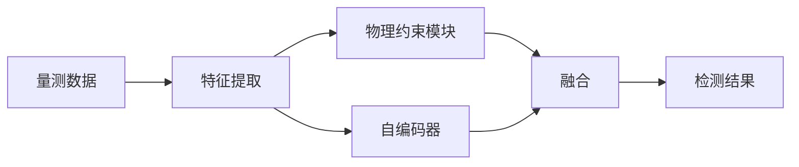

# 📓 第 8 周 · 综合实战与方向拓展

> **本周目标**：从"学知识"切换到"做研究"。读论文、搭环境、复现实验、想选题，并给研一到研三画一条清晰的成长路线。
>
> **使用方式**：本周内容建议**边读边动手**，把每个作业做出来。

[[电网安全学习总目录|← 返回总目录]]

---

## Day 50 · 09:00 —— 如何读一篇电力安全论文：结构拆解与阅读顺序

> **一句话**：**论文不是"从头读到尾"的书**——按正确顺序读，效率能提高 3 倍。

### 一、论文的标准结构

| 部分 | 作用 | 是否必读 |
|---|---|---|
| **Title** | 一句话概括 | 必读 |
| **Abstract** | 全文精华（200 字） | **必读** |
| **Introduction** | 背景 + 问题 + 贡献 | **必读** |
| **Related Work** | 前人工作 | 精读时读 |
| **Method** | 核心方法 | **必读** |
| **Experiment** | 验证方法 | **必读** |
| **Conclusion** | 总结 + 展望 | 必读 |
| **References** | 引用文献 | 按需 |

### 二、三遍读法（推荐）

**第 1 遍：筛选（5-10 分钟）**

```
读：Title → Abstract → Introduction 的最后一段（贡献）→ Conclusion
目标：判断这篇论文值不值得细读
问题：
  - 它解决什么问题？
  - 和我相关吗？
  - 有什么创新？
```

**第 2 遍：理解（30-40 分钟）**

```
读：Introduction 全文 → Method 的框架图 → Experiment 的结果表
略过：公式推导、细节实现
目标：理解方法的核心思想和效果
问题：
  - 方法的核心 idea 是什么？
  - 效果比现有方法好多少？
  - 实验设置合理吗？
```

**第 3 遍：复现（1-3 小时）**

```
精读：Method 的每个公式、Experiment 的每个细节
目标：能复现
问题：
  - 公式怎么推导的？
  - 实验参数是什么？
  - 我能实现吗？
  - 有什么隐藏假设？
```

### 三、读论文的核心问题

**读任何论文，问这 6 个问题**：

| # | 问题 | 目的 |
|---|---|---|
| 1 | **他们解决什么问题？** | 明确问题定义 |
| 2 | **现有方法有什么不足？** | 找 motivation |
| 3 | **他们怎么做的？** | 理解方法 |
| 4 | **为什么有效？** | 理解原理 |
| 5 | **实验怎么验证的？** | 学习方法论 |
| 6 | **有什么局限？** | **找你的机会** |

**第 6 个问题最重要** —— **论文的局限 = 你的选题。**

### 四、读电力安全论文的特殊注意点

| 注意点 | 说明 |
|---|---|
| **系统模型** | 用了什么电网模型？（IEEE 14/39/118？） |
| **攻击模型** | 攻击者能力假设是什么？合理吗？ |
| **物理约束** | 是否考虑物理规律？ |
| **评价指标** | 用了什么指标？全面吗？ |
| **数据来源** | 真实数据还是仿真？ |
| **仿真平台** | 用了什么工具？（pandapower/MATPOWER/） |
| **可复现性** | 代码开源吗？ |

**特别关注"攻击者假设"**：

```
论文可能假设：攻击者知道完整拓扑
你要问：这个假设合理吗？
  → 现实中攻击者可能不知道 → 这是研究机会
```

### 五、论文笔记模板

```markdown
## 论文笔记：[标题]

**作者/年份/会议**：
**链接**：

### 一句话总结
（用一句话说明这篇论文做了什么）

### 问题
（他们解决什么问题）

### 方法
（核心思路，2-3 句）

### 创新点
- 
- 

### 实验
- 数据集：
- 对比方法：
- 主要结果：

### 局限（我的机会）
- 

### 可借鉴之处
- 

### 相关论文
- 
```

**用 Zotero + Markdown 做笔记，形成自己的知识库。**

### 🔍 延伸思考

1. 为什么"读论文的局限部分"是最高效的找选题方法？
2. 如果一篇论文的"攻击者假设"过强，这对它的结论有什么影响？

### 📚 参考

- "How to Read a Paper"（S. Keshav，经典三遍读法）

### 🎬 视频讲解

> 以下为**关键词检索式**推荐（平台搜索结果，非固定视频链接，避免失效）。
> 直接复制关键词到对应平台搜索即可，也可在结果里挑播放量高的看。

| 平台 | 推荐搜索关键词 | 说明 |
|---|---|---|
| **B站** | [如何读论文 三遍法 讲解](https://search.bilibili.com/all?keyword=如何读论文+三遍法+讲解) | 如何高效读一篇科研论文（三遍法） |
| **B站** | [研究生 论文阅读 方法 经验](https://search.bilibili.com/all?keyword=研究生+论文阅读+方法+经验) | 研究生论文阅读方法经验分享 |
| **抖音** | [读论文 方法 通俗](https://www.douyin.com/search/读论文+方法+通俗) | 概念速览 |


---

## Day 50 · 14:00 —— 顶级期刊与会议：IEEE TPS / TII / TDSC、PSCC、PES GM

> **一句话**：**知道"该往哪投"，才知道"该往哪读"**。电力安全是个交叉领域，可以投电力会议，也可以投安全会议——**这给了你更多选择。**

### 一、电力系统的顶刊

| 期刊 | 简称 | 影响 | 特点 |
|---|---|---|---|
| **IEEE Trans. Power Systems** | TPS | 顶刊 | 电力系统理论 |
| **IEEE Trans. Smart Grid** | TSG | 顶刊 | **智能电网（含安全）** |
| **IEEE Trans. Sustainable Energy** | TSE | 顶刊 | 新能源 |
| **IEEE Trans. Industrial Informatics** | **TII** | 顶刊 | **工业信息学（最对口）** |
| **IEEE Trans. Industrial Electronics** | TIE | 顶刊 | 工业电子 |
| **Applied Energy** | — | 高影响 | 能源应用 |
| **Electric Power Systems Research** | EPSR | 中 | 电力系统 |

### 二、安全的顶刊/顶会

| 期刊/会议 | 简称 | 级别 | 特点 |
|---|---|---|---|
| **IEEE Trans. Dependable and Secure Computing** | TDSC | 顶刊 | 安全与可靠性 |
| **IEEE Trans. Information Forensics and Security** | TIFS | 顶刊 | **信息取证与安全** |
| **IEEE Trans. Cybernetics** | TCYB | 顶刊 | 控制论 |
| **ACM CCS** | — | **顶会** | 安全顶会（难） |
| **USENIX Security** | — | **顶会** | 安全顶会（难） |
| **IEEE S&P (Oakland)** | — | **顶会** | 安全顶会（难） |
| **NDSS** | — | **顶会** | 网络安全 |

### 三、交叉领域的"最佳落点"

**电力安全是交叉领域**，最合适的投稿目标：

| 期刊 | 为什么合适 |
|---|---|
| **IEEE TII** | 工业信息学，天然欢迎"工业+AI+安全" |
| **IEEE TSG** | 智能电网，欢迎电网安全 |
| **IEEE IoT Journal** | 物联网安全，欢迎 CPS 安全 |
| **IEEE TDSC** | 安全视角 |
| **IEEE TIFS** | 信息安全的电网应用 |

**"IEEE TII" 是我最推荐的** —— 它对"电力 + AI + 安全"的交叉研究非常友好。

### 四、会议

| 会议 | 领域 | 级别 |
|---|---|---|
| **IEEE PES General Meeting** | 电力 | 大型会议 |
| **PSCC**（Power Systems Computation Conference） | 电力 | 顶级 |
| **IEEE SmartGridComm** | 智能电网通信 | 专业 |
| **CPES / APSEC** | 电力系统 | 区域 |
| **国内**：中国电机工程学报、电力系统自动化 | — | 中文顶刊 |

### 五、投稿策略

**根据研究类型选目标**：

| 研究类型 | 推荐目标 |
|---|---|
| **偏电力理论** | TPS、TSG |
| **偏 AI 方法** | TII、TIFS |
| **偏安全攻防** | TDSC、TIFS |
| **偏工程应用** | TII、IoT Journal |
| **偏系统实现** | TII |

**给研一的建议**：

```
第 1 篇（会议）：找门槛适中的会议，快速发表
  → 建立信心，积累经验
  → 国内会议：中国电机工程学会年会
  → 国际会议：IEEE 相关专业会议

第 2 篇（期刊）：冲击 TII 或 TSG
  → 有第 1 篇的基础，可以做得更深
```

### 六、如何追踪最新研究

| 工具 | 说明 |
|---|---|
| **Google Scholar Alert** | 关键词订阅 |
| **arXiv** | 预印本（最新） |
| **IEEE Xplore Alert** | 期刊订阅 |
| **Twitter/X** | 关注领域学者 |
| **Connected Papers** | 论文关系网 |
| **Semantic Scholar** | AI 辅助 |

**设置关键词订阅**（推荐）：
```
false data injection
power system security
cyber-physical security
intrusion detection smart grid
```

### 🔍 延伸思考

1. 为什么"IEEE TII"对"电力+AI+安全"的交叉研究特别友好？
2. 如果研究偏"AI 方法"，但应用是电力，应该投电力期刊还是 AI 期刊？

### 📚 参考

- IEEE Xplore、Google Scholar、arXiv
- 各期刊官网的 scope 说明

### 🎬 视频讲解

> 以下为**关键词检索式**推荐（平台搜索结果，非固定视频链接，避免失效）。
> 直接复制关键词到对应平台搜索即可，也可在结果里挑播放量高的看。

| 平台 | 推荐搜索关键词 | 说明 |
|---|---|---|
| **B站** | [电力 顶刊 顶会 介绍](https://search.bilibili.com/all?keyword=电力+顶刊+顶会+介绍) | 电力安全领域顶刊顶会介绍 |
| **B站** | [IEEE 期刊 投稿 经验](https://search.bilibili.com/all?keyword=IEEE+期刊+投稿+经验) | IEEE 期刊投稿经验分享 |
| **抖音** | [顶级期刊与会议 通俗](https://www.douyin.com/search/顶级期刊与会议+通俗) | 概念速览 |


---

## Day 51 · 09:00 —— 电网安全研究选题方法论：从痛点到可验证问题

> **一句话**：**好选题 = 真实痛点 + 可验证的问题 + 你的独特优势**。

### 一、选题的三个来源

**① 从"现实痛点"来**

| 痛点 | 可能的选题 |
|---|---|
| 告警太多，调度员看不过来 | LLM 告警降噪 |
| 设备数据多，异常难发现 | 时序异常检测 |
| 检测模型在新系统上失效 | 跨系统泛化 |
| 攻击者能绕过现有检测 | 对抗鲁棒检测 |

**② 从"论文局限"来**

```
读论文时记录：
  - "Future Work" 提到的方向
  - "Limitation" 部分承认的不足
  - 实验中被避免的场景
  → 这些都是选题
```

**③ 从"方法迁移"来**

```
把 A 领域的方法用到 B 领域：
  图神经网络 → 电网拓扑攻击检测
  联邦学习 → 多站协同入侵检测
  对抗训练 → 电力巡检鲁棒性
  大模型 → 电力运维助手
```

### 二、选题的四个标准

**① 问题是否清晰？**

```
❌ 模糊："电力系统安全很重要"
✅ 清晰："如何检测高比例新能源场景下的隐蔽 FDIA"
```

**② 是否可验证？**

```
❌ 不可验证："如何让电网更安全"
✅ 可验证："检测方法在 IEEE 118 节点系统上，
           对稀疏 FDIA 的检测率是多少"
```

**③ 是否有创新？**

```
创新可以是：
  - 新问题（没人研究过）
  - 新方法（用新方法解决老问题）
  - 新场景（老方法用在新场景）
  - 更好的效果（显著提升）
```

**④ 你的优势是什么？**

```
你的优势：
  ✅ 网安基础（懂攻击思维）
  ✅ 实验室 AI 方向（有方法支持）
  ✅ 编程能力（能实现）
  
找到能发挥这些优势的选题
```

### 三、从"大方向"到"小问题"的收敛

```
大方向：电网安全
    ↓ 收敛
子方向：电力 CPS 攻击检测
    ↓ 收敛
具体问题：FDIA 检测
    ↓ 收敛
更具体：稀疏 FDIA 的检测
    ↓ 收敛
你的问题：基于物理约束与深度学习的稀疏 FDIA 检测
    ↓
可执行的研究计划
```

**关键**：**每次收敛都要问"这个问题可验证吗？"**

### 四、选题的常见错误

| 错误 | 说明 | 修正 |
|---|---|---|
| **太大** | "如何保护电网安全" | 收敛到具体问题 |
| **太旧** | 别人做过很多次 | 找差异化角度 |
| **不可验证** | 无法用实验证明 | 设计可测的实验 |
| **无数据** | 拿不到数据 | 选择可自建数据的课题 |
| **无算力** | 需要大量算力 | 选择轻量级方法 |
| **无新意** | 只是"换个数据集" | 要有方法或问题创新 |

**"无数据"是最常见的坑** —— **一定要先确认"数据从哪来"**。

### 五、可验证的研究问题模板

```markdown
## 研究问题模板

在 [场景] 下，针对 [攻击类型]，
如何用 [方法思路] 实现 [目标]，
使得 [指标] 达到 [水平]，
同时 [约束条件]。

示例：
在 IEEE 118 节点系统下，针对稀疏 FDIA，
如何用 物理约束 + 自编码器 实现 高精度检测，
使得 召回率 ≥ 95%、误报率 ≤ 5%，
同时 满足实时性要求（< 100ms）。
```

**这个模板能帮你把"模糊想法"变成"可执行计划"。**

### 六、和导师沟通选题

**沟通前的准备**：

```
① 准备 2-3 个候选选题
② 每个选题写清：问题、方法、创新、需要什么
③ 准备回答："为什么选这个？""困难在哪？"
④ 带上 3-5 篇相关论文
```

**沟通时的问法**：

| 好的问法 | 不好的问法 |
|---|---|
| "我看了这三篇论文，想在这个基础上做 X，您觉得可行吗？" | "老师我该做什么？" |
| "这个方向需要什么样的数据？实验室有吗？" | "我需要什么您给我什么" |
| "如果这个方向做不通，备选是 Y，可以吗？" | （没准备） |

**核心**：**展示你做了功课，而不是来要答案**。

### 🔍 延伸思考

1. 为什么"数据从哪来"必须最先确认？
2. 把你的想法套进"研究问题模板"，能说清楚吗？

### 📚 参考

- 科研方法论相关书籍
- 建议：读 3-5 篇同方向论文后，写选题分析

### 🎬 视频讲解

> 以下为**关键词检索式**推荐（平台搜索结果，非固定视频链接，避免失效）。
> 直接复制关键词到对应平台搜索即可，也可在结果里挑播放量高的看。

| 平台 | 推荐搜索关键词 | 说明 |
|---|---|---|
| **B站** | [研究生 选题 方法论 讲解](https://search.bilibili.com/all?keyword=研究生+选题+方法论+讲解) | 研究生怎么找研究问题（选题方法论） |
| **B站** | [研究问题 选题 方法 讲解](https://search.bilibili.com/all?keyword=研究问题+选题+方法+讲解) | 从痛点出发找到可验证的研究问题 |
| **抖音** | [电网安全研究选题方法论 通俗](https://www.douyin.com/search/电网安全研究选题方法论+通俗) | 概念速览 |


---

## Day 51 · 14:00 —— 复现一篇论文需要什么：数据、代码、算力、环境

> **一句话**：**复现是"从学生到研究者"的关键一步**——它验证你是否真的理解了方法。

### 一、复现的四个要素

| 要素 | 说明 | 常见问题 |
|---|---|---|
| **数据** | 论文用的数据集 | 拿不到、格式不同 |
| **代码** | 作者开源代码 | 没开源、跑不通 |
| **算力** | 训练/仿真资源 | 不够用 |
| **环境** | 依赖、版本 | 环境冲突 |

### 二、数据怎么办

**优先级排序**：

```
① 论文开源的数据 → 直接用
② 公开数据集 → 下载使用
③ 仿真生成 → 用 pandapower 自建
④ 联系作者 → 发邮件索要（成功率不高）
```

**电力安全研究的"数据策略"**：

| 研究类型 | 数据方案 |
|---|---|
| **FDIA 检测** | pandapower IEEE 算例 + 脚本注入攻击 |
| **流量检测** | 公开 ICS 数据集 或 自建协议流量 |
| **图像检测** | 公开电力图像数据集（CPLID 等） |
| **负荷预测** | 公开负荷数据（PJM、ISO-NE） |

**"自建数据集"是电力安全研究的常态**，也是你的贡献机会。

### 三、代码怎么办

**情况 A：作者开源了**
```
① git clone
② 读 README
③ 配置环境
④ 跑通 demo
⑤ 用自己的数据测试
```

**情况 B：没开源**
```
① 读论文，理解方法
② 自己实现（这是最好的学习）
③ 找不到的细节：合理假设 + 说明
④ 联系作者
```

**"自己实现"其实是最好的学习方式** —— 逼你彻底理解每个步骤。

### 四、算力怎么办

| 需求 | 方案 |
|---|---|
| **简单 ML**（RF、SVM） | 笔记本足矣 |
| **深度学习**（LSTM、AE） | 单 GPU 够（可用实验室/Colab） |
| **GNN** | 单 GPU |
| **大模型** | 需要较大显存或多个 GPU |
| **大规模仿真** | 多 CPU 并行 |

**务实建议**：
```
研一阶段：从"轻量级方法"开始
  - 自编码器、随机森林（笔记本可跑）
  - 用 IEEE 14/39 节点（小规模）
  - 用 Google Colab（免费 GPU）
  
等有基础后，再考虑重方法
```

**"用轻量方法做出好结果"比"用重方法做出平庸结果"更有价值。**

### 五、环境管理

**强烈推荐用 Conda/venv**：

```bash
# 创建环境
conda create -n gridsec python=3.10
conda activate gridsec

# 安装核心依赖
pip install pandapower numpy scipy pandas \
            scikit-learn torch matplotlib \
            networkx seaborn

# 记录环境（可复现）
pip freeze > requirements.txt
```

**关键建议**：**记录所有实验配置**（超参、随机种子、数据版本）→ 保证可复现。

### 六、复现的步骤

```
① 复现"最低配置"：先用论文的数据和设置跑通
② 验证"主要结果"：能否达到论文的指标？
③ 分析"差异"：如果达不到，差在哪？
④ 消融实验：验证每个组件的贡献
⑤ 扩展：加入你的改进
```

**第 ③ 步最重要**：**如果复现不出来，可能是"理解有问题"，也可能是"论文有问题"** —— 无论哪种，都是收获。

### 七、复现清单

```markdown
## 复现清单：[论文标题]

### 环境
- [ ] Python 版本：
- [ ] 核心依赖及版本：
- [ ] 硬件：

### 数据
- [ ] 数据来源：
- [ ] 数据量：
- [ ] 预处理步骤：

### 实验设置
- [ ] 模型结构：
- [ ] 超参数：
- [ ] 训练设置：
- [ ] 评价指标：

### 复现结果
- [ ] 论文报告值：
- [ ] 我的复现值：
- [ ] 差异分析：

### 遇到的问题
- 

### 我的改进想法
- 
```

### 🔍 延伸思考

1. 为什么"复现不出来"也是一种收获？可能的原因有哪些？
2. 如果论文没开源代码，自己实现时遇到细节缺失，应该怎么处理？

### 📚 参考

- Papers with Code（找开源代码）
- GitHub（搜索论文标题 + implementation）

### 🎬 视频讲解

> 以下为**关键词检索式**推荐（平台搜索结果，非固定视频链接，避免失效）。
> 直接复制关键词到对应平台搜索即可，也可在结果里挑播放量高的看。

| 平台 | 推荐搜索关键词 | 说明 |
|---|---|---|
| **B站** | [论文复现 经验 分享 教程](https://search.bilibili.com/all?keyword=论文复现+经验+分享+教程) | 论文复现经验分享（从零到跑通） |
| **B站** | [GitHub 论文 代码 环境 配置](https://search.bilibili.com/all?keyword=GitHub+论文+代码+环境+配置) | GitHub 找论文代码 + 环境配置 |
| **抖音** | [论文复现 通俗](https://www.douyin.com/search/论文复现+通俗) | 概念速览 |


---

## Day 52 · 09:00 —— 常用实验环境搭建：Python 电力分析栈（pandapower / PyPSA / NumPy）

> **一句话**：**今天就把环境搭起来**——这是所有"动手"的前提。

### 一、核心工具栈

| 工具 | 用途 | 优先级 |
|---|---|---|
| **pandapower** | 潮流计算、电网建模 | ★★★★★ |
| **NumPy / SciPy** | 数值计算 | ★★★★★ |
| **pandas** | 数据处理 | ★★★★★ |
| **scikit-learn** | 机器学习 | ★★★★★ |
| **PyTorch** | 深度学习 | ★★★★ |
| **networkx** | 图分析 | ★★★★ |
| **matplotlib / seaborn** | 可视化 | ★★★★ |
| **PyPSA** | 电力系统分析 | ★★★ |
| **PyG** | 图神经网络 | ★★★ |

### 二、环境搭建步骤

**① 创建环境**
```bash
conda create -n gridsec python=3.10 -y
conda activate gridsec
```

**② 安装核心包**
```bash
pip install pandapower numpy scipy pandas \
            scikit-learn networkx matplotlib seaborn
```

**③ 安装深度学习**
```bash
# CPU 版
pip install torch --index-url https://download.pytorch.org/whl/cpu
# GPU 版（按 CUDA 版本选）
pip install torch --index-url https://download.pytorch.org/whl/cu118
```

**④ 安装图神经网络（可选）**
```bash
pip install torch-geometric
```

**⑤ 验证**
```python
import pandapower as pp
import pandapower.networks as pn
import numpy as np
import pandas as pd
import sklearn
import torch

print("pandapower:", pp.__version__)
print("numpy:", np.__version__)
print("torch:", torch.__version__)
print("OK!")
```

### 三、pandapower 快速上手

**① 载入算例**
```python
import pandapower as pp
import pandapower.networks as pn

net = pn.case14()          # IEEE 14 节点
print(net)
print("节点数:", len(net.bus))
print("线路数:", len(net.line))
print("发电机:", len(net.gen))
```

**② 运行潮流**
```python
pp.runpp(net)

# 查看结果
print(net.res_bus.head())      # 节点电压
print(net.res_line.head())     # 线路潮流
print(net.res_ext_grid)        # 平衡节点
```

**③ 修改负荷**
```python
net.load['scaling'] = 1.2      # 负荷放大到 120%
pp.runpp(net)
print(net.res_bus.vm_pu)       # 查看电压变化
```

**④ 获取量测数据（用于检测研究）**
```python
def get_measurements(net):
    pp.runpp(net)
    return {
        'vm': net.res_bus.vm_pu.values,        # 电压幅值
        'va': net.res_bus.va_degree.values,    # 电压相角
        'p_line': net.res_line.p_from_mw.values,  # 线路有功
        'q_line': net.res_line.q_from_mvar.values, # 线路无功
    }

meas = get_measurements(net)
```

### 四、构建数据集

```python
import numpy as np

def build_dataset(net, n_normal=500, n_attack=500):
    """构建正常+攻击数据集"""
    X_normal = []
    scales = np.linspace(0.7, 1.3, n_normal)

    for s in scales:
        net.load['scaling'] = s
        pp.runpp(net)
        x = np.concatenate([
            net.res_bus.vm_pu.values,
            net.res_bus.va_degree.values,
            net.res_line.p_from_mw.values,
        ])
        X_normal.append(x)

    X_normal = np.array(X_normal)

    # 攻击：注入扰动（简化版）
    X_attack = X_normal.copy()
    for i in range(len(X_attack)):
        idx = np.random.randint(X_attack.shape[1])
        X_attack[i, idx] += np.random.normal(0, 0.15)

    X = np.vstack([X_normal, X_attack])
    y = np.hstack([np.zeros(len(X_normal)), np.ones(len(X_attack))])
    return X, y

X, y = build_dataset(pn.case14())
print("数据形状:", X.shape, "标签:", y.shape)
```

### 五、可视化

```python
import matplotlib.pyplot as plt
import networkx as nx

# 画电网拓扑
G = nx.Graph()
for _, line in net.line.iterrows():
    if line.in_service:
        G.add_edge(int(line.from_bus), int(line.to_bus))

pos = nx.spring_layout(G, seed=42)
plt.figure(figsize=(10, 8))
nx.draw(G, pos, with_labels=True, node_color='lightblue',
        node_size=500, font_size=10)
plt.title("IEEE 14 节点系统拓扑")
plt.show()
```

### 六、完整的环境检查脚本

```python
"""环境检查 + 第一个实验"""
import pandapower as pp
import pandapower.networks as pn
import numpy as np
from sklearn.ensemble import RandomForestClassifier
from sklearn.model_selection import train_test_split
from sklearn.metrics import classification_report

# 1. 载入
net = pn.case14()

# 2. 构建数据
X, y = build_dataset(net)

# 3. 划分
X_tr, X_te, y_tr, y_te = train_test_split(
    X, y, test_size=0.3, random_state=42, stratify=y)

# 4. 训练
clf = RandomForestClassifier(n_estimators=100, random_state=42)
clf.fit(X_tr, y_tr)

# 5. 评估
pred = clf.predict(X_te)
print(classification_report(y_te, pred))
```

**如果这个脚本能跑通，你的环境就搭好了。**

### 🔍 延伸思考

1. 为什么推荐"从小规模算例（IEEE 14）开始"？
2. 环境搭建为什么要用 conda 而不是直接装？

### 📚 参考

- pandapower 官方文档：pandapower.readthedocs.io
- PyPSA：pypsa.readthedocs.io

### 🎬 视频讲解

> 以下为**关键词检索式**推荐（平台搜索结果，非固定视频链接，避免失效）。
> 直接复制关键词到对应平台搜索即可，也可在结果里挑播放量高的看。

| 平台 | 推荐搜索关键词 | 说明 |
|---|---|---|
| **B站** | [pandapower 教程 Python 电力系统](https://search.bilibili.com/all?keyword=pandapower+教程+Python+电力系统) | Python 电力系统分析：pandapower 教程 |
| **B站** | [Anaconda PyTorch 环境配置 教程](https://search.bilibili.com/all?keyword=Anaconda+PyTorch+环境配置+教程) | Anaconda + PyTorch 环境配置教程 |
| **抖音** | [pandapower 教程 通俗](https://www.douyin.com/search/pandapower+教程+通俗) | 概念速览 |


---

## Day 52 · 14:00 —— 工控仿真环境：GridLAB-D / OpenDSS / 软 PLC

> **一句话**：**做"跨域攻击"研究，需要同时仿真物理和通信**——这一节给你工具选型指南。

### 一、为什么需要工控仿真

**研究"网络攻击 → 物理后果"，需要**：

```
① 物理仿真：电网怎么响应？
② 通信仿真：数据怎么传输？
③ 攻击注入：如何施加攻击？
④ 观测：物理和网络状态如何变化
```

**只有物理仿真不够** —— 你无法研究"通信延迟/丢包"的影响。

### 二、工具分类

**① 电力物理仿真**

| 工具 | 侧重 | 特点 |
|---|---|---|
| **pandapower** | 输配电网 | Python、易用 |
| **PyPSA** | 电力系统优化 | Python |
| **GridLAB-D** | **配电网 + 负荷** | 美国 DOE，含负荷模型 |
| **OpenDSS** | **配电网** | 分布式电源 |
| **PSS/E** | 工业级 | 商业 |
| **PowerWorld** | 可视化 | 教学 |

**配电网研究选 GridLAB-D / OpenDSS；输电网选 pandapower。**

**② 通信网络仿真**

| 工具 | 特点 |
|---|---|
| **NS-3** | 网络仿真标准，功能全 |
| **OMNeT++** | 模块化，易扩展 |
| **Mininet** | SDN、虚拟网络，轻量 |
| **NS-2** | 老版本，少用 |

**③ 联合仿真框架（关键）**

| 框架 | 特点 | 推荐度 |
|---|---|---|
| **HELICS** | 美国 DOE 主推，生态好 | ★★★★★ |
| **Mosaik** | 德国，Python 友好 | ★★★★ |
| **FNCS** | 电力-通信联合 | ★★★ |
| **Ptolemy II** | 通用 CPS | ★★★ |

**HELICS 和 Mosaik 是主流选择。**

**④ 工控协议仿真**

| 工具 | 用途 |
|---|---|
| **libiec61850** | IEC 61850 协议栈 |
| **lib60870** | IEC 60870-5-104 |
| **pymodbus** | Modbus |
| **OpenPLC** | 开源软 PLC |
| **Conpot** | 工控蜜罐 |

### 三、典型的联合仿真架构

```
┌──────────────────────────────────────────┐
│              HELICS 联合仿真               │
│                                          │
│  ┌────────────┐      ┌───────────────┐  │
│  │ 电力仿真    │←────→│ 通信仿真       │  │
│  │ pandapower │      │ NS-3/网络模型  │  │
│  └────────────┘      └───────────────┘  │
│         ↑                    ↑          │
│         │                    │          │
│  ┌──────┴────────────────────┴───────┐  │
│  │         攻击注入模块               │  │
│  │   （篡改数据、阻塞通信、伪造指令）  │  │
│  └───────────────────────────────────┘  │
│         ↓                               │
│  ┌──────────────────────────────────┐   │
│  │         检测模块                  │   │
│  │    （AI 模型 + 物理校验）         │   │
│  └──────────────────────────────────┘   │
└──────────────────────────────────────────┘
```

### 四、简化方案（推荐给研一）

**如果搭建完整联合仿真太复杂，可以简化**：

```
方案 A：纯物理仿真 + 脚本模拟通信
  pandapower + Python 脚本模拟"延迟/丢包"
  → 简单，够用

方案 B：物理仿真 + 真实协议库
  pandapower + libiec61850
  → 中等复杂度

方案 C：完整联合仿真
  HELICS + pandapower + NS-3
  → 最真实，但复杂
```

**务实建议**：**从方案 A 开始**。等基础打好了，再升级到 B/C。

**"能跑通完整流程（攻击 → 传播 → 物理后果 → 检测）"比"用最真实的平台但流程不完整"更有价值。**

### 五、软 PLC 与真实设备

**OpenPLC**：开源软 PLC，可以在普通电脑上模拟 PLC 行为。

```
OpenPLC + Modbus → 模拟真实工控场景
→ 可以做攻击实验（注入 Modbus 指令）
→ 可以做检测研究
```

**如果实验室有真实设备**（西门子 S7、施耐德 PLC），价值更高：
```
真实 PLC + 仿真物理 → 硬件在环（HIL）
→ 可信度最高
```

### 六、学习路径

```
第 1 个月：
  pandapower 熟练 + 跑通基础实验
  （潮流、状态估计、FDIA、检测）

第 2 个月：
  加入协议仿真（pymodbus / libiec61850）
  → 研究"协议层攻击"

第 3 个月：
  尝试联合仿真（HELICS + pandapower）
  → 研究"跨域攻击"
```

### 🔍 延伸思考

1. 为什么"跨域攻击研究"必须用联合仿真？
2. 如果只用 pandapower，能研究哪些攻击？不能研究哪些？

### 📚 参考

- HELICS：helics.org
- Mosaik：mosaik.readthedocs.io
- OpenPLC：openplcproject.com
- GridLAB-D：gridlabd.org

### 🎬 视频讲解

> 以下为**关键词检索式**推荐（平台搜索结果，非固定视频链接，避免失效）。
> 直接复制关键词到对应平台搜索即可，也可在结果里挑播放量高的看。

| 平台 | 推荐搜索关键词 | 说明 |
|---|---|---|
| **B站** | [OpenPLC 工控 仿真 搭建](https://search.bilibili.com/all?keyword=OpenPLC+工控+仿真+搭建) | 工控仿真环境搭建（OpenPLC 等） |
| **B站** | [OpenDSS 配电网 仿真 教程](https://search.bilibili.com/all?keyword=OpenDSS+配电网+仿真+教程) | GridLAB-D / OpenDSS 配电网仿真 |
| **抖音** | [工控仿真环境 通俗](https://www.douyin.com/search/工控仿真环境+通俗) | 概念速览 |


---

## Day 53 · 09:00 —— 电力入侵检测数据集实战：从下载到预处理

> **一句话**：**数据预处理占研究工作量的 60%**——今天就教你把它做对。

### 一、数据来源清单

**① 工控流量数据集**

| 数据集 | 内容 | 获取 |
|---|---|---|
| **4SIC / ICS 数据集** | Modbus、DNP3 流量 | 公开 |
| **Kaggle ICS** | 工控攻击流量 | Kaggle |
| **SWaT / WADI** | CPS 测试床数据 | 申请 |
| **Mississippi State** | 电力系统攻击 | 申请 |
| **ORNL** | 电力 CPS | 申请 |

**② 电网物理算例**

| 算例 | 获取 |
|---|---|
| IEEE 14/39/118 | `pandapower.networks` |
| 新英格兰 39 | `pn.case39()` |
| 大规模算例 | MATPOWER 官网 |

**③ 其他**

| 数据 | 用途 |
|---|---|
| PJM / ISO-NE 负荷 | 负荷预测 |
| CPLID | 绝缘子缺陷图像 |
| 电力设备监测数据 | PHM |

### 二、预处理流程

**① 探索性分析（EDA）**

```python
import pandas as pd
import matplotlib.pyplot as plt

df = pd.read_csv('data.csv')

# 基本信息
print(df.shape)
print(df.info())
print(df.describe())

# 类别分布（重要！）
print(df['label'].value_counts())
print("不平衡比例:", 
      df['label'].value_counts()[0] / df['label'].value_counts()[1])

# 缺失值
print(df.isnull().sum())
```

**② 数据清洗**

```python
# 处理缺失值
df = df.dropna()                          # 删除
df = df.fillna(df.mean())                 # 均值填充
df = df.ffill()                           # 前向填充（时序）

# 处理异常值
Q1 = df.quantile(0.25)
Q3 = df.quantile(0.75)
IQR = Q3 - Q1
df = df[~((df < Q1 - 1.5*IQR) | (df > Q3 + 1.5*IQR)).any(axis=1)]

# 去重
df = df.drop_duplicates()
```

**③ 特征工程**

```python
from sklearn.preprocessing import StandardScaler, LabelEncoder

# 数值特征标准化
scaler = StandardScaler()
num_cols = df.select_dtypes(include='number').columns.drop('label')
df[num_cols] = scaler.fit_transform(df[num_cols])

# 类别特征编码
le = LabelEncoder()
df['protocol'] = le.fit_transform(df['protocol'])
```

**④ 序列化（时序数据）**

```python
import numpy as np

def make_sequences(data, labels, seq_len=20, stride=1):
    """构造时间窗口序列"""
    X, y = [], []
    for i in range(0, len(data) - seq_len, stride):
        X.append(data[i:i+seq_len])
        # 标签：窗口内有攻击则标为攻击
        y.append(int(labels[i:i+seq_len].max()))
    return np.array(X), np.array(y)

X, y = make_sequences(features, labels, seq_len=20)
print(X.shape)   # (样本数, 20, 特征数)
```

**⑤ 数据集划分（关键！）**

```python
from sklearn.model_selection import train_test_split

# ❌ 错误：随机划分（时序数据会泄漏）
# X_tr, X_te, y_tr, y_te = train_test_split(X, y, test_size=0.3)

# ✅ 正确：按时间划分
split = int(len(X) * 0.7)
X_tr, X_te = X[:split], X[split:]
y_tr, y_te = y[:split], y[split:]

# 或按时间划分 + 验证集
n = len(X)
i1, i2 = int(n*0.6), int(n*0.8)
X_tr, y_tr = X[:i1], y[:i1]
X_val, y_val = X[i1:i2], y[i1:i2]
X_te, y_te = X[i2:], y[i2:]
```

**为什么要按时间划分**：**避免"未来信息泄漏"** —— 用未来数据训练、用过去数据测试，会得到虚高的准确率。

**⑥ 处理不平衡**

```python
from imblearn.over_sampling import SMOTE

smote = SMOTE(random_state=42)
X_res, y_res = smote.fit_resample(X_tr.reshape(len(X_tr), -1), y_tr)

# 或用代价敏感
clf = RandomForestClassifier(class_weight='balanced')
```

### 三、数据检查清单

```markdown
## 数据质量检查清单

- [ ] 数据来源可靠吗？
- [ ] 标签准确吗？（谁标的？）
- [ ] 类别平衡吗？不平衡比例多少？
- [ ] 有缺失值吗？怎么处理？
- [ ] 有异常值吗？是噪声还是攻击特征？
- [ ] 特征的单位和范围合理吗？
- [ ] 划分方式正确吗？（时序数据必须按时间！）
- [ ] 有数据泄漏吗？（特征中包含标签信息？）
- [ ] 可分性如何？（画个 t-SNE 看看）
```

### 四、常见陷阱

| 陷阱 | 后果 | 避免方法 |
|---|---|---|
| **随机划分时序数据** | 虚高准确率 | 按时间划分 |
| **特征泄漏** | 虚高准确率 | 检查特征来源 |
| **不平衡未处理** | 模型全预测多数类 | SMOTE/代价敏感 |
| **测试集污染** | 结果不可信 | 隔离测试集 |
| **忽略数据分布偏移** | 泛化差 | 检查分布 |
| **用测试集调参** | 过拟合测试集 | 用验证集 |

### 五、动手作业

**任务**：下载一个公开数据集（推荐 Kaggle ICS 数据集），完成：

1. EDA（看分布、不平衡、缺失）
2. 清洗（缺失、异常、重复）
3. 标准化
4. 序列化
5. **按时间划分**（不是随机！）
6. 处理不平衡
7. 训练随机森林，报告 F1 和 AUC

**这个作业做完，你就掌握了完整的数据处理流程。**

### 🔍 延伸思考

1. 为什么"按时间划分"比"随机划分"更合理？随机划分会导致什么问题？
2. 如何判断数据中是否存在"特征泄漏"？

### 📚 参考

- pandas、scikit-learn 文档
- imbalanced-learn：imbalanced-learn.org

### 🎬 视频讲解

> 以下为**关键词检索式**推荐（平台搜索结果，非固定视频链接，避免失效）。
> 直接复制关键词到对应平台搜索即可，也可在结果里挑播放量高的看。

| 平台 | 推荐搜索关键词 | 说明 |
|---|---|---|
| **B站** | [电力 入侵检测 数据集 预处理](https://search.bilibili.com/all?keyword=电力+入侵检测+数据集+预处理) | 电力入侵检测数据集实战：预处理 |
| **B站** | [数据预处理 完整 流程 教程](https://search.bilibili.com/all?keyword=数据预处理+完整+流程+教程) | 数据预处理完整流程（缺失值/标准化/划分） |
| **抖音** | [入侵检测 数据集 通俗](https://www.douyin.com/search/入侵检测+数据集+通俗) | 概念速览 |


---

## Day 53 · 14:00 —— 复现一个 FDIA 攻击并检测它（端到端小项目）

> **一句话**：**今天做一个完整的项目**——从构造 FDIA 到检测它。**做完这个，你就有了第一篇论文的实验基础。**

### 一、项目目标

```
① 实现状态估计（WLS）
② 实现坏数据检测（BDD）
③ 实现经典 FDIA（a = Hc）→ 验证能绕过 BDD
④ 实现一个检测方法（物理约束 + 机器学习）
⑤ 对比评估
```

### 二、完整代码框架

```python
"""FDIA 攻击与检测端到端实验"""
import numpy as np
import pandapower as pp
import pandapower.networks as pn

np.random.seed(42)

# =====================================================
# ① 构建电网与量测模型
# =====================================================
net = pn.case14()
pp.runpp(net)
n_bus = len(net.bus)

def get_state(net):
    """真实状态：电压幅值和相角"""
    return np.concatenate([
        net.res_bus.vm_pu.values,
        net.res_bus.va_degree.values,
    ])

def get_measurements(net, noise_std=0.01):
    """量测：加噪声"""
    pp.runpp(net)
    # 简化：用节点注入功率和电压作为量测
    z = np.concatenate([
        net.res_bus.vm_pu.values,               # 电压幅值
        net.res_bus.p_mw.values,                # 有功注入
        net.res_bus.q_mvar.values,              # 无功注入
    ])
    return z + np.random.normal(0, noise_std, len(z))

# =====================================================
# ② 状态估计（简化版 WLS）
# =====================================================
def estimate_state(z):
    """简化：直接取电压部分的量测作为估计"""
    return z[:2*n_bus]

# =====================================================
# ③ BDD（坏数据检测）
# =====================================================
def bad_data_detection(z, x_hat, threshold=0.5):
    """简化 BDD：检查残差"""
    z_pred = estimate_measurements(x_hat)
    residual = z - z_pred[:len(z)]
    J = np.sum(residual ** 2)      # 残差平方和
    return J > threshold, J        # 超阈值 = 检测到坏数据

def estimate_measurements(x_hat):
    """从状态推算量测（简化：直接返回）"""
    return x_hat

# =====================================================
# ④ 构造 FDIA
# =====================================================
def construct_fdia(z, x_hat, magnitude=0.1):
    """简化 FDIA：在"一致方向"上注入偏差"""
    # 真实 FDIA 需要 H 矩阵：a = Hc
    # 这里用简化版本：沿状态方向注入，保持"部分一致性"
    a = np.zeros_like(z)
    c = np.random.normal(0, magnitude, len(x_hat))
    # 简化：假设 H 是单位映射（教学用）
    a[:len(c)] = c
    return z + a, c

# =====================================================
# ⑤ 实验
# =====================================================
print("=" * 60)
print("FDIA 攻击与检测实验")
print("=" * 60)

# 生成正常场景
results = []
for scale in np.linspace(0.8, 1.2, 100):
    net.load['scaling'] = scale
    pp.runpp(net)

    z = get_measurements(net)
    x_hat = estimate_state(z)
    detected, J = bad_data_detection(z, x_hat)

    results.append({
        'scale': scale,
        'z': z, 'x': x_hat, 'J': J, 'bdd': detected
    })

# 正常数据的 BDD 统计
J_normal = [r['J'] for r in results]
print(f"\n正常数据残差 J：均值={np.mean(J_normal):.4f}, "
      f"标准差={np.std(J_normal):.4f}")

# 阈值
threshold = np.percentile(J_normal, 99)
print(f"BDD 阈值（99%分位）: {threshold:.4f}")

# =====================================================
# ⑥ FDIA 攻击 + 检测
# =====================================================
attack_detected = []
attack_J = []

for r in results[:50]:
    z_attack, c = construct_fdia(r['z'], r['x'])
    x_hat_attack = estimate_state(z_attack)
    detected, J = bad_data_detection(z_attack, x_hat_attack, threshold)
    attack_detected.append(detected)
    attack_J.append(J)

det_rate = np.mean(attack_detected)
print(f"\n简化 FDIA 被检测率: {det_rate:.2%}")
print("（注：真实的 a=Hc 攻击检测率为 0%）")

# =====================================================
# ⑦ 用机器学习改进检测
# =====================================================
from sklearn.ensemble import RandomForestClassifier
from sklearn.model_selection import train_test_split
from sklearn.metrics import classification_report

# 构造数据集
X_data, y_data = [], []

for scale in np.linspace(0.7, 1.3, 300):
    net.load['scaling'] = scale
    pp.runpp(net)
    z = get_measurements(net)

    # 正常样本
    X_data.append(np.concatenate([z, [0]]))   # 最后一位：是否攻击
    y_data.append(0)

    # 攻击样本
    z_attack, _ = construct_fdia(z, estimate_state(z))
    X_data.append(np.concatenate([z_attack, [1]]))
    y_data.append(1)

X_data = np.array(X_data)
y_data = np.array(y_data)

# 注意：这里为了简单用了随机划分
# 实践中应该按场景/按时间划分
X_tr, X_te, y_tr, y_te = train_test_split(
    X_data, y_data, test_size=0.3, random_state=42, stratify=y_data)

clf = RandomForestClassifier(n_estimators=100, random_state=42,
                             class_weight='balanced')
clf.fit(X_tr, y_tr)

y_pred = clf.predict(X_te)
print("\n机器学习检测结果：")
print(classification_report(y_te, y_pred,
                            target_names=['正常', '攻击']))

# 特征重要性
feature_names = ([f'V{i}' for i in range(n_bus)] +
                 [f'P{i}' for i in range(n_bus)] +
                 [f'Q{i}' for i in range(n_bus)] +
                 ['is_attack'])
importance = pd.Series(clf.feature_importances_,
                       index=feature_names).sort_values(ascending=False)
print("\n最重要的 10 个特征：")
print(importance.head(10))
```

### 三、进阶：实现"真实"的 FDIA

**上面是简化版。真实的 FDIA 需要**：

```python
def construct_real_fdia(net, z, H):
    """
    真实的 FDIA: a = Hc
    H: 量测雅可比矩阵（量测对状态的偏导）
    """
    n_state = len(get_state(net))
    c = np.random.normal(0, 0.1, n_state)   # 攻击向量
    a = H @ c                                # 关键：a 在 H 的列空间
    z_attack = z + a
    return z_attack, c

# 构造 H 矩阵（简化方法）
def build_H_matrix(net):
    """
    用数值微分构建雅可比矩阵
    H = ∂h(x)/∂x
    """
    x0 = get_state(net)
    n_meas = len(get_measurements(net))
    n_state = len(x0)
    H = np.zeros((n_meas, n_state))
    eps = 1e-6

    for j in range(n_state):
        x_plus = x0.copy(); x_plus[j] += eps
        x_minus = x0.copy(); x_minus[j] -= eps
        # 需要能"从状态算量测"的函数
        h_plus = state_to_measurement(x_plus)
        h_minus = state_to_measurement(x_minus)
        H[:, j] = (h_plus - h_minus) / (2 * eps)

    return H
```

**关键验证**：**用 a = Hc 构造的攻击，BDD 残差应该几乎不变** —— 这是 FDIA 的核心性质。

### 四、评估要求

**完成项目后，报告以下结果**：

| 指标 | 说明 |
|---|---|
| **BDD 对 FDIA 的检测率** | 应该接近 0%（证明能绕过） |
| **BDD 对随机扰动的检测率** | 应该很高（对比） |
| **ML 方法的检测率** | 你的方法效果 |
| **ML 的误报率** | 关键指标 |
| **检测延迟** | 时间性能 |

### 五、这个项目的延伸方向

| 延伸 | 说明 |
|---|---|
| **稀疏 FDIA** | 只用最少量测篡改 |
| **物理约束检测** | 加入潮流残差特征 |
| **GNN 检测** | 利用拓扑 |
| **对抗评估** | 攻击者能否绕过你的检测器？ |
| **跨系统泛化** | 在 case14 训练，case39 测试 |

**做完基础版，任选一个延伸方向，就是一个完整的研究工作。**

### 🔍 延伸思考

1. 为什么"随机扰动"容易被检测，而"a = Hc 攻击"检测不到？本质区别是什么？
2. 如果要在 case14 上训练的模型用到 case39，会有什么问题？

### 📚 参考

- Liu et al., "False Data Injection Attacks against State Estimation in Electric Power Grids"
- pandapower 文档

### 🎬 视频讲解

> 以下为**关键词检索式**推荐（平台搜索结果，非固定视频链接，避免失效）。
> 直接复制关键词到对应平台搜索即可，也可在结果里挑播放量高的看。

| 平台 | 推荐搜索关键词 | 说明 |
|---|---|---|
| **B站** | [FDIA 复现 检测 项目 教程](https://search.bilibili.com/all?keyword=FDIA+复现+检测+项目+教程) | FDIA 攻击复现 + 检测（完整小项目） |
| **B站** | [pandapower 电网 攻防 实验](https://search.bilibili.com/all?keyword=pandapower+电网+攻防+实验) | 用 pandapower 做电网攻防实验 |
| **抖音** | [FDIA 攻击复现 通俗](https://www.douyin.com/search/FDIA+攻击复现+通俗) | 概念速览 |


---

## Day 54 · 09:00 —— 论文写作入门：如何讲清一个电力安全问题

> **一句话**：**论文的本质是"讲一个故事"**——问题是什么、为什么难、你怎么解决、效果如何。**结构清晰比语言优美重要得多。**

### 一、论文的标准结构

```markdown
Title（标题）
Abstract（摘要，200 字）
I.   Introduction（引言）
II.  Related Work（相关工作）
III. Problem Formulation（问题建模）
IV.  Methodology（方法）
V.   Case Study / Experiments（实验）
VI.  Conclusion（结论）
References
```

### 二、每个部分怎么写

**① Title（标题）**

**好的标题**：
```
"False Data Injection Attacks against State Estimation 
 in Electric Power Grids"

"基于物理约束与自编码器的电力系统FDIA检测"
```

**要素**：**对象 + 方法 + 目标**

**② Abstract（摘要）**

**结构（5 句话）**：
```
1. 背景：电力系统面临什么威胁
2. 问题：现有方法有什么不足
3. 方法：我们提出了什么
4. 结果：效果如何（具体数字）
5. 意义：有什么价值
```

**示例**：
```
电力系统的状态估计易受虚假数据注入攻击(FDIA)威胁[背景]。
现有的基于残差检验的检测方法在攻击者保持数据自洽时失效[问题]。
本文提出一种物理约束与自编码器融合的检测方法[方法]。
在IEEE 14/118节点系统上，本方法对稀疏FDIA的检测率达96.3%，
误报率仅2.1%，优于现有方法[结果]。
该方法为电力CPS安全防护提供了新思路[意义]。
```

**③ Introduction（引言）**

**经典结构**：
```
第 1 段：大背景（电力系统安全的重要性）
第 2 段：具体问题（FDIA 威胁）
第 3 段：现有工作的不足（"然而……"）
第 4 段：你的方法（"为此，本文提出……"）
第 5 段：贡献列表（Contribution）
```

**贡献列表写法**：
```
本文的主要贡献如下：
1. 提出了……（新方法）
2. 首次将……应用于……（新场景）
3. 实验证明……（验证）
```

**④ Problem Formulation（问题建模）**

**这部分要"数学化"**：
```
- 定义符号
- 给出系统模型（量测方程）
- 定义攻击模型（攻击者能力）
- 形式化问题（优化目标）
```

**⑤ Methodology（方法）**

**结构**：
```
- 方法框架图（一张总图）
- 每个模块详细说明
- 算法伪代码
- 复杂度分析
```

**关键**：**要有一张清晰的框架图** —— 审稿人先看图。

**⑥ Experiments（实验）**

**必须包含**：
```
- 实验设置（数据、平台、参数）
- 对比方法（baseline）
- 评价指标
- 结果表格/图
- 消融实验（每个模块的贡献）
- 复杂性分析
```

### 三、写作的常见问题

| 问题 | 表现 | 修正 |
|---|---|---|
| **故事不清** | 读了不知道要干什么 | 强化 Introduction 的逻辑 |
| **创新不明** | 不知道新在哪 | 明确列出贡献 |
| **实验不足** | 只有一种方法 | 加 baseline 和消融 |
| **指标不全** | 只看准确率 | 加 F1、AUC |
| **图表混乱** | 图看不懂 | 重画，加说明 |
| **语言啰嗦** | 废话多 | 删掉一半形容词 |

### 四、写作建议

**① 用"倒金字塔"结构**

```
最重要的信息放最前面：
  Abstract → 最重要
  Introduction 第一段 → 大背景
  Introduction 最后一段 → 贡献
```

**② 图表优先**

```
审稿人先看：标题 → 摘要 → 图表 → 结论
所以：图表要能"独立看懂"
```

**③ 反复修改**

```
第 1 稿：把想法写下来（不求好）
第 2 稿：调整结构
第 3 稿：精简语言
第 4 稿：检查逻辑
第 5 稿：细节润色
```

### 五、和电网安全论文的特殊要求

| 要求 | 说明 |
|---|---|
| **物理建模** | 必须说清电网模型 |
| **攻击模型** | 攻击者能力假设要合理 |
| **物理可行性** | 攻击在物理上可行吗？ |
| **对比公平** | 和现有方法同条件对比 |
| **可复现** | 说明数据和代码 |

**"攻击模型合理性"最容易被质疑**：

```
审稿人可能问：
"你假设攻击者知道完整拓扑，这现实吗？"
→ 你要有理由（或做敏感性分析）
```

### 六、动手作业

**任务**：基于 Day53 的项目，写一份论文初稿：

```
Title: 你的一句话标题
Abstract: 5 句话
Introduction: 5 段（含贡献）
Method: 你的方法
Experiments: 表格 + 图

目标：能讲清"做了什么、为什么有效"
字数：3000-5000 字即可
```

**写完给导师看，你会得到非常具体的反馈。**

### 🔍 延伸思考

1. 为什么"Contribution 列表"这么重要？
2. 如果审稿人质疑你的"攻击者假设过于理想"，你会怎么回应？

### 📚 参考

- 优秀论文的写作范例（找本领域顶刊论文学习）

### 🎬 视频讲解

> 以下为**关键词检索式**推荐（平台搜索结果，非固定视频链接，避免失效）。
> 直接复制关键词到对应平台搜索即可，也可在结果里挑播放量高的看。

| 平台 | 推荐搜索关键词 | 说明 |
|---|---|---|
| **B站** | [科研论文 写作 结构 教程](https://search.bilibili.com/all?keyword=科研论文+写作+结构+教程) | 科研论文写作入门：结构怎么搭 |
| **B站** | [论文 Introduction 写作 教程](https://search.bilibili.com/all?keyword=论文+Introduction+写作+教程) | 论文引言怎么写（Introduction） |
| **抖音** | [论文写作 通俗](https://www.douyin.com/search/论文写作+通俗) | 概念速览 |


---

## Day 54 · 14:00 —— 学术工具链：Zotero / Overleaf / 实验记录

> **一句话**：**工具让研究效率翻倍**——文献管理、论文写作、实验记录，每个环节都有好工具。

### 一、文献管理：Zotero

**核心功能**：

| 功能 | 说明 |
|---|---|
| **一键抓取** | 浏览器插件抓取论文元数据 |
| **PDF 管理** | 自动下载和归档 PDF |
| **笔记** | 在 PDF 上标注、写笔记 |
| **引用** | 自动生成参考文献 |
| **标签** | 分类管理 |
| **同步** | 多设备同步 |

**工作流**：
```
① 安装 Zotero + 浏览器插件（Connector）
② 在 IEEE/arXiv 页面点插件 → 自动保存
③ 在 Zotero 中分类、打标签
④ 阅读时加笔记
⑤ 写论文时用 Word/LaTeX 插件自动插入引用
```

**推荐插件**：
- **Zotero Connector**：抓取
- **Better BibTeX**：LaTeX 引用
- **ZotFile**：PDF 管理
- **Zotero PDF Translate**：翻译

### 二、论文写作：Overleaf / LaTeX

**LaTeX vs Word**：

| 维度 | LaTeX | Word |
|---|---|---|
| **公式** | 优雅、强大 | 一般 |
| **排版** | 专业、自动 | 手动调整 |
| **参考文献** | 自动 | 手动/半自动 |
| **协作** | Overleaf 支持 | 好 |
| **学习曲线** | 陡 | 平缓 |
| **IEEE 模板** | 官方提供 | 需调整 |

**推荐**：**写 IEEE 论文用 LaTeX**（IEEE 有官方模板）。

**LaTeX 基础结构**：
```latex
\documentclass[journal]{IEEEtran}

\begin{document}
\title{Your Paper Title}
\author{Your Name}

\maketitle

\begin{abstract}
Your abstract here.
\end{abstract}

\section{Introduction}
Your introduction.

\section{Methodology}
The method.

\section{Experiments}
Results.

\section{Conclusion}
Conclusion.

\bibliographystyle{IEEEtran}
\bibliography{references}

\end{document}
```

**Overleaf**：在线 LaTeX 编辑器，有大量模板，支持协作。

### 三、实验记录

**为什么重要**：
```
❌ "我上个月跑了个实验，结果忘了"
✅ 详细记录 → 可复现、可追溯
```

**记录什么**：

| 内容 | 说明 |
|---|---|
| **日期时间** | 什么时候做的 |
| **实验目的** | 想验证什么 |
| **配置** | 数据、参数、代码版本 |
| **结果** | 数值、图表 |
| **观察** | 意外发现 |
| **下一步** | 后续计划 |

**工具选择**：

| 工具 | 特点 |
|---|---|
| **Markdown + Git** | **推荐（简单、版本控制）** |
| **Jupyter Notebook** | 代码+记录一体 |
| **Notion / Obsidian** | 结构化笔记 |
| **纸质笔记本** | 传统但有效 |

**推荐方案**：
```
每个实验一个文件夹：
experiments/
├── 2026-09-16_fdia_detection/
│   ├── README.md          # 实验说明
│   ├── config.yaml        # 配置
│   ├── train.py           # 训练脚本
│   ├── results.csv        # 结果
│   └── figures/           # 图
```

**用 Git 管理**：
```bash
git init
git add .
git commit -m "FDIA detection baseline: RF achieves 0.94 F1"
```

### 四、代码管理

**Git 基础**：
```bash
git init
git add .
git commit -m "描述"
git branch experiment-1
git checkout experiment-1
```

**建议**：
- 每个实验一个分支
- 提交信息写清楚
- 重要的结果打 tag

### 五、其他有用的工具

| 工具 | 用途 |
|---|---|
| **GitHub** | 代码托管 |
| **Google Colab** | 免费 GPU |
| **Connected Papers** | 论文关系图 |
| **Papers with Code** | 找开源代码 |
| **draw.io / Visio** | 画框架图 |
| **Mermaid** | Markdown 画流程图 |
| **Grammarly** | 英文润色（慎用专业术语） |

**"画框架图"很重要**：



### 六、一个完整的工作流

```
① 读论文 → Zotero 管理
② 想 idea → Markdown 记录
③ 写代码 → Git 管理
④ 跑实验 → 详细记录配置和结果
⑤ 画图 → draw.io / matplotlib
⑥ 写论文 → Overleaf (LaTeX)
⑦ 投稿 → 期刊系统
```

### 🔍 延伸思考

1. 为什么"实验记录"对研究生这么重要？
2. LaTeX 和 Word 各适合什么场景？

### 📚 参考

- Zotero：zotero.org
- Overleaf：overleaf.com
- IEEE LaTeX 模板

### 🎬 视频讲解

> 以下为**关键词检索式**推荐（平台搜索结果，非固定视频链接，避免失效）。
> 直接复制关键词到对应平台搜索即可，也可在结果里挑播放量高的看。

| 平台 | 推荐搜索关键词 | 说明 |
|---|---|---|
| **B站** | [LaTeX Overleaf 入门 教程](https://search.bilibili.com/all?keyword=LaTeX+Overleaf+入门+教程) | LaTeX + Overleaf 入门教程 |
| **B站** | [Zotero 文献管理 教程](https://search.bilibili.com/all?keyword=Zotero+文献管理+教程) | Zotero 文献管理教程 |
| **抖音** | [学术工具链 通俗](https://www.douyin.com/search/学术工具链+通俗) | 概念速览 |


---

## Day 55 · 09:00 —— 与导师沟通选题：怎么问、问什么

> **一句话**：**导师是你最重要的资源**——但要用对方式。**带着方案去，而不是带着问题去。**

### 一、沟通的原则

| 原则 | 说明 |
|---|---|
| **带方案，不带问题** | "我想做 X，您觉得可行吗？" |
| **展示功课** | 读过论文、想过方法 |
| **准备备选** | 主方案不行有备选 |
| **尊重时间** | 简明扼要，提前预约 |
| **主动汇报** | 定期更新进展 |

### 二、第一次沟通选题的准备

**准备材料**：

```markdown
## 选题讨论材料

### 1. 我的背景与兴趣
- 网安专业，熟悉 XXX
- 对 XXX 方向感兴趣

### 2. 我读过的论文（3-5 篇）
- [论文1]：讲的是 XXX
- [论文2]：讲的是 XXX
总结：这个方向目前 XXX

### 3. 我的选题想法（2-3 个）
**候选 A**：物理约束 + 深度学习的 FDIA 检测
  - 问题：
  - 方法：
  - 创新：
  - 需要：数据（可自建）、算力（单卡）

**候选 B**：...

### 4. 我的疑问
- 实验室有相关数据/设备吗？
- 这个方向组里有积累吗？
- 您建议从哪个入手？
```

### 三、怎么问（话术）

**好的问法**：

| 场景 | 话术 |
|---|---|
| **提出想法** | "我读了这三篇论文，发现 XX 问题还没解决。我想用 XX 方法尝试，您觉得可行吗？" |
| **询问资源** | "这个方向需要 XX 数据，实验室有吗？如果没有，我打算用 XX 方式自建。" |
| **遇到困难** | "我实现了 XX，但遇到了 XX 问题，我尝试了 XX 方案但没成功，想请教您的建议。" |
| **汇报进展** | "这周我完成了 XX，下周计划做 XX，目前遇到的问题是 XX。" |

**不好的问法**：

| 不好 | 为什么 |
|---|---|
| "老师，我该做什么方向？" | 没做功课 |
| "这个我不会，您帮我做吧" | 依赖 |
| "我觉得 XX 方向没意思" | 消极 |
| （不汇报，等导师问） | 被动 |

### 四、组会汇报技巧

**汇报结构**：
```
① 本周工作（做了什么）
② 遇到问题（卡在哪）
③ 解决方案（我打算怎么解决）
④ 下周计划（要做什么）
⑤ 需要帮助（需要什么支持）
```

**做 PPT 的要点**：
```
- 一页一个要点
- 图多于字
- 突出"问题"和"结论"
- 时间控制（5-10 分钟）
```

### 五、处理分歧

**当导师意见和你不同**：

```
① 先理解导师的顾虑
   "您担心的是 XX 吗？"
   
② 说明你的理由
   "我这样想是因为 XX"
   
③ 寻求折中
   "要不我先做一个小实验验证 XX？"
   
④ 尊重最终决定
   （导师更有经验，但你可以用实验说话）
```

**记住**：**导师和你的目标是一致的**（都想做出好成果）。

### 六、定期沟通的节奏

| 频率 | 内容 |
|---|---|
| **每周** | 简短汇报进展（邮件/微信） |
| **每两周** | 组会详细汇报 |
| **每月** | 面谈讨论方向 |
| **关键节点** | 选题、开题、投稿前必须沟通 |

### 七、给研一的建议

**你的优势**：
```
✅ 网安基础（懂攻击思维）
✅ 编程能力
✅ 有时间（研一压力相对小）

要补的：
⚠️ 电力领域知识（本课程在补）
⚠️ 研究方法论（在读论文、做实验中补）
```

**行动建议**：
```
① 本周：读完 5 篇相关论文，写选题分析
② 下周：约导师时间，带上材料去聊
③ 之后：按导师建议，开始动手
```

### 🔍 延伸思考

1. 为什么"带方案去"比"问该做什么"更有效？
2. 如果导师的方向和你的兴趣不一致，怎么处理？

### 📚 参考

- 科研沟通相关书籍

### 🎬 视频讲解

> 以下为**关键词检索式**推荐（平台搜索结果，非固定视频链接，避免失效）。
> 直接复制关键词到对应平台搜索即可，也可在结果里挑播放量高的看。

| 平台 | 推荐搜索关键词 | 说明 |
|---|---|---|
| **B站** | [第一次见导师 沟通 经验](https://search.bilibili.com/all?keyword=第一次见导师+沟通+经验) | 第一次见导师怎么聊（科研沟通） |
| **B站** | [研究生 导师 沟通 技巧](https://search.bilibili.com/all?keyword=研究生+导师+沟通+技巧) | 研究生如何和导师有效沟通 |
| **抖音** | [导师沟通选题 通俗](https://www.douyin.com/search/导师沟通选题+通俗) | 概念速览 |


---

## Day 55 · 14:00 —— 开题报告结构与常见坑

> **一句话**：**开题报告是研究的"施工图"**——写得清楚，做起来就顺。

### 一、开题报告的结构

```markdown
## 开题报告

### 一、选题背景与意义
- 研究背景（大背景 → 具体问题）
- 研究意义（理论意义 + 应用价值）

### 二、国内外研究现状
- 国外研究进展
- 国内研究进展
- 现有工作的不足（关键！）

### 三、研究内容与目标
- 研究目标（要解决什么）
- 研究内容（分几个部分）
- 拟解决的关键问题

### 四、研究方法与技术路线
- 技术路线图（重要！）
- 具体方法
- 实验方案

### 五、创新点
- 创新点 1
- 创新点 2

### 六、进度安排
- 时间表（甘特图）

### 七、预期成果
- 论文、专利、系统等

### 八、参考文献
```

### 二、每个部分的要点

**① 选题背景与意义**

**逻辑链**：
```
大背景：能源转型、电力系统数字化
    ↓
具体问题：新型电力系统面临新的安全威胁
    ↓
你的切入：针对 XX 攻击的检测方法
    ↓
意义：保障电力系统安全（应用）+ 丰富 CPS 安全理论（理论）
```

**② 研究现状**

**要写成"有逻辑的综述"**，不是"文献罗列"：

```
❌ 差：张三提出了 A 方法。李四提出了 B 方法。王五提出了 C 方法。
✅ 好：目前主流方法分为三类：基于模型的方法（[1][2]）、
       基于数据的方法（[3][4]）、混合方法（[5]）。
       其中基于模型的方法优点是 XX，但难以应对 XX；
       基于数据的方法能 XX，但存在 XX 问题。
       → 因此，如何在 XX 条件下实现 XX，仍是一个挑战。
```

**③ 研究内容**

**拆解成 3-4 个子问题**：
```
研究内容 1：XX 攻击的建模与影响分析
研究内容 2：基于 XX 的检测方法
研究内容 3：检测方法的鲁棒性增强
研究内容 4：实验验证与系统实现
```

**④ 技术路线图**

**必须画一张图**：
```
数据采集 → 特征提取 → 检测模型 → 实验评估
    ↓          ↓          ↓          ↓
  量测数据   物理特征   物理+AI     对比分析
```

**⑤ 创新点**

**3 个左右，每个要"具体"**：

```
❌ 模糊："提出了一个更高效的方法"
✅ 具体："提出了物理约束与自编码器融合的检测框架，
          通过 XX 机制解决了 XX 问题"
```

### 三、常见坑

| 坑 | 表现 | 修正 |
|---|---|---|
| **选题太大** | "研究电力系统安全" | 收敛到具体问题 |
| **现状罗列** | 只列文献不分析 | 写成有逻辑的综述 |
| **创新点虚** | "更高效、更准确" | 具体化 |
| **无技术路线** | 只说方法不说步骤 | 画路线图 |
| **进度不合理** | 时间安排不现实 | 留缓冲 |
| **无数据来源** | 没说数据从哪来 | 明确说明 |
| **无实验方案** | 不知道怎么验证 | 详细设计 |

**"无实验方案"是最大的坑** —— **开题时就该想清楚"怎么证明有效"**。

### 四、进度安排

**合理的甘特图**：

```
时间        1-2月  3-4月  5-6月  7-8月  9-10月  11-12月
文献调研     ████
问题建模            ████
方法设计                   ████
实验验证                          ████
论文撰写                                  ████
修改投稿                                          ████
```

**建议**：
- 留出 20-30% 缓冲时间
- 关键节点明确（如"第 6 个月完成第一个实验"）
- 有"里程碑"（如"第 8 个月投稿"）

### 五、预期成果

| 类型 | 说明 |
|---|---|
| **学术论文** | 1-2 篇（会议 + 期刊） |
| **专利** | 如果有创新性方法 |
| **软件著作权** | 如果有系统实现 |
| **数据集** | 如果构建了数据集 |
| **开源代码** | 提升影响力 |

### 六、开题答辩的准备

**常见问题**：

| 问题 | 准备 |
|---|---|
| "为什么选这个题目？" | 背景 + 意义 |
| "创新点在哪？" | 明确 3 点 |
| "怎么验证？" | 详细实验方案 |
| "数据从哪来？" | 明确来源 |
| "有什么风险？" | 准备备选方案 |
| "和现有工作什么区别？" | 对比分析 |

**回答原则**：
```
- 不要慌，不会就说"这个问题我还没考虑，会后我会研究"
- 用数据说话（有实验最好）
- 展示你的准备（读过论文、做过实验）
```

### 七、动手作业

**任务**：写一份开题报告初稿：

```
- 选题背景（1 页）
- 研究现状（2-3 页，读 10 篇论文后写）
- 研究内容（1 页，3-4 个子问题）
- 技术路线（1 页，含路线图）
- 创新点（1 页，3 点）
- 进度安排（0.5 页）
```

**完成这个，你就有了完整的研究计划。**

### 🔍 延伸思考

1. 为什么"研究现状"要写成有逻辑的综述，而不是文献罗列？
2. 开题报告中"实验方案"为什么必须在开题时就想清楚？

### 📚 参考

- 学校的研究生开题报告模板
- 优秀开题报告范例

### 🎬 视频讲解

> 以下为**关键词检索式**推荐（平台搜索结果，非固定视频链接，避免失效）。
> 直接复制关键词到对应平台搜索即可，也可在结果里挑播放量高的看。

| 平台 | 推荐搜索关键词 | 说明 |
|---|---|---|
| **B站** | [开题报告 怎么写 研究生](https://search.bilibili.com/all?keyword=开题报告+怎么写+研究生) | 研究生开题报告怎么写 |
| **B站** | [开题 答辩 经验 分享](https://search.bilibili.com/all?keyword=开题+答辩+经验+分享) | 开题答辩经验分享 |
| **抖音** | [开题报告结构与常见坑 通俗](https://www.douyin.com/search/开题报告结构与常见坑+通俗) | 概念速览 |


---

## Day 56 · 09:00 —— 综述类论文怎么读、怎么写

> **一句话**：**综述论文是"地图"**——它能让你快速了解一个领域的全貌。**写综述也是一种重要的能力。**

### 一、为什么要读综述

| 价值 | 说明 |
|---|---|
| **快速入门** | 一篇综述 = 100 篇论文的精华 |
| **了解全貌** | 知道领域有哪些分支 |
| **找到经典** | 综述会引用核心论文 |
| **发现问题** | 综述常指出开放问题 |
| **写作参考** | 学结构和表达 |

**建议**：**进入一个新方向，先读 2-3 篇高质量综述。**

### 二、怎么找综述

| 方法 | 说明 |
|---|---|
| **搜索关键词 + "survey" / "review"** | 直接找 |
| **看顶刊的综述** | 质量高 |
| **看高引用论文** | 引用多 = 影响大 |
| **看新论文的 Related Work** | 会引用综述 |

**推荐搜索**：
```
"false data injection" survey
"power system cyber security" review
"intrusion detection smart grid" survey
"ICS security" survey
```

### 三、怎么读综述

**三步法**：

```
第 1 遍：读摘要 + 分类框架图 + 结论
  → 了解领域全貌

第 2 遍：读每个分类的要点
  → 知道每类方法的优劣

第 3 遍：读"开放问题"和"未来方向"
  → 找选题灵感
```

**读综述时做笔记**：
```markdown
## 综述笔记：[标题]

### 领域分类
- 类别 A：方法、优缺点
- 类别 B：方法、优缺点
- 类别 C：方法、优缺点

### 关键论文（要精读的）
- [1] 经典
- [2] 最新

### 开放问题
- 
- 

### 我的想法
- 
```

### 四、怎么写综述

**结构**：

```markdown
### 一、引言
- 背景
- 为什么需要综述
- 综述范围

### 二、分类框架
- 提出分类维度
- 给出分类框架图

### 三、各类方法详述
- 类别 A：原理、代表工作、优缺点
- 类别 B：同上
- 类别 C：同上

### 四、对比分析
- 对比表格
- 优缺点分析

### 五、开放问题与未来方向
- 现有研究的不足
- 未来的机会

### 六、结论
```

**关键**：**分类框架要有逻辑**（按方法、按场景、按目标）。

### 五、分类框架的设计

**好的分类**：

| 维度 | 分类 |
|---|---|
| **按方法** | 模型驱动 / 数据驱动 / 混合 |
| **按目标** | 检测 / 定位 / 防御 |
| **按场景** | 输电网 / 配电网 / 微电网 |
| **按攻击** | FDIA / 拓扑攻击 / DoS |

**示例框架（FDIA 检测）**：
```
FDIA 检测方法
├── 模型驱动
│   ├── 残差检验改进
│   ├── 物理约束校验
│   └── 状态估计增强
├── 数据驱动
│   ├── 传统机器学习
│   ├── 深度学习
│   └── 图神经网络
└── 混合方法
    ├── 物理+数据融合
    └── 多源交叉验证
```

### 六、写综述的价值

| 价值 | 说明 |
|---|---|
| **快速建立领域认知** | 写的过程就是深入学习 |
| **引用率高** | 综述常被广泛引用 |
| **学术影响力** | 成为领域"参考点" |
| **发现机会** | 系统梳理后更清楚 gap |

**注意**：**综述要有"新视角"** —— 不是简单罗列，而是**提出新的分类或洞察**。

### 七、和电网安全研究的关系

**电力安全的综述机会**：

| 方向 | 现状 |
|---|---|
| **FDIA 检测** | 已有综述，但新技术（GNN、LLM）需要更新 |
| **新型电力系统安全** | **机会大**（系统在变） |
| **AI 在电力安全** | **机会大**（新方向） |
| **LLM 在电力** | **机会很大**（前沿） |
| **联邦学习在电力** | 中等 |

**"新型电力系统 + AI + 安全"的交叉综述是很好的选题** —— 因为：
1. 系统在变化（新能源、电力电子）
2. 新技术在涌现（AI、大模型）
3. 研究还不成熟

### 🔍 延伸思考

1. 为什么"综述的分类框架"比"罗列文献"重要得多？
2. 如何判断一个方向"还没有好的综述"？

### 📚 参考

- 各顶刊的综述文章
- 建议搜索："survey" + 你的方向关键词

### 🎬 视频讲解

> 以下为**关键词检索式**推荐（平台搜索结果，非固定视频链接，避免失效）。
> 直接复制关键词到对应平台搜索即可，也可在结果里挑播放量高的看。

| 平台 | 推荐搜索关键词 | 说明 |
|---|---|---|
| **B站** | [文献综述 怎么写 方法](https://search.bilibili.com/all?keyword=文献综述+怎么写+方法) | 文献综述怎么写（完整方法） |
| **B站** | [综述 论文 写作 技巧](https://search.bilibili.com/all?keyword=综述+论文+写作+技巧) | 综述类论文写作技巧 |
| **抖音** | [综述论文写作 通俗](https://www.douyin.com/search/综述论文写作+通俗) | 概念速览 |


---

## Day 56 · 14:00 —— 国内外电网安全研究团队与资源盘点

> **一句话**：**知道"谁在做"，才能跟对方向、找对合作。**

### 一、国际研究团队

| 机构 | 方向 | 特点 |
|---|---|---|
| **UIUC（伊利诺伊）** | 电力 CPS 安全 | 经典 FDIA 研究 |
| **Georgia Tech** | 智能电网安全 | 综合 |
| **UC Berkeley** | CPS 理论 | 理论强 |
| **MIT** | 电力系统 + 安全 | 综合 |
| **Texas A&M** | 电力系统安全 | 攻防 |
| **Iowa State** | 网络安全 + 电力 | 交叉 |
| **NREL / ORNL / PNNL** | 国家实验室 | 测试床、数据集 |
| **SUTD (iTrust)** | CPS 安全测试床 | SWaT/WADI |
| **Nanyang Tech (NTU)** | 智能电网安全 | 亚洲领先 |
| **KTH / TU Delft** | 欧洲电力安全 | 综合 |

### 二、重要会议与期刊

**电力系统**：
- IEEE TPS, TSG, TII, TIE
- PSCC, PES GM

**安全**：
- IEEE TDSC, TIFS
- ACM CCS, USENIX Security, IEEE S&P, NDSS

**交叉（最相关）**：
- IEEE TII（工业信息学）
- IEEE IoT Journal
- IEEE TSG

### 三、重要资源

**① 标准与规范**

| 标准 | 内容 |
|---|---|
| **IEC 61850** | 变电站通信 |
| **IEC 62443** | 工控安全 |
| **IEC 62351** | 电力系统安全（通信） |
| **NIST SP 800-82** | 工控安全指南 |
| **NERC CIP** | 北美电力可靠性（强制标准） |
| **GB/T 36572** | 中国电力监控系统安全防护 |
| **发改委 14 号令** | 中国电力监控系统安全防护规定 |

**② 数据集与测试床**

| 资源 | 说明 |
|---|---|
| **IEEE 算例** | pandapower/MATPOWER |
| **SWaT / WADI** | CPS 测试床 |
| **Kaggle ICS** | 工控流量 |
| **CPLID** | 电力图像 |

**③ 开源工具**

| 工具 | 用途 |
|---|---|
| **pandapower / PyPSA** | 电力分析 |
| **HELICS / Mosaik** | 联合仿真 |
| **libiec61850 / lib60870** | 协议库 |
| **OpenPLC** | 软 PLC |
| **Conpot** | 工控蜜罐 |
| **PyG / DGL** | 图神经网络 |

**④ 安全组织**

| 组织 | 内容 |
|---|---|
| **CISA (原 ICS-CERT)** | 工控漏洞公告 |
| **MITRE ATT&CK for ICS** | 攻击知识库 |
| **CVE / NVD** | 漏洞库 |
| **CNVD / CNNVD** | 中国漏洞库 |
| **Dragos** | 工控威胁情报 |
| **SANS** | 工控安全培训 |

### 四、国内研究团队

| 机构 | 方向 |
|---|---|
| **清华大学** | 电力系统安全、CPS |
| **浙江大学** | 智能电网、工控安全 |
| **华北电力大学** | 电力系统（行业特色） |
| **上海交通大学** | 电力系统、网络安全 |
| **华中科技大学** | 电力系统 |
| **东南大学** | 电力系统 |
| **中国电科院** | 电力安全（行业研究院） |
| **国网/南网研究院** | 工程应用 |

**中文期刊**：
- 中国电机工程学报
- 电力系统自动化
- 电网技术
- 电力系统保护与控制

### 五、如何跟进最新研究

| 方式 | 说明 |
|---|---|
| **Google Scholar Alert** | 关键词订阅 |
| **arXiv** | 预印本（eess.SY, cs.CR） |
| **IEEE Xplore** | 期刊订阅 |
| **会议论文集** | 追踪顶会 |
| **学者主页** | 关注核心学者 |
| **Twitter/X** | 学术圈动态 |
| **微信学术群** | 国内动态 |

**推荐 arXiv 分类**：
```
eess.SY（系统与控制）
cs.CR（密码学与安全）
cs.LG（机器学习）
```

### 六、给你的资源清单

**必读标准**：
```
✅ 发改委 14 号令（中国电力安全）
✅ IEC 62443（工控安全）
✅ IEC 61850（变电站，了解即可）
✅ NIST SP 800-82（工控安全指南）
✅ MITRE ATT&CK for ICS
```

**必读论文**：
```
✅ Liu et al. 2009（FDIA 经典）
✅ FDIA 综述（最新）
✅ 工控安全综述
✅ 你研究方向的最新论文（5-10 篇）
```

**必会工具**：
```
✅ pandapower（电力仿真）
✅ scikit-learn / PyTorch（AI）
✅ Git（版本控制）
✅ Zotero（文献管理）
```

### 🔍 延伸思考

1. 为什么"知道领域有哪些团队"对研究有帮助？
2. 如果发现某个方向已经有强队在做，你应该怎么办？

### 📚 参考

- 各机构官网、学者主页
- 标准组织官网
- 建议：关注 3-5 个核心学者

### 🎬 视频讲解

> 以下为**关键词检索式**推荐（平台搜索结果，非固定视频链接，避免失效）。
> 直接复制关键词到对应平台搜索即可，也可在结果里挑播放量高的看。

| 平台 | 推荐搜索关键词 | 说明 |
|---|---|---|
| **B站** | [科研 工具 推荐 Zotero Overleaf](https://search.bilibili.com/all?keyword=科研+工具+推荐+Zotero+Overleaf) | 科研工具链盘点（Zotero/Overleaf/Git） |
| **B站** | [Git GitHub 入门 教程](https://search.bilibili.com/all?keyword=Git+GitHub+入门+教程) | Git 和 GitHub 入门教程 |
| **抖音** | [电网安全 研究团队 通俗](https://www.douyin.com/search/电网安全+研究团队+通俗) | 概念速览 |


---

## Day 57 · 09:00 —— 60 天知识体系总梳理（上）：物理层与通信层

> **一句话**：**今天把前 4 周的知识串成一条线**——从"电怎么产生"到"数据怎么传输"。

### 一、物理层知识地图

```
【能量转换层】
  发电机（机械能→电能）
    ├─ 参数：容量、功角、励磁
    └─ 控制：AVC、调速
        ↓
【输配电网层】
  变压器（变压）→ 输电线路（传输）→ 断路器（开断）
    ├─ 约束：热极限、电压降、稳定极限
    └─ 分析：潮流计算、短路计算
        ↓
【物理状态层】
  电压（局部量） + 频率（全局量）
    ├─ 有功 P（做功）+ 无功 Q（维持电压）
    └─ 约束：实时平衡、N-1 准则
        ↓
【保护控制层】
  继电保护（免疫系统）
    ├─ 四性：选择性、速动性、灵敏性、可靠性
    └─ 类型：过流、距离、差动、纵联
```

### 二、通信层知识地图

```
【监控层】
  SCADA（数据采集与监控）
    ├─ 四遥：遥测、遥信、遥控、遥调
    └─ 架构：主站-通信-子站-过程
        ↓
【协议层】
  ┌──────────┬──────────┬──────────┐
  │ Modbus   │ DNP3     │ IEC 104  │ IEC 61850 │
  │ 简单     │ 电力远动 │ 调度通信 │ 变电站     │
  │ 无认证   │ 有认证v2 │ 有扩展   │ GOOSE/SV  │
  └──────────┴──────────┴──────────┴───────────┘
        ↓
【安全架构层】
  十六字方针：安全分区·网络专用·横向隔离·纵向加密
    ├─ 安全 I/II/III 区
    └─ 横向隔离装置 + 纵向加密装置
        ↓
【量测层】
  CT/PT → RTU/IED → 合并单元 → 子站 → 主站
  PMU（同步相量）→ WAMS
  AMI（智能电表）→ MDMS
```

### 三、两层之间的耦合

```
物理层  ←────────→  通信层
   ↑                    ↑
量测（物理→信息）    控制（信息→物理）
   │                    │
   └── 攻击可以在这两个方向传导 ──┘
```

**关键洞察**：
- **量测方向被攻击** → 调度员看到假状态（FDIA）
- **控制方向被攻击** → 物理设备被误操作（虚假跳闸）

### 四、必须记住的 20 个核心概念

| # | 概念 | 一句话 |
|---|---|---|
| 1 | 实时平衡 | 电存不住，发=用 |
| 2 | 频率 | 全网统一，反映有功平衡 |
| 3 | 电压 | 就地分布，反映无功平衡 |
| 4 | 有功/无功 | 酒与泡沫 |
| 5 | N-1 准则 | 任一元件故障不影响系统 |
| 6 | 潮流计算 | 求节点电压和支路功率 |
| 7 | 状态估计 | 从量测推算真实状态 |
| 8 | BDD | 坏数据检测（残差检验） |
| 9 | 继电保护 | 电网免疫系统（4ms） |
| 10 | SCADA | 数据采集与监控 |
| 11 | 四遥 | 遥测遥信遥控遥调 |
| 12 | IEC 61850 | 变电站通信标准 |
| 13 | GOOSE | 变电站内跳闸报文 |
| 14 | SV | 采样值报文 |
| 15 | IEC 104 | 调度远动协议 |
| 16 | PMU | 同步相量测量 |
| 17 | 十六字方针 | 中国电力安全防护体系 |
| 18 | 横向隔离 | 生产/管理区单向隔离 |
| 19 | 纵向加密 | 上下级调度加密认证 |
| 20 | 三区 | 安全 I/II/III 区 |

### 五、自测问题

**物理层**：
1. 为什么必须升压输电？
2. 频率和电压分别反映什么平衡？
3. N-1 准则的假设是什么？攻击者如何利用？
4. 潮流计算和状态估计的区别？

**通信层**：
5. SCADA 的四遥分别是什么？
6. IEC 61850 的三层两网是什么？
7. GOOSE 为什么危险？
8. 横向隔离和纵向加密的区别？
9. Modbus 和 IEC 104 的主要差异？
10. PMU 的独特价值是什么？

### 🔍 延伸思考

1. 物理层的哪个概念对你未来的研究最重要？为什么？
2. 通信层的哪个协议是你研究的重点？

### 📚 参考

- 本课程 Week01-04 全部内容

### 🎬 视频讲解

> 以下为**关键词检索式**推荐（平台搜索结果，非固定视频链接，避免失效）。
> 直接复制关键词到对应平台搜索即可，也可在结果里挑播放量高的看。

| 平台 | 推荐搜索关键词 | 说明 |
|---|---|---|
| **B站** | [电网安全 知识 体系 梳理](https://search.bilibili.com/all?keyword=电网安全+知识+体系+梳理) | 电网安全知识体系梳理（全流程） |
| **B站** | [电力系统 网络安全 交叉](https://search.bilibili.com/all?keyword=电力系统+网络安全+交叉) | 电力系统 + 网络安全 交叉知识框架 |
| **抖音** | [电网安全 知识梳理 通俗](https://www.douyin.com/search/电网安全+知识梳理+通俗) | 概念速览 |


---

## Day 57 · 14:00 —— 60 天知识体系总梳理（下）：AI 层与安全层

> **一句话**：**今天梳理后 4 周**——从"攻击怎么打"到"AI 怎么防"。

### 一、攻击层知识地图

```
【攻击模型】
  ┌─────────────┬──────────────┬─────────────┐
  │ FDIA        │ LRA          │ 隐蔽攻击     │
  │ 篡改量测     │ 篡改负荷分布  │ 长期慢漂移   │
  │ 绕过 BDD    │ 不改数据      │ 累积效果     │
  └─────────────┴──────────────┴─────────────┘
  ┌─────────────┬──────────────┬─────────────┐
  │ DoS         │ GPS 欺骗      │ 拓扑攻击     │
  │ 阻塞通信     │ 时间错位      │ 改开关状态   │
  └─────────────┴──────────────┴─────────────┘
        ↓
【攻击路径】
  侦察 → 初始访问 → 突破隔离 → 横向移动 →
  获取权限 → 侦察学习 → 抑制响应 → 执行攻击 →
  破坏恢复
        ↓
【真实案例】
  Stuxnet（物理隔离可破）
  乌克兰（网络攻击导致停电）
  Triton（攻击安全系统）
  Colonial（勒索软件）
```

### 二、防御层知识地图

```
【AI 检测方法】
  ┌────────────┬────────────┬────────────┐
  │ 传统ML     │ 深度学习    │ 图方法      │
  │ RF/SVM     │ LSTM/AE    │ GNN        │
  │ 可解释     │ 时序建模    │ 拓扑建模    │
  └────────────┴────────────┴────────────┘
  ┌────────────┬────────────┬────────────┐
  │ 联邦学习    │ 对抗鲁棒    │ 大模型      │
  │ 隐私保护    │ 抗对抗样本  │ 日志/告警   │
  └────────────┴────────────┴────────────┘
        ↓
【检测思路的演化】
  残差检验 → 物理约束 → 机器学习 →
  深度学习 → 图方法 → 多源融合 → 对抗鲁棒
        ↓
【核心方法论】
  ① 物理约束（攻击者难绕过）
  ② 信息冗余（多源交叉验证）
  ③ 无监督（符合样本稀缺现实）
  ④ 对抗鲁棒（考虑攻击者适应）
```

### 三、AI 应用层知识地图

```
【电力 AI 应用】
  ┌──────────┬──────────┬──────────┐
  │ 负荷预测  │ 图像巡检  │ 智能调度  │
  │ PHM      │ 多模态    │ 智能体    │
  └──────────┴──────────┴──────────┘
        ↓
【数据安全】
  差分隐私 + 同态加密 + 联邦学习 + 区块链
        ↓
【AI 自身安全】
  对抗样本 + 提示注入 + 数据投毒 + 模型窃取
```

### 四、完整知识体系图

```
┌───────────────────────────────────────────────────┐
│                  电网安全研究                       │
└───────────────────┬───────────────────────────────┘
                    │
    ┌───────────────┼───────────────┐
    │               │               │
【物理层】      【通信层】      【攻击层】
发电机/变压器    SCADA/协议      FDIA/LRA/DoS
潮流/稳定       IEC 61850       GPS欺骗/拓扑
    │               │               │
    └───────────────┼───────────────┘
                    │
              【AI 层】
     ┌──────────────┼──────────────┐
     │              │              │
  【检测】       【应用】       【安全】
  RF/LSTM/AE    负荷预测       隐私保护
  GNN/联邦      图像巡检       对抗鲁棒
  物理约束      智能体         提示注入
     │              │              │
     └──────────────┼──────────────┘
                    │
              【研究选题】
   物理约束检测 / 联邦IDS / 对抗补丁 /
   LLM物理校验 / GNN拓扑检测
```

### 五、你的能力评估表

**自评（1-5 分）**：

| 能力 | 研一入学 | 现在 | 目标 |
|---|---|---|---|
| **电力系统基础** | 0 | ? | 3 |
| **电力通信协议** | 0 | ? | 3 |
| **电力安全体系** | 1 | ? | 4 |
| **攻击模型理解** | 2 | ? | 4 |
| **AI 检测方法** | 3 | ? | 4 |
| **实验能力** | 2 | ? | 4 |
| **论文阅读** | 2 | ? | 4 |
| **论文写作** | 1 | ? | 3 |

**填完表，你就知道自己还差什么。**

### 六、下一步该做什么

```
① 确认你的研究方向（Week07 Day49 的作业）
② 读 10-15 篇该方向的论文
③ 复现 1-2 篇（Week06 Day42 的作业）
④ 写选题分析和开题报告（Week08 Day55 的作业）
⑤ 开始自己的实验
⑥ 写论文、投稿
```

### 🔍 延伸思考

1. 在知识体系图里，哪个部分的空白最大（研究机会最多）？
2. 你的能力评估表里，哪一项最需要补？

### 📚 参考

- 本课程全部内容
- 建议：把知识体系图打印出来，贴在桌上

### 🎬 视频讲解

> 以下为**关键词检索式**推荐（平台搜索结果，非固定视频链接，避免失效）。
> 直接复制关键词到对应平台搜索即可，也可在结果里挑播放量高的看。

| 平台 | 推荐搜索关键词 | 说明 |
|---|---|---|
| **B站** | [电力安全 研究 前沿 方向](https://search.bilibili.com/all?keyword=电力安全+研究+前沿+方向) | 电力安全研究前沿方向盘点 |
| **B站** | [工控安全 AI 研究 热点](https://search.bilibili.com/all?keyword=工控安全+AI+研究+热点) | 工控安全 + AI 研究热点 |
| **抖音** | [电网安全 AI 层 通俗](https://www.douyin.com/search/电网安全+AI+层+通俗) | 概念速览 |


---

## Day 58 · 09:00 —— 从入门到深入：下一阶段的三个方向选择

> **一句话**：**60 天只是入门**。接下来你要做选择——**广而浅，还是窄而深？**

### 一、三个可能的深入方向

**方向 A：AI 检测方法深化（偏方法/算法）**

```
路径：
  自编码器 → 图神经网络 → 对抗鲁棒 → 联邦学习

特点：
  ✅ 对接实验室 AI 方向
  ✅ 方法可迁移（不只用于电力）
  ✅ 论文产出快
  ⚠️ 需要较强的 AI 基础

适合：喜欢算法、想做通用方法的人
```

**方向 B：电力 CPS 攻防深化（偏安全/系统）**

```
路径：
  FDIA → 隐蔽攻击 → 跨域攻击 → 攻防博弈

特点：
  ✅ 对接实验室安全方向
  ✅ 领域特色强（电力 + 安全）
  ✅ 有实际价值
  ⚠️ 需要深入理解电力系统

适合：喜欢攻防、想做系统安全的人
```

**方向 C：电力 AI 应用深化（偏应用/工程）**

```
路径：
  负荷预测 → 智能调度 → 智能体 → 电力大模型

特点：
  ✅ 对接实验室"工业AI与智能体"方向
  ✅ 应用价值明确
  ✅ 容易和产业结合
  ⚠️ 可能"研究味"不够

适合：喜欢落地、想做工程的人
```

### 二、如何选择

**问自己三个问题**：

| 问题 | 说明 |
|---|---|
| **我喜欢什么？** | 算法 / 攻防 / 应用 |
| **我擅长什么？** | 编程 / 数学 / 系统 |
| **实验室需要什么？** | 和导师方向一致最重要 |

**一个务实的建议**：

```
最佳选择 = 你的兴趣 ∩ 你的能力 ∩ 实验室方向

如果三者不一致：
  优先"实验室方向"（有支持）
  其次"你的能力"（能做好）
  最后"你的兴趣"（可培养）
```

### 三、每条路径的"一年计划"

**方向 A（AI 方法）**：
```
第 1-2 月：补 AI 基础（深度学习、图神经网络）
第 3-4 月：读论文 + 复现
第 5-6 月：第一个创新点 + 实验
第 7-9 月：深化 + 对抗分析
第 10-12 月：写论文 + 投稿
```

**方向 B（攻防）**：
```
第 1-2 月：补电力系统 + 安全基础
第 3-4 月：复现经典攻击 + 检测
第 5-6 月：新攻击模型或新检测方法
第 7-9 月：深化（跨域、博弈）
第 10-12 月：写论文 + 投稿
```

**方向 C（应用）**：
```
第 1-2 月：补电力 + 应用背景
第 3-4 月：复现应用（如负荷预测）
第 5-6 月：引入安全问题（投毒检测）
第 7-9 月：系统实现
第 10-12 月：论文 + 系统
```

### 四、不要做的事

| 不要 | 原因 |
|---|---|
| **频繁换方向** | 每个方向都要重新积累 |
| **追求"热门"** | 热门 ≠ 适合你 |
| **只看不做** | 读再多论文不如动手 |
| **闭门造车** | 要和导师、同门交流 |
| **追求完美** | 先完成，再完美 |

### 五、给你的建议

**如果你还没确定方向**：

```
① 先把 Week07 Day49 的"五个选题"作业做完
② 找导师聊，听建议
③ 选一个，投入 3 个月
④ 3 个月后再评估（继续还是调整）
```

**关键**：**先开始，再优化。** 不要因为"选不好"而不开始。

### 🔍 延伸思考

1. 三个方向里，哪一个最契合你的兴趣和能力？
2. "频繁换方向"为什么不划算？

### 📚 参考

- 本课程 Week07 Day49（方向映射）

### 🎬 视频讲解

> 以下为**关键词检索式**推荐（平台搜索结果，非固定视频链接，避免失效）。
> 直接复制关键词到对应平台搜索即可，也可在结果里挑播放量高的看。

| 平台 | 推荐搜索关键词 | 说明 |
|---|---|---|
| **B站** | [研究生 研一 研二 研三 规划](https://search.bilibili.com/all?keyword=研究生+研一+研二+研三+规划) | 研一研二研三，怎么规划科研路线 |
| **B站** | [研究生 三年 规划 经验](https://search.bilibili.com/all?keyword=研究生+三年+规划+经验) | 三年研究生规划经验分享 |
| **抖音** | [研究方向 选择 通俗](https://www.douyin.com/search/研究方向+选择+通俗) | 概念速览 |


---

## Day 58 · 14:00 —— 长期路线图：研一到研三的能力建设节奏

> **一句话**：**研究生三年是有节奏的**——研一打基础，研二出成果，研三收尾。**踩对节奏，事半功倍。**

### 一、三年总览

```
研一（打基础 + 找方向）
  ├─ 上学期：课程 + 补基础 + 读论文
  └─ 下学期：定方向 + 复现 + 第一个实验

研二（出成果 + 深化）
  ├─ 上学期：第一个创新点 + 投稿
  └─ 下学期：第二个工作 + 深化

研三（收尾 + 就业）
  ├─ 上学期：补充实验 + 毕业论文
  └─ 下学期：答辩 + 求职
```

### 二、研一详细规划

**上学期（现在）**：
```
✅ 补电力系统基础（本课程）
✅ 补 AI 基础（深度学习、图神经网络）
✅ 读 20-30 篇论文
✅ 掌握工具（pandapower、PyTorch）
✅ 确定大方向
```

**下学期**：
```
✅ 精读该方向 15-20 篇论文
✅ 复现 2-3 篇经典工作
✅ 完成第一个实验
✅ 写开题报告
✅ 投稿第一篇（会议）
```

### 三、研二详细规划

**上学期**：
```
✅ 第一个工作完善 + 投稿
✅ 开始第二个工作（更深）
✅ 参加学术会议
✅ 尝试和同门合作
```

**下学期**：
```
✅ 第二个工作完成 + 投稿（期刊）
✅ 中期考核
✅ 确定毕业论文框架
```

### 四、研三详细规划

**上学期**：
```
✅ 补充实验
✅ 撰写毕业论文
✅ 求职准备（简历、面试）
```

**下学期**：
```
✅ 论文送审、答辩
✅ 就业/升学
```

### 五、能力建设的优先级

| 阶段 | 最重要的事 |
|---|---|
| **研一上** | 补基础、找方向 |
| **研一下** | 复现、第一个实验 |
| **研二上** | 出成果（论文） |
| **研二下** | 深化、第二篇 |
| **研三** | 毕业论文、就业 |

**核心原则**：**研二必须有产出** —— 这是评奖学金、申博、求职的关键。

### 六、需要培养的能力

| 能力 | 何时培养 | 怎么培养 |
|---|---|---|
| **文献阅读** | 研一上 | 每周读 2-3 篇 |
| **编程实现** | 研一上 | 复现论文 |
| **实验设计** | 研一下 | 做完整实验 |
| **论文写作** | 研一下 | 写初稿 |
| **学术表达** | 研二 | 组会汇报、会议 |
| **项目管理** | 研二 | 独立推进课题 |

### 七、常见的时间陷阱

| 陷阱 | 后果 | 避免 |
|---|---|---|
| **研一只上课** | 研二才开始做研究，太晚 | 尽早进实验室 |
| **追求完美** | 反复打磨不投稿 | 先完成再完美 |
| **闭门造车** | 不知道别人做什么 | 多交流、多读 |
| **拖延** | 最后赶工 | 设定里程碑 |
| **只做一件事** | 成果单一 | 规划 2-3 个工作 |

### 八、给你的"未来 12 个月"清单

```markdown
## 未来 12 个月 checklist

### 第 1-2 个月
- [ ] 完成本课程全部 120 篇学习
- [ ] 搭好实验环境（pandapower + PyTorch）
- [ ] 跑通第一个实验（Day53 的项目）
- [ ] 读 10 篇论文，写笔记

### 第 3-4 个月
- [ ] 确定选题（和导师确认）
- [ ] 读该方向 15 篇论文
- [ ] 复现 1-2 篇经典工作
- [ ] 写开题报告

### 第 5-8 个月
- [ ] 提出第一个创新点
- [ ] 完成实验
- [ ] 写论文初稿
- [ ] 投稿（会议或期刊）

### 第 9-12 个月
- [ ] 根据审稿意见修改
- [ ] 开始第二个工作
- [ ] 参加一次学术会议
- [ ] 规划研二
```

### 🔍 延伸思考

1. 为什么"研二必须有产出"这么重要？
2. 你现在的进度，符合这个规划吗？如果落后了怎么办？

### 📚 参考

- 研究生培养方案
- 建议：和师兄师姐聊聊他们的节奏

### 🎬 视频讲解

> 以下为**关键词检索式**推荐（平台搜索结果，非固定视频链接，避免失效）。
> 直接复制关键词到对应平台搜索即可，也可在结果里挑播放量高的看。

| 平台 | 推荐搜索关键词 | 说明 |
|---|---|---|
| **B站** | [电力系统 知识 自测 题目](https://search.bilibili.com/all?keyword=电力系统+知识+自测+题目) | 研究生自测：这些电力知识你知道吗 |
| **B站** | [工控安全 面试 题库 讲解](https://search.bilibili.com/all?keyword=工控安全+面试+题库+讲解) | 工控安全面试题库讲解 |
| **抖音** | [研一 研三 规划 通俗](https://www.douyin.com/search/研一+研三+规划+通俗) | 概念速览 |


---

## Day 59 · 09:00 —— 自测题库（一）：电网基础 30 问

> **一句话**：**检验一下你学得怎么样**——能答出 25 题以上，说明基础扎实。

### 一、电力系统基础（1-10）

**1. 电力系统的五个环节是什么？**
<details><summary>答案</summary>
发电 → 输电 → 变电 → 配电 → 用电
</details>

**2. 为什么远距离输电必须用高电压？**
<details><summary>答案</summary>
同样功率下，电压升高 n 倍，电流降到 1/n，线路损耗 I²R 降到 1/n²。
</details>

**3. 频率和电压分别反映什么平衡？**
<details><summary>答案</summary>
频率反映有功功率平衡（全网统一）；电压反映无功功率平衡（就地分布）。
</details>

**4. 中国额定频率是多少？允许偏差范围？**
<details><summary>答案</summary>
50 Hz。正常 ±0.2 Hz，事故时 ±0.5 Hz（GB/T 15945）。
</details>

**5. 有功和无功的"啤酒比喻"是什么？**
<details><summary>答案</summary>
有功是"酒"（真正做功的能量），无功是"泡沫"（维持电压必需）。
</details>

**6. N-1 准则是什么？它的假设是什么？**
<details><summary>答案</summary>
任一元件故障退出后系统仍能正常运行。假设是"一次只坏一个元件"。
</details>

**7. 电力系统的三大约束是什么？优先级？**
<details><summary>答案</summary>
安全、优质、经济。优先级：安全 > 优质 > 经济。
</details>

**8. 中国电网为什么分几个大区？区域间如何连接？**
<details><summary>答案</summary>
减少故障传导、便于调度。区域间用直流（异步互联）或交流同步互联。
</details>

**9. 特高压的两个类型及电压等级？**
<details><summary>答案</summary>
特高压交流 1000 kV；特高压直流 ±800 kV / ±1100 kV。
</details>

**10. "电存不住"这条约束意味着什么？**
<details><summary>答案</summary>
发电必须实时等于用电（加损耗），偏差会导致频率变化。这是电网所有安全问题的总根源。
</details>

### 二、电力设备（11-20）

**11. 发电机哪三个参数最关键？**
<details><summary>答案</summary>
容量、功角、励磁。
</details>

**12. 变压器变比公式？**
<details><summary>答案</summary>
U₁/U₂ = N₁/N₂（电压比 = 匝数比）。
</details>

**13. 断路器和隔离开关的区别？**
<details><summary>答案</summary>
断路器能切故障电流（有灭弧能力）；隔离开关只能切空载电流（必须在断路器断开后操作）。
</details>

**14. 什么是"一台半断路器接线"？为什么用它？**
<details><summary>答案</summary>
每条线路由 1.5 个断路器控制。用于 500 kV 及以上，可靠性最高，任意断路器检修不停电。
</details>

**15. 输电容量由哪三个极限决定？长线路的瓶颈是？**
<details><summary>答案</summary>
热极限、电压降极限、稳定极限。长线路瓶颈通常是稳定极限。
</details>

**16. 潮流计算求什么？**
<details><summary>答案</summary>
给定发电和负荷，求各节点电压幅值、相角和各支路功率。
</details>

**17. 状态估计的作用？**
<details><summary>答案</summary>
从不完美的量测中估计全网真实状态，是调度的"眼睛"。
</details>

**18. 坏数据检测（BDD）的原理？**
<details><summary>答案</summary>
计算残差 r = z - h(x̂)，残差过大则判定有坏数据（如卡方检验）。
</details>

**19. 继电保护的"四性"？**
<details><summary>答案</summary>
选择性、速动性、灵敏性、可靠性。
</details>

**20. 对称分量法把不对称故障分解成什么？**
<details><summary>答案</summary>
正序、负序、零序。零序是接地故障的特征。
</details>

### 三、综合（21-30）

**21. 为什么电网"分层分区"？**
<details><summary>答案</summary>
每级电压对应一个输送能力档位；分区减少故障传导。
</details>

**22. 直流输电适合什么场景？**
<details><summary>答案</summary>
超远距离（>600-800km）、海底电缆、异步联网。
</details>

**23. 微电网的两种运行模式？**
<details><summary>答案</summary>
并网模式、孤岛模式。
</details>

**24. 新型电力系统的"三高"特征？**
<details><summary>答案</summary>
高比例新能源、高比例电力电子、高比例分布式。
</details>

**25. 为什么"低惯量"让频率更脆弱？**
<details><summary>答案</summary>
电力电子设备（逆变器）没有转动惯量，无法缓冲频率波动，频率跌落更快。
</details>

**26. 什么是"一次调频"和"二次调频"？**
<details><summary>答案</summary>
一次调频：发电机调速器自动响应（秒级）；二次调频：AGC 集中调节（分钟级）。
</details>

**27. 为什么 CT/PT 是高价值攻击目标？**
<details><summary>答案</summary>
它们是所有量测的源头，攻击它们等于从源头污染所有数据（保护、状态估计、SCADA）。
</details>

**28. 直流潮流的公式？为什么它对攻击者友好？**
<details><summary>答案</summary>
P = Bθ（线性）。因为线性方程组容易构造满足约束的假数据。
</details>

**29. 变电站冗余设计是为"什么"设计的？对攻击有效吗？**
<details><summary>答案</summary>
为随机故障设计。对攻击效果有限，因为攻击是"针对性"的，可以同时打掉多个冗余部分。
</details>

**30. 电网介数和介数中心性的区别？**
<details><summary>答案</summary>
介数中心性计所有最短路径；电网介数只计"发电-负荷"之间的路径，更贴合电力实际。
</details>

### 评分标准

| 答对题数 | 评价 |
|---|---|
| **28-30** | 优秀，基础扎实 |
| **24-27** | 良好，可以进入下一步 |
| **18-23** | 及格，建议复习薄弱环节 |
| **< 18** | 需要重新学习 Week01-02 |

### 🔍 延伸思考

1. 哪几题你答不上来？回去复习对应内容。
2. 试着向同学讲解"为什么电存不住"。

### 📚 参考

- 本课程 Week01-02

### 🎬 视频讲解

> 以下为**关键词检索式**推荐（平台搜索结果，非固定视频链接，避免失效）。
> 直接复制关键词到对应平台搜索即可，也可在结果里挑播放量高的看。

| 平台 | 推荐搜索关键词 | 说明 |
|---|---|---|
| **B站** | [研究生 复盘 零基础 入门](https://search.bilibili.com/all?keyword=研究生+复盘+零基础+入门) | 研究生阶段复盘：怎么从零基础到入门 |
| **B站** | [科研 入门 经验 分享](https://search.bilibili.com/all?keyword=科研+入门+经验+分享) | 科研入门经验分享 |
| **抖音** | [电网基础 自测 通俗](https://www.douyin.com/search/电网基础+自测+通俗) | 概念速览 |


---

## Day 59 · 14:00 —— 自测题库（二）：电力安全与 AI 方法 30 问

> **一句话**：**这是核心部分的测试**——答对 25 题以上，说明你可以开始做研究了。

### 一、电力通信与安全体系（1-10）

**1. SCADA 的"四遥"是什么？**
<details><summary>答案</summary>
遥测（YC）、遥信（YX）、遥控（YK）、遥调（YT）。其中遥控和遥调是下行命令。
</details>

**2. 中国电力安全防护的"十六字方针"？**
<details><summary>答案</summary>
安全分区、网络专用、横向隔离、纵向加密。
</details>

**3. 安全 I 区是什么？有什么特殊要求？**
<details><summary>答案</summary>
实时控制区（SCADA、AGC、保护、稳控）。严禁任何外部连接。
</details>

**4. 横向隔离和纵向加密分别防什么？**
<details><summary>答案</summary>
横向隔离：生产控制大区与管理信息大区之间单向隔离；纵向加密：上下级调度之间加密认证。
</details>

**5. IEC 61850 的"三层两网"是什么？**
<details><summary>答案</summary>
三层：站控层、间隔层、过程层；两网：站控层网络、过程层网络。
</details>

**6. GOOSE 和 SV 分别传什么？时延要求？**
<details><summary>答案</summary>
GOOSE 传开关量（跳闸、位置）；SV 传采样值。都要求 ≤4ms。
</details>

**7. 为什么 GOOSE 最危险？**
<details><summary>答案</summary>
无认证，可在网络上注入虚假跳闸报文直接触发断路器动作。
</details>

**8. IEC 104 的端口号？遥控命令的 TypeID？**
<details><summary>答案</summary>
端口 2404；遥控命令 TypeID 45（单命令）/46（双命令）。
</details>

**9. PMU 的独特价值是什么？引入什么攻击面？**
<details><summary>答案</summary>
全网同步、毫秒级、测相量。引入 GPS 时间同步攻击面。
</details>

**10. Modbus 的主要安全缺陷？**
<details><summary>答案</summary>
无认证、无加密、无完整性校验、无审计。任何能发包的人都能操作。
</details>

### 二、攻击模型（11-20）

**11. FDIA 的核心条件是什么？为什么能绕过 BDD？**
<details><summary>答案</summary>
a = Hc（攻击向量落在 H 的列空间）。因为残差 r 完全不变，BDD 无法检测。
</details>

**12. LRA 攻击的独特之处？为什么难检测？**
<details><summary>答案</summary>
不篡改量测数据，只篡改负荷分布信息。因为量测"完全正常"，且保持总负荷不变。
</details>

**13. 隐蔽攻击和经典 FDIA 的区别？**
<details><summary>答案</summary>
隐蔽攻击是长期、小幅、持续的，累积效果显著，单点看不出来。
</details>

**14. 零动态攻击为什么完全不可检测？**
<details><summary>答案</summary>
它激发系统的"内部动态"，这些动态不影响输出（量测），但让状态漂移到危险区域。
</details>

**15. Stuxnet 的五大创新？**
<details><summary>答案</summary>
突破物理隔离（U盘）、多零日组合、物理破坏、数据回放伪装、精确攻击目标。
</details>

**16. 乌克兰 2015 事件的核心手法？**
<details><summary>答案</summary>
窃取凭证后"合法登录"SCADA，像调度员一样操作断路器跳闸。不是利用漏洞。
</details>

**17. Triton 攻击的目标？为什么最危险？**
<details><summary>答案</summary>
安全仪表系统（SIS）。因为它试图让安全系统失效，可能造成人员伤亡。
</details>

**18. ATT&CK for ICS 中 IT 领域没有的三个战术？**
<details><summary>答案</summary>
抑制响应功能、破坏过程控制、影响。
</details>

**19. DoS 攻击在电力 CPS 中的特殊后果？**
<details><summary>答案</summary>
不只是"服务不可用"，而是"控制系统失能导致物理失控"（如保护拒动）。
</details>

**20. 时间同步攻击的物理后果？**
<details><summary>答案</summary>
PMU 相量错位 → 状态估计错误、广域监测误判、保护误动。
</details>

### 三、AI 检测方法（21-30）

**21. 为什么"异常检测"比"误用检测"更适合电力场景？**
<details><summary>答案</summary>
因为攻击样本稀缺，误用检测的特征库不全；而正常数据大量可得。
</details>

**22. 为什么"自编码器"适合电力场景？**
<details><summary>答案</summary>
它只需正常数据训练（无监督），符合"攻击样本稀缺"的现实。
</details>

**23. GNN 适合电网的什么特性？**
<details><summary>答案</summary>
电网是"图"结构，GNN 能保留拓扑信息，适合拓扑攻击检测。
</details>

**24. 为什么"准确率"在不平衡数据下会骗人？**
<details><summary>答案</summary>
如果 99% 是正常，全预测"正常"就有 99% 准确率，但召回率为 0。应看 F1、AUC。
</details>

**25. 为什么"按时间划分"数据比"随机划分"更合理？**
<details><summary>答案</summary>
避免"未来信息泄漏"，时序数据随机划分会导致虚高的准确率。
</details>

**26. 联邦学习在电力行业的价值？**
<details><summary>答案</summary>
解决"数据不能共享"的困境，各方本地训练、只上传参数，保护隐私。
</details>

**27. 联邦学习引入了什么新攻击面？**
<details><summary>答案</summary>
数据投毒、模型投毒、后门攻击、梯度泄露、搭便车。
</details>

**28. 什么是对抗样本？为什么在电网场景需要考虑物理约束？**
<details><summary>答案</summary>
加微小扰动让模型出错。电网场景的对抗样本必须保持物理可行，否则容易被物理校验发现。
</details>

**29. 物理约束为什么是防御优势？**
<details><summary>答案</summary>
攻击者要保持物理自洽需要知道完整拓扑和参数（难度高）；物理约束是"免费的额外信息源"。
</details>

**30. 什么是提示注入？在电力场景的后果？**
<details><summary>答案</summary>
通过输入内容劫持 LLM 指令。电力场景可导致告警被降级、错误决策、甚至危险操作。
</details>

### 评分标准

| 答对题数 | 评价 |
|---|---|
| **28-30** | 优秀，可以开始研究 |
| **24-27** | 良好，找 1-2 个方向深入 |
| **18-23** | 及格，建议重读 Week03-06 |
| **< 18** | 需要系统复习 |

### 🔍 延伸思考

1. 哪几题答不上来？这说明你的薄弱环节在哪？
2. 现在你能向别人讲清"FDIA 为什么能绕过检测"吗？

### 📚 参考

- 本课程 Week03-07

### 🎬 视频讲解

> 以下为**关键词检索式**推荐（平台搜索结果，非固定视频链接，避免失效）。
> 直接复制关键词到对应平台搜索即可，也可在结果里挑播放量高的看。

| 平台 | 推荐搜索关键词 | 说明 |
|---|---|---|
| **B站** | [毕业论文 开题 答辩 全流程](https://search.bilibili.com/all?keyword=毕业论文+开题+答辩+全流程) | 毕业论文开题到答辩全流程 |
| **B站** | [研究生 毕业 要求 时间线](https://search.bilibili.com/all?keyword=研究生+毕业+要求+时间线) | 研究生毕业要求与时间线 |
| **抖音** | [电力安全 自测 通俗](https://www.douyin.com/search/电力安全+自测+通俗) | 概念速览 |


---

## Day 60 · 09:00 —— 结业复盘：你现在的知识地图长什么样

> **一句话**：**60 天前你只知道"电网"两个字；今天你应该能画出一张完整的知识地图。**

### 一、你的知识地图（自测）

**试着默画出这张图**，看能想起多少：

```
        电网安全
            │
    ┌───────┼───────┐
    │       │       │
  【物理】 【通信】 【安全】
    │       │       │
  发电     SCADA   十六字方针
  输电     协议     三区
  变电     61850   横向隔离
  配电     104     纵向加密
  用电     PMU     ────────
    │       │       │
  潮流     量测     攻击模型
  稳定     保护     FDIA/LRA
    │       │       │
    └───────┼───────┘
            │
        【AI 方法】
            │
    ┌───────┼───────┐
    │       │       │
  检测     应用     安全
  RF/AE    预测     隐私
  GNN      巡检     对抗
  联邦     智能体   注入
```

**如果你能画出 70% 以上，说明学习有效。**

### 二、60 天的收获盘点

**你学会了**：

| 类别 | 具体内容 |
|---|---|
| **电力基础** | 发输变配用、频率电压、有功无功、N-1 |
| **设备拓扑** | 变压器、断路器、潮流、状态估计、保护 |
| **通信协议** | SCADA、Modbus、DNP3、104、61850、PMU |
| **安全体系** | 十六字方针、三区、隔离、加密 |
| **攻击模型** | FDIA、LRA、隐蔽攻击、DoS、GPS欺骗 |
| **AI 方法** | RF、LSTM、AE、GNN、Transformer、联邦 |
| **研究技能** | 读论文、搭环境、做实验、写论文 |

### 三、你现在能做什么

**能力清单**：

```
✅ 能看懂电力安全领域的中文/英文论文
✅ 能理解"攻击如何从网络打到物理"
✅ 能用 pandapower 做电力仿真
✅ 能实现基本的 AI 检测方法
✅ 能设计一个完整的实验
✅ 知道去哪里找数据、找论文、找工具
✅ 能和导师讨论选题
```

### 四、还没解决的（正常的）

```
⚠️ 还没有具体的创新点（需要动手做才知道）
⚠️ 还没有实验数据（需要自己构造）
⚠️ 还没写过论文（需要实践）
⚠️ 对某些协议细节不熟（用到再查）
⚠️ 不了解最新研究（需要持续追踪）
```

**这些都是"做研究时自然解决"的，不是"学完才能做"。**

### 五、60 天的核心洞察

**三个最重要的认知**：

**① 电网安全 ≠ 纯网安**
```
纯网安：攻击数据，数据泄露
电网安全：攻击数据 → 物理后果（停电、设备损坏）
→ 必须同时理解"信息"和"物理"
```

**② 物理约束是电力安全的独特优势**
```
攻击者要绕过"物理自洽性"需要知道完整系统信息
→ 物理约束是防御者的"天然武器"
→ 这是电力安全研究最有特色的地方
```

**③ AI 是手段，不是目的**
```
不是"用 AI 做安全"，而是"用 AI 解决安全问题"
→ 方法服务于问题
→ 好问题 > 好方法
```

### 六、最后的复盘作业

**任务**：写一份"60 天学习总结"：

```markdown
## 60 天学习总结

### 1. 我学到了什么（知识盘点）
（列出核心知识点）

### 2. 我的能力变化
（对照 Day57 的能力评估表）

### 3. 我最感兴趣的方向
（从 Week07 Day49 的选题里选）

### 4. 我的下一步计划
（未来 3 个月做什么）

### 5. 我还需要补什么
（知识、技能、资源）

### 6. 我给自己的建议
（基于这 60 天的体验）
```

**写完这份总结，第一阶段（W1~W8，60 天 / 120 篇）就真正结束了。**
**但这不是终点 —— 后面还有 W9~W16 的进阶篇（Day 61~116）等着你。**

### 🔍 延伸思考

1. 60 天前和现在，你对"电网安全"的理解有什么变化？
2. 如果让你给同样是零基础的同学讲"电网安全是什么"，你会怎么讲？
3. 这 60 天里你觉得**最该补的一块**是什么？（→ 记下来，W9 之后重点看）

### 📚 参考

- 本课程全部内容
- 建议：把总结保存下来，一年后再看

### 🎬 视频讲解

> 以下为**关键词检索式**推荐（平台搜索结果，非固定视频链接，避免失效）。
> 直接复制关键词到对应平台搜索即可，也可在结果里挑播放量高的看。

| 平台 | 推荐搜索关键词 | 说明 |
|---|---|---|
| **B站** | [安全问题 研究 课题 方法](https://search.bilibili.com/all?keyword=安全问题+研究+课题+方法) | 如何把安全问题做成研究课题 |
| **B站** | [课程 论文 研究 路线](https://search.bilibili.com/all?keyword=课程+论文+研究+路线) | 从课程到论文：研究路线演示 |
| **抖音** | [电网安全 复盘 通俗](https://www.douyin.com/search/电网安全+复盘+通俗) | 概念速览 |


---

## Day 60 · 14:00 —— 展望：如何把电网安全做成你的研究方向

> **一句话**：**课程结束，研究才开始**。这一节给你"最后的话"。

### 一、三条行动路线

**路线 1：稳妥起步（推荐）**

```
本周：
  □ 完成"60 天总结"作业
  □ 把实验环境跑通
  □ 读 5 篇论文写笔记

下周：
  □ 完成 Week07 Day49 的选题分析（1-2 个）
  □ 约导师聊选题

一个月内：
  □ 确定选题
  □ 复现 1 篇经典论文
  □ 读 15 篇方向相关论文
```

**路线 2：加速（如果你时间紧）**

```
第 1 周：确定选题 + 读 10 篇论文
第 2-3 周：复现 + 跑通实验
第 4 周：提出第一个改进
第 5-8 周：实验 + 写论文初稿
第 9-12 周：投稿
```

**路线 3：深耕（如果你时间充足）**

```
第 1-2 月：打好基础（补 AI + 电力）
第 3-4 月：复现 + 深入理解
第 5-8 月：创新 + 实验
第 9-12 月：论文 + 投稿
```

### 二、给你的四条核心建议

**① 尽早动手，不要"准备充分了再开始"**

```
❌ 错误："等我读完 50 篇论文再开始做"
✅ 正确："读 5 篇就开始复现，边做边读"
```

**② 从一个"小问题"入手**

```
❌ 错误："我要解决电网安全的所有问题"
✅ 正确："我要把 FDIA 检测的召回率从 90% 提到 95%"
```

**③ 重视"物理约束"这个优势**

```
这是电网安全研究区别于纯 AI 研究的地方
也是你（网安背景 + 电力知识）的独特优势
→ 在选题时优先考虑"物理 + 数据"融合的方法
```

**④ 保持节奏，不要停**

```
每天 2 小时 > 每周集中 1 天
研究是"长跑"，不是"冲刺"
```

### 三、推荐的五个切入点（再列一次）

| 优先级 | 选题 | 理由 |
|---|---|---|
| **★1** | **物理约束 + 深度学习的 FDIA 检测** | 数据自建、方法清晰、易出成果 |
| **★2** | **联邦 IDS + 投毒防御** | 对接两个方向、有攻防结构 |
| **★3** | **对抗补丁攻防（电力巡检）** | 对接图像识别、有物理真实性 |
| **★4** | **GNN 拓扑攻击检测** | 图方法优势、对接入侵检测 |
| **★5** | **LLM 物理校验 / 智能体安全** | 最前沿、创新空间大 |

### 四、常见问题的回答

**Q：我觉得自己基础还不够，能开始做研究吗？**
```
A：可以做。研究是"边做边学"的过程。
   从复现开始，遇到不会的再补。
   不要等"完全准备好"——那一刻不会到来。
```

**Q：选题太大/太小怎么办？**
```
A：太大 → 收敛，加上具体约束（如"在 XX 场景下"）
   太小 → 扩展，加上更一般的方法或更多场景
   标准：3-6 个月能做出完整工作
```

**Q：导师的方向和我的兴趣不一致？**
```
A：优先导师方向（有资源、有指导）
   在导师方向内找自己感兴趣的子问题
   或者用你的兴趣方法解决导师方向的问题
```

**Q：实验做不出预期结果？**
```
A：这是常态。
   ① 先确认复现是否正确
   ② 分析为什么没效果
   ③ "负面结果"也有价值（说明某个假设不成立）
   ④ 换思路，但不要频繁换方向
```

**Q：怎么知道自己的研究有没有价值？**
```
A：问三个问题：
   ① 解决了真实问题吗？
   ② 比现有方法好吗？
   ③ 别人会引用吗？
   如果前两个是"是"，就有价值。
```

### 五、最后的话

**60 天前**，你是一个懂一点网安、但完全不懂电力的研一学生。

**今天**，你已经能：
- 理解电力系统的基本原理
- 看懂电力安全领域的论文
- 用 AI 方法做检测实验
- 和导师讨论选题

**这不是终点，是起点。**

电网安全是一个**正在快速发展**的领域：
- 新型电力系统带来新挑战
- AI 技术带来新方法
- 攻击手段不断进化

**这意味着机会很多。**

你有一个独特的优势组合：
```
网络安全（懂攻击思维）
    +
电力系统（懂物理约束）
    +
AI 方法（懂技术手段）
```

**这个组合在电网安全领域非常稀缺。**

**最后的建议**：**去做吧。** 不要等到"完全准备好"。读论文、跑代码、写实验、和导师聊——**在做的过程中，你会越来越清楚该做什么。**

祝你研究顺利。

⚡

---

### 六、课程结业清单

```markdown
## 电网安全课程 · 第一阶段（W1~W8，60 天）结业清单

### 知识
- [ ] 能画出一张完整的电网安全知识地图
- [ ] 能解释 FDIA 为什么能绕过 BDD
- [ ] 能说清十六字方针的含义
- [ ] 能对比主要电力协议（Modbus/104/61850）的安全差异

### 技能
- [ ] 能用 pandapower 做潮流计算和数据生成
- [ ] 能实现一个 AI 异常检测方法
- [ ] 能完整跑通一个 FDIA 攻防实验
- [ ] 能读一篇论文并写出笔记

### 研究
- [ ] 完成了选题分析（1-2 个候选）
- [ ] 和导师讨论过选题
- [ ] 有清晰的下一步计划

### 开始
- [ ] 开始了第一个实验
- [ ] 开始了第一篇论文的阅读/复现
```

**全部打勾的时候，你已经是一名"入门的研究者"了。**

### 🔍 延伸思考

1. 课程结束后，你第一件要做的事是什么？
2. 一年后，你希望自己在什么位置？

### 📚 参考

- 本课程全部内容
- 建议：把这份清单打印出来，逐项打勾

---

## 📎 附录：全课程资源汇总

### 必读标准
- 发改委 14 号令《电力监控系统安全防护规定》
- IEC 62443（工控安全）
- IEC 61850（变电站通信）
- IEC 62351（电力系统安全）
- NIST SP 800-82（工控安全指南）
- GB 38755-2019《电力系统安全稳定导则》
- MITRE ATT&CK for ICS

### 必读论文
- Liu et al. "False Data Injection Attacks against State Estimation in Electric Power Grids", ACM CCS 2009
- 各类 FDIA / 工控安全 / 智能电网安全综述

### 工具清单
| 类别 | 工具 |
|---|---|
| 电力仿真 | pandapower、PyPSA、GridLAB-D、OpenDSS |
| 联合仿真 | HELICS、Mosaik |
| AI | PyTorch、scikit-learn、PyG |
| 协议 | libiec61850、lib60870、pymodbus、OpenPLC |
| 网络 | Wireshark、Scapy、NS-3 |
| 逆向 | Ghidra、IDA Pro、binwalk |
| 文献 | Zotero、Overleaf |

### 数据集
- IEEE 算例（pandapower/MATPOWER）
- Kaggle ICS 数据集
- SWaT/WADI（iTrust）
- CPLID（绝缘子图像）
- PJM/ISO-NE（负荷数据）

### 期刊与会议
- **电力**：IEEE TPS、TSG、TII、TIE
- **安全**：IEEE TDSC、TIFS、ACM CCS、USENIX Security
- **交叉**：IEEE TII、IEEE IoT Journal

---

**🎉 恭喜完成第一阶段（60 天 / 120 篇）！**

**从今天起，你不是"零基础"，而是"入门研究者"。**

> 📌 **接下来**：进入第二阶段 W9~W16（Day 61~116）——
> 电力系统分析进阶 → 新型电力系统 → 协议逆向 → 攻击建模 → 可信ML/GNN/大模型 → 科研落地。
> 详见 [[电网安全学习总目录]]。

**⚡ 祝你研究顺利 —— 小电**

### 🎬 视频讲解

> 以下为**关键词检索式**推荐（平台搜索结果，非固定视频链接，避免失效）。
> 直接复制关键词到对应平台搜索即可，也可在结果里挑播放量高的看。

| 平台 | 推荐搜索关键词 | 说明 |
|---|---|---|
| **B站** | [电网安全 研究 展望 学者](https://search.bilibili.com/all?keyword=电网安全+研究+展望+学者) | 电网安全研究展望（学者分享） |
| **B站** | [网络安全 电力 交叉 前景](https://search.bilibili.com/all?keyword=网络安全+电力+交叉+前景) | 网络安全 + 电力：交叉领域职业前景 |
| **抖音** | [电网安全 研究方向 通俗](https://www.douyin.com/search/电网安全+研究方向+通俗) | 概念速览 |

---

## 📄 第 8 周 · 配套论文清单（实战方法 + 方向落地）

> 本周的论文清单有双重用途：**① 方法论范文**（学怎么组织一篇论文）；**② 研究方向范文**（学怎么选一个可做的选题）。

### 一、研究方法与写作（学"怎么组织一篇论文"）

| # | 论文 / 资料 | 出处/年份 | 为什么读它 | 链接 |
|---|---|---|---|---|
| 1 | **How to Read a Paper**（S. Keshav）⭐ | ACM SIGCOMM CCR, 2007 | Day 50 的**原始文献**，三遍阅读法出处 | [PDF 检索](https://web.stanford.edu/class/ee384m/Handouts/HowtoReadPaper.pdf) |
| 2 | **The Craft of Research** | 专著 | 研究问题锤炼的方法论，写开题前必读 | [检索](https://scholar.google.com/scholar?q=The%20Craft%20of%20Research) |
| 3 | **Writing Science: How to Write Papers That Get Cited** | 专著 | 论文写作的"故事结构"训练 | [检索](https://scholar.google.com/scholar?q=Writing%20Science%3A%20How%20to%20Write%20Papers%20That%20Get%20Cited) |
| 4 | **Deep Learning for Anomaly Detection: A Survey**（Chalapathy & Chawla） | arXiv 综述 | **综述类论文的结构范文**，学 Related Work 怎么写 | [arXiv](https://arxiv.org/abs/1901.03407) |
| 5 | **Reproducibility in Machine Learning Research**（多篇） | NeurIPS / JMLR | Day 51 复现方法论的依据 | [检索](https://scholar.google.com/scholar?q=Reproducibility%20in%20Machine%20Learning%20Research) |
| 6 | **Papers with Code**（在线平台）⭐ | 在线 | 找"论文 + 代码 + 数据集"三件套，复现效率最高 | [paperswithcode.com](https://paperswithcode.com/) |
| 7 | **A Survey of Public Datasets for ICS Security Research** | 综述 | Day 53 数据集实战的参考 | [检索](https://scholar.google.com/scholar?q=A%20Survey%20of%20Public%20Datasets%20for%20ICS%20Security%20Research) |

### 二、方向落地范文（8 个方向，各挑 1~2 篇代表性工作）

| 方向 | 代表论文 / 工作 | 为什么选它 | 链接 |
|---|---|---|---|
| **① FDIA 检测（主推）** ⭐ | Liu et al. *ACM CCS 2009* + Ashok et al. *IEEE TSG 2017* + 各类 GNN 检测论文 | 课题明确、数据可造、方法成熟，**最容易出第一篇论文** | 见第 5 周清单 |
| **② 联邦 IDS / 投毒防御** | *FL for IIoT Security* 综述 + *Poisoning Attacks against FL* 综述 | 同时对接「联邦学习」和「入侵检测」两个方向 | 见第 7 周清单 |
| **③ 对抗攻击 IDS** | *Adversarial Attacks on Smart Grid IDS* + *Adversarial ML for ICS* | 有完整攻防闭环，对接「图像识别与安全」 | 见第 6 周清单 |
| **④ 工控协议 fuzzing / 语义攻击** | *IEC 61850 Semantic Attacks* + fuzzing 类论文 | 偏工程、问题清晰，适合做实用型成果 | 见第 3 周清单 |
| **⑤ GNN 电网异常检测** | *GDN (AAAI 2021)* + *E-GraphSAGE (NOMS 2022)* | 代码开源、顶会背书、易复现 | 见第 6 周清单 |
| **⑥ 电力巡检对抗补丁** | *Adversarial Patch on Insulator Detection* | 有物理真实性，视觉效果好，易出展示型成果 | 见第 7 周清单 |
| **⑦ LLM / 智能体安全** | *Prompt Injection Survey* + *LLM Agent for Power Systems* | 最前沿、创新空间大，但不确定性也高 | 见第 7 周清单 |
| **⑧ 相依网络脆弱性** | Buldyrev et al. *Nature 2010* | 理论深度高，适合偏理论的路线 | [Nature](https://www.nature.com/articles/nature08932) |

### 三、期刊与会议速查

| 类别 | 期刊 / 会议 |
|---|---|
| 电力系统 | IEEE TPS、IEEE TSG、IEEE TII、IEEE TIE、*电力系统自动化* |
| 信息安全 | IEEE TDSC、IEEE TIFS、ACM CCS、USENIX Security、NDSS、S&P |
| 交叉 / 应用 | IEEE TII、IEEE IoT Journal、Applied Energy |
| 会议 | PSCC、IEEE PES GM、IEEE SmartGridComm、AAAI、NeurIPS、ICLR |
| 预印本 | arXiv（eess.SY / cs.CR / cs.LG） |

### 四、文献工具链

| 用途 | 工具 |
|---|---|
| 文献管理 | Zotero（+ Better BibTeX）、Mendeley |
| 论文关系图 | Connected Papers、Litmaps、ResearchRabbit |
| 检索 | Google Scholar、Semantic Scholar、IEEE Xplore、DBLP、知网 |
| 代码/复现 | Papers with Code、GitHub、Hugging Face |
| 写作 | Overleaf（LaTeX）、Typora + Pandoc |

> 💡 **最后一句**：论文清单不是"要读完的作业"，而是"随时可以查的字典"。
> 真正要做的是——**挑一条路线，读透 10 篇，复现 2 篇，做出 1 个改进**。这比泛读 100 篇有用得多。

