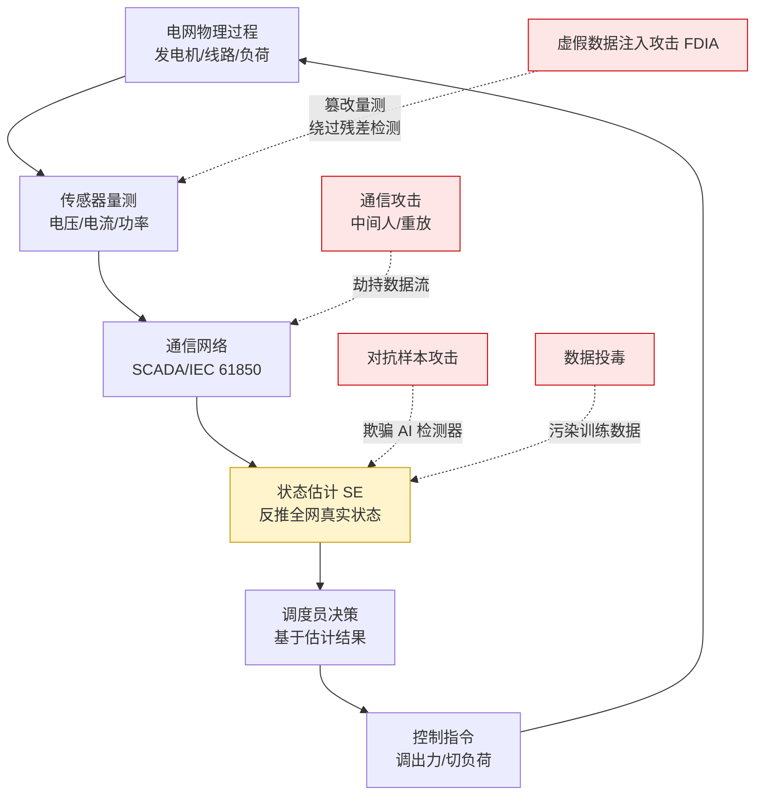
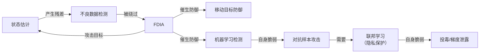

# 🕸️ MOC · 电网安全概念地图

> **48 张概念卡片 + 102 篇论文**构成的知识网络。
> **这张图的作用**：告诉你"哪些概念是枢纽、它们怎么连、你该从哪切入"。

---

## 一、概念分层总览

```
第 0 层 · 世界观（先建立这个，否则后面全是散的）
  电力信息物理系统(CPS) ── 智能电网 ── 电力监控系统安全防护体系 ── 零信任架构

第 1 层 · 电网怎么运行（不懂这层，读不懂攻击论文）
  状态估计 ── 潮流计算 ── 电力系统稳定性 ── 电力负荷预测 ── 电力需求响应
  └─ 同步相量测量单元(PMU) ── 电力系统弹性(Resilience)

第 2 层 · 工控与安全基础
  SCADA系统 ── IEC 61850 ── IEC 62443 ── Modbus协议安全
  └─ 入侵检测系统(IDS) ── 工控安全测试床与数据集

第 3 层 · 攻击与防御（核心）
  虚假数据注入攻击(FDIA) ── 隐蔽性攻击 ── 负载重分配攻击
  └─ 拒绝服务攻击(DoS) ── GPS欺骗攻击 ── 高级持续性威胁(APT)
  └─ 不良数据检测与状态估计防御 ── 移动目标防御(MTD) ── 博弈论与攻防博弈
  └─ 对抗样本攻击 ── 电力系统异常检测

第 4 层 · AI 方法（你的技术武器）
  联邦学习 ── 图神经网络 ── 时序图神经网络 ── 强化学习 ── 大语言模型(LLM)
  └─ 深度学习检测方法 ── 自动编码器

第 5 层 · AI 自身的安全（第二批新增，与你的背景最契合）
  联邦学习攻击与防御 ── 差分隐私 ── 后门攻击 ── 数据投毒攻击
  └─ 成员推理攻击 ── 提示注入

第 6 层 · 新能源与新场景（第二批新增，蓝海）
  逆变器与电力电子安全 ── 微电网安全 ── 电动汽车充电安全
  └─ 虚拟电厂 ── 区块链与能源交易 ── 数字孪生 ── 硬件在环仿真(HIL)
```

---

## 二、核心知识链条（最重要的一张图）

这条链条是**整个电网安全研究的骨架**。读懂它，你就读懂了 70% 的论文。



**读图要点**：
- **红色 = 攻击点**，黄色 = 攻击目标
- **FDIA 的可怕之处**：它不破坏通信、不中断服务，只让"状态估计"输出错误结果 → 调度员看到假现实
- **所有攻击最终都指向物理世界**（回到 A）—— 这就是"信息物理系统"的含义

---

## 三、48 张概念卡片索引

> 「连接数」= 有多少篇笔记链接到这张卡。**数字越大越是枢纽**，也越适合作为"研究现状"的入口。

### 🌍 世界观类

| 概念 | 一句话 | 连接数 |
|---|---|---|
| [[虚假数据注入攻击(FDIA)]] | **整个领域的主线**：篡改量测，绕过检测，让系统看到假现实 | **71** ⭐ |
| [[电力信息物理系统(CPS)]] | 电力流与信息流深度耦合，信息层的攻击能造成物理层事故 | 40 |
| [[智能电网]] | 能自感知、自决策的下一代电网，也是"攻击面的噩梦" | 28 |
| [[电力监控系统安全防护体系]] | 中国方案：安全分区、网络专用、横向隔离、纵向认证 | 20 |
| [[零信任架构]] | "永不信任、始终验证"——边界消失后的补丁 | 16 |

### ⚡ 电力基础类

| 概念 | 一句话 | 连接数 |
|---|---|---|
| [[状态估计]] | 用带噪声的量测反推全网真实状态——**FDIA 的攻击目标** | 40 |
| [[电力系统稳定性]] | 电网被扰动后能不能恢复同步运行 | 26 |
| [[电力需求响应]] | 用价格信号引导用户削峰，而非多建电厂 | 19 |
| [[电力负荷预测]] | 预测未来用电量，是调度决策的输入 | 18 |
| [[同步相量测量单元(PMU)]] | 带 GPS 授时的"电网示波器"，精度高但也引入新攻击面 | 8 |
| [[潮流计算]] | 给定发电和用电，算线路潮流和节点电压 | 8 |

### 🏭 工控与安全类

| 概念 | 一句话 | 连接数 |
|---|---|---|
| [[入侵检测系统(IDS)]] | **你的主场**：从 IT 流量搬到 OT 协议+物理量测 | 41 |
| [[工控安全测试床与数据集]] | 没有数据和测试床，这个领域寸步难行 | 42 |
| [[SCADA系统]] | 工控系统的"大脑+神经系统"，电网调度中心就是最大的 SCADA | 26 |
| [[IEC 61850]] | 变电站通信标准，GOOSE/SV 报文无认证无加密 | 18 |
| [[Modbus协议安全]] | 最古老的工控协议，明文无认证——攻击者的"敲门砖" | 10 |
| [[IEC 62443]] | 工控信息安全的国际标准体系（分区/管道模型） | 8 |

### ⚔️ 攻击与防御类

| 概念 | 一句话 | 连接数 |
|---|---|---|
| [[对抗样本攻击]] | 微小扰动让 AI 模型失效，电网里后果是事故 | 34 |
| [[电力系统异常检测]] | 不依赖攻击签名，靠"不正常"来发现未知威胁 | 26 |
| [[不良数据检测与状态估计防御]] | 电网唯一的数据完整性防线，但可被精确绕过 | 23 |
| [[隐蔽性攻击(Stealthy Attack)]] | 让残差保持不变——"完美犯罪"式的攻击 | 14 |
| [[移动目标防御(MTD)]] | 主动让攻击者"算不准"——信息优势争夺战 | 13 |
| [[拒绝服务攻击(DoS)]] | 不篡改数据，只让数据"到不了"——可用性攻击 | 9 |
| [[高级持续性威胁(APT)]] | 长期潜伏、多阶段推进、以物理后果为目标 | 7 |
| [[博弈论与攻防博弈]] | 把攻防看成双方的最优策略问题 | 6 |
| [[GPS欺骗攻击]] | 伪造卫星授时信号，让 PMU 的时间基准错乱 | 4 |
| [[负载重分配攻击]] | 总量不变、只在节点间挪——最难察觉的一类 FDIA | 2 |

### 🤖 AI 方法类

| 概念 | 一句话 | 连接数 |
|---|---|---|
| [[联邦学习]] | 数据不动模型动——但"不共享数据"≠"隐私安全" | 28 |
| [[大语言模型(LLM)]] | 电网的自然语言接口+推理引擎，也是新的攻击面 | 18 |
| [[深度学习检测方法]] | 端到端学"什么是攻击"，但本身可被对抗 | 18 |
| [[强化学习]] | 试错学习控制策略——但电网里"试错"=停电 | 13 |
| [[图神经网络]] | 电网天生是图，GNN 天生适合 | 13 |
| [[自动编码器]] | 重构误差当异常分数，无监督检测的主力 | 3 |
| [[时序图神经网络]] | 同时抓"拓扑结构"和"时间演化"的异常 | 4 |

### 🔐 AI 安全与隐私类（第二批新增）

| 概念 | 一句话 | 连接数 |
|---|---|---|
| [[差分隐私]] | 加噪声换隐私——ε 越小越安全，但模型越差 | 11 |
| [[联邦学习攻击与防御]] | 梯度泄露、投毒、后门——联邦学习自身的软肋 | 9 |
| [[数据投毒攻击]] | 污染训练数据，让模型在关键时刻"看走眼" | 10 |
| [[成员推理攻击]] | 判断某个用户的数据是否参与了训练 | 6 |
| [[后门攻击]] | 埋一个触发器，平时正常、触发即失效 | 8 |
| [[提示注入]] | 你熟悉的注入漏洞，在 LLM 上的翻版 | 4 |

### 🔋 新能源与工程类（第二批新增）

| 概念 | 一句话 | 连接数 |
|---|---|---|
| [[微电网安全]] | 能孤岛运行的"小电网"，控制权分散=攻击面分散 | 14 |
| [[逆变器与电力电子安全]] | 新能源并网的接口，也是"软件定义的电源" | 11 |
| [[电力系统弹性(Resilience)]] | 被打了之后能不能快速恢复——不只是"防住" | 10 |
| [[电动汽车充电安全]] | 充电桩是电网新入口，OCPP 协议层有硬伤 | 9 |
| [[虚拟电厂]] | 聚合海量分布式资源——聚合即放大攻击后果 | 9 |
| [[硬件在环仿真(HIL)]] | 真控制器 + 虚拟电网，安全实验的安全做法 | 5 |
| [[数字孪生]] | 电网的实时镜像，也是攻击演练的沙箱 | 5 |
| [[区块链与能源交易]] | 去中心化信任，适合点对点能源交易场景 | 5 |

---

## 四、概念之间的关系（"为什么它们连在一起"）

### FDIA 的完整知识闭环



**读法**：这是一个**攻防螺旋**。每一轮防御都催生新的攻击面。
**你的机会就在这个螺旋的"最新一圈"**。

### "用网安的话说"——概念翻译表

| 电力概念 | 网安对应 | 为什么 |
|---|---|---|
| 状态估计 | 带物理约束的异常检测器 | 用冗余量测反推状态，并检测坏数据 |
| 不良数据检测（BDD） | 基于签名的 IDS | 静态阈值，能被精心构造的攻击绕过 |
| FDIA | IDS 绕过技术（语法合法、语义恶意） | 报文正常，数据是假的 |
| 移动目标防御（MTD） | ASLR / 动态令牌 | 让攻击者事先掌握的信息失效 |
| 安全分区/横向隔离 | 物理隔离 + DMZ | 用架构而非算法保证安全 |
| 工业协议（Modbus/GOOSE） | 无认证的裸 TCP | 明文、无校验、无加密 |
| PLC 逻辑篡改 | 合法的恶意配置变更 | 不需要漏洞，有权限就行 |

---

## 五、怎么用这张地图找选题

**方法：找"高连接 + 低覆盖"的交叉点**

1. **看枢纽**：[[虚假数据注入攻击(FDIA)]]（71）、[[工控安全测试床与数据集]]（42）、[[入侵检测系统(IDS)]]（41）、[[状态估计]]（40）、[[电力信息物理系统(CPS)]]（40）
   → 这些是**红海**，除非有独特角度，否则别硬闯

2. **看边缘**：连接稀疏的概念卡片
   → 如 [[负载重分配攻击]]（2）、[[自动编码器]]（3）、[[GPS欺骗攻击]]（4）、[[时序图神经网络]]（4）
   → 这些是**蓝海**，但要注意"是真空白还是没人关心"

3. **看跨层连接**（★ = 第二批新增的机会）：

   | 跨层组合 | 成熟度 | 建议 |
   |---|---|---|
   | FDIA × 联邦学习 | 中 | 已有工作，可改进 |
   | FDIA × 图神经网络 | 低 | 有空间 |
   | 入侵检测 × 对抗鲁棒性 | 中 | **推荐**（026 + 031） |
   | LLM × 电网安全 | **极低** | **强烈推荐**（时间窗口） |
   | 多模态 × HMI 篡改检测 | **极低** | **强烈推荐**（036 打开的新方向） |
   | PLC 逆向 × 电力 | 低 | 对接你实验室"程序逆向" |
   | ★ 生成式模型 × 攻击样本合成 | **极低** | **强烈推荐**（049 是 2026 新作，可扩展） |
   | ★ 逆变器 × 控制参数攻击 | **低** | **强烈推荐**（079/080，蓝海 + 政策绑定） |
   | ★ 充电桩 × 协议层攻击 | 低 | **推荐**（084/086，工程可落地） |
   | ★ 供应链 SBOM × 数字变电站 | **极低** | **强烈推荐**（095 开了个头） |
   | ★ 差分隐私 × 检测模型性能 | 中 | 有改进空间（067） |
   | ★ LLM 可解释性 × 攻击检测 | **极低** | **强烈推荐**（074 样本极少） |
   | ★ 物理约束 × 深度学习检测 | 中 | 反复被点名，但做的人不多（049/081） |
   | ★ 新能源场景 × 联邦学习 | 低 | 064 综述点名的未来方向 |

4. **按"能落地"排序的实操建议**

   | 你想…… | 走这条线 | 为什么 |
   |---|---|---|
   | 最快出成果 | `026 → 028 → 064 → 069 → 071` | 技能栈完全重合，数据集现成 |
   | 找蓝海 | `079 → 080 → 084 → 086` | 新能源安全，国内政策强推 |
   | 做工程落地 | `090 → 091 → 094 → 095 → 099` | 测试床 + 数据集 + 供应链 |
   | 蹭大模型热度 | `073 → 074 → 049 → 036` | LLM 安全能力 + 生成式攻击 |

---

## 六、相关

- 总入口与阅读路线：[[00_开始这里]]
- 第一批清单（37 篇）：[[10_Daily/2026-09-16_电网安全入门37篇论文清单]]
- 第二批清单（65 篇）：[[10_Daily/2026-09-17_电网安全论文库第二批65篇]]
- 图谱数据：`20_Research/PaperGraph/graph_data.json`（150 节点 / 1201 边）
